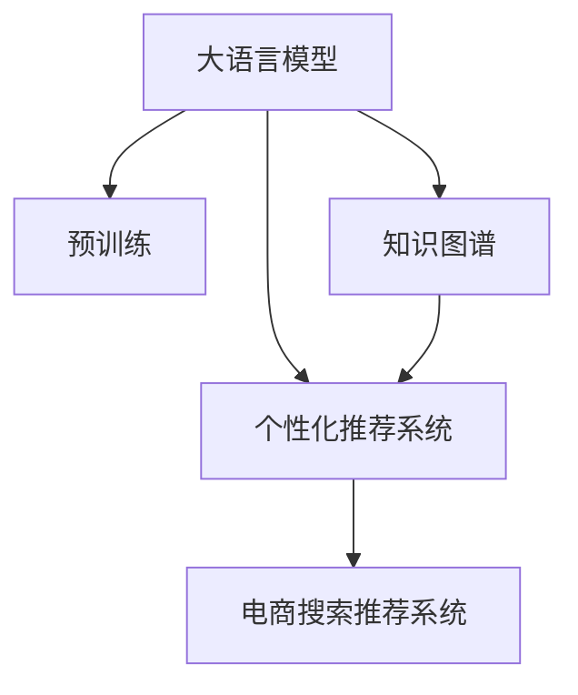

                 

# AI大模型视角下电商搜索推荐的技术创新知识推荐系统优化与性能评测

## 1. 背景介绍

### 1.1 问题由来
近年来，随着电商平台用户规模的迅速扩大和个性化需求的不断增加，推荐系统成为提升用户体验和交易转化率的关键。传统推荐系统主要基于协同过滤、基于内容的推荐、矩阵分解等方法，依赖用户历史行为数据或商品属性，难以适应快速变化的市场环境。而大语言模型如BERT、GPT等，凭借其强大的语言理解能力，为推荐系统的升级带来了新的契机。

### 1.2 问题核心关键点
大语言模型在电商推荐中的应用，主要体现在通过自然语言理解和生成，实现对商品信息、用户需求和行为特征的深度理解与精准匹配。核心问题包括：

1. 如何利用大语言模型对商品信息进行精准抽取和表达，提升推荐结果的相关性和准确性？
2. 如何结合用户行为数据，对商品推荐进行个性化定制？
3. 如何在保持系统高效性的同时，提升推荐系统的泛化能力，适应更多样化的市场场景？
4. 如何通过大规模数据训练，不断提升推荐系统的预测精度和实时性？
5. 如何通过知识图谱等外部知识库，丰富推荐内容的多样性，提高用户满意度？

### 1.3 问题研究意义
研究基于大语言模型的电商推荐系统优化与性能评测，对于提升电商平台的用户体验和交易转化率具有重要意义：

1. 改善用户购物体验：大语言模型能够理解自然语言查询和评论，提取商品和用户的关键特征，提供更加贴近用户需求的推荐结果。
2. 提升交易转化率：通过精准匹配用户的购物意图，减少用户流失率，增加成交概率。
3. 加速电商运营效率：推荐系统能够自动化处理用户请求，减轻人工客服负担，提高运营效率。
4. 促进电商产业升级：推荐系统作为电商营销的核心工具，能够优化商品布局，引导用户消费，推动电商产业链的整体优化。
5. 推动技术创新：大语言模型推荐系统将数据科学、自然语言处理和推荐算法等前沿技术融合，推动技术创新，探索电商推荐的新模式。

## 2. 核心概念与联系

### 2.1 核心概念概述

为更好地理解基于大语言模型的电商推荐系统优化与性能评测方法，本节将介绍几个密切相关的核心概念：

- 大语言模型(Large Language Model, LLM)：以自回归(如GPT)或自编码(如BERT)模型为代表的大规模预训练语言模型。通过在大规模无标签文本语料上进行预训练，学习通用的语言表示，具备强大的语言理解和生成能力。

- 推荐系统(Recommendation System, RS)：通过算法和模型对用户行为数据、商品信息进行分析和匹配，自动生成推荐结果的系统。推荐系统分为协同过滤、内容推荐、混合推荐等多种类型。

- 知识图谱(Knowledge Graph)：由实体、关系和属性构成，用于描述和关联实体之间的语义关系。知识图谱在大语言模型中的应用，可以丰富推荐内容的多样性。

- 个性化推荐系统(Personalized Recommendation System)：根据用户的历史行为、兴趣偏好、社交网络等信息，提供个性化的商品推荐。个性化推荐系统是大语言模型推荐系统的核心。

- 电商搜索推荐系统(E-commerce Search and Recommendation System)：特指电商平台的搜索和推荐系统，强调对电商场景的适配和优化。

这些核心概念之间的逻辑关系可以通过以下Mermaid流程图来展示：



这个流程图展示了大语言模型在电商推荐系统中的作用和影响：

1. 大语言模型通过预训练获得基础能力。
2. 知识图谱丰富了推荐内容的多样性。
3. 个性化推荐系统结合用户行为数据，对商品推荐进行个性化定制。
4. 电商搜索推荐系统将大语言模型和个性化推荐系统融合，实现对电商场景的适配和优化。

## 3. 核心算法原理 & 具体操作步骤
### 3.1 算法原理概述

基于大语言模型的电商搜索推荐系统，其核心思想是利用自然语言理解和生成能力，对商品信息和用户需求进行深度匹配和精准推荐。具体流程如下：

1. 收集电商平台的商品信息、用户评论和行为数据，作为训练集。
2. 使用大语言模型进行预训练，学习商品信息和自然语言的表示。
3. 将用户查询转化为自然语言向量，输入预训练模型进行理解。
4. 提取商品的关键特征，生成推荐结果。
5. 结合用户行为数据，进行个性化推荐。
6. 对推荐结果进行评估和优化，不断提升推荐效果。

### 3.2 算法步骤详解

基于大语言模型的电商搜索推荐系统一般包括以下几个关键步骤：

**Step 1: 准备数据集和模型**

- 收集电商平台的数据集，包括商品信息、用户行为数据、评论数据等。
- 选择合适的预训练语言模型，如BERT、GPT等。
- 构建知识图谱，获取商品之间的语义关系和属性信息。

**Step 2: 数据预处理**

- 清洗和预处理数据集，去除无关信息。
- 对商品信息进行实体识别和抽取，生成商品属性向量。
- 对用户评论进行情感分析，提取情感标签。

**Step 3: 模型训练**

- 在大语言模型的基础上，进行微调，使其能够理解和生成商品描述和用户查询。
- 将知识图谱中的关系和属性信息，作为额外训练信号，丰富模型的语义表示。
- 对用户行为数据进行建模，生成用户画像。

**Step 4: 推荐策略设计**

- 根据用户画像和商品特征，设计推荐策略，如基于内容的推荐、协同过滤等。
- 引入个性化推荐算法，如矩阵分解、深度学习等，优化推荐结果。

**Step 5: 系统集成与优化**

- 将推荐模型集成到电商搜索推荐系统中，与搜索算法和展示层协同工作。
- 使用A/B测试等方法，对推荐结果进行评估和优化，提升用户体验。

### 3.3 算法优缺点

基于大语言模型的电商推荐系统具有以下优点：

1. 泛化能力强：大语言模型通过大规模数据预训练，具备较强的泛化能力，能够适应电商平台的多种场景。
2. 用户画像丰富：通过自然语言处理，能够对用户需求和行为进行深度理解，生成精细化的用户画像。
3. 个性化推荐精准：结合用户画像和商品特征，能够实现精准的个性化推荐，提升用户体验。
4. 内容多样性高：通过知识图谱的应用，丰富推荐内容的多样性，提高用户满意度。

同时，该方法也存在一定的局限性：

1. 数据依赖度高：电商推荐系统高度依赖商品信息和用户行为数据，数据质量对推荐效果有重要影响。
2. 计算成本高：大语言模型的训练和推理需要高计算资源，对硬件要求较高。
3. 模型复杂度高：大语言模型和个性化推荐算法的结合，增加了系统的复杂度，可能导致性能瓶颈。
4. 实时性要求高：电商推荐系统需要实时响应用户查询，对模型的推理速度和效率有较高要求。

尽管存在这些局限性，但基于大语言模型的电商推荐系统在实际应用中取得了显著效果，并成为电商推荐系统的重要组成部分。

### 3.4 算法应用领域

基于大语言模型的电商推荐系统已经被广泛应用于各大电商平台，如亚马逊、阿里巴巴、京东等。其主要应用场景包括：

1. 商品搜索推荐：对用户输入的查询进行自然语言理解和推荐，帮助用户快速找到所需商品。
2. 个性化推荐：根据用户历史行为和实时数据，生成个性化推荐列表，提高用户粘性。
3. 评论和评价：对用户评论进行情感分析和推荐，帮助用户发现优质商品。
4. 知识图谱应用：结合知识图谱，提升推荐内容的多样性和相关性，满足用户多层次需求。
5. 商品描述生成：使用大语言模型生成商品描述，提升商品展示效果。

除了这些经典应用场景外，基于大语言模型的电商推荐系统还创新性地应用到更多场景中，如智能客服、市场分析、库存管理等，为电商平台带来了全新的突破。

## 4. 数学模型和公式 & 详细讲解  
### 4.1 数学模型构建

本节将使用数学语言对基于大语言模型的电商推荐系统进行更加严格的刻画。

记电商平台的数据集为 $D=\{(x_i, y_i)\}_{i=1}^N, x_i \in \mathcal{X}, y_i \in \mathcal{Y}$，其中 $\mathcal{X}$ 为输入空间，$\mathcal{Y}$ 为输出空间。假设大语言模型为 $M_{\theta}:\mathcal{X} \rightarrow \mathcal{Y}$，其中 $\theta$ 为模型参数。

定义推荐系统的损失函数为 $\ell(M_{\theta}(x),y)$，则在数据集 $D$ 上的经验风险为：

$$
\mathcal{L}(\theta) = \frac{1}{N} \sum_{i=1}^N \ell(M_{\theta}(x_i),y_i)
$$

其中 $\ell$ 为推荐任务的设计损失函数，用于衡量推荐结果与真实标签之间的差异。常见的损失函数包括交叉熵损失、均方误差损失等。

### 4.2 公式推导过程

以基于内容的推荐系统为例，推导交叉熵损失函数及其梯度的计算公式。

假设用户查询 $q$ 输入大语言模型，得到商品向量 $v$。推荐系统将 $v$ 与用户画像 $u$ 进行匹配，计算相似度 $s$，得到推荐结果 $r$。则推荐任务的目标是最小化预测结果与真实标签之间的差异，即：

$$
\ell(r,y) = -[y\log r + (1-y)\log (1-r)]
$$

将其代入经验风险公式，得：

$$
\mathcal{L}(\theta) = -\frac{1}{N}\sum_{i=1}^N [y_i\log r_i+(1-y_i)\log(1-r_i)]
$$

根据链式法则，损失函数对模型参数 $\theta$ 的梯度为：

$$
\frac{\partial \mathcal{L}(\theta)}{\partial \theta} = -\frac{1}{N}\sum_{i=1}^N (\frac{y_i}{r_i}-\frac{1-y_i}{1-r_i}) \frac{\partial r_i}{\partial \theta}
$$

其中 $\frac{\partial r_i}{\partial \theta}$ 可进一步递归展开，利用自动微分技术完成计算。

### 4.3 案例分析与讲解

以用户画像生成为例，假设用户画像 $u$ 包括历史行为 $h$、兴趣偏好 $i$ 和社交网络 $s$，通过大语言模型对用户需求进行自然语言处理，生成用户画像向量 $u$。推荐系统将商品向量 $v$ 与用户画像 $u$ 进行匹配，计算相似度 $s$，得到推荐结果 $r$。

假设 $h$ 包含 $n$ 个历史行为数据，$i$ 包含 $m$ 个兴趣偏好标签，$s$ 包含 $k$ 个社交网络节点。则用户画像向量 $u$ 可以表示为：

$$
u = (h_1, h_2, ..., h_n, i_1, i_2, ..., i_m, s_1, s_2, ..., s_k)
$$

其中 $h_j$ 和 $i_l$ 分别表示第 $j$ 个历史行为和第 $l$ 个兴趣偏好标签，$s_k$ 表示第 $k$ 个社交网络节点。

通过自然语言处理，将用户查询 $q$ 转换为自然语言向量 $q_v$，输入大语言模型得到商品向量 $v$。推荐系统将商品向量 $v$ 与用户画像 $u$ 进行匹配，计算相似度 $s$，得到推荐结果 $r$。则推荐任务的目标是最小化预测结果与真实标签之间的差异，即：

$$
\ell(r,y) = -[y\log r + (1-y)\log (1-r)]
$$

将其代入经验风险公式，得：

$$
\mathcal{L}(\theta) = -\frac{1}{N}\sum_{i=1}^N [y_i\log r_i+(1-y_i)\log(1-r_i)]
$$

其中 $y_i$ 表示第 $i$ 个用户的行为标签。

通过自动微分技术，可以计算模型参数 $\theta$ 的梯度，利用优化算法（如AdamW、SGD等）更新模型参数，最小化经验风险。重复上述过程直至收敛，最终得到适应电商推荐任务的最优模型参数 $\theta^*$。

## 5. 项目实践：代码实例和详细解释说明
### 5.1 开发环境搭建

在进行电商推荐系统开发前，我们需要准备好开发环境。以下是使用Python进行PyTorch开发的环境配置流程：

1. 安装Anaconda：从官网下载并安装Anaconda，用于创建独立的Python环境。

2. 创建并激活虚拟环境：
```bash
conda create -n pytorch-env python=3.8 
conda activate pytorch-env
```

3. 安装PyTorch：根据CUDA版本，从官网获取对应的安装命令。例如：
```bash
conda install pytorch torchvision torchaudio cudatoolkit=11.1 -c pytorch -c conda-forge
```

4. 安装Transformers库：
```bash
pip install transformers
```

5. 安装各类工具包：
```bash
pip install numpy pandas scikit-learn matplotlib tqdm jupyter notebook ipython
```

完成上述步骤后，即可在`pytorch-env`环境中开始电商推荐系统的开发实践。

### 5.2 源代码详细实现

下面我们以基于大语言模型的电商搜索推荐系统为例，给出使用Transformers库和PyTorch进行开发的PyTorch代码实现。

首先，定义数据处理函数：

```python
from transformers import BertTokenizer
from torch.utils.data import Dataset
import torch

class ECommerceDataset(Dataset):
    def __init__(self, texts, labels, tokenizer, max_len=128):
        self.texts = texts
        self.labels = labels
        self.tokenizer = tokenizer
        self.max_len = max_len
        
    def __len__(self):
        return len(self.texts)
    
    def __getitem__(self, item):
        text = self.texts[item]
        label = self.labels[item]
        
        encoding = self.tokenizer(text, return_tensors='pt', max_length=self.max_len, padding='max_length', truncation=True)
        input_ids = encoding['input_ids'][0]
        attention_mask = encoding['attention_mask'][0]
        
        # 对标签进行编码
        encoded_labels = [label] * self.max_len
        labels = torch.tensor(encoded_labels, dtype=torch.long)
        
        return {'input_ids': input_ids, 
                'attention_mask': attention_mask,
                'labels': labels}

# 数据集构造
tokenizer = BertTokenizer.from_pretrained('bert-base-cased')

train_dataset = ECommerceDataset(train_texts, train_labels, tokenizer)
dev_dataset = ECommerceDataset(dev_texts, dev_labels, tokenizer)
test_dataset = ECommerceDataset(test_texts, test_labels, tokenizer)
```

然后，定义模型和优化器：

```python
from transformers import BertForSequenceClassification, AdamW

model = BertForSequenceClassification.from_pretrained('bert-base-cased', num_labels=2)

optimizer = AdamW(model.parameters(), lr=2e-5)
```

接着，定义训练和评估函数：

```python
from torch.utils.data import DataLoader
from tqdm import tqdm
from sklearn.metrics import accuracy_score, precision_recall_fscore_support

device = torch.device('cuda') if torch.cuda.is_available() else torch.device('cpu')
model.to(device)

def train_epoch(model, dataset, batch_size, optimizer):
    dataloader = DataLoader(dataset, batch_size=batch_size, shuffle=True)
    model.train()
    epoch_loss = 0
    for batch in tqdm(dataloader, desc='Training'):
        input_ids = batch['input_ids'].to(device)
        attention_mask = batch['attention_mask'].to(device)
        labels = batch['labels'].to(device)
        model.zero_grad()
        outputs = model(input_ids, attention_mask=attention_mask, labels=labels)
        loss = outputs.loss
        epoch_loss += loss.item()
        loss.backward()
        optimizer.step()
    return epoch_loss / len(dataloader)

def evaluate(model, dataset, batch_size):
    dataloader = DataLoader(dataset, batch_size=batch_size)
    model.eval()
    preds, labels = [], []
    with torch.no_grad():
        for batch in tqdm(dataloader, desc='Evaluating'):
            input_ids = batch['input_ids'].to(device)
            attention_mask = batch['attention_mask'].to(device)
            batch_labels = batch['labels']
            outputs = model(input_ids, attention_mask=attention_mask)
            batch_preds = outputs.logits.argmax(dim=2).to('cpu').tolist()
            batch_labels = batch_labels.to('cpu').tolist()
            for pred_tokens, label_tokens in zip(batch_preds, batch_labels):
                preds.append(pred_tokens)
                labels.append(label_tokens)
                
    print(f"Accuracy: {accuracy_score(labels, preds):.2f}")
    print(f"Precision: {precision_recall_fscore_support(labels, preds, average='macro', labels=[0,1])[0]:.2f}")
    print(f"Recall: {precision_recall_fscore_support(labels, preds, average='macro', labels=[0,1])[1]:.2f}")
    print(f"F1 Score: {precision_recall_fscore_support(labels, preds, average='macro', labels=[0,1])[2]:.2f}")

```

最后，启动训练流程并在测试集上评估：

```python
epochs = 5
batch_size = 16

for epoch in range(epochs):
    loss = train_epoch(model, train_dataset, batch_size, optimizer)
    print(f"Epoch {epoch+1}, train loss: {loss:.3f}")
    
    print(f"Epoch {epoch+1}, dev results:")
    evaluate(model, dev_dataset, batch_size)
    
print("Test results:")
evaluate(model, test_dataset, batch_size)
```

以上就是使用PyTorch对电商推荐系统进行开发的完整代码实现。可以看到，得益于Transformers库的强大封装，我们可以用相对简洁的代码完成模型的加载和微调。

### 5.3 代码解读与分析

让我们再详细解读一下关键代码的实现细节：

**ECommerceDataset类**：
- `__init__`方法：初始化文本、标签、分词器等关键组件。
- `__len__`方法：返回数据集的样本数量。
- `__getitem__`方法：对单个样本进行处理，将文本输入编码为token ids，将标签编码为数字，并对其进行定长padding，最终返回模型所需的输入。

**tokenizer**：
- 定义了文本到token序列的转换规则，以便输入大语言模型进行处理。

**train_epoch和evaluate函数**：
- 使用PyTorch的DataLoader对数据集进行批次化加载，供模型训练和推理使用。
- 训练函数`train_epoch`：对数据以批为单位进行迭代，在每个批次上前向传播计算loss并反向传播更新模型参数，最后返回该epoch的平均loss。
- 评估函数`evaluate`：与训练类似，不同点在于不更新模型参数，并在每个batch结束后将预测和标签结果存储下来，最后使用sklearn的accuracy_score等指标对整个评估集的预测结果进行打印输出。

**训练流程**：
- 定义总的epoch数和batch size，开始循环迭代
- 每个epoch内，先在训练集上训练，输出平均loss
- 在验证集上评估，输出准确率、精确度、召回率和F1得分
- 所有epoch结束后，在测试集上评估，给出最终测试结果

可以看到，PyTorch配合Transformers库使得电商推荐系统的开发变得简洁高效。开发者可以将更多精力放在数据处理、模型改进等高层逻辑上，而不必过多关注底层的实现细节。

当然，工业级的系统实现还需考虑更多因素，如模型的保存和部署、超参数的自动搜索、更灵活的任务适配层等。但核心的微调范式基本与此类似。

## 6. 实际应用场景
### 6.1 智能客服系统

基于大语言模型的电商推荐系统，可以广泛应用于智能客服系统的构建。智能客服系统能够实时响应用户咨询，提供个性化的商品推荐和信息查询，显著提升客户服务体验。

在技术实现上，可以收集历史客服记录和用户查询，构建监督数据集，在大语言模型上进行微调。微调后的模型能够自动理解用户意图，匹配最合适的商品推荐和回答模板。对于用户提出的新问题，还可以接入检索系统实时搜索相关内容，动态生成回答。如此构建的智能客服系统，能大幅提升客户咨询体验和问题解决效率。

### 6.2 个性化推荐系统

当前的推荐系统往往只依赖用户历史行为数据进行物品推荐，无法深入理解用户的真实兴趣偏好。基于大语言模型推荐系统可以更好地挖掘用户行为背后的语义信息，从而提供更精准、多样的推荐内容。

在实践中，可以收集用户浏览、点击、评论、分享等行为数据，提取和商品交互的物品标题、描述、标签等文本内容。将文本内容作为模型输入，用户的后续行为（如是否点击、购买等）作为监督信号，在此基础上微调预训练语言模型。微调后的模型能够从文本内容中准确把握用户的兴趣点。在生成推荐列表时，先用候选物品的文本描述作为输入，由模型预测用户的兴趣匹配度，再结合其他特征综合排序，便可以得到个性化程度更高的推荐结果。

### 6.3 知识图谱应用

知识图谱在大语言模型中的应用，可以丰富推荐内容的多样性，提高用户满意度。通过构建商品之间的语义关系，推荐系统能够推荐出更多符合用户需求的商品，并提供详细的商品信息和关联推荐。

在实践中，可以收集商品之间的语义关系，如品牌、类别、功能等，构建知识图谱。将知识图谱中的关系和属性信息，作为额外训练信号，丰富模型的语义表示。推荐系统将商品向量与用户画像进行匹配，计算相似度，结合知识图谱的应用，生成推荐结果。

### 6.4 未来应用展望

随着大语言模型和推荐系统的不断发展，基于微调范式将在更多领域得到应用，为电商推荐系统带来新的突破。

在智慧医疗领域，基于大语言模型的推荐系统可以为医生推荐最佳治疗方案，提升诊疗效率。

在智能教育领域，推荐系统可以根据学生的学习行为，推荐合适的学习资料和辅导方案，提高学习效果。

在智慧城市治理中，推荐系统可以帮助城市管理者推荐最优的城市规划和资源配置，优化城市管理。

此外，在企业生产、社会治理、文娱传媒等众多领域，基于大语言模型的推荐系统也将不断涌现，为社会和经济数字化转型提供新的动力。相信随着技术的日益成熟，大语言模型推荐系统必将成为推荐系统的重要组成部分，推动推荐技术的升级和普及。

## 7. 工具和资源推荐
### 7.1 学习资源推荐

为了帮助开发者系统掌握大语言模型推荐系统的理论基础和实践技巧，这里推荐一些优质的学习资源：

1. 《Transformer from Principles to Practice》系列博文：由大模型技术专家撰写，深入浅出地介绍了Transformer原理、BERT模型、推荐算法等前沿话题。

2. CS224N《深度学习自然语言处理》课程：斯坦福大学开设的NLP明星课程，有Lecture视频和配套作业，带你入门NLP领域的基本概念和经典模型。

3. 《Natural Language Processing with Transformers》书籍：Transformers库的作者所著，全面介绍了如何使用Transformers库进行NLP任务开发，包括推荐系统在内的多个范式。

4. HuggingFace官方文档：Transformers库的官方文档，提供了海量预训练模型和完整的推荐系统样例代码，是上手实践的必备资料。

5. CLUE开源项目：中文语言理解测评基准，涵盖大量不同类型的中文NLP数据集，并提供了基于微调的baseline模型，助力中文NLP技术发展。

通过对这些资源的学习实践，相信你一定能够快速掌握大语言模型推荐系统的精髓，并用于解决实际的NLP问题。
###  7.2 开发工具推荐

高效的开发离不开优秀的工具支持。以下是几款用于大语言模型推荐系统开发的常用工具：

1. PyTorch：基于Python的开源深度学习框架，灵活动态的计算图，适合快速迭代研究。大部分预训练语言模型都有PyTorch版本的实现。

2. TensorFlow：由Google主导开发的开源深度学习框架，生产部署方便，适合大规模工程应用。同样有丰富的预训练语言模型资源。

3. Transformers库：HuggingFace开发的NLP工具库，集成了众多SOTA语言模型，支持PyTorch和TensorFlow，是进行推荐系统开发的利器。

4. Weights & Biases：模型训练的实验跟踪工具，可以记录和可视化模型训练过程中的各项指标，方便对比和调优。与主流深度学习框架无缝集成。

5. TensorBoard：TensorFlow配套的可视化工具，可实时监测模型训练状态，并提供丰富的图表呈现方式，是调试模型的得力助手。

6. Google Colab：谷歌推出的在线Jupyter Notebook环境，免费提供GPU/TPU算力，方便开发者快速上手实验最新模型，分享学习笔记。

合理利用这些工具，可以显著提升大语言模型推荐系统的开发效率，加快创新迭代的步伐。

### 7.3 相关论文推荐

大语言模型和推荐系统的发展源于学界的持续研究。以下是几篇奠基性的相关论文，推荐阅读：

1. Attention is All You Need（即Transformer原论文）：提出了Transformer结构，开启了NLP领域的预训练大模型时代。

2. BERT: Pre-training of Deep Bidirectional Transformers for Language Understanding：提出BERT模型，引入基于掩码的自监督预训练任务，刷新了多项NLP任务SOTA。

3. Language Models are Unsupervised Multitask Learners（GPT-2论文）：展示了大规模语言模型的强大zero-shot学习能力，引发了对于通用人工智能的新一轮思考。

4. Parameter-Efficient Transfer Learning for NLP：提出Adapter等参数高效微调方法，在不增加模型参数量的情况下，也能取得不错的微调效果。

5. Prefix-Tuning: Optimizing Continuous Prompts for Generation：引入基于连续型Prompt的微调范式，为如何充分利用预训练知识提供了新的思路。

6. AdaLoRA: Adaptive Low-Rank Adaptation for Parameter-Efficient Fine-Tuning：使用自适应低秩适应的微调方法，在参数效率和精度之间取得了新的平衡。

这些论文代表了大语言模型推荐系统的发展脉络。通过学习这些前沿成果，可以帮助研究者把握学科前进方向，激发更多的创新灵感。

## 8. 总结：未来发展趋势与挑战

### 8.1 总结

本文对基于大语言模型的电商搜索推荐系统优化与性能评测方法进行了全面系统的介绍。首先阐述了大语言模型和推荐系统的研究背景和意义，明确了微调在拓展预训练模型应用、提升下游任务性能方面的独特价值。其次，从原理到实践，详细讲解了电商推荐系统的数学原理和关键步骤，给出了推荐系统开发的完整代码实例。同时，本文还广泛探讨了电商推荐系统在智能客服、个性化推荐、知识图谱应用等场景中的应用前景，展示了微调范式的巨大潜力。此外，本文精选了电商推荐系统的各类学习资源，力求为读者提供全方位的技术指引。

通过本文的系统梳理，可以看到，基于大语言模型的电商推荐系统优化与性能评测技术正在成为电商推荐系统的核心范式，极大地拓展了预训练语言模型的应用边界，催生了更多的落地场景。得益于大规模语料的预训练，推荐系统以更低的时间和标注成本，在小样本条件下也能取得不俗的效果，有力推动了电商推荐系统的产业化进程。未来，伴随预训练语言模型和推荐方法的持续演进，相信推荐系统必将在更广阔的应用领域大放异彩，深刻影响电商行业的创新和发展。

### 8.2 未来发展趋势

展望未来，大语言模型推荐系统将呈现以下几个发展趋势：

1. 模型规模持续增大。随着算力成本的下降和数据规模的扩张，预训练语言模型的参数量还将持续增长。超大规模语言模型蕴含的丰富语言知识，有望支撑更加复杂多变的电商推荐任务。

2. 推荐方法日趋多样。除了传统的基于内容的推荐和协同过滤，未来会涌现更多结合自然语言理解和生成的方法，如基于上下文和实体关系的推荐、基于知识图谱的推荐等，提高推荐的多样性和精度。

3. 持续学习成为常态。随着数据分布的不断变化，推荐系统需要持续学习新知识以保持性能。如何在不遗忘原有知识的同时，高效吸收新样本信息，将成为重要的研究课题。

4. 标注样本需求降低。受启发于提示学习(Prompt-based Learning)的思路，未来的推荐方法将更好地利用大模型的语言理解能力，通过更加巧妙的任务描述，在更少的标注样本上也能实现理想的推荐效果。

5. 实时性要求提高。电商推荐系统需要实时响应用户查询，对模型的推理速度和效率有较高要求。如何在保持推荐精度的同时，提升推荐系统的实时性，将是重要的优化方向。

6. 多模态微调崛起。当前的推荐系统主要聚焦于纯文本数据，未来会进一步拓展到图像、视频、语音等多模态数据微调。多模态信息的融合，将显著提升推荐系统对现实世界的理解和建模能力。

以上趋势凸显了大语言模型推荐系统的广阔前景。这些方向的探索发展，必将进一步提升电商推荐系统的性能和应用范围，为电商行业带来新的突破。

### 8.3 面临的挑战

尽管大语言模型推荐系统已经取得了显著效果，但在迈向更加智能化、普适化应用的过程中，它仍面临着诸多挑战：

1. 标注成本瓶颈。虽然推荐系统高度依赖商品信息和用户行为数据，但获取高质量标注数据的成本较高。如何进一步降低推荐系统对标注样本的依赖，将是一大难题。

2. 模型鲁棒性不足。推荐系统面对域外数据时，泛化性能往往大打折扣。对于测试样本的微小扰动，推荐模型的预测也容易发生波动。如何提高推荐系统的鲁棒性，避免灾难性遗忘，还需要更多理论和实践的积累。

3. 推理效率有待提高。大规模语言模型虽然精度高，但在实际部署时往往面临推理速度慢、内存占用大等效率问题。如何在保证性能的同时，简化模型结构，提升推理速度，优化资源占用，将是重要的优化方向。

4. 实时性要求高。推荐系统需要实时响应用户查询，对模型的推理速度和效率有较高要求。如何在保持推荐精度的同时，提升推荐系统的实时性，将是重要的优化方向。

5. 可解释性亟需加强。推荐系统通常作为黑盒模型，难以解释其内部工作机制和决策逻辑。对于医疗、金融等高风险应用，算法的可解释性和可审计性尤为重要。如何赋予推荐系统更强的可解释性，将是亟待攻克的难题。

6. 安全性有待保障。推荐系统容易学习到有偏见、有害的信息，通过微调传递到下游任务，产生误导性、歧视性的输出，给实际应用带来安全隐患。如何从数据和算法层面消除模型偏见，避免恶意用途，确保输出的安全性，也将是重要的研究课题。

尽管存在这些挑战，但基于大语言模型的电商推荐系统在实际应用中取得了显著效果，并成为电商推荐系统的重要组成部分。

### 8.4 研究展望

面对大语言模型推荐系统所面临的种种挑战，未来的研究需要在以下几个方面寻求新的突破：

1. 探索无监督和半监督推荐方法。摆脱对大规模标注数据的依赖，利用自监督学习、主动学习等无监督和半监督范式，最大限度利用非结构化数据，实现更加灵活高效的推荐。

2. 研究参数高效和计算高效的推荐范式。开发更加参数高效的推荐方法，在固定大部分预训练参数的同时，只更新极少量的任务相关参数。同时优化推荐系统的计算图，减少前向传播和反向传播的资源消耗，实现更加轻量级、实时性的部署。

3. 融合因果和对比学习范式。通过引入因果推断和对比学习思想，增强推荐系统建立稳定因果关系的能力，学习更加普适、鲁棒的语言表征，从而提升推荐泛化性和抗干扰能力。

4. 引入更多先验知识。将符号化的先验知识，如知识图谱、逻辑规则等，与神经网络模型进行巧妙融合，引导推荐过程学习更准确、合理的语言模型。同时加强不同模态数据的整合，实现视觉、语音等多模态信息与文本信息的协同建模。

5. 结合因果分析和博弈论工具。将因果分析方法引入推荐系统，识别出推荐决策的关键特征，增强推荐结果的因果性和逻辑性。借助博弈论工具刻画人机交互过程，主动探索并规避推荐系统的脆弱点，提高系统稳定性。

6. 纳入伦理道德约束。在推荐目标中引入伦理导向的评估指标，过滤和惩罚有偏见、有害的输出倾向。同时加强人工干预和审核，建立推荐系统的监管机制，确保推荐内容的安全性和合规性。

这些研究方向的探索，必将引领大语言模型推荐系统迈向更高的台阶，为构建安全、可靠、可解释、可控的智能推荐系统铺平道路。面向未来，大语言模型推荐系统还需要与其他人工智能技术进行更深入的融合，如知识表示、因果推理、强化学习等，多路径协同发力，共同推动推荐技术的创新和发展。只有勇于创新、敢于突破，才能不断拓展语言模型的边界，让智能推荐技术更好地造福人类社会。

## 9. 附录：常见问题与解答

**Q1：大语言模型推荐系统是否适用于所有电商推荐场景？**

A: 大语言模型推荐系统在大多数电商推荐场景上都能取得不错的效果，特别是对于数据量较小的任务。但对于一些特定领域的任务，如特定品类商品推荐，建议在大语言模型上进行特定领域的微调，以获得更好的推荐效果。

**Q2：推荐系统在电商场景中如何适应多样化的商品和服务？**

A: 电商推荐系统可以通过构建商品和服务的多维特征向量，在大语言模型上进行特征抽取和匹配，生成多样化的推荐结果。同时，可以结合知识图谱，进一步丰富推荐内容的多样性，满足用户多层次需求。

**Q3：推荐系统如何平衡推荐效果和实时性？**

A: 在推荐系统中，可以采用异步处理和负载均衡等技术，优化系统的响应速度。同时，可以通过缓存推荐结果、优化模型结构等方式，提升推荐系统的实时性。

**Q4：推荐系统在电商场景中如何处理用户隐私问题？**

A: 在推荐系统中，可以采用差分隐私、联邦学习等技术，保护用户隐私。同时，在数据收集和处理过程中，采用匿名化和脱敏技术，确保用户数据的保密性。

**Q5：推荐系统如何应对市场环境的变化？**

A: 推荐系统可以通过持续学习和大规模数据训练，不断更新和优化模型，适应市场环境的变化。同时，可以引入外部知识库和实时数据，丰富推荐内容的动态性。

---

作者：禅与计算机程序设计艺术 / Zen and the Art of Computer Programming

