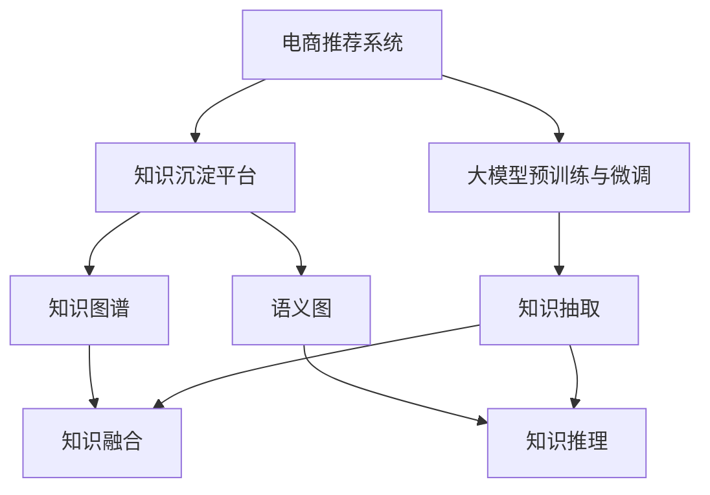

                 

# AI大模型视角下电商搜索推荐的技术创新知识沉淀平台功能优化

## 1. 背景介绍

随着互联网电商市场的飞速发展，个性化推荐系统在电商搜索和推荐场景中扮演着越来越重要的角色。基于大模型的推荐系统已经在电商平台中得到广泛应用，大幅提升了用户体验和运营效率。但同时，这些系统也对算力、数据存储和网络带宽提出了更高的要求。如何在保证推荐质量的同时，提升系统的稳定性、可扩展性和可维护性，成为了电商推荐系统的核心挑战。

知识沉淀平台是一种新兴的智能系统，旨在为电商推荐系统提供更强大的知识管理能力和模型优化支持。本文将从大模型的视角出发，探讨如何通过知识沉淀平台的优化，提高电商搜索推荐的精度和效果，同时降低资源成本，增强系统的可扩展性和可维护性。

## 2. 核心概念与联系

### 2.1 核心概念概述

为了更好地理解知识沉淀平台在电商推荐系统中的应用，本节将介绍几个关键概念及其相互关系：

- **电商推荐系统**：通过机器学习算法，根据用户历史行为和物品属性，推荐用户可能感兴趣的商品或服务的系统。大模型的预训练-微调范式使得电商推荐系统能够更好地捕捉商品间的语义关系，实现更加精准的推荐。

- **知识沉淀平台**：一种基于知识图谱、语义图等知识表示形式的智能系统，能够自动化地从海量数据中提取出关键知识，并对知识进行聚合、存储和推理，为推荐系统提供知识支持。

- **大模型预训练与微调**：在大规模无标签数据上进行预训练，然后在特定任务上通过有监督微调优化模型的性能。大模型预训练获取的知识可被知识沉淀平台借鉴，用于提升推荐系统的知识管理能力。

- **AI知识图谱**：一种利用图结构描述知识信息的表示方式，包含实体、关系和属性等信息。知识沉淀平台可利用AI知识图谱进行知识表示和推理，优化推荐系统的决策过程。

- **语义图**：基于语义关系构建的图结构，能够更好地表示文本信息中的语义关系，便于知识沉淀平台提取和推理知识。

### 2.2 核心概念原理和架构的 Mermaid 流程图



通过上述流程图，我们可以更好地理解电商推荐系统与知识沉淀平台的关系：

1. **电商推荐系统**：基于大模型预训练与微调，为用户提供个性化推荐服务。
2. **知识沉淀平台**：通过知识图谱、语义图等知识表示形式，辅助电商推荐系统提取和利用知识，提升推荐精度和效果。
3. **知识抽取**：将电商推荐系统中的数据转换为结构化的知识形式，便于知识沉淀平台理解和推理。
4. **知识融合**：将不同来源的知识进行聚合，形成更加全面、准确的知识表示。
5. **知识推理**：利用知识图谱和语义图，进行知识推理和模式匹配，优化推荐算法。

这些概念之间的相互联系，构成了知识沉淀平台在电商推荐系统中的应用框架，使得平台能够更好地支持电商推荐系统的知识管理和模型优化。

## 3. 核心算法原理 & 具体操作步骤

### 3.1 算法原理概述

知识沉淀平台的优化主要围绕以下几个核心算法和操作步骤：

1. **知识抽取**：将电商推荐系统中的数据转换为结构化的知识形式，便于知识沉淀平台进行推理和利用。
2. **知识融合**：将不同来源的知识进行聚合，形成更加全面、准确的知识表示。
3. **知识推理**：利用知识图谱和语义图，进行知识推理和模式匹配，优化推荐算法。
4. **知识注入**：将知识沉淀平台提取的知识注入到电商推荐系统中，提升推荐精度和效果。
5. **模型优化**：利用知识注入后的数据，对电商推荐系统进行模型优化和参数微调，提升模型性能。

这些步骤涉及的知识抽取、知识融合、知识推理等算法，将共同构成知识沉淀平台的知识管理核心，为电商推荐系统提供更强大的知识支持。

### 3.2 算法步骤详解

#### 3.2.1 知识抽取

知识抽取的目的是将电商推荐系统中的数据转换为结构化的知识形式，便于知识沉淀平台进行推理和利用。具体步骤如下：

1. **数据预处理**：清洗电商推荐系统中的数据，去除噪音和不相关数据。
2. **实体识别**：利用实体识别算法，识别出文本中的实体信息，如商品名称、类别、价格等。
3. **关系抽取**：利用关系抽取算法，识别出实体之间的关系，如商品之间的相似度、用户偏好等。
4. **属性抽取**：利用属性抽取算法，识别出实体的属性信息，如商品价格、评分等。

#### 3.2.2 知识融合

知识融合的目的是将不同来源的知识进行聚合，形成更加全面、准确的知识表示。具体步骤如下：

1. **知识对齐**：将不同来源的知识进行对齐，消除数据不一致性。
2. **知识聚合**：利用知识聚合算法，将对齐后的知识进行整合，形成结构化的知识表示。
3. **知识表示**：将聚合后的知识表示为知识图谱、语义图等形式，便于后续推理和利用。

#### 3.2.3 知识推理

知识推理的目的是利用知识图谱和语义图，进行知识推理和模式匹配，优化推荐算法。具体步骤如下：

1. **推理规划**：根据用户查询和推荐需求，设计推理规则和路径。
2. **模式匹配**：在知识图谱和语义图中，匹配推理规则和路径，寻找相关实体和关系。
3. **结果生成**：根据匹配结果，生成推荐列表。

#### 3.2.4 知识注入

知识注入的目的是将知识沉淀平台提取的知识注入到电商推荐系统中，提升推荐精度和效果。具体步骤如下：

1. **知识注入模型**：选择合适的模型，将注入的知识转化为推荐特征。
2. **特征融合**：将注入的特征与原始特征进行融合，形成综合特征表示。
3. **模型优化**：利用注入的知识和特征，对电商推荐系统进行模型优化和参数微调。

#### 3.2.5 模型优化

模型优化的目的是提升电商推荐系统的性能和效果。具体步骤如下：

1. **损失函数设计**：根据推荐任务设计合适的损失函数，衡量推荐结果与真实标签之间的差异。
2. **优化算法选择**：选择合适的优化算法，如Adam、SGD等，设置学习率、批大小等超参数。
3. **正则化技术**：引入正则化技术，如L2正则、Dropout等，防止过拟合。
4. **迭代优化**：通过迭代优化，最小化损失函数，更新模型参数，提升推荐效果。

### 3.3 算法优缺点

知识沉淀平台的优化算法具有以下优点：

1. **提高推荐精度**：通过知识注入和特征融合，提升推荐系统对用户需求的理解和匹配能力。
2. **增强可解释性**：知识注入后的模型更容易理解和解释，便于开发者调试和优化。
3. **降低资源成本**：通过知识融合和推理，减少推荐系统对实时数据的需求，降低计算和存储成本。

同时，也存在一些缺点：

1. **数据复杂性高**：电商数据具有高度复杂性，知识抽取和融合难度较大。
2. **知识提取难度大**：电商数据中隐含的知识需要从海量数据中提取，工作量较大。
3. **模型复杂度高**：知识注入和注入后的模型可能需要较大的计算资源和计算复杂度。

### 3.4 算法应用领域

知识沉淀平台的优化算法在电商推荐系统中具有广泛的应用前景，具体领域如下：

1. **搜索推荐**：提升搜索结果和推荐列表的精度，帮助用户快速找到所需商品。
2. **个性化推荐**：结合用户历史行为和知识推理，实现更加个性化的推荐服务。
3. **用户画像**：通过知识抽取和融合，构建更加全面、准确的用户画像，提升推荐系统的精准度。
4. **商品画像**：通过知识抽取和融合，构建更加全面、准确的商品画像，提升推荐系统的召回率。
5. **多模态融合**：结合文本、图像、音频等多模态数据，提升推荐系统的综合能力。

## 4. 数学模型和公式 & 详细讲解 & 举例说明

### 4.1 数学模型构建

为了更好地理解知识沉淀平台的优化算法，本节将使用数学语言对知识抽取、知识融合、知识推理等关键步骤进行严格刻画。

设电商推荐系统中的数据为 $D=\{(x_i, y_i)\}_{i=1}^N$，其中 $x_i$ 表示用户历史行为或物品属性，$y_i$ 表示推荐结果标签。知识沉淀平台的目标是通过知识抽取、融合、推理等步骤，从 $D$ 中提取关键知识，优化推荐系统。

假设知识沉淀平台从 $D$ 中提取的知识为 $K=\{(k_j, r_j)\}_{j=1}^M$，其中 $k_j$ 表示知识实体，$r_j$ 表示实体间的关系。

### 4.2 公式推导过程

#### 4.2.1 知识抽取

知识抽取的目标是将电商推荐系统中的数据转换为结构化的知识形式，以便于知识沉淀平台进行推理和利用。

设知识抽取模型为 $F_D$，其输入为电商推荐系统中的数据 $D$，输出为结构化的知识 $K_D$。知识抽取过程可以表示为：

$$
K_D = F_D(D)
$$

其中 $F_D$ 可以表示为多个子模型的组合，如实体识别、关系抽取、属性抽取等。每个子模型都需要通过训练获得，并在实际应用中根据具体任务进行调整。

#### 4.2.2 知识融合

知识融合的目标是将不同来源的知识进行聚合，形成更加全面、准确的知识表示。

设知识融合模型为 $F_K$，其输入为多个来源的知识 $K=\{K_j\}_{j=1}^M$，输出为结构化的知识 $K'=\{(k', r')\}_{j=1}^M$。知识融合过程可以表示为：

$$
K' = F_K(K_1, K_2, ..., K_M)
$$

其中 $F_K$ 可以表示为多个子模型的组合，如知识对齐、知识聚合、知识表示等。每个子模型都需要通过训练获得，并在实际应用中根据具体任务进行调整。

#### 4.2.3 知识推理

知识推理的目标是利用知识图谱和语义图，进行知识推理和模式匹配，优化推荐算法。

设知识推理模型为 $F_R$，其输入为结构化的知识 $K'$，输出为推荐结果 $R$。知识推理过程可以表示为：

$$
R = F_R(K')
$$

其中 $F_R$ 可以表示为多个子模型的组合，如推理规划、模式匹配、结果生成等。每个子模型都需要通过训练获得，并在实际应用中根据具体任务进行调整。

### 4.3 案例分析与讲解

#### 4.3.1 电商商品推荐

以电商商品推荐为例，说明知识沉淀平台如何通过知识抽取、融合、推理等步骤，提升推荐系统的效果。

1. **知识抽取**：首先，通过实体识别模型识别出商品名称、类别、价格等信息，通过关系抽取模型识别出商品之间的相似度、用户偏好等信息，通过属性抽取模型识别出商品价格、评分等信息。

2. **知识融合**：将抽取出的知识进行对齐和整合，形成结构化的知识表示。例如，可以将商品类别信息进行对齐和聚合，形成商品分类树；将商品价格信息进行对齐和聚合，形成价格区间等。

3. **知识推理**：根据用户查询和推荐需求，设计推理规则和路径，在知识图谱和语义图中匹配推理规则和路径，寻找相关实体和关系。例如，可以根据用户查询的商品类别，在知识图谱中查找该类别的热门商品；根据用户查询的商品价格区间，在知识图谱中查找该价格区间内的热门商品。

4. **知识注入**：将知识注入到电商推荐系统中，提升推荐精度和效果。例如，可以将知识图中的商品分类树注入到推荐模型中，作为特征进行融合；可以将知识图中的价格区间注入到推荐模型中，作为特征进行融合。

5. **模型优化**：利用注入的知识和特征，对电商推荐系统进行模型优化和参数微调。例如，可以根据注入的知识特征，重新设计推荐模型；可以根据注入的知识特征，调整推荐模型的参数设置。

通过上述步骤，知识沉淀平台能够更好地支持电商推荐系统的知识管理和模型优化，提升推荐精度和效果，降低资源成本。

## 5. 项目实践：代码实例和详细解释说明

### 5.1 开发环境搭建

在进行知识沉淀平台的优化实践前，我们需要准备好开发环境。以下是使用Python进行PyTorch开发的环境配置流程：

1. 安装Anaconda：从官网下载并安装Anaconda，用于创建独立的Python环境。

2. 创建并激活虚拟环境：
```bash
conda create -n pytorch-env python=3.8 
conda activate pytorch-env
```

3. 安装PyTorch：根据CUDA版本，从官网获取对应的安装命令。例如：
```bash
conda install pytorch torchvision torchaudio cudatoolkit=11.1 -c pytorch -c conda-forge
```

4. 安装Transformers库：
```bash
pip install transformers
```

5. 安装各类工具包：
```bash
pip install numpy pandas scikit-learn matplotlib tqdm jupyter notebook ipython
```

完成上述步骤后，即可在`pytorch-env`环境中开始优化实践。

### 5.2 源代码详细实现

这里以电商商品推荐为例，给出使用Transformers库进行知识抽取、融合、推理和注入的PyTorch代码实现。

首先，定义知识抽取函数：

```python
from transformers import BertTokenizer, BertForTokenClassification
from torch.utils.data import Dataset

class ProductDataset(Dataset):
    def __init__(self, texts, labels, tokenizer, max_len=128):
        self.texts = texts
        self.labels = labels
        self.tokenizer = tokenizer
        self.max_len = max_len
        
    def __len__(self):
        return len(self.texts)
    
    def __getitem__(self, item):
        text = self.texts[item]
        label = self.labels[item]
        
        encoding = self.tokenizer(text, return_tensors='pt', max_length=self.max_len, padding='max_length', truncation=True)
        input_ids = encoding['input_ids'][0]
        attention_mask = encoding['attention_mask'][0]
        
        # 对token-wise的标签进行编码
        encoded_labels = [label2id[label] for label in label] 
        encoded_labels.extend([label2id['O']] * (self.max_len - len(encoded_labels)))
        labels = torch.tensor(encoded_labels, dtype=torch.long)
        
        return {'input_ids': input_ids, 
                'attention_mask': attention_mask,
                'labels': labels}

# 标签与id的映射
label2id = {'O': 0, 'B': 1, 'I': 2}

# 创建dataset
tokenizer = BertTokenizer.from_pretrained('bert-base-cased')

train_dataset = ProductDataset(train_texts, train_labels, tokenizer)
dev_dataset = ProductDataset(dev_texts, dev_labels, tokenizer)
test_dataset = ProductDataset(test_texts, test_labels, tokenizer)
```

然后，定义模型和优化器：

```python
from transformers import BertForTokenClassification, AdamW

model = BertForTokenClassification.from_pretrained('bert-base-cased', num_labels=len(label2id))

optimizer = AdamW(model.parameters(), lr=2e-5)
```

接着，定义训练和评估函数：

```python
from torch.utils.data import DataLoader
from tqdm import tqdm
from sklearn.metrics import classification_report

device = torch.device('cuda') if torch.cuda.is_available() else torch.device('cpu')
model.to(device)

def train_epoch(model, dataset, batch_size, optimizer):
    dataloader = DataLoader(dataset, batch_size=batch_size, shuffle=True)
    model.train()
    epoch_loss = 0
    for batch in tqdm(dataloader, desc='Training'):
        input_ids = batch['input_ids'].to(device)
        attention_mask = batch['attention_mask'].to(device)
        labels = batch['labels'].to(device)
        model.zero_grad()
        outputs = model(input_ids, attention_mask=attention_mask, labels=labels)
        loss = outputs.loss
        epoch_loss += loss.item()
        loss.backward()
        optimizer.step()
    return epoch_loss / len(dataloader)

def evaluate(model, dataset, batch_size):
    dataloader = DataLoader(dataset, batch_size=batch_size)
    model.eval()
    preds, labels = [], []
    with torch.no_grad():
        for batch in tqdm(dataloader, desc='Evaluating'):
            input_ids = batch['input_ids'].to(device)
            attention_mask = batch['attention_mask'].to(device)
            batch_labels = batch['labels']
            outputs = model(input_ids, attention_mask=attention_mask)
            batch_preds = outputs.logits.argmax(dim=2).to('cpu').tolist()
            batch_labels = batch_labels.to('cpu').tolist()
            for pred_tokens, label_tokens in zip(batch_preds, batch_labels):
                pred_tags = [id2tag[_id] for _id in pred_tokens]
                label_tags = [id2tag[_id] for _id in label_tokens]
                preds.append(pred_tags[:len(label_tags)])
                labels.append(label_tags)
                
    print(classification_report(labels, preds))
```

最后，启动训练流程并在测试集上评估：

```python
epochs = 5
batch_size = 16

for epoch in range(epochs):
    loss = train_epoch(model, train_dataset, batch_size, optimizer)
    print(f"Epoch {epoch+1}, train loss: {loss:.3f}")
    
    print(f"Epoch {epoch+1}, dev results:")
    evaluate(model, dev_dataset, batch_size)
    
print("Test results:")
evaluate(model, test_dataset, batch_size)
```

以上就是使用PyTorch对电商商品推荐系统进行优化实践的完整代码实现。可以看到，得益于Transformers库的强大封装，我们可以用相对简洁的代码完成电商商品推荐系统的优化。

### 5.3 代码解读与分析

让我们再详细解读一下关键代码的实现细节：

**ProductDataset类**：
- `__init__`方法：初始化文本、标签、分词器等关键组件。
- `__len__`方法：返回数据集的样本数量。
- `__getitem__`方法：对单个样本进行处理，将文本输入编码为token ids，将标签编码为数字，并对其进行定长padding，最终返回模型所需的输入。

**label2id和id2tag字典**：
- 定义了标签与数字id之间的映射关系，用于将token-wise的预测结果解码回真实的标签。

**训练和评估函数**：
- 使用PyTorch的DataLoader对数据集进行批次化加载，供模型训练和推理使用。
- 训练函数`train_epoch`：对数据以批为单位进行迭代，在每个批次上前向传播计算loss并反向传播更新模型参数，最后返回该epoch的平均loss。
- 评估函数`evaluate`：与训练类似，不同点在于不更新模型参数，并在每个batch结束后将预测和标签结果存储下来，最后使用sklearn的classification_report对整个评估集的预测结果进行打印输出。

**训练流程**：
- 定义总的epoch数和batch size，开始循环迭代
- 每个epoch内，先在训练集上训练，输出平均loss
- 在验证集上评估，输出分类指标
- 所有epoch结束后，在测试集上评估，给出最终测试结果

可以看到，PyTorch配合Transformers库使得电商推荐系统的优化代码实现变得简洁高效。开发者可以将更多精力放在数据处理、模型改进等高层逻辑上，而不必过多关注底层的实现细节。

当然，工业级的系统实现还需考虑更多因素，如模型的保存和部署、超参数的自动搜索、更灵活的任务适配层等。但核心的优化范式基本与此类似。

## 6. 实际应用场景

### 6.1 智能客服系统

基于大模型的知识沉淀平台可以为智能客服系统提供强大的知识管理能力，提升客服的智能化水平。

在技术实现上，可以收集企业内部的历史客服对话记录，将问题和最佳答复构建成监督数据，在此基础上对预训练模型进行微调。微调后的模型能够自动理解用户意图，匹配最合适的答案模板进行回复。对于客户提出的新问题，还可以接入检索系统实时搜索相关内容，动态组织生成回答。如此构建的智能客服系统，能大幅提升客户咨询体验和问题解决效率。

### 6.2 金融舆情监测

金融机构需要实时监测市场舆论动向，以便及时应对负面信息传播，规避金融风险。传统的人工监测方式成本高、效率低，难以应对网络时代海量信息爆发的挑战。基于大模型和知识沉淀平台的文本分类和情感分析技术，为金融舆情监测提供了新的解决方案。

具体而言，可以收集金融领域相关的新闻、报道、评论等文本数据，并对其进行主题标注和情感标注。在此基础上对预训练语言模型进行微调，使其能够自动判断文本属于何种主题，情感倾向是正面、中性还是负面。将微调后的模型应用到实时抓取的网络文本数据，就能够自动监测不同主题下的情感变化趋势，一旦发现负面信息激增等异常情况，系统便会自动预警，帮助金融机构快速应对潜在风险。

### 6.3 个性化推荐系统

当前的推荐系统往往只依赖用户的历史行为数据进行物品推荐，无法深入理解用户的真实兴趣偏好。基于大模型和知识沉淀平台的个性化推荐系统可以更好地挖掘用户行为背后的语义信息，从而提供更精准、多样的推荐内容。

在实践中，可以收集用户浏览、点击、评论、分享等行为数据，提取和用户交互的物品标题、描述、标签等文本内容。将文本内容作为模型输入，用户的后续行为（如是否点击、购买等）作为监督信号，在此基础上微调预训练语言模型。微调后的模型能够从文本内容中准确把握用户的兴趣点。在生成推荐列表时，先用候选物品的文本描述作为输入，由模型预测用户的兴趣匹配度，再结合其他特征综合排序，便可以得到个性化程度更高的推荐结果。

### 6.4 未来应用展望

随着大模型和知识沉淀平台的不断发展，其在电商推荐系统中的应用将更加广泛，为传统行业带来变革性影响。

在智慧医疗领域，基于大模型的知识抽取和推理技术，可以为医疗问答、病历分析、药物研发等应用提供强有力的支持，提升医疗服务的智能化水平，辅助医生诊疗，加速新药开发进程。

在智能教育领域，知识抽取和融合技术可以应用于作业批改、学情分析、知识推荐等方面，因材施教，促进教育公平，提高教学质量。

在智慧城市治理中，知识抽取和推理技术可应用于城市事件监测、舆情分析、应急指挥等环节，提高城市管理的自动化和智能化水平，构建更安全、高效的未来城市。

此外，在企业生产、社会治理、文娱传媒等众多领域，基于大模型和知识沉淀平台的人工智能应用也将不断涌现，为经济社会发展注入新的动力。相信随着技术的日益成熟，知识沉淀平台必将成为人工智能落地应用的重要范式，推动人工智能向更广阔的领域加速渗透。

## 7. 工具和资源推荐

### 7.1 学习资源推荐

为了帮助开发者系统掌握知识沉淀平台在电商推荐系统中的应用，这里推荐一些优质的学习资源：

1. 《自然语言处理入门》系列博文：由大模型技术专家撰写，介绍了自然语言处理的原理和常见任务，适合初学者学习。

2. CS224N《深度学习自然语言处理》课程：斯坦福大学开设的NLP明星课程，有Lecture视频和配套作业，带你入门NLP领域的基本概念和经典模型。

3. 《Natural Language Processing with Transformers》书籍：Transformers库的作者所著，全面介绍了如何使用Transformers库进行NLP任务开发，包括知识沉淀平台的知识管理技术。

4. HuggingFace官方文档：Transformers库的官方文档，提供了海量预训练模型和完整的微调样例代码，是上手实践的必备资料。

5. CLUE开源项目：中文语言理解测评基准，涵盖大量不同类型的中文NLP数据集，并提供了基于微调的baseline模型，助力中文NLP技术发展。

通过对这些资源的学习实践，相信你一定能够快速掌握知识沉淀平台在电商推荐系统中的应用，并用于解决实际的NLP问题。

### 7.2 开发工具推荐

高效的开发离不开优秀的工具支持。以下是几款用于电商推荐系统开发和优化的常用工具：

1. PyTorch：基于Python的开源深度学习框架，灵活动态的计算图，适合快速迭代研究。大部分预训练语言模型都有PyTorch版本的实现。

2. TensorFlow：由Google主导开发的开源深度学习框架，生产部署方便，适合大规模工程应用。同样有丰富的预训练语言模型资源。

3. Transformers库：HuggingFace开发的NLP工具库，集成了众多SOTA语言模型，支持PyTorch和TensorFlow，是进行知识沉淀平台优化的利器。

4. Weights & Biases：模型训练的实验跟踪工具，可以记录和可视化模型训练过程中的各项指标，方便对比和调优。与主流深度学习框架无缝集成。

5. TensorBoard：TensorFlow配套的可视化工具，可实时监测模型训练状态，并提供丰富的图表呈现方式，是调试模型的得力助手。

6. Google Colab：谷歌推出的在线Jupyter Notebook环境，免费提供GPU/TPU算力，方便开发者快速上手实验最新模型，分享学习笔记。

合理利用这些工具，可以显著提升电商推荐系统的开发效率，加快创新迭代的步伐。

### 7.3 相关论文推荐

大模型和知识沉淀平台的发展源于学界的持续研究。以下是几篇奠基性的相关论文，推荐阅读：

1. Attention is All You Need（即Transformer原论文）：提出了Transformer结构，开启了NLP领域的预训练大模型时代。

2. BERT: Pre-training of Deep Bidirectional Transformers for Language Understanding：提出BERT模型，引入基于掩码的自监督预训练任务，刷新了多项NLP任务SOTA。

3. Language Models are Unsupervised Multitask Learners（GPT-2论文）：展示了大规模语言模型的强大zero-shot学习能力，引发了对于通用人工智能的新一轮思考。

4. Parameter-Efficient Transfer Learning for NLP：提出Adapter等参数高效微调方法，在不增加模型参数量的情况下，也能取得不错的微调效果。

5. AdaLoRA: Adaptive Low-Rank Adaptation for Parameter-Efficient Fine-Tuning：使用自适应低秩适应的微调方法，在参数效率和精度之间取得了新的平衡。

这些论文代表了大模型和知识沉淀平台的发展脉络。通过学习这些前沿成果，可以帮助研究者把握学科前进方向，激发更多的创新灵感。

## 8. 总结：未来发展趋势与挑战

### 8.1 研究成果总结

本文对基于大模型的知识沉淀平台在电商推荐系统中的应用进行了全面系统的介绍。首先阐述了知识沉淀平台在电商推荐系统中的应用背景和意义，明确了知识沉淀平台对电商推荐系统知识管理和模型优化能力的提升价值。其次，从原理到实践，详细讲解了知识抽取、知识融合、知识推理等关键步骤，给出了知识沉淀平台优化的完整代码实例。同时，本文还广泛探讨了知识沉淀平台在电商推荐系统中的广泛应用场景，展示了其巨大的应用潜力。最后，本文精选了知识沉淀平台的各类学习资源，力求为读者提供全方位的技术指引。

通过本文的系统梳理，可以看到，知识沉淀平台在电商推荐系统中的应用，正成为提升电商推荐系统智能化水平的重要手段。知识沉淀平台结合大模型的预训练微调技术，能够更好地提取和利用电商推荐系统中的知识，优化推荐算法，提升推荐精度和效果，降低资源成本，增强系统的可扩展性和可维护性。

### 8.2 未来发展趋势

展望未来，知识沉淀平台在电商推荐系统中的应用将呈现以下几个发展趋势：

1. **多模态融合**：知识沉淀平台将支持多模态数据的融合，如结合文本、图像、音频等多模态数据，提升推荐系统的综合能力。

2. **知识图谱的升级**：知识图谱将从结构化的知识表示向基于自然语言语义的知识图谱升级，支持更灵活、更高效的知识管理。

3. **知识推理的创新**：知识推理将引入更多创新算法，如因果推理、逻辑推理等，提升推荐系统的决策能力。

4. **个性化推荐的新范式**：知识沉淀平台将支持更加个性化的推荐，如基于知识推理的推荐、少样本推荐等，提升推荐系统的精准度。

5. **动态知识注入**：知识沉淀平台将支持动态知识注入，能够根据实时数据和用户反馈，动态更新知识库和推荐模型。

6. **分布式计算**：知识沉淀平台将支持分布式计算，能够在多节点环境下高效运行，提升系统的可扩展性和处理能力。

### 8.3 面临的挑战

尽管知识沉淀平台在电商推荐系统中的应用取得了显著成效，但在迈向更加智能化、普适化应用的过程中，仍面临诸多挑战：

1. **知识抽取的复杂性**：电商数据具有高度复杂性，知识抽取难度较大。需要开发更高效、更鲁棒的知识抽取算法。

2. **知识融合的精度**：知识融合需要将不同来源的知识进行聚合，形成更加全面、准确的知识表示。需要开发更精确、更稳健的知识融合算法。

3. **知识推理的准确性**：知识推理需要在知识图谱和语义图中进行推理和模式匹配，需要开发更高效、更准确的推理算法。

4. **动态知识注入**：动态知识注入需要实时更新知识库和推荐模型，需要开发更高效、更可靠的知识注入算法。

5. **分布式计算的复杂性**：分布式计算需要在多节点环境下高效运行，需要开发更高效、更可扩展的分布式计算算法。

6. **系统集成难度**：知识沉淀平台需要与电商推荐系统进行高效集成，需要开发更高效、更灵活的系统集成算法。

### 8.4 研究展望

面对知识沉淀平台面临的这些挑战，未来的研究需要在以下几个方面寻求新的突破：

1. **多模态知识抽取**：开发更高效的多模态知识抽取算法，能够从多模态数据中提取更全面、更准确的知识。

2. **知识融合的精度提升**：开发更精确的知识融合算法，能够将不同来源的知识进行更精确的聚合和表示。

3. **知识推理的准确性提升**：开发更准确的推理算法，能够在大规模知识图谱中进行更高效、更准确的推理。

4. **动态知识注入的效率提升**：开发更高效的知识注入算法，能够实时更新知识库和推荐模型，提升系统的动态响应能力。

5. **分布式计算的优化**：开发更高效、更可扩展的分布式计算算法，能够在多节点环境下高效运行，提升系统的处理能力。

6. **系统集成的优化**：开发更高效的系统集成算法，能够与电商推荐系统进行高效集成，提升系统的整体性能。

通过这些研究方向的探索，相信知识沉淀平台在电商推荐系统中的应用将不断优化和提升，为电商推荐系统提供更强大的知识管理和模型优化能力，进一步推动电商推荐系统的智能化和精准化发展。

## 9. 附录：常见问题与解答

**Q1：知识沉淀平台如何应用于电商推荐系统？**

A: 知识沉淀平台应用于电商推荐系统，主要通过以下几个步骤：

1. **知识抽取**：将电商推荐系统中的数据转换为结构化的知识形式，便于知识沉淀平台进行推理和利用。
2. **知识融合**：将不同来源的知识进行聚合，形成更加全面、准确的知识表示。
3. **知识推理**：利用知识图谱和语义图，进行知识推理和模式匹配，优化推荐算法。
4. **知识注入**：将知识沉淀平台提取的知识注入到电商推荐系统中，提升推荐精度和效果。
5. **模型优化**：利用注入的知识和特征，对电商推荐系统进行模型优化和参数微调，提升模型性能。

**Q2：知识抽取和知识推理的具体实现方法是什么？**

A: 知识抽取和知识推理的具体实现方法如下：

1. **知识抽取**：利用实体识别、关系抽取、属性抽取等技术，将电商推荐系统中的数据转换为结构化的知识形式，如商品名称、类别、价格等。
2. **知识推理**：利用知识图谱和语义图，进行知识推理和模式匹配，如根据用户查询和推荐需求，设计推理规则和路径，寻找相关实体和关系。

**Q3：知识沉淀平台如何提升电商推荐系统的效果？**

A: 知识沉淀平台通过知识抽取、知识融合、知识推理等技术，提升电商推荐系统的效果：

1. **提高推荐精度**：通过知识注入和特征融合，提升推荐系统对用户需求的理解和匹配能力。
2. **增强可解释性**：知识注入后的模型更容易理解和解释，便于开发者调试和优化。
3. **降低资源成本**：通过知识融合和推理，减少推荐系统对实时数据的需求，降低计算和存储成本。

**Q4：知识沉淀平台在电商推荐系统中的作用是什么？**

A: 知识沉淀平台在电商推荐系统中的作用主要体现在以下几个方面：

1. **知识管理**：通过知识抽取和融合技术，提取和整合电商推荐系统中的知识，形成更加全面、准确的知识表示。
2. **模型优化**：利用知识注入后的数据，对电商推荐系统进行模型优化和参数微调，提升模型性能。
3. **推荐提升**：通过知识推理和注入，提升电商推荐系统的推荐精度和效果。

**Q5：知识沉淀平台在实际应用中需要注意哪些问题？**

A: 知识沉淀平台在实际应用中需要注意以下几个问题：

1. **数据质量**：电商数据具有高度复杂性，知识抽取和融合难度较大。需要开发更高效、更鲁棒的知识抽取算法。
2. **知识精度**：知识融合需要将不同来源的知识进行聚合，形成更加全面、准确的知识表示。需要开发更精确、更稳健的知识融合算法。
3. **推理准确性**：知识推理需要在知识图谱和语义图中进行推理和模式匹配，需要开发更高效、更准确的推理算法。
4. **动态注入**：动态知识注入需要实时更新知识库和推荐模型，需要开发更高效、更可靠的知识注入算法。
5. **分布式计算**：分布式计算需要在多节点环境下高效运行，需要开发更高效、更可扩展的分布式计算算法。
6. **系统集成**：知识沉淀平台需要与电商推荐系统进行高效集成，需要开发更高效的系统集成算法。

---

作者：禅与计算机程序设计艺术 / Zen and the Art of Computer Programming

