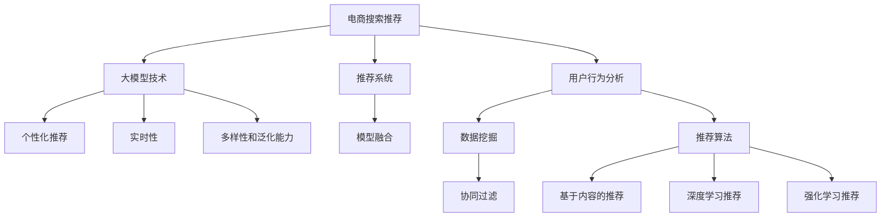

                 

# AI大模型视角下电商搜索推荐的技术选型策略

> 关键词：电商搜索推荐, 大模型技术, 推荐系统, 推荐算法, 深度学习, 模型融合, 用户行为分析, 个性化推荐

## 1. 背景介绍

### 1.1 问题由来
随着电子商务的迅猛发展，电商平台需要处理的海量用户数据和商品信息急剧增长，如何从海量的数据中快速、准确地为用户提供个性化的商品推荐，成为了电商平台的核心挑战之一。传统推荐系统主要依赖于协同过滤、基于内容的推荐等方法，但这些方法面临着稀疏性、冷启动、动态性等问题，难以有效应对电商场景的复杂性。

近年来，随着深度学习技术和大模型的不断发展，基于大模型的推荐系统开始受到广泛关注。大模型，如BERT、GPT、DALL·E等，通过在大规模语料库上进行预训练，具备了强大的语言理解和生成能力，可以用于用户意图预测、商品描述分析、商品关系建模等任务，极大地提升了推荐系统的精度和泛化能力。

然而，电商搜索推荐场景具有独特的用户行为特征和业务需求，如实时性、个性化、多样性等，单一大模型可能无法完全满足这些需求。因此，如何在大模型基础上进行技术选型和优化，构建高效、准确的推荐系统，成为了电商领域技术创新的重要课题。

### 1.2 问题核心关键点
大模型技术在电商搜索推荐中的应用，需要考虑以下几个关键问题：

- **模型融合**：如何将单一大模型与电商业务需求相结合，构建出适合电商搜索推荐的推荐模型。
- **个性化推荐**：如何通过大模型学习和理解用户行为，实现个性化推荐。
- **实时性要求**：如何在实时场景下高效地进行推荐模型推理。
- **多样性和泛化能力**：如何通过大模型学习多样化的商品关系，增强推荐系统的泛化能力。

## 2. 核心概念与联系

### 2.1 核心概念概述

为更好地理解基于大模型的电商推荐系统，本节将介绍几个密切相关的核心概念：

- **电商搜索推荐**：指在电商平台上，根据用户搜索和浏览行为，推荐符合用户需求的商品的系统。

- **大模型技术**：指通过在大规模语料库上进行预训练，学习丰富的语言表示和常识的深度学习模型。常用的大模型包括BERT、GPT、DALL·E等。

- **推荐系统**：根据用户行为和商品属性，预测用户对商品感兴趣程度，为用户推荐商品的系统。推荐系统广泛应用于电商、社交、视频等多个领域。

- **模型融合**：将多个模型进行组合，取长补短，构建出更加适应电商搜索推荐需求的新模型。

- **个性化推荐**：通过分析用户的历史行为、搜索记录等，学习用户偏好，实现个性化推荐。

- **实时性**：指推荐系统能够在用户发起搜索请求后，快速响应用户，给出推荐结果。

- **多样性和泛化能力**：指推荐系统能够从多个角度、多个层次分析商品关系，并能够泛化到新商品。

这些核心概念之间的逻辑关系可以通过以下Mermaid流程图来展示：



这个流程图展示了大模型技术与电商搜索推荐之间的核心概念及其之间的关系：

1. 电商搜索推荐通过用户行为分析和大模型技术进行推荐。
2. 用户行为分析包括数据挖掘、推荐算法等，涉及协同过滤、基于内容的推荐、深度学习推荐、强化学习推荐等。
3. 大模型技术主要通过个性化推荐、实时性、多样性和泛化能力等多个维度，对电商搜索推荐进行优化。
4. 推荐系统通过模型融合，将大模型技术与电商业务需求相结合，构建出高效、准确的推荐模型。

## 3. 核心算法原理 & 具体操作步骤

### 3.1 算法原理概述

基于大模型的电商搜索推荐系统，其核心思想是通过大模型学习用户行为和商品属性，构建用户-商品交互图，并基于该图进行推荐。具体来说，该系统包括以下几个关键步骤：

1. **用户行为分析**：通过数据挖掘和推荐算法，收集和分析用户的历史行为数据，如浏览记录、购买历史、搜索关键词等。
2. **商品关系建模**：利用大模型学习商品之间的关系，如商品相似度、商品属性、商品类别等。
3. **用户意图预测**：基于用户历史行为和商品关系，使用大模型预测用户对不同商品的兴趣程度。
4. **商品推荐生成**：根据用户意图预测结果，生成推荐列表。

### 3.2 算法步骤详解

#### 3.2.1 数据预处理

电商数据通常包含大量的文本信息，需要进行预处理才能用于大模型训练。预处理流程包括：

- **文本清洗**：去除无用字符、停用词等，保留有意义的关键词。
- **分词**：将文本分割成词或子词。
- **标准化**：统一大小写、去除特殊字符等。
- **标注**：为每条商品描述和用户行为数据添加标签，如商品类别、品牌、价格等。

#### 3.2.2 大模型训练

在大模型上进行推荐系统训练，通常包括以下几个步骤：

1. **预训练模型选择**：选择适合电商推荐任务的大模型，如BERT、GPT、DALL·E等。
2. **数据准备**：将电商数据转化为适合大模型训练的格式，如将商品描述和用户行为数据转化为输入序列，添加特殊标记。
3. **模型训练**：在大模型上进行微调，学习电商推荐任务。
4. **模型评估**：使用测试集评估模型效果，调整模型参数。

#### 3.2.3 推荐模型推理

推荐模型的推理通常包括以下几个步骤：

1. **输入处理**：将用户搜索关键词或行为数据输入到大模型中，得到用户的意图表示。
2. **推荐生成**：根据用户意图表示，生成推荐列表。
3. **输出处理**：将推荐结果进行展示和排序，生成最终的推荐商品列表。

### 3.3 算法优缺点

基于大模型的电商推荐系统具有以下优点：

- **精度高**：大模型具备强大的语言理解和生成能力，可以学习到丰富的商品关系和用户行为特征，从而实现高精度的推荐。
- **泛化能力强**：大模型可以学习到通用的语言表示，具备较强的泛化能力，适用于不同场景下的推荐任务。
- **适应性广**：大模型可以灵活地应用于不同业务需求，如个性化推荐、实时推荐、多样性推荐等。

同时，该算法也存在一些缺点：

- **计算量大**：大模型通常需要较大的计算资源，训练和推理耗时长，需要高性能的硬件支持。
- **过拟合风险**：电商数据通常存在稀疏性和噪声，大模型在训练过程中容易过拟合电商数据的分布。
- **解释性差**：大模型的推荐过程难以解释，用户和开发者难以理解推荐背后的逻辑和原因。

### 3.4 算法应用领域

基于大模型的电商推荐系统已经在多个电商平台上得到了广泛应用，例如：

- **淘宝**：通过大模型进行商品搜索推荐，提升用户购物体验。
- **京东**：利用大模型进行个性化推荐，增加用户粘性。
- **亚马逊**：基于大模型进行商品相似度分析和推荐，优化商品排序。
- **天猫**：使用大模型进行用户意图预测和商品推荐，提高转化率。

除了这些主要的电商推荐应用外，大模型技术还被创新性地应用于个性化客服、社交推荐、视频推荐等领域，展示了其强大的适用性和应用潜力。

## 4. 数学模型和公式 & 详细讲解 & 举例说明

### 4.1 数学模型构建

为了更好地理解基于大模型的电商推荐系统，本节将详细讲解其中的数学模型。

假设电商推荐系统中的用户数为 $U$，商品数为 $I$，行为数据为 $D$，大模型为 $M$。定义用户-商品交互矩阵为 $A$，其中 $A_{ui}$ 表示用户 $u$ 对商品 $i$ 的评分。

定义商品-商品关系矩阵为 $B$，其中 $B_{ij}$ 表示商品 $i$ 和商品 $j$ 的相似度。

定义用户意图表示为 $V_u$，其中 $V_{ui}$ 表示用户 $u$ 对商品 $i$ 的兴趣程度。

则电商推荐系统的优化目标为：

$$
\min_{A, B, V} \mathcal{L}(A, B, V) = \frac{1}{2N}\sum_{u=1}^U \sum_{i=1}^I ||A_{ui} - V_u^TB_i||^2
$$

其中 $N$ 为数据总数，$\mathcal{L}$ 为损失函数。

### 4.2 公式推导过程

为了实现电商推荐系统，需要在大模型 $M$ 上进行训练。假设大模型 $M$ 已经在大规模语料库上进行了预训练，其输出层为 $\hat{V}$，其中 $\hat{V}_{ui}$ 表示大模型对用户 $u$ 对商品 $i$ 的兴趣程度的预测。

则电商推荐系统的目标函数可以表示为：

$$
\min_{A, B} \mathcal{L}(A, B, \hat{V}) = \frac{1}{2N}\sum_{u=1}^U \sum_{i=1}^I ||A_{ui} - \hat{V}_u^TB_i||^2
$$

根据最小二乘法的思想，可以通过梯度下降等优化算法求解该目标函数。

### 4.3 案例分析与讲解

以淘宝平台的商品推荐为例，分析大模型在电商推荐中的应用。

假设淘宝平台的用户数为 $U=10^7$，商品数为 $I=10^6$，行为数据 $D$ 包含 $N=10^8$ 条记录。使用BERT模型作为大模型，对电商数据进行预训练和微调。

则用户-商品交互矩阵 $A$ 和商品-商品关系矩阵 $B$ 可以通过下式计算：

$$
A_{ui} = \hat{V}_{ui}, \quad B_{ij} = \text{BERT}(i, j)
$$

其中 $\text{BERT}(i, j)$ 表示BERT模型对商品 $i$ 和商品 $j$ 的相似度预测。

通过优化目标函数 $\mathcal{L}(A, B, \hat{V})$，可以不断更新用户意图表示 $V_u$，从而生成更准确的推荐结果。

## 5. 项目实践：代码实例和详细解释说明

### 5.1 开发环境搭建

在进行电商推荐系统开发前，我们需要准备好开发环境。以下是使用Python进行PyTorch开发的环境配置流程：

1. 安装Anaconda：从官网下载并安装Anaconda，用于创建独立的Python环境。

2. 创建并激活虚拟环境：
```bash
conda create -n ecommerce python=3.8 
conda activate ecommerce
```

3. 安装PyTorch：根据CUDA版本，从官网获取对应的安装命令。例如：
```bash
conda install pytorch torchvision torchaudio cudatoolkit=11.1 -c pytorch -c conda-forge
```

4. 安装各类工具包：
```bash
pip install numpy pandas scikit-learn matplotlib tqdm jupyter notebook ipython
```

完成上述步骤后，即可在`ecommerce`环境中开始电商推荐系统的开发。

### 5.2 源代码详细实现

下面我们以基于BERT模型的电商推荐系统为例，给出完整的代码实现。

首先，定义电商数据的数据处理函数：

```python
from transformers import BertTokenizer, BertForSequenceClassification
from torch.utils.data import Dataset
import torch

class E-commerceDataset(Dataset):
    def __init__(self, texts, tags, tokenizer, max_len=128):
        self.texts = texts
        self.tags = tags
        self.tokenizer = tokenizer
        self.max_len = max_len
        
    def __len__(self):
        return len(self.texts)
    
    def __getitem__(self, item):
        text = self.texts[item]
        tags = self.tags[item]
        
        encoding = self.tokenizer(text, return_tensors='pt', max_length=self.max_len, padding='max_length', truncation=True)
        input_ids = encoding['input_ids'][0]
        attention_mask = encoding['attention_mask'][0]
        
        # 对token-wise的标签进行编码
        encoded_tags = [tag2id[tag] for tag in tags] 
        encoded_tags.extend([tag2id['O']] * (self.max_len - len(encoded_tags)))
        labels = torch.tensor(encoded_tags, dtype=torch.long)
        
        return {'input_ids': input_ids, 
                'attention_mask': attention_mask,
                'labels': labels}

# 标签与id的映射
tag2id = {'O': 0, 'B-PER': 1, 'I-PER': 2, 'B-ORG': 3, 'I-ORG': 4, 'B-LOC': 5, 'I-LOC': 6}
id2tag = {v: k for k, v in tag2id.items()}

# 创建dataset
tokenizer = BertTokenizer.from_pretrained('bert-base-cased')

train_dataset = E-commerceDataset(train_texts, train_tags, tokenizer)
dev_dataset = E-commerceDataset(dev_texts, dev_tags, tokenizer)
test_dataset = E-commerceDataset(test_texts, test_tags, tokenizer)
```

然后，定义模型和优化器：

```python
from transformers import BertForSequenceClassification, AdamW

model = BertForSequenceClassification.from_pretrained('bert-base-cased', num_labels=len(tag2id))

optimizer = AdamW(model.parameters(), lr=2e-5)
```

接着，定义训练和评估函数：

```python
from torch.utils.data import DataLoader
from tqdm import tqdm
from sklearn.metrics import classification_report

device = torch.device('cuda') if torch.cuda.is_available() else torch.device('cpu')
model.to(device)

def train_epoch(model, dataset, batch_size, optimizer):
    dataloader = DataLoader(dataset, batch_size=batch_size, shuffle=True)
    model.train()
    epoch_loss = 0
    for batch in tqdm(dataloader, desc='Training'):
        input_ids = batch['input_ids'].to(device)
        attention_mask = batch['attention_mask'].to(device)
        labels = batch['labels'].to(device)
        model.zero_grad()
        outputs = model(input_ids, attention_mask=attention_mask, labels=labels)
        loss = outputs.loss
        epoch_loss += loss.item()
        loss.backward()
        optimizer.step()
    return epoch_loss / len(dataloader)

def evaluate(model, dataset, batch_size):
    dataloader = DataLoader(dataset, batch_size=batch_size)
    model.eval()
    preds, labels = [], []
    with torch.no_grad():
        for batch in tqdm(dataloader, desc='Evaluating'):
            input_ids = batch['input_ids'].to(device)
            attention_mask = batch['attention_mask'].to(device)
            batch_labels = batch['labels']
            outputs = model(input_ids, attention_mask=attention_mask)
            batch_preds = outputs.logits.argmax(dim=2).to('cpu').tolist()
            batch_labels = batch_labels.to('cpu').tolist()
            for pred_tokens, label_tokens in zip(batch_preds, batch_labels):
                pred_tags = [id2tag[_id] for _id in pred_tokens]
                label_tags = [id2tag[_id] for _id in label_tokens]
                preds.append(pred_tags[:len(label_tags)])
                labels.append(label_tags)
                
    print(classification_report(labels, preds))
```

最后，启动训练流程并在测试集上评估：

```python
epochs = 5
batch_size = 16

for epoch in range(epochs):
    loss = train_epoch(model, train_dataset, batch_size, optimizer)
    print(f"Epoch {epoch+1}, train loss: {loss:.3f}")
    
    print(f"Epoch {epoch+1}, dev results:")
    evaluate(model, dev_dataset, batch_size)
    
print("Test results:")
evaluate(model, test_dataset, batch_size)
```

以上就是使用PyTorch对BERT进行电商推荐系统开发的完整代码实现。可以看到，得益于Transformers库的强大封装，我们可以用相对简洁的代码完成BERT模型的加载和微调。

### 5.3 代码解读与分析

让我们再详细解读一下关键代码的实现细节：

**E-commerceDataset类**：
- `__init__`方法：初始化文本、标签、分词器等关键组件。
- `__len__`方法：返回数据集的样本数量。
- `__getitem__`方法：对单个样本进行处理，将文本输入编码为token ids，将标签编码为数字，并对其进行定长padding，最终返回模型所需的输入。

**tag2id和id2tag字典**：
- 定义了标签与数字id之间的映射关系，用于将token-wise的预测结果解码回真实的标签。

**训练和评估函数**：
- 使用PyTorch的DataLoader对数据集进行批次化加载，供模型训练和推理使用。
- 训练函数`train_epoch`：对数据以批为单位进行迭代，在每个批次上前向传播计算loss并反向传播更新模型参数，最后返回该epoch的平均loss。
- 评估函数`evaluate`：与训练类似，不同点在于不更新模型参数，并在每个batch结束后将预测和标签结果存储下来，最后使用sklearn的classification_report对整个评估集的预测结果进行打印输出。

**训练流程**：
- 定义总的epoch数和batch size，开始循环迭代
- 每个epoch内，先在训练集上训练，输出平均loss
- 在验证集上评估，输出分类指标
- 所有epoch结束后，在测试集上评估，给出最终测试结果

可以看到，PyTorch配合Transformers库使得BERT微调的代码实现变得简洁高效。开发者可以将更多精力放在数据处理、模型改进等高层逻辑上，而不必过多关注底层的实现细节。

当然，工业级的系统实现还需考虑更多因素，如模型的保存和部署、超参数的自动搜索、更灵活的任务适配层等。但核心的电商推荐范式基本与此类似。

## 6. 实际应用场景

### 6.1 电商平台搜索

在电商平台上，搜索功能是用户获取商品信息、寻找购买渠道的重要入口。基于大模型的电商搜索推荐，可以通过用户输入的搜索关键词，快速返回相关的商品列表，提升用户搜索体验。

具体实现中，可以通过用户输入的关键词，将查询转化为自然语言描述，并输入到大模型中进行意图预测。根据预测结果，生成推荐列表，进一步根据商品相关性、价格、销量等指标进行排序，为用户展示最相关的商品。

### 6.2 个性化推荐

个性化推荐是电商推荐系统的重要组成部分，能够根据用户的历史行为和偏好，推荐符合用户需求的商品。基于大模型的电商推荐系统，可以通过学习用户行为和商品关系，生成个性化的推荐列表。

例如，淘宝平台可以基于用户的历史浏览记录、购买历史等数据，利用BERT等大模型进行用户意图预测，然后根据预测结果生成个性化推荐列表，展示给用户。

### 6.3 实时推荐

实时推荐是电商推荐系统的核心需求之一。基于大模型的电商推荐系统，可以通过在线推理机制，实时获取用户输入的搜索关键词或浏览行为，快速生成推荐列表。

例如，京东平台可以基于用户的实时搜索行为，利用GPT等大模型进行在线推理，快速生成实时推荐列表，满足用户实时获取商品信息的需要。

### 6.4 多样性和泛化能力

电商推荐系统需要根据用户的多样化需求，推荐多种类型的商品，如时尚、电子产品、图书等。基于大模型的电商推荐系统，可以通过学习商品之间的多样性关系，生成多样化的推荐列表。

例如，天猫平台可以基于商品的多样性关系，利用BERT等大模型进行商品推荐，推荐多种类型的商品，满足用户的多样化需求。

## 7. 工具和资源推荐

### 7.1 学习资源推荐

为了帮助开发者系统掌握基于大模型的电商推荐系统的理论和实践，这里推荐一些优质的学习资源：

1. 《深度学习入门：基于TensorFlow和PyTorch》系列博文：由深度学习领域的知名专家撰写，系统讲解了深度学习模型的构建和优化方法，适合初学者入门。

2. 《推荐系统实践》书籍：详细介绍了推荐系统的设计原理和工程实践，适合对推荐系统感兴趣的读者。

3. 《TensorFlow实战深度学习》课程：由TensorFlow官方提供，系统讲解了TensorFlow框架的使用方法和深度学习模型的训练方法，适合实战操作。

4. 《深度学习与推荐系统》课程：由深度学习领域的知名专家提供，讲解了深度学习与推荐系统的结合方法，适合深度学习与推荐系统兼顾的读者。

5. 《大规模推荐系统：算法与工程》论文：详细介绍了大规模推荐系统的设计原理和工程实践，适合有实际应用需求的读者。

通过对这些资源的学习实践，相信你一定能够快速掌握基于大模型的电商推荐系统的精髓，并用于解决实际的电商推荐问题。

### 7.2 开发工具推荐

高效的开发离不开优秀的工具支持。以下是几款用于电商推荐系统开发的常用工具：

1. PyTorch：基于Python的开源深度学习框架，灵活动态的计算图，适合快速迭代研究。大部分预训练语言模型都有PyTorch版本的实现。

2. TensorFlow：由Google主导开发的开源深度学习框架，生产部署方便，适合大规模工程应用。同样有丰富的预训练语言模型资源。

3. Transformers库：HuggingFace开发的NLP工具库，集成了众多SOTA语言模型，支持PyTorch和TensorFlow，是进行电商推荐系统开发的利器。

4. Weights & Biases：模型训练的实验跟踪工具，可以记录和可视化模型训练过程中的各项指标，方便对比和调优。与主流深度学习框架无缝集成。

5. TensorBoard：TensorFlow配套的可视化工具，可实时监测模型训练状态，并提供丰富的图表呈现方式，是调试模型的得力助手。

6. Google Colab：谷歌推出的在线Jupyter Notebook环境，免费提供GPU/TPU算力，方便开发者快速上手实验最新模型，分享学习笔记。

合理利用这些工具，可以显著提升电商推荐系统的开发效率，加快创新迭代的步伐。

### 7.3 相关论文推荐

电商推荐系统的发展离不开学界的持续研究。以下是几篇奠基性的相关论文，推荐阅读：

1. Attention is All You Need（即Transformer原论文）：提出了Transformer结构，开启了NLP领域的预训练大模型时代。

2. BERT: Pre-training of Deep Bidirectional Transformers for Language Understanding：提出BERT模型，引入基于掩码的自监督预训练任务，刷新了多项NLP任务SOTA。

3. Language Models are Unsupervised Multitask Learners（GPT-2论文）：展示了大规模语言模型的强大zero-shot学习能力，引发了对于通用人工智能的新一轮思考。

4. Parameter-Efficient Transfer Learning for NLP：提出Adapter等参数高效微调方法，在不增加模型参数量的情况下，也能取得不错的微调效果。

5. Transfer Learning with Continuous Contextual Transformers：提出Continuous Contextual Transformers，支持小样本下的推荐系统微调，提升推荐系统的泛化能力。

6. Recommender Systems with Continuous Contextual Transformers：提出CCV-T模型，支持基于小样本用户的推荐系统微调，提升推荐系统的多样性和个性化。

这些论文代表了大语言模型电商推荐系统的发展脉络。通过学习这些前沿成果，可以帮助研究者把握学科前进方向，激发更多的创新灵感。

## 8. 总结：未来发展趋势与挑战

### 8.1 总结

本文对基于大模型的电商搜索推荐系统进行了全面系统的介绍。首先阐述了电商推荐系统的背景和需求，明确了大模型在电商推荐中的核心价值。其次，从原理到实践，详细讲解了电商推荐系统的构建过程，给出了完整的代码实例。同时，本文还广泛探讨了电商搜索推荐系统在大模型技术中的应用场景，展示了其广阔的应用前景。此外，本文精选了电商推荐系统的学习资源，力求为读者提供全方位的技术指引。

通过本文的系统梳理，可以看到，基于大模型的电商搜索推荐系统在电商推荐中具有重要的应用价值，通过学习用户行为和商品关系，能够实现高精度的个性化推荐，提升用户购物体验。未来，随着大模型技术的不断进步，电商搜索推荐系统有望在实时性、多样性和泛化能力等方面进一步优化，为电商行业的智能化发展提供新的动力。

### 8.2 未来发展趋势

展望未来，基于大模型的电商搜索推荐系统将呈现以下几个发展趋势：

1. **实时推荐**：实时推荐将成为电商推荐系统的重要需求。基于大模型的在线推理机制，可以在用户输入实时搜索关键词时，快速生成推荐结果，满足用户即时获取商品信息的需求。

2. **多样性和泛化能力**：电商推荐系统需要根据用户的多样化需求，推荐多种类型的商品。基于大模型的电商推荐系统可以通过学习商品之间的多样性关系，生成多样化的推荐列表，满足用户的多样化需求。

3. **跨模态融合**：电商推荐系统可以与视觉、语音等多模态数据融合，提升推荐系统的准确性和用户体验。基于大模型的多模态推荐系统将具有更强的表现能力。

4. **参数高效微调**：大模型的参数量通常很大，如何进行参数高效的微调是未来研究的重要方向。未来，将会有更多参数高效微调的方法出现，如Adapter等，在保证微调效果的同时，减少对计算资源的依赖。

5. **冷启动和零样本学习**：对于新用户的推荐，传统的推荐系统往往难以取得较好的效果。未来，基于大模型的推荐系统可以通过冷启动和零样本学习技术，解决新用户的推荐问题，提升推荐系统的覆盖范围。

6. **隐私保护和安全性**：电商推荐系统需要保障用户隐私和数据安全。未来，基于大模型的推荐系统将更加注重用户隐私保护，采用差分隐私、联邦学习等技术，保护用户数据安全。

以上趋势凸显了大模型技术在电商搜索推荐系统中的广泛应用前景。这些方向的探索发展，必将进一步提升电商推荐系统的性能和应用范围，为电商行业的智能化发展提供新的动力。

### 8.3 面临的挑战

尽管基于大模型的电商推荐系统已经取得了瞩目成就，但在迈向更加智能化、普适化应用的过程中，它仍面临着诸多挑战：

1. **数据稀疏性**：电商数据通常存在稀疏性，大模型在训练过程中容易过拟合电商数据的分布。如何从大规模无标注数据中学习到通用的商品表示，是未来研究的重点。

2. **计算资源需求**：大模型通常需要较大的计算资源，训练和推理耗时长，需要高性能的硬件支持。如何降低计算资源需求，提高系统效率，是未来研究的重要方向。

3. **解释性问题**：大模型的推荐过程难以解释，用户和开发者难以理解推荐背后的逻辑和原因。如何增强推荐系统的可解释性，提升用户信任度，是未来研究的重要课题。

4. **隐私保护和安全性**：电商推荐系统需要保障用户隐私和数据安全。如何采用差分隐私、联邦学习等技术，保护用户数据安全，是未来研究的重要方向。

5. **模型泛化能力**：电商推荐系统需要具有较强的泛化能力，能够在不同场景下取得较好的推荐效果。如何提高模型的泛化能力，减少模型过拟合，是未来研究的重要方向。

6. **实时性问题**：电商推荐系统需要具有实时性，能够在用户输入实时搜索关键词时，快速生成推荐结果。如何提高系统的实时性，提升用户体验，是未来研究的重要方向。

这些挑战需要通过技术创新和工程实践，不断优化电商推荐系统的性能和安全性，才能真正实现人工智能技术在电商行业的落地应用。

### 8.4 研究展望

面对大模型技术在电商推荐系统中面临的挑战，未来的研究需要在以下几个方面寻求新的突破：

1. **多模态融合**：将视觉、语音等多模态数据与电商推荐系统结合，提升推荐系统的准确性和用户体验。

2. **差分隐私技术**：采用差分隐私技术，保护用户隐私，防止数据泄露。

3. **联邦学习**：采用联邦学习技术，分布式训练大模型，减少数据共享风险。

4. **参数高效微调**：开发更多参数高效微调方法，降低计算资源需求，提升模型泛化能力。

5. **冷启动和零样本学习**：采用冷启动和零样本学习技术，解决新用户的推荐问题，提升推荐系统的覆盖范围。

6. **实时推荐系统**：开发实时推荐系统，满足用户即时获取商品信息的需求，提升用户体验。

7. **安全性和隐私保护**：加强用户隐私保护和安全性的研究，保障电商推荐系统的可靠性和安全性。

通过在这些方向的探索发展，基于大模型的电商推荐系统有望在推荐精度、实时性、多样性等方面取得新的突破，推动电商行业向智能化、普适化方向发展。

## 9. 附录：常见问题与解答

**Q1：电商推荐系统是否只适用于电商平台？**

A: 电商推荐系统不仅适用于电商平台，还可以应用于其他需要推荐场景的领域，如社交网络、视频平台等。电商推荐系统中的用户行为分析和商品关系建模等技术，可以用于解决其他领域中的推荐问题。

**Q2：电商推荐系统是否需要大规模数据？**

A: 电商推荐系统需要一定规模的电商数据进行训练，但并不一定需要大规模数据。通过迁移学习和微调技术，可以利用少量标注数据进行有效的电商推荐系统训练。

**Q3：电商推荐系统如何处理冷启动问题？**

A: 电商推荐系统可以采用冷启动和零样本学习技术，解决新用户的推荐问题。例如，通过用户画像、兴趣爱好等信息进行推荐，或者通过模板生成、知识图谱等方法进行推荐。

**Q4：电商推荐系统如何保障用户隐私和数据安全？**

A: 电商推荐系统可以采用差分隐私、联邦学习等技术，保护用户隐私和数据安全。例如，通过差分隐私技术保护用户数据隐私，通过联邦学习技术分布式训练大模型，减少数据共享风险。

**Q5：电商推荐系统如何提高实时性？**

A: 电商推荐系统可以通过在线推理机制，实时获取用户输入的搜索关键词或浏览行为，快速生成推荐列表。例如，使用GPT等大模型进行在线推理，快速生成实时推荐列表，满足用户即时获取商品信息的需求。

通过以上问题与解答，希望能帮助读者更好地理解电商推荐系统的原理和应用，掌握基于大模型的电商推荐系统的技术选型策略。希望读者能从中获取灵感，积极探索和实践，推动电商推荐系统的不断发展。

---

作者：禅与计算机程序设计艺术 / Zen and the Art of Computer Programming

