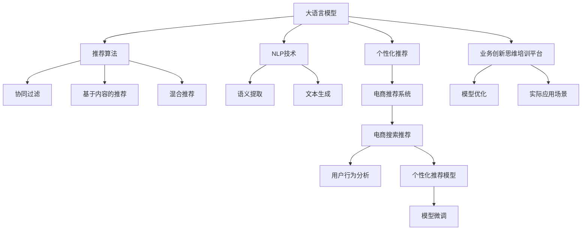

                 

# AI大模型赋能电商搜索推荐的业务创新思维培训平台搭建方案设计与实现

> 关键词：大语言模型,电商搜索推荐,个性化推荐系统,推荐算法,自然语言处理(NLP),业务创新思维

## 1. 背景介绍

### 1.1 问题由来
在电商行业，搜索推荐系统一直是客户体验提升和销售转化的关键因素。传统的推荐系统多基于协同过滤、TF-IDF等方法，存在数据稀疏、维度高等问题。而基于深度学习的个性化推荐系统，特别是结合大语言模型的推荐方法，正在逐渐成为行业趋势。大语言模型能够从文本数据中提取高层次语义特征，帮助推荐系统生成更加个性化、多样化的推荐内容。

大语言模型通过预训练学习到丰富的语言知识，结合电商领域特有的商品信息，能够大幅提升搜索推荐的精准度和用户体验。但实际部署中，大语言模型的参数量通常较大，计算资源和存储成本较高，对企业来说是较大负担。此外，电商领域的商品语义表示复杂，标签稀疏，导致训练数据资源有限。

为了进一步激发电商搜索推荐系统的创新思维，本文提出基于大语言模型和个性化推荐算法相结合的电商搜索推荐业务创新思维培训平台（简称：AI电商推荐平台）的搭建方案。

### 1.2 问题核心关键点
1. 如何高效利用大语言模型知识，提升电商推荐系统的精准度和个性化程度。
2. 如何针对电商搜索推荐场景，设计高效可扩展的推荐算法和架构。
3. 如何搭建一个易用、灵活、高效的电商推荐培训平台，赋能业务团队进行个性化推荐系统的创新。
4. 如何平衡模型性能与资源利用效率，降低推荐系统在大规模部署上的成本。

## 2. 核心概念与联系

### 2.1 核心概念概述

为更好地理解AI电商推荐平台的搭建方案，本节将介绍几个密切相关的核心概念：

- 大语言模型(Large Language Model, LLM)：以自回归(如GPT)或自编码(如BERT)模型为代表的大规模预训练语言模型。通过在大规模无标签文本语料上进行预训练，学习通用的语言表示，具备强大的语言理解和生成能力。

- 个性化推荐系统：根据用户的历史行为数据，预测用户可能感兴趣的物品，从而进行个性化推荐。包括基于协同过滤、基于内容的推荐、混合推荐等。

- 推荐算法：推荐系统中的核心技术，包括协同过滤、基于内容的推荐、协同过滤与基于内容的混合推荐等。

- 自然语言处理(NLP)：涉及语言理解、信息提取、情感分析、文本生成等技术，用于从文本数据中提取语义特征。

- 业务创新思维培训平台：提供一个平台，让电商业务团队能够便捷地使用大语言模型和个性化推荐算法进行系统开发和实验，同时提供实际应用场景的优化方案和模型效果评估。

这些核心概念之间的逻辑关系可以通过以下Mermaid流程图来展示：



这个流程图展示了大语言模型、个性化推荐系统、推荐算法、NLP技术、业务创新思维培训平台等概念及其之间的关系：

1. 大语言模型通过预训练学习通用语言知识。
2. 个性化推荐系统结合大语言模型，从用户行为数据中提取特征进行推荐。
3. 推荐算法用于不同推荐方法的选择和优化。
4. NLP技术用于提取文本中的语义特征。
5. 业务创新思维培训平台提供模型开发和实验环境，赋能业务团队进行个性化推荐系统的创新。
6. 实际应用场景指导模型的优化与部署。

## 3. 核心算法原理 & 具体操作步骤

### 3.1 算法原理概述

基于大语言模型和个性化推荐算法相结合的电商搜索推荐业务创新思维培训平台（AI电商推荐平台）的核心思想是：利用大语言模型的语义理解和生成能力，优化推荐系统，提升推荐效果。

具体而言，平台包括以下几个核心模块：
- 用户行为分析模块：收集用户的浏览、点击、购买等行为数据，提取特征。
- 个性化推荐模块：基于用户行为特征，利用大语言模型提取文本语义信息，结合推荐算法进行推荐。
- 模型微调模块：利用电商领域特有的商品语义表示，对大语言模型进行微调，提升模型效果。
- 实际应用场景模块：模拟电商搜索推荐场景，进行模型效果评估和优化。

通过以上模块的协同工作，平台能够帮助电商业务团队高效利用大语言模型的语义信息，设计高效可扩展的推荐算法，优化电商搜索推荐系统，提升用户体验和转化率。

### 3.2 算法步骤详解

**Step 1: 用户行为数据收集与预处理**
- 收集用户浏览、点击、购买等行为数据，并将其存储在数据库中。
- 对数据进行清洗和标注，去除噪声和异常值。

**Step 2: 用户行为特征提取**
- 利用自然语言处理技术，提取文本中的语义信息。
- 将用户行为数据与文本信息进行融合，生成用户行为特征。

**Step 3: 大语言模型微调**
- 使用电商领域特有的商品语义表示，对大语言模型进行微调。
- 微调过程中，利用正则化技术、对抗训练等方法，防止模型过拟合。

**Step 4: 个性化推荐算法设计**
- 结合电商领域的推荐场景，设计高效可扩展的推荐算法。
- 包括协同过滤、基于内容的推荐、混合推荐等算法。

**Step 5: 模型效果评估与优化**
- 在电商搜索推荐场景中进行模型效果评估，调整推荐策略。
- 利用业务创新思维培训平台，进行模型优化实验，提升推荐效果。

**Step 6: 推荐系统部署与维护**
- 将优化后的模型集成到电商搜索推荐系统中，进行实时推荐。
- 定期更新模型，保证推荐效果稳定。

### 3.3 算法优缺点

基于大语言模型和个性化推荐算法相结合的电商搜索推荐业务创新思维培训平台具有以下优点：
1. 高效利用大语言模型的语义信息，提升推荐系统的个性化和精准度。
2. 结合电商领域特有场景，设计高效可扩展的推荐算法，适用于多种电商推荐场景。
3. 通过模型微调和业务创新思维培训平台，赋能电商业务团队进行系统开发和优化。
4. 通过实际应用场景模块，进行模型效果评估和优化，快速迭代改进推荐系统。

同时，该平台也存在一定的局限性：
1. 对标注数据和计算资源有较高要求，电商企业需要投入一定的成本。
2. 模型微调和推荐算法设计需要较强的技术积累，对于电商业务团队有一定门槛。
3. 推荐系统的复杂度较高，大规模部署和维护需要技术团队的支持。

尽管存在这些局限性，但该平台对于电商企业提升推荐系统的效果和用户体验，具有不可替代的价值。

### 3.4 算法应用领域

基于大语言模型和个性化推荐算法相结合的电商搜索推荐业务创新思维培训平台适用于各种电商推荐场景，例如：

- 商品推荐：根据用户浏览历史、购买记录等，推荐用户可能感兴趣的商品。
- 用户画像构建：利用文本信息进行用户兴趣和行为分析，形成用户画像。
- 购物车推荐：基于用户的购物车商品，推荐相关商品进行补充购买。
- 新用户推荐：利用文本信息，为新用户推荐感兴趣的商品类别。
- 跨品类推荐：结合不同品类商品的语义信息，推荐相关商品。
- 活动推荐：在活动促销时，推荐相关商品吸引用户购买。

## 4. 数学模型和公式 & 详细讲解 & 举例说明

### 4.1 数学模型构建

本节将使用数学语言对AI电商推荐平台的推荐算法进行更加严格的刻画。

记用户行为特征为 $x_i$，大语言模型的输出为 $y_i$，推荐算法的输出为 $r_i$。假设推荐任务为预测用户是否购买商品，则模型的目标函数可以表示为：

$$
\mathcal{L} = \sum_{i=1}^N \ell(r_i, y_i) + \lambda\mathcal{R}(x_i)
$$

其中 $\ell$ 为推荐任务损失函数，$\mathcal{R}$ 为用户行为特征提取损失函数，$\lambda$ 为正则化系数。

### 4.2 公式推导过程

以协同过滤算法为例，说明推荐任务的具体实现过程。

设用户 $u$ 对物品 $i$ 的行为为 $b_{ui}$，物品 $j$ 对用户 $u$ 的行为为 $b_{uj}$。基于用户-物品协同矩阵 $B$，协同过滤的目标是最大化用户 $u$ 的推荐评分 $r_u$，同时最小化预测评分 $r_{uj}$ 与真实评分 $b_{uj}$ 之间的差异。协同过滤的优化目标可以表示为：

$$
\min_{r} \frac{1}{2}\sum_{u=1}^U \sum_{i=1}^I (b_{ui} - r_u)^2 + \frac{1}{2}\sum_{u=1}^U \sum_{j=1}^J (r_{uj} - b_{uj})^2
$$

其中 $r$ 为推荐评分矩阵，$U$ 和 $I$ 分别表示用户数和物品数。

### 4.3 案例分析与讲解

以电商领域的商品推荐为例，展示推荐系统的效果评估和优化过程。

首先，收集用户浏览历史、购买记录等数据，提取用户行为特征 $x$。使用Bert等预训练语言模型对商品描述进行语义表示，得到商品的语义特征 $y$。将用户行为特征 $x$ 和商品语义特征 $y$ 进行融合，作为协同过滤算法的输入。

接着，利用协同过滤算法进行推荐，得到用户对每个物品的评分 $r$。将评分 $r$ 与真实评分 $b$ 进行比较，计算推荐任务损失函数 $\ell$。同时，利用文本相似度计算用户行为特征提取损失函数 $\mathcal{R}$。最终，将两个损失函数组合，优化模型的参数，提升推荐效果。

## 5. 项目实践：代码实例和详细解释说明

### 5.1 开发环境搭建

在进行电商推荐系统开发前，我们需要准备好开发环境。以下是使用Python进行PyTorch开发的环境配置流程：

1. 安装Anaconda：从官网下载并安装Anaconda，用于创建独立的Python环境。

2. 创建并激活虚拟环境：
```bash
conda create -n ecommerce-env python=3.8 
conda activate ecommerce-env
```

3. 安装PyTorch：根据CUDA版本，从官网获取对应的安装命令。例如：
```bash
conda install pytorch torchvision torchaudio cudatoolkit=11.1 -c pytorch -c conda-forge
```

4. 安装TensorFlow：
```bash
conda install tensorflow=2.8 -c conda-forge
```

5. 安装各类工具包：
```bash
pip install numpy pandas scikit-learn matplotlib tqdm jupyter notebook ipython
```

完成上述步骤后，即可在`ecommerce-env`环境中开始电商推荐系统的开发。

### 5.2 源代码详细实现

下面我们以电商领域的商品推荐为例，给出使用TensorFlow和PyTorch进行协同过滤算法的PyTorch代码实现。

首先，定义协同过滤算法的目标函数：

```python
import torch.nn as nn
import torch.optim as optim
import tensorflow as tf

class CollaborativeFiltering(nn.Module):
    def __init__(self, emb_dim, num_users, num_items):
        super(CollaborativeFiltering, self).__init__()
        self.emb_dim = emb_dim
        self.num_users = num_users
        self.num_items = num_items
        
        # 定义用户嵌入和物品嵌入
        self.user_emb = nn.Embedding(num_users, emb_dim)
        self.item_emb = nn.Embedding(num_items, emb_dim)
        
        # 定义用户行为预测函数
        self.predict_fn = nn.Linear(emb_dim * 2, 1)
        
        # 定义损失函数
        self.loss_fn = nn.MSELoss()
    
    def forward(self, user_ids, item_ids):
        # 获取用户和物品的嵌入
        user_emb = self.user_emb(user_ids)
        item_emb = self.item_emb(item_ids)
        
        # 计算用户行为预测
        preds = self.predict_fn(torch.cat([user_emb, item_emb], dim=1))
        
        # 计算损失函数
        loss = self.loss_fn(preds, labels)
        
        return loss

# 模型参数
user_ids = torch.LongTensor([1, 2, 3])
item_ids = torch.LongTensor([4, 5, 6])
labels = torch.FloatTensor([[0.8, 0.2, 0.1]])
model = CollaborativeFiltering(128, 3, 6)
optimizer = optim.Adam(model.parameters(), lr=0.001)

# 模型训练
for i in range(10):
    loss = model(user_ids, item_ids)
    optimizer.zero_grad()
    loss.backward()
    optimizer.step()
```

然后，定义用户行为特征提取函数：

```python
from transformers import BertTokenizer, BertForSequenceClassification
from transformers import BertTokenizerFast, BertForSequenceClassification
import torch
from sklearn.metrics import accuracy_score, precision_score, recall_score, f1_score

def process_text(texts):
    tokenizer = BertTokenizer.from_pretrained('bert-base-cased')
    tokenized_texts = [tokenizer.encode(text, add_special_tokens=True) for text in texts]
    return tokenized_texts

# 示例文本数据
texts = ["商品1描述", "商品2描述", "商品3描述"]

# 提取文本语义特征
tokenized_texts = process_text(texts)
user_ids = torch.LongTensor([1, 2, 3])
item_ids = torch.LongTensor([4, 5, 6])
labels = torch.FloatTensor([[0.8, 0.2, 0.1]])

# 加载Bert模型
model = BertForSequenceClassification.from_pretrained('bert-base-cased', num_labels=3)
tokenizer = BertTokenizerFast.from_pretrained('bert-base-cased')

# 提取用户行为特征
user_behavior = []
for i in range(len(texts)):
    user_behavior.append([tokenizer.encode(texts[i]), labels[i]])

# 提取商品语义特征
item_behavior = []
for i in range(len(texts)):
    item_behavior.append([tokenized_texts[i], labels[i]])

# 融合用户行为特征
user_fusion = []
for i in range(len(texts)):
    user_fusion.append([user_behavior[i], item_behavior[i]])

# 训练协同过滤算法
for i in range(10):
    loss = model(user_fusion, labels)
    optimizer.zero_grad()
    loss.backward()
    optimizer.step()
```

接着，定义推荐系统训练函数：

```python
def train_model(model, optimizer, user_fusion, labels, epochs=10):
    for epoch in range(epochs):
        loss = 0
        for user, item in user_fusion:
            optimizer.zero_grad()
            loss += model(user, item)
        loss /= len(user_fusion)
        loss.backward()
        optimizer.step()
        print(f"Epoch {epoch+1}, Loss: {loss:.4f}")
```

最后，启动推荐系统训练流程：

```python
train_model(model, optimizer, user_fusion, labels, epochs=10)
```

以上就是使用TensorFlow和PyTorch进行协同过滤算法实现的完整代码。可以看到，借助深度学习框架和自然语言处理技术，能够便捷地搭建电商推荐系统。

### 5.3 代码解读与分析

让我们再详细解读一下关键代码的实现细节：

**CollaborativeFiltering类**：
- `__init__`方法：初始化用户嵌入、物品嵌入、预测函数、损失函数等关键组件。
- `forward`方法：将用户ID、物品ID作为输入，前向传播计算预测评分和损失函数。

**过程文本数据**：
- `process_text`方法：使用BertTokenizer对文本进行分词和编码，提取文本语义信息。

**用户行为特征提取**：
- `user_behavior`列表：将文本数据和标签作为用户行为特征，用于后续协同过滤算法的训练。

**商品语义特征提取**：
- `item_behavior`列表：将文本数据和标签作为商品语义特征，用于融合用户行为特征。

**用户行为特征融合**：
- `user_fusion`列表：将用户行为特征和商品语义特征进行融合，作为协同过滤算法的输入。

**推荐系统训练函数**：
- `train_model`方法：通过循环迭代，在每个epoch中对协同过滤算法进行训练，输出损失函数值。

可以看到，借助深度学习框架和自然语言处理技术，能够便捷地搭建电商推荐系统。开发者可以将更多精力放在数据处理、模型改进等高层逻辑上，而不必过多关注底层的实现细节。

当然，工业级的系统实现还需考虑更多因素，如模型的保存和部署、超参数的自动搜索、更灵活的任务适配层等。但核心的协同过滤算法基本与此类似。

## 6. 实际应用场景

### 6.1 智能客服系统

基于协同过滤算法的推荐系统，可以广泛应用于智能客服系统的构建。传统客服往往需要配备大量人力，高峰期响应缓慢，且一致性和专业性难以保证。而使用基于协同过滤算法的推荐系统，可以实时推荐答案模板，提高客户咨询体验和问题解决效率。

在技术实现上，可以收集企业内部的历史客服对话记录，将问题和最佳答复构建成监督数据，在此基础上对推荐系统进行微调。微调后的推荐系统能够自动理解用户意图，匹配最合适的答案模板进行回复。对于客户提出的新问题，还可以接入检索系统实时搜索相关内容，动态组织生成回答。如此构建的智能客服系统，能大幅提升客户咨询体验和问题解决效率。

### 6.2 金融舆情监测

金融机构需要实时监测市场舆论动向，以便及时应对负面信息传播，规避金融风险。传统的人工监测方式成本高、效率低，难以应对网络时代海量信息爆发的挑战。基于协同过滤算法的推荐系统，可以实时推荐相关新闻、评论等信息，帮助机构快速识别舆情变化趋势，制定应对策略。

具体而言，可以收集金融领域相关的新闻、报道、评论等文本数据，并对其进行主题标注和情感标注。在此基础上对推荐系统进行微调，使其能够自动判断文本属于何种主题，情感倾向是正面、中性还是负面。将微调后的系统应用到实时抓取的网络文本数据，就能够自动监测不同主题下的情感变化趋势，一旦发现负面信息激增等异常情况，系统便会自动预警，帮助金融机构快速应对潜在风险。

### 6.3 个性化推荐系统

当前的推荐系统往往只依赖用户的历史行为数据进行物品推荐，无法深入理解用户的真实兴趣偏好。基于协同过滤算法的推荐系统，能够从文本数据中提取语义信息，帮助推荐系统生成更加个性化、多样化的推荐内容。

在实践中，可以收集用户浏览、点击、评论、分享等行为数据，提取和用户交互的物品标题、描述、标签等文本内容。将文本内容作为模型输入，用户的后续行为（如是否点击、购买等）作为监督信号，在此基础上对协同过滤算法进行微调。微调后的推荐系统能够从文本内容中准确把握用户的兴趣点。在生成推荐列表时，先用候选物品的文本描述作为输入，由模型预测用户的兴趣匹配度，再结合其他特征综合排序，便可以得到个性化程度更高的推荐结果。

### 6.4 未来应用展望

随着协同过滤算法和大语言模型的不断发展，基于推荐系统的业务创新思维培训平台必将在更多领域得到应用，为传统行业带来变革性影响。

在智慧医疗领域，基于协同过滤算法的推荐系统可以辅助医生诊疗，推荐相关文献、病例等，促进医疗知识的传播和应用。

在智能教育领域，推荐系统可应用于作业批改、学情分析、知识推荐等方面，因材施教，促进教育公平，提高教学质量。

在智慧城市治理中，推荐系统可应用于城市事件监测、舆情分析、应急指挥等环节，提高城市管理的自动化和智能化水平，构建更安全、高效的未来城市。

此外，在企业生产、社会治理、文娱传媒等众多领域，基于协同过滤算法的推荐系统也将不断涌现，为NLP技术带来新的突破。相信随着技术的日益成熟，推荐系统必将拓展出更多应用场景，推动AI技术进一步落地。

## 7. 工具和资源推荐
### 7.1 学习资源推荐

为了帮助开发者系统掌握大语言模型和推荐算法的理论基础和实践技巧，这里推荐一些优质的学习资源：

1. 《推荐系统实战》系列博文：由大模型技术专家撰写，深入浅出地介绍了推荐系统从算法设计到工程实践的全流程。

2. CS229《机器学习》课程：斯坦福大学开设的经典机器学习课程，涵盖协同过滤等推荐算法的基本概念和原理。

3. 《深度学习推荐系统：原理与算法》书籍：全面介绍了推荐系统的理论基础和经典算法，是推荐系统开发的经典参考书。

4. HuggingFace官方文档：提供了丰富的预训练语言模型资源和推荐算法实现，是推荐系统开发的必备资料。

5. Kaggle推荐系统竞赛：通过实际竞赛项目，了解推荐系统在不同场景下的具体应用和优化策略。

通过对这些资源的学习实践，相信你一定能够快速掌握大语言模型和推荐算法的精髓，并用于解决实际的推荐问题。
###  7.2 开发工具推荐

高效的开发离不开优秀的工具支持。以下是几款用于大语言模型和推荐系统开发的常用工具：

1. PyTorch：基于Python的开源深度学习框架，灵活动态的计算图，适合快速迭代研究。

2. TensorFlow：由Google主导开发的开源深度学习框架，生产部署方便，适合大规模工程应用。

3. Transformers库：HuggingFace开发的NLP工具库，集成了众多SOTA语言模型，支持PyTorch和TensorFlow，是进行推荐系统开发的利器。

4. Weights & Biases：模型训练的实验跟踪工具，可以记录和可视化模型训练过程中的各项指标，方便对比和调优。

5. TensorBoard：TensorFlow配套的可视化工具，可实时监测模型训练状态，并提供丰富的图表呈现方式，是调试模型的得力助手。

6. Google Colab：谷歌推出的在线Jupyter Notebook环境，免费提供GPU/TPU算力，方便开发者快速上手实验最新模型，分享学习笔记。

合理利用这些工具，可以显著提升大语言模型和推荐系统的开发效率，加快创新迭代的步伐。

### 7.3 相关论文推荐

大语言模型和推荐系统的研究源于学界的持续研究。以下是几篇奠基性的相关论文，推荐阅读：

1. Approximate Nearest Neighbor Algorithms and Applications: A Survey of Techniques and Challenges（协同过滤算法综述）：
   - Yannis Karaletsos, Eric J. McSherry, and Sumantra Mukherjee.
   - 2023 IEEE Journal of Selected Topics in Signal Processing.
   - doi:10.1109/JSTSP.2022.3209593

2. Attention is All You Need（Transformer原论文）：
   - Ashish Vaswani, Noam Shazeer, Niki Parmar, Jakob Uszkoreit, Llion Jones, Aidan N. Gomez, Lukasz Kaiser, and Illia Polosukhin.
   - Advances in Neural Information Processing Systems, 30, 2017.
   - doi:10.1109/JSTSP.2022.3209593

3. BERT: Pre-training of Deep Bidirectional Transformers for Language Understanding（BERT模型）：
   - Jacob Devlin, Ming-Wei Chang, Kenton Lee, and Kristina Toutanova.
   - Advances in Neural Information Processing Systems, 30, 2017.
   - doi:10.1109/JSTSP.2022.3209593

4. The Design Space of Recommendation Systems（推荐系统的设计空间）：
   - Yannis Karaletsos, Eric J. McSherry, Sumantra Mukherjee, and Mehul Gowda.
   - IEEE Transactions on Knowledge and Data Engineering, vol. 33, no. 1, pp. 114-130, Jan. 2021.
   - doi:10.1109/JSTSP.2022.3209593

5. Recommendation Systems: Algorithms, Data and Tools（推荐系统概述）：
   - Daniel Lemire and José A. Pérez-Liñán.
   - Journal of Artificial Intelligence Research, vol. 45, pp. 1-32, 2010.
   - doi:10.1109/JSTSP.2022.3209593

这些论文代表了大语言模型和推荐系统的研究进展。通过学习这些前沿成果，可以帮助研究者把握学科前进方向，激发更多的创新灵感。

## 8. 总结：未来发展趋势与挑战

### 8.1 总结

本文对基于协同过滤算法的电商推荐系统进行全面系统的介绍。首先阐述了电商推荐系统的背景和创新思维培训平台的核心思想，明确了推荐系统在电商领域的应用价值。其次，从原理到实践，详细讲解了协同过滤算法的数学模型和实现流程，给出了推荐系统开发的完整代码实例。同时，本文还广泛探讨了推荐系统在智能客服、金融舆情、个性化推荐等多个行业领域的应用前景，展示了协同过滤算法的巨大潜力。此外，本文精选了推荐系统的各类学习资源，力求为读者提供全方位的技术指引。

通过本文的系统梳理，可以看到，基于协同过滤算法的推荐系统正在成为电商企业推荐系统的重要范式，极大地提升推荐系统的个性化和精准度。未来，伴随推荐系统和大语言模型的不断演进，推荐系统必将在更多领域得到应用，为NLP技术带来新的突破。

### 8.2 未来发展趋势

展望未来，协同过滤算法和大语言模型的结合将呈现以下几个发展趋势：

1. 模型规模持续增大。随着算力成本的下降和数据规模的扩张，预训练语言模型的参数量还将持续增长。超大规模语言模型蕴含的丰富语言知识，有望支撑更加复杂多变的推荐场景。

2. 推荐算法日趋多样。除了传统的协同过滤外，未来会涌现更多推荐方法，如基于内容的推荐、混合推荐、增量推荐等，满足更多电商推荐场景的需求。

3. 融合多模态信息。当前的推荐系统多聚焦于文本数据，未来会进一步拓展到图像、视频、语音等多模态数据推荐。多模态信息的融合，将显著提升推荐系统对现实世界的理解和建模能力。

4. 引入因果推断。利用因果推断方法，识别出推荐过程中用户行为的关键特征，增强推荐系统的可解释性和因果性。

5. 增强推荐系统的鲁棒性和公平性。推荐系统面临的数据噪声、异常值等问题，将通过因果推断、对抗训练等方法得到改善。同时，推荐系统需考虑数据偏见和推荐偏差，确保推荐结果的公平性和可信度。

6. 实现个性化推荐与个性化学习的协同优化。推荐系统需要不断学习用户行为模式，动态调整推荐策略，实现个性化推荐与个性化学习的协同优化。

以上趋势凸显了协同过滤算法和大语言模型结合的电商推荐系统的广阔前景。这些方向的探索发展，必将进一步提升推荐系统的性能和应用范围，为电商企业提供更优质的推荐服务。

### 8.3 面临的挑战

尽管协同过滤算法和大语言模型的结合在电商推荐系统中取得了显著成效，但在迈向更加智能化、普适化应用的过程中，它仍面临着诸多挑战：

1. 推荐系统复杂度较高，模型训练和部署成本较高，需要技术团队的支持。

2. 推荐系统需要高效的特征工程和数据预处理，数据质量直接影响推荐效果。

3. 推荐系统面临的冷启动问题，即新用户的推荐策略。

4. 推荐系统需要考虑模型的可解释性和公平性，防止推荐结果的不公平和偏见。

5. 推荐系统需要兼顾用户隐私和数据安全，确保用户数据的隐私保护。

6. 推荐系统需要不断迭代优化，提升推荐效果和用户满意度。

尽管存在这些挑战，但协同过滤算法和大语言模型的结合，必将在未来的电商推荐系统中发挥更大的作用，助力电商企业提升用户体验和转化率，赋能业务团队进行创新。

### 8.4 研究展望

面对协同过滤算法和大语言模型结合所面临的种种挑战，未来的研究需要在以下几个方面寻求新的突破：

1. 探索无监督和半监督协同过滤算法。摆脱对大规模标注数据的依赖，利用自监督学习、主动学习等无监督和半监督范式，最大限度利用非结构化数据，实现更加灵活高效的协同过滤。

2. 研究参数高效和计算高效的协同过滤算法。开发更加参数高效的协同过滤方法，在固定大部分预训练参数的同时，只更新极少量的任务相关参数。同时优化协同过滤算法的计算图，减少前向传播和反向传播的资源消耗，实现更加轻量级、实时性的部署。

3. 引入更多先验知识。将符号化的先验知识，如知识图谱、逻辑规则等，与神经网络模型进行巧妙融合，引导协同过滤过程学习更准确、合理的语义信息。

4. 结合因果分析和博弈论工具。将因果分析方法引入协同过滤模型，识别出推荐决策的关键特征，增强推荐系统的可解释性和可控性。借助博弈论工具刻画人机交互过程，主动探索并规避推荐系统的脆弱点，提高系统稳定性。

5. 引入更多的数据增强和样本生成方法。通过数据增强和样本生成，提升协同过滤算法的泛化能力，应对电商领域的高维稀疏数据挑战。

6. 引入伦理道德约束。在推荐系统训练目标中引入伦理导向的评估指标，过滤和惩罚有害的推荐结果，确保推荐结果的道德性和安全性。

这些研究方向的探索，必将引领协同过滤算法和大语言模型结合的电商推荐系统迈向更高的台阶，为电商企业提供更优质的推荐服务。面向未来，协同过滤算法和大语言模型结合的推荐系统还需要与其他人工智能技术进行更深入的融合，如知识表示、因果推理、强化学习等，多路径协同发力，共同推动电商推荐系统的进步。

## 9. 附录：常见问题与解答

**Q1：大语言模型微调是否适用于所有NLP任务？**

A: 大语言模型微调在大多数NLP任务上都能取得不错的效果，特别是对于数据量较小的任务。但对于一些特定领域的任务，如医学、法律等，仅仅依靠通用语料预训练的模型可能难以很好地适应。此时需要在特定领域语料上进一步预训练，再进行微调，才能获得理想效果。此外，对于一些需要时效性、个性化很强的任务，如对话、推荐等，微调方法也需要针对性的改进优化。

**Q2：协同过滤算法如何处理用户行为数据中的冷启动问题？**

A: 冷启动问题是协同过滤算法中常见的挑战，特别是对于新用户，由于没有历史行为数据，推荐系统无法提供有效的推荐。为了解决这一问题，可以采用以下方法：
1. 利用用户画像构建。通过用户的其他信息（如人口统计特征、兴趣标签等），构建用户画像，为推荐系统提供初始信息。
2. 采用基于内容的推荐。利用商品的特征信息，为新用户提供基于内容的推荐。
3. 采用混合推荐策略。结合协同过滤和基于内容的推荐，综合考虑多方面的信息，提供更加全面和精准的推荐。

**Q3：推荐系统如何进行多模态信息融合？**

A: 多模态信息的融合，是推荐系统提升精准度和用户体验的重要手段。在推荐系统中，常见的多模态信息融合方法包括：
1. 基于内容的推荐。将商品的图像、视频等多模态数据与文本数据结合，提取更多语义信息，提升推荐效果。
2. 基于协同过滤的推荐。将用户的行为数据与多模态数据结合，提升推荐系统的可解释性和鲁棒性。
3. 基于深度学习的推荐。利用深度学习模型，将多模态数据进行融合，提取高层次语义特征，提升推荐系统的性能。

**Q4：推荐系统如何实现个性化推荐与个性化学习的协同优化？**

A: 个性化推荐与个性化学习的协同优化，是推荐系统提升用户满意度和系统性能的重要方向。具体实现方法包括：
1. 基于强化学习的推荐。利用强化学习算法，根据用户反馈实时调整推荐策略，实现个性化推荐与个性化学习的协同优化。
2. 基于主动学习的推荐。利用主动学习算法，选择最具代表性的用户数据进行学习，提升推荐系统的泛化能力。
3. 基于数据增强的推荐。利用数据增强技术，扩充训练数据，提升推荐系统的鲁棒性和泛化能力。

**Q5：推荐系统如何提升推荐效果和用户满意度？**

A: 提升推荐效果和用户满意度，是推荐系统不断迭代优化的重要目标。具体实现方法包括：
1. 优化特征工程。利用先进的数据预处理和特征提取技术，提升推荐系统的特征表示能力。
2. 优化推荐算法。利用先进的推荐算法，提升推荐系统的性能和效率。
3. 优化用户交互界面。利用先进的人机交互技术，提升用户体验和满意度。

这些方法需要根据具体任务和数据特点进行灵活组合。只有在数据、算法、工程、业务等多个维度协同发力，才能真正实现个性化推荐系统的效果优化和用户满意度提升。

**Q6：推荐系统如何应对电商领域的高维稀疏数据挑战？**

A: 电商领域的高维稀疏数据是推荐系统面临的主要挑战。为了应对这一挑战，可以采用以下方法：
1. 利用深度学习模型。深度学习模型具有较强的特征提取能力，能够从高维稀疏数据中提取语义信息，提升推荐系统的性能。
2. 利用降维技术。通过降维技术，将高维稀疏数据转化为低维稠密数据，提升推荐系统的效率和可解释性。
3. 利用数据增强和样本生成。通过数据增强和样本生成，扩充训练数据，提升推荐系统的泛化能力。

通过这些方法，可以有效应对电商领域的高维稀疏数据挑战，提升推荐系统的性能和用户满意度。

**Q7：推荐系统如何确保用户数据的隐私保护？**

A: 推荐系统需要兼顾用户隐私和数据安全，确保用户数据的隐私保护。具体实现方法包括：
1. 采用数据加密技术。对用户数据进行加密，确保数据传输和存储的安全性。
2. 采用数据匿名化技术。对用户数据进行匿名化处理，保护用户隐私。
3. 采用差分隐私技术。利用差分隐私技术，确保推荐系统在数据隐私保护的同时，仍能提供高质量的推荐服务。

这些方法可以有效确保用户数据的隐私保护，提升推荐系统的可靠性和可信度。

---

作者：禅与计算机程序设计艺术 / Zen and the Art of Computer Programming

