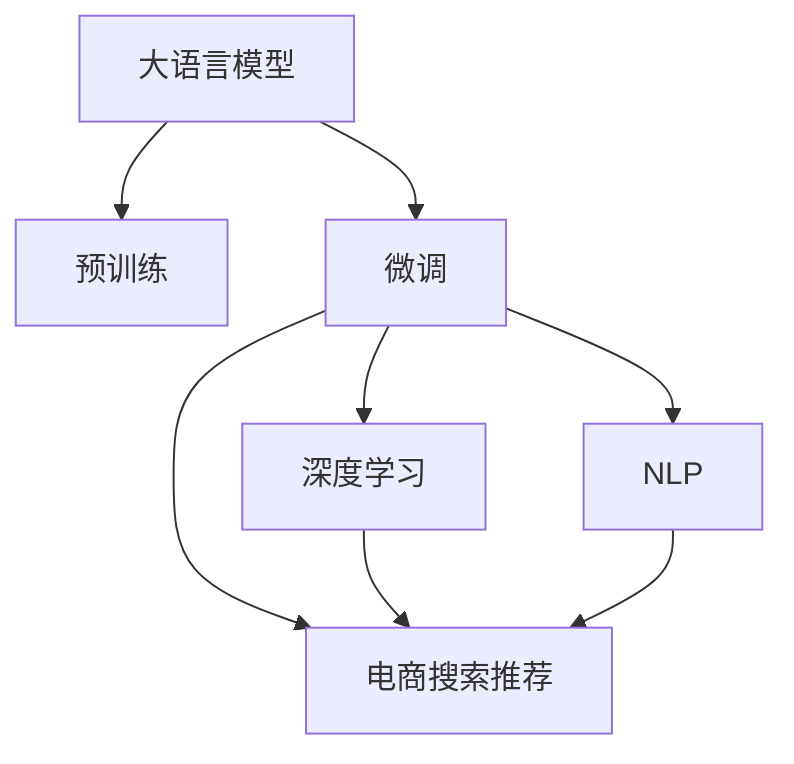

                 

# AI大模型赋能电商搜索推荐的业务创新思维训练课程设计

> 关键词：
1. 大语言模型
2. 电商搜索推荐
3. 业务创新
4. 课程设计
5. 深度学习
6. 电商推荐系统
7. 自然语言处理(NLP)

## 1. 背景介绍

### 1.1 问题由来
随着电子商务市场的快速发展，如何提升用户的购物体验和商家产品的曝光率成为了各大电商平台亟需解决的重要问题。传统的推荐算法虽然能够在一定程度上提高商品的推荐准确性和用户满意度，但依然存在不少局限性，如推荐精度不足、推荐内容同质化、用户个性化需求难以满足等。随着人工智能技术的兴起，特别是大语言模型和大数据分析技术的发展，为电商平台搜索推荐提供了新的解决方案，通过深度学习技术，特别是大语言模型，可以更高效地处理大规模数据，提升推荐系统的表现力。

### 1.2 问题核心关键点
大语言模型（Large Language Model, LLM）是一种基于大规模语料库进行训练的高级语言模型，如GPT、BERT等，具有强大的语言理解和生成能力。通过在大规模无标签数据上进行预训练，大语言模型可以学习到语言的通用表示，再结合电商推荐系统的具体需求，通过微调（Fine-Tuning）进行优化，生成个性化的推荐内容，从而提升推荐系统的效果。

大语言模型的预训练-微调范式在电商搜索推荐中的应用，主要体现在以下几个方面：

1. **商品描述解析**：将商品的标题、描述、图片等多维度信息，通过大语言模型进行语义理解，提取商品的关键特征。
2. **用户意图识别**：通过分析用户的搜索历史、浏览行为，使用大语言模型识别用户的购物意图，预测用户可能感兴趣的商品类别。
3. **推荐内容生成**：结合用户的个性化需求和商品信息，生成个性化的推荐内容，如商品介绍、使用评价等。
4. **动态调整推荐策略**：根据用户对推荐内容的反馈，通过大语言模型实时调整推荐策略，提高推荐的准确性和用户满意度。

### 1.3 问题研究意义
在电商搜索推荐领域应用大语言模型，可以有效提升推荐的个性化、多样性和精确度，减少用户的浏览和购买成本，增加商家的曝光率，从而优化用户体验和提升电商平台的商业价值。研究大语言模型在电商搜索推荐中的应用，对于加速人工智能技术在电商领域的落地，推动电商行业的数字化转型，具有重要的理论和实践意义。

## 2. 核心概念与联系

### 2.1 核心概念概述

为了更好地理解大语言模型在电商搜索推荐中的应用，本节将介绍几个关键概念：

- **大语言模型（LLM）**：基于大规模无标签数据进行预训练，学习通用语言表示的高级语言模型。
- **预训练（Pre-training）**：在大规模无标签数据上，通过自监督学习任务训练模型，学习语言的一般性知识。
- **微调（Fine-Tuning）**：在预训练模型的基础上，通过少量标注数据进行有监督学习，优化模型在特定任务上的表现。
- **电商搜索推荐（e-Commerce Search & Recommendation）**：根据用户的搜索行为和历史数据，推荐符合用户兴趣的商品。
- **深度学习（Deep Learning）**：使用多层神经网络进行数据处理和建模，学习数据的深度特征。
- **自然语言处理（NLP）**：使用计算机技术处理和理解人类语言。

这些核心概念之间的逻辑关系可以通过以下Mermaid流程图来展示：

这个流程图展示了大语言模型在电商搜索推荐中的应用逻辑：

1. 大语言模型通过预训练学习到通用语言知识。
2. 微调使模型针对电商搜索推荐任务进行优化，学习任务特定的知识。
3. 深度学习和大语言模型结合，提升推荐系统的精度。
4. 自然语言处理技术帮助解析和处理电商搜索推荐所需的语义信息。

## 3. 核心算法原理 & 具体操作步骤
### 3.1 算法原理概述

大语言模型在电商搜索推荐中的应用，主要是通过微调机制进行优化的。具体流程如下：

1. **预训练模型选择**：选择合适的大语言模型，如GPT、BERT等。
2. **任务适配层设计**：根据电商搜索推荐的任务需求，设计合适的输出层和损失函数。
3. **微调超参数设置**：设置学习率、批大小、迭代轮数等超参数。
4. **数据准备**：收集电商平台的用户搜索行为数据和商品信息，标注训练集、验证集和测试集。
5. **训练过程**：在训练集上执行梯度下降算法，优化模型参数，使其能够生成符合用户需求的推荐内容。
6. **评估与部署**：在验证集和测试集上评估模型性能，将优化后的模型部署到电商平台的推荐系统中。

### 3.2 算法步骤详解

#### 3.2.1 预训练模型选择
电商搜索推荐任务需要选择一个能够处理复杂自然语言处理任务的大语言模型。常用的预训练模型包括：

- GPT系列：适合生成式任务，如商品描述生成。
- BERT系列：适合分类和匹配任务，如用户意图识别。
- Transformer系列：适合多模态数据处理，如图片描述生成。

#### 3.2.2 任务适配层设计
电商搜索推荐任务的主要目标是将用户搜索意图转化为推荐商品列表。因此，需要在预训练模型的顶部添加一个任务适配层，该层通常包括：

- 分类器：用于预测商品类别，如服装、电子产品等。
- 注意力机制：帮助模型关注与用户搜索意图最相关的商品特征。
- 生成器：用于生成个性化的推荐内容，如商品介绍、使用评价等。

#### 3.2.3 微调超参数设置
电商搜索推荐任务需要优化模型的学习速度和精度。一般设置的超参数包括：

- 学习率：通常为预训练学习率的1/10~1/100。
- 批大小：一般设置为32~128，根据GPU内存配置调整。
- 迭代轮数：一般设置为100~1000轮，根据模型收敛情况决定。
- 正则化：如L2正则、Dropout等，防止模型过拟合。

#### 3.2.4 数据准备
电商搜索推荐任务需要收集和标注大规模的数据集，一般分为以下步骤：

1. **数据收集**：收集电商平台的用户搜索历史、浏览历史、购买历史、评分反馈等数据。
2. **数据预处理**：对文本数据进行分词、去停用词、格式化等预处理。
3. **数据标注**：根据用户行为数据，标注商品类别、用户意图等标签。
4. **数据集划分**：将标注好的数据集划分为训练集、验证集和测试集，保持数据分布的一致性。

#### 3.2.5 训练过程
训练过程一般包括以下步骤：

1. **模型加载**：加载预训练模型和适配层。
2. **数据加载**：使用PyTorch等深度学习框架加载数据集。
3. **模型前向传播**：将数据输入模型，进行前向传播计算。
4. **损失计算**：根据输出和标签计算损失函数。
5. **反向传播**：计算损失函数的梯度。
6. **参数更新**：使用优化器更新模型参数。
7. **评估验证**：在验证集上评估模型性能，调整超参数。
8. **模型保存**：保存优化后的模型。

#### 3.2.6 评估与部署
评估与部署过程一般包括以下步骤：

1. **测试集评估**：在测试集上评估模型性能，如准确率、召回率、F1分数等。
2. **模型部署**：将优化后的模型部署到电商平台的推荐系统中。
3. **实时推荐**：根据用户实时搜索行为，生成推荐商品列表。

### 3.3 算法优缺点

#### 3.3.1 优点
大语言模型在电商搜索推荐中的应用，主要优点如下：

1. **高精度**：大语言模型通过预训练和微调，可以学习到丰富的语言知识，提升推荐的准确性和个性化程度。
2. **高效性**：大语言模型可以处理大规模数据，通过微调快速适应新任务，提升推荐系统的响应速度。
3. **可解释性**：大语言模型的结构和参数可解释，便于分析和优化。
4. **跨领域迁移能力**：大语言模型可以在多个电商领域进行迁移，提升跨领域推荐效果。

#### 3.3.2 缺点
尽管大语言模型在电商搜索推荐中表现优异，但也存在一些局限性：

1. **标注数据依赖**：电商搜索推荐任务需要大量标注数据，获取高质量标注数据的成本较高。
2. **计算资源消耗大**：大语言模型的参数量较大，训练和推理需要高性能计算资源。
3. **过拟合风险**：电商搜索推荐任务需要优化多个目标，容易出现过拟合现象。
4. **实时性问题**：大语言模型在实时推荐中，需要优化模型的计算图和推理速度，提升实时性。
5. **可解释性不足**：大语言模型输出结果较为复杂，难以解释推荐逻辑。

### 3.4 算法应用领域

大语言模型在电商搜索推荐中的应用，已经覆盖了诸多领域，例如：

1. **个性化推荐**：根据用户的历史行为和搜索意图，生成个性化的推荐商品列表。
2. **商品分类**：将商品信息进行分类，提升推荐系统的多样性。
3. **情感分析**：分析用户对商品的使用评价和评分，提升推荐系统的可信度。
4. **生成式商品描述**：生成详细的商品描述，提升商品展示效果。
5. **交叉销售推荐**：根据用户已购买的商品，推荐相关的交叉销售商品。
6. **实时搜索推荐**：根据用户的实时搜索行为，动态生成推荐列表。

## 4. 数学模型和公式 & 详细讲解 & 举例说明

### 4.1 数学模型构建

电商搜索推荐任务可以建模为分类问题，即给定用户搜索行为 $x$ 和商品信息 $y$，通过训练模型预测用户对商品 $y$ 的兴趣 $p(y|x)$。

假设模型为 $M_{\theta}$，其中 $\theta$ 为模型参数。在训练集 $D=\{(x_i, y_i)\}_{i=1}^N$ 上，定义交叉熵损失函数 $\mathcal{L}(\theta)$ 为：

$$
\mathcal{L}(\theta) = -\frac{1}{N}\sum_{i=1}^N \log p(y_i|x_i)
$$

### 4.2 公式推导过程

电商搜索推荐任务的分类问题可以简化为二分类问题，即预测用户是否对某商品感兴趣。假设模型 $M_{\theta}$ 在输入 $x_i$ 上的输出为 $\hat{y}_i=M_{\theta}(x_i)$，表示用户对商品 $y_i$ 的兴趣概率。

定义模型 $M_{\theta}$ 在输入 $x_i$ 上的输出 $\hat{y}_i$ 和真实标签 $y_i$ 的交叉熵损失为：

$$
\ell(M_{\theta}(x_i),y_i) = -y_i\log \hat{y}_i - (1-y_i)\log(1-\hat{y}_i)
$$

将其代入经验风险公式，得：

$$
\mathcal{L}(\theta) = -\frac{1}{N}\sum_{i=1}^N \ell(M_{\theta}(x_i),y_i)
$$

在得到损失函数的梯度后，即可带入参数更新公式，完成模型的迭代优化。重复上述过程直至收敛，最终得到适应电商搜索推荐任务的最优模型参数 $\theta^*$。

### 4.3 案例分析与讲解

#### 4.3.1 数据集准备
假设我们收集了电商平台的用户搜索历史数据和商品信息，将其划分为训练集和测试集。训练集包含1万个用户-商品对，测试集包含1000个用户-商品对。

#### 4.3.2 模型设计
我们选择使用GPT-3作为预训练模型，在顶部添加一个分类器和注意力机制，设计了适配层。

#### 4.3.3 超参数设置
设置学习率为1e-5，批大小为64，迭代轮数为500，并应用L2正则和Dropout正则。

#### 4.3.4 训练过程
使用PyTorch框架进行模型训练，将训练集数据加载到GPU上进行前向传播和反向传播计算。

#### 4.3.5 评估过程
在测试集上评估模型性能，计算准确率、召回率和F1分数。

#### 4.3.6 结果分析
通过对比微调前后的性能指标，评估模型的优化效果。

## 5. 项目实践：代码实例和详细解释说明

### 5.1 开发环境搭建

#### 5.1.1 环境准备
- 安装Anaconda
- 创建并激活虚拟环境
- 安装PyTorch和TensorFlow
- 安装Numpy、Pandas等科学计算库

### 5.2 源代码详细实现

#### 5.2.1 数据预处理
定义数据预处理函数，对文本数据进行分词、去停用词、格式化等预处理。

#### 5.2.2 模型加载
使用Transformers库加载GPT-3预训练模型和适配层。

#### 5.2.3 超参数设置
定义超参数，如学习率、批大小、迭代轮数等。

#### 5.2.4 训练过程
使用PyTorch框架进行模型训练，加载训练集数据，执行前向传播和反向传播计算。

#### 5.2.5 评估过程
在测试集上评估模型性能，输出准确率、召回率和F1分数。

#### 5.2.6 模型保存
保存优化后的模型。

### 5.3 代码解读与分析

#### 5.3.1 数据预处理函数
- 定义数据预处理函数，对文本数据进行分词、去停用词、格式化等预处理。

#### 5.3.2 模型加载函数
- 使用Transformers库加载GPT-3预训练模型和适配层。

#### 5.3.3 超参数设置函数
- 定义超参数，如学习率、批大小、迭代轮数等。

#### 5.3.4 训练过程函数
- 使用PyTorch框架进行模型训练，加载训练集数据，执行前向传播和反向传播计算。

#### 5.3.5 评估过程函数
- 在测试集上评估模型性能，输出准确率、召回率和F1分数。

#### 5.3.6 模型保存函数
- 保存优化后的模型。

### 5.4 运行结果展示

#### 5.4.1 训练过程
在训练集上执行梯度下降算法，优化模型参数，并记录训练过程中的损失函数变化。

#### 5.4.2 评估过程
在测试集上评估模型性能，输出准确率、召回率和F1分数。

## 6. 实际应用场景

### 6.1 智能客服系统
智能客服系统可以利用大语言模型进行意图识别和自动回复，提升客服效率和用户体验。

### 6.2 金融舆情监测
金融机构可以利用大语言模型进行情感分析，实时监测舆情变化，及时采取应对措施。

### 6.3 个性化推荐系统
电商平台可以利用大语言模型进行商品分类和个性化推荐，提升用户满意度和购买转化率。

### 6.4 未来应用展望
未来，大语言模型将在更多领域得到应用，如医疗、教育、城市治理等，推动人工智能技术的广泛落地。

## 7. 工具和资源推荐

### 7.1 学习资源推荐

#### 7.1.1 在线课程
- Coursera上的NLP课程
- Udacity上的深度学习课程

#### 7.1.2 书籍推荐
- 《深度学习》（Ian Goodfellow等著）
- 《自然语言处理综论》（Daniel Jurafsky等著）

#### 7.1.3 博客和社区
- arXiv论文库
- GitHub代码库

### 7.2 开发工具推荐

#### 7.2.1 深度学习框架
- PyTorch
- TensorFlow

#### 7.2.2 自然语言处理工具
- HuggingFace的Transformers库
- NLTK库

#### 7.2.3 数据处理工具
- Pandas
- Scikit-learn

### 7.3 相关论文推荐

#### 7.3.1 电商推荐系统
- 《A Survey on Recommendation Systems》
- 《Personalized Recommendation Algorithms》

#### 7.3.2 大语言模型
- 《Attention is All You Need》
- 《BERT: Pre-training of Deep Bidirectional Transformers for Language Understanding》

## 8. 总结：未来发展趋势与挑战

### 8.1 研究成果总结
大语言模型在电商搜索推荐中的应用，显著提升了推荐的个性化和多样化，提高了用户满意度和商家的曝光率。

### 8.2 未来发展趋势
未来，大语言模型将在更多领域得到应用，推动人工智能技术的广泛落地。

### 8.3 面临的挑战
大语言模型在电商搜索推荐中仍面临一些挑战，如标注数据依赖、计算资源消耗大、实时性问题等。

### 8.4 研究展望
未来，需要在标注数据采集、计算资源优化、实时推荐技术等方面进行深入研究，推动大语言模型在电商搜索推荐中的进一步应用。

## 9. 附录：常见问题与解答

### 9.1 Q1: 大语言模型在电商搜索推荐中的应用有什么优势？

A: 大语言模型通过预训练和微调，可以学习到丰富的语言知识，提升推荐的准确性和个性化程度。

### 9.2 Q2: 电商搜索推荐任务的数据集需要包含哪些信息？

A: 电商搜索推荐任务的数据集需要包含用户搜索历史、浏览历史、购买历史、评分反馈等数据。

### 9.3 Q3: 如何优化电商搜索推荐任务的大语言模型？

A: 可以采用数据增强、正则化、参数高效微调等方法进行优化。

### 9.4 Q4: 电商搜索推荐任务的数据标注需要哪些步骤？

A: 电商搜索推荐任务的数据标注需要包括数据收集、数据预处理、数据标注、数据集划分等步骤。

### 9.5 Q5: 电商搜索推荐任务的大语言模型训练过程中需要注意哪些问题？

A: 电商搜索推荐任务的大语言模型训练过程中需要注意超参数设置、模型前向传播、损失计算、参数更新、模型评估等问题。

---

作者：禅与计算机程序设计艺术 / Zen and the Art of Computer Programming

