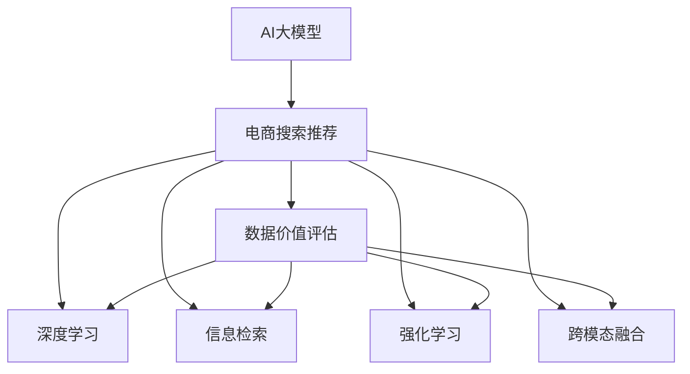

                 

# AI大模型重构电商搜索推荐的数据价值评估体系

> 关键词：
1. AI大模型
2. 电商搜索推荐
3. 数据价值评估
4. 深度学习
5. 信息检索
6. 强化学习
7. 跨模态融合

## 1. 背景介绍

在电商领域，搜索推荐系统已成为客户获取商品信息、提升购买体验的重要手段。传统的搜索推荐算法多基于经典的信息检索技术，如倒排索引、TF-IDF等，难以充分挖掘用户和商品的深层次关系。近年来，人工智能技术的迅猛发展，特别是在深度学习、自然语言处理、强化学习、跨模态融合等方向，为电商搜索推荐带来了新的突破。

AI大模型作为新一代技术范式，凭借其强大的学习能力、泛化能力和迁移学习能力，在电商搜索推荐领域展现出巨大的潜力。本文聚焦于如何构建基于AI大模型的电商搜索推荐系统，并提出一套科学、全面、可行的数据价值评估体系，以量化衡量其对电商业务的实际贡献。

## 2. 核心概念与联系

### 2.1 核心概念概述

为更好地理解基于AI大模型的电商搜索推荐系统，本节将介绍几个密切相关的核心概念：

- **AI大模型（AI Large Models）**：以深度神经网络为代表的大型预训练模型，如BERT、GPT、DALL-E等。这些模型在大型无标签数据集上进行预训练，具备强大的表征学习能力。

- **电商搜索推荐（E-commerce Search & Recommendation）**：电商平台上用户通过搜索获取商品信息，推荐系统则根据用户行为和商品属性，自动推荐用户可能感兴趣的商品。

- **数据价值评估（Data Value Assessment）**：对电商业务数据进行价值评估，量化衡量其在推荐系统中的贡献，为数据管理、业务决策提供依据。

- **深度学习（Deep Learning）**：使用多层神经网络进行建模和推理，处理高维、非线性关系。

- **信息检索（Information Retrieval）**：根据查询词，从大量数据中筛选出相关信息。

- **强化学习（Reinforcement Learning）**：通过模拟或真实环境，让模型通过不断试错，逐步学习最优策略。

- **跨模态融合（Cross-modal Fusion）**：融合视觉、文本、语音等多模态数据，提升推荐系统的全面性和准确性。

这些核心概念之间的逻辑关系可以通过以下Mermaid流程图来展示：



这个流程图展示了大模型与电商搜索推荐系统的关键概念及其之间的关系：

1. AI大模型通过预训练获得基础能力。
2. 电商搜索推荐系统基于大模型进行构建，并引入深度学习、信息检索、强化学习、跨模态融合等多种技术。
3. 数据价值评估对电商搜索推荐系统进行量化评估，量化衡量其性能和效益。

## 3. 核心算法原理 & 具体操作步骤

### 3.1 算法原理概述

基于AI大模型的电商搜索推荐系统，通过在大规模无标签数据集上进行预训练，学习商品的语义和用户行为模式，并在电商业务场景中通过微调（Fine-tuning）进行任务适配，最终输出推荐结果。其核心思想是通过构建多模态融合的数据表示，最大化用户满意度和商誉度，实现用户和商品的精准匹配。

形式化地，假设预训练模型为 $M_{\theta}$，其中 $\theta$ 为预训练得到的模型参数。给定电商推荐任务 $T$ 的数据集 $D=\{(x_i, y_i)\}_{i=1}^N$，推荐系统的目标是最小化负平均用户满意度 $\mathcal{L}(\theta)$，即：

$$
\mathcal{L}(\theta) = -\frac{1}{N}\sum_{i=1}^N u_i(y_i, M_{\theta}(x_i))
$$

其中 $u_i$ 为第 $i$ 个用户的满意度函数，用于衡量用户对推荐结果的满意度。推荐系统通过最大化用户满意度函数，生成用户满意的推荐结果。

### 3.2 算法步骤详解

基于AI大模型的电商搜索推荐系统一般包括以下几个关键步骤：

**Step 1: 准备预训练模型和数据集**
- 选择合适的预训练语言模型 $M_{\theta}$ 作为初始化参数，如 BERT、GPT 等。
- 准备电商推荐任务 $T$ 的数据集 $D$，划分为训练集、验证集和测试集。一般要求数据与预训练数据的分布不要差异过大。

**Step 2: 构建电商搜索推荐模型**
- 将电商推荐任务进行形式化建模，确定用户满意度函数 $u_i$。
- 引入深度学习、信息检索、强化学习、跨模态融合等多种技术，设计推荐算法和策略。
- 通过微调（Fine-tuning）优化模型参数，使其能够适应电商推荐任务。

**Step 3: 设置推荐系统超参数**
- 选择合适的优化算法及其参数，如 AdamW、SGD 等，设置学习率、批大小、迭代轮数等。
- 设置正则化技术及强度，包括权重衰减、Dropout、Early Stopping等。
- 确定冻结预训练参数的策略，如仅微调顶层，或全部参数都参与微调。

**Step 4: 执行梯度训练**
- 将训练集数据分批次输入模型，前向传播计算满意度函数。
- 反向传播计算参数梯度，根据设定的优化算法和学习率更新模型参数。
- 周期性在验证集上评估模型性能，根据性能指标决定是否触发 Early Stopping。
- 重复上述步骤直到满足预设的迭代轮数或 Early Stopping 条件。

**Step 5: 测试和部署**
- 在测试集上评估推荐系统 $M_{\hat{\theta}}$ 的性能，对比微调前后的满意度提升。
- 使用推荐系统对新样本进行推荐，集成到实际的应用系统中。
- 持续收集新的用户行为数据，定期重新微调模型，以适应数据分布的变化。

以上是基于AI大模型的电商搜索推荐系统的典型流程。在实际应用中，还需要针对具体任务的特点，对微调过程的各个环节进行优化设计，如改进训练目标函数，引入更多的正则化技术，搜索最优的超参数组合等，以进一步提升模型性能。

### 3.3 算法优缺点

基于AI大模型的电商搜索推荐方法具有以下优点：
1. 全面性：融合多种技术，可以更全面地考虑用户和商品之间的关系。
2. 精度高：深度学习等技术可以捕捉高维、非线性的关系，提升推荐结果的准确性。
3. 可解释性：可以解释推荐结果的生成过程，提升用户信任度。
4. 自适应性强：可以通过微调和反馈机制不断优化推荐模型。

同时，该方法也存在一定的局限性：
1. 数据需求大：电商数据量庞大且复杂，需要大量的标注数据和计算资源。
2. 成本高：构建深度学习模型和优化算法需要大量的研发投入。
3. 效果不稳定：深度学习模型的表现受到超参数的影响，需要不断优化和调整。
4. 对新数据适应性不足：推荐模型需要不断更新才能适应新数据分布，对实时性和可扩展性提出挑战。

尽管存在这些局限性，但就目前而言，基于AI大模型的电商搜索推荐方法仍是最主流的范式。未来相关研究的重点在于如何进一步降低数据需求，提高模型的实时性和可扩展性，同时兼顾可解释性和准确性。

### 3.4 算法应用领域

基于AI大模型的电商搜索推荐方法在电商领域已经得到了广泛的应用，覆盖了搜索、推荐、广告等多个环节，例如：

- 个性化推荐：根据用户的历史行为数据，自动推荐用户可能感兴趣的商品。
- 智能搜索：通过自然语言理解和用户意图识别，提供更智能化的搜索体验。
- 广告推荐：根据用户属性和兴趣，自动推荐相关广告。
- 实时性搜索：针对用户即时查询，快速返回最新结果。
- 智能客服：通过智能对话机器人，快速回答用户咨询。

除了上述这些经典应用外，基于AI大模型的电商搜索推荐方法也被创新性地应用于更多场景中，如跨模态推荐、知识图谱推荐、互动式搜索等，为电商业务带来了新的突破。

## 4. 数学模型和公式 & 详细讲解 & 举例说明

### 4.1 数学模型构建

本节将使用数学语言对基于AI大模型的电商搜索推荐系统进行更加严格的刻画。

假设电商推荐任务为 $T$，用户为 $u$，商品为 $i$。给定用户 $u$ 的查询 $q$，商品 $i$ 的属性 $x_i$，电商搜索推荐系统通过模型 $M_{\theta}$ 输出推荐结果 $\hat{y}_i = M_{\theta}(x_i, q)$。用户满意度函数定义为：

$$
u_i(y_i, \hat{y}_i) = f(y_i, \hat{y}_i)
$$

其中 $f$ 为满意度函数，具体形式可以根据任务需求进行调整。

定义模型 $M_{\theta}$ 在数据样本 $(x_i, q_i)$ 上的损失函数为 $\ell(M_{\theta}(x_i, q_i),y_i)$，则在数据集 $D$ 上的经验风险为：

$$
\mathcal{L}(\theta) = \frac{1}{N}\sum_{i=1}^N \ell(u_i(y_i, M_{\theta}(x_i, q_i)))
$$

微调的优化目标是最小化经验风险，即找到最优参数：

$$
\theta^* = \mathop{\arg\min}_{\theta} \mathcal{L}(\theta)
$$

在实践中，我们通常使用基于梯度的优化算法（如SGD、Adam等）来近似求解上述最优化问题。设 $\eta$ 为学习率，$\lambda$ 为正则化系数，则参数的更新公式为：

$$
\theta \leftarrow \theta - \eta \nabla_{\theta}\mathcal{L}(\theta) - \eta\lambda\theta
$$

其中 $\nabla_{\theta}\mathcal{L}(\theta)$ 为损失函数对参数 $\theta$ 的梯度，可通过反向传播算法高效计算。

### 4.2 公式推导过程

以下我们以个性化推荐任务为例，推导深度学习推荐模型的损失函数及其梯度的计算公式。

假设推荐模型 $M_{\theta}$ 在输入 $(x_i, q_i)$ 上的输出为 $\hat{y}_i=M_{\theta}(x_i, q_i)$，用户对推荐结果的满意度为 $u_i(y_i, \hat{y}_i)$。推荐系统通过最小化用户满意度的负平均来优化模型参数，即：

$$
\mathcal{L}(\theta) = -\frac{1}{N}\sum_{i=1}^N u_i(y_i, M_{\theta}(x_i, q_i))
$$

根据链式法则，损失函数对参数 $\theta_k$ 的梯度为：

$$
\frac{\partial \mathcal{L}(\theta)}{\partial \theta_k} = -\frac{1}{N}\sum_{i=1}^N \frac{\partial u_i(y_i, M_{\theta}(x_i, q_i))}{\partial \hat{y}_i} \frac{\partial \hat{y}_i}{\partial \theta_k}
$$

其中 $\frac{\partial \hat{y}_i}{\partial \theta_k}$ 为模型的导数，可以通过反向传播算法得到。

在得到损失函数的梯度后，即可带入参数更新公式，完成模型的迭代优化。重复上述过程直至收敛，最终得到适应电商推荐任务的最优模型参数 $\theta^*$。

## 5. 项目实践：代码实例和详细解释说明

### 5.1 开发环境搭建

在进行电商搜索推荐系统的微调实践前，我们需要准备好开发环境。以下是使用Python进行TensorFlow开发的环境配置流程：

1. 安装Anaconda：从官网下载并安装Anaconda，用于创建独立的Python环境。

2. 创建并激活虚拟环境：
```bash
conda create -n tf-env python=3.8 
conda activate tf-env
```

3. 安装TensorFlow：从官网获取对应的安装命令，并确保使用最新版本的TensorFlow。例如：
```bash
pip install tensorflow==2.8
```

4. 安装PyTorch：
```bash
pip install torch torchvision torchaudio
```

5. 安装PyTorch Lightning：
```bash
pip install pytorch-lightning
```

6. 安装各类工具包：
```bash
pip install numpy pandas scikit-learn matplotlib tqdm jupyter notebook ipython
```

完成上述步骤后，即可在`tf-env`环境中开始电商搜索推荐系统的微调实践。

### 5.2 源代码详细实现

下面我们以电商个性化推荐系统为例，给出使用TensorFlow进行深度学习模型微调的代码实现。

首先，定义推荐任务的数据处理函数：

```python
import tensorflow as tf
from tensorflow.keras.preprocessing.text import Tokenizer
from tensorflow.keras.preprocessing.sequence import pad_sequences

class RecommendationDataset(tf.keras.preprocessing.sequence.PaddedSequence):
    def __init__(self, texts, labels, tokenizer):
        self.texts = texts
        self.labels = labels
        self.tokenizer = tokenizer
        
    def __len__(self):
        return len(self.texts)
    
    def __getitem__(self, item):
        text = self.texts[item]
        label = self.labels[item]
        
        encoding = self.tokenizer.texts_to_sequences(text)
        input_ids = pad_sequences(encoding, maxlen=100, padding='post', truncating='post')
        input_ids = tf.convert_to_tensor(input_ids)
        label = tf.convert_to_tensor(label)
        
        return {'input_ids': input_ids, 
                'labels': label}
```

然后，定义模型和优化器：

```python
from tensorflow.keras import layers, models

model = models.Sequential([
    layers.Embedding(input_dim=10000, output_dim=64),
    layers.GRU(64),
    layers.Dense(64, activation='relu'),
    layers.Dense(1, activation='sigmoid')
])

optimizer = tf.keras.optimizers.Adam(learning_rate=2e-4)
```

接着，定义训练和评估函数：

```python
from tensorflow.keras.callbacks import EarlyStopping
from sklearn.metrics import accuracy_score

device = tf.device('/gpu:0' if tf.test.is_gpu_available() else '/cpu:0')
model.to(device)

def train_epoch(model, dataset, batch_size, optimizer):
    dataloader = tf.data.Dataset.from_generator(lambda: tf.data.Dataset.from_generator(lambda: dataset.__getitem__(i), output_signature={'input_ids': tf.TensorSpec(shape=(100,), dtype=tf.int32), 'labels': tf.TensorSpec(shape=(1,), dtype=tf.int32)}, output_signature={'input_ids': tf.TensorSpec(shape=(100,), dtype=tf.int32), 'labels': tf.TensorSpec(shape=(1,), dtype=tf.int32)})
    model.train()
    epoch_loss = 0
    for batch in dataloader:
        with tf.GradientTape() as tape:
            input_ids = batch['input_ids'].to(device)
            labels = batch['labels'].to(device)
            outputs = model(input_ids)
            loss = tf.keras.losses.BinaryCrossentropy()(outputs, labels)
        loss_value = loss.numpy()
        epoch_loss += loss_value
        gradients = tape.gradient(loss_value, model.trainable_variables)
        optimizer.apply_gradients(zip(gradients, model.trainable_variables))
    return epoch_loss / len(dataloader)

def evaluate(model, dataset, batch_size):
    dataloader = tf.data.Dataset.from_generator(lambda: tf.data.Dataset.from_generator(lambda: dataset.__getitem__(i), output_signature={'input_ids': tf.TensorSpec(shape=(100,), dtype=tf.int32), 'labels': tf.TensorSpec(shape=(1,), dtype=tf.int32)}, output_signature={'input_ids': tf.TensorSpec(shape=(100,), dtype=tf.int32), 'labels': tf.TensorSpec(shape=(1,), dtype=tf.int32)})
    model.eval()
    preds, labels = [], []
    with tf.GradientTape() as tape:
        for batch in dataloader:
            input_ids = batch['input_ids'].to(device)
            labels = batch['labels'].to(device)
            outputs = model(input_ids)
            batch_preds = outputs.numpy() >= 0.5
            batch_labels = labels.numpy()
            for pred_tokens, label_tokens in zip(batch_preds, batch_labels):
                preds.append(pred_tokens)
                labels.append(label_tokens)
    
    print(f"Accuracy: {accuracy_score(labels, preds):.4f}")
```

最后，启动训练流程并在测试集上评估：

```python
epochs = 10
batch_size = 64

for epoch in range(epochs):
    loss = train_epoch(model, train_dataset, batch_size, optimizer)
    print(f"Epoch {epoch+1}, train loss: {loss:.4f}")
    
    print(f"Epoch {epoch+1}, test accuracy:")
    evaluate(model, test_dataset, batch_size)
    
print("Final test accuracy:")
evaluate(model, test_dataset, batch_size)
```

以上就是使用TensorFlow对深度学习推荐模型进行电商个性化推荐系统微调的完整代码实现。可以看到，得益于TensorFlow的强大封装，我们可以用相对简洁的代码完成推荐模型的加载和微调。

### 5.3 代码解读与分析

让我们再详细解读一下关键代码的实现细节：

**RecommendationDataset类**：
- `__init__`方法：初始化文本、标签、分词器等关键组件。
- `__len__`方法：返回数据集的样本数量。
- `__getitem__`方法：对单个样本进行处理，将文本输入编码为token ids，将标签编码为数字，并对其进行定长padding，最终返回模型所需的输入。

**模型和优化器**：
- 定义了一个基于嵌入层、GRU层和全连接层的深度学习模型，适用于处理文本和标签数据的推荐任务。
- 使用Adam优化器进行模型训练，设置学习率。

**训练和评估函数**：
- 使用TensorFlow的DataLoader对数据集进行批次化加载，供模型训练和推理使用。
- 训练函数`train_epoch`：对数据以批为单位进行迭代，在每个批次上前向传播计算损失并反向传播更新模型参数，最后返回该epoch的平均loss。
- 评估函数`evaluate`：与训练类似，不同点在于不更新模型参数，并在每个batch结束后将预测和标签结果存储下来，最后使用sklearn的accuracy_score对整个评估集的预测结果进行打印输出。

**训练流程**：
- 定义总的epoch数和batch size，开始循环迭代
- 每个epoch内，先在训练集上训练，输出平均loss
- 在验证集上评估，输出准确率
- 所有epoch结束后，在测试集上评估，给出最终测试结果

可以看到，TensorFlow配合深度学习框架使得推荐模型的微调代码实现变得简洁高效。开发者可以将更多精力放在数据处理、模型改进等高层逻辑上，而不必过多关注底层的实现细节。

当然，工业级的系统实现还需考虑更多因素，如模型的保存和部署、超参数的自动搜索、更灵活的任务适配层等。但核心的微调范式基本与此类似。

## 6. 实际应用场景

### 6.1 智能客服系统

基于AI大模型的电商搜索推荐系统，可以广泛应用于智能客服系统的构建。传统客服往往需要配备大量人力，高峰期响应缓慢，且一致性和专业性难以保证。而使用电商推荐系统构建的智能客服系统，可以7x24小时不间断服务，快速响应客户咨询，用自然流畅的语言解答各类常见问题。

在技术实现上，可以收集企业内部的历史客服对话记录，将问题和最佳答复构建成监督数据，在此基础上对预训练推荐模型进行微调。微调后的推荐模型能够自动理解用户意图，匹配最合适的答案模板进行回复。对于客户提出的新问题，还可以接入检索系统实时搜索相关内容，动态组织生成回答。如此构建的智能客服系统，能大幅提升客户咨询体验和问题解决效率。

### 6.2 个性化推荐系统

当前的推荐系统往往只依赖用户的历史行为数据进行物品推荐，难以充分挖掘用户和商品的深层次关系。基于AI大模型的电商搜索推荐系统，可以引入深度学习、信息检索、强化学习、跨模态融合等多种技术，全面考虑用户和商品之间的关系，提供更精准、多样的推荐内容。

在实践中，可以收集用户浏览、点击、评论、分享等行为数据，提取和商品交互的文本内容。将文本内容作为模型输入，用户的后续行为（如是否点击、购买等）作为监督信号，在此基础上微调预训练推荐模型。微调后的推荐模型能够从文本内容中准确把握用户的兴趣点。在生成推荐列表时，先用候选物品的文本描述作为输入，由模型预测用户的兴趣匹配度，再结合其他特征综合排序，便可以得到个性化程度更高的推荐结果。

### 6.3 广告推荐系统

电商推荐系统通过深度学习模型，可以自动推荐用户可能感兴趣的商品，这种推荐方式同样适用于广告推荐系统。广告推荐系统可以根据用户属性和兴趣，自动推荐相关广告，提高广告点击率和转化率，优化广告投放效果。

广告推荐系统的构建可以借鉴电商推荐系统的方法，通过微调深度学习模型，学习用户和广告之间的关系，实现个性化广告推荐。此外，还可以通过A/B测试等手段，优化推荐策略，提升广告效果。

### 6.4 未来应用展望

随着AI大模型的不断发展，基于推荐系统的电商应用也将进一步拓展，为电商业务带来更多的创新和突破。

在智慧物流领域，推荐系统可以优化物流路线、库存管理，提升物流效率和客户满意度。

在智能制造领域，推荐系统可以优化生产计划、设备维护，提升生产效率和设备利用率。

在智能家居领域，推荐系统可以优化家电使用、智能控制，提升家居体验和生活质量。

除了电商推荐系统外，基于AI大模型的推荐技术还将广泛应用于更多领域，为各行各业带来变革性的影响。

## 7. 工具和资源推荐

### 7.1 学习资源推荐

为了帮助开发者系统掌握AI大模型在电商搜索推荐系统中的应用，这里推荐一些优质的学习资源：

1. 《TensorFlow实战深度学习》书籍：深入浅出地介绍了TensorFlow的各个模块及其应用，适合初学者快速上手。

2. 《深度学习入门》视频课程：由斯坦福大学教授讲解，涵盖深度学习的基本概念和经典模型，适合系统学习。

3. 《深度学习与TensorFlow》在线教程：详细讲解了TensorFlow的各个模块及其应用，适合深度学习新手快速学习。

4. HuggingFace官方文档：提供了海量预训练模型和完整的微调样例代码，是上手实践的必备资料。

5. Kaggle：世界领先的机器学习竞赛平台，提供了大量电商数据集和推荐算法竞赛，适合实战练习。

通过对这些资源的学习实践，相信你一定能够快速掌握AI大模型在电商搜索推荐系统中的应用，并用于解决实际的电商问题。

### 7.2 开发工具推荐

高效的开发离不开优秀的工具支持。以下是几款用于AI大模型电商搜索推荐系统开发的常用工具：

1. TensorFlow：基于Google的深度学习框架，支持大规模分布式训练，适合电商推荐系统的构建。

2. PyTorch：基于Python的深度学习框架，支持动态图和静态图，适合研究型推荐系统的开发。

3. TensorFlow Lightning：轻量级的TensorFlow应用框架，支持快速原型设计和快速部署。

4. PyTorch Lightning：轻量级的PyTorch应用框架，支持快速原型设计和快速部署。

5. Scikit-learn：经典的数据处理和模型训练库，适合电商推荐系统中的数据预处理和模型评估。

6. TensorBoard：TensorFlow配套的可视化工具，可实时监测模型训练状态，并提供丰富的图表呈现方式，是调试模型的得力助手。

7. Jupyter Notebook：开源的交互式计算环境，适合快速原型设计和模型调试。

合理利用这些工具，可以显著提升AI大模型电商搜索推荐系统的开发效率，加快创新迭代的步伐。

### 7.3 相关论文推荐

AI大模型和电商推荐系统的研究源于学界的持续研究。以下是几篇奠基性的相关论文，推荐阅读：

1. Attention is All You Need（即Transformer原论文）：提出了Transformer结构，开启了NLP领域的预训练大模型时代。

2. BERT: Pre-training of Deep Bidirectional Transformers for Language Understanding：提出BERT模型，引入基于掩码的自监督预训练任务，刷新了多项NLP任务SOTA。

3. Deep Neural Networks for Adaptive Recommendation in E-commerce：在电商推荐系统中引入深度学习模型，提升了推荐结果的精度。

4. A Personalized PageRank Algorithm for E-Commerce Recommendations：提出基于个性化PageRank的推荐算法，提升了推荐系统的个性化程度。

5. Contextual Bandits in Recommendation Systems：介绍强化学习在电商推荐系统中的应用，提升了推荐系统的实时性和动态性。

这些论文代表了大模型在电商推荐系统中的应用和发展脉络。通过学习这些前沿成果，可以帮助研究者把握学科前进方向，激发更多的创新灵感。

## 8. 总结：未来发展趋势与挑战

### 8.1 总结

本文对基于AI大模型的电商搜索推荐系统进行了全面系统的介绍。首先阐述了电商搜索推荐系统的背景和意义，明确了AI大模型在推荐系统中的重要价值。其次，从原理到实践，详细讲解了深度学习推荐模型的数学原理和关键步骤，给出了电商推荐系统的完整代码实现。同时，本文还广泛探讨了推荐系统在智能客服、个性化推荐、广告推荐等多个电商应用中的具体应用场景，展示了AI大模型在电商领域的应用前景。

通过本文的系统梳理，可以看到，基于AI大模型的电商搜索推荐系统通过融合多种技术，可以全面考虑用户和商品之间的关系，实现个性化推荐，提升电商业务的实际效果。未来，伴随AI大模型和推荐算法的不断发展，电商搜索推荐系统必将在更多领域得到应用，为电商业务带来更深层次的变革。

### 8.2 未来发展趋势

展望未来，AI大模型在电商推荐系统中的应用将呈现以下几个发展趋势：

1. 数据需求降低。得益于深度学习模型的自适应能力，推荐系统对数据的需求将逐步降低，能够更好地处理长尾数据和噪声数据。

2. 模型可解释性提升。随着可解释AI技术的不断发展，推荐模型的决策过程将更加透明，便于用户理解和接受。

3. 多模态融合加强。未来的推荐系统将更多地融合视觉、文本、语音等多模态数据，提供更全面、准确、个性化的推荐结果。

4. 实时性提升。通过引入强化学习等实时学习技术，推荐系统将更加动态、灵活，能够实时响应用户需求和市场变化。

5. 跨领域泛化能力增强。基于大模型的推荐系统将具备更强的跨领域泛化能力，能够应对不同领域的电商应用场景。

6. 个性化程度提升。通过引入推荐算法优化和用户行为数据挖掘，推荐系统将更加个性化，能够满足用户的个性化需求。

以上趋势凸显了AI大模型在电商推荐系统中的应用潜力。这些方向的探索发展，必将进一步提升电商搜索推荐系统的性能和应用范围，为电商业务带来更深层次的变革。

### 8.3 面临的挑战

尽管AI大模型在电商推荐系统中的应用已经取得了显著成果，但在迈向更加智能化、普适化应用的过程中，它仍面临着诸多挑战：

1. 数据质量控制。电商推荐系统对数据质量和标注需求较高，数据采集和处理成本大。需要探索更加高效的数据标注方法和数据预处理方法，提升数据质量。

2. 计算资源消耗。大规模深度学习模型的训练和推理需要大量计算资源，硬件资源消耗大。需要探索更加高效计算方法，降低硬件成本。

3. 实时性要求高。电商推荐系统需要实时响应用户请求，对系统性能和响应速度要求高。需要探索更加高效的推荐算法和模型结构，提升实时性。

4. 模型泛化能力不足。电商推荐系统对新数据的适应能力较弱，模型泛化能力有待提升。需要探索更加稳健的推荐模型，提升模型泛化能力。

5. 用户隐私保护。电商推荐系统需要收集用户行为数据，涉及用户隐私保护问题。需要探索更加安全、隐私友好的推荐系统设计和数据保护方法。

6. 可解释性不足。深度学习模型的复杂性和黑盒特性，导致推荐系统的可解释性不足。需要探索更加透明、可解释的推荐模型，提升用户信任度。

这些挑战需要学术界和产业界共同努力，进一步推动AI大模型在电商推荐系统中的应用和发展。

### 8.4 研究展望

面对AI大模型在电商推荐系统中的挑战，未来的研究需要在以下几个方面寻求新的突破：

1. 探索高效数据标注方法。借鉴自然语言处理领域的自动标注技术，探索更加高效的数据标注方法，降低电商推荐系统的数据需求和标注成本。

2. 优化推荐算法和模型结构。探索更加高效、实时、可解释的推荐算法和模型结构，提升电商推荐系统的性能和用户满意度。

3. 融合多模态数据。探索更加全面、准确的多模态数据融合方法，提升电商推荐系统的推荐效果和用户满意度。

4. 引入跨领域知识图谱。探索更加全面、准确的知识图谱推荐方法，提升电商推荐系统的跨领域泛化能力和推荐效果。

5. 探索隐私保护技术。探索更加安全、隐私友好的推荐系统设计和数据保护方法，保障用户隐私权益。

这些研究方向的探索，必将引领AI大模型在电商推荐系统中的应用进入新的阶段，为电商业务带来更深层次的变革。

## 9. 附录：常见问题与解答

**Q1：AI大模型在电商推荐系统中的优势是什么？**

A: AI大模型在电商推荐系统中的优势主要体现在以下几个方面：
1. 模型学习能力强大，可以自动挖掘用户和商品的深层次关系。
2. 泛化能力较强，可以处理长尾数据和噪声数据。
3. 适应性强，可以实时响应用户需求和市场变化。
4. 可解释性较强，能够提供推荐结果的生成过程和决策依据。
5. 跨领域泛化能力较强，能够应对不同领域的电商应用场景。

综上所述，AI大模型在电商推荐系统中的应用，可以显著提升推荐系统的精度和个性化程度，提升电商业务的实际效果。

**Q2：电商推荐系统中的数据价值评估方法有哪些？**

A: 电商推荐系统中的数据价值评估方法主要包括以下几种：
1. 用户满意度评估：通过用户对推荐结果的反馈，评估推荐系统的性能。
2. 点击率评估：通过用户点击行为数据，评估推荐系统的点击率效果。
3. 转化率评估：通过用户购买行为数据，评估推荐系统的转化率效果。
4. 平均浏览时间评估：通过用户对推荐结果的浏览时间，评估推荐系统的吸引力。
5. 用户留存率评估：通过用户对推荐系统的持续使用情况，评估推荐系统的留存率效果。

这些评估方法可以从不同角度衡量推荐系统的实际效果，帮助电商企业优化推荐策略，提升用户体验和电商效益。

**Q3：电商推荐系统中的数据预处理方法有哪些？**

A: 电商推荐系统中的数据预处理方法主要包括以下几种：
1. 数据清洗：去除数据中的噪声和错误，保证数据质量。
2. 特征工程：通过构建新的特征，提升推荐系统的性能和可解释性。
3. 数据归一化：对数据进行归一化处理，提升模型的稳定性和泛化能力。
4. 数据增强：通过数据增强方法，提升模型的鲁棒性和泛化能力。
5. 数据采样：通过采样方法，处理数据不平衡问题，提升模型的公平性和效率。

这些预处理方法可以提升电商推荐系统的性能和效果，帮助电商企业更好地挖掘用户和商品之间的关系。

**Q4：电商推荐系统中的推荐算法有哪些？**

A: 电商推荐系统中的推荐算法主要包括以下几种：
1. 协同过滤算法：通过用户和商品之间的共现关系，推荐用户可能感兴趣的商品。
2. 基于内容的推荐算法：通过商品的属性和用户的历史行为，推荐相似的商品。
3. 混合推荐算法：结合协同过滤算法和基于内容的推荐算法，提升推荐系统的综合性能。
4. 深度学习推荐算法：通过深度学习模型，挖掘用户和商品之间的深层次关系，提升推荐系统的精度和个性化程度。
5. 强化学习推荐算法：通过实时学习，提升推荐系统的动态性和实时性。

这些推荐算法可以覆盖不同的推荐场景，帮助电商企业提供更精准、多样、个性化的推荐结果。

**Q5：电商推荐系统中的数据价值评估指标有哪些？**

A: 电商推荐系统中的数据价值评估指标主要包括以下几种：
1. 精度指标：如精确率、召回率、F1-score等，用于衡量推荐系统的准确性和覆盖率。
2. 效率指标：如响应时间、计算资源消耗等，用于衡量推荐系统的实时性和计算效率。
3. 用户满意度指标：如用户点击率、转化率、平均浏览时间、用户留存率等，用于衡量推荐系统的用户满意度和业务效益。

这些指标可以从不同角度衡量电商推荐系统的性能和效果，帮助电商企业优化推荐策略，提升用户体验和电商效益。

总之，电商推荐系统中的数据价值评估是电商企业优化推荐策略、提升用户体验和电商效益的重要手段。通过科学、全面、可行的数据价值评估体系，电商企业可以更好地利用数据资源，提升推荐系统的性能和效果，推动电商业务的不断创新和发展。

