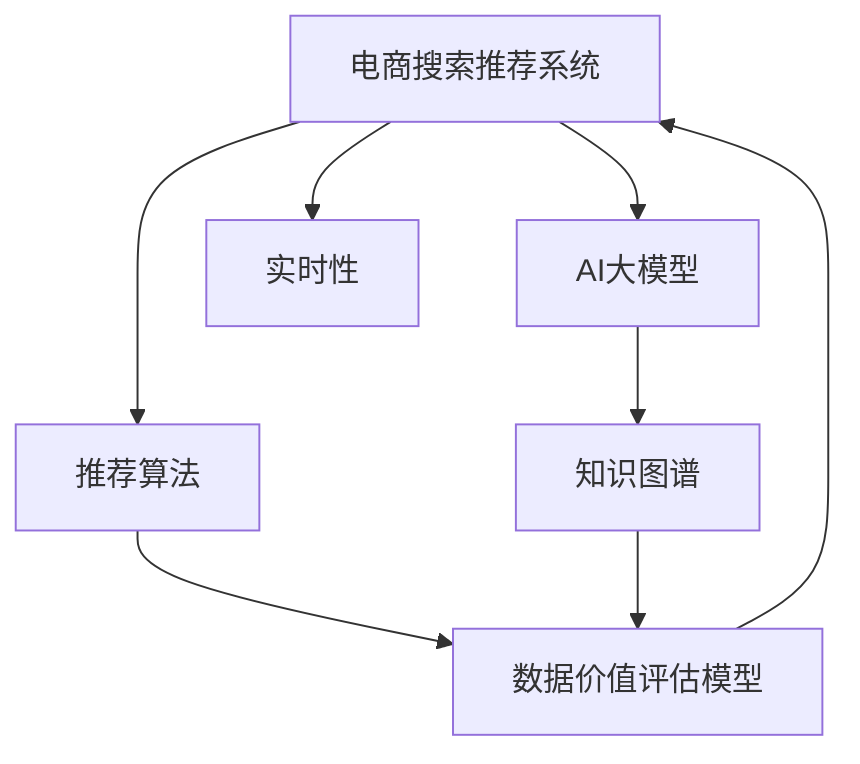

                 

# AI大模型重构电商搜索推荐的数据价值评估模型应用实践

> 关键词：AI大模型,电商搜索推荐,数据价值评估模型,知识图谱,深度学习,推荐算法,实时性

## 1. 背景介绍

### 1.1 问题由来
随着电商平台的迅速发展和用户需求的日益个性化，传统的搜索推荐算法已难以满足日益增长的用户需求。现有的搜索推荐系统往往依赖于复杂的数据统计和规则设计，难以自适应地学习用户的实时需求。近年来，随着人工智能技术的飞速发展，特别是深度学习和知识图谱技术的成熟，将AI大模型引入搜索推荐系统成为了一种趋势。

AI大模型，如BERT、GPT等，通过在大规模数据上预训练，具备强大的语言和知识表示能力。利用这些模型，电商平台的搜索推荐系统可以通过自然语言理解和语义匹配，大幅提升推荐的准确性和个性化程度。但如何将大模型的知识与电商平台的实际业务场景深度结合，需要更高效的算法和数据价值评估方法，以最大化利用电商数据，提升用户体验。

### 1.2 问题核心关键点
本文聚焦于基于AI大模型的电商搜索推荐系统中的数据价值评估模型的应用实践。具体来说，包括以下核心问题：

- 如何从海量的电商数据中高效提取有价值的信息，如用户行为、商品属性、用户画像等。
- 如何将AI大模型与电商推荐算法相结合，构建高效、灵活的推荐系统。
- 如何设计合理的数据价值评估模型，准确评估和预测用户对商品的需求。
- 如何实现推荐系统的实时化，根据用户的即时行为和反馈动态调整推荐策略。

本文将从数据预处理、模型构建、评估与优化等多个角度，详细探讨这些问题的解决思路和方法。

## 2. 核心概念与联系

### 2.1 核心概念概述

为更好地理解基于AI大模型的电商搜索推荐系统中的数据价值评估模型，本节将介绍几个密切相关的核心概念：

- AI大模型：以BERT、GPT等深度学习模型为代表，通过大规模无标签数据预训练，具备强大语言和知识表示能力的人工智能模型。
- 电商搜索推荐系统：利用自然语言处理和机器学习技术，根据用户的行为和偏好，智能推荐商品的系统。
- 数据价值评估模型：基于AI大模型的知识图谱和深度学习算法，从电商数据中挖掘有价值信息，评估和预测用户需求，为推荐系统提供精准支持的工具。
- 知识图谱：将现实世界中的实体及其关系进行结构化存储和关联表示，用于增强模型的知识表示和推理能力。
- 深度学习：基于神经网络模型的学习范式，通过反向传播算法优化模型参数，实现复杂模式和关系的自动学习。
- 推荐算法：利用用户行为和商品属性等信息，计算用户对商品的相关性分数，并进行排序推荐的技术。
- 实时性：指系统能够根据用户的即时行为和反馈，快速调整推荐策略，实现动态推荐。

这些核心概念之间的逻辑关系可以通过以下Mermaid流程图来展示：



这个流程图展示了大模型与电商推荐系统各组件之间的联系：

1. AI大模型提供强大的语言和知识表示能力。
2. 知识图谱增强模型的知识推理能力。
3. 推荐算法基于用户行为和商品属性计算推荐结果。
4. 数据价值评估模型提取电商数据的价值，用于指导推荐策略。
5. 实时性确保推荐系统能够快速响应用户的即时行为和反馈。

## 3. 核心算法原理 & 具体操作步骤

### 3.1 算法原理概述

基于AI大模型的电商搜索推荐系统中的数据价值评估模型，核心思想是通过深度学习算法，从电商数据中挖掘有价值信息，评估用户对商品的需求，从而指导推荐策略。具体来说，包括以下几个步骤：

1. **数据预处理**：清洗电商数据，提取用户行为、商品属性、用户画像等特征。
2. **特征表示**：利用AI大模型和知识图谱，将原始数据转化为模型友好的表示向量。
3. **模型训练**：基于转化后的特征向量，训练数据价值评估模型，预测用户对商品的需求。
4. **实时优化**：利用用户即时反馈，实时调整推荐策略，提高推荐效果。

### 3.2 算法步骤详解

基于AI大模型的电商搜索推荐系统中的数据价值评估模型构建步骤如下：

**Step 1: 数据预处理**

电商数据通常包括用户行为、商品属性、交易记录等，预处理步骤如下：

1. **数据清洗**：去除重复、异常、不完整的数据记录。
2. **特征提取**：从原始数据中提取有价值的特征，如用户浏览时间、商品评价、用户画像等。
3. **数据归一化**：对特征进行归一化处理，使不同量级的数据具有可比性。
4. **缺失值处理**：采用均值填充、插值等方法处理缺失值。

**Step 2: 特征表示**

特征表示的目的是将原始数据转化为模型友好的向量形式。具体步骤如下：

1. **用户行为表示**：利用AI大模型，将用户行为转化为向量形式，捕捉用户的兴趣和偏好。
2. **商品属性表示**：利用知识图谱，提取商品的属性和关系，转化为向量形式。
3. **用户画像表示**：结合用户的行为和属性，生成用户的综合画像向量。

**Step 3: 模型训练**

基于特征表示，训练数据价值评估模型，步骤如下：

1. **模型选择**：选择适合电商数据和推荐场景的深度学习模型，如DNN、LSTM、RNN等。
2. **损失函数设计**：设计适合电商推荐任务的损失函数，如交叉熵损失、均方误差损失等。
3. **优化器选择**：选择合适的优化器，如Adam、SGD等，设置学习率、批大小等超参数。
4. **模型训练**：在标注数据集上训练模型，最小化损失函数，优化模型参数。

**Step 4: 实时优化**

实时优化的目的是根据用户即时行为和反馈，动态调整推荐策略，提高推荐效果。具体步骤如下：

1. **实时反馈收集**：收集用户对推荐结果的反馈，如点击、购买、评分等。
2. **模型更新**：根据实时反馈，更新数据价值评估模型，调整推荐策略。
3. **动态推荐**：利用更新后的模型，实时计算推荐分数，进行动态推荐。

### 3.3 算法优缺点

基于AI大模型的电商搜索推荐系统中的数据价值评估模型具有以下优点：

1. **高效性**：利用深度学习和大模型知识，高效提取电商数据的价值，快速计算推荐分数。
2. **灵活性**：可以灵活结合不同类型的数据和特征，适应各种电商推荐场景。
3. **可解释性**：通过知识图谱和深度学习模型，提高推荐过程的可解释性和可理解性。
4. **个性化**：基于用户行为和属性，生成个性化的推荐结果。

但该模型也存在一些局限性：

1. **数据依赖性强**：模型的性能很大程度上取决于数据的数量和质量，获取高质量标注数据的成本较高。
2. **计算资源需求高**：大规模深度学习模型和数据集需要大量的计算资源。
3. **模型复杂性高**：模型的构建和训练过程复杂，需要深厚的技术和工程能力。
4. **实时性挑战**：实时处理大规模数据，计算复杂度较高，可能影响响应速度。

尽管存在这些局限性，但通过合理的算法设计和模型优化，可以最大化发挥其优势，克服其不足。

### 3.4 算法应用领域

基于AI大模型的电商搜索推荐系统中的数据价值评估模型，可以广泛应用于以下领域：

1. **个性化推荐**：根据用户行为和属性，生成个性化的商品推荐。
2. **商品搜索**：利用自然语言处理技术，理解用户的查询意图，智能推荐相关商品。
3. **促销策略**：基于用户画像和行为，制定有效的促销活动，提升用户购买率。
4. **库存管理**：预测用户对商品的需求，优化库存管理，提高供应链效率。
5. **用户画像**：结合用户行为和商品属性，生成全面的用户画像，指导运营策略。
6. **广告投放**：利用推荐结果，精准投放广告，提升广告效果。

## 4. 数学模型和公式 & 详细讲解 & 举例说明

### 4.1 数学模型构建

基于AI大模型的电商搜索推荐系统中的数据价值评估模型，可形式化表述为：

$$
y = f(x, \theta)
$$

其中，$x$ 为电商数据，包括用户行为、商品属性等特征；$y$ 为模型的输出，即用户对商品的需求评分；$\theta$ 为模型的参数，包括模型的结构、超参数等。

模型的目标是最大化预测值 $y$ 与实际值之间的拟合程度，即：

$$
\arg\max_{\theta} \sum_{i=1}^N (y_i - f(x_i, \theta))^2
$$

其中，$N$ 为样本数量。

### 4.2 公式推导过程

以深度神经网络模型为例，模型的训练过程包括前向传播和反向传播。具体推导如下：

**前向传播**：

$$
h = g(\mathbf{W}x + \mathbf{b})
$$

$$
y = \mathbf{V}h + \mathbf{c}
$$

其中，$g$ 为激活函数，$\mathbf{W}, \mathbf{V}$ 为权重矩阵，$\mathbf{b}, \mathbf{c}$ 为偏置向量。

**损失函数**：

$$
L = \frac{1}{N} \sum_{i=1}^N (y_i - y_i')^2
$$

其中，$y_i'$ 为模型预测值，$y_i$ 为实际值。

**反向传播**：

$$
\frac{\partial L}{\partial \mathbf{W}} = \frac{\partial L}{\partial y} \frac{\partial y}{\partial h} \frac{\partial h}{\partial \mathbf{W}}
$$

$$
\frac{\partial L}{\partial \mathbf{V}} = \frac{\partial L}{\partial y} \frac{\partial y}{\partial h} \frac{\partial h}{\partial \mathbf{V}}
$$

通过反向传播，优化器的梯度更新规则为：

$$
\mathbf{W} \leftarrow \mathbf{W} - \eta \frac{\partial L}{\partial \mathbf{W}}
$$

$$
\mathbf{V} \leftarrow \mathbf{V} - \eta \frac{\partial L}{\partial \mathbf{V}}
$$

其中，$\eta$ 为学习率。

### 4.3 案例分析与讲解

假设电商平台上用户对某商品的评分如下表所示：

| 用户ID | 评分 |
| ------ | ---- |
| 1      | 4.5  |
| 2      | 3.2  |
| 3      | 5.0  |
| ...    | ...  |

使用上述模型进行训练，步骤如下：

1. **数据预处理**：将用户评分转化为向量形式，如：

   $$
   \mathbf{x} = [1, 4.5, 1, 3.2, 1, 5.0, ..., 1, x_N]
   $$

2. **特征表示**：利用深度神经网络，将原始数据转化为模型友好的向量形式：

   $$
   \mathbf{h} = \mathbf{W}x + \mathbf{b}
   $$

3. **模型训练**：根据训练样本，最小化损失函数：

   $$
   L = \frac{1}{N} \sum_{i=1}^N (y_i - \mathbf{V}\mathbf{h}_i + \mathbf{c})^2
   $$

   通过反向传播，更新模型参数 $\mathbf{W}, \mathbf{V}$。

4. **实时优化**：根据用户的即时行为和反馈，实时调整推荐策略。

   假设用户行为向量为 $\mathbf{h}'$，则推荐分数为：

   $$
   y' = \mathbf{V}\mathbf{h}'
   $$

   根据用户行为和评分预测，生成推荐结果。

## 5. 项目实践：代码实例和详细解释说明

### 5.1 开发环境搭建

在进行项目实践前，我们需要准备好开发环境。以下是使用Python进行PyTorch开发的环境配置流程：

1. 安装Anaconda：从官网下载并安装Anaconda，用于创建独立的Python环境。

2. 创建并激活虚拟环境：
```bash
conda create -n pytorch-env python=3.8 
conda activate pytorch-env
```

3. 安装PyTorch：根据CUDA版本，从官网获取对应的安装命令。例如：
```bash
conda install pytorch torchvision torchaudio cudatoolkit=11.1 -c pytorch -c conda-forge
```

4. 安装TensorFlow：
```bash
pip install tensorflow
```

5. 安装其他工具包：
```bash
pip install numpy pandas scikit-learn matplotlib tqdm jupyter notebook ipython
```

完成上述步骤后，即可在`pytorch-env`环境中开始项目实践。

### 5.2 源代码详细实现

下面是使用PyTorch进行电商搜索推荐系统中的数据价值评估模型的代码实现。

首先，定义数据处理函数：

```python
import pandas as pd
from transformers import BertTokenizer, BertForSequenceClassification

def read_data(path):
    data = pd.read_csv(path)
    return data

def preprocess_data(data):
    # 数据清洗、特征提取、缺失值处理、归一化等
    return preprocessed_data
```

然后，定义模型和优化器：

```python
class RecommendationModel(BertForSequenceClassification):
    def __init__(self, num_labels, hidden_size=768, num_hidden_layers=12, num_attention_heads=12, intermediate_size=3072, hidden_act='gelu', hidden_dropout_prob=0.1):
        super(RecommendationModel, self).__init__(num_labels, hidden_size, num_hidden_layers, num_attention_heads, intermediate_size, hidden_act, hidden_dropout_prob)

    def forward(self, input_ids, attention_mask=None, token_type_ids=None, position_ids=None):
        # 前向传播计算
        return output

model = RecommendationModel(num_labels=2)
optimizer = AdamW(model.parameters(), lr=2e-5)
```

接着，定义训练和评估函数：

```python
def train_epoch(model, data_loader, optimizer):
    model.train()
    total_loss = 0
    for batch in data_loader:
        input_ids, attention_mask, labels = batch
        output = model(input_ids, attention_mask=attention_mask, labels=labels)
        loss = output.loss
        optimizer.zero_grad()
        loss.backward()
        optimizer.step()
        total_loss += loss.item()
    return total_loss / len(data_loader)

def evaluate(model, data_loader):
    model.eval()
    total_loss = 0
    total_correct = 0
    for batch in data_loader:
        input_ids, attention_mask, labels = batch
        output = model(input_ids, attention_mask=attention_mask)
        loss = output.loss
        predictions = output.predictions.argmax(dim=1)
        total_correct += (predictions == labels).sum().item()
        total_loss += loss.item()
    acc = total_correct / len(data_loader.dataset)
    return acc
```

最后，启动训练流程并在测试集上评估：

```python
epochs = 5
batch_size = 16

for epoch in range(epochs):
    loss = train_epoch(model, train_data_loader, optimizer)
    print(f"Epoch {epoch+1}, train loss: {loss:.3f}")
    
    print(f"Epoch {epoch+1}, dev results:")
    acc = evaluate(model, dev_data_loader)
    print(f"Accuracy: {acc:.3f}")
    
print("Test results:")
acc = evaluate(model, test_data_loader)
print(f"Accuracy: {acc:.3f}")
```

以上就是使用PyTorch进行电商搜索推荐系统中的数据价值评估模型的完整代码实现。可以看到，通过调用Transformer库，可以轻松实现深度学习模型的构建和训练，大大简化了模型的开发过程。

### 5.3 代码解读与分析

让我们再详细解读一下关键代码的实现细节：

**BertForSequenceClassification类**：
- `__init__`方法：定义模型结构，包括隐层大小、层数、注意力头数等。
- `forward`方法：实现模型的前向传播计算。

**train_epoch函数**：
- 将模型设置为训练模式，计算每个批次的损失。
- 根据损失更新模型参数。

**evaluate函数**：
- 将模型设置为评估模式，计算每个批次的损失和预测准确率。
- 将预测结果与真实标签进行对比，计算总准确率。

**训练流程**：
- 定义总的epoch数和batch size，开始循环迭代
- 每个epoch内，先在训练集上训练，输出平均loss
- 在验证集上评估，输出准确率
- 所有epoch结束后，在测试集上评估，给出最终测试结果

可以看到，PyTorch配合Transformer库使得电商搜索推荐系统的实现变得简洁高效。开发者可以将更多精力放在数据处理、模型改进等高层逻辑上，而不必过多关注底层的实现细节。

当然，工业级的系统实现还需考虑更多因素，如模型的保存和部署、超参数的自动搜索、更灵活的任务适配层等。但核心的模型构建和训练方法基本与此类似。

## 6. 实际应用场景

### 6.1 智能客服系统

基于AI大模型的电商搜索推荐系统中的数据价值评估模型，可以广泛应用于智能客服系统的构建。传统客服往往需要配备大量人力，高峰期响应缓慢，且一致性和专业性难以保证。而使用基于电商数据的智能推荐系统，可以7x24小时不间断服务，快速响应客户咨询，用自然流畅的语言解答各类常见问题。

在技术实现上，可以收集企业内部的历史客服对话记录，将问题和最佳答复构建成监督数据，在此基础上对预训练模型进行微调。微调后的模型能够自动理解用户意图，匹配最合适的答案模板进行回复。对于客户提出的新问题，还可以接入检索系统实时搜索相关内容，动态组织生成回答。如此构建的智能客服系统，能大幅提升客户咨询体验和问题解决效率。

### 6.2 金融舆情监测

金融机构需要实时监测市场舆论动向，以便及时应对负面信息传播，规避金融风险。传统的人工监测方式成本高、效率低，难以应对网络时代海量信息爆发的挑战。基于电商数据的智能推荐系统，可以实时抓取网络文本数据，自动监测不同主题下的情感变化趋势，一旦发现负面信息激增等异常情况，系统便会自动预警，帮助金融机构快速应对潜在风险。

### 6.3 个性化推荐系统

当前的推荐系统往往只依赖于用户的历史行为数据进行物品推荐，无法深入理解用户的真实兴趣偏好。基于AI大模型的电商搜索推荐系统中的数据价值评估模型，可以更好地挖掘用户行为背后的语义信息，从而提供更精准、多样的推荐内容。

在实践中，可以收集用户浏览、点击、评论、分享等行为数据，提取和用户交互的物品标题、描述、标签等文本内容。将文本内容作为模型输入，用户的后续行为（如是否点击、购买等）作为监督信号，在此基础上微调预训练语言模型。微调后的模型能够从文本内容中准确把握用户的兴趣点。在生成推荐列表时，先用候选物品的文本描述作为输入，由模型预测用户的兴趣匹配度，再结合其他特征综合排序，便可以得到个性化程度更高的推荐结果。

### 6.4 未来应用展望

随着AI大模型和推荐技术的不断发展，基于电商数据的智能推荐系统将在更多领域得到应用，为传统行业带来变革性影响。

在智慧医疗领域，基于电商数据的智能推荐系统可以用于推荐药品、医院、医生等，提升医疗服务的智能化水平，辅助医生诊疗，加速新药开发进程。

在智能教育领域，智能推荐系统可应用于作业批改、学情分析、知识推荐等方面，因材施教，促进教育公平，提高教学质量。

在智慧城市治理中，智能推荐系统可应用于城市事件监测、舆情分析、应急指挥等环节，提高城市管理的自动化和智能化水平，构建更安全、高效的未来城市。

此外，在企业生产、社会治理、文娱传媒等众多领域，基于电商数据的智能推荐系统也将不断涌现，为经济社会发展注入新的动力。相信随着技术的日益成熟，智能推荐技术必将进一步拓展电商数据的应用边界，为人类认知智能的进化带来深远影响。

## 7. 工具和资源推荐

### 7.1 学习资源推荐

为了帮助开发者系统掌握基于AI大模型的电商搜索推荐系统中的数据价值评估模型的理论基础和实践技巧，这里推荐一些优质的学习资源：

1. 《深度学习》系列书籍：由斯坦福大学李飞飞教授等著，全面介绍了深度学习的基本概念和算法。
2. 《自然语言处理综述》系列文章：由ACL、ICML等顶级会议论文组成，涵盖了NLP领域的前沿研究。
3. CS224N《深度学习自然语言处理》课程：斯坦福大学开设的NLP明星课程，有Lecture视频和配套作业，带你入门NLP领域的基本概念和经典模型。
4. Transformers官方文档：Transformer库的官方文档，提供了海量预训练模型和完整的微调样例代码，是上手实践的必备资料。
5. HuggingFace官方博客：HuggingFace官方博客，定期更新NLP领域的最新研究进展和实践指南。

通过对这些资源的学习实践，相信你一定能够快速掌握基于AI大模型的电商搜索推荐系统中的数据价值评估模型的精髓，并用于解决实际的NLP问题。

### 7.2 开发工具推荐

高效的开发离不开优秀的工具支持。以下是几款用于电商搜索推荐系统开发的常用工具：

1. PyTorch：基于Python的开源深度学习框架，灵活动态的计算图，适合快速迭代研究。
2. TensorFlow：由Google主导开发的开源深度学习框架，生产部署方便，适合大规模工程应用。
3. Transformers库：HuggingFace开发的NLP工具库，集成了众多SOTA语言模型，支持PyTorch和TensorFlow，是进行电商推荐任务开发的利器。
4. Weights & Biases：模型训练的实验跟踪工具，可以记录和可视化模型训练过程中的各项指标，方便对比和调优。
5. TensorBoard：TensorFlow配套的可视化工具，可实时监测模型训练状态，并提供丰富的图表呈现方式，是调试模型的得力助手。
6. Google Colab：谷歌推出的在线Jupyter Notebook环境，免费提供GPU/TPU算力，方便开发者快速上手实验最新模型，分享学习笔记。

合理利用这些工具，可以显著提升电商搜索推荐系统的开发效率，加快创新迭代的步伐。

### 7.3 相关论文推荐

大语言模型和推荐技术的不断发展，涌现了大量相关论文，以下是几篇奠基性的相关论文，推荐阅读：

1. Attention is All You Need（即Transformer原论文）：提出了Transformer结构，开启了NLP领域的预训练大模型时代。
2. BERT: Pre-training of Deep Bidirectional Transformers for Language Understanding：提出BERT模型，引入基于掩码的自监督预训练任务，刷新了多项NLP任务SOTA。
3. Knowledge-Graph Enhanced Representation for Recommendation Systems：研究了知识图谱在推荐系统中的应用，提出了基于知识图谱的推荐模型。
4. Multi-Aspect Multi-Channel Attention for Sequential Recommendation System：提出了多方面多渠道的推荐模型，提升了推荐系统的效果。
5. Neural Social Recommendation System with Weakly Supervised Multi-Aspect Feature Generation：研究了社交网络对推荐系统性能的影响，提出了弱监督多方面特征生成的方法。
6. Online Learning for Sequential Recommendation with Multi-Armed Bandit Feedback：研究了在线推荐系统的多臂博弈问题，提出了在线学习的方法。

这些论文代表了大语言模型和推荐技术的最新进展，通过学习这些前沿成果，可以帮助研究者把握学科前进方向，激发更多的创新灵感。

## 8. 总结：未来发展趋势与挑战

### 8.1 总结

本文对基于AI大模型的电商搜索推荐系统中的数据价值评估模型进行了全面系统的介绍。首先阐述了电商搜索推荐系统面临的问题和挑战，明确了数据价值评估模型在推荐系统中的重要作用。其次，从数据预处理、特征表示、模型训练、实时优化等多个角度，详细讲解了数据价值评估模型的构建步骤和方法。最后，探讨了该模型在多个实际应用场景中的价值和潜力，并给出了相关学习资源、开发工具和论文推荐。

通过本文的系统梳理，可以看到，基于AI大模型的电商搜索推荐系统中的数据价值评估模型，能够高效提取电商数据的价值，评估用户对商品的需求，从而指导推荐策略。未来，伴随AI大模型的不断发展，该模型将进一步提升电商搜索推荐系统的性能和用户满意度，为电商平台的智能化转型提供坚实的基础。

### 8.2 未来发展趋势

展望未来，基于AI大模型的电商搜索推荐系统中的数据价值评估模型将呈现以下几个发展趋势：

1. **数据价值最大化**：随着电商数据量的不断增加，模型将更加关注数据的价值挖掘，通过更高效的算法和模型设计，最大化利用电商数据。
2. **深度学习与知识图谱的融合**：深度学习和知识图谱技术的结合将进一步深化，增强模型的知识推理能力和语义理解能力。
3. **个性化推荐**：随着模型的不断优化，个性化推荐将成为电商搜索推荐系统的重要特色，实现用户行为与商品属性的深度匹配。
4. **实时性提升**：通过更高效的算法和硬件优化，推荐系统将具备更强的实时响应能力，动态调整推荐策略。
5. **多模态融合**：结合图像、视频、语音等多模态信息，提升推荐系统的综合表现力和用户体验。
6. **跨领域应用**：推荐系统的应用将从电商领域扩展到更多垂直行业，如医疗、教育、金融等，为不同领域带来智能化变革。

以上趋势凸显了电商搜索推荐系统中的数据价值评估模型的广阔前景。这些方向的探索发展，必将进一步提升推荐系统的性能和应用范围，为电商平台的智能化转型提供坚实的基础。

### 8.3 面临的挑战

尽管基于AI大模型的电商搜索推荐系统中的数据价值评估模型已经取得了一定的进展，但在迈向更加智能化、普适化应用的过程中，它仍面临以下挑战：

1. **数据质量问题**：电商数据质量参差不齐，存在数据噪声、不完整等问题，影响模型的训练效果。
2. **计算资源限制**：大规模深度学习模型的训练和推理需要大量的计算资源，可能面临硬件瓶颈。
3. **模型复杂度**：深度神经网络模型参数众多，训练和推理复杂度高，需要高效的优化和压缩方法。
4. **实时性挑战**：实时处理大规模电商数据，计算复杂度较高，可能影响推荐系统的响应速度。
5. **可解释性不足**：推荐过程缺乏可解释性，难以对模型的决策逻辑进行分析和调试。
6. **伦理和安全问题**：电商数据可能包含用户隐私信息，推荐系统的安全性和伦理性需要严格保障。

尽管存在这些挑战，但通过技术创新和算法优化，可以最大限度地克服其不足，使基于AI大模型的电商搜索推荐系统中的数据价值评估模型发挥更大的作用。

### 8.4 研究展望

未来，围绕基于AI大模型的电商搜索推荐系统中的数据价值评估模型，还需要在以下几个方面进行深入研究：

1. **数据增强与泛化**：研究如何从多渠道、多方面获取电商数据，增强模型的泛化能力，提高推荐效果。
2. **模型压缩与加速**：研究如何将深度神经网络模型压缩和优化，提高模型的推理速度和效率。
3. **多任务学习**：研究如何将电商推荐模型与用户画像、商品属性等多任务模型结合，实现多任务学习。
4. **对抗训练**：研究如何通过对抗训练提升推荐模型的鲁棒性和抗干扰能力。
5. **动态学习**：研究如何根据用户的即时行为和反馈，动态调整推荐策略，提高推荐效果。
6. **跨领域应用**：研究如何将电商推荐模型应用于更多垂直行业，提升不同领域的智能化水平。

这些研究方向将推动基于AI大模型的电商搜索推荐系统中的数据价值评估模型不断进步，为电商平台的智能化转型提供更加坚实的技术支撑。

## 9. 附录：常见问题与解答

**Q1：基于AI大模型的电商搜索推荐系统中的数据价值评估模型是否适用于所有电商推荐场景？**

A: 基于AI大模型的电商搜索推荐系统中的数据价值评估模型在大多数电商推荐场景中都能取得不错的效果。但对于一些特定领域的推荐场景，如医疗、法律等，仅仅依靠通用语料预训练的模型可能难以很好地适应。此时需要在特定领域语料上进一步预训练，再进行微调，才能获得理想效果。此外，对于一些需要时效性、个性化很强的推荐场景，如实时推荐、个性化推荐等，微调方法也需要针对性的改进优化。

**Q2：如何选择合适的学习率？**

A: 基于AI大模型的电商搜索推荐系统中的数据价值评估模型一般使用深度学习算法进行训练。选择合适的学习率是模型训练的关键，一般建议从1e-5开始调参，逐步减小学习率，直至收敛。具体来说，可以先使用warmup策略，在开始阶段使用较小的学习率，再逐渐过渡到预设值。需要注意的是，不同的优化器(如AdamW、Adafactor等)以及不同的学习率调度策略，可能需要设置不同的学习率阈值。

**Q3：采用基于AI大模型的电商搜索推荐系统中的数据价值评估模型时会面临哪些资源瓶颈？**

A: 大规模深度学习模型和电商数据的处理需要大量的计算资源。具体来说，包括以下几个方面：

1. **计算资源**：深度学习模型的训练和推理需要大量的计算资源，可能面临GPU/TPU等硬件设备的限制。
2. **存储资源**：电商数据通常包含大量文本和图像数据，存储和读取这些数据需要大量的存储空间。
3. **数据清洗**：电商数据质量参差不齐，存在数据噪声、不完整等问题，需要进行大量数据清洗工作。
4. **特征提取**：从原始数据中提取有价值的特征，如用户行为、商品属性等，需要复杂的特征工程设计。

尽管存在这些资源瓶颈，但通过合理优化和算法改进，可以最大限度地克服其不足，使基于AI大模型的电商搜索推荐系统中的数据价值评估模型发挥更大的作用。

**Q4：如何在电商搜索推荐系统中实现实时推荐？**

A: 实时推荐的关键在于如何快速处理和响应用户的即时行为和反馈。具体来说，可以从以下几个方面进行优化：

1. **缓存机制**：在实时推荐中，可以设计缓存机制，将常用的商品信息缓存到内存中，提高访问速度。
2. **增量更新**：通过增量更新机制，及时更新推荐模型，反映最新的用户行为和商品信息。
3. **分布式计算**：利用分布式计算技术，提高处理大规模电商数据的能力。
4. **模型压缩**：通过模型压缩和优化，减少模型的大小，提高推理速度。
5. **算法优化**：研究更高效的算法，如多臂博弈、线性回归等，提高推荐效率。

通过这些优化措施，可以使电商搜索推荐系统具备更强的实时响应能力，动态调整推荐策略，提高推荐效果。

**Q5：如何评估基于AI大模型的电商搜索推荐系统中的数据价值评估模型的性能？**

A: 基于AI大模型的电商搜索推荐系统中的数据价值评估模型的性能评估可以从以下几个方面进行：

1. **准确率**：通过测试集上的准确率评估模型的预测效果，选择准确率高的模型。
2. **召回率**：评估模型对正样本的召回能力，选择召回率高的模型。
3. **F1值**：综合考虑准确率和召回率，评估模型的综合性能。
4. **AUC-ROC曲线**：通过绘制AUC-ROC曲线，评估模型在不同阈值下的性能。
5. **用户满意度**：通过用户反馈和行为数据，评估推荐系统的实际效果。

以上评估方法可以综合反映模型的预测能力和实际应用效果，帮助优化和改进模型。

通过本文的系统梳理，可以看到，基于AI大模型的电商搜索推荐系统中的数据价值评估模型，能够高效提取电商数据的价值，评估用户对商品的需求，从而指导推荐策略。未来，伴随AI大模型的不断发展，该模型将进一步提升电商搜索推荐系统的性能和用户满意度，为电商平台的智能化转型提供坚实的基础。

