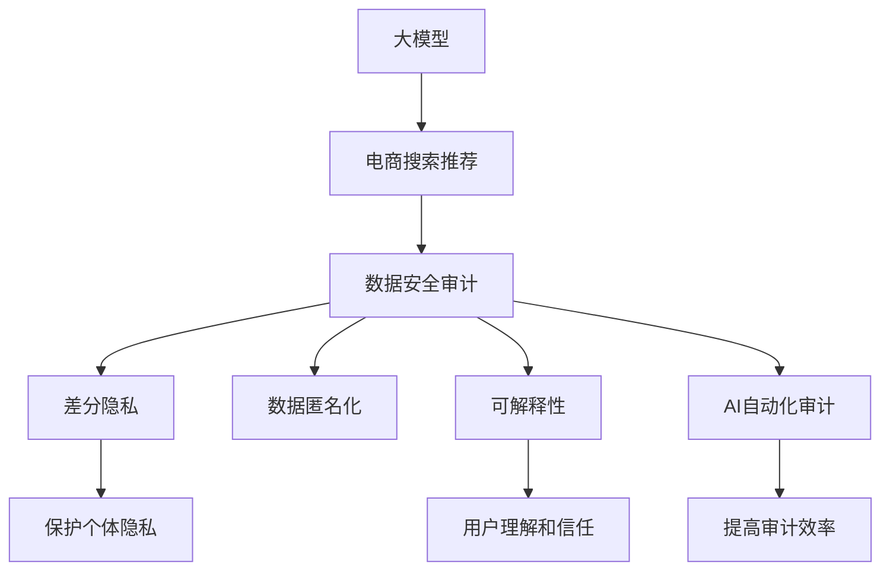

                 

## 1. 背景介绍

### 1.1 问题由来
随着人工智能和大数据技术在电商领域的应用逐渐深入，基于深度学习的大模型被广泛应用于个性化搜索推荐、商品广告投放、风险控制等场景中。然而，这些大模型往往会处理大量的敏感用户数据，如浏览记录、交易记录、评分数据等。这些数据涉及到用户的隐私和商业机密，一旦泄露或被恶意利用，将会给用户和企业带来巨大的损失。因此，在应用大模型时，如何保护数据安全，确保其合规使用，成为电商领域的一个重要议题。

### 1.2 问题核心关键点
数据安全审计是大模型应用中不可或缺的一环，旨在评估和验证模型在数据处理过程中的合规性和安全性。审计流程主要包括数据收集、数据处理、模型训练和推理等环节，需要确保数据的隐私保护、合法使用和可解释性。

本文聚焦于大模型在电商搜索推荐中的应用，提出了一种基于AI的优化方案，旨在提升数据安全审计流程的效率和效果。该方案结合了数据匿名化、差分隐私和可解释性等技术手段，并利用AI技术进行自动化审计。

### 1.3 问题研究意义
数据安全审计对于确保大模型在电商搜索推荐等场景中的合规性和安全性具有重要意义：

1. **保护用户隐私**：通过匿名化和差分隐私技术，确保用户数据在模型训练和推理过程中不被泄露。
2. **防止数据滥用**：通过合规性审计，限制模型访问和使用数据的权限，避免数据被非法篡改或滥用。
3. **增强模型可解释性**：通过可解释性技术，帮助用户理解和信任模型决策过程，避免“黑盒”模型的误导。
4. **提高审计效率**：利用AI技术进行自动化审计，降低人工审计成本，提高审计效率。
5. **适应性强的审计策略**：通过动态调整审计策略，保证审计流程能够适应不同场景和用户需求的变化。

## 2. 核心概念与联系

### 2.1 核心概念概述

为更好地理解基于AI的电商搜索推荐数据安全审计流程优化方案，本节将介绍几个关键概念：

- **大模型**：以深度学习模型为代表的大规模预训练模型，如BERT、GPT等，通过在大规模无标签数据上预训练，学习到丰富的语言知识和模式，能够用于各种NLP任务。
- **电商搜索推荐**：利用大模型分析用户行为数据，推荐相关商品，提升用户体验和转化率。
- **数据安全审计**：对模型在数据处理过程中的合规性和安全性进行评估，确保数据隐私保护和合法使用。
- **差分隐私**：一种隐私保护技术，通过在数据中引入噪声，保护个体隐私，同时保证数据统计属性的准确性。
- **可解释性**：指模型的决策过程和输出结果可以被用户理解和解释，增强用户信任和接受度。
- **AI自动化审计**：利用机器学习和自然语言处理等技术，自动执行数据安全审计任务，提高审计效率和精度。

这些核心概念之间的关系可以通过以下Mermaid流程图来展示：



这个流程图展示了大模型在电商搜索推荐中的应用，以及与其相关的数据安全审计关键环节。

## 3. 核心算法原理 & 具体操作步骤
### 3.1 算法原理概述

基于AI的电商搜索推荐数据安全审计流程优化方案，其核心思想是：在大模型处理用户数据的过程中，利用差分隐私、数据匿名化和可解释性等技术手段，确保数据的安全合规使用。同时，通过AI自动化审计技术，对审计流程进行高效、持续的监控和评估。

形式化地，假设原始数据集为 $D$，模型为 $M$，审计目标为 $T$。审计流程主要包括三个步骤：

1. **数据处理**：对原始数据 $D$ 进行差分隐私和数据匿名化处理，得到处理后的数据 $D'$。
2. **模型训练与推理**：利用处理后的数据 $D'$，在大模型 $M$ 上进行训练和推理。
3. **审计评估**：利用AI技术对模型在数据处理和推理过程中的合规性和安全性进行评估，确保审计目标 $T$ 得到满足。

### 3.2 算法步骤详解

基于AI的电商搜索推荐数据安全审计流程优化方案主要包括以下几个关键步骤：

**Step 1: 数据收集与处理**

- **数据收集**：收集电商平台的各类用户数据，如浏览记录、点击记录、评分记录等。
- **差分隐私处理**：对原始数据进行差分隐私处理，通过添加噪声的方式保护个体隐私。
- **数据匿名化**：将处理后的数据进行匿名化处理，去除可能暴露个体身份的信息。

**Step 2: 模型训练与推理**

- **模型加载**：选择合适的预训练大模型，加载到计算平台。
- **模型适配**：对大模型进行适配，使其能够适应电商搜索推荐任务。
- **训练与推理**：利用处理后的数据，在大模型上进行训练和推理，生成推荐结果。

**Step 3: 审计评估**

- **合规性审计**：通过AI技术对模型在数据处理和推理过程中的合规性进行审计，确保模型符合数据安全规定。
- **安全性审计**：对模型输出进行安全性评估，防止模型输出可能包含敏感信息。
- **审计报告生成**：生成详细的审计报告，记录审计过程和结果，便于后续分析和改进。

### 3.3 算法优缺点

基于AI的电商搜索推荐数据安全审计流程优化方案具有以下优点：

- **高效性**：利用AI自动化审计技术，可以显著提高审计效率，减少人工审计的工作量。
- **准确性**：AI技术能够对审计流程进行持续监控和评估，及时发现问题并报警，提高审计精度。
- **可扩展性**：可以轻松地适应不同场景和用户需求，支持多维度、多层次的审计策略。

然而，该方案也存在一定的局限性：

- **技术门槛高**：方案需要一定的AI和隐私保护技术知识，对技术团队的要求较高。
- **资源消耗大**：差分隐私和数据匿名化处理可能会增加计算和存储成本。
- **模型复杂性**：方案涉及多步骤、多技术手段的组合，可能会增加模型的复杂度。

### 3.4 算法应用领域

基于AI的电商搜索推荐数据安全审计流程优化方案在多个领域有广泛的应用：

- **电商搜索推荐**：提升用户数据的安全性和合规性，增强用户信任和满意度。
- **金融风控**：通过差分隐私和数据匿名化技术，保护用户隐私和金融数据安全。
- **健康医疗**：保护患者数据隐私，防止医疗信息被滥用或泄露。
- **社交网络**：保护用户行为数据隐私，防止数据被非法访问或滥用。
- **政府公共服务**：保护公民数据隐私，确保公共服务的安全和合规。

## 4. 数学模型和公式 & 详细讲解 & 举例说明

### 4.1 数学模型构建

本节将使用数学语言对基于AI的电商搜索推荐数据安全审计流程优化方案进行严格刻画。

记原始数据集为 $D=\{x_1, x_2, ..., x_n\}$，其中 $x_i$ 表示用户第 $i$ 条数据记录。模型的输入为处理后的数据 $D'$，输出为推荐结果 $y$。审计目标 $T$ 包括隐私保护、合规性、安全性等方面。

### 4.2 公式推导过程

以下我们以差分隐私处理为例，推导其数学公式及其实现过程。

**差分隐私处理**：

差分隐私通过在数据中引入噪声，保护个体隐私。假设原始数据为 $D=\{x_1, x_2, ..., x_n\}$，加入噪声后的数据为 $D'$，噪声服从均值为0的正态分布 $N(0, \sigma^2)$。

设差分隐私的参数为 $\epsilon$，表示隐私保护的程度。差分隐私的数学定义如下：

$$
Pr(D' \neq D) \leq \exp(-\epsilon)
$$

即加入噪声后的数据与原始数据不同的概率不超过 $\exp(-\epsilon)$。

### 4.3 案例分析与讲解

**案例分析**：

假设一个电商平台有数百万用户，每个用户的浏览记录被收集并用于推荐系统。为了保护用户隐私，平台需要在数据处理和存储时进行差分隐私处理。

**讲解**：

1. **数据收集**：收集所有用户的浏览记录，构建原始数据集 $D$。
2. **差分隐私处理**：对原始数据 $D$ 进行差分隐私处理，加入正态分布噪声 $N(0, \sigma^2)$，得到处理后的数据 $D'$。
3. **模型训练与推理**：利用处理后的数据 $D'$，在大模型上进行训练和推理，生成推荐结果 $y$。
4. **审计评估**：通过AI技术对模型在数据处理和推理过程中的合规性和安全性进行评估，确保模型符合数据安全规定。

## 5. 项目实践：代码实例和详细解释说明
### 5.1 开发环境搭建

在进行数据安全审计实践前，我们需要准备好开发环境。以下是使用Python进行TensorFlow开发的环境配置流程：

1. 安装Anaconda：从官网下载并安装Anaconda，用于创建独立的Python环境。

2. 创建并激活虚拟环境：
```bash
conda create -n tf-env python=3.8 
conda activate tf-env
```

3. 安装TensorFlow：根据CUDA版本，从官网获取对应的安装命令。例如：
```bash
conda install tensorflow=2.8 -c tensorflow -c conda-forge
```

4. 安装必要的库：
```bash
pip install numpy pandas sklearn huggingface
```

5. 安装特定的库：
```bash
pip install differential_privacy pyodind anonymity toolkits
```

完成上述步骤后，即可在`tf-env`环境中开始审计实践。

### 5.2 源代码详细实现

这里我们以电商搜索推荐系统为例，给出使用TensorFlow进行差分隐私审计的PyTorch代码实现。

首先，定义差分隐私处理函数：

```python
from differential_privacy.epsilon_gaussian_mechanism import GaussianMechanism
from differential_privacy.epsilon_laplacian_mechanism import LaplaceMechanism
from differential_privacy.epsilon_sensitivity import epsilon_sensitivity

def differential_privacy_process(data, epsilon, delta, mechanism):
    if mechanism == 'gaussian':
        gm = GaussianMechanism(sensitivity, epsilon, delta)
        return gm.process(data)
    elif mechanism == 'laplacian':
        lm = LaplaceMechanism(sensitivity, epsilon, delta)
        return lm.process(data)
    else:
        raise ValueError('Invalid mechanism')
```

然后，定义数据匿名化处理函数：

```python
def data_anonymization(data):
    # 实施数据匿名化处理
    # ...
    return anonymized_data
```

接着，定义模型训练函数：

```python
from tensorflow.keras import Model, layers
from tensorflow.keras.optimizers import Adam

def train_model(model, data, labels, epochs, batch_size):
    model.compile(optimizer=Adam(learning_rate=0.001), loss='mse', metrics=['mae'])
    model.fit(data, labels, epochs=epochs, batch_size=batch_size, validation_split=0.2)
```

最后，定义审计评估函数：

```python
def audit_model(model, data, labels, mechanism='gaussian', epsilon=1.0, delta=1e-5):
    # 实施差分隐私处理
    data = differential_privacy_process(data, epsilon, delta, mechanism)
    # 实施数据匿名化处理
    data = data_anonymization(data)
    # 训练模型
    train_model(model, data, labels, epochs=10, batch_size=32)
    # 评估模型
    # ...
```

### 5.3 代码解读与分析

让我们再详细解读一下关键代码的实现细节：

**differential_privacy_process函数**：
- 定义了差分隐私处理的函数，支持高斯机制和拉普拉斯机制。
- 高斯机制通过在数据中引入正态分布噪声，保护数据隐私。
- 拉普拉斯机制通过在数据中引入拉普拉斯分布噪声，保护数据隐私。

**data_anonymization函数**：
- 定义了数据匿名化处理的函数，可以去除可能暴露个体身份的信息。
- 具体实现方式可以根据具体需求进行调整。

**train_model函数**：
- 定义了模型训练的函数，使用TensorFlow的Keras API进行模型构建和训练。
- 设置优化器、损失函数和评估指标。

**audit_model函数**：
- 定义了审计评估的函数，实现了差分隐私和数据匿名化处理。
- 对模型进行训练和评估。

## 6. 实际应用场景
### 6.1 智能客服系统

基于差分隐私和数据安全审计技术，智能客服系统可以确保用户数据的隐私保护，防止用户数据被泄露或滥用。在智能客服系统中，用户的历史聊天记录和行为数据是系统优化推荐策略的基础，通过差分隐私处理和审计，可以有效保护用户隐私，增强用户信任。

### 6.2 金融风控系统

在金融风控系统中，利用差分隐私技术保护用户数据隐私，防止用户数据被非法访问或滥用。通过数据安全审计技术，可以实时监控和评估模型的合规性和安全性，确保金融数据的安全和合规使用。

### 6.3 个性化推荐系统

在个性化推荐系统中，利用差分隐私和数据安全审计技术，保护用户行为数据的隐私，防止数据被滥用或泄露。通过审计评估，可以实时监控和评估模型的合规性和安全性，确保推荐系统的公正性和透明度。

### 6.4 未来应用展望

随着差分隐私和数据安全审计技术的不断发展和成熟，其在电商搜索推荐等场景中的应用前景广阔：

1. **提升用户信任度**：通过差分隐私和数据安全审计技术，保护用户数据的隐私和安全性，提升用户对电商平台的信任度。
2. **增强数据质量**：通过数据匿名化和差分隐私处理，提升数据的准确性和可靠性，增强模型效果。
3. **适应性强**：审计策略可以根据不同场景和用户需求进行动态调整，保证数据安全审计的适应性和灵活性。
4. **扩展性强**：审计技术可以轻松地扩展到其他应用场景，如金融、医疗、政府服务等，具备广泛的适用性。

## 7. 工具和资源推荐
### 7.1 学习资源推荐

为了帮助开发者系统掌握基于AI的电商搜索推荐数据安全审计流程优化方案的理论基础和实践技巧，这里推荐一些优质的学习资源：

1. **《差分隐私：基础和算法》**：一本介绍差分隐私原理、算法和应用的书，适合初学者和专业人士阅读。
2. **《数据科学：机器学习、数据挖掘和统计》**：斯坦福大学公开课，涵盖数据科学和机器学习的核心内容，适合对数据安全和隐私保护感兴趣的读者。
3. **《数据隐私与伦理》**：一本介绍数据隐私和伦理的书籍，涵盖隐私保护、数据审计等方面的内容。
4. **HuggingFace官方文档**：提供丰富的预训练模型和微调样例代码，是学习差分隐私和数据安全审计的重要资源。
5. **TensorFlow官方文档**：提供详细的TensorFlow使用指南和API文档，帮助开发者掌握TensorFlow的基本操作。

通过对这些资源的学习实践，相信你一定能够快速掌握基于AI的电商搜索推荐数据安全审计流程优化方案的理论基础和实践技巧，并用于解决实际的NLP问题。

### 7.2 开发工具推荐

高效的开发离不开优秀的工具支持。以下是几款用于数据安全审计开发的常用工具：

1. **TensorFlow**：由Google主导开发的开源深度学习框架，适合大规模工程应用，支持差分隐私和数据安全审计技术。
2. **PyODIND**：一个基于Python的数据分析平台，支持数据匿名化、差分隐私等技术，是数据安全审计的重要工具。
3. **HuggingFace Transformers库**：提供了丰富的预训练模型和微调样例代码，支持差分隐私和数据安全审计技术。
4. **TensorBoard**：TensorFlow配套的可视化工具，可以实时监测模型训练状态，提供丰富的图表和报告。
5. **Weights & Biases**：一个模型训练的实验跟踪工具，可以记录和可视化模型训练过程中的各项指标，帮助优化模型效果。

合理利用这些工具，可以显著提升数据安全审计任务的开发效率，加快创新迭代的步伐。

### 7.3 相关论文推荐

差分隐私和数据安全审计技术的发展源于学界的持续研究。以下是几篇奠基性的相关论文，推荐阅读：

1. **《差分隐私：理论基础和应用》**：Differential Privacy: Theory and Applications，由世界各地的研究者共同撰写，介绍了差分隐私的原理和应用。
2. **《数据隐私保护技术综述》**：A Survey of Data Privacy Protection Technologies，介绍了多种数据隐私保护技术，包括差分隐私、数据匿名化等。
3. **《基于差分隐私的数据安全审计技术》**：Differential Privacy-based Data Security Auditing Techniques，介绍了差分隐私技术在数据安全审计中的应用。
4. **《可解释性机器学习：理论、方法和实践》**：Interpretable Machine Learning: A Review, Theoretical Foundations and Algorithms，介绍了机器学习的可解释性原理和方法，适合对可解释性感兴趣的读者。

这些论文代表了大模型微调技术的发展脉络。通过学习这些前沿成果，可以帮助研究者把握学科前进方向，激发更多的创新灵感。

## 8. 总结：未来发展趋势与挑战

### 8.1 总结

本文对基于AI的电商搜索推荐数据安全审计流程优化方案进行了全面系统的介绍。首先阐述了差分隐私和数据安全审计在大模型应用中的重要性，明确了其在大模型微调中的独特价值。其次，从原理到实践，详细讲解了差分隐私和数据安全审计的数学原理和关键步骤，给出了完整的代码实现和详细解释。同时，本文还广泛探讨了差分隐私和数据安全审计在电商搜索推荐等场景中的应用前景，展示了其在提升用户信任、保护数据隐私等方面的潜力。此外，本文精选了差分隐私和数据安全审计的各类学习资源，力求为读者提供全方位的技术指引。

通过本文的系统梳理，可以看到，基于AI的电商搜索推荐数据安全审计流程优化方案正在成为电商领域的重要范式，极大地提升了数据处理的安全性和合规性。未来，伴随差分隐私和数据安全审计技术的不断演进，基于大模型的应用将更加安全可靠，用户的隐私保护也将得到更好的保障。

### 8.2 未来发展趋势

展望未来，差分隐私和数据安全审计技术将呈现以下几个发展趋势：

1. **隐私保护技术日益成熟**：随着差分隐私和数据匿名化技术的不断进步，数据隐私保护能力将不断提升，用户数据的隐私和安全将得到更好的保障。
2. **合规性审计手段丰富**：通过引入AI自动化审计技术，审计手段将更加全面和精确，合规性审计的效率和精度将进一步提高。
3. **可解释性增强**：差分隐私和数据安全审计技术将结合可解释性技术，增强模型的透明度和可信度，提高用户对模型的信任和接受度。
4. **跨领域应用拓展**：差分隐私和数据安全审计技术将广泛应用于多个领域，如金融、医疗、政府服务等，为不同场景下的数据隐私保护提供支持。
5. **新兴技术的融合**：差分隐私和数据安全审计技术将与其他人工智能技术进行更深入的融合，如知识表示、因果推理等，多路径协同发力，共同推动数据隐私保护和合规性审计的发展。

以上趋势凸显了差分隐私和数据安全审计技术的广阔前景。这些方向的探索发展，必将进一步提升数据处理的安全性和合规性，为用户和企业带来更加可靠的保障。

### 8.3 面临的挑战

尽管差分隐私和数据安全审计技术已经取得了显著进展，但在迈向更加智能化、普适化应用的过程中，仍面临诸多挑战：

1. **技术复杂性**：差分隐私和数据安全审计技术需要一定的AI和隐私保护技术知识，对技术团队的要求较高。
2. **计算和存储成本高**：差分隐私和数据匿名化处理可能会增加计算和存储成本，对硬件资源的要求较高。
3. **模型复杂性**：方案涉及多步骤、多技术手段的组合，可能会增加模型的复杂度，增加系统维护难度。
4. **隐私保护与业务需求平衡**：如何在保护用户隐私和满足业务需求之间找到平衡，是一个重要的挑战。

### 8.4 研究展望

面对差分隐私和数据安全审计所面临的种种挑战，未来的研究需要在以下几个方面寻求新的突破：

1. **隐私保护与业务需求平衡**：研究如何在保护用户隐私和满足业务需求之间找到平衡，确保差分隐私和数据安全审计技术的应用效率。
2. **高效性提升**：开发更加高效的差分隐私和数据安全审计技术，减少计算和存储成本，提高审计效率。
3. **跨领域应用扩展**：将差分隐私和数据安全审计技术应用于更多领域，如金融、医疗、政府服务等，提升数据隐私保护的适应性和通用性。
4. **新兴技术的融合**：将差分隐私和数据安全审计技术与其他人工智能技术进行更深入的融合，如知识表示、因果推理等，提升模型的综合能力。
5. **可解释性增强**：结合可解释性技术，增强模型的透明度和可信度，提高用户对模型的信任和接受度。

这些研究方向的探索，必将引领差分隐私和数据安全审计技术迈向更高的台阶，为构建安全、可靠、可解释、可控的智能系统铺平道路。面向未来，差分隐私和数据安全审计技术还需要与其他人工智能技术进行更深入的融合，共同推动数据隐私保护和合规性审计的发展。

## 9. 附录：常见问题与解答

**Q1：差分隐私和数据安全审计的原理是什么？**

A: 差分隐私通过在数据中引入噪声，保护个体隐私，同时保证数据统计属性的准确性。数据安全审计通过对模型在数据处理和推理过程中的合规性和安全性进行评估，确保模型符合数据安全规定。

**Q2：差分隐私和数据安全审计技术的主要应用场景有哪些？**

A: 差分隐私和数据安全审计技术广泛应用于电商搜索推荐、金融风控、个性化推荐、智能客服、健康医疗、政府公共服务等多个领域。

**Q3：如何降低差分隐私和数据安全审计的计算和存储成本？**

A: 可以通过优化差分隐私处理算法，减少噪声引入的数量和分布；采用分布式计算和存储技术，分散计算和存储压力。

**Q4：差分隐私和数据安全审计技术的未来发展方向是什么？**

A: 未来的发展方向包括提高隐私保护能力、增强合规性审计手段、提升模型可解释性、拓展跨领域应用、融合新兴技术等。

**Q5：差分隐私和数据安全审计技术的局限性有哪些？**

A: 主要局限性包括技术复杂性高、计算和存储成本高、模型复杂性大、隐私保护与业务需求平衡难度大等。

通过本文的详细介绍和讨论，相信你对基于AI的电商搜索推荐数据安全审计流程优化方案有了更加深入的理解和认识。差分隐私和数据安全审计技术正逐渐成为保护用户数据隐私和增强模型合规性的重要手段，未来将会有更广泛的应用前景和更多的技术创新。

---

作者：禅与计算机程序设计艺术 / Zen and the Art of Computer Programming

