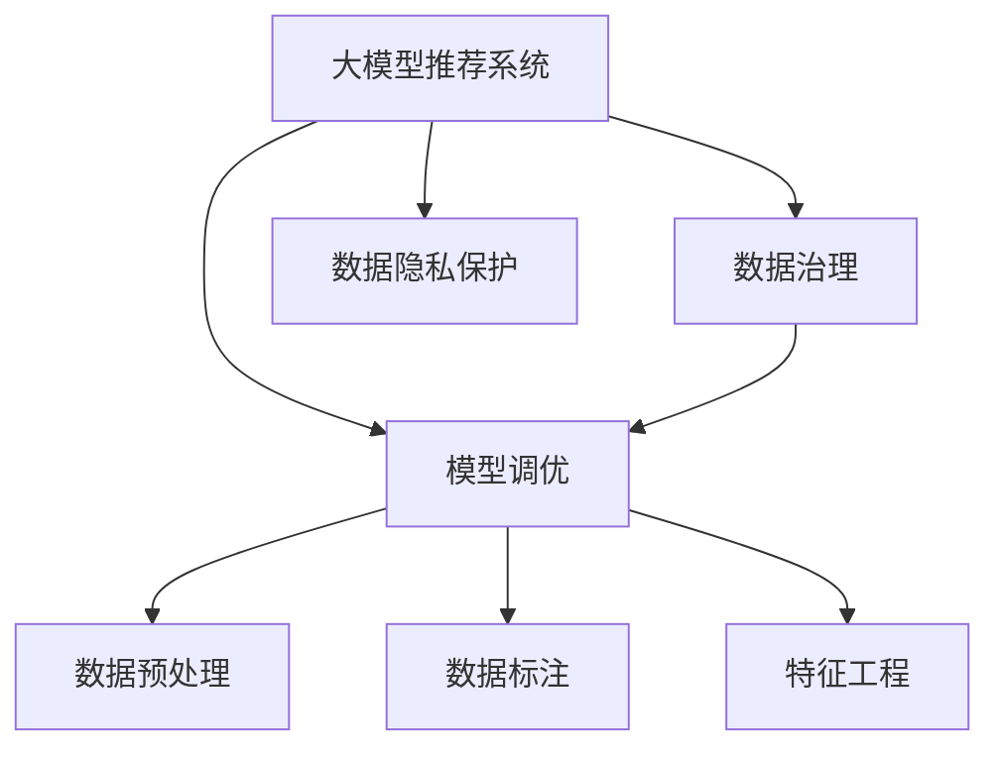

                 

# AI大模型重构电商搜索推荐的数据治理体系

## 1. 背景介绍

### 1.1 问题由来
电商搜索推荐系统是互联网电商领域的基础功能模块，承担着帮助用户快速找到目标商品的重要职责。传统推荐系统以基于协同过滤和内容为基础，虽然简单有效，但在个性化推荐、推荐算法多样性、实时性等方面存在诸多局限。基于大模型的推荐系统正逐渐成为新趋势，其具备强大的学习能力，可以通过学习用户行为、商品属性等海量数据，实现更精准的推荐。然而，大模型推荐系统在数据质量、数据治理、模型调优等方面面临诸多挑战，如数据标注成本高、数据不均衡、数据隐私保护等，需要综合施策来构建高效、安全、可持续的推荐体系。

### 1.2 问题核心关键点
大模型推荐系统的核心在于构建高质量的数据治理体系，通过对数据进行预处理、标注、筛选、融合等操作，确保数据的质量、效率和安全性。同时，需结合具体业务场景，选择合适的模型架构和调参方法，实现高性能的推荐模型。数据治理和模型调优是大模型推荐系统成功的关键，也是本文关注的重点。

### 1.3 问题研究意义
构建数据治理体系和大模型推荐系统，对电商企业具有重要意义：

1. **提升推荐效果**：高质量的数据和优化的模型架构，有助于提高推荐算法的准确性和多样性，提升用户体验。
2. **降低成本**：大模型的迁移学习特性，可以利用已有的预训练知识，减少数据标注和模型训练的投入。
3. **保障数据安全**：规范化的数据治理体系，能够有效保护用户隐私，避免数据泄露和滥用。
4. **支持实时化推荐**：构建高性能、低延迟的推荐模型，支持快速响应用户需求。
5. **支持业务迭代**：模型和数据治理的迭代优化，能够快速适应业务变化，提升推荐系统的竞争力。

## 2. 核心概念与联系

### 2.1 核心概念概述

为更好地理解大模型推荐系统及其数据治理体系，本节将介绍几个密切相关的核心概念：

- **大模型推荐系统(Deep Learning Based Recommendation System)**：以深度学习模型为基础的推荐系统，具备强大的学习能力，能够从海量数据中学习用户偏好和商品特征，实现个性化推荐。
- **数据治理(Data Governance)**：通过建立数据质量管理、数据安全保护、数据共享机制等，确保数据的可用性和完整性。
- **模型调优(Model Fine-Tuning)**：在预训练模型的基础上，通过有监督学习优化模型参数，提升模型在特定任务上的表现。
- **数据预处理(Preprocessing)**：包括数据清洗、数据增强、特征工程等，提升数据质量和模型泛化能力。
- **数据标注(Data Labeling)**：对数据进行标注，为模型训练提供监督信号。
- **特征工程(Feature Engineering)**：通过特征提取、特征选择等操作，构建对模型有益的特征集合。
- **数据隐私保护(Data Privacy Protection)**：确保数据在采集、存储、传输、使用等各个环节中，符合隐私法规和用户隐私需求。

这些核心概念之间的逻辑关系可以通过以下Mermaid流程图来展示：



这个流程图展示了大模型推荐系统的核心概念及其之间的关系：

1. 大模型推荐系统通过数据治理获取高质量数据，并通过模型调优提升推荐性能。
2. 数据治理包括数据预处理、数据标注、数据隐私保护等多个环节。
3. 模型调优借助预训练模型和微调技术，优化模型参数，实现高效推荐。
4. 数据隐私保护贯穿数据治理的全流程，确保数据使用的合法合规。

这些概念共同构成了大模型推荐系统的数据治理和模型调优框架，为大模型推荐系统的构建和优化提供了系统性支持。

## 3. 核心算法原理 & 具体操作步骤
### 3.1 算法原理概述

基于大模型的推荐系统，通过预训练和微调技术，提升模型对用户行为和商品特征的理解能力，从而实现精准推荐。其核心算法流程如下：

1. **预训练阶段**：在大规模无标签数据上训练预训练模型，学习通用的语言和商品表示。
2. **微调阶段**：在标注数据上，通过有监督学习优化模型参数，提升模型对特定任务的理解能力。
3. **推理阶段**：将新用户和商品特征输入模型，通过推理得到推荐结果。

### 3.2 算法步骤详解

基于大模型的推荐系统算法步骤如下：

**Step 1: 数据收集与预处理**

1. **数据收集**：收集用户行为数据、商品属性数据、用户画像数据等，形成推荐系统所需的多源异构数据集。
2. **数据清洗**：去除噪声、缺失值、异常值等，确保数据质量。
3. **数据增强**：通过数据扩充、变换等操作，提升数据多样性和泛化能力。
4. **特征工程**：构建和选择对推荐效果有益的特征集合，提升模型性能。

**Step 2: 数据标注**

1. **标注任务定义**：定义推荐系统的目标任务，如点击率预测、转化率预测等。
2. **标注数据准备**：根据任务需求，准备标注数据，包括样本、标签等。
3. **标注方法选择**：选择合适的标注方法，如半监督学习、主动学习等。

**Step 3: 模型构建与微调**

1. **模型选择**：选择合适的预训练模型，如BERT、DIN、CMPL等。
2. **任务适配层设计**：根据推荐任务需求，设计适当的输出层和损失函数。
3. **微调参数设置**：设置学习率、批大小、迭代轮数等微调参数。
4. **微调过程执行**：在标注数据上执行微调过程，更新模型参数。

**Step 4: 推荐系统部署**

1. **模型保存**：将微调后的模型保存到本地或云端。
2. **模型部署**：将模型部署到生产环境，实现实时推荐服务。
3. **系统监控**：实时监控推荐系统性能，根据需求调整模型参数和数据治理策略。

### 3.3 算法优缺点

基于大模型的推荐系统具备以下优点：

1. **高效性**：预训练模型的迁移学习能力，可以减少数据标注和模型训练的投入，提升推荐效果。
2. **精准性**：大模型具备强大的学习能力，能够准确捕捉用户偏好和商品特征，实现更精准的推荐。
3. **多样性**：通过调整模型架构和超参数，支持多种推荐算法，提升推荐策略的多样性。
4. **实时性**：采用高性能计算模型和分布式系统架构，支持实时推荐服务，提升用户体验。

同时，该方法也存在一些局限性：

1. **数据依赖**：推荐效果依赖于数据质量，数据标注和预处理成本较高。
2. **模型复杂度**：大模型结构复杂，调优和部署较为复杂。
3. **隐私风险**：数据隐私保护存在挑战，需严格遵守相关法规。
4. **泛化能力**：在特定领域数据上的微调效果可能不如通用大模型。

尽管存在这些局限性，但大模型推荐系统以其高效、精准、实时等优势，已成为推荐系统的主流技术，并有望在更多领域推广应用。

### 3.4 算法应用领域

大模型推荐系统在电商领域已有广泛应用，覆盖了推荐算法、广告投放、个性化推荐等多个方面，以下是几个典型的应用场景：

1. **商品推荐**：基于用户浏览历史、购买记录等行为数据，为用户推荐可能感兴趣的商品。
2. **内容推荐**：推荐用户可能感兴趣的内容，如文章、视频、音乐等。
3. **广告推荐**：基于用户画像和行为数据，推荐匹配的广告内容，提升广告效果。
4. **精准营销**：通过分析用户行为数据，实现精准营销和客户细分，提升营销效果。
5. **实时推荐**：支持实时推荐服务，快速响应用户需求，提升用户体验。

随着大模型推荐系统的持续演进，其在更多领域的应用前景可期，如智能家居、智慧城市、智能金融等，为各行业的数字化转型提供新的动力。

## 4. 数学模型和公式 & 详细讲解 & 举例说明
### 4.1 数学模型构建

基于大模型的推荐系统数学模型如下：

假设用户行为数据为 $\{x_i\}_{i=1}^N$，商品特征为 $\{y_j\}_{j=1}^M$，推荐系统目标为预测用户对商品的兴趣度 $u_{ij}$。

推荐模型可表示为：

$$
u_{ij} = M_{\theta}(x_i, y_j)
$$

其中 $M_{\theta}$ 为推荐模型，$\theta$ 为模型参数。

推荐模型的损失函数为：

$$
\mathcal{L} = \frac{1}{N}\sum_{i=1}^N \sum_{j=1}^M \ell(u_{ij}, \hat{u}_{ij})
$$

其中 $\ell$ 为损失函数，$\hat{u}_{ij}$ 为模型预测值。

### 4.2 公式推导过程

对于点击率预测任务，常用的损失函数为二分类交叉熵：

$$
\ell(u_{ij}, \hat{u}_{ij}) = -[y_{ij}\log \hat{u}_{ij} + (1-y_{ij})\log(1-\hat{u}_{ij})]
$$

其中 $y_{ij}$ 为标注数据标签。

将上式代入损失函数中，得：

$$
\mathcal{L} = -\frac{1}{N}\sum_{i=1}^N \sum_{j=1}^M \left[y_{ij}\log \hat{u}_{ij} + (1-y_{ij})\log(1-\hat{u}_{ij})\right]
$$

在训练过程中，采用反向传播算法更新模型参数，最小化损失函数。

### 4.3 案例分析与讲解

以下以点击率预测任务为例，给出大模型推荐系统在电商搜索推荐中的应用。

**数据准备**：

1. **用户行为数据**：收集用户浏览历史、购买记录、评分等数据。
2. **商品特征数据**：收集商品属性、类别、价格等数据。
3. **用户画像数据**：收集用户基本信息、行为特征等数据。

**模型构建**：

1. **选择预训练模型**：选择BERT等预训练模型作为推荐模型的初始参数。
2. **设计任务适配层**：设计适当的输出层和损失函数，如线性分类器+二分类交叉熵损失。

**微调过程**：

1. **设置超参数**：设置学习率、批大小、迭代轮数等超参数。
2. **执行微调**：在标注数据上执行微调过程，更新模型参数。

**评估与优化**：

1. **评估指标**：采用准确率、召回率、F1-score等指标评估模型性能。
2. **模型优化**：根据评估结果调整超参数和数据治理策略，优化模型性能。

**部署与监控**：

1. **模型部署**：将微调后的模型部署到生产环境。
2. **系统监控**：实时监控推荐系统性能，根据需求调整模型参数和数据治理策略。

## 5. 项目实践：代码实例和详细解释说明
### 5.1 开发环境搭建

在进行大模型推荐系统开发前，我们需要准备好开发环境。以下是使用Python进行PyTorch开发的环境配置流程：

1. 安装Anaconda：从官网下载并安装Anaconda，用于创建独立的Python环境。

2. 创建并激活虚拟环境：
```bash
conda create -n pytorch-env python=3.8 
conda activate pytorch-env
```

3. 安装PyTorch：根据CUDA版本，从官网获取对应的安装命令。例如：
```bash
conda install pytorch torchvision torchaudio cudatoolkit=11.1 -c pytorch -c conda-forge
```

4. 安装TensorFlow：
```bash
pip install tensorflow==2.6
```

5. 安装各类工具包：
```bash
pip install numpy pandas scikit-learn matplotlib tqdm jupyter notebook ipython
```

完成上述步骤后，即可在`pytorch-env`环境中开始推荐系统开发。

### 5.2 源代码详细实现

下面我们以点击率预测任务为例，给出使用PyTorch进行大模型推荐系统开发的PyTorch代码实现。

首先，定义数据处理函数：

```python
from torch.utils.data import Dataset
import torch

class RecommendationDataset(Dataset):
    def __init__(self, user_features, item_features, user_interests, user_behaviors, item_ids, user_ids, labels):
        self.user_features = user_features
        self.item_features = item_features
        self.user_interests = user_interests
        self.user_behaviors = user_behaviors
        self.item_ids = item_ids
        self.user_ids = user_ids
        self.labels = labels
        
    def __len__(self):
        return len(self.labels)
    
    def __getitem__(self, index):
        user_feature = self.user_features[index]
        item_feature = self.item_features[index]
        user_interest = self.user_interests[index]
        user_behavior = self.user_behaviors[index]
        item_id = self.item_ids[index]
        user_id = self.user_ids[index]
        label = self.labels[index]
        
        # 构建输入特征向量
        user_input = torch.cat([user_feature, user_interest, user_behavior], dim=1)
        item_input = torch.cat([item_feature, user_behavior], dim=1)
        
        # 构建标签向量
        label = torch.tensor(label, dtype=torch.float)
        
        return {'user_input': user_input, 
                'item_input': item_input,
                'user_id': user_id,
                'item_id': item_id,
                'label': label}
```

然后，定义模型和优化器：

```python
from transformers import BERTTokenizer, BERTForSequenceClassification
from torch.optim import AdamW

# 构建tokenizer和预训练模型
tokenizer = BERTTokenizer.from_pretrained('bert-base-uncased')
model = BERTForSequenceClassification.from_pretrained('bert-base-uncased', num_labels=2)

# 构建优化器
optimizer = AdamW(model.parameters(), lr=2e-5)
```

接着，定义训练和评估函数：

```python
from tqdm import tqdm
import numpy as np

device = torch.device('cuda') if torch.cuda.is_available() else torch.device('cpu')
model.to(device)

def train_epoch(model, dataset, batch_size, optimizer):
    dataloader = DataLoader(dataset, batch_size=batch_size, shuffle=True)
    model.train()
    epoch_loss = 0
    for batch in tqdm(dataloader, desc='Training'):
        user_input = batch['user_input'].to(device)
        item_input = batch['item_input'].to(device)
        user_id = batch['user_id'].to(device)
        item_id = batch['item_id'].to(device)
        label = batch['label'].to(device)
        model.zero_grad()
        outputs = model(user_input, item_input=item_input, labels=label)
        loss = outputs.loss
        epoch_loss += loss.item()
        loss.backward()
        optimizer.step()
    return epoch_loss / len(dataloader)

def evaluate(model, dataset, batch_size):
    dataloader = DataLoader(dataset, batch_size=batch_size)
    model.eval()
    preds, labels = [], []
    with torch.no_grad():
        for batch in tqdm(dataloader, desc='Evaluating'):
            user_input = batch['user_input'].to(device)
            item_input = batch['item_input'].to(device)
            user_id = batch['user_id'].to(device)
            item_id = batch['item_id'].to(device)
            batch_labels = batch['label'].to(device)
            outputs = model(user_input, item_input=item_input, labels=batch_labels)
            batch_preds = outputs.logits.argmax(dim=1).to('cpu').tolist()
            batch_labels = batch_labels.to('cpu').tolist()
            for pred, label in zip(batch_preds, batch_labels):
                preds.append(pred)
                labels.append(label)
                
    print(np.mean(np.array(preds) == np.array(labels)))
```

最后，启动训练流程并在测试集上评估：

```python
epochs = 5
batch_size = 16

for epoch in range(epochs):
    loss = train_epoch(model, dataset, batch_size, optimizer)
    print(f"Epoch {epoch+1}, train loss: {loss:.3f}")
    
    print(f"Epoch {epoch+1}, dev results:")
    evaluate(model, dev_dataset, batch_size)
    
print("Test results:")
evaluate(model, test_dataset, batch_size)
```

以上就是使用PyTorch进行大模型推荐系统开发的完整代码实现。可以看到，借助Transformers库和PyTorch框架，大模型推荐系统的开发变得高效便捷。

### 5.3 代码解读与分析

让我们再详细解读一下关键代码的实现细节：

**RecommendationDataset类**：
- `__init__`方法：初始化数据集所需的各类特征和标签。
- `__len__`方法：返回数据集的样本数量。
- `__getitem__`方法：对单个样本进行处理，将用户行为、商品特征、用户画像等输入特征编码成模型所需的格式，并返回用户ID、商品ID和标签。

**模型和优化器**：
- `BERTForSequenceClassification`：选择BERT模型作为推荐模型的初始化参数。
- `AdamW`：选择AdamW优化器进行模型参数更新。

**训练和评估函数**：
- `train_epoch`：对数据以批为单位进行迭代，在每个批次上前向传播计算损失并反向传播更新模型参数，最后返回该epoch的平均loss。
- `evaluate`：与训练类似，不同点在于不更新模型参数，并在每个batch结束后将预测和标签结果存储下来，最后使用准确率评估整个评估集的预测结果。

**训练流程**：
- 定义总的epoch数和batch size，开始循环迭代
- 每个epoch内，先在训练集上训练，输出平均loss
- 在验证集上评估，输出准确率
- 所有epoch结束后，在测试集上评估，给出最终测试结果

可以看到，PyTorch配合Transformers库使得大模型推荐系统的开发变得简洁高效。开发者可以将更多精力放在数据处理、模型改进等高层逻辑上，而不必过多关注底层的实现细节。

当然，工业级的系统实现还需考虑更多因素，如模型的保存和部署、超参数的自动搜索、更灵活的任务适配层等。但核心的推荐范式基本与此类似。

## 6. 实际应用场景
### 6.1 智能客服系统

基于大模型推荐系统的智能客服系统，可以实时推荐客户可能感兴趣的商品，提升客户咨询体验和问题解决效率。具体实现方式如下：

1. **数据收集**：收集历史客服对话记录，将问题-答案对作为微调数据。
2. **模型构建**：选择BERT等预训练模型作为初始化参数，设计适当的输出层和损失函数。
3. **微调过程**：在标注数据上执行微调过程，更新模型参数。
4. **实时推荐**：将客户输入的问题实时输入模型，生成推荐答案，发送给客服系统。

通过智能客服系统，客户可以快速获取满意的答案，大大提升服务效率和满意度。

### 6.2 金融舆情监测

基于大模型推荐系统的金融舆情监测系统，可以通过实时抓取的网络文本数据，自动监测金融市场的舆情变化，预测市场趋势。具体实现方式如下：

1. **数据收集**：收集金融市场的新闻、报道、评论等文本数据。
2. **模型构建**：选择BERT等预训练模型作为初始化参数，设计适当的输出层和损失函数。
3. **微调过程**：在标注数据上执行微调过程，更新模型参数。
4. **舆情监测**：实时抓取金融市场文本数据，输入微调后的模型进行情感分析，预测市场趋势。

通过金融舆情监测系统，金融机构可以及时应对市场变化，规避风险，提高投资决策的准确性。

### 6.3 个性化推荐系统

基于大模型推荐系统的个性化推荐系统，可以通过用户行为数据和商品特征，实现精准推荐，提升用户体验。具体实现方式如下：

1. **数据收集**：收集用户浏览历史、购买记录等行为数据，收集商品属性、类别、价格等特征数据。
2. **模型构建**：选择BERT等预训练模型作为初始化参数，设计适当的输出层和损失函数。
3. **微调过程**：在标注数据上执行微调过程，更新模型参数。
4. **推荐生成**：将用户行为和商品特征输入微调后的模型，生成推荐结果。

通过个性化推荐系统，用户可以及时获取感兴趣的商品，提升购物体验。

### 6.4 未来应用展望

随着大模型推荐系统的不断发展，其应用场景将进一步拓展，为更多领域带来变革性影响。

在智慧医疗领域，基于大模型推荐系统的诊疗推荐系统，可以推荐合适的诊疗方案，提高医疗效率和质量。

在智能教育领域，基于大模型推荐系统的个性化学习系统，可以推荐适合的教材和课程，提升学习效果。

在智慧城市治理中，基于大模型推荐系统的智能决策系统，可以推荐最优的城市管理方案，提高城市治理水平。

此外，在企业生产、社会治理、文娱传媒等众多领域，基于大模型推荐系统的应用也将不断涌现，为各行业的数字化转型提供新的动力。相信随着技术的日益成熟，大模型推荐系统必将在更广阔的应用领域大放异彩，深刻影响人类的生产生活方式。

## 7. 工具和资源推荐
### 7.1 学习资源推荐

为了帮助开发者系统掌握大模型推荐系统的理论基础和实践技巧，这里推荐一些优质的学习资源：

1. 《深度学习基础》系列博文：全面介绍深度学习的基本概念和实现方法，适合初学者入门。
2. 《PyTorch深度学习教程》书籍：介绍PyTorch深度学习框架的详细使用和案例实战。
3. 《推荐系统实战》书籍：详细讲解推荐系统的实现原理和算法，涵盖从模型构建到系统部署的完整流程。
4. Kaggle推荐系统竞赛：参与Kaggle推荐系统竞赛，了解推荐系统实际应用中的挑战和解决方案。
5. 《Transformers库官方文档》：提供Transformers库的详细使用方法和示例代码，适合动手实践。

通过对这些资源的学习实践，相信你一定能够快速掌握大模型推荐系统的精髓，并用于解决实际的推荐问题。
### 7.2 开发工具推荐

高效的开发离不开优秀的工具支持。以下是几款用于大模型推荐系统开发的常用工具：

1. PyTorch：基于Python的开源深度学习框架，灵活动态的计算图，适合快速迭代研究。大部分预训练语言模型都有PyTorch版本的实现。
2. TensorFlow：由Google主导开发的开源深度学习框架，生产部署方便，适合大规模工程应用。同样有丰富的预训练语言模型资源。
3. Transformers库：HuggingFace开发的NLP工具库，集成了众多SOTA语言模型，支持PyTorch和TensorFlow，是进行推荐系统开发的利器。
4. Weights & Biases：模型训练的实验跟踪工具，可以记录和可视化模型训练过程中的各项指标，方便对比和调优。与主流深度学习框架无缝集成。
5. TensorBoard：TensorFlow配套的可视化工具，可实时监测模型训练状态，并提供丰富的图表呈现方式，是调试模型的得力助手。
6. Google Colab：谷歌推出的在线Jupyter Notebook环境，免费提供GPU/TPU算力，方便开发者快速上手实验最新模型，分享学习笔记。

合理利用这些工具，可以显著提升大模型推荐系统的开发效率，加快创新迭代的步伐。

### 7.3 相关论文推荐

大模型推荐系统的发展得益于学界的持续研究。以下是几篇奠基性的相关论文，推荐阅读：

1. Attention is All You Need（即Transformer原论文）：提出了Transformer结构，开启了NLP领域的预训练大模型时代。
2. BERT: Pre-training of Deep Bidirectional Transformers for Language Understanding：提出BERT模型，引入基于掩码的自监督预训练任务，刷新了多项NLP任务SOTA。
3. A Survey on Recommendation Systems：总结推荐系统的发展历程和经典算法，适合快速了解推荐系统的整体架构。
4. Deep Learning Recommendation Systems：综述深度学习在推荐系统中的应用，涵盖多种深度学习模型和优化算法。
5. Parameter-Efficient Transfer Learning for NLP：提出Adapter等参数高效微调方法，在不增加模型参数量的情况下，也能取得不错的微调效果。

这些论文代表了大模型推荐系统的发展脉络。通过学习这些前沿成果，可以帮助研究者把握学科前进方向，激发更多的创新灵感。

## 8. 总结：未来发展趋势与挑战
### 8.1 总结

本文对基于大模型的电商搜索推荐系统及其数据治理体系进行了全面系统的介绍。首先阐述了基于大模型的推荐系统在电商领域的应用背景和意义，明确了推荐系统的核心算法流程。其次，从原理到实践，详细讲解了推荐系统的数学模型和关键步骤，给出了推荐系统开发的完整代码实例。同时，本文还广泛探讨了推荐系统在智能客服、金融舆情、个性化推荐等多个领域的应用前景，展示了推荐系统的广阔应用空间。此外，本文精选了推荐系统的各类学习资源，力求为读者提供全方位的技术指引。

通过本文的系统梳理，可以看到，基于大模型的推荐系统在电商企业中已初现成效，其高效、精准、实时等优势有望在更多领域推广应用。未来，伴随大模型推荐系统的持续演进，其应用领域将进一步拓展，为各行各业的数字化转型提供新的动力。

### 8.2 未来发展趋势

展望未来，大模型推荐系统将呈现以下几个发展趋势：

1. **推荐模型多样化**：结合不同的推荐算法和模型架构，支持个性化推荐、协同过滤、混合推荐等多种策略。
2. **推荐数据精细化**：通过数据增强、数据融合等技术，提升推荐数据的多样性和质量。
3. **推荐效果实时化**：采用高性能计算模型和分布式系统架构，实现实时推荐服务。
4. **推荐系统自动化**：利用自动化调参和超参数优化技术，提升推荐系统的性能。
5. **推荐系统安全化**：引入数据隐私保护和对抗攻击等技术，确保推荐系统的安全性和可靠性。
6. **推荐系统智能化**：引入深度强化学习、因果推理等技术，提升推荐系统的智能水平。

这些趋势凸显了大模型推荐系统的未来发展方向，相信随着技术的不断演进，推荐系统将更加智能化、个性化和高效化。

### 8.3 面临的挑战

尽管大模型推荐系统已取得显著进展，但在迈向更加智能化、普适化应用的过程中，仍面临诸多挑战：

1. **数据质量瓶颈**：推荐效果依赖于数据质量，数据标注和预处理成本较高。如何提高数据治理效率，降低数据标注成本，是一个重要问题。
2. **模型复杂性**：大模型结构复杂，调优和部署较为复杂。如何在保证性能的同时，简化模型结构，提升推理速度，是一个关键挑战。
3. **隐私保护难题**：推荐系统需严格遵守数据隐私法规，确保用户隐私安全。如何在数据治理和推荐模型之间找到平衡点，是一个复杂问题。
4. **泛化能力不足**：在特定领域数据上的微调效果可能不如通用大模型。如何构建通用大模型，并结合领域数据进行微调，是一个研究方向。
5. **实时性要求高**：推荐系统需支持实时推荐服务，对计算效率和存储效率有较高要求。如何在保证推荐效果的同时，提升系统实时性，是一个重要课题。

尽管存在这些挑战，但大模型推荐系统以其高效、精准、实时等优势，已成为推荐系统的主流技术，并有望在更多领域推广应用。

### 8.4 研究展望

面对大模型推荐系统所面临的挑战，未来的研究需要在以下几个方面寻求新的突破：

1. **数据治理自动化**：开发自动化数据治理工具，提高数据标注和预处理的效率。
2. **推荐模型简化**：优化模型结构和计算图，提升推理速度和实时性。
3. **隐私保护机制**：引入隐私计算和对抗攻击等技术，确保数据隐私保护。
4. **模型泛化能力提升**：结合通用大模型和领域数据，提升推荐模型的泛化能力。
5. **实时推荐优化**：优化推荐系统的计算和存储效率，支持实时推荐服务。

这些研究方向的探索，必将引领大模型推荐系统向更高的台阶，为推荐系统落地应用提供新的动力。

## 9. 附录：常见问题与解答

**Q1：大模型推荐系统是否适用于所有电商业务场景？**

A: 大模型推荐系统在大多数电商业务场景中都能取得不错的效果，特别是对于数据量较大的场景。但对于一些特定领域，如垂直领域电商、小微电商等，由于数据规模和质量限制，可能需要结合具体场景进行优化。

**Q2：大模型推荐系统在部署过程中有哪些技术难点？**

A: 大模型推荐系统在部署过程中主要面临以下技术难点：

1. **模型大小**：大模型参数量大，存储和计算资源需求高，需要优化模型结构和推理速度。
2. **数据实时性**：推荐系统需支持实时推荐，对数据采集、存储、处理等环节的时效性要求高。
3. **模型可解释性**：推荐系统的决策过程复杂，难以解释其内部工作机制和决策逻辑。

**Q3：如何评估大模型推荐系统的性能？**

A: 评估大模型推荐系统的性能通常使用以下指标：

1. **准确率**：预测结果与实际结果的一致性。
2. **召回率**：实际结果中被模型预测出的比例。
3. **F1-score**：综合考虑准确率和召回率。
4. **AUC**：预测模型的ROC曲线下的面积，用于评估模型分类性能。

**Q4：如何优化大模型推荐系统的性能？**

A: 优化大模型推荐系统的性能通常需要综合考虑以下因素：

1. **数据治理**：优化数据预处理、标注、融合等流程，提高数据质量和多样性。
2. **模型调优**：通过超参数调整和模型结构优化，提升推荐效果。
3. **算法改进**：引入先进的推荐算法，如深度学习、增强学习等，提升推荐策略的多样性和鲁棒性。
4. **系统架构优化**：采用高性能计算模型和分布式系统架构，提升推荐系统的实时性和可扩展性。

**Q5：大模型推荐系统在实际应用中有哪些潜在风险？**

A: 大模型推荐系统在实际应用中可能面临以下潜在风险：

1. **推荐偏差**：如果数据存在偏见，推荐模型可能学习并放大这些偏见，导致推荐结果不公平。
2. **隐私泄露**：推荐系统需严格遵守数据隐私法规，确保用户隐私安全。
3. **对抗攻击**：对抗攻击可能影响推荐模型的鲁棒性，需要引入对抗训练等技术提升模型安全性。

---

作者：禅与计算机程序设计艺术 / Zen and the Art of Computer Programming

