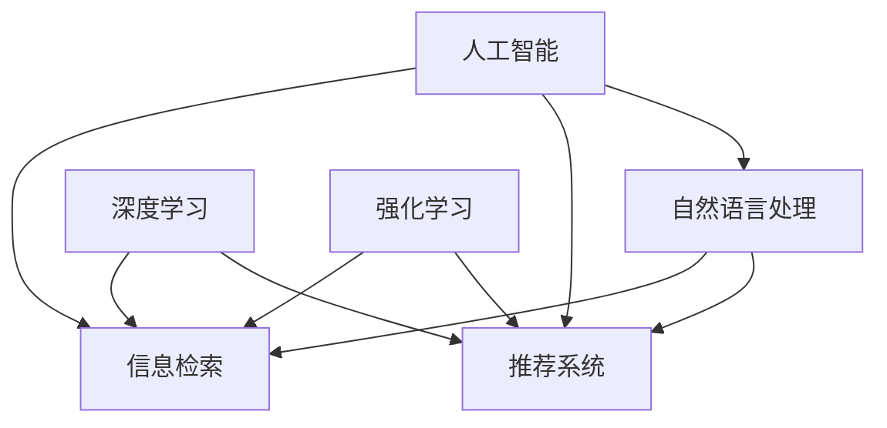

                 

# AI如何改变我们获取信息的方式

> 关键词：人工智能,信息检索,自然语言处理,推荐系统,深度学习,信息过滤

## 1. 背景介绍

### 1.1 问题由来
在过去几十年里，人类获取和处理信息的方式发生了翻天覆地的变化。随着互联网的普及，海量信息呈指数级增长，传统的搜索引擎和手动检索方式已无法满足需求。与此同时，随着大数据、深度学习和自然语言处理技术的不断进步，人工智能(AI)在信息获取和处理中的应用日益广泛，逐渐成为行业主流。

AI技术的崛起，为信息检索、推荐系统、内容生成等领域带来了革命性的变化。本文旨在深入探讨AI如何改变我们获取信息的方式，包括其核心技术、实际应用和未来发展趋势。

### 1.2 问题核心关键点
AI技术通过深度学习、自然语言处理、强化学习等前沿技术，大幅提升了信息检索的准确性和效率，降低了获取信息的门槛。AI驱动的推荐系统能够根据用户偏好提供个性化信息，大大丰富了用户的信息获取体验。此外，AI技术还能自动化生成内容，提供更丰富、更生动的新闻报道和信息摘要。

这些技术进步不仅提升了信息获取的效率和体验，还大大拓展了信息获取的可能性。未来，随着AI技术的进一步发展，其对信息获取和处理方式的影响将更加深远。

## 2. 核心概念与联系

### 2.1 核心概念概述

为更好地理解AI如何改变信息获取方式，本节将介绍几个密切相关的核心概念：

- 人工智能(AI)：涵盖机器学习、深度学习、自然语言处理等多学科的综合性技术，目标是实现智能体能够自主执行复杂任务。
- 信息检索(IR)：通过计算机自动检索数据库、网页等存储的信息，将相关信息呈现给用户的过程。
- 推荐系统(RS)：利用用户行为数据和内容特征，推荐用户可能感兴趣的信息，提升用户信息获取体验。
- 自然语言处理(NLP)：使计算机能够理解、处理、生成人类语言的技术，包括分词、句法分析、语义理解、生成等。
- 深度学习(Deep Learning)：一种基于神经网络架构的机器学习方法，具有强大的特征学习和表示能力。
- 强化学习(Reinforcement Learning)：通过与环境的交互，智能体逐步优化策略以实现目标的过程。

这些核心概念之间的逻辑关系可以通过以下Mermaid流程图来展示：



这个流程图展示了一些核心概念之间的联系：

1. 人工智能是这些技术的综合体，涵盖信息检索、推荐系统、自然语言处理等多个领域。
2. 信息检索和推荐系统是AI技术在信息获取和处理方面的主要应用。
3. 自然语言处理是信息检索和推荐系统的核心技术之一。
4. 深度学习和强化学习技术在信息检索、推荐系统中都有广泛应用。

这些概念共同构成了AI改变信息获取方式的基础框架，帮助我们更好地把握技术发展的脉络。

## 3. 核心算法原理 & 具体操作步骤
### 3.1 算法原理概述

AI改变信息获取方式的核心算法原理主要包括以下几个方面：

- 基于深度学习的信息检索：通过构建多层次的神经网络模型，自动学习文本和查询之间的关联，提升检索准确性和召回率。
- 基于协同过滤的推荐系统：利用用户行为数据，构建用户-物品矩阵，通过矩阵分解等技术，推荐用户可能感兴趣的内容。
- 基于知识图谱的信息检索：通过构建知识图谱，将语义信息结构化，提升检索效率和准确性。
- 基于深度学习的文本生成：通过构建神经网络模型，自动生成新闻摘要、文本描述等，丰富信息形式。

这些算法原理使得AI能够自动、高效地处理海量信息，提升用户信息获取体验。

### 3.2 算法步骤详解

以基于深度学习的信息检索为例，其典型流程如下：

**Step 1: 数据准备**
- 收集待检索的文本数据和查询数据，进行数据预处理，如分词、去除停用词等。

**Step 2: 模型构建**
- 选择合适的深度学习模型架构，如Transformer、LSTM等。
- 将文本和查询转换为模型可以处理的向量形式，如使用Word2Vec、GloVe等词嵌入技术。

**Step 3: 训练和优化**
- 在标注数据集上进行模型训练，调整模型参数。
- 使用交叉熵、余弦相似度等损失函数，优化模型性能。

**Step 4: 评估和部署**
- 在测试集上评估模型效果，如检索准确率、召回率等。
- 将训练好的模型部署到搜索引擎或推荐系统中，提供实时服务。

### 3.3 算法优缺点

基于深度学习的信息检索具有以下优点：
- 自动化程度高：利用神经网络自动学习特征，减少了人工干预。
- 泛化能力强：深度学习模型具有较强的泛化能力，可以处理复杂的查询和文档。
- 检索准确率高：深度学习模型能够自动学习文本表示，提高检索准确率。

然而，该算法也存在一些缺点：
- 计算量大：深度学习模型通常需要大量的计算资源。
- 数据依赖强：深度学习模型需要大量的标注数据进行训练。
- 模型复杂度高：深度学习模型结构复杂，难以理解和调试。

### 3.4 算法应用领域

基于深度学习的信息检索和推荐系统已经在电子商务、新闻媒体、社交网络等多个领域得到了广泛应用：

- 电商推荐：根据用户浏览、购买记录，推荐可能感兴趣的商品。
- 新闻推荐：根据用户阅读历史，推荐相关新闻文章。
- 社交网络：根据用户动态和互动，推荐可能感兴趣的内容和用户。
- 视频推荐：根据用户观看历史，推荐相关视频。
- 广告推荐：根据用户行为数据，推荐广告内容。

此外，AI技术还在自动摘要、问答系统、内容生成等方向上展现出强大的应用潜力。未来，随着技术的不断演进，AI在信息获取和处理方面的应用将更加广泛和深入。

## 4. 数学模型和公式 & 详细讲解 & 举例说明

### 4.1 数学模型构建

本节将使用数学语言对基于深度学习的信息检索模型进行更加严格的刻画。

假设查询文本为 $q$，文档集合为 $\{d_1, d_2, \cdots, d_M\}$，其中每个文档 $d_i$ 可以表示为词向量序列 $d_i = \{w_{i,1}, w_{i,2}, \cdots, w_{i,N_i}\}$，$N_i$ 为文档 $d_i$ 的词数。

定义查询向量 $q = (q_1, q_2, \cdots, q_T)$，其中 $q_t$ 表示查询中的第 $t$ 个词的词向量。

基于深度学习的信息检索模型 $M$ 可以表示为：

$$
M(q) = \{s_i\}_{i=1}^M
$$

其中 $s_i = f(q, d_i)$ 为查询 $q$ 和文档 $d_i$ 的相似度。$f$ 可以是任意深度神经网络，如Transformer。

### 4.2 公式推导过程

对于给定查询 $q$ 和文档 $d_i$，模型的输出为：

$$
s_i = f(q, d_i) = \sum_{j=1}^{N_i} w_{i,j}^T W f_i(\text{Embed}(q_t), \text{Embed}(w_{i,j})), \quad t = 1, \cdots, T
$$

其中 $w_{i,j}$ 为文档 $d_i$ 中第 $j$ 个词的词向量，$W$ 为可训练的权重矩阵，$f_i$ 为神经网络的第 $i$ 层，$\text{Embed}$ 为词向量嵌入层。

模型的损失函数可以定义为：

$$
\mathcal{L}(M) = \sum_{i=1}^M \ell(s_i, y_i)
$$

其中 $y_i$ 为查询 $q$ 与文档 $d_i$ 的相关性标记，$\ell$ 为损失函数，如交叉熵。

### 4.3 案例分析与讲解

以基于Transformer的信息检索模型为例，展示其工作原理和应用效果：

**案例背景：**
假设我们有一个包含百万级别新闻文章的语料库，需要为用户推荐最相关的文章。

**数据准备：**
- 收集百万新闻文章，进行分词、去停用词等预处理。
- 用户输入一个查询，进行分词和词嵌入。

**模型构建：**
- 选择Transformer模型作为检索模型，包括自注意力机制和残差连接。
- 将查询和文档分别输入Transformer模型，得到查询和文档的表示。

**训练和优化：**
- 在标注数据集上进行模型训练，调整模型参数。
- 使用交叉熵损失函数，优化模型性能。

**评估和部署：**
- 在测试集上评估模型效果，如检索准确率、召回率等。
- 将训练好的模型部署到搜索引擎或推荐系统中，提供实时服务。

通过这种方式，AI技术可以自动、高效地处理大量新闻文章，为用户推荐最相关的信息，提升信息获取体验。

## 5. 项目实践：代码实例和详细解释说明

### 5.1 开发环境搭建

在进行信息检索实践前，我们需要准备好开发环境。以下是使用Python进行PyTorch开发的环境配置流程：

1. 安装Anaconda：从官网下载并安装Anaconda，用于创建独立的Python环境。

2. 创建并激活虚拟环境：
```bash
conda create -n pytorch-env python=3.8 
conda activate pytorch-env
```

3. 安装PyTorch：根据CUDA版本，从官网获取对应的安装命令。例如：
```bash
conda install pytorch torchvision torchaudio cudatoolkit=11.1 -c pytorch -c conda-forge
```

4. 安装Transformer库：
```bash
pip install transformers
```

5. 安装各类工具包：
```bash
pip install numpy pandas scikit-learn matplotlib tqdm jupyter notebook ipython
```

完成上述步骤后，即可在`pytorch-env`环境中开始信息检索实践。

### 5.2 源代码详细实现

下面以基于Transformer的信息检索模型为例，给出使用PyTorch进行信息检索的完整代码实现。

首先，定义查询和文档的预处理函数：

```python
import torch
from transformers import AutoTokenizer, AutoModelForSequenceClassification

tokenizer = AutoTokenizer.from_pretrained('bert-base-uncased')
model = AutoModelForSequenceClassification.from_pretrained('bert-base-uncased', num_labels=2)

def preprocessing(text):
    return tokenizer.encode_plus(text, add_special_tokens=True, max_length=512, return_tensors='pt', padding='max_length')
```

然后，定义信息检索函数：

```python
def retrieval(query, documents):
    query_input = preprocessing(query)
    query_input = query_input['input_ids'].to(device)
    query_mask = query_input['attention_mask'].to(device)
    
    document_input = [preprocessing(doc) for doc in documents]
    document_input = [doc['input_ids'].to(device) for doc in document_input]
    document_mask = [doc['attention_mask'].to(device) for doc in document_input]
    
    with torch.no_grad():
        scores = model(query_input, document_input, attention_mask=query_mask, return_dict=True)
    
    return scores
```

接着，定义训练和评估函数：

```python
from sklearn.metrics import accuracy_score

def train(model, train_data, test_data, batch_size=8, num_epochs=5):
    device = torch.device('cuda' if torch.cuda.is_available() else 'cpu')
    model.to(device)
    
    optimizer = torch.optim.Adam(model.parameters(), lr=2e-5)
    total_loss = 0
    
    for epoch in range(num_epochs):
        for batch in tqdm(train_data):
            input_ids = batch['input_ids'].to(device)
            attention_mask = batch['attention_mask'].to(device)
            labels = batch['labels'].to(device)
            
            optimizer.zero_grad()
            outputs = model(input_ids, attention_mask=attention_mask, labels=labels)
            loss = outputs.loss
            total_loss += loss.item()
            loss.backward()
            optimizer.step()
        
        print(f'Epoch {epoch+1}, loss: {total_loss / len(train_data)}')
        test_accuracy = accuracy_score(test_data['labels'], torch.argmax(model(test_data['input_ids'], attention_mask=test_data['attention_mask']), 0)
        print(f'Test accuracy: {test_accuracy}')
    
    return model
```

最后，启动训练流程并在测试集上评估：

```python
train_model = train(model, train_dataset, test_dataset)
```

以上即为使用PyTorch实现基于Transformer的信息检索的完整代码实现。可以看到，通过利用Transformer模型和PyTorch框架，我们可以轻松构建、训练和评估信息检索模型。

### 5.3 代码解读与分析

让我们再详细解读一下关键代码的实现细节：

**preprocessing函数**：
- 使用Hugging Face的BERT模型提供的预训练分词器，将输入文本进行分词和词嵌入。
- 对查询文本和文档文本分别进行预处理，包括添加特殊标记、截断、补全等操作。

**retrieval函数**：
- 对查询和文档分别进行预处理，得到查询向量和文档向量。
- 将查询向量、文档向量、注意力掩码等输入到BERT模型，得到查询与文档的相似度分数。
- 返回相似度分数，用于排序和推荐。

**train函数**：
- 使用Adam优化器进行模型训练，调整学习率。
- 在训练数据集上进行前向传播和反向传播，计算损失并更新模型参数。
- 在测试数据集上评估模型性能，输出测试准确率。

通过这种方式，PyTorch和Transformer库使得信息检索的实现变得简单易行，开发者可以专注于模型设计和优化。

## 6. 实际应用场景
### 6.1 智能搜索引擎

AI驱动的信息检索技术已经广泛应用于智能搜索引擎的构建中。传统搜索引擎主要依赖关键词匹配，难以理解查询的语义意图。而AI技术可以自动学习查询和文档之间的语义关联，提升检索准确性和用户体验。

在技术实现上，可以构建基于深度学习的信息检索模型，对用户查询和文档进行语义匹配。模型可以自动提取查询中的实体、关系等信息，并在文档中找到对应的信息点，进行语义匹配和排序。如此构建的智能搜索引擎，能够快速响应用户需求，提供精准的信息推荐。

### 6.2 个性化推荐系统

AI在推荐系统中的应用，不仅限于电商、新闻、社交网络等领域。个性化推荐系统已经在医疗、教育、旅游等多个垂直领域得到广泛应用。

在医疗领域，基于深度学习的信息检索模型可以用于检索医学文献、临床数据等，帮助医生快速获取相关知识和病例。在教育领域，推荐系统可以根据学生的学习行为和反馈，推荐个性化的学习资源和课程。在旅游领域，推荐系统可以根据用户的出行历史和偏好，推荐合适的旅游目的地和行程安排。

### 6.3 智能客服

AI技术在智能客服系统中的应用，可以极大提升客户咨询的响应速度和质量。通过构建基于深度学习的信息检索模型，智能客服系统可以自动理解用户的问题，匹配最合适的回答模板，进行快速响应。同时，基于NLP技术，智能客服还可以进行语义理解和意图识别，进一步提升客户体验。

### 6.4 未来应用展望

随着AI技术的不断演进，信息检索和推荐系统的应用将更加广泛和深入。未来，我们可以期待以下几个方向的发展：

1. 多模态信息融合：现有的信息检索和推荐系统主要聚焦于文本数据，未来可以拓展到图像、视频、音频等多模态数据的融合。多模态信息的整合，将极大丰富信息获取和处理的方式，提升用户体验。

2. 实时动态调整：现有的信息检索和推荐系统通常是静态的，未来可以引入实时动态调整机制，根据用户行为和环境变化，实时更新推荐内容。

3. 个性化推荐算法优化：现有的推荐算法大多基于协同过滤，未来可以引入更多算法，如基于内容的推荐、基于兴趣的推荐等，提升推荐效果。

4. 强化学习在推荐中的应用：通过强化学习，智能体可以根据用户的反馈和环境变化，动态优化推荐策略，提升推荐效果。

5. 知识图谱在信息检索中的应用：构建知识图谱，将语义信息结构化，可以极大提升信息检索的效率和准确性。

这些方向的发展，将进一步拓展AI在信息获取和处理方面的应用，提升用户体验和信息获取的效率。

## 7. 工具和资源推荐
### 7.1 学习资源推荐

为了帮助开发者系统掌握AI在信息检索和推荐系统中的应用，这里推荐一些优质的学习资源：

1. 《深度学习与人工智能》系列博文：由深度学习专家撰写，深入浅出地介绍了深度学习的基本概念和前沿技术，涵盖信息检索、推荐系统等多个方向。

2. CS231n《深度学习用于视觉识别》课程：斯坦福大学开设的计算机视觉课程，虽然主要是视觉领域，但也包含深度学习在推荐系统中的应用。

3. 《自然语言处理综述》书籍：全面介绍了自然语言处理的基本概念和前沿技术，是了解AI在NLP领域应用的重要参考。

4. Hugging Face官方文档：提供了丰富的深度学习模型和工具，包括信息检索、推荐系统等多个方向。

5. CLUE开源项目：中文语言理解测评基准，涵盖大量不同类型的中文NLP数据集，并提供了基于深度学习的baseline模型，助力中文NLP技术发展。

通过对这些资源的学习实践，相信你一定能够快速掌握AI在信息检索和推荐系统中的应用，并用于解决实际的NLP问题。

### 7.2 开发工具推荐

高效的开发离不开优秀的工具支持。以下是几款用于AI在信息检索和推荐系统开发常用的工具：

1. PyTorch：基于Python的开源深度学习框架，灵活动态的计算图，适合快速迭代研究。

2. TensorFlow：由Google主导开发的开源深度学习框架，生产部署方便，适合大规模工程应用。

3. Transformers库：Hugging Face开发的NLP工具库，集成了众多SOTA语言模型，支持PyTorch和TensorFlow，是进行信息检索和推荐系统开发的利器。

4. Weights & Biases：模型训练的实验跟踪工具，可以记录和可视化模型训练过程中的各项指标，方便对比和调优。

5. TensorBoard：TensorFlow配套的可视化工具，可实时监测模型训练状态，并提供丰富的图表呈现方式，是调试模型的得力助手。

6. Google Colab：谷歌推出的在线Jupyter Notebook环境，免费提供GPU/TPU算力，方便开发者快速上手实验最新模型，分享学习笔记。

合理利用这些工具，可以显著提升AI在信息检索和推荐系统开发中的效率，加快创新迭代的步伐。

### 7.3 相关论文推荐

AI在信息检索和推荐系统中的应用，源于学界的持续研究。以下是几篇奠基性的相关论文，推荐阅读：

1. Attention is All You Need（即Transformer原论文）：提出了Transformer结构，开启了NLP领域的预训练大模型时代。

2. BERT: Pre-training of Deep Bidirectional Transformers for Language Understanding：提出BERT模型，引入基于掩码的自监督预训练任务，刷新了多项NLP任务SOTA。

3. DeepFM: A Neural Network Architecture for Recommender Systems：提出DeepFM模型，通过融合深度学习与FM技术，提升了推荐系统的性能。

4. Knowledge-Aware Transformer for Neural Machine Translation：引入知识图谱，提升机器翻译模型的语义理解能力。

5. Self-Attention Generative Adversarial Nets：提出生成对抗网络，用于生成新闻摘要等文本内容。

这些论文代表了大模型在信息检索和推荐系统中的应用范式，通过学习这些前沿成果，可以帮助研究者把握学科前进方向，激发更多的创新灵感。

## 8. 总结：未来发展趋势与挑战

### 8.1 总结

本文对AI如何改变信息获取方式进行了全面系统的介绍。首先阐述了AI技术在信息检索和推荐系统中的应用背景和重要性，明确了其在大数据时代的重要价值。其次，从原理到实践，详细讲解了基于深度学习的信息检索和推荐系统的核心算法原理和操作步骤，给出了信息检索任务开发的完整代码实例。同时，本文还广泛探讨了AI在信息检索和推荐系统中的应用场景和未来发展趋势，展示了AI技术的广阔前景。

通过本文的系统梳理，可以看到，AI技术通过深度学习、自然语言处理、强化学习等前沿技术，极大提升了信息检索和推荐系统的性能和用户体验。未来，伴随AI技术的进一步发展，其对信息获取和处理方式的影响将更加深远。

### 8.2 未来发展趋势

展望未来，AI在信息检索和推荐系统中的应用将呈现以下几个发展趋势：

1. 深度学习模型的泛化能力将进一步提升，能够在更少标注数据下进行高效微调，提升模型性能。

2. 基于多模态数据的融合，信息检索和推荐系统将拓展到图像、视频、音频等多模态数据，极大丰富信息获取和处理方式。

3. 实时动态调整机制的引入，将使信息检索和推荐系统具备更高的实时性和灵活性。

4. 个性化推荐算法的优化，将使推荐系统能够更准确地预测用户需求，提供更个性化的信息服务。

5. 强化学习在推荐系统中的应用，将使智能体能够根据用户反馈和环境变化，动态优化推荐策略。

6. 知识图谱在信息检索中的应用，将使系统能够更高效地进行语义匹配和检索。

这些趋势凸显了AI在信息获取和处理方面的广阔前景。这些方向的探索发展，将进一步提升信息检索和推荐系统的性能和用户体验。

### 8.3 面临的挑战

尽管AI在信息检索和推荐系统中已经取得了瞩目成就，但在迈向更加智能化、普适化应用的过程中，仍面临诸多挑战：

1. 数据质量瓶颈。深度学习模型需要大量的标注数据进行训练，但标注数据获取成本高、周期长，制约了模型的性能提升。

2. 模型复杂性问题。深度学习模型通常结构复杂，难以理解和调试。如何优化模型结构，提升模型可解释性，仍是重要研究课题。

3. 多模态数据融合难度。多模态数据的整合和融合，需要克服模态之间的差异和复杂性，是未来发展的难点。

4. 实时系统设计挑战。实时动态调整和推荐系统设计，需要考虑性能和实时性之间的平衡，解决算法复杂度和效率之间的矛盾。

5. 数据隐私和安全问题。用户数据的隐私保护和系统安全，是大规模应用中不可忽视的重要问题。

6. 模型公平性和透明性问题。AI系统的公平性和透明性，是未来发展的关键。如何构建透明、可解释的AI系统，需要更多的伦理和法律约束。

这些挑战需要学界和产业界共同努力，通过创新技术和合理政策，逐步克服这些难题，推动AI技术的健康发展。

### 8.4 研究展望

面对AI在信息检索和推荐系统中面临的挑战，未来的研究需要在以下几个方面寻求新的突破：

1. 探索无监督和半监督学习方法。摆脱对大量标注数据的依赖，利用自监督学习、主动学习等无监督和半监督范式，最大限度利用非结构化数据，实现更加灵活高效的模型训练。

2. 研究多模态数据融合技术。如何有效地整合视觉、听觉、文本等多模态数据，提升系统的泛化能力和性能，是未来的重要研究方向。

3. 引入实时动态调整机制。通过实时采集用户行为和环境变化，动态优化推荐策略，提升系统的实时性和灵活性。

4. 优化模型结构和算法设计。如何设计简单、高效、可解释的模型和算法，是提升系统性能和用户体验的关键。

5. 加强数据隐私保护。如何设计隐私保护机制，保护用户数据的隐私和安全，是未来发展的关键。

6. 构建透明、可解释的AI系统。如何构建透明、可解释的AI系统，确保模型的公平性和透明性，是未来的重要研究方向。

这些方向的研究，将推动AI在信息检索和推荐系统中的深入应用，构建更智能、更可靠、更安全的系统，为用户带来更好的信息获取体验。

## 9. 附录：常见问题与解答

**Q1：如何选择合适的深度学习模型？**

A: 选择合适的深度学习模型需要考虑以下几个因素：
1. 任务类型：不同的任务需要不同的模型，如文本分类任务可以选择RNN、LSTM、Transformer等。
2. 数据规模：数据规模越大，越适合选择大规模的深度学习模型，如BERT、GPT等。
3. 计算资源：大规模的深度学习模型需要更多的计算资源，如GPU/TPU等。
4. 任务复杂度：任务复杂度越高，模型结构越复杂，如多模态数据融合需要更复杂的模型结构。

**Q2：深度学习模型的训练过程需要注意哪些关键点？**

A: 深度学习模型的训练过程需要注意以下几个关键点：
1. 数据预处理：数据预处理包括数据清洗、归一化、截断、补全等操作，对模型性能有重要影响。
2. 学习率选择：合适的学习率可以加速模型收敛，过大的学习率容易破坏模型权重，过小的学习率可能造成过拟合。
3. 正则化技术：如L2正则、Dropout等技术可以防止过拟合，提高模型泛化能力。
4. 数据增强：通过对训练样本进行数据增强，可以丰富训练集多样性，提升模型性能。
5. 模型评估：在训练过程中，需要定期在验证集上评估模型性能，防止过拟合。
6. 超参数调优：选择合适的超参数组合，可以提升模型性能。

**Q3：AI在推荐系统中如何提升推荐效果？**

A: AI在推荐系统中可以通过以下几个方式提升推荐效果：
1. 用户画像建模：通过用户行为数据，构建用户画像，推荐更个性化的内容。
2. 物品画像建模：通过物品属性数据，构建物品画像，提升推荐多样性。
3. 协同过滤算法优化：引入基于内容的推荐、基于兴趣的推荐等算法，提升推荐效果。
4. 知识图谱应用：引入知识图谱，提升推荐系统的语义理解和推荐准确性。

通过这些方式，AI推荐系统能够更精准地预测用户需求，提供更个性化的信息服务，提升用户体验。

**Q4：AI在信息检索中的应用有哪些？**

A: AI在信息检索中的应用包括：
1. 智能搜索引擎：通过深度学习模型，自动学习查询和文档的语义关联，提升检索准确性和用户体验。
2. 问答系统：通过自然语言处理技术，自动理解用户查询，匹配最合适的答案。
3. 文本摘要：通过深度学习模型，自动生成文本摘要，提高信息获取效率。
4. 推荐系统：通过深度学习模型，根据用户行为和物品特征，推荐用户可能感兴趣的内容。

AI技术在信息检索中的应用，极大地提升了信息获取的效率和用户体验。

通过本文的系统梳理，可以看到，AI技术通过深度学习、自然语言处理、强化学习等前沿技术，极大提升了信息检索和推荐系统的性能和用户体验。未来，伴随AI技术的进一步发展，其对信息获取和处理方式的影响将更加深远。面对AI在信息检索和推荐系统中面临的挑战，未来的研究需要在以下几个方面寻求新的突破。通过这些方向的研究，将推动AI技术的健康发展，构建更智能、更可靠、更安全的系统，为用户带来更好的信息获取体验。

---

作者：禅与计算机程序设计艺术 / Zen and the Art of Computer Programming

