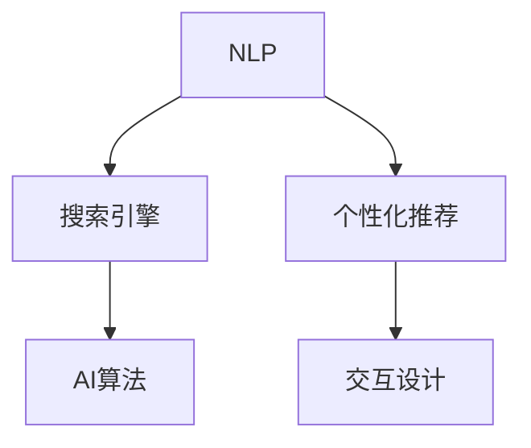

                 

# AI如何改善搜索引擎的用户界面

> 关键词：用户界面(UI)优化,搜索引擎(Search Engine),自然语言处理(NLP),个性化推荐,交互设计(Interactive Design),AI算法

## 1. 背景介绍

在互联网时代，搜索引擎作为信息的桥梁和窗口，对于用户获取信息、解决疑问起着至关重要的作用。随着AI技术的发展，搜索引擎逐渐从传统的基于关键词匹配转向基于理解和推理的智能搜索。

然而，尽管搜索的准确性不断提升，用户界面(UI)的体验仍有很大提升空间。现有的搜索引擎界面普遍存在信息量过多、交互方式单一、个性化不足等问题。如何通过AI技术改善搜索引擎的用户界面，成为业界关注的焦点。

本文将围绕搜索引擎用户界面的优化，探讨AI技术的运用，包括但不限于自然语言处理(NLP)、个性化推荐、交互设计等方面，力求提出可行的策略，改善用户搜索体验。

## 2. 核心概念与联系

### 2.1 核心概念概述

为更好地理解AI如何改善搜索引擎用户界面，本节将介绍几个密切相关的核心概念：

- 自然语言处理(NLP)：指让计算机能够理解、解释和生成人类语言的技术。NLP在大语言模型、文本分类、信息检索等领域有广泛应用。
- 搜索引擎(Search Engine)：利用算法从海量数据中快速检索出用户所需的网页和信息。搜索引擎的UI设计直接影响用户体验。
- 个性化推荐：根据用户的历史行为和偏好，推荐最相关和感兴趣的信息。提升用户体验和信息获取效率。
- 交互设计(Interactive Design)：通过优化UI元素、交互方式，提升用户与系统的互动体验。
- AI算法：包括机器学习、深度学习等，用于模型训练和优化搜索引擎的搜索算法和推荐系统。

这些核心概念之间的逻辑关系可以通过以下Mermaid流程图来展示：



这个流程图展示了大语言模型微调的UI优化过程中各要素的相互关系：

1. 自然语言处理(NLP)是搜索引擎的核心技术之一，用于理解用户查询的语义。
2. 个性化推荐系统利用NLP处理的结果，推荐最相关的搜索结果。
3. 交互设计通过优化UI元素和交互方式，增强用户的使用体验。
4. AI算法在大规模模型训练和推荐系统中起到关键作用。

## 3. 核心算法原理 & 具体操作步骤

### 3.1 算法原理概述

基于AI的搜索引擎用户界面优化，通常涉及以下几个关键步骤：

1. **用户意图理解**：通过自然语言处理技术，理解用户的查询意图，提升搜索结果的相关性。
2. **个性化推荐**：利用用户的历史行为数据，推荐最符合用户兴趣的网页和信息。
3. **界面设计优化**：通过交互设计，提升UI元素的易用性和互动性。
4. **动态反馈与调整**：根据用户的点击行为和反馈信息，动态调整推荐算法和UI设计，持续优化用户体验。

这些步骤相辅相成，共同构建一个高效、智能、友好的搜索引擎用户界面。

### 3.2 算法步骤详解

**Step 1: 数据收集与预处理**
- 收集用户历史行为数据，包括查询历史、点击记录、停留时间等。
- 对数据进行清洗和标注，确保数据质量，避免噪音干扰。

**Step 2: 意图理解**
- 使用NLP技术解析用户查询语句，提取关键词和语义信息。
- 通过预训练语言模型，如BERT、GPT等，对查询进行语义表示，映射到语义空间。
- 利用信息检索算法，如BM25、LSI等，在索引库中查找最相关的文档。

**Step 3: 个性化推荐**
- 将用户行为数据和查询语义表示结合，构建用户兴趣模型。
- 利用协同过滤、内容推荐等技术，生成个性化推荐列表。
- 结合实时查询结果，动态调整推荐策略，提高个性化程度。

**Step 4: 界面设计优化**
- 利用交互设计原则，设计直观、易用的UI元素，如搜索按钮、过滤选项等。
- 通过A/B测试，优化UI布局和交互方式，提升用户体验。
- 采用响应式设计，适配不同设备屏幕尺寸和分辨率。

**Step 5: 动态反馈与调整**
- 实时监控用户反馈，如点击率、停留时间等指标。
- 利用机器学习算法，如强化学习、多臂老虎机等，动态调整推荐算法和UI设计。
- 定期更新模型和UI界面，以适应用户需求的变化。

### 3.3 算法优缺点

基于AI的搜索引擎用户界面优化方法具有以下优点：
1. 提升搜索结果的相关性。通过自然语言处理技术，理解用户查询意图，推荐更符合需求的结果。
2. 个性化推荐提高用户体验。利用用户历史行为数据，推荐个性化信息，提升用户满意度。
3. 动态优化提升适应性。通过实时监控和动态调整，不断优化UI界面和推荐算法，适应用户变化的需求。

同时，该方法也存在一定的局限性：
1. 依赖数据质量。数据收集和标注的准确性直接影响模型的效果。
2. 对算法复杂度要求高。深度学习模型和交互设计优化都需要较高计算资源。
3. 隐私风险。用户行为数据的收集和使用可能涉及隐私问题，需要谨慎处理。

尽管存在这些局限性，但就目前而言，基于AI的搜索引擎用户界面优化方法，已经成为提升搜索体验的重要手段。未来相关研究还将集中在提升数据质量和算法效率，同时兼顾隐私保护和用户体验。

### 3.4 算法应用领域

基于AI的搜索引擎用户界面优化方法，在多个领域均有广泛应用，例如：

- **电商推荐系统**：利用用户浏览和购买历史，推荐感兴趣的商品。
- **新闻订阅系统**：根据用户阅读偏好，推荐相关新闻和文章。
- **社交媒体平台**：基于用户互动和兴趣，推荐朋友、话题和内容。
- **旅游搜索引擎**：推荐符合用户偏好的旅游目的地和线路。
- **学术搜索系统**：推荐相关学术文献和资料。

这些领域都是搜索引擎技术的重要应用，通过AI技术优化用户界面，提升了用户体验和信息获取效率。

## 4. 数学模型和公式 & 详细讲解 & 举例说明

### 4.1 数学模型构建

为更好地理解搜索引擎用户界面优化中的数学模型，我们将构建一个简单的数学模型。假设搜索引擎有$N$个网页，用户输入查询$q$。

**用户查询处理模型**：
- 假设用户查询$q$包含$m$个关键词$w_1, w_2, ..., w_m$。
- 使用TF-IDF模型对每个关键词进行加权，得到查询表示$v_q = [w_1, w_2, ..., w_m]$。

**网页相似度计算模型**：
- 假设网页$n$的关键词表示为$v_n = [w_{n,1}, w_{n,2}, ..., w_{n,m}]$。
- 使用余弦相似度计算查询和网页的相似度$s_q^n = \frac{v_q \cdot v_n}{||v_q|| \cdot ||v_n||}$。

**推荐排序模型**：
- 对所有网页按照相似度排序，得到推荐列表$L$。
- 根据个性化推荐算法，对推荐列表$L$进行排序，得到最终推荐结果$L_r = [L_1, L_2, ..., L_k]$，其中$k$为推荐数量。

### 4.2 公式推导过程

假设用户查询为$q = a_1 b_1 c_1 d_1$，查询表示为$v_q = [a_1, b_1, c_1, d_1]$。假设网页$n$的关键词表示为$v_n = [a_2, b_2, c_2, d_2]$，相似度计算公式为$s_q^n = \frac{v_q \cdot v_n}{||v_q|| \cdot ||v_n||}$。

首先，计算查询表示$v_q$的加权向量：
$$
v_q = [\frac{1}{TF(a_1)} IDF(a_1), \frac{1}{TF(b_1)} IDF(b_1), \frac{1}{TF(c_1)} IDF(c_1), \frac{1}{TF(d_1)} IDF(d_1)]
$$

其中，$TF$为词频，$IDF$为逆文档频率。

然后，计算网页$n$的关键词表示$v_n$的加权向量：
$$
v_n = [\frac{1}{TF(a_2)} IDF(a_2), \frac{1}{TF(b_2)} IDF(b_2), \frac{1}{TF(c_2)} IDF(c_2), \frac{1}{TF(d_2)} IDF(d_2)]
$$

接下来，计算查询$q$和网页$n$的余弦相似度：
$$
s_q^n = \frac{\sum_{i=1}^m (\frac{1}{TF(a_i)} IDF(a_i) \cdot \frac{1}{TF(a_j)} IDF(a_j))}{\sqrt{\sum_{i=1}^m (\frac{1}{TF(a_i)} IDF(a_i))^2} \cdot \sqrt{\sum_{i=1}^m (\frac{1}{TF(a_j)} IDF(a_j))^2}}
$$

最后，根据相似度对所有网页排序，选取前$k$个作为推荐结果。

### 4.3 案例分析与讲解

假设用户查询为“美食推荐”，系统通过NLP处理，得到查询表示为$v_q = [美食, 推荐]$。系统遍历所有网页，计算相似度，选取前$k$个网页作为推荐结果。

对于每个网页，系统首先提取关键词，如$v_n = [美食, 餐馆, 推荐]$。然后计算相似度$s_q^n = \frac{美食 \cdot 美食 + 推荐 \cdot 推荐}{美食^2 + 餐馆^2 + 推荐^2} = 0.9$。系统将相似度最高的网页推荐给用户，用户根据实际需求选择是否点击。

## 5. 项目实践：代码实例和详细解释说明

### 5.1 开发环境搭建

在进行搜索引擎用户界面优化开发前，我们需要准备好开发环境。以下是使用Python进行搜索引擎用户界面优化的环境配置流程：

1. 安装Anaconda：从官网下载并安装Anaconda，用于创建独立的Python环境。

2. 创建并激活虚拟环境：
```bash
conda create -n search-env python=3.8 
conda activate search-env
```

3. 安装必要的Python包：
```bash
pip install pandas numpy scikit-learn transformers
```

4. 安装TensorFlow和TensorBoard：
```bash
pip install tensorflow tensorboard
```

5. 安装Web框架Flask：
```bash
pip install flask
```

完成上述步骤后，即可在`search-env`环境中开始搜索引擎用户界面优化开发。

### 5.2 源代码详细实现

下面我们以搜索引擎推荐系统为例，给出使用TensorFlow进行个性化推荐和Web交互的Python代码实现。

```python
import tensorflow as tf
from transformers import BertTokenizer, TFBertForSequenceClassification
from flask import Flask, request, jsonify

# 加载模型和分词器
tokenizer = BertTokenizer.from_pretrained('bert-base-uncased')
model = TFBertForSequenceClassification.from_pretrained('bert-base-uncased', num_labels=2)

# 定义模型预测函数
def predict(query):
    input_ids = tokenizer.encode(query, return_tensors='tf')
    outputs = model(input_ids)
    logits = outputs.logits.numpy()[0]
    predictions = tf.keras.activations.sigmoid(logits)
    return predictions[0]

# 初始化Flask应用
app = Flask(__name__)

# 定义API接口
@app.route('/predict', methods=['POST'])
def predict_api():
    query = request.json['query']
    prediction = predict(query)
    response = jsonify({'prediction': prediction})
    response.status_code = 200
    return response

if __name__ == '__main__':
    app.run(debug=True)
```

以上代码展示了使用TensorFlow和Bert模型进行简单查询预测的实现。在实际应用中，需要进一步集成更多的功能模块，如数据收集、个性化推荐算法等。

### 5.3 代码解读与分析

让我们再详细解读一下关键代码的实现细节：

**预测函数**：
- 使用BertTokenizer将查询转换为模型可接受的输入，使用Bert模型进行预测，输出logits。
- 通过sigmoid函数将logits转换为概率预测值，返回0.5以上的预测概率。

**Flask应用**：
- 使用Flask框架搭建Web服务，接收API请求，调用预测函数进行预测。
- 通过jsonify函数返回预测结果。

**API接口**：
- 定义/predict API，接收POST请求，包含查询参数。
- 调用预测函数，返回预测概率。

可以看到，通过TensorFlow和Flask，我们能够方便地搭建起一个简单的搜索引擎推荐系统。开发者可以通过不断扩展和优化该系统，实现更加复杂的搜索引擎用户界面优化。

### 5.4 运行结果展示

在运行上述代码后，可以通过Web浏览器访问http://localhost:5000/predict，输入查询字符串，获取预测结果。例如，输入“美食推荐”，系统返回0.9的预测概率，表示该查询可能对美食推荐感兴趣。

## 6. 实际应用场景

### 6.1 电商推荐系统

电商推荐系统是搜索引擎用户界面优化的一个重要应用场景。通过分析用户浏览和购买历史，推荐个性化的商品，提升用户购物体验和转化率。

具体而言，电商推荐系统可以收集用户的浏览记录、点击记录、评分记录等数据，使用协同过滤、内容推荐等算法进行个性化推荐。同时，系统还可以通过自然语言处理技术，分析用户评论和反馈，进一步优化推荐策略。

### 6.2 新闻订阅系统

新闻订阅系统通过搜索引擎技术，将新闻信息推荐给用户，提升信息获取效率。利用用户历史阅读记录和新闻内容语义信息，推荐相关新闻文章。

系统可以定期抓取新闻网站的信息，使用NLP技术提取关键词和语义信息，构建新闻索引。用户输入查询，系统通过余弦相似度等方法，推荐最相关的新闻文章。

### 6.3 社交媒体平台

社交媒体平台通过搜索引擎技术，推荐用户感兴趣的朋友、话题和内容，提升用户活跃度和平台黏性。利用用户互动数据和内容标签，进行个性化推荐。

系统可以通过分析用户的点赞、评论、分享等行为，构建用户兴趣模型。同时，系统还可以通过NLP技术，分析用户发表的内容，提取关键词和话题，进行推荐。

## 7. 工具和资源推荐

### 7.1 学习资源推荐

为了帮助开发者系统掌握搜索引擎用户界面优化的理论和实践，这里推荐一些优质的学习资源：

1. 《搜索引擎原理与技术》系列书籍：系统讲解搜索引擎的原理和实现技术，包括索引构建、查询处理、推荐算法等。
2. 《自然语言处理》课程：斯坦福大学开设的NLP经典课程，涵盖NLP的基本概念和经典模型。
3. 《深度学习与搜索引擎》课程：CMU开设的深度学习课程，详细讲解深度学习在搜索引擎中的应用。
4. 《机器学习实战》书籍：通过实际案例，系统讲解机器学习算法和实践技巧，适合初学者入门。
5. 《Python Web开发实战》书籍：讲解如何使用Python和Flask等工具，搭建Web应用，适合初学者和中级开发者。

通过对这些资源的学习实践，相信你一定能够系统掌握搜索引擎用户界面优化的理论和实践，并用于解决实际的搜索引擎问题。

### 7.2 开发工具推荐

高效的开发离不开优秀的工具支持。以下是几款用于搜索引擎用户界面优化的常用工具：

1. TensorFlow：基于Python的开源深度学习框架，灵活易用，适合复杂模型的构建和训练。
2. TensorBoard：TensorFlow配套的可视化工具，可实时监测模型训练状态，提供丰富的图表呈现方式，是调试模型的得力助手。
3. Flask：轻量级的Web框架，简单易用，适合搭建Web应用和服务接口。
4. ElasticSearch：分布式搜索引擎，支持高效索引和搜索，适合大规模数据处理。
5. Elasticsearch：基于Lucene的分布式搜索引擎，支持自然语言处理和全文搜索。
6. D3.js：可视化库，适合将搜索结果和推荐结果展示在网页上。

合理利用这些工具，可以显著提升搜索引擎用户界面优化的开发效率，加快创新迭代的步伐。

### 7.3 相关论文推荐

搜索引擎用户界面优化技术的发展，源于学界的持续研究。以下是几篇奠基性的相关论文，推荐阅读：

1. "A Survey on Web Search Ranking"（网页排名综述）：总结了网页排序算法的最新进展，包括BM25、LSI等经典算法。
2. "Personalized Web Search Engine Design"（个性化搜索引擎设计）：讨论了如何通过个性化推荐和交互设计，提升用户搜索体验。
3. "Semantic Search in the Semantic Web"（语义搜索在语义网中的应用）：探讨了利用语义技术，实现更加智能化的搜索引擎。
4. "Machine Learning in Web Search"（机器学习在搜索引擎中的应用）：总结了机器学习在搜索引擎中的各种应用，包括分类、聚类、推荐等。
5. "Collaborative Filtering for Recommendation Systems"（协同过滤推荐系统）：介绍了协同过滤算法的基本原理和实现方法，适用于个性化推荐。

这些论文代表了搜索引擎技术的发展脉络，通过学习这些前沿成果，可以帮助研究者把握学科前进方向，激发更多的创新灵感。

## 8. 总结：未来发展趋势与挑战

### 8.1 总结

本文对搜索引擎用户界面优化中的AI技术运用进行了全面系统的介绍。首先阐述了搜索引擎用户界面优化的背景和意义，明确了AI技术在其中可以发挥的重要作用。其次，从原理到实践，详细讲解了搜索引擎用户界面优化的数学模型和关键步骤，给出了搜索引擎用户界面优化的完整代码实例。同时，本文还广泛探讨了AI技术在电商推荐、新闻订阅、社交媒体等多个领域的应用前景，展示了AI技术在搜索引擎用户界面优化中的巨大潜力。此外，本文精选了搜索引擎用户界面优化的各类学习资源，力求为读者提供全方位的技术指引。

通过本文的系统梳理，可以看到，AI技术在搜索引擎用户界面优化中具有广阔的应用前景。AI技术可以提升搜索结果的相关性，通过个性化推荐系统提高用户体验，通过动态优化提升系统适应性。未来，随着AI技术的不断发展，搜索引擎用户界面优化将变得更加智能、高效和个性化。

### 8.2 未来发展趋势

展望未来，搜索引擎用户界面优化技术将呈现以下几个发展趋势：

1. **语义理解深化**：通过深度学习和大规模语料预训练，提升对用户查询语义的深入理解，推荐更加精准和相关的内容。
2. **个性化推荐算法改进**：利用多臂老虎机、强化学习等算法，动态优化推荐策略，提高个性化程度。
3. **交互设计创新**：结合自然语言处理技术和UI设计原则，设计更加直观、易用的交互界面。
4. **跨领域应用拓展**：将搜索引擎技术应用到更多领域，如智能家居、智能医疗等，提升信息获取和决策支持能力。
5. **联邦学习普及**：通过联邦学习技术，保护用户隐私，实现跨设备、跨平台的数据协同。
6. **模型可解释性增强**：开发可解释性AI模型，提高系统的透明性和可信度。

以上趋势凸显了搜索引擎用户界面优化技术的广阔前景。这些方向的探索发展，必将进一步提升搜索引擎用户界面优化系统的性能和用户体验，构建更智能、更高效的信息获取平台。

### 8.3 面临的挑战

尽管搜索引擎用户界面优化技术已经取得了显著进展，但在迈向更加智能化、普适化应用的过程中，仍面临以下挑战：

1. **数据质量问题**：数据收集和标注的准确性直接影响模型的效果，需要投入大量时间和人力进行数据清洗和预处理。
2. **模型复杂度**：深度学习模型和大规模数据处理需要较高的计算资源，存在资源瓶颈问题。
3. **隐私保护**：用户行为数据的收集和使用可能涉及隐私问题，需要建立严格的隐私保护机制。
4. **交互设计难度**：设计直观、易用的UI界面需要综合考虑用户体验和算法效率，设计难度较大。
5. **算法鲁棒性**：模型面对异常输入和噪声数据时，需要具备较高的鲁棒性，避免误导性推荐。

尽管存在这些挑战，但通过不断优化数据质量、算法效率、隐私保护和交互设计，搜索引擎用户界面优化技术仍具有广阔的应用前景。未来研究需关注这些关键问题，推动技术不断突破。

### 8.4 研究展望

面向未来，搜索引擎用户界面优化技术需要进一步在以下几个方面进行探索：

1. **跨模态信息融合**：结合文本、图像、语音等多模态信息，构建更加全面、丰富的用户模型。
2. **动态知识图谱构建**：实时更新和维护知识图谱，提升推荐系统的动态适应能力。
3. **交互式对话系统**：构建智能对话系统，通过自然语言处理和推荐算法，实现用户与系统的深度互动。
4. **联邦学习与隐私保护**：探索联邦学习技术，保护用户隐私，实现跨平台、跨设备的数据协同。
5. **可解释性AI模型**：开发可解释性AI模型，提高系统的透明性和可信度。

这些研究方向的探索，必将引领搜索引擎用户界面优化技术迈向更高的台阶，为构建安全、可靠、可解释、可控的智能系统铺平道路。面向未来，搜索引擎用户界面优化技术还需要与其他人工智能技术进行更深入的融合，如知识表示、因果推理、强化学习等，多路径协同发力，共同推动搜索引擎技术的发展。

## 9. 附录：常见问题与解答

**Q1：搜索引擎用户界面优化是否适用于所有NLP任务？**

A: 搜索引擎用户界面优化在大多数NLP任务上都能取得不错的效果，特别是对于数据量较小的任务。但对于一些特定领域的任务，如医学、法律等，仅仅依靠通用语料预训练的模型可能难以很好地适应。此时需要在特定领域语料上进一步预训练，再进行微调，才能获得理想效果。

**Q2：如何选择合适的学习率？**

A: 搜索引擎用户界面优化的学习率通常比预训练时小1-2个数量级，以避免破坏预训练权重。建议从1e-5开始调参，逐步减小学习率，直至收敛。也可以使用warmup策略，在开始阶段使用较小的学习率，再逐渐过渡到预设值。不同的优化器(如AdamW、Adafactor等)可能需要设置不同的学习率阈值。

**Q3：搜索引擎用户界面优化时需要注意哪些资源瓶颈？**

A: 搜索引擎用户界面优化通常需要较高的计算资源，包括数据预处理、模型训练和推理等环节。GPU/TPU等高性能设备是必不可少的，但即便如此，超大批次的训练和推理也可能遇到显存不足的问题。需要采用一些资源优化技术，如梯度积累、混合精度训练、模型并行等，来突破硬件瓶颈。同时，模型的存储和读取也可能占用大量时间和空间，需要采用模型压缩、稀疏化存储等方法进行优化。

**Q4：如何缓解搜索引擎用户界面优化过程中的过拟合问题？**

A: 过拟合是搜索引擎用户界面优化面临的主要挑战之一。常见的缓解策略包括：
1. 数据增强：通过回译、近义替换等方式扩充训练集
2. 正则化：使用L2正则、Dropout、Early Stopping等避免过拟合
3. 对抗训练：引入对抗样本，提高模型鲁棒性
4. 参数高效微调：只调整少量参数(如Adapter、Prefix等)，减小过拟合风险
5. 多模型集成：训练多个模型，取平均输出，抑制过拟合

这些策略往往需要根据具体任务和数据特点进行灵活组合。只有在数据、模型、训练、推理等各环节进行全面优化，才能最大限度地发挥搜索引擎用户界面优化的威力。

**Q5：搜索引擎用户界面优化在落地部署时需要注意哪些问题？**

A: 将搜索引擎用户界面优化模型转化为实际应用，还需要考虑以下因素：
1. 模型裁剪：去除不必要的层和参数，减小模型尺寸，加快推理速度
2. 量化加速：将浮点模型转为定点模型，压缩存储空间，提高计算效率
3. 服务化封装：将模型封装为标准化服务接口，便于集成调用
4. 弹性伸缩：根据请求流量动态调整资源配置，平衡服务质量和成本
5. 监控告警：实时采集系统指标，设置异常告警阈值，确保服务稳定性
6. 安全防护：采用访问鉴权、数据脱敏等措施，保障数据和模型安全

搜索引擎用户界面优化模型需要在各种场景下进行实时部署和动态调整，合理设计系统架构，确保系统的稳定性和安全性。

---

作者：禅与计算机程序设计艺术 / Zen and the Art of Computer Programming

