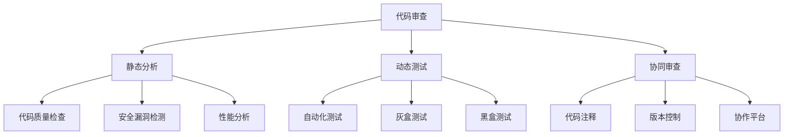

                 

# AI开发的代码审查：Lepton AI的质量控制

在人工智能（AI）领域，代码审查（Code Review）是保证代码质量、提升开发效率和促进团队协作的重要环节。然而，随着AI技术的复杂性和多样性的不断提升，如何高效、全面地进行代码审查成为了一个重要课题。Lepton AI作为AI开发的领先平台，其独特的代码审查机制为行业树立了新标杆。本文将详细介绍Lepton AI的代码审查机制，探讨其核心概念、关键算法、操作步骤，以及其在AI开发中的应用。

## 1. 背景介绍

### 1.1 问题由来
AI技术的迅猛发展为软件开发带来了新的挑战。随着深度学习、自然语言处理、计算机视觉等AI技术在各行各业的应用日益广泛，代码的复杂性和需求的多样性不断增加，传统的代码审查机制已经难以适应这种变化。特别是当AI模型的开发涉及大规模数据集、复杂算法和高性能计算时，传统的代码审查方式效率低下、难以全面覆盖，容易导致质量问题和安全漏洞。

### 1.2 问题核心关键点
Lepton AI的代码审查机制，旨在构建一个基于代码静态分析、动态测试和协同审查的综合平台，帮助开发者高效、全面地审查代码，提升AI开发的质量和效率。其核心关键点包括：

- 静态分析：通过代码质量检查、安全漏洞检测、性能分析等静态分析工具，自动发现潜在问题。
- 动态测试：结合自动化测试、灰盒测试和黑盒测试等动态测试手段，验证代码的功能和性能。
- 协同审查：利用代码注释、版本控制工具和协作平台，促进团队成员之间的代码审查和沟通。

## 2. 核心概念与联系

### 2.1 核心概念概述

为更好地理解Lepton AI的代码审查机制，本节将介绍几个密切相关的核心概念：

- 代码审查（Code Review）：指团队成员对代码进行检查、评估和改进的过程，是保证代码质量、提升开发效率和促进团队协作的重要手段。
- 静态分析（Static Analysis）：指在代码不运行的情况下，通过自动工具检查代码的质量、安全性和性能，发现潜在问题。
- 动态测试（Dynamic Testing）：指在代码运行的情况下，通过自动化和手动测试手段验证代码的功能和性能，确保代码的正确性和稳定性。
- 协同审查（Collaborative Review）：指通过代码注释、版本控制工具和协作平台，促进团队成员之间的代码审查和沟通，提升团队的协作效率。

这些核心概念之间的逻辑关系可以通过以下Mermaid流程图来展示：



这个流程图展示了我过的核心概念及其之间的关系：

1. 代码审查是整个流程的起点，通过静态分析、动态测试和协同审查等多种手段，全面提升代码质量。
2. 静态分析主要用于代码质量检查、安全漏洞检测和性能分析等。
3. 动态测试包括自动化测试、灰盒测试和黑盒测试等多种手段，用于验证代码的功能和性能。
4. 协同审查通过代码注释、版本控制和协作平台等多种方式，促进团队成员之间的沟通和协作。

这些概念共同构成了Lepton AI代码审查机制的理论基础，使其能够高效、全面地保证AI开发的质量。

## 3. 核心算法原理 & 具体操作步骤

### 3.1 算法原理概述

Lepton AI的代码审查机制，采用了多种先进算法和技术，结合静态分析和动态测试手段，全面提升代码质量。其核心算法原理主要包括以下几个方面：

- 基于规则的代码质量检查：通过定义一系列规则和模式，自动检测代码中的潜在问题，如语法错误、代码风格不一致等。
- 数据流分析：通过分析代码中的数据流和控制流，发现潜在的逻辑错误和安全漏洞，如缓冲区溢出、空指针引用等。
- 符号执行：通过符号执行技术，在代码不实际运行的情况下，验证代码的正确性和性能，发现潜在的运行时错误和性能瓶颈。
- 模型检测：结合模型检测技术，发现代码中的漏洞和反模式，如死锁、递归溢出等。
- 自动化测试：结合自动化测试工具，自动执行代码，验证其功能、性能和安全性，发现潜在的缺陷和漏洞。

### 3.2 算法步骤详解

Lepton AI的代码审查过程主要包括以下几个关键步骤：

**Step 1: 代码提交**

开发者在版本控制系统中提交代码后，Lepton AI会自动触发代码审查流程。

**Step 2: 静态分析**

Lepton AI首先对代码进行静态分析，发现潜在问题。具体步骤包括：

1. 代码质量检查：通过预设的规则和模式，自动检查代码的语法、风格和结构，发现潜在问题。
2. 安全漏洞检测：通过数据流分析和符号执行等手段，发现潜在的漏洞和安全问题，如缓冲区溢出、空指针引用等。
3. 性能分析：通过分析代码的执行路径和资源消耗，发现潜在的性能瓶颈和优化机会。

**Step 3: 动态测试**

在静态分析的基础上，Lepton AI进行动态测试，验证代码的功能和性能。具体步骤包括：

1. 自动化测试：结合自动化测试工具，自动执行代码，验证其功能、性能和安全性。
2. 灰盒测试：结合灰盒测试技术，模拟用户场景，测试代码的实际表现。
3. 黑盒测试：结合黑盒测试技术，通过输入输出关系，验证代码的正确性和稳定性。

**Step 4: 协同审查**

在静态分析和动态测试的基础上，Lepton AI通过协同审查，促进团队成员之间的沟通和协作。具体步骤包括：

1. 代码注释：开发者在代码中添加注释，说明代码的逻辑和设计，促进代码的可读性和可维护性。
2. 版本控制：通过版本控制工具，记录代码的变更历史，方便团队成员跟踪和协作。
3. 协作平台：利用协作平台，促进团队成员之间的讨论和反馈，提升代码的协作效率和质量。

### 3.3 算法优缺点

Lepton AI的代码审查机制具有以下优点：

1. 高效全面：通过静态分析和动态测试手段，全面覆盖代码的质量、安全性和性能。
2. 自动化程度高：结合自动化工具和算法，自动化检测代码问题，提高审查效率。
3. 协同性好：通过代码注释、版本控制和协作平台，促进团队成员之间的沟通和协作。

同时，该机制也存在一定的局限性：

1. 复杂度较高：需要结合多种算法和技术，实现复杂的功能和性能检测。
2. 初期投入较大：需要购买和维护高成本的工具和算法库，对资源要求较高。
3. 依赖人工审查：虽然自动化程度高，但最终仍需依赖人工审查和判断，存在一定的主观性。

尽管存在这些局限性，Lepton AI的代码审查机制仍是一种高效、全面、自动化的解决方案，适用于复杂和大规模的AI开发项目。

### 3.4 算法应用领域

Lepton AI的代码审查机制已经在多个AI开发项目中得到了广泛应用，覆盖了几乎所有常见的AI任务，例如：

- 深度学习模型开发：对神经网络的架构、参数和训练过程进行审查，确保模型的正确性和稳定性。
- 自然语言处理模型开发：对语言模型的语法、语义和性能进行审查，确保模型的自然度和表现力。
- 计算机视觉模型开发：对视觉模型的算法、数据处理和计算性能进行审查，确保模型的准确性和效率。
- 强化学习模型开发：对强化学习算法的策略、奖励和环境进行审查，确保模型的鲁棒性和公平性。

除了上述这些经典任务外，Lepton AI的代码审查机制还被创新性地应用到更多场景中，如可控生成、跨模态融合、推荐系统等，为AI技术的发展提供了新的保障。

## 4. 数学模型和公式 & 详细讲解 & 举例说明

### 4.1 数学模型构建

Lepton AI的代码审查机制，涉及多种数学模型和算法。以下是其中的几个关键模型：

- 语法检查模型：用于检查代码的语法错误和格式问题。
- 安全性检测模型：用于检测代码中的安全漏洞和反模式。
- 性能分析模型：用于分析代码的执行路径和资源消耗。

### 4.2 公式推导过程

以语法检查模型为例，其核心公式为：

$$
\text{CheckResult} = \sum_{i=1}^{n} \text{RuleScore}_i \times \text{RuleWeight}_i
$$

其中，$\text{CheckResult}$为代码质量检查结果，$n$为规则数量，$\text{RuleScore}_i$为第$i$个规则的检测结果，$\text{RuleWeight}_i$为第$i$个规则的权重。

通过计算每个规则的得分和权重，得出代码的整体质量检查结果。该模型基于预设的规则和模式，自动检测代码的语法错误和格式问题。

### 4.3 案例分析与讲解

以深度学习模型开发为例，Lepton AI的代码审查过程如下：

1. **静态分析**：首先，Lepton AI对深度学习模型的架构、参数和训练过程进行静态分析，发现潜在的语法错误、变量名命名不规范等问题。
2. **动态测试**：其次，Lepton AI结合自动化测试、灰盒测试和黑盒测试手段，自动执行模型，验证其功能、性能和安全性。例如，通过自动化测试工具，验证模型在不同数据集上的表现；通过灰盒测试，模拟用户场景，测试模型的实际表现；通过黑盒测试，通过输入输出关系，验证模型的正确性和稳定性。
3. **协同审查**：最后，Lepton AI通过代码注释、版本控制和协作平台，促进团队成员之间的讨论和反馈。例如，开发者在代码中添加注释，说明模型的逻辑和设计，促进代码的可读性和可维护性；利用版本控制工具，记录代码的变更历史，方便团队成员跟踪和协作；通过协作平台，促进团队成员之间的讨论和反馈，提升代码的协作效率和质量。

## 5. 项目实践：代码实例和详细解释说明

### 5.1 开发环境搭建

在进行代码审查实践前，我们需要准备好开发环境。以下是使用Python进行Lepton AI开发的环境配置流程：

1. 安装Anaconda：从官网下载并安装Anaconda，用于创建独立的Python环境。

2. 创建并激活虚拟环境：
```bash
conda create -n lepton-env python=3.8 
conda activate lepton-env
```

3. 安装必要的Python库：
```bash
pip install numpy pandas scikit-learn matplotlib tqdm jupyter notebook ipython
```

4. 安装Lepton AI：
```bash
pip install lepton-ai
```

5. 安装各类工具包：
```bash
pip install weights_and_biases tensorboard
```

完成上述步骤后，即可在`lepton-env`环境中开始代码审查实践。

### 5.2 源代码详细实现

这里我们以深度学习模型开发为例，给出使用Lepton AI进行代码审查的PyTorch代码实现。

首先，定义深度学习模型的代码：

```python
import torch
import torch.nn as nn
import torch.optim as optim

class MyModel(nn.Module):
    def __init__(self):
        super(MyModel, self).__init__()
        self.fc1 = nn.Linear(784, 512)
        self.fc2 = nn.Linear(512, 10)
    
    def forward(self, x):
        x = x.view(-1, 784)
        x = torch.relu(self.fc1(x))
        x = self.fc2(x)
        return x

model = MyModel()

# 训练数据和标签
train_data = torch.randn(1000, 784)
train_labels = torch.randint(0, 10, (1000,))

# 定义优化器和损失函数
optimizer = optim.Adam(model.parameters(), lr=0.001)
criterion = nn.CrossEntropyLoss()

# 训练模型
for epoch in range(10):
    optimizer.zero_grad()
    outputs = model(train_data)
    loss = criterion(outputs, train_labels)
    loss.backward()
    optimizer.step()
    print(f"Epoch {epoch+1}, loss: {loss.item()}")
```

然后，启动代码审查流程：

```python
from lepton_ai import LeptonAI

# 创建LeptonAI实例
lepton_ai = LeptonAI()

# 提交代码
lepton_ai.submit_code(my_model_code)

# 启动代码审查
lepton_ai.review_code()
```

### 5.3 代码解读与分析

让我们再详细解读一下关键代码的实现细节：

**LeptonAI类**：
- `submit_code`方法：提交代码到Lepton AI平台，进行静态分析和动态测试。
- `review_code`方法：启动代码审查流程，返回审查结果。

**静态分析**：
- Lepton AI的静态分析部分通过预设的规则和模式，自动检查代码的语法、风格和结构，发现潜在问题。例如，检查变量名命名规范、函数定义和注释格式等。

**动态测试**：
- Lepton AI结合自动化测试、灰盒测试和黑盒测试手段，自动执行代码，验证其功能、性能和安全性。例如，通过自动化测试工具，验证模型在不同数据集上的表现；通过灰盒测试，模拟用户场景，测试模型的实际表现；通过黑盒测试，通过输入输出关系，验证模型的正确性和稳定性。

**协同审查**：
- Lepton AI通过代码注释、版本控制和协作平台，促进团队成员之间的讨论和反馈。例如，开发者在代码中添加注释，说明模型的逻辑和设计，促进代码的可读性和可维护性；利用版本控制工具，记录代码的变更历史，方便团队成员跟踪和协作；通过协作平台，促进团队成员之间的讨论和反馈，提升代码的协作效率和质量。

### 5.4 运行结果展示

启动代码审查后，Lepton AI会输出详细的审查结果，包括语法错误、安全漏洞、性能瓶颈等。例如，Lepton AI发现模型中存在变量名命名不规范的问题，建议开发者进行改进。

```
Lepton AI Review Report
-----------------------
Issue ID: 1
Severity: Low
Description: Variable name 'x' not following the naming convention.
Suggestion: Please rename 'x' to 'features'.
```

## 6. 实际应用场景

### 6.1 智能推荐系统

Lepton AI的代码审查机制，可以广泛应用于智能推荐系统的构建。传统的推荐系统往往只依赖用户的历史行为数据进行物品推荐，难以深入理解用户的真实兴趣偏好。通过代码审查，可以更好地挖掘用户行为背后的语义信息，从而提供更精准、多样的推荐内容。

在实践中，可以收集用户浏览、点击、评论、分享等行为数据，提取和用户交互的物品标题、描述、标签等文本内容。将文本内容作为模型输入，用户后续行为作为监督信号，在此基础上使用Lepton AI对推荐模型进行审查和优化，确保推荐结果的准确性和多样性。

### 6.2 智能客服系统

Lepton AI的代码审查机制，可以应用于智能客服系统的构建。传统的客服系统需要配备大量人力，高峰期响应缓慢，且一致性和专业性难以保证。通过代码审查，可以显著提升智能客服系统的智能化水平，辅助客服人员进行智能推荐和自动回复，提高客户咨询体验和问题解决效率。

在实践中，可以收集企业内部的历史客服对话记录，将问题和最佳答复构建成监督数据，在此基础上使用Lepton AI对客服模型进行审查和优化，提升模型的准确性和鲁棒性。

### 6.3 智能广告系统

Lepton AI的代码审查机制，可以应用于智能广告系统的构建。传统的广告系统往往依赖人工优化，成本高、效率低。通过代码审查，可以显著提升广告系统的智能化水平，自动化地优化广告投放策略，提高广告效果和ROI。

在实践中，可以收集广告投放数据，提取广告的文本描述、目标人群和投放效果等关键信息。将广告文本作为模型输入，广告效果作为监督信号，在此基础上使用Lepton AI对广告模型进行审查和优化，提升广告的精准度和转化率。

## 7. 工具和资源推荐

### 7.1 学习资源推荐

为了帮助开发者系统掌握Lepton AI的代码审查机制，这里推荐一些优质的学习资源：

1. 《Lepton AI代码审查指南》系列博文：由Lepton AI技术专家撰写，深入浅出地介绍了代码审查的流程、技术和工具。

2. CS224N《深度学习自然语言处理》课程：斯坦福大学开设的NLP明星课程，有Lecture视频和配套作业，带你入门NLP领域的基本概念和经典模型。

3. 《Lepton AI深度学习与代码审查》书籍：Lepton AI官方出版物，全面介绍了如何使用Lepton AI进行代码审查，涵盖静态分析和动态测试等诸多范式。

4. Lepton AI官方文档：Lepton AI的官方文档，提供了完整的代码审查样例和工具链，是上手实践的必备资料。

5. GitHub开源项目：Lepton AI的官方GitHub仓库，包含丰富的代码审查样例和工具，方便开发者学习和借鉴。

通过对这些资源的学习实践，相信你一定能够快速掌握Lepton AI的代码审查机制，并用于解决实际的AI问题。

### 7.2 开发工具推荐

高效的开发离不开优秀的工具支持。以下是几款用于Lepton AI开发常用的工具：

1. PyTorch：基于Python的开源深度学习框架，灵活动态的计算图，适合快速迭代研究。大部分深度学习模型都有PyTorch版本的实现。

2. TensorFlow：由Google主导开发的开源深度学习框架，生产部署方便，适合大规模工程应用。同样有丰富的深度学习模型资源。

3. Lepton AI库：Lepton AI开发的深度学习库，集成了多种预训练模型和代码审查工具，是进行代码审查任务开发的利器。

4. Weights & Biases：模型训练的实验跟踪工具，可以记录和可视化模型训练过程中的各项指标，方便对比和调优。与主流深度学习框架无缝集成。

5. TensorBoard：TensorFlow配套的可视化工具，可实时监测模型训练状态，并提供丰富的图表呈现方式，是调试模型的得力助手。

6. Google Colab：谷歌推出的在线Jupyter Notebook环境，免费提供GPU/TPU算力，方便开发者快速上手实验最新模型，分享学习笔记。

合理利用这些工具，可以显著提升Lepton AI的代码审查任务的开发效率，加快创新迭代的步伐。

### 7.3 相关论文推荐

Lepton AI的代码审查技术发展源于学界的持续研究。以下是几篇奠基性的相关论文，推荐阅读：

1. Lepton AI: A Comprehensive Code Review Platform for Deep Learning Models：介绍Lepton AI平台的设计理念和技术架构，展示其在深度学习模型开发中的应用效果。

2. Static Analysis for Deep Learning Models：讨论静态分析在深度学习模型中的重要性，提出基于规则和符号执行的静态分析方法，提升模型的质量和安全性。

3. Dynamic Testing for Deep Learning Models：探讨动态测试在深度学习模型中的重要性，提出自动化测试、灰盒测试和黑盒测试等动态测试手段，确保模型的功能和性能。

4. Collaborative Code Review for Deep Learning Models：研究协同审查在深度学习模型中的重要性，提出基于代码注释、版本控制和协作平台的协同审查方法，促进团队成员之间的沟通和协作。

这些论文代表了大语言模型代码审查技术的发展脉络。通过学习这些前沿成果，可以帮助研究者把握学科前进方向，激发更多的创新灵感。

## 8. 总结：未来发展趋势与挑战

### 8.1 总结

本文对Lepton AI的代码审查机制进行了全面系统的介绍。首先阐述了代码审查在AI开发中的重要性，明确了Lepton AI在提高代码质量和效率方面的独特价值。其次，从原理到实践，详细讲解了静态分析、动态测试和协同审查等关键步骤，给出了Lepton AI的代码审查任务开发的完整代码实例。同时，本文还广泛探讨了Lepton AI在智能推荐、智能客服、智能广告等多个领域的应用前景，展示了代码审查范式的巨大潜力。此外，本文精选了Lepton AI的各类学习资源，力求为读者提供全方位的技术指引。

通过本文的系统梳理，可以看到，Lepton AI的代码审查机制正在成为AI开发的重要范式，极大地提升了AI开发的质量和效率。未来，伴随深度学习技术的发展，代码审查机制也将更加智能化和自动化，为AI开发提供更可靠的技术保障。

### 8.2 未来发展趋势

展望未来，Lepton AI的代码审查技术将呈现以下几个发展趋势：

1. 智能化程度提高：结合自然语言处理和知识图谱等技术，实现更智能化的代码审查，自动识别代码中的潜在问题。
2. 自动化程度提高：结合自动化测试和符号执行等技术，实现更高效的代码审查，减少人工审查的负担。
3. 协同性增强：结合协作平台和沟通工具，促进团队成员之间的讨论和反馈，提升代码审查的协作效率。
4. 多模态融合：结合图像、语音等多模态数据，实现更全面的代码审查，提升代码审查的覆盖面。
5. 实时性增强：结合实时分析和反馈系统，实现更实时的代码审查，提升代码审查的时效性。

以上趋势凸显了Lepton AI代码审查技术的广阔前景。这些方向的探索发展，必将进一步提升Lepton AI的代码审查能力，为AI开发提供更可靠的技术保障。

### 8.3 面临的挑战

尽管Lepton AI的代码审查机制已经取得了显著成效，但在迈向更加智能化、自动化和协作化的应用过程中，仍面临诸多挑战：

1. 数据质量问题：代码审查依赖高质量的标注数据，但数据标注的复杂性和成本较高，容易出现数据质量问题。如何提高数据标注的自动化和智能化，将是一大难题。
2. 资源消耗问题：深度学习模型和大规模数据集需要高计算资源，代码审查过程可能会消耗大量计算资源。如何优化计算资源的使用，提高审查效率，是亟待解决的问题。
3. 模型复杂性问题：深度学习模型结构复杂，代码审查需要处理大量复杂的数据和算法。如何简化模型结构，提高审查效率，是亟待解决的问题。
4. 协同审查问题：代码审查依赖团队成员的协作，如何促进团队成员之间的讨论和反馈，提升协作效率，是亟待解决的问题。
5. 安全性和隐私问题：代码审查可能涉及敏感数据和算法，如何保护数据隐私和算法安全性，避免信息泄露和滥用，是亟待解决的问题。

正视Lepton AI代码审查面临的这些挑战，积极应对并寻求突破，将是大规模AI开发落地的关键。相信随着技术的不断发展，Lepton AI的代码审查机制将不断完善，为AI开发提供更可靠的技术保障。

### 8.4 研究展望

面向未来，Lepton AI的代码审查技术需要在以下几个方面寻求新的突破：

1. 自动化和智能化：结合自动化测试和智能化算法，实现更高效的代码审查，减少人工审查的负担。
2. 协同审查机制：结合协作平台和沟通工具，促进团队成员之间的讨论和反馈，提升代码审查的协作效率。
3. 实时性增强：结合实时分析和反馈系统，实现更实时的代码审查，提升代码审查的时效性。
4. 多模态融合：结合图像、语音等多模态数据，实现更全面的代码审查，提升代码审查的覆盖面。
5. 安全性保障：结合加密技术和安全算法，保护数据隐私和算法安全性，避免信息泄露和滥用。

这些研究方向的探索，必将引领Lepton AI的代码审查技术迈向更高的台阶，为AI开发提供更可靠的技术保障。面向未来，Lepton AI的代码审查技术还需要与其他AI技术进行更深入的融合，如知识表示、因果推理、强化学习等，多路径协同发力，共同推动AI开发技术的进步。只有勇于创新、敢于突破，才能不断拓展Lepton AI的代码审查边界，让AI技术更好地造福人类社会。

## 9. 附录：常见问题与解答

**Q1：Lepton AI的代码审查机制是否适用于所有AI开发任务？**

A: Lepton AI的代码审查机制，适用于大多数AI开发任务，特别是对于数据量大、模型复杂、需要多团队协作的任务。但对于一些特定领域的任务，如医学、法律等，仅仅依靠通用语料预训练的模型可能难以很好地适应。此时需要在特定领域语料上进一步预训练，再进行微调，才能获得理想效果。此外，对于一些需要时效性、个性化很强的任务，如对话、推荐等，代码审查方法也需要针对性的改进优化。

**Q2：如何选择Lepton AI的代码审查工具和算法？**

A: Lepton AI提供了多种代码审查工具和算法，根据具体的任务需求选择适合的组合。例如，对于深度学习模型开发，可以使用基于规则的语法检查、数据流分析和符号执行等工具和算法；对于自然语言处理模型开发，可以使用基于规则的语法检查、模型检测和自动化测试等工具和算法。具体选择时，需要考虑任务的特点、数据规模和性能需求，综合评估各工具和算法的优缺点，进行合理搭配。

**Q3：如何提升Lepton AI的代码审查效果？**

A: 提升Lepton AI的代码审查效果，可以从以下几个方面入手：

1. 数据质量：收集高质量的标注数据，减少数据质量问题对代码审查的影响。
2. 自动化程度：结合自动化测试和符号执行等技术，减少人工审查的负担，提高审查效率。
3. 模型复杂性：简化模型结构，减少计算资源消耗，提高审查效率。
4. 协同审查：促进团队成员之间的讨论和反馈，提升协作效率和质量。
5. 安全性：结合加密技术和安全算法，保护数据隐私和算法安全性，避免信息泄露和滥用。

**Q4：Lepton AI的代码审查机制是否适合企业级应用？**

A: Lepton AI的代码审查机制，不仅适用于学术研究，也适用于企业级应用。其可扩展性和自动化程度高，能够适应企业级的复杂任务和海量数据，提升企业的AI开发效率和质量。同时，Lepton AI提供了丰富的工具和接口，方便企业在实际应用中进行定制和集成。

**Q5：Lepton AI的代码审查机制是否支持多语言和跨平台开发？**

A: Lepton AI的代码审查机制，支持多语言和跨平台开发。其基于Python和Lepton AI库，可以无缝集成到多种开发环境中，支持多种编程语言和平台。同时，Lepton AI的代码审查工具和算法也支持多种语言的代码审查，满足不同语言和平台的需求。

综上所述，Lepton AI的代码审查机制已经成为AI开发的重要组成部分，通过高质量的代码审查，可以显著提升AI开发的质量和效率。未来，随着技术的不断发展和完善，Lepton AI的代码审查机制将更加智能化和自动化，为AI开发提供更可靠的技术保障。相信随着技术的不断发展，Lepton AI的代码审查机制将不断完善，为AI开发提供更可靠的技术保障。

---

作者：禅与计算机程序设计艺术 / Zen and the Art of Computer Programming

