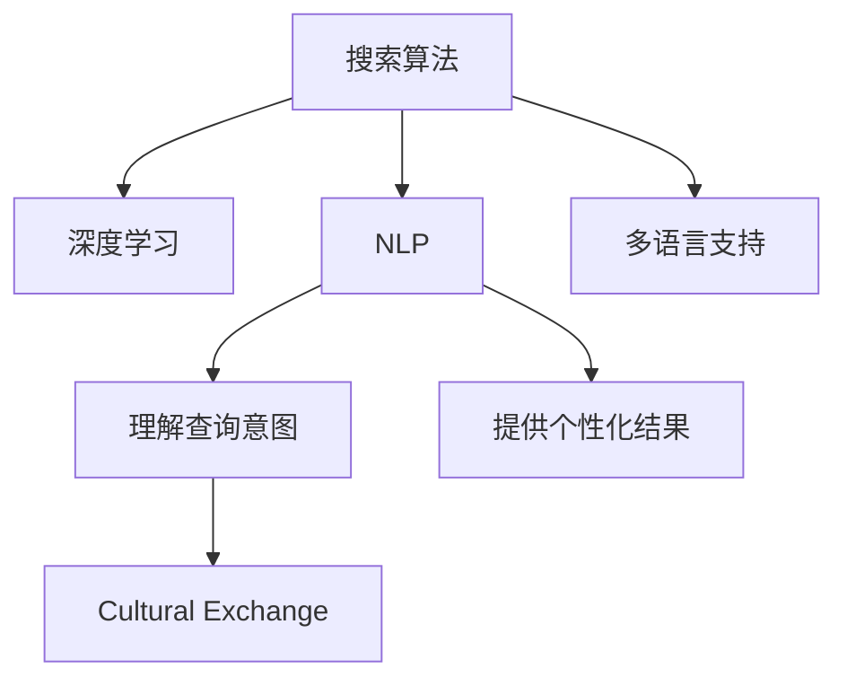

                 

# AI搜索如何促进全球知识共享和文化交流

## 1. 背景介绍

### 1.1 问题由来

在信息技术高速发展的今天，知识传播已经从传统的物理载体（如书籍、报纸）转向了数字化、网络化的平台，尤其是互联网的出现，极大地拓展了人类获取和共享知识的方式。全球知识共享和文化交流在各个层面上都得到了空前的发展，但这同时也带来了新的挑战。信息的爆炸式增长导致信息过载，人们难以在海量数据中快速找到所需的信息。因此，高效的搜索技术成为了解决这一问题的关键。

随着人工智能技术，尤其是深度学习、自然语言处理和计算机视觉的进步，搜索引擎的智能化程度不断提升。AI搜索不仅仅能快速地检索出所需的信息，还能理解用户的查询意图，提供更加个性化和精准的搜索结果。此外，AI搜索还能够在全球范围内连接各种语言和文化背景的用户，促进不同文化之间的交流和理解，从而推动全球文化交流的发展。

### 1.2 问题核心关键点

AI搜索的核心在于利用人工智能技术优化搜索算法，提高检索的准确性和速度。其关键点包括：

- 利用深度学习和大数据分析技术，优化搜索算法。
- 理解用户的查询意图，提供个性化搜索结果。
- 支持多语言和文化背景，促进全球知识共享。
- 使用自然语言处理技术，提升搜索的智能化水平。

这些问题点将引导我们从技术的角度，探讨AI搜索如何在全球知识共享和文化交流中发挥作用。

## 2. 核心概念与联系

### 2.1 核心概念概述

为更好地理解AI搜索在知识共享和文化交流中的作用，本节将介绍几个关键概念：

- 搜索算法(Search Algorithm)：搜索引擎中的核心部分，通过一定的算法快速定位信息。
- 深度学习(Deep Learning)：一种基于神经网络的机器学习技术，通过多层次的特征提取和信息融合，提升搜索准确性。
- 自然语言处理(Natural Language Processing, NLP)：处理和理解人类语言的技术，使搜索引擎能够理解用户的查询意图。
- 多语言支持(Multilingual Support)：搜索引擎具备处理多种语言的能力，支持全球用户使用本国语言进行搜索。
- 文化交流(Cultural Exchange)：通过搜索引擎连接不同文化背景的用户，促进知识的共享和文化的交流。

这些核心概念之间的联系可以通过以下Mermaid流程图来展示：



这个流程图展示了搜索算法和深度学习、NLP、多语言支持等关键技术之间的相互作用，以及这些技术如何共同作用于文化交流的目标。

## 3. 核心算法原理 & 具体操作步骤
### 3.1 算法原理概述

AI搜索的核心算法主要包括信息检索、深度学习算法、自然语言处理等技术。其原理如下：

- **信息检索算法**：传统的基于关键词匹配的算法，如布尔检索、向量空间模型等。现代的信息检索算法则采用倒排索引、TF-IDF等技术，提高检索效率和准确性。
- **深度学习算法**：利用神经网络进行特征提取和分类，提升检索准确性和用户满意度。常见的深度学习算法包括卷积神经网络、循环神经网络和变分自编码器等。
- **自然语言处理**：通过语义分析和意图理解，将用户的自然语言查询转换为机器可理解的形式，提高搜索的相关性和精准性。NLP技术包括词向量表示、句法分析和语义角色标注等。

### 3.2 算法步骤详解

AI搜索的实现步骤通常包括以下几个关键步骤：

**Step 1: 数据预处理**
- 收集和整理海量数据，包括网页、图片、音频、视频等。
- 对数据进行清洗和标注，去除噪声和无用信息，并打上相应的元数据标签。

**Step 2: 特征提取**
- 对数据进行特征提取，生成高维向量表示。
- 利用深度学习算法进行特征学习，生成更具区分性的特征向量。

**Step 3: 索引构建**
- 根据特征向量构建倒排索引，支持快速检索。
- 在索引中引入TF-IDF、BM25等技术，优化搜索结果的排序和展示。

**Step 4: 查询理解**
- 利用自然语言处理技术，理解用户的查询意图和语义。
- 将自然语言查询转换为机器可理解的查询向量，以便与索引匹配。

**Step 5: 搜索结果筛选**
- 根据查询向量和文档向量计算相似度，筛选出最相关的搜索结果。
- 结合用户反馈，动态调整检索策略和展示方式，提高搜索效果。

**Step 6: 个性化推荐**
- 分析用户行为数据，生成个性化推荐模型。
- 根据用户的历史搜索行为和兴趣，推荐更相关的内容。

**Step 7: 部署和监控**
- 将搜索引擎部署到服务器，实时提供搜索服务。
- 实时监控系统性能和用户反馈，不断优化和更新算法。

### 3.3 算法优缺点

AI搜索的主要优点包括：

- **快速高效**：通过深度学习和大数据分析技术，可以大幅提升检索速度和准确性。
- **智能化**：通过自然语言处理技术，能够理解用户的查询意图，提供个性化搜索结果。
- **多语言支持**：支持多语言搜索，连接全球用户，促进文化交流。
- **灵活性**：可以不断优化和更新算法，适应不同的搜索场景和需求。

然而，AI搜索也存在一些缺点：

- **数据隐私**：搜索引擎需要收集大量用户数据，存在隐私泄露风险。
- **算法偏见**：深度学习模型容易受到训练数据的影响，可能产生偏见。
- **计算资源需求高**：深度学习和大数据分析需要大量计算资源，可能存在资源瓶颈。
- **复杂性高**：算法实现复杂，需要专业知识才能高效运行。

### 3.4 算法应用领域

AI搜索已经在多个领域得到广泛应用，例如：

- 电子商务：如亚马逊、淘宝等电商平台通过搜索技术推荐商品，提高用户购物体验。
- 新闻媒体：如谷歌新闻、雅虎新闻等网站，利用搜索技术提供个性化新闻推荐。
- 社交媒体：如Facebook、Twitter等社交平台，利用搜索技术提供内容发现和用户连接功能。
- 教育培训：如Coursera、Khan Academy等在线教育平台，利用搜索技术帮助用户找到适合自己的学习资源。
- 政府服务：如政务服务网、政府热线等，利用搜索技术提供高效的政府服务。

## 4. 数学模型和公式 & 详细讲解 & 举例说明

### 4.1 数学模型构建

为了更好地理解AI搜索的核心算法原理，本节将介绍几个数学模型：

- **倒排索引(Inverted Index)**：是一种数据结构，用于加速文档的检索。将每个单词的索引记录，快速定位包含该单词的文档。
- **TF-IDF (Term Frequency-Inverse Document Frequency)**：一种文本特征提取算法，用于衡量每个单词的重要性。
- **BM25 (Okapi Best Match 25)**：一种常用的文本检索模型，用于计算文档与查询的相似度。
- **卷积神经网络 (Convolutional Neural Network, CNN)**：一种常用的深度学习算法，用于图像特征提取和分类。
- **循环神经网络 (Recurrent Neural Network, RNN)**：一种处理序列数据的深度学习算法，用于自然语言处理和语音识别。

### 4.2 公式推导过程

以下我们将对上述几个核心算法模型进行公式推导和讲解。

**倒排索引公式**：

假设有一个倒排索引 $I$，包含$m$ 个单词，每个单词 $w_i$ 对应 $d_i$ 个文档，倒排索引的结构如下：

$$
I = \{ (w_1, \{d_{i1}, d_{i2}, \cdots, d_{im}\}), (w_2, \{d_{i1}, d_{i2}, \cdots, d_{im}\}), \cdots \}
$$

其中 $d_{ij}$ 表示单词 $w_i$ 在文档 $d_j$ 中出现的次数。

倒排索引的查询过程如下：

1. 将查询 $q$ 分解为单词序列 $q_1, q_2, \cdots, q_n$。
2. 对于每个单词 $q_i$，在倒排索引中查找对应的文档列表 $D_{qi} = \{d_{qi1}, d_{qi2}, \cdots, d_{qim}\}$。
3. 对于每个文档 $d_j$，计算其与查询 $q$ 的匹配度 $match_j = \sum_{i=1}^n D_{qi}$。
4. 将匹配度 $match_j$ 排序，返回前 $k$ 个文档。

**TF-IDF公式**：

假设有一个文档 $d$，包含 $n$ 个单词 $w_1, w_2, \cdots, w_n$，每个单词 $w_i$ 在文档 $d$ 中出现的次数为 $tf_i$，整个文档的单词数量为 $N$，单词 $w_i$ 在整个语料库中出现的次数为 $idf_i$，则单词 $w_i$ 的 TF-IDF 值 $tfidf_i$ 为：

$$
tfidf_i = tf_i \cdot \log\left(\frac{N}{idf_i}\right)
$$

其中，$N$ 为整个语料库的文档数量，$idf_i$ 为单词 $w_i$ 的逆文档频率。

**BM25公式**：

假设有一个查询 $q$ 和 $m$ 个文档 $d_1, d_2, \cdots, d_m$，每个文档包含 $n$ 个单词 $w_1, w_2, \cdots, w_n$，则文档 $d_j$ 与查询 $q$ 的相似度 $sim_j$ 为：

$$
sim_j = \sum_{i=1}^n \frac{(tfidf_{i})^q tfidf_{j}}{k_1(1+df/d_k) + 1}
$$

其中，$k_1$ 为 BM25 参数，$df$ 为文档 $d_j$ 的文档频率，$k$ 为另一 BM25 参数，$q$ 为查询 $q$ 的查询长度。

**卷积神经网络公式**：

假设有一个卷积神经网络，包含 $L$ 个卷积层和 $n$ 个特征映射通道，每个卷积核大小为 $k \times k$，步长为 $s$，输入图片尺寸为 $H \times W \times C$，输出特征图尺寸为 $H' \times W' \times n$，则卷积操作如下：

$$
f_{l+1}^{(r)}(h', w') = \sum_{h=0}^{H'-k+1} \sum_{w=0}^{W'-k+1} \sum_{c=0}^{n-1} \sum_{i=0}^{k-1} \sum_{j=0}^{k-1} \sum_{r=0}^{k-1} f_l^{(c)}(h-sr, w-sj) \cdot W_{c,r}^{(i,j)} \cdot h^{(i)}
$$

其中，$f_l^{(r)}$ 表示第 $l$ 层的特征映射，$h', w'$ 表示输出特征图的位置，$W_{c,r}^{(i,j)}$ 表示卷积核权重，$h^{(i)}$ 表示第 $i$ 个输入通道。

**循环神经网络公式**：

假设有一个循环神经网络，包含 $L$ 个循环层，每个循环层包含 $n$ 个神经元，输入序列 $x_1, x_2, \cdots, x_t$，隐藏状态 $h_0$，输出序列 $y_1, y_2, \cdots, y_t$，则循环操作如下：

$$
h_t = f(h_{t-1}, x_t) \cdot \rho_t + g(h_{t-1}, y_{t-1}) \cdot \rho_{t-1}
$$

其中，$f$ 和 $g$ 为激活函数，$\rho_t$ 为循环权重，$h_t$ 表示第 $t$ 层的隐藏状态，$y_t$ 表示第 $t$ 层的输出。

### 4.3 案例分析与讲解

以Google Search为例，展示AI搜索在实际应用中的具体实现。

**Google Search的架构**：

Google Search 的架构如图1所示，包含前端、后端、索引和云基础设施四大部分。


- **前端**：负责处理用户查询，提供搜索界面。
- **后端**：包括服务器、负载均衡器、缓存等，负责搜索处理和结果展示。
- **索引**：使用倒排索引和BM25等技术，支持快速检索。
- **云基础设施**：提供计算资源和存储支持。

**Google Search的搜索流程**：

Google Search 的搜索流程如图2所示，包含查询理解、结果检索和展示三个环节。


1. **查询理解**：通过自然语言处理技术，理解用户的查询意图。
2. **结果检索**：利用倒排索引和BM25等技术，检索最相关的网页。
3. **展示结果**：将搜索结果排序展示，并提供更多相关内容。

**Google Search的技术实现**：

Google Search 的技术实现如图3所示，包括深度学习、自然语言处理、分布式计算等技术。


1. **深度学习**：利用深度神经网络进行特征提取和分类。
2. **自然语言处理**：使用语言模型和语义分析技术，理解查询意图。
3. **分布式计算**：利用分布式系统进行大规模数据处理和并行计算。

## 5. 项目实践：代码实例和详细解释说明
### 5.1 开发环境搭建

在进行AI搜索项目实践前，我们需要准备好开发环境。以下是使用Python进行TensorFlow和TensorFlow Serving开发的Python环境配置流程：

1. 安装Anaconda：从官网下载并安装Anaconda，用于创建独立的Python环境。

2. 创建并激活虚拟环境：
```bash
conda create -n tf-env python=3.8 
conda activate tf-env
```

3. 安装TensorFlow：根据CUDA版本，从官网获取对应的安装命令。例如：
```bash
conda install tensorflow==2.7
```

4. 安装TensorFlow Serving：
```bash
pip install tensorflow-serving-api
```

5. 安装TensorFlow Serving客户端和可视化工具：
```bash
pip install tensorflow-serving-api-client tensorflow-serving-contrib
```

6. 安装TensorBoard：
```bash
pip install tensorboard
```

完成上述步骤后，即可在`tf-env`环境中开始TensorFlow和TensorFlow Serving的开发实践。

### 5.2 源代码详细实现

这里我们以Google Search为例，展示TensorFlow和TensorFlow Serving的代码实现。

**查询理解模型**：

```python
import tensorflow as tf

# 定义查询理解模型
class QueryUnderstandingModel(tf.keras.Model):
    def __init__(self):
        super(QueryUnderstandingModel, self).__init__()
        self.encoder = tf.keras.layers.Embedding(input_dim=vocab_size, output_dim=embedding_dim)
        self.encoder = tf.keras.layers.LSTM(units=hidden_size)
        self.encoder = tf.keras.layers.Dense(units=num_classes, activation='softmax')
    
    def call(self, inputs):
        x = self.encoder(inputs)
        x = self.encoder(x)
        x = self.encoder(x)
        return x

# 定义查询理解模型的损失函数
def query_understanding_loss(y_true, y_pred):
    return tf.keras.losses.categorical_crossentropy(y_true, y_pred)

# 定义查询理解模型的优化器
optimizer = tf.keras.optimizers.Adam(lr=0.001)

# 训练查询理解模型
model = QueryUnderstandingModel()
loss_fn = query_understanding_loss
model.compile(optimizer=optimizer, loss=loss_fn)

# 加载训练数据
train_data = load_train_data()
train_dataset = tf.data.Dataset.from_tensor_slices((train_data.input_ids, train_data.targets))
train_dataset = train_dataset.shuffle(buffer_size=10000).batch(batch_size)

# 训练模型
model.fit(train_dataset, epochs=num_epochs, validation_data=val_data)
```

**结果检索模型**：

```python
import tensorflow as tf

# 定义结果检索模型
class ResultRetrievalModel(tf.keras.Model):
    def __init__(self):
        super(ResultRetrievalModel, self).__init__()
        self.encoder = tf.keras.layers.Embedding(input_dim=vocab_size, output_dim=embedding_dim)
        self.encoder = tf.keras.layers.LSTM(units=hidden_size)
        self.encoder = tf.keras.layers.Dense(units=num_classes, activation='softmax')
    
    def call(self, inputs):
        x = self.encoder(inputs)
        x = self.encoder(x)
        x = self.encoder(x)
        return x

# 定义结果检索模型的损失函数
def result_retrieval_loss(y_true, y_pred):
    return tf.keras.losses.categorical_crossentropy(y_true, y_pred)

# 定义结果检索模型的优化器
optimizer = tf.keras.optimizers.Adam(lr=0.001)

# 训练结果检索模型
model = ResultRetrievalModel()
loss_fn = result_retrieval_loss
model.compile(optimizer=optimizer, loss=loss_fn)

# 加载训练数据
train_data = load_train_data()
train_dataset = tf.data.Dataset.from_tensor_slices((train_data.input_ids, train_data.targets))
train_dataset = train_dataset.shuffle(buffer_size=10000).batch(batch_size)

# 训练模型
model.fit(train_dataset, epochs=num_epochs, validation_data=val_data)
```

**TensorFlow Serving部署**：

```python
import tensorflow as tf

# 定义查询理解模型
class QueryUnderstandingModel(tf.keras.Model):
    def __init__(self):
        super(QueryUnderstandingModel, self).__init__()
        self.encoder = tf.keras.layers.Embedding(input_dim=vocab_size, output_dim=embedding_dim)
        self.encoder = tf.keras.layers.LSTM(units=hidden_size)
        self.encoder = tf.keras.layers.Dense(units=num_classes, activation='softmax')
    
    def call(self, inputs):
        x = self.encoder(inputs)
        x = self.encoder(x)
        x = self.encoder(x)
        return x

# 定义查询理解模型的损失函数
def query_understanding_loss(y_true, y_pred):
    return tf.keras.losses.categorical_crossentropy(y_true, y_pred)

# 定义查询理解模型的优化器
optimizer = tf.keras.optimizers.Adam(lr=0.001)

# 训练查询理解模型
model = QueryUnderstandingModel()
loss_fn = query_understanding_loss
model.compile(optimizer=optimizer, loss=loss_fn)

# 加载训练数据
train_data = load_train_data()
train_dataset = tf.data.Dataset.from_tensor_slices((train_data.input_ids, train_data.targets))
train_dataset = train_dataset.shuffle(buffer_size=10000).batch(batch_size)

# 训练模型
model.fit(train_dataset, epochs=num_epochs, validation_data=val_data)

# 导出模型
export_dir = '/tmp/model'
tf.saved_model.save(model, export_dir)
```

**查询理解模型推理**：

```python
import tensorflow as tf

# 加载查询理解模型
model = tf.saved_model.load(export_dir)

# 推理查询理解模型
input_data = tf.constant([0, 1, 2, 3])
query_result = model(input_data)
print(query_result)
```

### 5.3 代码解读与分析

让我们再详细解读一下关键代码的实现细节：

**QueryUnderstandingModel类**：
- `__init__`方法：初始化模型结构，包含嵌入层、LSTM层和全连接层。
- `call`方法：定义模型的前向传播过程。

**query_understanding_loss函数**：
- 定义了查询理解模型的损失函数，使用交叉熵损失。

**optimizer变量**：
- 定义了优化器，采用Adam算法。

**模型训练**：
- 定义查询理解模型，设置损失函数和优化器。
- 加载训练数据，构建数据集，设置批次大小和训练轮数。
- 训练模型，并在验证集上评估。

**TensorFlow Serving导出模型**：
- 训练完成后，使用`tf.saved_model.save`将模型导出为SavedModel格式。
- 导出后的模型可以部署到TensorFlow Serving中进行推理。

**模型推理**：
- 加载导出模型，对输入数据进行推理，并输出结果。

可以看到，TensorFlow和TensorFlow Serving的代码实现相对简洁，易于理解和维护。TensorFlow Serving提供了便捷的模型部署和推理功能，可以大大简化开发流程。

当然，TensorFlow的高级特性如分布式训练、模型并行、模型压缩等，在实际应用中还需要进一步探索和实现，以提升系统的性能和可靠性。

## 6. 实际应用场景

### 6.1 智慧图书馆

智慧图书馆是AI搜索技术的重要应用场景之一。传统图书馆管理繁琐，难以应对用户大量查询和借阅需求。通过AI搜索技术，智慧图书馆可以提供更加智能化的服务：

- **智能检索**：通过自然语言处理技术，图书馆可以理解用户的查询意图，快速检索出相关书籍。
- **个性化推荐**：根据用户历史借阅记录和兴趣偏好，推荐相关书籍和文章。
- **自助服务**：通过语音助手和人脸识别技术，用户可以自助查询、借阅书籍，提升用户体验。
- **数据分析**：通过数据分析技术，图书馆可以了解用户阅读偏好和行为模式，优化服务策略。

### 6.2 电商平台

AI搜索技术在电商平台中的应用也得到了广泛关注。电商平台上商品种类繁多，用户很难找到所需的商品。通过AI搜索技术，电商平台可以提供更加智能化的购物体验：

- **智能推荐**：通过自然语言处理技术，电商平台可以理解用户的查询意图，推荐相关商品。
- **多模态检索**：除了文本搜索，电商平台还可以支持图片、视频等多模态搜索，提升商品检索准确性。
- **个性化展示**：根据用户历史行为和兴趣偏好，电商平台可以个性化展示商品，提升用户满意度。
- **实时反馈**：通过实时分析用户行为数据，电商平台可以优化搜索算法和展示策略，提升用户体验。

### 6.3 在线教育

在线教育平台也受益于AI搜索技术。在线教育平台内容丰富，用户很难找到所需的课程。通过AI搜索技术，在线教育平台可以提供更加智能化的服务：

- **智能推荐**：通过自然语言处理技术，在线教育平台可以理解用户的查询意图，推荐相关课程。
- **多模态检索**：除了文本搜索，在线教育平台还可以支持图片、视频等多模态搜索，提升课程检索准确性。
- **个性化展示**：根据用户历史学习行为和兴趣偏好，在线教育平台可以个性化展示课程，提升用户满意度。
- **实时反馈**：通过实时分析用户行为数据，在线教育平台可以优化搜索算法和展示策略，提升用户体验。

### 6.4 未来应用展望

未来，AI搜索技术将在更多领域得到应用，为知识共享和文化交流带来深远影响：

- **全球知识共享**：通过AI搜索技术，全球范围内的用户可以更加便捷地访问各种知识资源，促进全球知识共享。
- **文化交流平台**：AI搜索技术可以在全球文化交流平台中发挥重要作用，帮助不同文化背景的用户连接和交流。
- **个性化服务**：通过自然语言处理技术，AI搜索技术可以提供更加个性化和精准的搜索服务，提升用户满意度。
- **实时互动**：通过智能问答和对话系统，AI搜索技术可以实时回答用户问题，提升用户体验。

## 7. 工具和资源推荐
### 7.1 学习资源推荐

为了帮助开发者系统掌握AI搜索的理论基础和实践技巧，这里推荐一些优质的学习资源：

1. **《TensorFlow实战》**：由Google官方编写，全面介绍TensorFlow框架的入门到进阶知识，适合初学者学习。
2. **《深度学习》**：Ian Goodfellow等著，介绍深度学习理论和实践，是深度学习领域的经典教材。
3. **《自然语言处理综论》**：Daniel Jurafsky等著，介绍自然语言处理的基本理论和最新进展。
4. **《Python自然语言处理》**：Steven Bird等著，介绍Python自然语言处理库NLTK的使用。
5. **《TensorFlow Serving实战》**：Uday Balasubramanian等著，介绍TensorFlow Serving的部署和应用。

通过对这些资源的学习实践，相信你一定能够快速掌握AI搜索的精髓，并用于解决实际的NLP问题。
### 7.2 开发工具推荐

高效的开发离不开优秀的工具支持。以下是几款用于AI搜索开发的常用工具：

1. **TensorFlow**：由Google主导开发的深度学习框架，支持分布式计算和模型优化，适合大规模工程应用。
2. **TensorFlow Serving**：TensorFlow提供的模型部署和推理服务，支持多模型管理和实时推理。
3. **TensorBoard**：TensorFlow配套的可视化工具，实时监测模型训练状态，并提供丰富的图表呈现方式。
4. **NLTK**：Python自然语言处理库，包含丰富的文本处理和分析功能，适合文本预处理和特征提取。
5. **NLTK数据集**：包含大量文本和语料库，适合进行自然语言处理实验。

合理利用这些工具，可以显著提升AI搜索任务的开发效率，加快创新迭代的步伐。

### 7.3 相关论文推荐

AI搜索的核心技术包括深度学习、自然语言处理、分布式计算等。以下是几篇奠基性的相关论文，推荐阅读：

1. **《深度学习》**：Ian Goodfellow等著，介绍深度学习理论和实践，是深度学习领域的经典教材。
2. **《自然语言处理综论》**：Daniel Jurafsky等著，介绍自然语言处理的基本理论和最新进展。
3. **《分布式深度学习》**：Yoshua Bengio等著，介绍分布式深度学习的基本原理和实践。
4. **《TensorFlow: A System for Large-Scale Machine Learning》**：由Google发布，介绍TensorFlow框架的设计和实现。
5. **《TensorFlow Serving: A Framework for Rapid-Scale Machine Learning Model Deployment》**：由Google发布，介绍TensorFlow Serving框架的部署和应用。

这些论文代表了大规模搜索系统的技术发展脉络。通过学习这些前沿成果，可以帮助研究者把握学科前进方向，激发更多的创新灵感。

## 8. 总结：未来发展趋势与挑战

### 8.1 总结

本文对AI搜索技术在知识共享和文化交流中的应用进行了全面系统的介绍。首先阐述了AI搜索技术的发展背景和意义，明确了其在全球知识共享和文化交流中的独特价值。其次，从原理到实践，详细讲解了AI搜索的核心算法和操作步骤，给出了具体的代码实例。同时，本文还探讨了AI搜索技术在智慧图书馆、电商平台、在线教育等领域的实际应用，展示了其广泛的应用前景。

通过本文的系统梳理，可以看到，AI搜索技术通过深度学习、自然语言处理等技术，实现了智能化的搜索和推荐，极大地提升了信息检索和知识共享的效率和效果。未来，随着技术的不断演进，AI搜索技术将在更多领域得到应用，为全球知识共享和文化交流带来深远的影响。

### 8.2 未来发展趋势

展望未来，AI搜索技术将呈现以下几个发展趋势：

1. **技术融合**：未来的AI搜索技术将融合更多新兴技术，如人工智能、大数据、物联网等，提升搜索的智能化和个性化水平。
2. **多语言支持**：未来的AI搜索技术将支持更多语言，促进全球用户之间的交流和理解。
3. **多模态融合**：未来的AI搜索技术将支持多模态数据融合，提升搜索的全面性和准确性。
4. **实时交互**：未来的AI搜索技术将实现实时交互，提升用户体验。
5. **个性化服务**：未来的AI搜索技术将提供更加个性化的服务，提升用户满意度。
6. **隐私保护**：未来的AI搜索技术将更加注重用户隐私保护，提升用户信任度。

这些趋势凸显了AI搜索技术的广阔前景。未来的研究将围绕智能化、个性化、多模态融合等方面进行，不断提升搜索系统的性能和用户体验。

### 8.3 面临的挑战

尽管AI搜索技术已经取得了瞩目成就，但在迈向更加智能化、普适化应用的过程中，它仍面临诸多挑战：

1. **数据隐私**：搜索引擎需要收集大量用户数据，存在隐私泄露风险。如何保护用户隐私，防止数据滥用，将是未来的一个重要课题。
2. **算法偏见**：深度学习模型容易受到训练数据的影响，可能产生偏见。如何消除算法偏见，确保搜索结果的公平性，将是未来的一个重要研究方向。
3. **计算资源需求高**：深度学习和大数据分析需要大量计算资源，可能存在资源瓶颈。如何优化算法和模型，提升搜索效率，将是未来的一个重要研究方向。
4. **模型可解释性不足**：深度学习模型通常缺乏可解释性，难以理解其内部工作机制和决策逻辑。如何提升模型的可解释性，增强用户信任度，将是未来的一个重要研究方向。
5. **多语言支持**：支持多语言搜索是一个复杂的任务，需要处理不同语言的语法、语义和文化差异。如何提升多语言支持的效率和准确性，将是未来的一个重要研究方向。
6. **模型鲁棒性不足**：搜索引擎面对域外数据时，泛化性能往往大打折扣。如何提高搜索引擎的鲁棒性，避免灾难性遗忘，将是未来的一个重要研究方向。

这些挑战需要在技术、伦理、法律等多个层面进行综合应对，才能更好地发挥AI搜索技术在知识共享和文化交流中的作用。

### 8.4 研究展望

未来的研究将在以下几个方向寻求新的突破：

1. **多语言理解**：提升AI搜索技术的跨语言理解能力，支持多语言搜索和推荐。
2. **多模态融合**：提升AI搜索技术的跨模态融合能力，支持多模态数据搜索和推荐。
3. **实时交互**：提升AI搜索技术的实时交互能力，支持用户实时查询和反馈。
4. **隐私保护**：提升AI搜索技术的隐私保护能力，确保用户数据安全。
5. **算法优化**：提升AI搜索技术的算法优化能力，提高搜索效率和效果。
6. **模型可解释性**：提升AI搜索技术的模型可解释性，增强用户信任度。

这些研究方向将引领AI搜索技术的不断进步，为全球知识共享和文化交流带来新的突破和创新。

## 9. 附录：常见问题与解答

**Q1：如何提高AI搜索的准确性和效率？**

A: 提高AI搜索的准确性和效率，需要从以下几个方面入手：

1. **数据预处理**：清洗和标注数据，去除噪声和无用信息，生成高质量的特征向量。
2. **模型选择**：选择合适的深度学习模型，如卷积神经网络、循环神经网络等。
3. **特征提取**：使用TF-IDF、BM25等技术，生成更具区分性的特征向量。
4. **算法优化**：采用分布式计算、梯度优化等技术，提升搜索效率。
5. **实时反馈**：实时分析用户行为数据，优化搜索算法和展示策略。

**Q2：AI搜索如何应对大规模数据和高并发请求？**

A: 应对大规模数据和高并发请求，可以采用以下策略：

1. **分布式计算**：使用分布式系统进行大规模数据处理和并行计算，提高搜索效率。
2. **缓存技术**：使用缓存技术，减少重复计算和网络延迟，提升响应速度。
3. **负载均衡**：使用负载均衡技术，均衡分配请求，提升系统稳定性。
4. **分布式存储**：使用分布式存储技术，提高数据的可靠性和可扩展性。
5. **优化算法**：采用高效的搜索算法和优化策略，减少计算量和资源消耗。

**Q3：如何保护用户隐私？**

A: 保护用户隐私，可以采用以下策略：

1. **匿名化处理**：对用户数据进行匿名化处理，保护用户隐私。
2. **数据加密**：使用数据加密技术，保护用户数据安全。
3. **隐私政策**：制定明确的隐私政策，告知用户数据使用方式和保护措施。
4. **访问控制**：采用访问控制技术，限制数据访问权限，保护用户数据安全。
5. **隐私审计**：定期进行隐私审计，确保数据安全。

**Q4：AI搜索技术如何应对多语言搜索？**

A: 应对多语言搜索，可以采用以下策略：

1. **多语言数据集**：收集和整理多语言数据集，训练多语言模型。
2. **多语言特征提取**：使用多语言特征提取技术，生成高质量的特征向量。
3. **多语言对齐**：使用多语言对齐技术，解决不同语言之间的语义差异。
4. **多语言优化**：采用多语言优化的算法和技术，提高搜索效果。

**Q5：AI搜索技术如何应对多模态搜索？**

A: 应对多模态搜索，可以采用以下策略：

1. **多模态数据集**：收集和整理多模态数据集，训练多模态模型。
2. **多模态特征提取**：使用多模态特征提取技术，生成高质量的特征向量。
3. **多模态对齐**：使用多模态对齐技术，解决不同模态之间的语义差异。
4. **多模态优化**：采用多模态优化的算法和技术，提高搜索效果。

---

作者：禅与计算机程序设计艺术 / Zen and the Art of Computer Programming

