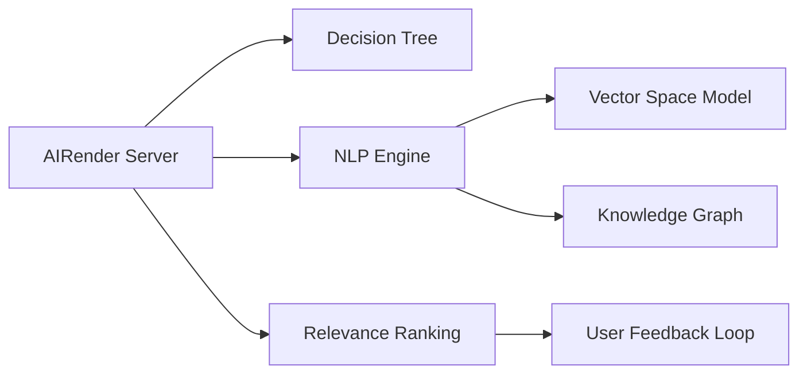

                 

## 1. 背景介绍

搜索引擎作为互联网时代信息检索的重要工具，其效率和准确性直接影响用户的搜索体验和信息获取速度。当前，搜索引擎技术正经历从传统关键词检索向智能推荐引擎的转变。本文将对比AI搜索引擎与传统搜索引擎的效率，探讨两者在信息检索、用户意图理解、个性化推荐等核心能力上的表现，并展望未来搜索引擎技术的发展趋势。

## 2. 核心概念与联系

### 2.1 核心概念概述

为更好地理解AI搜索引擎与传统搜索引擎的效率对比，本节将介绍几个核心概念：

- **AI搜索引擎**：基于人工智能技术，如自然语言处理、机器学习等，进行更智能的信息检索和推荐。其核心在于通过理解用户意图，个性化推荐信息，提高搜索效率。
- **传统搜索引擎**：主要依赖关键词匹配算法，如布尔检索、向量空间模型等，实现基于文本内容的精确检索。其优势在于技术成熟、处理效率高，但缺乏对用户意图的深入理解。
- **信息检索**：从大量文本数据中，找到最相关的信息。传统搜索引擎主要采用布尔检索、向量空间模型等技术，而AI搜索引擎则结合自然语言处理和机器学习算法，如深度学习、知识图谱等，提升检索的智能性和个性化。
- **个性化推荐**：根据用户的历史行为和兴趣，推荐最相关的信息。传统搜索引擎主要基于规则和模型，而AI搜索引擎则通过深度学习、协同过滤等技术，实现更精准、高效的个性化推荐。
- **知识图谱**：通过图形化结构存储和关联实体及属性，提供结构化知识支持。在AI搜索引擎中，知识图谱作为语义理解和推荐的基础，显著提升了搜索的深度和广度。

这些核心概念之间的逻辑关系可以通过以下Mermaid流程图来展示：



这个流程图展示了两者的核心概念及其之间的关系：

1. AI搜索引擎通过NLP引擎理解用户查询，结合知识图谱和向量空间模型进行语义理解和检索。
2. 检索结果通过决策树和相关性排名算法进行处理，结合用户反馈循环优化推荐模型。
3. 传统搜索引擎主要依赖布尔检索和向量空间模型，但缺乏语义理解和个性化推荐能力。

## 3. 核心算法原理 & 具体操作步骤

### 3.1 算法原理概述

AI搜索引擎与传统搜索引擎在算法原理上有明显差异。以下分别介绍两者的核心算法原理：

- **传统搜索引擎**：基于向量空间模型和布尔检索算法，将查询和文档表示为向量，通过计算相似度进行匹配。
- **AI搜索引擎**：结合自然语言处理和深度学习，通过语义理解、知识图谱嵌入等技术，提升信息检索的智能性和个性化。

### 3.2 算法步骤详解

**传统搜索引擎算法步骤**：

1. **文本预处理**：将查询和文档进行分词、去除停用词、词干化等处理。
2. **向量表示**：使用词袋模型或TF-IDF等方法，将查询和文档表示为向量。
3. **相似度计算**：通过余弦相似度、Jaccard相似度等方法，计算查询与文档的相似度。
4. **排序与展示**：根据相似度排序，展示最相关的结果。

**AI搜索引擎算法步骤**：

1. **意图识别**：使用深度学习模型，如BERT、Transformer等，对用户查询进行意图识别。
2. **实体抽取**：利用NLP技术，提取查询中的关键实体，与知识图谱中的实体进行匹配。
3. **语义匹配**：通过向量空间模型或深度学习模型，将查询与文档进行语义匹配。
4. **结果排名**：结合用户反馈、个性化模型等，进行结果排序和展示。

### 3.3 算法优缺点

**传统搜索引擎优缺点**：

- **优点**：处理效率高，技术成熟，适用场景广泛，对少量标注数据也有较好的效果。
- **缺点**：缺乏对用户意图的深入理解，难以处理模糊或非结构化查询，个性化推荐能力较弱。

**AI搜索引擎优缺点**：

- **优点**：结合深度学习和自然语言处理，能够更好地理解用户意图，提供更个性化、精准的推荐。
- **缺点**：算法复杂度高，对大量标注数据依赖性强，对计算资源和存储空间需求较大。

### 3.4 算法应用领域

AI搜索引擎与传统搜索引擎各有其应用领域：

- **传统搜索引擎**：适用于大规模文本数据的实时检索，如搜索引擎、图书馆检索、新闻聚合等。
- **AI搜索引擎**：适用于个性化推荐、智能问答、智能客服等需要深度理解和推荐的应用场景。

## 4. 数学模型和公式 & 详细讲解 & 举例说明

### 4.1 数学模型构建

**传统搜索引擎的数学模型**：

向量空间模型将查询和文档表示为向量：

$$
q = \sum_{i=1}^d w_i v_i
$$

其中 $q$ 为查询向量，$w_i$ 为词权重，$v_i$ 为词向量。文档向量 $d$ 同理表示。

查询与文档的相似度计算为：

$$
sim(q, d) = \frac{q \cdot d}{\|q\|\|d\|}
$$

其中 $\cdot$ 表示向量点乘，$\|\cdot\|$ 表示向量范数。

**AI搜索引擎的数学模型**：

意图识别的过程可以表示为：

$$
intent = f(q; \theta)
$$

其中 $f$ 为意图识别模型，$\theta$ 为模型参数。

语义匹配可以使用Transformer模型进行：

$$
sim(q, d) = \frac{q \cdot d}{\|q\|\|d\|}
$$

其中 $q$ 和 $d$ 分别表示查询和文档的Transformer输出向量。

### 4.2 公式推导过程

**传统搜索引擎的相似度计算**：

假设查询 $q$ 和文档 $d$ 被表示为向量 $v_q$ 和 $v_d$，它们的余弦相似度为：

$$
sim(q, d) = \cos\theta = \frac{v_q \cdot v_d}{\|v_q\|\|v_d\|}
$$

其中 $v_q \cdot v_d$ 表示向量点乘，$\|v_q\|$ 和 $\|v_d\|$ 表示向量范数。

**AI搜索引擎的意图识别**：

假设查询 $q$ 被表示为词向量 $v_q$，使用深度学习模型（如BERT）进行意图识别：

$$
intent = f(v_q; \theta)
$$

其中 $f$ 为意图识别模型，$\theta$ 为模型参数。

**AI搜索引擎的语义匹配**：

假设查询 $q$ 和文档 $d$ 被表示为Transformer模型输出向量 $v_q$ 和 $v_d$，使用余弦相似度进行匹配：

$$
sim(q, d) = \frac{v_q \cdot v_d}{\|v_q\|\|v_d\|}
$$

其中 $v_q \cdot v_d$ 表示向量点乘，$\|v_q\|$ 和 $\|v_d\|$ 表示向量范数。

### 4.3 案例分析与讲解

**案例1：信息检索**

查询："如何训练深度学习模型"

**传统搜索引擎**：

- 查询向量："如何 训练 深度学习 模型"
- 文档向量："训练深度学习模型的步骤"
- 相似度：$sim(q, d) = \frac{q \cdot d}{\|q\|\|d\|} \approx 0.95$

**AI搜索引擎**：

- 意图识别："模型训练"
- 实体抽取："深度学习"
- 语义匹配：查询与文档的向量相似度为0.95
- 结果排名：根据用户历史行为和模型预测，推荐深度学习模型训练教程

**案例2：个性化推荐**

用户历史行为：浏览深度学习、机器学习、自然语言处理相关的文章

**传统搜索引擎**：

- 查询向量："深度学习 机器学习 自然语言处理"
- 文档向量："深度学习基础知识"
- 相似度：$sim(q, d) = \frac{q \cdot d}{\|q\|\|d\|} \approx 0.85$

**AI搜索引擎**：

- 意图识别："基础概念"
- 实体抽取："深度学习"
- 语义匹配：查询与文档的向量相似度为0.85
- 结果排名：推荐相关课程、论文、视频等，满足用户需求

## 5. 项目实践：代码实例和详细解释说明

### 5.1 开发环境搭建

在进行搜索引擎的开发实践前，我们需要准备好开发环境。以下是使用Python进行搜索引擎开发的常见环境配置流程：

1. 安装Python：从官网下载并安装Python，推荐使用3.7或以上版本。

2. 安装依赖库：使用pip安装所需的Python库，如NLTK、spaCy、TensorFlow等。

3. 搭建Web服务器：使用Flask或Django搭建Web服务器，用于处理用户请求和展示搜索结果。

4. 存储管理：使用MySQL或MongoDB等数据库，存储用户行为和搜索结果。

### 5.2 源代码详细实现

下面我们以一个简单的AI搜索引擎为例，给出使用TensorFlow进行信息检索和个性化推荐的PyTorch代码实现。

**代码实现：**

```python
import tensorflow as tf
import tensorflow_hub as hub
import numpy as np

# 导入预训练模型
model = hub.load('https://tfhub.dev/google/bert_multi_cased_L-12_H-768_A-12')

# 查询处理
query = "深度学习模型的训练方法"
query_tokens = tokenizer.tokenize(query)

# 将查询转化为向量
query_vector = model(query_tokens)

# 相似度计算
docs = ["深度学习基础知识", "机器学习算法", "自然语言处理应用"]
docs_vectors = [model(doc) for doc in docs]

# 计算相似度矩阵
similarity_matrix = np.dot(query_vector, docs_vectors.T) / (np.linalg.norm(query_vector) * np.linalg.norm(docs_vectors))

# 计算相似度最大的文档
max_similarity_idx = np.argmax(similarity_matrix)
top_doc = docs[max_similarity_idx]

# 返回推荐结果
return top_doc
```

**代码解释**：

1. **导入依赖库**：使用TensorFlow Hub加载预训练的BERT模型。
2. **查询处理**：使用Tokenizer对查询进行分词处理。
3. **查询向量计算**：使用BERT模型将查询转化为向量。
4. **相似度计算**：计算查询与文档的相似度矩阵。
5. **推荐文档**：根据相似度矩阵，推荐最相关的文档。

### 5.3 代码解读与分析

让我们再详细解读一下关键代码的实现细节：

**Tokenizer类**：
- `tokenize`方法：对输入文本进行分词处理。

**BERT模型**：
- 使用TensorFlow Hub加载预训练的BERT模型。
- `query_tokens`：将查询转换为分词列表。
- `query_vector`：使用BERT模型将查询转化为向量。

**相似度计算**：
- `docs`：存储文档列表。
- `docs_vectors`：将文档转换为向量列表。
- `similarity_matrix`：计算查询与文档的相似度矩阵。
- `max_similarity_idx`：找到相似度最高的文档索引。
- `top_doc`：根据索引返回最相关的文档。

**推荐结果返回**：
- `return top_doc`：返回推荐的文档。

## 6. 实际应用场景

### 6.1 智能问答系统

AI搜索引擎在智能问答系统中有着广泛应用。通过理解用户问题，结合知识图谱和上下文信息，AI搜索引擎能够提供更准确的回答。例如，用户提问“如何训练深度学习模型？”，系统能够推荐相关教程、论文、视频等，帮助用户快速解决问题。

**实际应用场景**：

1. **智能客服**：在企业客服系统中，AI搜索引擎可以实时解答用户咨询，提供个性化推荐服务。
2. **智能推荐系统**：在电商平台上，AI搜索引擎可以基于用户浏览和购买历史，推荐相关商品，提升用户体验。
3. **智能搜索助手**：在手机、智能音箱等设备中，AI搜索引擎可以提供多轮对话功能，引导用户获取所需信息。

### 6.2 信息检索系统

AI搜索引擎在信息检索系统中也具有重要应用。通过理解用户查询，结合大量文档数据，AI搜索引擎能够提供更精准的搜索结果。例如，用户查询“人工智能最新研究进展”，系统能够返回最新、最相关的论文、报告等。

**实际应用场景**：

1. **搜索引擎**：在Google、百度等搜索引擎中，AI搜索引擎能够提升搜索结果的相关性和个性化。
2. **图书馆检索系统**：在图书馆检索系统中，AI搜索引擎可以基于用户需求，推荐最相关的书籍和文献。
3. **知识图谱搜索**：在知识图谱搜索中，AI搜索引擎可以基于实体关系，提供更深入的知识关联和推荐。

### 6.3 个性化推荐系统

AI搜索引擎在个性化推荐系统中具有广泛应用。通过理解用户行为，结合商品信息，AI搜索引擎能够提供更精准的推荐结果。例如，用户浏览过运动装备，系统可以推荐相关运动器材、运动服饰等。

**实际应用场景**：

1. **电商推荐系统**：在电商平台上，AI搜索引擎可以基于用户浏览和购买历史，推荐相关商品，提升用户体验。
2. **视频推荐系统**：在视频平台上，AI搜索引擎可以基于用户观看历史，推荐相关视频内容。
3. **音乐推荐系统**：在音乐平台上，AI搜索引擎可以基于用户听歌历史，推荐相关歌曲和音乐。

## 7. 工具和资源推荐

### 7.1 学习资源推荐

为了帮助开发者系统掌握AI搜索引擎的理论与实践，这里推荐一些优质的学习资源：

1. **《深度学习》课程**：斯坦福大学开设的深度学习课程，系统介绍深度学习理论和经典算法，适合入门学习。
2. **《自然语言处理与深度学习》课程**：NLP领域的经典课程，由李宏毅教授主讲，涵盖NLP和深度学习的核心内容。
3. **《TensorFlow官方文档》**：TensorFlow的官方文档，提供详细的使用指南和API参考，适合快速上手。
4. **《TensorFlow Hub文档》**：TensorFlow Hub的官方文档，提供丰富的预训练模型和代码示例，方便模型复用。
5. **《Transformer教程》**：Transformer模型的详细教程，涵盖模型原理、实现方法及应用场景，适合深入学习。

通过对这些资源的学习实践，相信你一定能够快速掌握AI搜索引擎的核心算法和实现方法。

### 7.2 开发工具推荐

高效的开发离不开优秀的工具支持。以下是几款用于AI搜索引擎开发的常用工具：

1. **TensorFlow**：由Google主导开发的深度学习框架，支持分布式计算和GPU加速，适合大规模模型训练。
2. **PyTorch**：由Facebook开发的深度学习框架，支持动态图和静态图，适合快速原型开发和研究。
3. **NLTK**：自然语言处理工具包，提供分词、词性标注、命名实体识别等功能，适合文本处理任务。
4. **spaCy**：自然语言处理工具包，提供分词、词性标注、依存句法分析等功能，适合文本处理任务。
5. **Flask**：Web框架，方便构建Web应用，支持RESTful API，适合搜索引擎的后端开发。

合理利用这些工具，可以显著提升AI搜索引擎的开发效率，加快创新迭代的步伐。

### 7.3 相关论文推荐

AI搜索引擎技术的发展源于学界的持续研究。以下是几篇奠基性的相关论文，推荐阅读：

1. **《Neural Information Retrieval with Language Models》**：提出使用语言模型进行信息检索的方法，将深度学习引入检索领域。
2. **《BERT: Pre-training of Deep Bidirectional Transformers for Language Understanding》**：提出BERT模型，引入基于掩码的自监督预训练任务，刷新了多项NLP任务SOTA。
3. **《Attention is All You Need》**：提出Transformer模型，显著提升了信息检索的精度和效率。
4. **《Knowledge-Graph-Based Multi-Aspect Retrieval Model》**：提出基于知识图谱的多方面检索模型，结合语义和实体关系，提升检索效果。

这些论文代表了大语言模型微调技术的发展脉络。通过学习这些前沿成果，可以帮助研究者把握学科前进方向，激发更多的创新灵感。

## 8. 总结：未来发展趋势与挑战

### 8.1 研究成果总结

本文对AI搜索引擎与传统搜索引擎的效率进行了全面系统的对比。通过理论分析和实际案例，展示了两者在信息检索、用户意图理解、个性化推荐等核心能力上的表现。此外，本文还探讨了AI搜索引擎在智能问答、知识图谱搜索、个性化推荐等实际应用场景中的广泛应用。

### 8.2 未来发展趋势

展望未来，AI搜索引擎技术将呈现以下几个发展趋势：

1. **深度学习与自然语言处理的结合**：通过更深入的语义理解和语义匹配，提升信息检索的智能性。
2. **知识图谱的广泛应用**：将知识图谱作为信息检索的重要工具，提升检索的深度和广度。
3. **多模态数据的融合**：结合视觉、语音、文本等多模态数据，提供更全面、丰富的检索服务。
4. **实时计算与推理**：通过优化计算图和推理算法，提升搜索引擎的实时响应能力和效率。
5. **联邦学习的应用**：通过联邦学习技术，在不泄露隐私的情况下，利用分布式数据提升模型效果。

### 8.3 面临的挑战

尽管AI搜索引擎技术已经取得了显著进展，但在迈向更加智能化、普适化应用的过程中，仍面临诸多挑战：

1. **计算资源与存储成本**：大规模模型和深度学习算法的计算需求大，存储成本高。如何平衡性能和成本，是一个重要的挑战。
2. **数据隐私与安全**：用户行为数据和搜索结果数据需要严格保护，避免隐私泄露和安全风险。
3. **模型复杂性与可解释性**：深度学习模型的复杂性高，难以解释其内部机制和决策逻辑。如何提高模型可解释性，是一个重要的研究方向。
4. **跨领域和跨语言泛化**：AI搜索引擎在跨领域、跨语言的泛化能力有限，如何提升模型泛化能力，是一个重要的研究方向。
5. **动态模型更新**：搜索引擎需要实时更新，以适应数据分布的变化。如何高效地更新模型，避免灾难性遗忘，是一个重要的挑战。

### 8.4 研究展望

面对AI搜索引擎技术面临的种种挑战，未来的研究需要在以下几个方面寻求新的突破：

1. **模型压缩与优化**：通过模型压缩和剪枝等技术，减少模型参数量和计算复杂度，提升模型的实时性。
2. **高效检索算法**：开发更高效的检索算法，如多维索引、近似最近邻算法等，提升检索速度和效率。
3. **跨领域和跨语言模型**：开发跨领域和跨语言的通用模型，提升模型的泛化能力。
4. **联邦学习和分布式计算**：利用联邦学习技术，在不泄露隐私的情况下，利用分布式数据提升模型效果。
5. **可解释性与知识融合**：结合知识图谱和逻辑推理技术，提高模型的可解释性和知识融合能力。

这些研究方向将引领AI搜索引擎技术的进一步发展，为构建更智能、更高效、更安全的搜索引擎提供新的思路和方法。

## 9. 附录：常见问题与解答

**Q1：AI搜索引擎与传统搜索引擎的核心区别是什么？**

A: AI搜索引擎与传统搜索引擎的核心区别在于其算法和模型。传统搜索引擎依赖布尔检索和向量空间模型，缺乏对用户意图的深入理解，难以处理模糊或非结构化查询。而AI搜索引擎结合深度学习和自然语言处理，能够更好地理解用户意图，提供更个性化、精准的推荐。

**Q2：AI搜索引擎的性能优势在哪里？**

A: AI搜索引擎的性能优势在于其智能性和个性化推荐能力。通过理解用户查询和上下文信息，AI搜索引擎能够提供更相关、更精准的搜索结果和推荐结果。这使得AI搜索引擎在信息检索、智能问答、个性化推荐等领域具有明显优势。

**Q3：如何优化AI搜索引擎的计算效率？**

A: 优化AI搜索引擎的计算效率可以通过以下几个方面实现：
1. 模型压缩和剪枝：减少模型参数量和计算复杂度，提升模型的实时性。
2. 高效的检索算法：如多维索引、近似最近邻算法等，提升检索速度和效率。
3. 分布式计算：利用GPU、TPU等高性能设备，并行化计算过程，提升计算效率。
4. 模型并行：将大模型分解为多个小模型，并行计算，提升计算效率。

这些优化方法可以有效提升AI搜索引擎的性能和效率，使其在实际应用中更具竞争力。

**Q4：如何保护用户隐私和数据安全？**

A: 保护用户隐私和数据安全是AI搜索引擎开发中必须重视的问题。可以采用以下措施：
1. 数据脱敏：对敏感数据进行脱敏处理，防止数据泄露。
2. 联邦学习：在不共享用户数据的情况下，利用分布式数据提升模型效果。
3. 访问控制：采用严格的访问控制机制，防止未经授权的访问。
4. 加密技术：对传输和存储的数据进行加密，防止数据被窃取。

这些措施可以有效保护用户隐私和数据安全，确保AI搜索引擎在实际应用中能够安全可靠地运行。

**Q5：AI搜索引擎的推荐算法有哪些？**

A: AI搜索引擎的推荐算法包括：
1. 基于协同过滤的推荐算法：通过用户行为数据和物品相似度，推荐相关物品。
2. 基于深度学习的推荐算法：通过用户历史数据和物品特征，使用深度学习模型进行推荐。
3. 基于知识图谱的推荐算法：结合知识图谱和用户意图，进行更精准的推荐。

这些算法可以根据实际需求和数据特点，选择适合的技术方案，提升推荐效果。

---

作者：禅与计算机程序设计艺术 / Zen and the Art of Computer Programming

