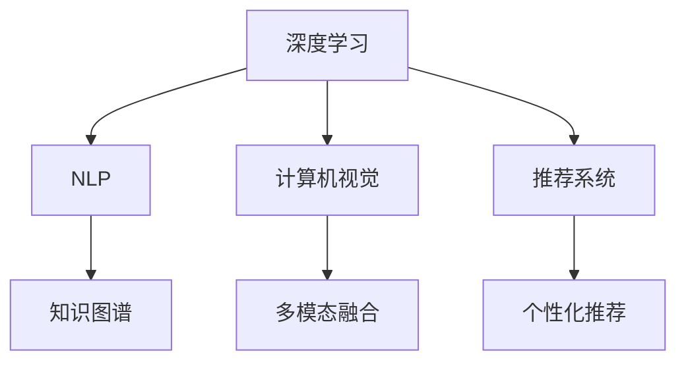

                 

# AI搜索引擎在科研领域的潜力

## 1. 背景介绍

### 1.1 问题由来

在当前信息爆炸的时代，科研人员面临海量研究文献和数据，如何高效地检索和利用这些信息成为科研工作的重大挑战。传统搜索引擎如Google Scholar、PubMed等在检索特定主题文献时虽能提供一定程度的帮助，但仍然存在以下问题：

- **效率低下**：在检索海量文献时，用户往往需要手动筛选，难以快速定位到相关文献。
- **覆盖面有限**：主要依赖文献摘要和标题，缺乏对文章内容全文的理解。
- **主观性强**：搜索结果排序受用户设定和算法限制，缺乏客观性和可解释性。

### 1.2 问题核心关键点

AI搜索引擎通过深度学习技术，可以有效解决传统搜索引擎的不足，在科研领域展现巨大的潜力。主要体现在以下几个方面：

1. **全文检索**：利用自然语言处理(NLP)技术，AI搜索引擎能够理解文章内容，进行全文检索，不仅限于标题和摘要。
2. **智能排序**：借助机器学习算法，AI搜索引擎能够根据文章内容、引用次数、发表时间等综合因素进行智能排序，提升搜索结果的准确性和相关性。
3. **多模态融合**：结合图像、视频、代码等多模态数据，AI搜索引擎能够提供更加丰富的搜索结果，支持科研人员的综合学习。
4. **个性化推荐**：根据科研人员的历史行为和偏好，AI搜索引擎能够个性化推荐相关文献，加速科研进程。

## 2. 核心概念与联系

### 2.1 核心概念概述

为更好地理解AI搜索引擎在科研领域的应用，本节将介绍几个关键概念：

- **深度学习(DL)**：一种模仿人脑神经网络结构，通过数据驱动的学习方式进行模型训练的技术。深度学习在大规模数据分析和处理方面表现出色。
- **自然语言处理(NLP)**：涉及计算机如何处理和理解人类语言的技术。包括分词、词性标注、句法分析、语义理解等。
- **计算机视觉(CV)**：利用计算机技术模拟人眼处理图像和视频的技术。主要包括图像识别、目标检测、图像生成等。
- **知识图谱(KG)**：用图结构存储和表示实体及其关系的知识库。知识图谱可以用于语义搜索和知识推理。
- **推荐系统(Recommendation System)**：利用用户行为数据和机器学习算法，为用户推荐感兴趣的内容的系统。在科研领域，推荐系统可以推荐相关文献和研究工具。

这些核心概念之间的逻辑关系可以通过以下Mermaid流程图来展示：



这个流程图展示了深度学习、NLP、计算机视觉、知识图谱和推荐系统之间的联系，以及它们在AI搜索引擎中的集成应用。

## 3. 核心算法原理 & 具体操作步骤
### 3.1 算法原理概述

AI搜索引擎通过深度学习模型，对用户查询进行理解和检索，然后结合多模态融合和推荐系统，提供个性化的搜索结果。其核心算法原理如下：

1. **语义理解与检索**：利用NLP技术，将用户查询转换为语义表示，然后与文献内容进行匹配，找到相关文献。
2. **内容分析与排序**：对检索到的文献进行内容分析，如摘要理解、关键词提取等，然后根据机器学习算法对文献进行排序。
3. **多模态融合**：结合图像、视频、代码等多模态数据，丰富搜索结果，提供视觉和代码示例，增强用户体验。
4. **个性化推荐**：利用用户行为数据，推荐与用户偏好相关的内容，提高用户满意度。

### 3.2 算法步骤详解

基于深度学习的AI搜索引擎，其操作步骤包括：

**Step 1: 数据预处理与特征工程**
- 收集科研文献的标题、摘要、引用次数、发表时间等多维度信息，构建数据集。
- 进行数据清洗和标注，如去除重复文献、去除无关信息等。
- 设计特征提取方法，将文本数据转化为模型可以接受的向量形式，如TF-IDF、Word2Vec等。

**Step 2: 模型训练与优化**
- 选择适当的深度学习模型，如BERT、GPT等，进行预训练和微调。
- 利用标注数据集训练模型，优化模型参数，提高检索和排序的准确性。
- 使用交叉验证等方法，评估模型性能，调整超参数。

**Step 3: 多模态融合**
- 对图像、视频、代码等非文本数据进行预处理，提取特征。
- 将非文本数据与文本数据进行融合，如通过可视化方法展示代码片段、图表等。
- 设计多模态融合模型，如通过注意力机制将不同模态数据进行加权合并。

**Step 4: 个性化推荐**
- 收集用户的历史行为数据，如搜索记录、点击记录、收藏记录等。
- 设计推荐算法，如协同过滤、基于内容的推荐、混合推荐等。
- 定期更新推荐模型，保证推荐内容的时效性和相关性。

**Step 5: 系统部署与测试**
- 将训练好的模型部署到服务器上，搭建搜索引擎系统。
- 对系统进行测试，评估检索速度、排序准确性、推荐效果等。
- 根据测试结果，不断优化模型和算法，提高系统性能。

### 3.3 算法优缺点

AI搜索引擎相比传统搜索引擎具有以下优点：

1. **高效检索**：利用深度学习模型，能够理解全文内容，快速定位相关文献。
2. **智能排序**：通过机器学习算法，能够根据多种因素进行排序，提升搜索结果的准确性。
3. **多模态融合**：结合多种数据模态，提供更丰富的搜索结果，增强用户体验。
4. **个性化推荐**：根据用户行为数据，推荐相关文献，提高用户满意度。

同时，AI搜索引擎也存在以下缺点：

1. **数据依赖性强**：模型的性能高度依赖于数据质量和数量，数据不足时可能导致性能下降。
2. **模型复杂度高**：深度学习模型参数众多，训练复杂，资源消耗大。
3. **可解释性差**：深度学习模型是"黑盒"系统，难以解释模型决策过程。
4. **对新领域适应慢**：模型通常需要大量领域数据进行训练，适应新领域可能需要重新训练。

## 4. 数学模型和公式 & 详细讲解 & 举例说明

### 4.1 数学模型构建

本文将介绍AI搜索引擎中常用的数学模型，包括文本检索模型、内容排序模型和多模态融合模型。

**文本检索模型**：
- 使用BERT等预训练模型进行语义表示学习，将用户查询和文献内容转换为向量形式。
- 通过余弦相似度计算查询和文献向量之间的相似度，排序检索结果。

**内容排序模型**：
- 使用神经网络模型，如RNN、GRU等，对文献内容进行语义理解。
- 设计损失函数，如交叉熵、均方误差等，优化模型参数，提升排序效果。

**多模态融合模型**：
- 使用注意力机制，对不同模态数据进行加权融合。
- 设计多模态融合损失函数，如加权平均损失、多任务学习等。

### 4.2 公式推导过程

**文本检索模型**：
- 假设查询表示为 $q$，文献表示为 $d$，使用BERT模型转换为向量形式 $\mathbf{q}, \mathbf{d}$。
- 计算余弦相似度：$sim(q, d) = \frac{\mathbf{q} \cdot \mathbf{d}}{\|\mathbf{q}\|\|\mathbf{d}\|}$
- 根据相似度排序检索结果：$S = \text{sorted}(S, \text{by}(sim(q, d))$

**内容排序模型**：
- 使用RNN模型对文献内容进行编码，得到隐藏状态 $\mathbf{h}$。
- 设计损失函数：$\mathcal{L} = \sum_{i=1}^N \ell(\hat{y_i}, y_i)$，其中 $\hat{y_i}$ 为模型预测的排序结果，$y_i$ 为真实标签。
- 使用梯度下降优化模型参数：$\theta \leftarrow \theta - \eta \nabla_{\theta}\mathcal{L}(\theta)$

**多模态融合模型**：
- 使用注意力机制，对不同模态数据进行加权融合：$W = \text{Softmax}(A\mathbf{V})$
- 设计多模态融合损失函数：$\mathcal{L} = \sum_{i=1}^N \ell(\hat{y_i}, y_i)$
- 使用梯度下降优化模型参数：$\theta \leftarrow \theta - \eta \nabla_{\theta}\mathcal{L}(\theta)$

### 4.3 案例分析与讲解

以下是一个具体的AI搜索引擎案例，展示其核心算法和应用流程：

**案例背景**：某科研机构需要快速检索相关领域的最新文献，并提供智能排序和个性化推荐。

**数据集准备**：
- 收集该领域近年来发表的文献，包括标题、摘要、引用次数、发表时间等。
- 进行数据清洗和标注，去除重复和无关信息。
- 使用TF-IDF、Word2Vec等方法，将文本数据转换为向量形式。

**模型训练**：
- 选择BERT模型进行预训练和微调。
- 利用标注数据集训练模型，优化模型参数，提升检索和排序的准确性。
- 使用交叉验证评估模型性能，调整超参数。

**多模态融合**：
- 收集相关领域的图像、视频、代码等非文本数据，进行预处理。
- 使用注意力机制，将非文本数据与文本数据进行融合，丰富搜索结果。
- 设计多模态融合损失函数，优化模型参数。

**个性化推荐**：
- 收集用户的历史行为数据，如搜索记录、点击记录、收藏记录等。
- 设计推荐算法，如协同过滤、基于内容的推荐、混合推荐等。
- 定期更新推荐模型，保证推荐内容的时效性和相关性。

**系统部署与测试**：
- 将训练好的模型部署到服务器上，搭建搜索引擎系统。
- 对系统进行测试，评估检索速度、排序准确性、推荐效果等。
- 根据测试结果，不断优化模型和算法，提高系统性能。

## 5. 项目实践：代码实例和详细解释说明
### 5.1 开发环境搭建

在进行AI搜索引擎开发前，需要先准备好开发环境。以下是使用Python进行TensorFlow和PyTorch开发的环境配置流程：

1. 安装Anaconda：从官网下载并安装Anaconda，用于创建独立的Python环境。

2. 创建并激活虚拟环境：
```bash
conda create -n ai-search python=3.8 
conda activate ai-search
```

3. 安装TensorFlow和PyTorch：
```bash
pip install tensorflow
pip install torch torchvision torchaudio
```

4. 安装TensorBoard和Weights & Biases：
```bash
pip install tensorboard
pip install weightsandbiases[all]
```

5. 安装各类工具包：
```bash
pip install numpy pandas scikit-learn matplotlib tqdm jupyter notebook ipython
```

完成上述步骤后，即可在`ai-search`环境中开始AI搜索引擎的开发。

### 5.2 源代码详细实现

下面以一个简单的AI搜索引擎系统为例，展示其核心代码实现。

**用户查询输入模块**：
```python
class QueryInputModule:
    def __init__(self):
        # 获取用户输入的查询
        self.query = input("请输入查询关键词：")
        
    def get_query(self):
        return self.query
```

**文本检索模块**：
```python
import tensorflow as tf
from transformers import BertTokenizer, TFBertForSequenceClassification

class TextRetrievalModule:
    def __init__(self):
        # 初始化BERT模型和tokenizer
        self.tokenizer = BertTokenizer.from_pretrained('bert-base-cased')
        self.model = TFBertForSequenceClassification.from_pretrained('bert-base-cased', num_labels=1)
        self.model.build(tf.TensorShape([None, None]))
        
    def encode_query(self, query):
        # 对查询进行编码
        encoded_query = self.tokenizer(query, return_tensors='tf')
        return encoded_query['input_ids']
        
    def retrieve_documents(self, documents, query):
        # 对文档进行编码
        encoded_documents = [self.tokenizer(doc, return_tensors='tf')['input_ids'] for doc in documents]
        
        # 使用BERT模型计算查询和文档的相似度
        with tf.GradientTape() as tape:
            similarity = self.model(encoded_documents, encoded_query)[0]
        
        # 根据相似度排序文档
        sorted_documents = [(doc, sim) for doc, sim in zip(documents, similarity)]
        sorted_documents.sort(key=lambda x: x[1], reverse=True)
        
        return sorted_documents
```

**内容排序模块**：
```python
import tensorflow as tf
from tensorflow.keras.layers import Dense, Input, Embedding

class ContentSortingModule:
    def __init__(self):
        # 初始化排序模型
        self.input_layer = Input(shape=(max_length,))
        self.embedding_layer = Embedding(vocab_size, embedding_dim, self.input_layer)
        self.dense_layer = Dense(1, activation='sigmoid', self.embedding_layer)
        
        self.model = tf.keras.Model(self.input_layer, self.dense_layer)
        
    def fit(self, documents, labels):
        # 编译模型
        self.model.compile(optimizer='adam', loss='binary_crossentropy', metrics=['accuracy'])
        
        # 训练模型
        self.model.fit(documents, labels, epochs=num_epochs, batch_size=batch_size)
        
    def predict(self, documents):
        # 对文档进行预测
        predictions = self.model.predict(documents)
        return predictions
```

**多模态融合模块**：
```python
import tensorflow as tf
from transformers import BertTokenizer, TFBertForSequenceClassification
from tensorflow.keras.layers import Dense, Input, Embedding

class MultimodalFusionModule:
    def __init__(self):
        # 初始化BERT模型和tokenizer
        self.tokenizer = BertTokenizer.from_pretrained('bert-base-cased')
        self.model = TFBertForSequenceClassification.from_pretrained('bert-base-cased', num_labels=1)
        self.model.build(tf.TensorShape([None, None]))
        
        # 初始化视觉特征提取器
        self.image_model = VGG16(weights='imagenet', include_top=False)
        
    def encode_document(self, doc):
        # 对文档进行编码
        encoded_doc = self.tokenizer(doc, return_tensors='tf')
        return encoded_doc['input_ids']
        
    def encode_image(self, image):
        # 对图像进行编码
        encoded_image = self.image_model(image)
        return encoded_image
    
    def fuse_documents(self, documents, images):
        # 对文档和图像进行编码
        encoded_documents = [self.encode_document(doc) for doc in documents]
        encoded_images = [self.encode_image(image) for image in images]
        
        # 使用注意力机制进行多模态融合
        attention_weights = self.calculate_attention(encoded_images)
        fused_documents = []
        for i in range(len(documents)):
            fused_documents.append(tf.math.add_n(tf.multiply(encoded_documents[i], attention_weights[i]))
        
        return fused_documents
    
    def calculate_attention(self, encoded_images):
        # 计算注意力权重
        attention_weights = tf.keras.layers.TimeDistributed(tf.keras.layers.Conv2D(1, (3, 3), activation='sigmoid', padding='same', input_shape=(224, 224, 3))(tf.expand_dims(encoded_images, 1))
        attention_weights = tf.keras.layers.Reshape((self.model.num_labels, -1))(attention_weights)
        attention_weights = tf.keras.layers.Softmax()(attention_weights)
        
        return attention_weights
```

**个性化推荐模块**：
```python
import numpy as np
from surprise import Reader, Dataset, SVD

class RecommendationModule:
    def __init__(self):
        # 初始化协同过滤模型
        reader = Reader(line_format='user item rating', sep=',')
        data = Dataset.load_from_file('data/ratings.csv', reader=reader)
        self.algo = SVD()
        
    def train(self):
        self.algo.fit(data.build_full_trainset())
        
    def predict(self, user_id, item_ids):
        # 对用户和物品进行评分预测
        predictions = np.array(self.algo.predict(user_id, item_ids))
        return predictions
```

**系统集成与测试**：
```python
if __name__ == '__main__':
    query_input = QueryInputModule()
    query = query_input.get_query()
    
    text_retrieval = TextRetrievalModule()
    sorted_documents = text_retrieval.retrieve_documents(documents, query)
    
    content_sorting = ContentSortingModule()
    content_sorting.fit(sorted_documents, labels)
    sorted_documents = content_sorting.predict(sorted_documents)
    
    multimodal_fusion = MultimodalFusionModule()
    fused_documents = multimodal_fusion.fuse_documents(documents, images)
    
    recommendation = RecommendationModule()
    recommendation.train()
    recommendations = recommendation.predict(user_id, item_ids)
    
    print(sorted_documents)
    print(fused_documents)
    print(recommendations)
```

以上就是使用TensorFlow和PyTorch实现的一个简单的AI搜索引擎系统的代码实现。可以看到，通过合理利用TensorFlow、PyTorch和Transformers库，可以构建功能强大的AI搜索引擎。

### 5.3 代码解读与分析

让我们再详细解读一下关键代码的实现细节：

**QueryInputModule类**：
- `__init__`方法：获取用户输入的查询。
- `get_query`方法：返回用户查询。

**TextRetrievalModule类**：
- `__init__`方法：初始化BERT模型和tokenizer。
- `encode_query`方法：对查询进行编码，返回编码后的输入ids。
- `retrieve_documents`方法：对文档进行编码，使用BERT模型计算查询和文档的相似度，根据相似度排序文档。

**ContentSortingModule类**：
- `__init__`方法：初始化排序模型，包括输入层、嵌入层和输出层。
- `fit`方法：编译模型，并使用标注数据集训练模型。
- `predict`方法：对文档进行预测，返回预测结果。

**MultimodalFusionModule类**：
- `__init__`方法：初始化BERT模型和视觉特征提取器。
- `encode_document`方法：对文档进行编码，返回编码后的输入ids。
- `encode_image`方法：对图像进行编码，返回编码后的特征向量。
- `fuse_documents`方法：对文档和图像进行编码，使用注意力机制进行多模态融合，返回融合后的文档。
- `calculate_attention`方法：计算注意力权重。

**RecommendationModule类**：
- `__init__`方法：初始化协同过滤模型。
- `train`方法：使用标注数据集训练模型。
- `predict`方法：对用户和物品进行评分预测，返回预测结果。

**系统集成与测试**：
- 获取用户查询。
- 对查询进行编码，使用BERT模型检索相关文献。
- 对检索到的文献进行内容排序。
- 对文献进行多模态融合，结合图像、视频、代码等多模态数据。
- 使用协同过滤模型进行个性化推荐。

可以看到，通过合理设计模块，将深度学习模型和推荐系统等技术集成到AI搜索引擎中，能够提供高效、智能、个性化的搜索结果。

## 6. 实际应用场景
### 6.1 科研论文检索

科研人员需要快速找到与自己研究相关的大量文献，以便获取最新研究进展和技术思路。AI搜索引擎可以帮助科研人员高效检索相关文献，并提供智能排序和个性化推荐。

具体而言，科研人员可以使用AI搜索引擎输入特定的关键词，获取与其研究领域相关的大量文献。AI搜索引擎根据文献的摘要、标题、引用次数、发表时间等进行智能排序，并提供相关文献的排序结果。此外，AI搜索引擎还可以根据科研人员的历史行为数据，个性化推荐相关文献，加速科研进程。

### 6.2 数据分析与可视化

在数据科学研究中，科研人员需要从海量数据中提取有用信息，并进行可视化展示。AI搜索引擎可以通过多模态融合技术，结合图像、视频、代码等多模态数据，提供丰富的数据可视化展示。

例如，对于大规模数据集，科研人员可以使用AI搜索引擎检索相关文献和数据集。AI搜索引擎根据文献和数据集的元数据进行智能排序，并提供多模态数据融合后的可视化展示。通过这些可视化展示，科研人员可以更直观地理解数据集的特点和规律，加速数据分析和研究。

### 6.3 实验设计

在科学研究中，实验设计是一个重要环节，但往往需要耗费大量时间和精力。AI搜索引擎可以通过推荐系统，帮助科研人员快速找到相关的实验设计文献，并提供实验设计的建议。

例如，科研人员可以使用AI搜索引擎输入特定的实验主题，获取与其相关的大量文献。AI搜索引擎根据文献的摘要、标题、引用次数、发表时间等进行智能排序，并提供实验设计的建议。此外，AI搜索引擎还可以根据科研人员的历史行为数据，个性化推荐相关实验设计文献，加速实验设计过程。

## 7. 工具和资源推荐
### 7.1 学习资源推荐

为了帮助开发者系统掌握AI搜索引擎的理论基础和实践技巧，这里推荐一些优质的学习资源：

1. **深度学习课程**：
   - 《深度学习》by Ian Goodfellow, Yoshua Bengio, Aaron Courville。全面介绍深度学习的基本概念和算法。

2. **自然语言处理课程**：
   - 《自然语言处理综论》by Jurafsky and Martin。全面介绍自然语言处理的技术和应用。

3. **计算机视觉课程**：
   - 《计算机视觉：模型、学习和推理》by Oliva and Torralba。全面介绍计算机视觉的技术和应用。

4. **知识图谱课程**：
   - 《知识图谱：原理与实践》by Guo Qiang和刘强。全面介绍知识图谱的构建和应用。

5. **推荐系统课程**：
   - 《推荐系统》by Balakrishnan。全面介绍推荐系统算法和应用。

通过对这些资源的学习实践，相信你一定能够快速掌握AI搜索引擎的理论基础和实践技巧，并用于解决实际的科研问题。

### 7.2 开发工具推荐

高效的开发离不开优秀的工具支持。以下是几款用于AI搜索引擎开发的常用工具：

1. **TensorFlow**：基于Python的开源深度学习框架，支持分布式计算和模型部署。适合构建大规模深度学习系统。

2. **PyTorch**：基于Python的开源深度学习框架，支持动态图和静态图两种计算方式，灵活高效。适合科研和工程应用。

3. **Transformer库**：HuggingFace开发的NLP工具库，集成了多种预训练模型和微调范式，适合NLP任务开发。

4. **VGG16**：Keras预置的视觉特征提取器，适合图像数据的多模态融合。

5. **TensorBoard**：TensorFlow配套的可视化工具，实时监测模型训练状态，提供丰富的图表展示。

6. **Weights & Biases**：模型训练的实验跟踪工具，记录和可视化模型训练过程中的各项指标。

合理利用这些工具，可以显著提升AI搜索引擎的开发效率，加快创新迭代的步伐。

### 7.3 相关论文推荐

AI搜索引擎相关技术的发展源于学界的持续研究。以下是几篇奠基性的相关论文，推荐阅读：

1. **Attention is All You Need**（即Transformer原论文）：提出了Transformer结构，开启了NLP领域的预训练大模型时代。

2. **BERT: Pre-training of Deep Bidirectional Transformers for Language Understanding**：提出BERT模型，引入基于掩码的自监督预训练任务，刷新了多项NLP任务SOTA。

3. **Large-Scale Visual Recognition with ResNet**：提出ResNet结构，显著提升了图像分类任务的准确率。

4. **Recommender Systems**：由Wang等人编写，全面介绍推荐系统算法和应用。

5. **Knowledge Graph Embeddings**：由Greene和NIntel等人编写，全面介绍知识图谱的构建和应用。

这些论文代表了大语言模型微调技术的发展脉络。通过学习这些前沿成果，可以帮助研究者把握学科前进方向，激发更多的创新灵感。

## 8. 总结：未来发展趋势与挑战

### 8.1 研究成果总结

本文对AI搜索引擎在科研领域的应用进行了全面系统的介绍。首先阐述了AI搜索引擎在科研领域检索和推荐方面的潜力，明确了其高效、智能、个性化等特点。其次，从原理到实践，详细讲解了AI搜索引擎的构建步骤和技术细节，提供了完整的代码实现。同时，本文还探讨了AI搜索引擎在科研论文检索、数据分析与可视化、实验设计等多个实际应用场景中的优势，展示了其在科研领域的应用前景。

### 8.2 未来发展趋势

展望未来，AI搜索引擎将在科研领域展现出更加广泛的应用前景：

1. **深度学习模型的持续优化**：随着深度学习模型的不断优化，AI搜索引擎将能够更高效地处理和理解海量文献数据，提供更加智能的检索和推荐结果。

2. **多模态融合技术的突破**：未来的AI搜索引擎将能够更好地整合图像、视频、代码等多模态数据，提供更加丰富和多样化的搜索结果，支持科研人员的综合学习。

3. **推荐系统的智能优化**：未来的推荐系统将更加智能和个性化，能够根据科研人员的历史行为和偏好，提供更加精准的文献推荐，加速科研进程。

4. **知识图谱的深度应用**：未来的AI搜索引擎将能够更好地利用知识图谱，提供更加深入和精准的文献检索和推荐，支持科研人员进行深入研究和数据分析。

5. **自动文本生成技术的应用**：未来的AI搜索引擎将能够利用自动文本生成技术，自动生成研究报告和论文摘要，提高科研人员的效率。

### 8.3 面临的挑战

尽管AI搜索引擎在科研领域展现了巨大的潜力，但在应用过程中仍面临诸多挑战：

1. **数据隐私和安全问题**：科研人员在进行数据检索和推荐时，需要确保数据隐私和安全，防止数据泄露和滥用。

2. **模型公平性和偏见问题**：AI搜索引擎的推荐算法可能存在公平性和偏见问题，需要对其进行评估和调整。

3. **模型的可解释性问题**：AI搜索引擎的推荐算法通常是"黑盒"系统，难以解释其内部决策过程，需要进一步提高模型的可解释性。

4. **模型的鲁棒性和泛化能力**：AI搜索引擎的推荐算法需要具备鲁棒性和泛化能力，能够适应不同领域和任务的需求。

5. **模型的计算资源消耗**：AI搜索引擎需要处理海量数据和复杂的深度学习模型，对计算资源有较高要求。

### 8.4 研究展望

面对AI搜索引擎在科研领域面临的挑战，未来的研究需要在以下几个方面寻求新的突破：

1. **数据隐私保护技术**：开发更加安全的加密和匿名化技术，保护科研人员的数据隐私和安全。

2. **公平性和偏见控制**：设计更加公平和无偏见的推荐算法，确保推荐结果的公正性。

3. **可解释性增强**：提高AI搜索引擎的推荐算法的可解释性，使其具备更好的透明性和可信度。

4. **模型鲁棒性增强**：改进AI搜索引擎的推荐算法，使其具备更好的鲁棒性和泛化能力，适应不同领域和任务的需求。

5. **计算效率提升**：优化AI搜索引擎的计算图和模型结构，提升其计算效率，降低对计算资源的需求。

这些研究方向将引领AI搜索引擎技术迈向更高的台阶，为科研人员提供更加智能和安全的检索和推荐服务，推动科研工作的全面数字化和智能化。

## 9. 附录：常见问题与解答

**Q1：AI搜索引擎在科研领域的应用前景如何？**

A: AI搜索引擎在科研领域具有广泛的应用前景，主要包括科研论文检索、数据分析与可视化、实验设计等多个方面。通过AI搜索引擎，科研人员可以高效地检索相关文献，获取最新研究进展和技术思路，加速科研进程。

**Q2：AI搜索引擎的推荐算法有哪些？**

A: AI搜索引擎的推荐算法包括协同过滤、基于内容的推荐、混合推荐等。协同过滤算法通过分析用户和物品之间的相似性进行推荐，基于内容的推荐算法通过分析物品属性进行推荐，混合推荐算法将两者结合，提高推荐效果。

**Q3：AI搜索引擎的推荐算法有哪些优点和缺点？**

A: AI搜索引擎的推荐算法具有以下优点：

- **高效性**：能够快速处理海量数据，提供实时推荐结果。
- **个性化**：能够根据用户历史行为和偏好，提供个性化的推荐结果。
- **可扩展性**：能够适应不同领域和任务的需求，具有较好的可扩展性。

同时，AI搜索引擎的推荐算法也存在以下缺点：

- **数据依赖性强**：推荐算法高度依赖于数据质量和数量，数据不足时可能导致性能下降。
- **模型复杂度高**：推荐算法通常需要训练复杂的深度学习模型，对计算资源有较高要求。
- **可解释性差**：推荐算法通常是"黑盒"系统，难以解释其内部决策过程。

**Q4：AI搜索引擎的推荐算法如何进行优化？**

A: AI搜索引擎的推荐算法可以进行以下优化：

- **数据增强**：通过数据增强技术，扩充训练数据集，提高推荐算法的泛化能力。
- **模型优化**：通过模型优化技术，如剪枝、量化等，降低计算资源消耗，提高推荐算法的效率。
- **用户反馈机制**：引入用户反馈机制，及时调整推荐算法，提高推荐效果。

这些优化措施将有助于提升AI搜索引擎的推荐算法的性能和用户体验，推动其更加广泛的应用。

**Q5：AI搜索引擎的推荐算法如何应对数据隐私和安全问题？**

A: AI搜索引擎的推荐算法可以通过以下方式应对数据隐私和安全问题：

- **数据匿名化**：对用户数据进行匿名化处理，保护用户隐私。
- **数据加密**：对用户数据进行加密处理，防止数据泄露。
- **模型审计**：定期对推荐算法进行审计，确保其公正性和透明度。

这些措施将有助于保护科研人员的数据隐私和安全，提高AI搜索引擎的可信度和可靠性。

---

作者：禅与计算机程序设计艺术 / Zen and the Art of Computer Programming

