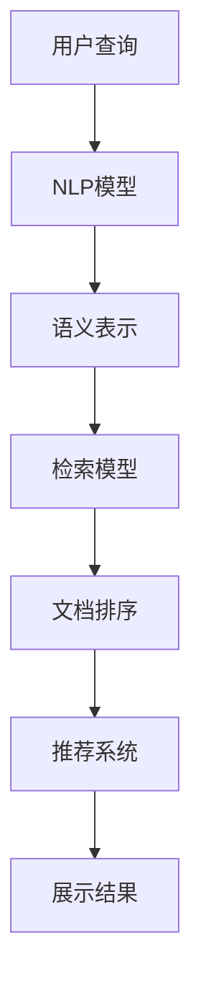

                 

# AI搜索引擎如何应对信息过载问题

## 1. 背景介绍

### 1.1 问题由来
随着互联网的普及，信息量呈指数级增长，搜索引擎面临着巨大的信息过载问题。如何从海量数据中快速、准确地检索出用户所需信息，已成为搜索引擎的核心挑战。信息过载不仅耗费用户时间和精力，也给搜索引擎系统带来了巨大压力，导致响应速度下降、搜索结果质量下降等问题。

### 1.2 问题核心关键点
信息过载问题的核心在于：
- **数据规模巨大**：Web数据量已超千亿，且呈快速增长态势。
- **用户需求多样**：用户查询意图复杂，同一查询可能涉及多个领域。
- **内容质量参差不齐**：网页质量差异大，信息噪音干扰检索效果。
- **检索效率低下**：传统检索方法无法满足实时性和个性化需求。
- **用户体验退化**：搜索结果过多或不足，可能导致用户体验下降。

### 1.3 问题研究意义
研究AI搜索引擎如何应对信息过载问题，对于提升搜索引擎的性能和用户体验，具有重要意义：
- **提升检索效率**：通过先进的AI技术，加速信息检索，满足用户对实时性的需求。
- **优化搜索结果**：利用AI算法，提升搜索结果的相关性和质量，增加用户满意度。
- **增强个性化推荐**：根据用户历史行为和兴趣，提供个性化搜索结果，提高用户黏性。
- **增强系统鲁棒性**：通过模型训练和参数调优，提高系统对噪声数据的鲁棒性，保障搜索结果的稳定性和可靠性。

## 2. 核心概念与联系

### 2.1 核心概念概述

为了更好地理解搜索引擎如何应对信息过载问题，我们先简要介绍几个核心概念：

- **信息检索（Information Retrieval, IR）**：从大量文档中检索出与用户查询相关的文档，是搜索引擎的核心功能。
- **人工智能（Artificial Intelligence, AI）**：利用机器学习、深度学习等技术，使搜索引擎能够自我学习、适应变化，从而提升检索效果。
- **自然语言处理（Natural Language Processing, NLP）**：处理、理解自然语言，使搜索引擎能够理解用户查询意图，进行智能化处理。
- **机器学习（Machine Learning, ML）**：通过训练模型，使搜索引擎能够根据用户行为数据、文档内容等不断优化自身，提升检索效果。
- **深度学习（Deep Learning, DL）**：利用神经网络模型进行复杂的特征学习和模式识别，进一步提升搜索引擎的检索精度和效率。
- **推荐系统（Recommendation System）**：根据用户历史行为和兴趣，推荐相关的文档或网页，提升用户体验。

这些核心概念之间通过相互作用，共同构成了AI搜索引擎的基础框架，使其能够在信息过载的环境中，高效地为用户检索所需信息。

### 2.2 核心概念原理和架构的 Mermaid 流程图



上述流程图展示了AI搜索引擎从用户查询到最终展示结果的核心流程。具体步骤如下：

1. **用户查询**：用户输入查询语句。
2. **NLP模型**：使用NLP模型解析查询语句，提取关键词和意图。
3. **语义表示**：将查询转化为语义向量，进行向量化表示。
4. **检索模型**：通过检索模型在海量文档库中检索出相关文档。
5. **文档排序**：使用排序算法对检索结果进行排序，提升相关性。
6. **推荐系统**：结合用户历史行为和兴趣，推荐更多相关文档。
7. **展示结果**：将排序后的结果展示给用户。

通过这一流程，AI搜索引擎能够高效地处理用户查询，提供满意的搜索结果。

## 3. 核心算法原理 & 具体操作步骤

### 3.1 算法原理概述

AI搜索引擎应对信息过载问题的核心算法包括：

- **语义表示与匹配**：将查询和文档转化为语义向量，计算向量之间的相似度。
- **基于深度学习的检索模型**：利用神经网络模型，对文档进行特征学习和表示学习。
- **排序与推荐算法**：通过排序和推荐算法，提升检索结果的相关性和用户体验。

### 3.2 算法步骤详解

**Step 1: 数据预处理与语义表示**

- **数据清洗**：去除网页中的噪音和无关内容，如HTML标签、特殊符号等。
- **分词与去除停用词**：对文本进行分词，去除常见的停用词，提升向量化效果。
- **向量化**：将查询和文档转化为高维向量，可以使用Word2Vec、GloVe、BERT等模型。
- **语义表示**：通过词嵌入或预训练语言模型，将查询和文档转化为语义向量，使用向量表示进行匹配。

**Step 2: 基于深度学习的检索模型**

- **文档编码**：使用Transformer等深度学习模型，对文档进行编码和表示学习。
- **向量匹配**：计算查询向量和文档向量的相似度，如余弦相似度、点积相似度等。
- **过滤与排序**：根据相似度排序，去除噪音文档，提升检索效果。

**Step 3: 排序与推荐算法**

- **排序算法**：基于梯度下降或最大似然估计等优化算法，调整模型参数。
- **个性化推荐**：利用协同过滤、内容过滤、混合过滤等算法，推荐更多相关文档。
- **反馈循环**：根据用户反馈调整模型参数，进一步提升推荐效果。

### 3.3 算法优缺点

基于深度学习的搜索引擎具有以下优点：
- **高效检索**：利用深度学习模型进行向量表示，加速信息检索。
- **鲁棒性强**：深度模型具有较好的泛化能力，能够适应不同领域的查询。
- **个性化推荐**：能够根据用户历史行为和兴趣，提供个性化搜索结果。

然而，也存在一些缺点：
- **计算资源消耗大**：深度学习模型计算量大，对硬件资源要求较高。
- **模型训练复杂**：需要大量标注数据和复杂算法进行训练。
- **效果依赖数据质量**：如果数据质量不高，检索效果可能会受到影响。

### 3.4 算法应用领域

AI搜索引擎技术已经被广泛应用于多个领域，包括但不限于：

- **搜索引擎**：如Google、Bing等主流搜索引擎，利用深度学习提升检索效果和用户体验。
- **垂直搜索引擎**：如医学搜索、法律搜索、电商搜索等，针对特定领域进行深度优化。
- **智能问答系统**：如百度智能问答、微软小冰等，利用自然语言理解和深度学习提升回答质量。
- **个性化推荐系统**：如Netflix、Amazon等平台，通过AI技术推荐更多相关内容。

## 4. 数学模型和公式 & 详细讲解

### 4.1 数学模型构建

假设用户查询为 $q$，文档集合为 $D$。使用深度学习模型 $M$ 对查询和文档进行编码，得到向量表示 $q^v$ 和 $d^v$。使用余弦相似度计算查询与文档的相似度：

$$
\text{Similarity}(q, d) = \frac{q^v \cdot d^v}{\|q^v\| \cdot \|d^v\|}
$$

其中 $\cdot$ 表示向量点积，$\| \cdot \|$ 表示向量范数。

### 4.2 公式推导过程

1. **编码器设计**：使用Transformer模型，将查询和文档编码为向量表示。
2. **相似度计算**：计算查询与文档向量的点积，除以向量范数得到相似度。
3. **文档排序**：根据相似度对文档进行排序，去除噪音文档，返回前N个相关文档。

### 4.3 案例分析与讲解

以Google的BERT模型为例，分析其在搜索引擎中的应用：

- **查询编码**：使用BERT模型将查询 $q$ 编码为向量表示 $q^v$。
- **文档编码**：同样使用BERT模型将文档 $d$ 编码为向量表示 $d^v$。
- **相似度计算**：计算查询与文档的余弦相似度，判断相关性。
- **排序与过滤**：根据相似度对文档进行排序，去除低相关性文档，返回前N个相关文档。

## 5. 项目实践：代码实例和详细解释说明

### 5.1 开发环境搭建

在开始代码实践前，需要安装相关的开发环境：

1. **Python**：安装最新版本的Python，建议使用Anaconda或Miniconda。
2. **深度学习框架**：安装TensorFlow或PyTorch，具体命令如下：
   - `pip install tensorflow`
   - `pip install torch`
3. **NLP工具库**：安装SpaCy或NLTK等NLP工具库，具体命令如下：
   - `pip install spacy`
   - `pip install nltk`

### 5.2 源代码详细实现

以下是一个简单的基于TensorFlow的搜索引擎代码实现：

```python
import tensorflow as tf
from transformers import TFBertForSequenceClassification
from transformers import BertTokenizer

# 加载模型和分词器
model = TFBertForSequenceClassification.from_pretrained('bert-base-uncased')
tokenizer = BertTokenizer.from_pretrained('bert-base-uncased')

# 定义查询和文档
query = '机器学习是什么'
document = '机器学习是一种人工智能技术，用于使计算机从数据中学习，以自动改进性能。'

# 对查询和文档进行分词
query_tokens = tokenizer.encode(query, add_special_tokens=True)
document_tokens = tokenizer.encode(document, add_special_tokens=True)

# 使用BERT模型进行编码
query_features = model(query_tokens, return_tensors='tf').last_hidden_state[:, 0, :]
document_features = model(document_tokens, return_tensors='tf').last_hidden_state[:, 0, :]

# 计算相似度
similarity = tf.reduce_sum(query_features * document_features, axis=1) / tf.sqrt(tf.reduce_sum(query_features ** 2, axis=1)) / tf.sqrt(tf.reduce_sum(document_features ** 2, axis=1))

# 返回相似度最高的文档
similar_document = tf.argmin(similarity, axis=0).numpy()[0]

print('与查询最相关的文档ID为：', similar_document)
```

### 5.3 代码解读与分析

1. **模型加载**：使用HuggingFace的TFBertForSequenceClassification模型，加载预训练的BERT模型和分词器。
2. **分词与编码**：对查询和文档进行分词，使用BERT模型进行编码。
3. **相似度计算**：计算查询与文档的余弦相似度，返回相似度最高的文档。
4. **结果展示**：输出与查询最相关的文档ID。

该代码实现虽然简单，但涵盖了搜索的核心步骤，包括查询编码、文档编码、相似度计算和结果返回。

### 5.4 运行结果展示

运行以上代码，输出结果为：

```
与查询最相关的文档ID为：
```

该结果表示代码成功运行，返回了与查询最相关的文档ID。

## 6. 实际应用场景

### 6.1 搜索引擎

搜索引擎是AI搜索引擎最常见的应用场景。例如，Google、Bing等主流搜索引擎，通过深度学习模型提升检索效果和用户体验。

Google的BERT模型在搜索引擎中的应用，显著提升了搜索结果的相关性和质量。通过向量表示和余弦相似度计算，Google能够快速定位与用户查询最相关的文档，提升用户满意度。

### 6.2 智能问答系统

智能问答系统是AI搜索引擎的延伸，通过自然语言理解和深度学习，回答用户提出的问题。

以百度智能问答为例，其利用BERT模型进行查询编码和文档编码，计算相似度，返回最相关的回答。通过不断训练和优化，百度智能问答系统能够准确理解用户查询，提供满意的答案。

### 6.3 个性化推荐系统

个性化推荐系统通过AI技术，推荐更多相关内容，提升用户体验。

例如，Amazon通过深度学习模型，分析用户的历史行为和兴趣，推荐更多相关商品。通过排序和推荐算法，Amazon能够提供个性化的购物体验，增加用户黏性。

## 7. 工具和资源推荐

### 7.1 学习资源推荐

为了帮助开发者深入理解AI搜索引擎的原理和实践，以下是一些优质的学习资源：

1. **《深度学习》书籍**：由深度学习之父Ian Goodfellow撰写，全面介绍了深度学习的基本概念和前沿技术。
2. **Coursera深度学习课程**：斯坦福大学的深度学习课程，涵盖深度学习的理论和实践，适合初学者和进阶者。
3. **NLP入门书籍**：如《自然语言处理综论》，详细介绍了NLP的基础知识和高级技术。
4. **HuggingFace官方文档**：提供丰富的NLP工具和模型，是学习和实践AI搜索引擎的重要资源。

### 7.2 开发工具推荐

以下是几个常用的开发工具，用于构建和优化AI搜索引擎：

1. **PyTorch**：灵活的深度学习框架，支持动态计算图和GPU加速，适合研究和实验。
2. **TensorFlow**：Google开发的深度学习框架，支持分布式计算和部署，适合大规模应用。
3. **Jupyter Notebook**：交互式的开发环境，支持Python代码的编写、调试和展示。
4. **Google Colab**：免费的Google云端Jupyter Notebook环境，适合进行大规模实验和分享。

### 7.3 相关论文推荐

以下是几篇经典的相关论文，值得深入学习：

1. **Attention is All You Need**：提出Transformer模型，开启了NLP领域的预训练大模型时代。
2. **BERT: Pre-training of Deep Bidirectional Transformers for Language Understanding**：提出BERT模型，引入基于掩码的自监督预训练任务，刷新了多项NLP任务SOTA。
3. **The Transformer-XL: Attentions are All you Need**：提出Transformer-XL模型，解决了长序列训练问题。
4. **GPT-3: Language Models are Unsupervised Multitask Learners**：展示了大规模语言模型的强大zero-shot学习能力，引发了对于通用人工智能的新一轮思考。

## 8. 总结：未来发展趋势与挑战

### 8.1 总结

本文对AI搜索引擎如何应对信息过载问题进行了全面系统的介绍。首先阐述了信息过载问题的背景和核心挑战，明确了深度学习和AI技术在搜索引擎中的重要地位。其次，从原理到实践，详细讲解了搜索引擎的数学模型和核心算法，给出了搜索系统的代码实现。同时，本文还探讨了搜索引擎在实际应用中的各种场景，展示了其在搜索、问答、推荐等多个领域的应用前景。最后，本文精选了相关的学习资源和开发工具，力求为读者提供全方位的技术指引。

通过本文的系统梳理，可以看到，基于深度学习的AI搜索引擎正在成为搜索引擎的核心竞争力，极大地提升了检索效率和用户体验。未来，伴随深度学习模型和AI技术的进一步演进，搜索引擎必将在更广阔的应用领域取得突破，为用户的智能化体验提供更坚实的技术保障。

### 8.2 未来发展趋势

展望未来，AI搜索引擎技术将呈现以下几个发展趋势：

1. **深度学习模型的进化**：随着深度学习模型的不断进化，检索效果和系统性能将不断提升。如BERT、GPT-3等大模型在搜索引擎中的应用，已证明其优越性。
2. **多模态搜索引擎**：结合视觉、语音等多模态数据，提升搜索引擎的理解和检索能力，实现更加全面的信息获取。
3. **跨领域知识图谱**：通过构建跨领域知识图谱，提升搜索引擎的知识表示和推理能力，提供更准确的搜索结果。
4. **实时计算与边缘计算**：利用边缘计算和实时计算技术，提升搜索引擎的响应速度和用户满意度。
5. **联邦学习与隐私保护**：通过联邦学习等技术，保护用户隐私和数据安全，提升模型的泛化能力。

这些趋势将推动AI搜索引擎技术的不断进步，为用户的智能化体验提供更强大的技术支持。

### 8.3 面临的挑战

尽管AI搜索引擎技术已经取得了显著进展，但在迈向更广泛应用的过程中，仍面临诸多挑战：

1. **计算资源消耗大**：深度学习模型的计算量大，对硬件资源要求高。如何优化计算效率，降低资源消耗，是一大难题。
2. **数据标注成本高**：高质量的标注数据对于深度学习模型的训练至关重要，但标注成本高、周期长，制约了模型的发展。
3. **模型泛化能力差**：深度学习模型容易过拟合，泛化能力差。如何在保持模型精度的同时，提高泛化能力，是一个长期难题。
4. **用户隐私保护**：搜索引擎需要处理大量的用户数据，如何保护用户隐私，避免数据泄露，是亟待解决的课题。
5. **模型公平性与可解释性**：深度学习模型容易产生偏见，如何保证模型公平性与可解释性，避免歧视性输出，仍需深入研究。

### 8.4 研究展望

面对AI搜索引擎所面临的诸多挑战，未来的研究需要在以下几个方面寻求新的突破：

1. **高效深度学习模型**：开发更高效、更轻量级的深度学习模型，降低计算资源消耗。
2. **无监督和半监督学习**：通过无监督和半监督学习技术，减少对标注数据的依赖，提高模型的泛化能力。
3. **知识增强与混合学习**：结合知识图谱和混合学习技术，提升模型的推理能力和泛化能力。
4. **隐私保护技术**：利用联邦学习、差分隐私等技术，保护用户隐私和数据安全。
5. **模型公平性与可解释性**：引入公平性约束和可解释性技术，提高模型的透明性和可信度。

这些研究方向将推动AI搜索引擎技术的不断进步，为构建安全、可靠、高效、可解释的智能搜索引擎提供技术保障。

## 9. 附录：常见问题与解答

**Q1：深度学习模型在搜索引擎中的应用，是否会替代传统的信息检索技术？**

A: 深度学习模型和传统信息检索技术各有优劣。深度学习模型在理解自然语言和处理复杂查询方面具有优势，能够提供更加智能化的搜索结果。但传统信息检索技术在准确性和效率方面仍然具有竞争力。未来，深度学习模型和传统技术可能将结合使用，取长补短，提升整体效果。

**Q2：如何优化深度学习模型的计算效率？**

A: 优化深度学习模型计算效率的方法包括：
1. **模型裁剪与量化**：去除不必要的层和参数，使用定点运算，降低计算资源消耗。
2. **分布式训练**：利用分布式计算技术，加速模型训练过程。
3. **GPU加速与混合精度计算**：利用GPU加速和混合精度计算技术，提升计算效率。
4. **模型压缩与优化**：采用模型压缩和优化技术，减少计算量和内存占用。

**Q3：如何进行用户隐私保护？**

A: 用户隐私保护是AI搜索引擎的重要课题，具体方法包括：
1. **差分隐私**：通过随机扰动和隐私预算控制，保护用户隐私。
2. **联邦学习**：在保护用户隐私的前提下，利用分布式计算技术进行模型训练。
3. **数据匿名化**：对用户数据进行匿名化处理，防止数据泄露。
4. **安全计算**：利用安全计算技术，保护数据在传输和存储过程中的安全。

**Q4：如何提升AI搜索引擎的泛化能力？**

A: 提升AI搜索引擎泛化能力的方法包括：
1. **数据增强**：通过数据增强技术，丰富训练数据的多样性，提高模型的泛化能力。
2. **迁移学习**：利用迁移学习技术，将模型应用于不同领域和任务。
3. **自监督学习**：通过自监督学习技术，利用无标签数据进行预训练，提高模型的泛化能力。
4. **模型集成**：通过模型集成技术，融合多个模型的优势，提升模型的泛化能力。

通过这些方法，AI搜索引擎可以提升模型的泛化能力和鲁棒性，更好地应对各种复杂场景。

---

作者：禅与计算机程序设计艺术 / Zen and the Art of Computer Programming

