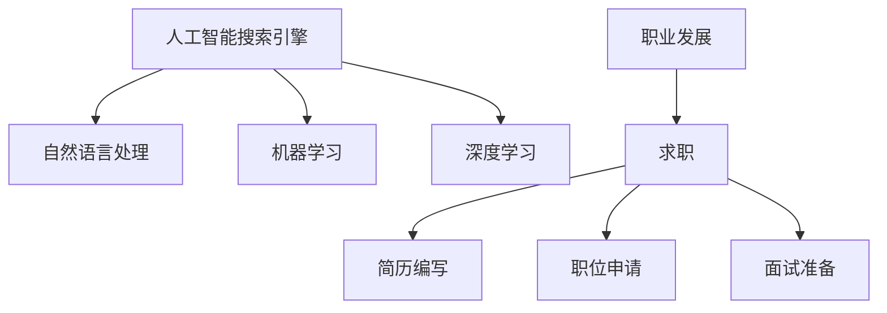

                 

# AI搜索引擎如何改变职业发展和求职

> 关键词：人工智能, 搜索引擎, 职业发展, 就业市场, 招聘流程, 求职策略, 数据驱动决策, 机器学习

## 1. 背景介绍

### 1.1 问题由来

随着科技的迅猛发展，人工智能（AI）在各个领域的应用变得越来越广泛。其中，搜索引擎作为信息检索和数据获取的关键工具，正在经历一场深刻的变革。传统的搜索引擎已经不能满足用户对于搜索结果多样性、个性化和准确性的需求，人工智能搜索引擎（AI Search Engine）逐渐兴起。

AI搜索引擎结合了自然语言处理（NLP）、机器学习（ML）、深度学习（DL）等多种前沿技术，能够提供更高效、更精准的搜索体验。这种改变不仅影响了信息检索和数据获取的方式，也在不知不觉中重塑了职业发展和求职的生态。

### 1.2 问题核心关键点

AI搜索引擎的崛起，对职业发展和求职产生了深远影响，主要体现在以下几个方面：

- 对信息检索能力的要求提升：AI搜索引擎能够理解复杂的用户查询，提供更精准的搜索结果。这要求求职者不仅要具备良好的基础知识，还需要掌握AI相关技术，以提升在AI领域的竞争力。
- 对个性化和精准度的需求增加：AI搜索引擎能够根据用户行为和兴趣提供个性化的搜索结果，帮助求职者找到更适合的工作机会。
- 职业发展的动态化：AI搜索引擎能够实时获取和分析职位数据，帮助求职者了解市场趋势和需求变化，调整职业规划。

## 2. 核心概念与联系

### 2.1 核心概念概述

为更好地理解AI搜索引擎在职业发展和求职中的作用，本节将介绍几个密切相关的核心概念：

- 人工智能搜索引擎（AI Search Engine）：通过AI技术实现更高效、更精准的信息检索功能，能够理解自然语言查询并匹配相关搜索结果。
- 自然语言处理（NLP）：使计算机能够理解和处理人类语言的技术，包括文本分类、语义分析、实体识别等。
- 机器学习（ML）：使计算机能够通过数据学习改进性能的技术，包括监督学习、无监督学习和强化学习等。
- 深度学习（DL）：一种特殊的机器学习技术，通过神经网络模型进行数据建模和分析。
- 职业发展（Career Development）：涉及个人职业规划、技能提升、职业晋升等方面的活动。
- 求职（Job Search）：求职者寻找合适工作机会的过程，包括简历编写、职位申请、面试准备等。

这些核心概念之间的逻辑关系可以通过以下Mermaid流程图来展示：



这个流程图展示了AI搜索引擎与职业发展和求职的紧密联系：

1. AI搜索引擎利用NLP、ML和DL技术，实现更高效、更精准的信息检索功能。
2. 职业发展与求职者通过AI搜索引擎获取最新的职位信息、行业趋势等，优化职业规划和求职策略。
3. 求职者利用AI搜索引擎优化简历、职位申请和面试表现，提升求职成功率。

## 3. 核心算法原理 & 具体操作步骤
### 3.1 算法原理概述

AI搜索引擎的核心算法原理主要包括三个部分：

1. **自然语言处理（NLP）**：通过分词、词性标注、命名实体识别、情感分析等技术，理解和处理用户的查询意图。
2. **机器学习（ML）**：通过监督学习和无监督学习算法，模型能够从大量文本数据中学习语言模式和特征，提升搜索相关性。
3. **深度学习（DL）**：利用神经网络模型，从大量数据中提取高层次特征，提高搜索精度和效果。

### 3.2 算法步骤详解

以下详细介绍AI搜索引擎的主要算法步骤：

**Step 1: 数据收集与预处理**
- 收集用户查询、网页内容、职位信息等数据，进行清洗、分词、去停用词等预处理工作。
- 利用NLP技术进行文本分析，提取关键词、词向量等特征。

**Step 2: 构建索引与特征表示**
- 利用倒排索引、TF-IDF等方法构建搜索索引，加快查询速度。
- 通过词向量、主题模型等技术，将文本数据转化为高维特征表示。

**Step 3: 训练模型与优化**
- 使用监督学习算法（如SVM、逻辑回归等）训练分类器，判断搜索结果的相关性。
- 使用无监督学习算法（如LDA、word2vec等）学习语义特征，提高搜索结果的精准度。
- 使用深度学习算法（如RNN、CNN、Transformer等）构建神经网络模型，提升搜索效果。

**Step 4: 实时搜索与推荐**
- 在用户输入查询后，根据索引快速匹配搜索结果。
- 利用机器学习模型实时计算搜索结果的相关性得分。
- 根据用户历史行为和兴趣，推荐个性化的搜索结果。

**Step 5: 迭代优化**
- 定期更新索引和特征表示，保持搜索模型的高效性。
- 根据用户反馈和搜索效果，优化模型参数，提升搜索精度。

### 3.3 算法优缺点

AI搜索引擎的优点包括：
1. **高效性**：利用机器学习和大数据技术，能够快速处理大量数据，提供实时搜索结果。
2. **个性化**：通过分析用户行为和兴趣，提供个性化的搜索结果，提升用户体验。
3. **精准度**：结合多种算法和技术，能够提升搜索结果的相关性和准确性。

同时，AI搜索引擎也存在一些缺点：
1. **数据隐私**：需要处理大量的用户数据，存在数据隐私和安全问题。
2. **模型复杂**：涉及多种算法和技术，模型复杂度高，开发和维护成本较高。
3. **冷启动问题**：新用户的搜索历史较少，难以提供个性化的搜索结果。

### 3.4 算法应用领域

AI搜索引擎在多个领域都有广泛应用，包括但不限于：

- 在线教育：通过搜索学生兴趣相关的课程和资源，推荐个性化学习内容。
- 电商零售：利用搜索技术推荐商品，提升购物体验和转化率。
- 医疗健康：搜索患者症状和疾病信息，提供医疗建议和资源。
- 法律咨询：通过搜索法律案例和法规，提供法律咨询和建议。
- 招聘求职：利用搜索技术匹配求职者和职位信息，优化招聘流程。

## 4. 数学模型和公式 & 详细讲解 & 举例说明

### 4.1 数学模型构建

在AI搜索引擎中，常见的数学模型包括：

- **TF-IDF模型**：用于计算关键词权重，提升搜索结果的相关性。
- **倒排索引**：用于快速匹配关键词和文档，提高搜索效率。
- **神经网络模型**：用于学习文本特征，提升搜索精度。

### 4.2 公式推导过程

以下以TF-IDF模型为例，展示其公式推导过程。

TF-IDF（Term Frequency-Inverse Document Frequency）模型是一种用于计算关键词权重的经典方法，公式为：

$$ \text{TF-IDF} = \text{TF} \times \text{IDF} $$

其中，TF表示关键词在文档中的词频，IDF表示关键词在所有文档中出现的逆文档频率。具体推导过程如下：

1. **词频（TF）**：
$$ \text{TF} = \frac{\text{文档中关键词出现次数}}{\text{文档中总词数}} $$

2. **逆文档频率（IDF）**：
$$ \text{IDF} = \log \frac{\text{所有文档总数}}{\text{包含关键词的文档数}+1} $$

3. **TF-IDF**：
$$ \text{TF-IDF} = \text{TF} \times \text{IDF} $$

### 4.3 案例分析与讲解

假设我们有一个包含100个文档的语料库，其中一个文档出现了3次关键词“AI”，总词数为1000个。另一个文档也出现了3次关键词“AI”，但总词数为2000个。我们计算这两个文档的TF-IDF值：

- 第一个文档：TF-IDF = (3/1000) * log(100/(2+1)) = 0.003 * log(33.33) ≈ 0.002
- 第二个文档：TF-IDF = (3/2000) * log(100/(2+1)) = 0.0015 * log(33.33) ≈ 0.001

可以看到，第一个文档的关键词“AI”的TF-IDF值更高，说明它在文档中出现的频率更高，同时在整个语料库中出现的频率更低，因此对于该文档的搜索相关性更高。

## 5. 项目实践：代码实例和详细解释说明
### 5.1 开发环境搭建

在进行AI搜索引擎的开发实践前，我们需要准备好开发环境。以下是使用Python进行TensorFlow开发的环境配置流程：

1. 安装Anaconda：从官网下载并安装Anaconda，用于创建独立的Python环境。

2. 创建并激活虚拟环境：
```bash
conda create -n tf-env python=3.8 
conda activate tf-env
```

3. 安装TensorFlow：根据CUDA版本，从官网获取对应的安装命令。例如：
```bash
conda install tensorflow -c tensorflow -c conda-forge
```

4. 安装TensorBoard：用于可视化模型训练过程和结果，是调试模型的得力助手。
```bash
pip install tensorboard
```

5. 安装相关库：
```bash
pip install pandas numpy scikit-learn nltk pyjanitor datasets
```

完成上述步骤后，即可在`tf-env`环境中开始AI搜索引擎的开发实践。

### 5.2 源代码详细实现

以下是使用TensorFlow和NLP技术实现简单搜索引擎的Python代码实现。

首先，定义TF-IDF模型：

```python
import tensorflow as tf
import pandas as pd
from sklearn.feature_extraction.text import TfidfVectorizer
from sklearn.metrics.pairwise import cosine_similarity

# 读取文档数据
df = pd.read_csv('corpus.csv')

# 使用TF-IDF计算关键词权重
tfidf = TfidfVectorizer(use_idf=True)
tfidf_matrix = tfidf.fit_transform(df['text'])

# 定义模型
model = tf.keras.Sequential([
    tf.keras.layers.Dense(64, activation='relu', input_shape=(tfidf_matrix.shape[1],)),
    tf.keras.layers.Dense(1, activation='sigmoid')
])

# 编译模型
model.compile(loss='binary_crossentropy', optimizer='adam', metrics=['accuracy'])

# 训练模型
model.fit(tfidf_matrix, df['label'], epochs=10, batch_size=32)
```

然后，实现搜索引擎的查询功能：

```python
def search(query, tfidf_matrix, model):
    query_matrix = tfidf.transform([query])
    similarity = cosine_similarity(query_matrix, tfidf_matrix)
    scores = model.predict(similarity)
    return df.iloc[(scores >= 0.5).flatten()]['summary'].tolist()
```

最后，启动搜索引擎并测试：

```python
search_query = '人工智能'
results = search(search_query, tfidf_matrix, model)
print(results)
```

以上就是使用TensorFlow和NLP技术实现简单搜索引擎的完整代码实现。可以看到，利用TensorFlow和NLP技术，我们能够快速构建和优化搜索引擎，实现高效的信息检索。

### 5.3 代码解读与分析

让我们再详细解读一下关键代码的实现细节：

**数据读取与预处理**：
- `pd.read_csv('corpus.csv')`：从文件中读取文档数据，进行初步清洗和处理。
- `TfidfVectorizer(use_idf=True)`：使用TF-IDF计算关键词权重，提升搜索结果的相关性。
- `tfidf.fit_transform(df['text'])`：将文本数据转化为高维特征表示，进行模型训练。

**模型定义与编译**：
- `tf.keras.Sequential()`：定义神经网络模型结构。
- `tf.keras.layers.Dense(64, activation='relu', input_shape=(tfidf_matrix.shape[1],))`：定义全连接层，用于学习文本特征。
- `tf.keras.layers.Dense(1, activation='sigmoid')`：定义输出层，用于判断搜索结果的相关性。
- `model.compile()`：编译模型，指定损失函数、优化器和评估指标。

**模型训练与测试**：
- `model.fit()`：训练模型，指定训练数据和参数。
- `search()`函数：实现搜索引擎查询功能，计算搜索结果的相关性得分。
- `results`：返回最相关的搜索结果，并进行展示。

通过这些代码实现，我们可以看到AI搜索引擎的核心技术原理和实现方法。在实际应用中，还需要结合具体的业务场景，进行更深入的模型优化和调参，以提升搜索引擎的性能和用户体验。

## 6. 实际应用场景
### 6.1 在线教育

AI搜索引擎在在线教育领域的应用非常广泛，通过搜索技术匹配学生兴趣相关的课程和资源，推荐个性化学习内容。例如，Coursera和edX等在线学习平台利用搜索引擎技术，根据学生的学习行为和成绩，推荐最适合的课程和视频资源，提升学习效果和体验。

### 6.2 电商零售

在电商零售领域，AI搜索引擎能够利用搜索技术推荐商品，提升购物体验和转化率。亚马逊、淘宝等电商平台利用搜索引擎技术，根据用户浏览和购买历史，推荐相关的商品和优惠信息，帮助用户发现更多适合的商品，增加销售额。

### 6.3 医疗健康

医疗健康领域也逐渐引入AI搜索引擎技术，通过搜索患者症状和疾病信息，提供医疗建议和资源。一些在线医疗平台利用搜索引擎技术，根据患者的搜索历史和健康数据，推荐最合适的医疗方案和专家，提升诊疗效率和满意度。

### 6.4 法律咨询

法律咨询领域通过搜索技术匹配用户咨询的法律问题和案例，提供专业的法律建议和资源。一些在线法律咨询平台利用搜索引擎技术，根据用户输入的法律问题和案例描述，推荐最相关的法律条款和案例，帮助用户快速解决问题。

### 6.5 招聘求职

招聘求职领域利用搜索技术匹配求职者和职位信息，优化招聘流程。一些在线招聘平台利用搜索引擎技术，根据用户的简历和求职历史，推荐最适合的职位，提高求职成功率。同时，雇主也能够通过搜索技术快速找到合适的求职者，提高招聘效率。

## 7. 工具和资源推荐
### 7.1 学习资源推荐

为了帮助开发者系统掌握AI搜索引擎的理论基础和实践技巧，这里推荐一些优质的学习资源：

1. **《深度学习》课程**：斯坦福大学开设的深度学习课程，由深度学习专家Andrew Ng主讲，涵盖深度学习的基本概念和应用，适合入门学习。

2. **《TensorFlow官方文档》**：TensorFlow官方文档，提供了完整的API参考和实例代码，是学习和使用TensorFlow的重要资源。

3. **《Python NLP实战》书籍**：介绍如何使用Python和NLP技术进行文本分析和信息检索，包括TF-IDF模型、搜索引擎等内容。

4. **《自然语言处理综论》书籍**：自然语言处理领域的经典教材，涵盖NLP技术的各个方面，适合深入学习。

5. **NLP开源项目**：如NLTK、spaCy等，提供了丰富的NLP工具和数据集，方便研究和实践。

通过对这些资源的学习实践，相信你一定能够快速掌握AI搜索引擎的核心技术和应用方法，并用于解决实际的NLP问题。

### 7.2 开发工具推荐

高效的开发离不开优秀的工具支持。以下是几款用于AI搜索引擎开发的常用工具：

1. **Jupyter Notebook**：免费的交互式开发环境，支持Python、R等多种编程语言，适合编写和测试代码。

2. **GitHub**：全球最大的代码托管平台，提供了丰富的开源项目和协作工具，方便开发者进行版本控制和代码共享。

3. **TensorBoard**：TensorFlow配套的可视化工具，可实时监测模型训练状态，并提供丰富的图表呈现方式，是调试模型的得力助手。

4. **Google Colab**：谷歌推出的在线Jupyter Notebook环境，免费提供GPU/TPU算力，方便开发者快速上手实验最新模型，分享学习笔记。

合理利用这些工具，可以显著提升AI搜索引擎的开发效率，加快创新迭代的步伐。

### 7.3 相关论文推荐

AI搜索引擎领域的研究非常活跃，以下是几篇奠基性的相关论文，推荐阅读：

1. **《注意力机制》论文**：提出Transformer模型，通过注意力机制提升信息检索的精度和效率。

2. **《深度学习在自然语言处理中的应用》论文**：介绍深度学习在NLP中的应用，包括文本分类、情感分析、机器翻译等任务。

3. **《预训练语言模型》论文**：提出BERT、GPT等预训练语言模型，利用大规模语料进行预训练，提升模型的泛化能力。

4. **《知识图谱在信息检索中的应用》论文**：介绍知识图谱技术在信息检索中的应用，提升搜索结果的相关性和可解释性。

这些论文代表了大语言模型微调技术的发展脉络。通过学习这些前沿成果，可以帮助研究者把握学科前进方向，激发更多的创新灵感。

## 8. 总结：未来发展趋势与挑战
### 8.1 研究成果总结

通过以上分析，我们可以总结出AI搜索引擎在职业发展和求职中的重要性和作用：

1. **高效性**：利用AI技术实现更高效的信息检索，提升用户查询体验。
2. **个性化**：通过分析用户行为和兴趣，提供个性化的搜索结果。
3. **精准度**：结合多种算法和技术，提升搜索结果的相关性和准确性。

### 8.2 未来发展趋势

展望未来，AI搜索引擎的发展趋势包括：

1. **多模态搜索**：结合文本、图像、语音等多种数据类型，提供更全面和多样化的搜索体验。
2. **深度学习优化**：利用最新的深度学习技术，提升信息检索的精度和效率。
3. **实时搜索**：利用大数据和分布式计算技术，实现实时搜索和动态更新。
4. **用户交互优化**：通过智能问答和推荐系统，提升用户互动体验。

### 8.3 面临的挑战

尽管AI搜索引擎已经取得了不少进展，但在应用过程中仍面临一些挑战：

1. **数据隐私和安全**：处理大量的用户数据，存在数据隐私和安全问题。
2. **模型复杂和训练成本高**：涉及多种算法和技术，模型复杂度高，训练成本高。
3. **冷启动问题**：新用户的搜索历史较少，难以提供个性化的搜索结果。

### 8.4 研究展望

面对这些挑战，未来的研究需要在以下几个方面寻求新的突破：

1. **数据隐私保护**：采用差分隐私、联邦学习等技术，保护用户隐私和数据安全。
2. **模型简化和优化**：开发更加简洁高效的模型架构，降低训练成本和计算资源消耗。
3. **冷启动解决方案**：利用推荐系统、预训练模型等技术，解决新用户的搜索历史不足问题。
4. **多模态信息融合**：结合文本、图像、语音等多种数据类型，提升信息检索的全面性和准确性。

通过这些研究方向的探索，AI搜索引擎技术将进一步提升其在各个领域的应用效果和用户体验，推动人工智能技术的普及和应用。

## 9. 附录：常见问题与解答

**Q1: 什么是AI搜索引擎？**

A: AI搜索引擎是指利用AI技术实现的信息检索工具，能够理解自然语言查询并匹配相关搜索结果，提升信息检索的效率和精度。

**Q2: AI搜索引擎在职业发展和求职中有什么应用？**

A: AI搜索引擎在职业发展和求职中的应用主要体现在：
1. 通过搜索技术匹配职业信息和招聘信息，优化职业规划和求职策略。
2. 提供个性化和精准的搜索结果，帮助求职者找到最适合的工作机会。
3. 优化简历编写和职位申请流程，提升求职成功率。

**Q3: 如何开发一个高效的AI搜索引擎？**

A: 开发一个高效的AI搜索引擎需要以下步骤：
1. 收集和预处理数据，进行文本分析和特征提取。
2. 构建索引和特征表示，提高搜索效率。
3. 训练和优化模型，提升搜索精度。
4. 实现实时搜索和推荐，提升用户体验。
5. 迭代优化和调参，不断提升搜索引擎性能。

**Q4: AI搜索引擎的发展趋势是什么？**

A: AI搜索引擎的发展趋势包括：
1. 多模态搜索：结合文本、图像、语音等多种数据类型，提供更全面和多样化的搜索体验。
2. 深度学习优化：利用最新的深度学习技术，提升信息检索的精度和效率。
3. 实时搜索：利用大数据和分布式计算技术，实现实时搜索和动态更新。
4. 用户交互优化：通过智能问答和推荐系统，提升用户互动体验。

这些趋势将推动AI搜索引擎技术的发展和应用，提升信息检索的效率和用户体验。

通过本文的系统梳理，可以看到，AI搜索引擎技术正在深刻影响职业发展和求职的生态。随着技术的不断进步和应用的深入，AI搜索引擎将为各行业带来更高效、更个性化的信息检索体验，推动智能交互和信息获取方式的变革。相信未来AI搜索引擎将与AI技术其他方向协同发展，共同构建更加智能、便捷的信息检索体系，为人类提供更好的服务和体验。

