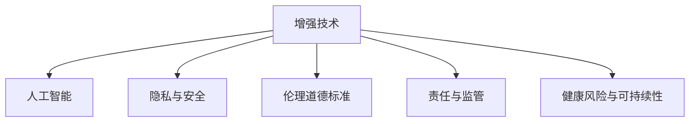

                 

# AI时代的人类增强：身体增强的道德考虑

> 关键词：人工智能, 人类增强, 身体增强, 伦理道德, 健康管理, 技术应用

## 1. 背景介绍

### 1.1 问题由来

随着人工智能技术的飞速发展，人类增强(Augmentation)已成为未来的重要方向。通过AI技术改造和增强人类的生理和心理能力，使人类能够超越自身极限，获得更高效、更强健的生活方式。

在医疗、运动、教育和娱乐等领域，人类增强技术已经取得了显著的突破。然而，随着增强技术的应用范围扩大，其带来的伦理道德问题也逐渐凸显。这些问题涉及隐私、安全、公平、责任等多个方面，亟需我们深入探讨和审视。

### 1.2 问题核心关键点

- **增强技术的本质与目的**：增强技术如何定义，其应用范围有哪些？
- **伦理道德原则**：增强技术应当遵循哪些伦理道德标准？
- **隐私与安全问题**：如何在增强过程中保护用户的隐私和安全？
- **公平与可及性**：增强技术的普及是否会造成社会不平等？
- **责任与监督**：谁应为增强技术的应用承担责任？
- **健康风险与长期影响**：增强技术可能带来的健康问题有哪些？

## 2. 核心概念与联系

### 2.1 核心概念概述

为更好地理解身体增强技术的伦理道德问题，本节将介绍几个核心概念：

- **增强技术(Augmentation)**：通过技术手段提升人类在感知、认知、体能等方面的能力。
- **人工智能(AI)与机器学习(ML)**：增强技术的基础，提供数据驱动的智能决策支持。
- **隐私与数据安全**：增强过程中涉及大量个人数据，需要保障数据的安全与隐私。
- **伦理道德标准**：如尊重、公平、正义等原则，指导增强技术的设计与应用。
- **责任与监管**：涉及法律、政策、监管等多个方面，确保增强技术的责任与合规性。
- **健康风险与可持续性**：评估增强技术对健康的影响，确保其长期可持续性。

这些概念之间的逻辑关系可以通过以下Mermaid流程图来展示：



这个流程图展示增强技术的基本框架，并强调了隐私、伦理、责任和健康风险等关键伦理问题。

## 3. 核心算法原理 & 具体操作步骤
### 3.1 算法原理概述

增强技术通常基于人工智能与机器学习的算法，通过分析大量的生理、心理数据，预测并干预人体的各个方面。常见的算法包括：

- **预测模型(Prediction Modeling)**：通过历史数据训练模型，预测未来状态。
- **强化学习(Reinforcement Learning)**：通过试错过程，逐步优化行为策略。
- **实时监控与反馈(Real-time Monitoring & Feedback)**：实时采集人体数据，反馈调节增强效果。

增强技术的核心在于通过数据分析和智能决策，提供个性化的增强方案。但这一过程也涉及复杂的伦理道德考量。

### 3.2 算法步骤详解

增强技术的应用通常分为以下几个关键步骤：

1. **数据收集**：通过可穿戴设备、传感器等工具，采集用户的生理和心理数据。
2. **模型训练**：使用机器学习算法，对收集到的数据进行训练，预测用户的增强需求。
3. **方案生成**：根据预测结果，生成个性化的增强方案，如锻炼计划、营养方案等。
4. **方案实施**：通过智能设备执行增强方案，对用户进行实时监控和反馈调整。
5. **效果评估**：定期评估增强效果，并根据用户反馈进行优化调整。

### 3.3 算法优缺点

增强技术的优点包括：

- **提升能力**：通过精准的预测和干预，提升用户的感知、认知、体能等能力。
- **个性化**：提供量身定制的增强方案，满足用户的个性化需求。
- **实时监控**：通过实时反馈，及时调整增强方案，提高效果。

但增强技术也存在一些缺点：

- **隐私风险**：大量个人数据被收集和分析，可能引发隐私泄露问题。
- **安全风险**：算法模型的准确性、安全性问题可能带来安全风险。
- **公平性问题**：技术普及可能加剧社会不平等，影响弱势群体。
- **责任界定**：技术应用过程中，责任的界定和承担需要明确。

### 3.4 算法应用领域

增强技术的应用领域广泛，主要包括：

- **健康管理**：通过增强技术改善睡眠质量、心理健康、运动能力等。
- **运动训练**：为运动员提供个性化的训练计划和实时监控，提升运动表现。
- **教育培训**：通过智能设备，提升学生的学习能力，辅助个性化教学。
- **娱乐休闲**：增强游戏体验、虚拟现实(VR)等，带来更沉浸式和智能化的娱乐体验。
- **社交互动**：通过增强技术改善沟通方式，提升人际交往能力。

## 4. 数学模型和公式 & 详细讲解  
### 4.1 数学模型构建

增强技术的数学模型通常基于统计学和机器学习理论，构建预测模型。假设输入为 $X$（生理数据），输出为 $Y$（增强效果），目标为 $T$（时间序列），则预测模型可以表示为：

$$
Y_t = f(X_t, X_{t-1}, \ldots, X_1; \theta)
$$

其中 $f$ 为预测函数，$\theta$ 为模型参数。

### 4.2 公式推导过程

以线性回归模型为例，通过历史数据训练模型，预测未来时间点 $t$ 的增强效果 $Y_t$。模型为：

$$
Y_t = \beta_0 + \sum_{i=1}^n \beta_i X_{it} + \epsilon_t
$$

其中 $\beta_i$ 为回归系数，$\epsilon_t$ 为误差项。

通过对历史数据 $(x_{it}, y_{it})$（$i=1, \ldots, n$，$t=1, \ldots, T$）进行最小二乘法拟合，可得模型参数 $\beta$ 的估计值：

$$
\beta = (X^TX)^{-1}X^Ty
$$

### 4.3 案例分析与讲解

以健康管理为例，假设通过可穿戴设备收集用户的睡眠质量、运动量等数据，预测并改善其睡眠质量。预测模型为：

$$
Y_t = \beta_0 + \beta_1 X_{t, \text{睡眠质量}} + \beta_2 X_{t, \text{运动量}} + \epsilon_t
$$

通过对大量用户的历史数据进行训练，预测模型可以准确预测用户的睡眠质量，并生成个性化的改善方案。

## 5. 项目实践：代码实例和详细解释说明
### 5.1 开发环境搭建

进行增强技术项目开发，首先需要准备好开发环境。以下是使用Python进行TensorFlow开发的环境配置流程：

1. 安装Anaconda：从官网下载并安装Anaconda，用于创建独立的Python环境。

2. 创建并激活虚拟环境：
```bash
conda create -n tf-env python=3.8 
conda activate tf-env
```

3. 安装TensorFlow：根据CUDA版本，从官网获取对应的安装命令。例如：
```bash
conda install tensorflow-gpu=2.7 -c conda-forge -c pypi
```

4. 安装各类工具包：
```bash
pip install numpy pandas scikit-learn matplotlib tqdm jupyter notebook ipython
```

完成上述步骤后，即可在`tf-env`环境中开始增强技术项目开发。

### 5.2 源代码详细实现

这里我们以一个简单的健康管理增强系统为例，展示使用TensorFlow进行增强技术开发的代码实现。

首先，定义模型和优化器：

```python
import tensorflow as tf

model = tf.keras.Sequential([
    tf.keras.layers.Dense(64, input_dim=3, activation='relu'),
    tf.keras.layers.Dense(1, activation='linear')
])

optimizer = tf.keras.optimizers.Adam(learning_rate=0.01)
```

然后，准备训练数据并定义训练函数：

```python
def train_model(model, data, epochs=50):
    x_train, y_train = data
    
    model.compile(optimizer=optimizer, loss='mse')
    
    for epoch in range(epochs):
        loss = model.train_on_batch(x_train, y_train)
        print(f'Epoch {epoch+1}, Loss: {loss:.3f}')
    
    return model
```

接着，定义测试数据和评估函数：

```python
def evaluate_model(model, test_data):
    x_test, y_test = test_data
    y_pred = model.predict(x_test)
    mse = tf.keras.metrics.mean_squared_error(y_test, y_pred)
    print(f'Test MSE: {mse:.3f}')
```

最后，启动训练流程并评估模型：

```python
epochs = 50

# 示例数据
x_train = [[3.1, 4.5, 2.3], [4.2, 5.6, 2.9], [3.8, 4.1, 2.4]]
y_train = [6.3, 7.2, 6.1]

x_test = [[3.7, 5.1, 2.7]]
y_test = [7.0]

model = train_model(model, (x_train, y_train))
evaluate_model(model, (x_test, y_test))
```

以上就是使用TensorFlow对增强模型进行训练和评估的完整代码实现。可以看到，TensorFlow提供的高级API使得模型训练过程变得简洁高效。

### 5.3 代码解读与分析

让我们再详细解读一下关键代码的实现细节：

**Sequential模型**：
- 定义了一个简单的神经网络模型，包含两个全连接层。
- 第一个层为64个神经元，使用ReLU激活函数。
- 第二个层为1个神经元，使用线性激活函数。

**train_model函数**：
- 使用Adam优化器，训练模型，损失函数为均方误差。
- 循环50次，每次训练一个batch，输出训练损失。

**evaluate_model函数**：
- 使用测试数据评估模型的均方误差。

**训练流程**：
- 定义总迭代次数
- 使用示例数据
- 训练模型并评估

可以看到，TensorFlow提供的高级API使得模型训练过程变得简洁高效。开发者可以将更多精力放在模型设计、数据处理等高层逻辑上，而不必过多关注底层的实现细节。

## 6. 实际应用场景
### 6.1 运动训练

增强技术在运动训练中的应用，通过实时监控和智能反馈，能够显著提升运动员的训练效果。例如，通过心率、汗液等生理数据，预测运动员的疲劳程度，自动调整训练强度和休息时间，避免过度训练。

在技术实现上，可以收集运动员的生理数据，并将其作为输入，通过训练好的模型预测疲劳程度。预测结果反馈到训练系统，自动调整训练计划和设备，实现个性化训练。

### 6.2 心理健康

心理健康是增强技术的重要应用方向。通过实时监控用户的心理状态，提供个性化的干预方案，帮助用户缓解压力、改善情绪。

具体实现中，可以收集用户的心率、表情、语调等数据，通过预测模型分析用户的心理状态，自动推送放松技巧、心理辅导等内容。同时，用户可以随时反馈效果，进一步优化模型。

### 6.3 教育培训

在教育培训中，增强技术可以帮助学生实现个性化的学习，提升学习效率。通过采集学生的学习行为数据，预测学习效果，提供个性化的学习建议和资源。

例如，通过分析学生的学习时间、测试成绩等数据，预测学生的学习进度，并推荐适合的课程和学习资源。学生可以根据自己的学习情况，随时调整学习计划和进度。

## 7. 工具和资源推荐
### 7.1 学习资源推荐

为了帮助开发者系统掌握增强技术的伦理道德问题，这里推荐一些优质的学习资源：

1. 《人工智能伦理指南》系列博文：由大模型技术专家撰写，深入浅出地介绍了AI伦理、道德和技术应用的方方面面。

2. 《AI伦理与道德》课程：斯坦福大学开设的AI伦理课程，涵盖AI伦理的基本原则和应用场景，适合初学者和专业人士。

3. 《人类增强：未来科技的伦理》书籍：系统介绍了人类增强技术的发展历程、伦理道德问题和潜在影响。

4. AI伦理道德标准：如IEEE的《人工智能伦理准则》、ISO的《人工智能伦理指南》等，提供了AI伦理道德的国际标准。

通过对这些资源的学习实践，相信你一定能够全面理解增强技术的伦理道德问题，并用于解决实际的AI应用问题。
###  7.2 开发工具推荐

高效的开发离不开优秀的工具支持。以下是几款用于增强技术开发的常用工具：

1. TensorFlow：谷歌开源的深度学习框架，功能强大，支持GPU和TPU加速，适合大规模模型训练和推理。

2. PyTorch：Facebook开源的深度学习框架，灵活高效，适合研究和原型开发。

3. Keras：高层次的神经网络API，简单易用，适合快速搭建和调试模型。

4. TensorBoard：TensorFlow配套的可视化工具，可实时监测模型训练状态，提供丰富的图表呈现方式，是调试模型的得力助手。

5. Weights & Biases：模型训练的实验跟踪工具，可以记录和可视化模型训练过程中的各项指标，方便对比和调优。

6. Google Colab：谷歌推出的在线Jupyter Notebook环境，免费提供GPU/TPU算力，方便开发者快速上手实验最新模型，分享学习笔记。

合理利用这些工具，可以显著提升增强技术项目的开发效率，加快创新迭代的步伐。

### 7.3 相关论文推荐

增强技术的发展源于学界的持续研究。以下是几篇奠基性的相关论文，推荐阅读：

1. 《Ethical considerations in the development and deployment of AI systems》：系统探讨了AI伦理道德的多个方面，提供了实用的伦理框架。

2. 《Human augmentation: A review and reflections on its ethical implications》：对人类增强技术进行了全面的伦理分析，提出了多项伦理原则和指南。

3. 《Fairness in AI: Principles and Practice》：IEEE发布的AI伦理准则，涵盖了AI应用中的公平性、透明度、可解释性等伦理问题。

4. 《The ethics of AI: An introduction》：介绍了AI伦理的基本原则和应用场景，适合初学者入门。

这些论文代表了大增强技术伦理道德的发展脉络。通过学习这些前沿成果，可以帮助研究者把握学科前进方向，激发更多的创新灵感。

## 8. 总结：未来发展趋势与挑战

### 8.1 总结

本文对增强技术的伦理道德问题进行了全面系统的介绍。首先阐述了增强技术的本质与目的，明确了技术应用带来的伦理道德挑战。其次，从原理到实践，详细讲解了增强技术的数学模型和操作步骤，给出了具体的代码实例。同时，本文还探讨了增强技术在运动训练、心理健康、教育培训等多个行业领域的应用前景，展示了增强技术的广阔应用空间。

通过本文的系统梳理，可以看到，增强技术在提升人类能力、改善生活质量方面具有巨大潜力，但其带来的伦理道德问题也必须得到充分重视。只有在技术应用过程中严格遵守伦理道德标准，增强技术才能真正造福人类社会。

### 8.2 未来发展趋势

展望未来，增强技术将呈现以下几个发展趋势：

1. **技术普及加速**：随着技术的不断成熟和成本的降低，增强技术将在更多领域得到应用，提升人类生活和工作效率。
2. **个性化定制增强**：通过更精准的模型和算法，增强技术将实现更加个性化的用户定制，满足不同用户的多样化需求。
3. **跨模态融合**：增强技术将更多地与其他模态技术结合，如AR/VR、智能家居等，形成更全面的智能化应用。
4. **伦理道德框架完善**：增强技术的伦理道德问题将受到更多关注，国际和行业标准将逐步完善。
5. **安全性和隐私保护**：增强技术的伦理道德问题将得到更多重视，数据安全、隐私保护等技术手段将不断提升。

以上趋势凸显了增强技术的广阔前景。这些方向的探索发展，将进一步推动增强技术的应用，带来更高效、更健康、更智能的生活方式。

### 8.3 面临的挑战

尽管增强技术的发展前景广阔，但在迈向更加智能化、普适化应用的过程中，其仍面临诸多挑战：

1. **伦理道德问题**：增强技术的应用可能带来隐私、公平、安全等伦理道德问题，需要更多理论和实践的积累。
2. **技术普适性**：如何确保增强技术的普适性和可及性，避免技术鸿沟和数字鸿沟的加剧。
3. **数据安全问题**：增强技术依赖大量的个人数据，如何保障数据的安全和隐私成为一大难题。
4. **算法透明性**：增强技术的算法模型往往复杂，缺乏可解释性，需要更多技术手段提高算法的透明性和可理解性。
5. **社会影响评估**：增强技术的应用可能带来社会不平等，需要更多研究和政策支持。

### 8.4 研究展望

面对增强技术面临的诸多挑战，未来的研究需要在以下几个方面寻求新的突破：

1. **伦理道德的规范化**：制定更完善的伦理道德框架，指导增强技术的开发和应用。
2. **隐私保护技术**：研究更高效的数据保护和隐私保护技术，确保用户数据的安全。
3. **透明和可解释性**：开发更透明、可解释的增强技术算法，提高算法的透明性和可理解性。
4. **公平与普适性**：研究增强技术的普适性和公平性，确保不同群体的平等享受技术红利。
5. **长期影响评估**：研究增强技术的长期影响，确保其可持续性和社会责任。

这些研究方向的探索，将引领增强技术伦理道德问题的不断深化，为构建安全、可靠、可解释、可控的智能系统铺平道路。面向未来，增强技术需要在技术、伦理、法律、政策等多个层面协同发力，才能真正实现人类能力的提升和社会的和谐发展。

## 9. 附录：常见问题与解答

**Q1：增强技术如何定义，其应用范围有哪些？**

A: 增强技术是指通过技术手段提升人类在感知、认知、体能等方面的能力。其应用范围广泛，包括运动训练、心理健康、教育培训、娱乐休闲等多个领域。

**Q2：增强技术的应用需要遵循哪些伦理道德标准？**

A: 增强技术的应用应遵循以下伦理道德标准：
1. 尊重用户的知情权和选择权，确保用户对增强方案的了解和同意。
2. 公平和包容，确保所有群体都能平等地享受增强技术。
3. 数据隐私和安全，确保用户数据的安全和隐私。
4. 透明和可解释性，确保增强技术算法的透明性和可理解性。
5. 责任和合规性，明确增强技术应用的法律和政策责任。

**Q3：增强技术在落地应用时，应如何处理隐私和安全问题？**

A: 增强技术在落地应用时，应采取以下措施处理隐私和安全问题：
1. 数据匿名化：对用户数据进行匿名化处理，保护用户隐私。
2. 数据加密：对传输和存储的数据进行加密，防止数据泄露。
3. 访问控制：设置访问权限，确保只有授权人员能访问用户数据。
4. 隐私协议：制定隐私保护协议，确保用户知情权和同意权。
5. 风险评估：定期进行隐私和安全风险评估，及时发现和修补漏洞。

**Q4：增强技术的伦理道德问题如何解决？**

A: 增强技术的伦理道德问题可以通过以下方式解决：
1. 制定伦理道德框架：制定和遵循伦理道德框架，指导增强技术的开发和应用。
2. 用户参与和反馈：鼓励用户参与增强技术的设计和应用，及时反馈使用体验和问题。
3. 透明和可解释性：提高增强技术的透明性和可解释性，让用户理解算法的决策过程。
4. 法律和政策支持：制定和完善相关法律和政策，规范增强技术的应用。
5. 伦理审查和监督：设立伦理审查和监督机构，确保增强技术的伦理合规性。

通过以上措施，可以有效地解决增强技术的伦理道德问题，确保技术的健康和可持续发展。

