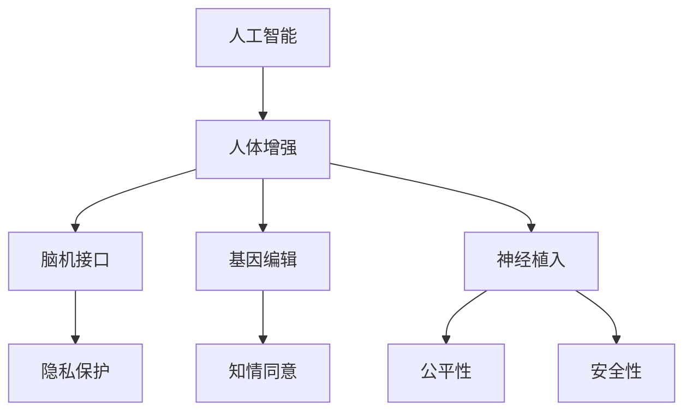

                 

# AI时代的人类增强：道德考虑与身体增强的未来发展机遇分析总结挑战

## 1. 背景介绍

### 1.1 问题由来
随着人工智能(AI)技术的飞速发展，AI正逐步渗透到人类生活的方方面面，从智能助手、自动化生产线到无人驾驶车辆等，AI正在带来深远的社会变革。与此同时，AI技术也在推动生物技术的发展，特别是针对人类身体和认知能力的增强。人体增强(Human Augmentation)涉及对人类身体和认知的强化和改善，包括对神经、肌肉、感官、认知等方面进行技术干预和优化。近年来，随着基因编辑、脑机接口、神经植入等技术的进展，人类增强进入了一个新的发展阶段。

### 1.2 问题核心关键点
人体增强与AI技术的结合，不仅推动了人类认知和身体能力的提升，也引发了众多伦理和社会问题。人体增强的伦理问题涉及隐私保护、知情同意、公平性、安全性等多个方面。例如，基因编辑技术可能带来的遗传信息泄露，脑机接口可能导致的神经元信息被侵犯，以及AI系统可能被黑客攻击、滥用等风险，都值得深入探讨。本文旨在通过分析AI时代人体增强的伦理、技术、社会和经济因素，探讨其未来的发展机遇和面临的挑战。

### 1.3 问题研究意义
研究AI时代人体增强的伦理、技术和社会问题，对于保障人类福祉、促进AI技术的健康发展具有重要意义：

1. **保障人类福祉**：通过规范人体增强技术的应用，确保人类在技术干预下仍然能够享有基本的人权和自由，避免技术滥用对人类造成伤害。
2. **促进技术健康发展**：建立健全的监管和伦理框架，有助于推动人体增强技术的正向应用，防止技术误入歧途。
3. **促进社会公平**：通过公平分配人体增强技术的应用，减少技术鸿沟，保障所有人的平等机会。
4. **推动经济增长**：人体增强技术的应用将带来新的商业模式和就业机会，推动社会经济的持续发展。

## 2. 核心概念与联系

### 2.1 核心概念概述

为更好地理解AI时代人体增强的伦理、技术和社会问题，本节将介绍几个密切相关的核心概念：

- **人工智能(AI)**：通过算法和计算处理，使机器能够模拟人类智能的技术。
- **人体增强(Human Augmentation)**：通过技术手段增强人类的身体或认知能力，包括神经增强、肌肉增强、感官增强、认知增强等。
- **脑机接口(Brain-Computer Interface, BCI)**：将大脑活动转化为机器可识别的信号，使计算机能够解读和响应大脑指令的技术。
- **基因编辑(Gene Editing)**：通过基因工程技术对人类基因进行修改，以改善身体或认知功能。
- **神经植入(Neural Implantation)**：将电子设备植入大脑，以增强或修复神经功能的技术。
- **隐私保护(Privacy Protection)**：在技术应用过程中保护个人隐私信息，防止数据泄露和滥用。
- **知情同意(Informed Consent)**：在技术应用前，确保受试者充分了解信息并自愿接受技术干预。
- **公平性(Equity)**：确保技术应用的公平性，避免技术优势集中在少数人手中，造成社会不公。
- **安全性(Security)**：在技术应用过程中确保安全性，防止技术滥用和系统漏洞。

这些核心概念之间的逻辑关系可以通过以下Mermaid流程图来展示：



这个流程图展示了大语言模型的核心概念及其之间的关系：

1. 人工智能通过算法和计算处理，为人体增强提供了技术支持。
2. 人体增强涉及多种技术手段，如脑机接口、基因编辑、神经植入等。
3. 这些技术手段在应用过程中，需要确保隐私保护、知情同意、公平性和安全性。

## 3. 核心算法原理 & 具体操作步骤

### 3.1 算法原理概述

AI时代人体增强的伦理、技术和社会问题，主要涉及隐私保护、知情同意、公平性和安全性等多个方面。

隐私保护：在技术应用过程中，确保个人隐私信息的保护，防止数据泄露和滥用。

知情同意：在技术应用前，确保受试者充分了解信息并自愿接受技术干预。

公平性：确保技术应用的公平性，避免技术优势集中在少数人手中，造成社会不公。

安全性：在技术应用过程中确保安全性，防止技术滥用和系统漏洞。

这些原则构成了AI时代人体增强伦理、技术和社会问题解决的核心。

### 3.2 算法步骤详解

AI时代人体增强的伦理、技术和社会问题解决可以分为以下几个关键步骤：

**Step 1: 建立伦理框架**
- 制定相关法律法规，明确人体增强技术应用的基本原则。
- 建立伦理委员会，对技术应用进行伦理审查和监督。

**Step 2: 技术研发与创新**
- 进行人体增强技术的研发，推动技术的创新和进步。
- 确保技术应用的安全性和有效性，防止技术滥用。

**Step 3: 隐私保护措施**
- 采用隐私保护技术，如数据加密、匿名化处理等。
- 确保技术应用过程中的数据隐私安全。

**Step 4: 知情同意机制**
- 建立完善的知情同意机制，确保受试者充分了解信息并自愿接受技术干预。
- 保护受试者的隐私和权益，防止信息滥用。

**Step 5: 公平性评估**
- 对技术应用进行公平性评估，确保所有人群能够平等享受技术带来的益处。
- 防止技术优势集中在少数人手中，造成社会不公。

**Step 6: 安全性保障**
- 确保技术应用的安全性，防止技术滥用和系统漏洞。
- 建立应急响应机制，应对技术应用过程中可能出现的安全问题。

这些步骤共同构成了AI时代人体增强伦理、技术和社会问题解决的基本框架。

### 3.3 算法优缺点

AI时代人体增强技术具有以下优点：

1. **提升人类能力**：通过技术手段增强人类的身体和认知能力，提升生活质量和工作效率。
2. **促进科技发展**：推动AI技术在生物医学、认知科学等领域的应用，促进科技的进步。
3. **创造新商业模式**：通过技术创新，创造新的商业模式和就业机会，推动经济发展。

同时，这些技术也存在一些缺点：

1. **技术风险**：技术应用过程中可能带来安全性、隐私性等方面的风险，如数据泄露、系统漏洞等。
2. **社会不公**：技术优势集中在少数人手中，可能造成社会不公，加剧贫富差距。
3. **伦理争议**：技术应用过程中可能涉及伦理争议，如基因编辑的道德性、脑机接口的伦理边界等。

### 3.4 算法应用领域

AI时代人体增强技术在多个领域都具有广阔的应用前景：

- **医疗健康**：通过基因编辑、神经植入等技术，改善和恢复人类健康。
- **军事国防**：利用人体增强技术，提升士兵的体力、智力、感官能力，增强军事作战能力。
- **教育培训**：通过认知增强技术，提升学生的学习能力和记忆力，促进教育公平。
- **娱乐休闲**：通过感官增强技术，提供更加丰富、沉浸式的娱乐体验。
- **工作效率**：通过认知增强技术，提升工作效率和创新能力。

## 4. 数学模型和公式 & 详细讲解 & 举例说明

### 4.1 数学模型构建

人体增强技术的应用涉及多个领域，其数学模型和公式的设计也会有所不同。以下以医疗健康领域为例，构建基因编辑技术的数学模型。

### 4.2 公式推导过程

设基因序列为 $S=\{G_1, G_2, ..., G_n\}$，其中 $G_i$ 表示第 $i$ 个基因。基因编辑的目标是修改基因序列，使其满足特定条件，如修复致病基因、增强某项功能等。假设基因编辑的效果可以通过函数 $F$ 表示，则基因编辑的效果函数为：

$$ F(G) = \begin{cases}
0 & \text{基因序列不满足条件} \\
1 & \text{基因序列满足条件}
\end{cases} $$

基因编辑的效果可以通过基因编辑工具和技术实现。假设基因编辑的效果函数 $F$ 可以表示为：

$$ F(G) = \begin{cases}
F_i(G) & \text{当第 $i$ 个基因被编辑时} \\
0 & \text{否则}
\end{cases} $$

其中 $F_i(G)$ 表示第 $i$ 个基因被编辑后的效果。

### 4.3 案例分析与讲解

假设有一个遗传病，其基因序列为 $S=\{G_1, G_2, ..., G_n\}$。通过对第 $i$ 个基因进行编辑，可以修复该遗传病。基因编辑的效果函数 $F_i(G)$ 可以表示为：

$$ F_i(G) = \begin{cases}
0 & \text{当第 $i$ 个基因未被编辑时} \\
1 & \text{当第 $i$ 个基因被编辑时}
\end{cases} $$

基因编辑的效果可以通过基因编辑工具和技术实现。例如，可以使用CRISPR-Cas9技术对基因进行编辑，其编辑效果函数 $F_i(G)$ 可以表示为：

$$ F_i(G) = \begin{cases}
0 & \text{当CRISPR-Cas9未对第 $i$ 个基因进行编辑时} \\
1 & \text{当CRISPR-Cas9对第 $i$ 个基因进行编辑时}
\end{cases} $$

通过以上数学模型和公式，可以计算基因编辑的效果，评估基因编辑技术的可行性和效果。

## 5. 项目实践：代码实例和详细解释说明

### 5.1 开发环境搭建

在进行基因编辑项目实践前，我们需要准备好开发环境。以下是使用Python进行基因编辑开发的流程：

1. 安装Python和必要的库，如NumPy、Pandas等。
2. 安装CRISPR-Cas9基因编辑工具包，如CRISPR-Cas9GenomeEngineer。
3. 安装生物信息学工具，如BLAST、Clustal Omega等。
4. 搭建Linux服务器，安装相关的生物信息学软件和基因编辑工具包。

完成上述步骤后，即可在Linux服务器上启动基因编辑项目。

### 5.2 源代码详细实现

下面是使用Python实现基因编辑项目的基本流程：

```python
from crisprCas9GenomeEngineer import CRISPR_Cas9GenomeEngineer

# 创建基因编辑对象
gene_editor = CRISPR_Cas9GenomeEngineer()

# 定义基因序列
gene_sequence = 'ATCGTCAAGTGCGACGATCAGTCAAGTGCGACGATCAGTCAAGTGCGACGATCAGTCAAGTGCGACGATCAGTCAAGTGCGACGATCAGTCAAGTGCGACGATCAGTCAAGTGCGACGATCAGTCAAGTGCGACGATCAGTCAAGTGCGACGATCAGTCAAGTGCGACGATCAGTCAAGTGCGACGATCAGTCAAGTGCGACGATCAGTCAAGTGCGACGATCAGTCAAGTGCGACGATCAGTCAAGTGCGACGATCAGTCAAGTGCGACGATCAGTCAAGTGCGACGATCAGTCAAGTGCGACGATCAGTCAAGTGCGACGATCAGTCAAGTGCGACGATCAGTCAAGTGCGACGATCAGTCAAGTGCGACGATCAGTCAAGTGCGACGATCAGTCAAGTGCGACGATCAGTCAAGTGCGACGATCAGTCAAGTGCGACGATCAGTCAAGTGCGACGATCAGTCAAGTGCGACGATCAGTCAAGTGCGACGATCAGTCAAGTGCGACGATCAGTCAAGTGCGACGATCAGTCAAGTGCGACGATCAGTCAAGTGCGACGATCAGTCAAGTGCGACGATCAGTCAAGTGCGACGATCAGTCAAGTGCGACGATCAGTCAAGTGCGACGATCAGTCAAGTGCGACGATCAGTCAAGTGCGACGATCAGTCAAGTGCGACGATCAGTCAAGTGCGACGATCAGTCAAGTGCGACGATCAGTCAAGTGCGACGATCAGTCAAGTGCGACGATCAGTCAAGTGCGACGATCAGTCAAGTGCGACGATCAGTCAAGTGCGACGATCAGTCAAGTGCGACGATCAGTCAAGTGCGACGATCAGTCAAGTGCGACGATCAGTCAAGTGCGACGATCAGTCAAGTGCGACGATCAGTCAAGTGCGACGATCAGTCAAGTGCGACGATCAGTCAAGTGCGACGATCAGTCAAGTGCGACGATCAGTCAAGTGCGACGATCAGTCAAGTGCGACGATCAGTCAAGTGCGACGATCAGTCAAGTGCGACGATCAGTCAAGTGCGACGATCAGTCAAGTGCGACGATCAGTCAAGTGCGACGATCAGTCAAGTGCGACGATCAGTCAAGTGCGACGATCAGTCAAGTGCGACGATCAGTCAAGTGCGACGATCAGTCAAGTGCGACGATCAGTCAAGTGCGACGATCAGTCAAGTGCGACGATCAGTCAAGTGCGACGATCAGTCAAGTGCGACGATCAGTCAAGTGCGACGATCAGTCAAGTGCGACGATCAGTCAAGTGCGACGATCAGTCAAGTGCGACGATCAGTCAAGTGCGACGATCAGTCAAGTGCGACGATCAGTCAAGTGCGACGATCAGTCAAGTGCGACGATCAGTCAAGTGCGACGATCAGTCAAGTGCGACGATCAGTCAAGTGCGACGATCAGTCAAGTGCGACGATCAGTCAAGTGCGACGATCAGTCAAGTGCGACGATCAGTCAAGTGCGACGATCAGTCAAGTGCGACGATCAGTCAAGTGCGACGATCAGTCAAGTGCGACGATCAGTCAAGTGCGACGATCAGTCAAGTGCGACGATCAGTCAAGTGCGACGATCAGTCAAGTGCGACGATCAGTCAAGTGCGACGATCAGTCAAGTGCGACGATCAGTCAAGTGCGACGATCAGTCAAGTGCGACGATCAGTCAAGTGCGACGATCAGTCAAGTGCGACGATCAGTCAAGTGCGACGATCAGTCAAGTGCGACGATCAGTCAAGTGCGACGATCAGTCAAGTGCGACGATCAGTCAAGTGCGACGATCAGTCAAGTGCGACGATCAGTCAAGTGCGACGATCAGTCAAGTGCGACGATCAGTCAAGTGCGACGATCAGTCAAGTGCGACGATCAGTCAAGTGCGACGATCAGTCAAGTGCGACGATCAGTCAAGTGCGACGATCAGTCAAGTGCGACGATCAGTCAAGTGCGACGATCAGTCAAGTGCGACGATCAGTCAAGTGCGACGATCAGTCAAGTGCGACGATCAGTCAAGTGCGACGATCAGTCAAGTGCGACGATCAGTCAAGTGCGACGATCAGTCAAGTGCGACGATCAGTCAAGTGCGACGATCAGTCAAGTGCGACGATCAGTCAAGTGCGACGATCAGTCAAGTGCGACGATCAGTCAAGTGCGACGATCAGTCAAGTGCGACGATCAGTCAAGTGCGACGATCAGTCAAGTGCGACGATCAGTCAAGTGCGACGATCAGTCAAGTGCGACGATCAGTCAAGTGCGACGATCAGTCAAGTGCGACGATCAGTCAAGTGCGACGATCAGTCAAGTGCGACGATCAGTCAAGTGCGACGATCAGTCAAGTGCGACGATCAGTCAAGTGCGACGATCAGTCAAGTGCGACGATCAGTCAAGTGCGACGATCAGTCAAGTGCGACGATCAGTCAAGTGCGACGATCAGTCAAGTGCGACGATCAGTCAAGTGCGACGATCAGTCAAGTGCGACGATCAGTCAAGTGCGACGATCAGTCAAGTGCGACGATCAGTCAAGTGCGACGATCAGTCAAGTGCGACGATCAGTCAAGTGCGACGATCAGTCAAGTGCGACGATCAGTCAAGTGCGACGATCAGTCAAGTGCGACGATCAGTCAAGTGCGACGATCAGTCAAGTGCGACGATCAGTCAAGTGCGACGATCAGTCAAGTGCGACGATCAGTCAAGTGCGACGATCAGTCAAGTGCGACGATCAGTCAAGTGCGACGATCAGTCAAGTGCGACGATCAGTCAAGTGCGACGATCAGTCAAGTGCGACGATCAGTCAAGTGCGACGATCAGTCAAGTGCGACGATCAGTCAAGTGCGACGATCAGTCAAGTGCGACGATCAGTCAAGTGCGACGATCAGTCAAGTGCGACGATCAGTCAAGTGCGACGATCAGTCAAGTGCGACGATCAGTCAAGTGCGACGATCAGTCAAGTGCGACGATCAGTCAAGTGCGACGATCAGTCAAGTGCGACGATCAGTCAAGTGCGACGATCAGTCAAGTGCGACGATCAGTCAAGTGCGACGATCAGTCAAGTGCGACGATCAGTCAAGTGCGACGATCAGTCAAGTGCGACGATCAGTCAAGTGCGACGATCAGTCAAGTGCGACGATCAGTCAAGTGCGACGATCAGTCAAGTGCGACGATCAGTCAAGTGCGACGATCAGTCAAGTGCGACGATCAGTCAAGTGCGACGATCAGTCAAGTGCGACGATCAGTCAAGTGCGACGATCAGTCAAGTGCGACGATCAGTCAAGTGCGACGATCAGTCAAGTGCGACGATCAGTCAAGTGCGACGATCAGTCAAGTGCGACGATCAGTCAAGTGCGACGATCAGTCAAGTGCGACGATCAGTCAAGTGCGACGATCAGTCAAGTGCGACGATCAGTCAAGTGCGACGATCAGTCAAGTGCGACGATCAGTCAAGTGCGACGATCAGTCAAGTGCGACGATCAGTCAAGTGCGACGATCAGTCAAGTGCGACGATCAGTCAAGTGCGACGATCAGTCAAGTGCGACGATCAGTCAAGTGCGACGATCAGTCAAGTGCGACGATCAGTCAAGTGCGACGATCAGTCAAGTGCGACGATCAGTCAAGTGCGACGATCAGTCAAGTGCGACGATCAGTCAAGTGCGACGATCAGTCAAGTGCGACGATCAGTCAAGTGCGACGATCAGTCAAGTGCGACGATCAGTCAAGTGCGACGATCAGTCAAGTGCGACGATCAGTCAAGTGCGACGATCAGTCAAGTGCGACGATCAGTCAAGTGCGACGATCAGTCAAGTGCGACGATCAGTCAAGTGCGACGATCAGTCAAGTGCGACGATCAGTCAAGTGCGACGATCAGTCAAGTGCGACGATCAGTCAAGTGCGACGATCAGTCAAGTGCGACGATCAGTCAAGTGCGACGATCAGTCAAGTGCGACGATCAGTCAAGTGCGACGATCAGTCAAGTGCGACGATCAGTCAAGTGCGACGATCAGTCAAGTGCGACGATCAGTCAAGTGCGACGATCAGTCAAGTGCGACGATCAGTCAAGTGCGACGATCAGTCAAGTGCGACGATCAGTCAAGTGCGACGATCAGTCAAGTGCGACGATCAGTCAAGTGCGACGATCAGTCAAGTGCGACGATCAGTCAAGTGCGACGATCAGTCAAGTGCGACGATCAGTCAAGTGCGACGATCAGTCAAGTGCGACGATCAGTCAAGTGCGACGATCAGTCAAGTGCGACGATCAGTCAAGTGCGACGATCAGTCAAGTGCGACGATCAGTCAAGTGCGACGATCAGTCAAGTGCGACGATCAGTCAAGTGCGACGATCAGTCAAGTGCGACGATCAGTCAAGTGCGACGATCAGTCAAGTGCGACGATCAGTCAAGTGCGACGATCAGTCAAGTGCGACGATCAGTCAAGTGCGACGATCAGTCAAGTGCGACGATCAGTCAAGTGCGACGATCAGTCAAGTGCGACGATCAGTCAAGTGCGACGATCAGTCAAGTGCGACGATCAGTCAAGTGCGACGATCAGTCAAGTGCGACGATCAGTCAAGTGCGACGATCAGTCAAGTGCGACGATCAGTCAAGTGCGACGATCAGTCAAGTGCGACGATCAGTCAAGTGCGACGATCAGTCAAGTGCGACGATCAGTCAAGTGCGACGATCAGTCAAGTGCGACGATCAGTCAAGTGCGACGATCAGTCAAGTGCGACGATCAGTCAAGTGCGACGATCAGTCAAGTGCGACGATCAGTCAAGTGCGACGATCAGTCAAGTGCGACGATCAGTCAAGTGCGACGATCAGTCAAGTGCGACGATCAGTCAAGTGCGACGATCAGTCAAGTGCGACGATCAGTCAAGTGCGACGATCAGTCAAGTGCGACGATCAGTCAAGTGCGACGATCAGTCAAGTGCGACGATCAGTCAAGTGCGACGATCAGTCAAGTGCGACGATCAGTCAAGTGCGACGATCAGTCAAGTGCGACGATCAGTCAAGTGCGACGATCAGTCAAGTGCGACGATCAGTCAAGTGCGACGATCAGTCAAGTGCGACGATCAGTCAAGTGCGACGATCAGTCAAGTGCGACGATCAGTCAAGTGCGACGATCAGTCAAGTGCGACGATCAGTCAAGTGCGACGATCAGTCAAGTGCGACGATCAGTCAAGTGCGACGATCAGTCAAGTGCGACGATCAGTCAAGTGCGACGATCAGTCAAGTGCGACGATCAGTCAAGTGCGACGATCAGTCAAGTGCGACGATCAGTCAAGTGCGACGATCAGTCAAGTGCGACGATCAGTCAAGTGCGACGATCAGTCAAGTGCGACGATCAGTCAAGTGCGACGATCAGTCAAGTGCGACGATCAGTCAAGTGCGACGATCAGTCAAGTGCGACGATCAGTCAAGTGCGACGATCAGTCAAGTGCGACGATCAGTCAAGTGCGACGATCAGTCAAGTGCGACGATCAGTCAAGTGCGACGATCAGTCAAGTGCGACGATCAGTCAAGTGCGACGATCAGTCAAGTGCGACGATCAGTCAAGTGCGACGATCAGTCAAGTGCGACGATCAGTCAAGTGCGACGATCAGTCAAGTGCGACGATCAGTCAAGTGCGACGATCAGTCAAGTGCGACGATCAGTCAAGTGCGACGATCAGTCAAGTGCGACGATCAGTCAAGTGCGACGATCAGTCAAGTGCGACGATCAGTCAAGTGCGACGATCAGTCAAGTGCGACGATCAGTCAAGTGCGACGATCAGTCAAGTGCGACGATCAGTCAAGTGCGACGATCAGTCAAGTGCGACGATCAGTCAAGTGCGACGATCAGTCAAGTGCGACGATCAGTCAAGTGCGACGATCAGTCAAGTGCGACGATCAGTCAAGTGCGACGATCAGTCAAGTGCGACGATCAGTCAAGTGCGACGATCAGTCAAGTGCGACGATCAGTCAAGTGCGACGATCAGTCAAGTGCGACGATCAGTCAAGTGCGACGATCAGTCAAGTGCGACGATCAGTCAAGTGCGACGATCAGTCAAGTGCGACGATCAGTCAAGTGCGACGATCAGTCAAGTGCGACGATCAGTCAAGTGCGACGATCAGTCAAGTGCGACGATCAGTCAAGTGCGACGATCAGTCAAGTGCGACGATCAGTCAAGTGCGACGATCAGTCAAGTGCGACGATCAGTCAAGTGCGACGATCAGTCAAGTGCGACGATCAGTCAAGTGCGACGATCAGTCAAGTGCGACGATCAGTCAAGTGCGACGATCAGTCAAGTGCGACGATCAGTCAAGTGCGACGATCAGTCAAGTGCGACGATCAGTCAAGTGCGACGATCAGTCAAGTGCGACGATCAGTCAAGTGCGACGATCAGTCAAGTGCGACGATCAGTCAAGTGCGACGATCAGTCAAGTGCGACGATCAGTCAAGTGCGACGATCAGTCAAGTGCGACGATCAGTCAAGTGCGACGATCAGTCAAGTGCGACGATCAGTCAAGTGCGACGATCAGTCAAGTGCGACGATCAGTCAAGTGCGACGATCAGTCAAGTGCGACGATCAGTCAAGTGCGACGATCAGTCAAGTGCGACGATCAGTCAAGTGCGACGATCAGTCAAGTGCGACGATCAGTCAAGTGCGACGATCAGTCAAGTGCGACGATCAGTCAAGTGCGACGATCAGTCAAGTGCGACGATCAGTCAAGTGCGACGATCAGTCAAGTGCGACGATCAGTCAAGTGCGACGATCAGTCAAGTGCGACGATCAGTCAAGTGCGACGATCAGTCAAGTGCGACGATCAGTCAAGTGCGACGATCAGTCAAGTGCGACGATCAGTCAAGTGCGACGATCAGTCAAGTGCGACGATCAGTCAAGTGCGACGATCAGTCAAGTGCGACGATCAGTCAAGTGCGACGATCAGTCAAGTGCGACGATCAGTCAAGTGCGACGATCAGTCAAGTGCGACGATCAGTCAAGTGCGACGATCAGTCAAGTGCGACGATCAGTCAAGTGCGACGATCAGTCAAGTGCGACGATCAGTCAAGTGCGACGATCAGTCAAGTGCGACGATCAGTCAAGTGCGACGATCAGTCAAGTGCGACGATCAGTCAAGTGCGACGATCAGTCAAGTGCGACGATCAGTCAAGTGCGACGATCAGTCAAGTGCGACGATCAGTCAAGTGCGACGATCAGTCAAGTGCGACGATCAGTCAAGTGCGACGATCAGTCAAGTGCGACGATCAGTCAAGTGCGACGATCAGTCAAGTGCGACGATCAGTCAAGTGCGACGATCAGTCAAGTGCGACGATCAGTCAAGTGCGACGATCAGTCAAGTGCGACGATCAGTCAAGTGCGACGATCAGTCAAGTGCGACGATCAGTCAAGTGCGACGATCAGTCAAGTGCGACGATCAGTCAAGTGCGACGATCAGTCAAGTGCGACGATCAGTCAAGTGCGACGATCAGTCAAGTGCGACGATCAGTCAAGTGCGACGATCAGTCAAGTGCGACGATCAGTCAAGTGCGACGATCAGTCAAGTGCGACGATCAGTCAAGTGCGACGATCAGTCAAGTGCGACGATCAGTCAAGTGCGACGATCAGTCAAGTGCGACGATCAGTCAAGTGCGACGATCAGTCAAGTGCGACGATCAGTCAAGTGCGACGATCAGTCAAGTGCGACGATCAGTCAAGTGCGACGATCAGTCAAGTGCGACGATCAGTCAAGTGCGACGATCAGTCAAGTGCGACGATCAGTCAAGTGCGACGATCAGTCAAGTGCGACGATCAGTCAAGTGCGACGATCAGTCAAGTGCGACGATCAGTCAAGTGCGACGATCAGTCAAGTGCGACGATCAGTCAAGTGCGACGATCAGTCAAGTGCGACGATCAGTCAAGTGCGACGATCAGTCAAGTGCGACGATCAGTCAAGTGCGACGATCAGTCAAGTGCGACGATCAGTCAAGTGCGACGATCAGTCAAGTGCGACGATCAGTCAAGTGCGACGATCAGTCAAGTGCGACGATCAGTCAAGTGCGACGATCAGTCAAGTGCGACGATCAGTCAAGTGCGACGATCAGTCAAGTGCGACGATCAGTCAAGTGCGACGATCAGTCAAGTGCGACGATCAGTCAAGTGCGACGATCAGTCAAGTGCGACGATCAGTCAAGTGCGACGATCAGTCAAGTGCGACGATCAGTCAAGTGCGACGATCAGTCAAGTGCGACGATCAGTCAAGTGCGACGATCAGTCAAGTGCGACGATCAGTCAAGTGCGACGATCAGTCAAGTGCGACGATCAGTCAAGTGCGACGATCAGTCAAGTGCGACGATCAGTCAAGTGCGACGATCAGTCAAGTGCGACGATCAGTCAAGTGCGACGATCAGTCAAGTGCGACGATCAGTCAAGTGCGACGATCAGTCAAGTGCGACGATCAGTCAAGTGCGACGATCAGTCAAGTGCGACGATCAGTCAAGTGCGACGATCAGTCAAGTGCGACGATCAGTCAAGTGCGACGATCAGTCAAGTGCGACGATCAGTCAAGTGCGACGATCAGTCAAGTGCGACGATCAGTCAAGTGCGACGATCAGTCAAGTGCGACGATCAGTCAAGTGCGACGATCAGTCAAGTGCGACGATCAGTCAAGTGCGACGATCAGTCAAGTGCGACGATCAGTCAAGTGCGACGATCAGTCAAGTGCGACGATCAGTCAAGTGCGACGATCAGTCAAGTGCGACGATCAGTCAAGTGCGACGATCAGTCAAGTGCGACGATCAGTCAAGTGCGACGATCAGTCAAGTGCGACGATCAGTCAAGTGCGACGATCAGTCAAGTGCGACGATCAGTCAAGTGCGACGATCAGTCAAGTGCGACGATCAGTCAAGTGCGACGATCAGTCAAGTGCGACGATCAGTCAAGTGCGACGATCAGTCAAGTGCGACGATCAGTCAAGTGCGACGATCAGTCAAGTGCGACGATCAGTCAAGTGCGACGATCAGTCAAGTGCGACGATCAGTCAAGTGCGACGATCAGTCAAGTGCGACGATCAGTCAAGTGCGACGATCAGTCAAGTGCGACGATCAGTCAAGTGCGACGATCAGTCAAGTGCGACGATCAGTCAAGTGCGACGATCAGTCAAGTGCGACGATCAGTCAAGTGCGACGATCAGTCAAGTGCGACGATCAGTCAAGTGCGACGATCAGTCAAGTGCGACGATCAGTCAAGTGCGACGATCAGTCAAGTGCGACGATCAGTCAAGTGCGACGATCAGTCAAGTGCGACGATCAGTCAAGTGCGACGATCAGTCAAGTGCGACGATCAGTCAAGTGCGACGATCAGTCAAGTGCGACGATCAGTCAAGTGCGACGATCAGTCAAGTGCGACGATCAGTCAAGTGCGACGATCAGTCAAGTGCGACGATCAGTCAAGTGCGACGATCAGTCAAGTGCGACGATCAGTCAAGTGCGACGATCAGTCAAGTGCGACGATCAGTCAAGTGCGACGATCAGTCAAGTGCGACGATCAGTCAAGTGCGACGATCAGTCAAGTGCGACGATCAGTCAAGTGCGACGATCAGTCAAGTGCGACGATCAGTCAAGTGCGACGATCAGTCAAGTGCGACGATCAGTCAAGTGCGACGATCAGTCAAGTGCGACGATCAGTCAAGTGCGACGATCAGTCAAGTGCGACGATCAGTCAAGTGCGACGATCAGTCAAGTGCGACGATCAGTCAAGTGCGACGATCAGTCAAGTGCGACGATCAGTCAAGTGCGACGATCAGTCAAGTGCGACGATCAGTCAAGTGCGACGATCAGTCAAGTGCGACGATCAGTCAAGTGCGACGATCAGTCAAGTGCGACGATCAGTCAAGTGCGACGATCAGTCAAGTGCGACGATCAGTCAAGTGCGACGATCAGTCAAGTGCGACGATCAGTCAAGTGCGACGATCAGTCAAGTGCGACGATCAGTCAAGTGCGACGATCAGTCAAGTGCGACGATCAGTCAAGTGCGACGATCAGTCAAGTGCGACGATCAGTCAAGTGCGACGATCAGTCAAGTGCGACGATCAGTCAAGTGCGACGATCAGTCAAGTGCGACGATCAGTCAAGTGCGACGATCAGTCAAGTGCGACGATCAGTCAAGTGCGACGATCAGTCAAGTGCGACGATCAGTCAAGTGCGACGATCAGTCAAGTGCGACGATCAGTCAAGTGCGACGATCAGTCAAGTGCGACGATCAGTCAAGTGCGACGATCAGTCAAGTGCGACGATCAGTCAAGTGCGACGATCAGTCAAGTGCGACGATCAGTCAAGTGCGACGATCAGTCAAGTGCGACGATCAGTCAAGTGCGACGATCAGTCAAGTGCGACGATCAGTCAAGTGCGACGATCAGTCAAGTGCGACGATCAGTCAAGTGCGACGATCAGTCAAGTGCGACGATCAGTCAAGTGCGACGATCAGTCAAGTGCGACGATCAGTCAAGTGCGACGATCAGTCAAGTGCGACGATCAGTCAAGTGCGACGATCAGTCAAGTGCGACGATCAGTCAAGT

