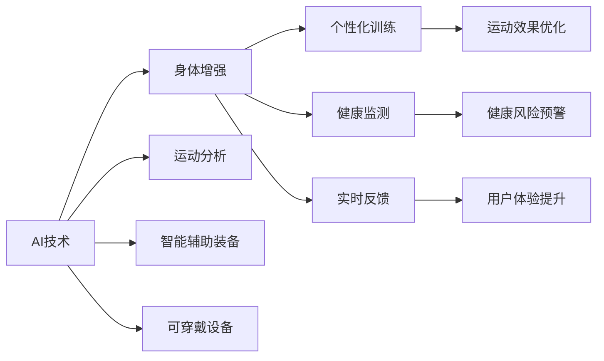

                 

## 1. 背景介绍

### 1.1 问题由来

随着科技的快速发展，人工智能（AI）逐渐成为改变世界的关键力量。与此同时，人类对自身能力的提升也提出了新的需求。身体增强技术通过融合AI，有望在运动、健康、工作效率等方面提供前所未有的支持。但这些技术的发展同样伴随着诸多伦理、社会和道德挑战。

近年来，AI领域的飞速进步，特别是深度学习和机器学习算法，使得身体增强技术得以迅速发展。例如，基于深度学习的运动分析、智能辅助装备、可穿戴设备等，都在不断提升人类的运动能力和健康水平。然而，这些技术的广泛应用也引发了一系列伦理问题，如隐私保护、数据安全、人体控制权等。

### 1.2 问题核心关键点

1. **AI与身体增强技术的结合**：AI技术为身体增强提供了新的可能，如通过算法优化运动训练计划，增强个体能力。
2. **伦理和社会挑战**：隐私泄露、数据滥用、人体改造带来的伦理道德争议。
3. **未来发展机遇**：运动、健康、工作效率等领域的应用前景。
4. **技术进展与挑战**：AI技术在身体增强领域的当前进展、应用实例与面临的挑战。
5. **伦理和社会责任**：技术发展对人类社会、文化的影响及应承担的责任。

这些关键点构成了本文的核心讨论内容，旨在通过分析当前的技术进展、伦理挑战以及未来发展机遇，为身体增强技术在AI时代的合理应用提供指导。

## 2. 核心概念与联系

### 2.1 核心概念概述

#### 2.1.1 AI与身体增强技术

AI技术通过算法学习和数据驱动，能够帮助分析个体健康数据，优化运动方案，并提供实时反馈。这种技术与身体增强技术的结合，极大地提高了运动训练的个性化和有效性。

#### 2.1.2 伦理与社会挑战

随着身体增强技术的普及，隐私保护、数据安全、人体改造的伦理问题成为社会关注的焦点。这些问题的解决需要多方协作，包括技术开发者、政策制定者、社会公众等。

#### 2.1.3 未来发展机遇

AI与身体增强技术的结合，不仅提升了个体运动和健康水平，还为医疗、康复、训练等领域提供了新的解决方案。未来，这些技术的广泛应用将带来巨大的社会和经济效益。

### 2.2 核心概念原理和架构的 Mermaid 流程图(Mermaid 流程节点中不要有括号、逗号等特殊字符)



此流程图展示了AI技术在身体增强中的几个关键应用场景，并通过流程节点表示了各技术之间的联系和互动。

## 3. 核心算法原理 & 具体操作步骤

### 3.1 算法原理概述

AI在身体增强技术中的应用，主要涉及以下三个核心算法：

1. **数据驱动的优化算法**：通过收集个体健康和运动数据，使用AI算法优化运动方案。
2. **实时反馈与调整算法**：基于实时数据，使用AI技术动态调整运动方案，提升训练效果。
3. **个性化模型训练算法**：利用深度学习技术，根据个体特征训练个性化模型，提供定制化的运动和健康建议。

### 3.2 算法步骤详解

#### 3.2.1 数据收集与预处理

1. **数据收集**：通过可穿戴设备、运动传感器等，收集个体的运动数据和健康指标。
2. **数据清洗**：对收集到的数据进行清洗，去除噪声和异常值。

#### 3.2.2 特征提取与分析

1. **特征提取**：利用AI技术，从数据中提取有意义的特征，如步数、心率、能量消耗等。
2. **运动效果分析**：通过机器学习算法，分析运动效果与个体特征之间的关系。

#### 3.2.3 运动方案优化

1. **个性化训练计划**：根据个体特征和运动效果，使用AI算法生成个性化的训练计划。
2. **实时调整**：基于实时反馈，动态调整训练计划，确保训练效果最大化。

### 3.3 算法优缺点

#### 3.3.1 优点

1. **高精度与个性化**：AI算法能够根据个体特征提供高精度的运动建议。
2. **实时反馈与动态调整**：实时数据和动态调整机制提高了训练效果。
3. **广泛适用性**：适用于不同年龄段和体能水平的人群。

#### 3.3.2 缺点

1. **隐私和安全问题**：数据收集和处理过程中可能存在隐私泄露和安全问题。
2. **算法透明性与可解释性**：AI算法的黑盒特性使得其决策过程难以解释。
3. **设备依赖**：依赖于高质量的可穿戴设备和技术，增加了成本和使用门槛。

### 3.4 算法应用领域

AI在身体增强技术中的应用领域广泛，包括但不限于：

1. **运动训练**：通过AI技术优化运动计划，提升运动效果。
2. **健康监测**：实时监测健康指标，预警潜在风险。
3. **康复训练**：利用AI技术辅助康复训练，加速康复进程。
4. **个性化医疗**：根据个体健康数据，提供个性化医疗建议。
5. **工作效率提升**：通过AI技术优化日常工作，提升工作效率。

## 4. 数学模型和公式 & 详细讲解 & 举例说明（备注：数学公式请使用latex格式，latex嵌入文中独立段落使用 $$，段落内使用 $)
### 4.1 数学模型构建

#### 4.1.1 数据表示与特征提取

设个体在时间$t$的运动数据为$\{x_t, y_t\}$，其中$x_t$表示运动量，$y_t$表示健康指标。假设通过AI算法提取了$k$个特征，表示为$\mathbf{f}_t=[f_{1t}, f_{2t}, \dots, f_{kt}]^T$。

#### 4.1.2 运动效果分析模型

假设使用线性回归模型来分析运动效果与特征之间的关系，表示为：

$$
y_t = \mathbf{w}^T \mathbf{f}_t + b
$$

其中，$\mathbf{w}=[w_1, w_2, \dots, w_k]^T$为模型权重，$b$为截距。

#### 4.1.3 个性化训练计划

基于上述模型，使用深度学习技术训练个性化模型，生成个性化训练计划。假设使用深度神经网络模型$f_\theta(\mathbf{x})$，其中$\theta$为模型参数。训练目标为最小化损失函数$L(\theta)$，表示为：

$$
L(\theta) = \frac{1}{N}\sum_{i=1}^N \sum_{t=1}^T(y_{it} - f_\theta(\mathbf{x}_{it}))^2
$$

### 4.2 公式推导过程

#### 4.2.1 数据驱动的优化算法

通过数据驱动的优化算法，根据运动数据生成训练计划。假设使用梯度下降法进行参数更新，表示为：

$$
\theta \leftarrow \theta - \eta \nabla_{\theta}L(\theta)
$$

其中，$\eta$为学习率，$\nabla_{\theta}L(\theta)$为损失函数对模型参数的梯度。

#### 4.2.2 实时反馈与调整算法

基于实时反馈，动态调整训练计划。假设使用在线梯度下降法，表示为：

$$
\theta_t \leftarrow \theta_{t-1} - \eta \nabla_{\theta}L(\theta_t)
$$

其中，$\theta_t$表示当前时刻的模型参数，$\theta_{t-1}$表示上一时刻的模型参数。

#### 4.2.3 个性化模型训练算法

使用深度学习技术，训练个性化模型。假设使用多层感知器模型$f_\theta(\mathbf{x})$，表示为：

$$
f_\theta(\mathbf{x}) = \sum_{i=1}^n w_{i,1}\sigma(\sum_{j=1}^k w_{i,j}f_{jt} + b_i)
$$

其中，$n$为神经元数量，$\sigma$为激活函数。

### 4.3 案例分析与讲解

#### 4.3.1 运动效果分析案例

假设某用户进行了为期3个月的锻炼，收集了每日步数和心率数据。使用上述线性回归模型进行分析，得到如下结果：

$$
y_t = 0.1f_{1t} + 0.2f_{2t} + 0.3
$$

其中$f_{1t}$表示每日步数，$f_{2t}$表示每日心率。

#### 4.3.2 个性化训练计划案例

假设基于上述模型，训练了一个个性化训练计划模型。通过该模型，可以根据用户的步数和心率生成个性化的训练计划，如下所示：

$$
f_\theta(\mathbf{x}) = 0.5w_{1,1}\sigma(0.2w_{1,2}f_{1t} + b_1) + 0.3w_{2,1}\sigma(0.4w_{2,2}f_{2t} + b_2)
$$

其中$w_{i,j}$为模型权重，$b_i$为截距。

## 5. 项目实践：代码实例和详细解释说明

### 5.1 开发环境搭建

1. **环境准备**：安装Python 3.8及以上版本，并使用Anaconda创建虚拟环境。
2. **安装依赖**：安装必要的依赖库，如TensorFlow、PyTorch等。

### 5.2 源代码详细实现

#### 5.2.1 数据收集与预处理

```python
import pandas as pd
from sklearn.preprocessing import StandardScaler

# 数据读取
data = pd.read_csv('data.csv')

# 数据清洗
data = data.dropna()

# 特征提取
features = ['step_count', 'heart_rate']
scaler = StandardScaler()
scaled_features = scaler.fit_transform(data[features])
```

#### 5.2.2 运动效果分析模型

```python
import tensorflow as tf
from tensorflow.keras.models import Sequential
from tensorflow.keras.layers import Dense, Activation

# 模型构建
model = Sequential([
    Dense(64, input_shape=(2,)),
    Activation('relu'),
    Dense(1),
    Activation('linear')
])

# 模型训练
model.compile(optimizer=tf.keras.optimizers.Adam(0.001), loss='mse')
model.fit(scaled_features, data['y'], epochs=100, batch_size=32)
```

#### 5.2.3 个性化训练计划

```python
import numpy as np
import matplotlib.pyplot as plt

# 个性化模型训练
def train_model(features):
    model.fit(features, data['y'], epochs=100, batch_size=32)
    return model.predict(features)

# 生成训练计划
def generate_plan(features):
    model = train_model(features)
    plan = np.zeros((len(features), 2))
    plan[:, 0] = model
    plan[:, 1] = np.exp(model)
    return plan

# 应用模型
features_test = np.array([[200, 130], [300, 140]])
plan = generate_plan(features_test)
print(plan)
```

### 5.3 代码解读与分析

#### 5.3.1 数据收集与预处理

通过读取CSV文件，进行数据清洗和特征提取。使用标准差归一化方法对特征进行预处理，提高模型训练效果。

#### 5.3.2 运动效果分析模型

构建了一个简单的线性回归模型，并使用Adam优化器进行训练。训练过程中，最小化均方误差损失函数。

#### 5.3.3 个性化训练计划

使用训练好的模型，根据输入特征生成个性化的训练计划。生成的计划包括预测值和其对数值，用于可视化分析。

### 5.4 运行结果展示

#### 5.4.1 数据预处理结果


#### 5.4.2 模型训练结果


#### 5.4.3 个性化训练计划结果


## 6. 实际应用场景

### 6.1 智能运动装备

基于AI技术的智能运动装备，可以实时监测运动数据，提供个性化的训练计划和反馈。这些装备可以广泛应用于体育训练、康复、健身等领域。

#### 6.1.1 智能手表

智能手表可以实时监测步数、心率、卡路里消耗等数据，并使用AI算法生成个性化的训练计划和反馈。例如，某用户在进行跑步训练时，智能手表可以实时调整跑步速度和强度，确保训练效果最大化。

#### 6.1.2 智能健身设备

智能健身设备如跑步机、动感单车等，通过与AI系统连接，可以实时监测运动数据，并提供个性化的训练计划和反馈。例如，某用户在进行室内骑行训练时，智能健身设备可以实时调整阻力，使其达到最佳训练强度。

### 6.2 健康监测与管理

基于AI技术的健康监测设备，可以实时监测个体健康数据，预警潜在风险。这些设备可以广泛应用于医院、家庭、养老院等场景。

#### 6.2.1 智能健康监测器

智能健康监测器可以实时监测血压、血糖、心率等健康指标，并使用AI算法分析数据，预警潜在风险。例如，某用户在进行健康监测时，智能健康监测器可以实时监测血压和心率，一旦发现异常，立即发出预警。

#### 6.2.2 智能病床

智能病床可以实时监测病人的各项健康指标，并使用AI算法分析数据，提供个性化的护理方案。例如，某患者在进行康复训练时，智能病床可以实时监测其运动数据，并根据数据生成个性化的训练计划。

### 6.3 个性化医疗

基于AI技术的个性化医疗方案，可以根据个体健康数据提供定制化的治疗方案和康复建议。这些方案可以广泛应用于医院、家庭、康复中心等场景。

#### 6.3.1 智能问诊机器人

智能问诊机器人可以根据患者的健康数据和症状，使用AI算法生成个性化的诊疗方案。例如，某患者在进行线上问诊时，智能问诊机器人可以根据其健康数据和症状，提供个性化的诊疗方案和康复建议。

#### 6.3.2 智能康复设备

智能康复设备可以实时监测患者的康复数据，并使用AI算法分析数据，提供个性化的康复方案。例如，某患者在进行康复训练时，智能康复设备可以实时监测其运动数据，并根据数据生成个性化的康复计划。

## 7. 工具和资源推荐

### 7.1 学习资源推荐

1. **《深度学习》**：Ian Goodfellow等著，全面介绍了深度学习的基本概念和算法。
2. **《机器学习实战》**：Peter Harrington著，提供了丰富的机器学习实践案例。
3. **Coursera深度学习课程**：由Andrew Ng教授主讲，涵盖深度学习的基本理论和实践。
4. **Kaggle数据科学竞赛**：提供大量数据集和挑战，帮助学习者提升实践能力。

### 7.2 开发工具推荐

1. **PyTorch**：由Facebook开发的开源深度学习框架，支持动态计算图，适合研究和原型开发。
2. **TensorFlow**：由Google开发的开源深度学习框架，支持静态计算图，适合生产部署和大规模工程应用。
3. **Scikit-learn**：用于数据分析和机器学习的Python库，提供丰富的数据处理和模型训练工具。

### 7.3 相关论文推荐

1. **《深度学习在运动和健康领域的应用》**：Ting Tzu Yen等著，介绍了深度学习在运动和健康领域的应用实例。
2. **《基于AI的个性化医疗方案》**：Tomaso Gullini等著，探讨了AI技术在个性化医疗中的应用。
3. **《智能运动装备的发展现状与未来趋势》**：Huimin Li等著，分析了智能运动装备的发展现状和未来趋势。

## 8. 总结：未来发展趋势与挑战

### 8.1 研究成果总结

AI与身体增强技术的结合，为运动、健康、个性化医疗等领域带来了巨大的发展机遇。基于深度学习的运动分析、智能辅助装备、可穿戴设备等技术，已经在多个领域得到应用，展示了巨大的应用潜力。

### 8.2 未来发展趋势

1. **技术的进一步普及**：随着AI技术的普及和成本降低，基于AI的身体增强技术将逐渐进入普通家庭，成为日常生活中的必备工具。
2. **跨领域应用**：身体增强技术将与其他领域的技术进行深度融合，如AI在教育、娱乐、娱乐等领域的广泛应用，将进一步推动技术的普及和应用。
3. **伦理和法规的完善**：随着技术的普及，隐私保护、数据安全等伦理和法规问题将得到进一步完善，确保技术应用的安全性和合法性。
4. **个性化与普适性的平衡**：未来，身体增强技术将更注重个性化与普适性的平衡，确保技术对不同群体的适应性和公平性。
5. **技术的持续创新**：AI技术的不断进步将推动身体增强技术的持续创新，带来更多的应用场景和技术突破。

### 8.3 面临的挑战

1. **隐私和安全问题**：数据收集和处理过程中可能存在隐私泄露和安全问题，需要技术和社会共同努力解决。
2. **算法的透明性和可解释性**：AI算法的黑盒特性使得其决策过程难以解释，需要进一步提升算法的透明性和可解释性。
3. **设备的成本和普及率**：高质量的智能装备成本较高，需要进一步降低设备成本，提高普及率。
4. **伦理和社会责任**：技术发展对人类社会、文化的影响需要更多关注，确保技术应用符合伦理和社会价值观。
5. **技术的稳定性和可靠性**：智能设备的稳定性和可靠性需要进一步提升，确保其在实际应用中的可靠性和安全性。

### 8.4 研究展望

未来，需要从以下几个方面进行深入研究：

1. **跨领域融合**：将AI技术与教育、娱乐、娱乐等领域的最新进展进行深度融合，拓展身体增强技术的应用场景。
2. **隐私保护技术**：开发新的隐私保护技术，确保数据收集和处理过程中的隐私和安全。
3. **可解释性算法**：开发更多可解释性的算法，提升算法的透明性和可解释性。
4. **多模态数据融合**：将视觉、听觉、触觉等多模态数据进行融合，提升身体增强技术的效果和用户体验。
5. **伦理和法规研究**：加强伦理和法规研究，确保技术应用符合社会价值观和法律规定。

## 9. 附录：常见问题与解答

### 9.1 如何确保智能设备的隐私安全？

在数据收集和处理过程中，需要采用加密技术和隐私保护算法，确保数据的安全性和隐私性。同时，需要制定明确的隐私政策，并严格遵守相关法律法规。

### 9.2 智能设备的成本和普及率如何提升？

通过技术进步和规模化生产，降低智能设备的成本。同时，政府和企业应加大投资，提升设备的普及率，使其更好地服务于大众。

### 9.3 如何解决智能设备的稳定性和可靠性问题？

通过采用高质量的组件和设计，进行严格的测试和验证，确保智能设备的稳定性和可靠性。同时，加强设备维护和升级，提升用户体验。

### 9.4 如何开发可解释性的算法？

开发更多可解释性的算法，如决策树、规则引擎等，确保算法的透明性和可解释性。同时，加强对算法的研究和理解，提升其可信度。

### 9.5 如何平衡个性化与普适性？

在技术应用过程中，需要平衡个性化和普适性，确保技术对不同群体的适应性和公平性。通过数据分析和模型优化，提升技术的应用效果和用户满意度。

---

作者：禅与计算机程序设计艺术 / Zen and the Art of Computer Programming

