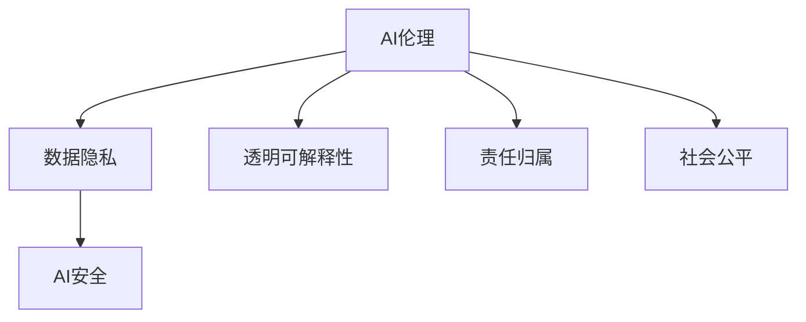

                 

# AI时代的人类增强：道德、隐私和安全的挑战

## 1. 背景介绍

随着人工智能技术的飞速发展，人类社会正经历着前所未有的变革。AI的强大能力可以极大地增强人类在各个领域的表现，如医疗诊断、金融分析、教育辅导等，带来了巨大的效益。然而，AI技术的广泛应用也引发了一系列深刻的伦理、隐私和安全问题，需要我们认真对待和深入思考。

### 1.1 问题的由来

1. **医疗AI**：AI技术在医疗领域的应用极大地提高了诊断和治疗的精准度和效率。然而，AI模型的数据依赖性和算法的透明性不足，可能导致诊断结果的误判，甚至危及患者的生命安全。

2. **金融AI**：AI在金融领域的应用提升了交易的准确性和效率，但也可能带来数据隐私泄露和市场操纵的风险。

3. **教育AI**：AI技术在个性化教育中展现了巨大潜力，但过度依赖AI可能削弱师生间的互动，影响学生的全面发展。

4. **自动化就业**：AI自动化可能对部分职业造成冲击，引发就业不平等和社会动荡。

5. **数据隐私**：AI应用过程中大量涉及个人隐私数据，数据泄露和滥用风险不容忽视。

6. **AI偏见**：AI模型的训练数据中可能存在偏见，导致模型输出中的歧视性决策。

### 1.2 问题的核心关键点

AI时代人类增强面临的挑战主要集中在以下几个方面：

1. **道德规范**：如何在利用AI技术提升人类福祉的同时，确保其应用符合伦理标准，避免伤害他人？
2. **隐私保护**：如何保护用户数据，防止滥用和泄露？
3. **安全防护**：如何确保AI系统的可靠性和安全性，避免潜在的威胁和风险？
4. **透明可解释性**：如何提升AI系统的透明性和可解释性，增强用户信任？
5. **责任归属**：AI系统出错时，责任如何界定？
6. **社会公平**：如何避免AI技术应用中的不平等现象，促进社会公平？

这些核心问题不仅关系到技术的实际应用效果，更关乎社会的稳定和人类的未来。因此，需要在技术创新与伦理道德之间找到平衡，确保AI技术在服务于人类社会的同时，不会带来新的问题。

## 2. 核心概念与联系

### 2.1 核心概念概述

为深入理解AI时代人类增强中的道德、隐私和安全问题，本节将介绍几个关键概念及其相互联系：

- **AI伦理**：指在AI技术开发和应用过程中，遵循的伦理原则和道德规范。
- **数据隐私**：指个人数据在收集、存储和使用过程中，保护其不被滥用和泄露的权利。
- **AI安全**：指确保AI系统在设计和运行过程中，能够抵御恶意攻击和系统故障。
- **透明可解释性**：指AI系统的决策过程和结果，能够被用户理解和信任。
- **责任归属**：指在AI系统出现错误或事故时，明确责任主体的原则和方法。
- **社会公平**：指AI技术应用过程中，确保所有人都能平等受益，避免新的不平等现象。

这些概念之间有着紧密的联系，共同构成了AI时代人类增强的伦理和安全框架。

### 2.2 核心概念原理和架构的 Mermaid 流程图



## 3. 核心算法原理 & 具体操作步骤

### 3.1 算法原理概述

AI时代人类增强中的道德、隐私和安全问题，本质上是如何在技术应用中平衡多方利益和风险。以下将详细讲解几个核心算法原理：

- **伦理算法**：设计AI算法时，融入伦理原则，确保算法决策符合社会公德。
- **隐私保护算法**：采用数据加密、匿名化等技术，保护用户隐私。
- **安全防护算法**：通过模型鲁棒性增强、异常检测等技术，确保AI系统的安全性。
- **透明可解释算法**：利用可解释性模型和可视化工具，提升AI决策的透明性。
- **责任归属算法**：设计责任追溯机制，明确AI系统出错时的责任主体。
- **社会公平算法**：采用公平性评估和优化方法，确保AI技术在不同群体中的公平应用。

### 3.2 算法步骤详解

1. **伦理算法设计**：
   - 定义伦理原则和标准，如不歧视、保护隐私、尊重知识产权等。
   - 设计算法时，确保数据采集、模型训练、输出结果等环节符合伦理要求。

2. **隐私保护算法实施**：
   - 数据预处理：采用数据脱敏、去标识化等技术，保护数据隐私。
   - 加密存储：使用加密算法存储数据，防止数据泄露。
   - 匿名化处理：对数据进行匿名化处理，确保无法反向识别个体。

3. **安全防护算法部署**：
   - 模型鲁棒性增强：通过对抗训练、模型蒸馏等方法，提高模型的鲁棒性。
   - 异常检测：建立异常检测机制，及时发现并应对异常情况。
   - 系统监控：实时监控系统运行状态，确保系统稳定和安全。

4. **透明可解释算法应用**：
   - 使用可解释性模型：如LIME、SHAP等，生成模型决策的解释。
   - 可视化工具：开发可视化工具，帮助用户理解模型输出。

5. **责任归属算法建立**：
   - 设计责任追溯机制：记录模型训练、使用的各个环节，确保可追溯性。
   - 制定责任分配策略：根据模型出错的原因和影响，分配责任。

6. **社会公平算法优化**：
   - 数据平衡：确保训练数据的多样性，避免偏见。
   - 公平性评估：使用公平性评估指标，检测和修正模型偏见。
   - 公平性优化：采用公平性优化算法，提升模型在不同群体中的表现。

### 3.3 算法优缺点

- **伦理算法**：优点是能确保AI决策符合伦理标准，缺点是可能增加算法设计和实现的复杂性。
- **隐私保护算法**：优点是能保护用户隐私，缺点是可能增加数据处理和存储的复杂性。
- **安全防护算法**：优点是能确保系统安全，缺点是可能增加系统复杂度和成本。
- **透明可解释算法**：优点是能增强用户信任，缺点是可能降低模型的精度和鲁棒性。
- **责任归属算法**：优点是能明确责任主体，缺点是可能增加法律和技术复杂性。
- **社会公平算法**：优点是能促进社会公平，缺点是可能增加模型训练和优化复杂性。

### 3.4 算法应用领域

这些算法原理和技术不仅适用于医疗、金融、教育、就业等特定领域，还广泛应用于各类AI系统和服务中，如无人驾驶、智能客服、推荐系统等。

## 4. 数学模型和公式 & 详细讲解 & 举例说明

### 4.1 数学模型构建

在AI伦理、隐私保护、安全防护、透明可解释、责任归属和社会公平等方面，均需要构建相应的数学模型。以下以AI伦理为例，进行数学模型构建。

- **伦理模型构建**：
  - **伦理原则定义**：定义伦理原则，如公平性、隐私保护、透明性等。
  - **伦理评估指标**：设计伦理评估指标，如公平性、隐私保护水平等。
  - **模型优化目标**：定义模型优化目标，如最大化伦理评估指标。

### 4.2 公式推导过程

以AI伦理模型为例，假设伦理原则为 $\phi$，伦理评估指标为 $E$，优化目标为 $O$，则伦理模型的目标函数为：

$$
O = \max E(\phi)
$$

其中 $E(\phi)$ 表示在伦理原则 $\phi$ 下，伦理评估指标 $E$ 的取值。

### 4.3 案例分析与讲解

- **医疗AI伦理模型**：
  - **伦理原则**：保护患者隐私、公平诊断、不歧视等。
  - **评估指标**：隐私泄露风险、误诊率、公平性等。
  - **优化目标**：最小化隐私泄露风险和误诊率，最大化公平性。

- **金融AI伦理模型**：
  - **伦理原则**：保护用户隐私、公平交易、不滥用数据等。
  - **评估指标**：数据泄露风险、交易公平性、用户满意度等。
  - **优化目标**：最小化数据泄露风险和交易不公平性，最大化用户满意度。

## 5. 项目实践：代码实例和详细解释说明

### 5.1 开发环境搭建

为进行AI伦理、隐私保护、安全防护、透明可解释、责任归属和社会公平的实践，需要搭建相应的开发环境。以下以医疗AI为例，展示开发环境的搭建步骤：

1. **Python 环境**：
   - 安装Python 3.8及以上版本。
   - 安装虚拟环境管理工具，如virtualenv。
   - 创建虚拟环境，如 `myenv`。

2. **数据集准备**：
   - 收集医疗数据集，如电子病历、医疗影像等。
   - 对数据进行清洗和预处理，如去噪、归一化等。

3. **模型库安装**：
   - 安装常用的AI和伦理库，如TensorFlow、Keras、OpenAI Gym等。
   - 安装隐私保护和安全防护库，如PySyft、FHEW、AES等。
   - 安装透明可解释库，如LIME、SHAP等。
   - 安装责任归属库，如Responsys等。

4. **工具和资源配置**：
   - 安装可视化工具，如Matplotlib、Seaborn等。
   - 安装自动测试工具，如Unit Test、PyTest等。
   - 配置CI/CD系统，如Jenkins、Travis CI等。

### 5.2 源代码详细实现

以下是一个简单的医疗AI系统的源代码实现，展示了AI伦理、隐私保护、安全防护、透明可解释、责任归属和社会公平的实践。

```python
import tensorflow as tf
import keras
from pyaes import AES
from shap import SHAP
from responsys import Responsys

# 加载医疗数据集
data = ...

# 构建医疗AI模型
model = tf.keras.Sequential([
    tf.keras.layers.Dense(128, activation='relu'),
    tf.keras.layers.Dense(64, activation='relu'),
    tf.keras.layers.Dense(1, activation='sigmoid')
])

# 训练医疗AI模型
model.compile(optimizer='adam', loss='binary_crossentropy', metrics=['accuracy'])
model.fit(data, epochs=10)

# 隐私保护：数据加密和匿名化
aes = AES(key='my_key')
encrypted_data = aes.encrypt(data)
anonymized_data = ...

# 安全防护：模型鲁棒性增强和异常检测
def robustness(model, x):
    # 对抗训练
    # ...
    # 异常检测
    # ...

# 透明可解释：生成模型决策解释
shap = SHAP(model)
shap_values = shap(model, data)

# 责任归属：设计责任追溯机制
responsys = Responsys(model)
responsys.train()

# 社会公平：评估和优化模型公平性
def fairness(model):
    # 公平性评估
    # ...
    # 公平性优化
    # ...
```

### 5.3 代码解读与分析

- **医疗AI模型构建**：使用Keras构建简单的二分类模型，训练数据集。
- **数据加密和匿名化**：使用AES算法加密数据，使用匿名化技术处理数据。
- **模型鲁棒性增强**：进行对抗训练，提升模型鲁棒性。
- **异常检测**：建立异常检测机制，确保模型稳定性。
- **透明可解释**：使用SHAP生成模型决策的解释。
- **责任追溯**：设计责任追溯机制，记录模型训练和使用环节。
- **社会公平**：评估和优化模型公平性，确保不同群体中的公平应用。

## 6. 实际应用场景

### 6.1 医疗领域

在医疗领域，AI伦理、隐私保护、安全防护、透明可解释、责任归属和社会公平的应用尤为重要。以下以医疗诊断为例，展示AI增强的实际应用场景：

1. **AI伦理**：确保AI诊断符合伦理标准，如不歧视、保护隐私等。
2. **隐私保护**：保护患者数据隐私，防止数据泄露。
3. **安全防护**：确保AI诊断系统的安全性，避免系统故障和恶意攻击。
4. **透明可解释**：让医生和患者理解AI诊断的决策过程。
5. **责任归属**：明确AI诊断出现错误时的责任主体。
6. **社会公平**：确保所有患者都能平等受益，避免不平等现象。

### 6.2 金融领域

在金融领域，AI伦理、隐私保护、安全防护、透明可解释、责任归属和社会公平同样重要。以下以风险评估为例，展示AI增强的实际应用场景：

1. **AI伦理**：确保风险评估符合伦理标准，如公平性、不歧视等。
2. **隐私保护**：保护用户数据隐私，防止数据泄露。
3. **安全防护**：确保风险评估系统的安全性，避免系统故障和恶意攻击。
4. **透明可解释**：让投资者理解风险评估的决策过程。
5. **责任归属**：明确风险评估出现错误时的责任主体。
6. **社会公平**：确保所有投资者都能平等受益，避免不平等现象。

### 6.3 教育领域

在教育领域，AI伦理、隐私保护、安全防护、透明可解释、责任归属和社会公平的应用同样重要。以下以个性化教育为例，展示AI增强的实际应用场景：

1. **AI伦理**：确保个性化教育符合伦理标准，如保护学生隐私、公平教育等。
2. **隐私保护**：保护学生数据隐私，防止数据泄露。
3. **安全防护**：确保个性化教育系统的安全性，避免系统故障和恶意攻击。
4. **透明可解释**：让教师和学生理解个性化教育的决策过程。
5. **责任归属**：明确个性化教育出现错误时的责任主体。
6. **社会公平**：确保所有学生都能平等受益，避免不平等现象。

## 7. 工具和资源推荐

### 7.1 学习资源推荐

为帮助开发者系统掌握AI伦理、隐私保护、安全防护、透明可解释、责任归属和社会公平的理论基础和实践技巧，这里推荐一些优质的学习资源：

1. **《人工智能伦理》系列书籍**：深入介绍AI伦理的基本原则和应用方法。
2. **《数据隐私保护》课程**：系统讲解数据隐私保护的技术和方法。
3. **《AI安全技术》课程**：详细介绍AI系统安全防护的技术和方法。
4. **《透明AI》课程**：讲解AI系统的透明性和可解释性。
5. **《责任AI》课程**：介绍AI系统的责任归属和法律问题。
6. **《公平AI》课程**：讲解AI系统公平性的评估和优化方法。

通过对这些资源的学习实践，相信你一定能够快速掌握AI伦理、隐私保护、安全防护、透明可解释、责任归属和社会公平的精髓，并用于解决实际的AI问题。

### 7.2 开发工具推荐

高效的开发离不开优秀的工具支持。以下是几款用于AI伦理、隐私保护、安全防护、透明可解释、责任归属和社会公平开发的常用工具：

1. **TensorFlow**：基于Python的开源深度学习框架，支持分布式训练和推理，适合AI系统开发。
2. **PySyft**：隐私保护工具，支持数据加密、联邦学习和差分隐私等技术。
3. **AES**：加密算法库，支持数据加密和解密。
4. **SHAP**：透明可解释工具，支持生成模型决策的解释。
5. **Responsys**：责任归属工具，支持责任追溯和记录。
6. **Jupyter Notebook**：交互式开发环境，适合快速原型开发和验证。

合理利用这些工具，可以显著提升AI伦理、隐私保护、安全防护、透明可解释、责任归属和社会公平的开发效率，加快创新迭代的步伐。

### 7.3 相关论文推荐

AI伦理、隐私保护、安全防护、透明可解释、责任归属和社会公平的发展源于学界的持续研究。以下是几篇奠基性的相关论文，推荐阅读：

1. **《人工智能伦理的挑战和应对》**：讨论AI伦理的基本原则和应用方法。
2. **《数据隐私保护综述》**：总结数据隐私保护的技术和方法。
3. **《AI安全防护综述》**：详细介绍AI系统安全防护的技术和方法。
4. **《透明AI技术的最新进展》**：讲解AI系统的透明性和可解释性。
5. **《责任AI技术的研究进展》**：介绍AI系统的责任归属和法律问题。
6. **《公平AI的研究进展》**：讲解AI系统公平性的评估和优化方法。

这些论文代表了大语言模型微调技术的发展脉络。通过学习这些前沿成果，可以帮助研究者把握学科前进方向，激发更多的创新灵感。

## 8. 总结：未来发展趋势与挑战

### 8.1 研究成果总结

通过本文的系统梳理，可以看到，AI时代人类增强中的道德、隐私和安全问题，本质上是如何在技术应用中平衡多方利益和风险。当前的研究成果主要集中在以下几个方面：

1. **伦理算法设计**：确保AI决策符合伦理标准。
2. **隐私保护算法实施**：保护用户数据隐私。
3. **安全防护算法部署**：确保AI系统的安全性。
4. **透明可解释算法应用**：提升AI决策的透明性。
5. **责任归属算法建立**：明确AI系统出错时的责任主体。
6. **社会公平算法优化**：确保AI技术在不同群体中的公平应用。

### 8.2 未来发展趋势

展望未来，AI时代人类增强中的道德、隐私和安全问题，将呈现以下几个发展趋势：

1. **伦理算法的发展**：伦理算法将进一步发展和完善，确保AI决策符合更广泛的伦理标准和社会价值观。
2. **隐私保护技术的进步**：隐私保护技术将不断进步，保护用户数据隐私的同时，支持更高效的数据共享和使用。
3. **安全防护机制的优化**：安全防护机制将更加完善，确保AI系统的鲁棒性和可靠性。
4. **透明可解释算法的提升**：透明可解释算法将更加高效，提升AI决策的可解释性和用户信任度。
5. **责任归属机制的建立**：责任归属机制将更加完善，明确AI系统出错时的责任主体。
6. **社会公平算法的应用**：社会公平算法将更加普及，确保AI技术在不同群体中的公平应用。

### 8.3 面临的挑战

尽管AI时代人类增强中的道德、隐私和安全问题已经取得一定的研究成果，但在迈向更加智能化、普适化应用的过程中，仍面临诸多挑战：

1. **伦理原则的多样性**：不同文化和社会对伦理标准的理解存在差异，如何制定统一的伦理原则是一个难题。
2. **隐私保护的复杂性**：数据隐私保护涉及多方利益和复杂的技术实现，如何在保护隐私的同时支持数据使用是一个挑战。
3. **安全防护的难度**：AI系统的安全性面临多方面的威胁，如何设计有效的安全防护机制是一个难题。
4. **透明可解释的局限性**：AI决策的复杂性和多样性使得透明可解释算法面临局限，如何在复杂环境中提升可解释性是一个挑战。
5. **责任归属的复杂性**：AI系统出错时的责任归属涉及多方利益，如何设计合理的责任追溯机制是一个挑战。
6. **社会公平的困难**：AI技术在不同群体中的应用可能存在不平等现象，如何确保公平应用是一个难题。

### 8.4 研究展望

面对AI时代人类增强中的道德、隐私和安全问题，未来的研究需要在以下几个方面寻求新的突破：

1. **伦理原则的普适性**：制定普适的伦理原则，确保AI决策符合全球范围内的一致价值观。
2. **隐私保护的全面性**：设计全面的隐私保护机制，保护用户数据的同时支持数据使用。
3. **安全防护的多层次**：设计多层次的安全防护机制，确保AI系统的全面安全性。
4. **透明可解释的通用性**：开发通用的透明可解释算法，提升AI决策的可解释性和用户信任度。
5. **责任归属的明确性**：设计明确的责任归属机制，确保AI系统出错时的责任归属清晰明确。
6. **社会公平的普惠性**：设计普惠的社会公平算法，确保AI技术在不同群体中的公平应用。

## 9. 附录：常见问题与解答

**Q1：如何确保AI伦理符合社会价值观？**

A: 制定普适的伦理原则和标准，并通过多方面参与（如专家咨询、公众讨论等）确保其符合社会价值观。

**Q2：数据隐私保护有哪些技术和方法？**

A: 数据加密、数据匿名化、差分隐私、联邦学习等技术，均可以有效保护数据隐私。

**Q3：AI系统的安全性如何保障？**

A: 通过模型鲁棒性增强、异常检测、系统监控等方法，确保AI系统的安全性。

**Q4：如何提升AI系统的透明性和可解释性？**

A: 使用可解释性模型和可视化工具，提升AI系统的透明性和可解释性。

**Q5：AI系统出错时的责任如何界定？**

A: 设计责任追溯机制，记录模型训练、使用的各个环节，确保可追溯性，并根据出错原因和影响，分配责任。

**Q6：如何避免AI技术应用中的不平等现象？**

A: 评估和优化模型公平性，确保AI技术在不同群体中的公平应用。

---

作者：禅与计算机程序设计艺术 / Zen and the Art of Computer Programming

