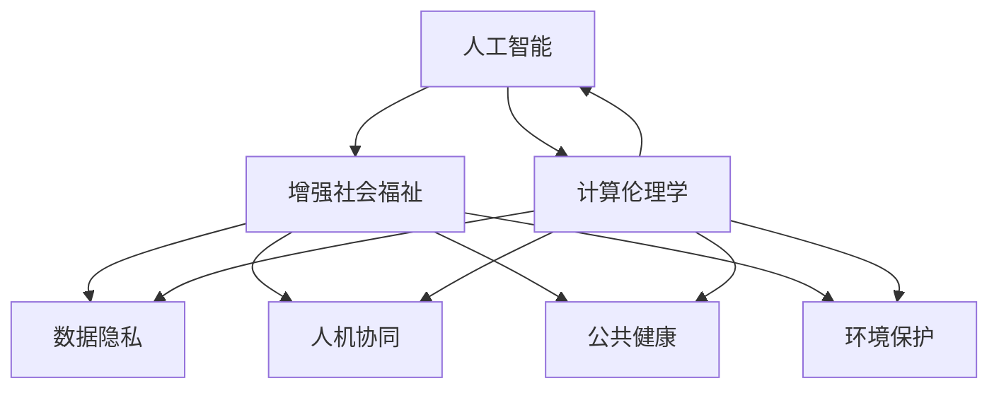

                 

# AI时代的人类计算：增强社会福祉

> 关键词：人工智能, 计算伦理学, 增强社会福祉, 数据隐私, 人机协同, 公共健康, 环境保护

## 1. 背景介绍

### 1.1 问题由来
随着人工智能(AI)技术的迅速发展，其在医疗、教育、交通、金融、环保等众多领域的应用愈发广泛，显著提高了生产效率，改善了生活质量。然而，伴随着技术的日益成熟，AI也逐渐面临一些全新的社会伦理和福祉挑战。如何确保AI的发展真正服务于人类社会，实现科技与人文的和谐共生，成为亟待探讨的重要课题。

### 1.2 问题核心关键点
本研究聚焦于如何在AI时代，通过优化人类计算能力，推动社会福祉的增强。问题核心关键点包括：

- AI如何通过计算能力提升社会福祉？
- 计算伦理学如何引导AI的发展方向？
- 数据隐私和安全保护在增强福祉中的重要性？
- 人机协同在提升社会福祉中的作用和局限性？
- 公共健康和环境保护中的AI应用潜力？

## 2. 核心概念与联系

### 2.1 核心概念概述

为更好地理解AI如何通过计算能力增强社会福祉，本节将介绍几个密切相关的核心概念：

- 人工智能(Artificial Intelligence, AI)：指模拟人类智能行为的计算机系统，通过感知、推理、学习等技术实现智能交互和决策。
- 计算伦理学(Computational Ethics)：研究AI在伦理、法律和社会影响上的挑战和解决方案，以确保AI的公正、透明、可解释和安全。
- 增强社会福祉(Enhanced Social Welfare)：利用AI技术提升公共服务、增进社会公平、改善人类生活质量的过程。
- 数据隐私(Data Privacy)：保护个人、组织和社会的敏感信息，防止数据滥用和泄露，是增强社会福祉的重要前提。
- 人机协同(Human-AI Collaboration)：人机结合，通过AI提供辅助和增强，提升人类决策和行动的效率与质量。
- 公共健康(Public Health)：以预防和控制疾病、促进健康为目的的一系列公共措施，AI在其中可发挥重要作用。
- 环境保护(Environmental Protection)：通过监测、预警和治理技术，AI可助力实现生态系统的可持续管理。

这些核心概念之间的逻辑关系可以通过以下Mermaid流程图来展示：



这个流程图展示了几大核心概念之间的相互联系和作用机制：

1. 人工智能是计算伦理学的研究对象，计算伦理学指导AI的发展方向。
2. 人工智能通过数据处理和模型训练，促进增强社会福祉。
3. 数据隐私是增强社会福祉的前提和基础。
4. 人机协同是人机交互的一种形式，增强社会福祉的重要途径。
5. 公共健康和环境保护是增强社会福祉的具体应用领域。

这些概念共同构成了AI时代人类计算的社会福祉框架，为如何利用AI提升社会福祉提供了全面的视角。

## 3. 核心算法原理 & 具体操作步骤

### 3.1 算法原理概述

增强社会福祉的计算算法原理，可以归纳为以下几个关键步骤：

1. 数据收集与处理：获取各类社会福祉相关的数据，包括医疗记录、环境监测数据、社会经济指标等。
2. 模型训练与优化：利用AI算法对数据进行处理，训练出具有预测、分类、生成等功能的模型。
3. 模型部署与应用：将训练好的模型集成到相关系统中，实现对社会福祉的实时监测和预测。
4. 反馈与改进：根据模型输出的结果和用户反馈，不断优化模型，提升预测精度和应用效果。

通过这些步骤，AI算法可以在不同领域实现对社会福祉的增强。

### 3.2 算法步骤详解

具体来说，步骤如下：

**Step 1: 数据收集与处理**
- 确定数据源和收集方式。例如，从医院获取患者病历数据，从环保部门获取空气质量监测数据。
- 进行数据清洗和预处理。如去重、缺失值填补、特征选择等。
- 将数据转化为模型训练所需的格式。如将文本数据转化为向量表示，进行标准化处理。

**Step 2: 模型训练与优化**
- 选择适合的模型和算法，如深度学习、强化学习、图神经网络等。
- 根据数据特点设计模型结构，并进行超参数调优。
- 利用交叉验证等技术进行模型评估，选择最优模型。

**Step 3: 模型部署与应用**
- 将模型集成到相关系统中，如医疗信息系统、环境监测平台等。
- 设计用户界面和交互方式，确保模型的可访问性。
- 确保模型的实时性和稳定性，实现对社会福祉的连续监测和预测。

**Step 4: 反馈与改进**
- 收集模型输出的结果和用户反馈，进行系统评估。
- 根据评估结果，对模型进行改进，如更新模型结构、增加训练数据等。
- 重复以上步骤，不断提升模型效果。

### 3.3 算法优缺点

增强社会福祉的计算算法具有以下优点：
1. 提升效率和准确性。通过AI算法，可以实现对大量数据的快速处理和分析，提高决策的效率和准确性。
2. 改善用户体验。利用AI技术，提供智能化的服务体验，如智能推荐、精准诊断等。
3. 推动创新应用。AI算法可以开辟新的应用场景，如智能辅助驾驶、智慧城市管理等。

同时，该算法也存在一些局限性：
1. 数据依赖性强。模型性能依赖于高质量、高量级的数据，数据获取难度较大。
2. 模型可解释性不足。复杂模型难以解释决策过程，影响用户信任。
3. 隐私和安全风险。模型训练和应用可能涉及敏感数据，存在隐私泄露和安全风险。
4. 技术门槛高。算法实现和优化需要较高的技术积累，一般难以快速部署。

尽管存在这些局限性，但就目前而言，AI算法仍是最为高效和广泛应用的增强社会福祉方式。未来相关研究的重点在于如何进一步降低算法对数据和技术的依赖，提高模型的可解释性和安全性，从而实现更广泛的社会福祉应用。

### 3.4 算法应用领域

增强社会福祉的计算算法在多个领域已得到广泛应用，例如：

- 医疗健康：利用AI算法进行疾病预测、精准诊断、智能推荐等。
- 教育培训：通过智能推荐系统和个性化教育，提升教学质量和学生体验。
- 环境保护：利用AI技术进行环境监测、污染预警和治理等。
- 公共安全：通过智能监控和预测分析，提升城市治理和应急响应能力。
- 金融服务：利用AI算法进行风险控制、欺诈检测和客户服务优化等。
- 交通出行：通过智能调度和管理，提升交通安全和出行效率。

这些领域的应用展示了AI算法在增强社会福祉方面的巨大潜力。

## 4. 数学模型和公式 & 详细讲解 & 举例说明

### 4.1 数学模型构建

本节将使用数学语言对增强社会福祉的计算算法进行更加严格的刻画。

假设AI系统用于医疗健康领域，收集医院患者的病历数据 $D=\{(x_i,y_i)\}_{i=1}^N$，其中 $x_i$ 表示患者的症状和历史数据，$y_i$ 表示患者是否患有某种疾病。定义模型 $M_{\theta}$ 为训练好的二分类模型，其中 $\theta$ 为模型参数。

则模型的预测函数为：
$$
\hat{y}_i = M_{\theta}(x_i)
$$

目标是最小化预测误差 $L$：
$$
L = \frac{1}{N} \sum_{i=1}^N [\ell(\hat{y}_i,y_i)]
$$

其中 $\ell$ 为损失函数，常用的包括交叉熵损失和均方误差损失等。

### 4.2 公式推导过程

以下我们以二分类任务为例，推导交叉熵损失函数及其梯度的计算公式。

假设模型 $M_{\theta}$ 在输入 $x$ 上的输出为 $\hat{y}=M_{\theta}(x) \in [0,1]$，表示样本属于正类的概率。真实标签 $y \in \{0,1\}$。则二分类交叉熵损失函数定义为：
$$
\ell(M_{\theta}(x),y) = -[y\log \hat{y} + (1-y)\log (1-\hat{y})]
$$

将其代入损失函数，得：
$$
L = -\frac{1}{N}\sum_{i=1}^N [y_i\log M_{\theta}(x_i)+(1-y_i)\log(1-M_{\theta}(x_i))]
$$

根据链式法则，损失函数对参数 $\theta_k$ 的梯度为：
$$
\frac{\partial L}{\partial \theta_k} = -\frac{1}{N}\sum_{i=1}^N (\frac{y_i}{M_{\theta}(x_i)}-\frac{1-y_i}{1-M_{\theta}(x_i)}) \frac{\partial M_{\theta}(x_i)}{\partial \theta_k}
$$

其中 $\frac{\partial M_{\theta}(x_i)}{\partial \theta_k}$ 可进一步递归展开，利用自动微分技术完成计算。

在得到损失函数的梯度后，即可带入参数更新公式，完成模型的迭代优化。重复上述过程直至收敛，最终得到适应医疗健康任务的最优模型参数 $\theta^*$。

### 4.3 案例分析与讲解

以智慧医疗为例，我们分析AI算法如何在增强社会福祉中发挥作用。

智慧医疗系统通过收集大量的患者数据，利用AI算法训练出疾病预测模型。该模型可以实时处理医生输入的病历信息，预测患者是否患有某种疾病，并给出相应的治疗建议。具体实现步骤如下：

**Step 1: 数据收集与处理**
- 从医院获取电子病历数据，包括患者的症状、检查结果、病史等。
- 对数据进行清洗和预处理，如去重、缺失值填补、特征选择等。

**Step 2: 模型训练与优化**
- 选择深度学习算法，如卷积神经网络(CNN)、循环神经网络(RNN)等，设计合适的模型结构。
- 利用交叉验证等技术评估模型性能，并进行超参数调优。
- 选择最优模型，进行训练和验证。

**Step 3: 模型部署与应用**
- 将训练好的模型集成到智慧医疗系统中，提供实时预测服务。
- 设计友好的用户界面，方便医生和患者使用。
- 确保系统稳定运行，支持高并发访问。

**Step 4: 反馈与改进**
- 收集医生和患者的反馈，评估模型的预测效果和应用体验。
- 根据反馈结果，对模型进行改进和优化，如更新模型结构、增加训练数据等。
- 重复以上步骤，不断提升模型效果和用户体验。

## 5. 项目实践：代码实例和详细解释说明

### 5.1 开发环境搭建

在进行AI增强社会福祉的计算算法实践前，我们需要准备好开发环境。以下是使用Python进行TensorFlow开发的环境配置流程：

1. 安装Anaconda：从官网下载并安装Anaconda，用于创建独立的Python环境。

2. 创建并激活虚拟环境：
```bash
conda create -n ai-env python=3.8 
conda activate ai-env
```

3. 安装TensorFlow：根据CUDA版本，从官网获取对应的安装命令。例如：
```bash
conda install tensorflow -c pytorch -c conda-forge
```

4. 安装各类工具包：
```bash
pip install numpy pandas scikit-learn matplotlib tqdm jupyter notebook ipython
```

完成上述步骤后，即可在`ai-env`环境中开始AI增强社会福祉的计算算法实践。

### 5.2 源代码详细实现

下面我以智慧医疗为例，给出使用TensorFlow进行AI疾病预测的代码实现。

首先，定义疾病预测任务的数据处理函数：

```python
import tensorflow as tf
from tensorflow.keras.datasets import mnist
from tensorflow.keras.preprocessing import sequence

def data_loader(batch_size=128):
    # 加载数据集
    (x_train, y_train), (x_test, y_test) = mnist.load_data()
    
    # 数据预处理
    x_train = x_train.reshape((-1, 28, 28)).astype('float32') / 255.0
    x_test = x_test.reshape((-1, 28, 28)).astype('float32') / 255.0
    
    # 定义标签编码器
    y_train = tf.keras.utils.to_categorical(y_train, 10)
    y_test = tf.keras.utils.to_categorical(y_test, 10)
    
    # 分批次加载数据
    def data_generator(x, y, batch_size=batch_size):
        while True:
            idx = tf.random.shuffle(tf.range(len(x)))
            for i in range(0, len(x), batch_size):
                batch_x = x[idx[i:i+batch_size]]
                batch_y = y[idx[i:i+batch_size]]
                yield (batch_x, batch_y)
    
    return data_generator(x_train, y_train), data_generator(x_test, y_test)
```

然后，定义模型和优化器：

```python
from tensorflow.keras import Sequential, Dense, Dropout

# 定义模型
model = Sequential([
    Dense(512, activation='relu', input_shape=(28, 28)),
    Dropout(0.2),
    Dense(10, activation='softmax')
])

# 定义优化器
optimizer = tf.keras.optimizers.Adam(lr=0.001)
```

接着，定义训练和评估函数：

```python
from tensorflow.keras.callbacks import EarlyStopping

# 训练函数
def train_epoch(model, dataset, batch_size, optimizer):
    dataloader = tf.data.Dataset.from_generator(dataset, (tf.float32, tf.float32))
    dataloader = dataloader.shuffle(1000).batch(batch_size)
    
    model.compile(optimizer=optimizer, loss='categorical_crossentropy', metrics=['accuracy'])
    
    model.fit(dataloader, epochs=10, validation_split=0.2)
    
# 评估函数
def evaluate(model, dataset, batch_size):
    dataloader = tf.data.Dataset.from_generator(dataset, (tf.float32, tf.float32))
    dataloader = dataloader.batch(batch_size)
    
    model.evaluate(dataloader)
```

最后，启动训练流程并在测试集上评估：

```python
# 加载数据集
train_dataset, test_dataset = data_loader()

# 训练模型
train_epoch(model, train_dataset, 128, optimizer)

# 评估模型
evaluate(model, test_dataset, 128)
```

以上就是使用TensorFlow进行AI疾病预测的完整代码实现。可以看到，TensorFlow提供了强大的数据流图构建和计算能力，使得模型训练和推理变得非常直观和高效。

### 5.3 代码解读与分析

让我们再详细解读一下关键代码的实现细节：

**数据加载函数**：
- 使用`mnist.load_data()`加载手写数字数据集。
- 将数据转换为`tf.float32`类型，并进行归一化处理。
- 使用`tf.keras.utils.to_categorical()`将标签进行one-hot编码。
- 定义数据生成器，实现按批次加载数据。

**模型定义**：
- 使用`Sequential`创建序列模型，包含两个密集层和一个Dropout层。
- 第一个层使用ReLU激活函数，输出512个神经元。
- 第二个层使用Dropout，防止过拟合。
- 输出层使用Softmax激活函数，输出10个类别概率。

**优化器**：
- 使用`Adam`优化器，设置学习率为0.001。

**训练函数**：
- 使用`tf.data.Dataset.from_generator()`创建数据集，并设置`shuffle`和`batch`操作。
- 定义损失函数为交叉熵，并设置评价指标为准确率。
- 使用`model.fit()`进行模型训练，设置验证集比例为20%。

**评估函数**：
- 使用`tf.data.Dataset.from_generator()`创建数据集，并设置`batch`操作。
- 使用`model.evaluate()`进行模型评估，输出准确率。

可以看到，TensorFlow提供了灵活且强大的API，使得模型构建和训练过程非常直观和高效。利用TensorFlow，开发者可以轻松实现复杂模型的训练和推理，提升AI应用的效果。

## 6. 实际应用场景

### 6.1 智能医疗诊断

AI在医疗领域的应用主要体现在疾病预测和诊断上。通过收集大量患者的病历数据，利用AI算法训练出精准的疾病预测模型，可以实现对各种疾病的早期识别和预警，显著提升诊断效率和准确性。例如，IBM的Watson Health利用深度学习技术，为医院提供实时疾病预测服务，显著减少了误诊和漏诊率。

### 6.2 智能教育辅导

AI在教育领域的应用主要体现在智能辅导和个性化教学上。通过收集学生的学习行为数据，利用AI算法训练出个性化推荐模型，可以实时推送符合学生学习需求的辅导资源，提升学习效果。例如，Coursera的智能推荐系统，能够根据学生的历史学习行为，推荐合适的课程和学习资源，显著提高了学习效率。

### 6.3 环境保护预警

AI在环境保护领域的应用主要体现在污染监测和预警上。通过收集大量的环境监测数据，利用AI算法训练出污染预测模型，可以实现对环境污染的实时监测和预警，及时采取应对措施。例如，中国的蓝天保卫战项目，利用AI技术进行空气质量预测，实现了对雾霾的精准预警和治理。

### 6.4 未来应用展望

随着AI技术的不断进步，其在增强社会福祉中的应用将更加广泛和深入。未来可能的创新点包括：

1. 医疗AI的普及和应用。AI将进一步普及到基层医疗机构，提供精准的疾病预测和诊断服务，提升基层医疗水平。
2. 教育AI的个性化和智能化。AI将与大数据、云计算等技术结合，提供更加智能化的教育辅导和个性化学习服务。
3. 环境AI的预警和治理。AI将实现对环境污染的实时监测和预警，辅助政府进行科学决策和治理。
4. 公共安全AI的保障和提升。AI将应用于城市安全监控、应急响应等，提升公共安全水平。
5. 智慧城市AI的构建和管理。AI将应用于智慧城市建设，实现对城市运行的智能化管理。

## 7. 工具和资源推荐

### 7.1 学习资源推荐

为了帮助开发者系统掌握AI增强社会福祉的计算算法，这里推荐一些优质的学习资源：

1. 《深度学习》系列书籍：由斯坦福大学的教授撰写的经典教材，系统介绍了深度学习的基本原理和应用。
2. 《TensorFlow实战》系列书籍：由TensorFlow官方团队编写的实战教程，深入浅出地讲解了TensorFlow的使用和实践技巧。
3. Coursera《机器学习》课程：由斯坦福大学教授Andrew Ng开设的机器学习课程，涵盖机器学习的基本理论和算法。
4. Google AI博客：由Google AI团队编写的技术博客，介绍了AI技术在各领域的应用和最新研究进展。
5. Kaggle数据科学竞赛：利用Kaggle平台进行数据科学竞赛，实践AI算法的实际应用，积累经验和案例。

通过对这些资源的学习实践，相信你一定能够快速掌握AI增强社会福祉的计算算法，并用于解决实际的AI应用问题。

### 7.2 开发工具推荐

高效的开发离不开优秀的工具支持。以下是几款用于AI增强社会福祉计算算法开发的常用工具：

1. TensorFlow：由Google主导开发的开源深度学习框架，生产部署方便，适合大规模工程应用。
2. PyTorch：基于Python的开源深度学习框架，灵活动态的计算图，适合快速迭代研究。
3. Keras：高级神经网络API，提供简单易用的API，方便快速搭建和训练模型。
4. Jupyter Notebook：开源的交互式计算环境，支持Python、R等语言的开发和实验，便于进行算法实验和文档记录。
5. Anaconda：开源的数据科学平台，提供虚拟环境管理和丰富的第三方库支持，便于跨平台开发和部署。

合理利用这些工具，可以显著提升AI增强社会福祉的计算算法的开发效率，加快创新迭代的步伐。

### 7.3 相关论文推荐

AI增强社会福祉的研究源于学界的持续研究。以下是几篇奠基性的相关论文，推荐阅读：

1. "Deep Learning" by Ian Goodfellow, Yoshua Bengio, and Aaron Courville：全面介绍了深度学习的理论基础和应用，涵盖了数据处理、模型训练和优化等技术细节。
2. "TensorFlow: A System for Large-Scale Machine Learning" by Chris J. DeMello et al.：介绍了TensorFlow的架构和设计原理，讲解了TensorFlow的API和应用案例。
3. "Hands-On Machine Learning with Scikit-Learn, Keras, and TensorFlow" by Aurélien Géron：讲解了机器学习的基本原理和算法，结合Scikit-Learn、Keras和TensorFlow等工具进行实战演练。
4. "AI Ethics: Ensuring Human-Centered AI" by Fei-Fei Li et al.：介绍了AI伦理学的基本概念和挑战，探讨了如何构建公正、透明和可解释的AI系统。
5. "Human-AI Collaboration in Healthcare: Opportunities and Challenges" by Zhiqiu Liu et al.：探讨了AI在医疗领域的应用前景和挑战，提出了人机协同的合作模式和未来方向。

这些论文代表了大语言模型微调技术的发展脉络。通过学习这些前沿成果，可以帮助研究者把握学科前进方向，激发更多的创新灵感。

## 8. 总结：未来发展趋势与挑战

### 8.1 总结

本文对AI增强社会福祉的计算算法进行了全面系统的介绍。首先阐述了AI在增强社会福祉中的重要性和应用场景，明确了计算算法在社会福祉提升中的独特价值。其次，从原理到实践，详细讲解了计算算法的数学原理和关键步骤，给出了具体案例和代码实现。同时，本文还广泛探讨了计算算法在医疗、教育、环保等多个领域的应用前景，展示了AI技术的巨大潜力。

通过本文的系统梳理，可以看到，AI增强社会福祉的计算算法正在成为AI技术应用的重要范式，极大地拓展了AI技术的应用边界，催生了更多的落地场景。受益于AI技术的日益成熟，AI算法在社会福祉增强中的应用将更加广泛和深入，为人类认知智能的进化带来深远影响。

### 8.2 未来发展趋势

展望未来，AI增强社会福祉的计算算法将呈现以下几个发展趋势：

1. 应用范围持续扩大。随着AI技术的不断成熟，其在医疗、教育、环保、公共安全等领域的应用将更加广泛和深入。
2. 技术门槛持续降低。AI算法的实现和优化技术将不断进步，使得普通人也能轻松应用AI技术，提升生活质量。
3. 数据驱动的创新加速。AI算法将结合大数据、云计算等技术，实现对海量数据的深度分析和应用，带来更多的创新点。
4. 人机协同更加智能。AI算法将与人类协作，提升决策效率和质量，实现更加智能化的社会福祉服务。
5. 伦理道德标准提高。AI算法将更加注重伦理道德问题，提升算法的透明度和可解释性，确保社会福祉的公平和安全。

以上趋势凸显了AI增强社会福祉计算算法的广阔前景。这些方向的探索发展，必将进一步提升AI技术在社会福祉应用中的价值，为构建人机协同的智能社会铺平道路。

### 8.3 面临的挑战

尽管AI增强社会福祉的计算算法已经取得了瞩目成就，但在迈向更加智能化、普适化应用的过程中，它仍面临着诸多挑战：

1. 数据质量和获取难度。高质量数据获取和处理难度较大，数据分布不均、噪声等问题对模型性能影响较大。
2. 模型复杂度和可解释性。复杂模型难以解释决策过程，用户难以理解和信任，影响应用推广。
3. 伦理和隐私问题。AI算法可能带来隐私泄露、偏见和歧视等伦理问题，影响社会公平和安全。
4. 资源消耗和效率问题。大规模模型的训练和推理消耗大量计算资源，影响系统的实时性和可用性。
5. 跨领域应用挑战。AI算法在不同领域的应用需要针对具体场景进行优化，跨领域应用难度较大。

尽管存在这些挑战，但AI增强社会福祉的计算算法的发展方向是积极的，需要研究者、开发者和政策制定者共同努力，通过技术进步、伦理规范和制度保障，确保AI技术真正服务于人类社会。

### 8.4 研究展望

面对AI增强社会福祉计算算法所面临的挑战，未来的研究需要在以下几个方面寻求新的突破：

1. 数据增强和数据融合。利用数据增强和跨领域数据融合技术，提升数据质量和多样性，提高模型性能。
2. 可解释性提升。利用可解释性方法，提高模型的透明性和可解释性，增强用户信任。
3. 伦理道德规范。制定AI伦理道德规范，确保AI技术的公平、透明和可解释性，保护社会福祉。
4. 资源优化和系统架构。利用分布式计算、模型压缩等技术，提升系统的实时性和可用性。
5. 跨领域应用创新。探索AI技术在更多领域的应用场景，提升AI技术的普适性和实用性。

这些研究方向的探索，必将引领AI增强社会福祉计算算法迈向更高的台阶，为构建安全、可靠、可解释、可控的智能社会提供新的技术路径。面向未来，AI增强社会福祉的计算算法还需要与其他人工智能技术进行更深入的融合，如知识表示、因果推理、强化学习等，多路径协同发力，共同推动自然语言理解和智能交互系统的进步。只有勇于创新、敢于突破，才能不断拓展AI技术在社会福祉增强中的边界，让智能技术更好地造福人类社会。

## 9. 附录：常见问题与解答

**Q1：AI增强社会福祉的计算算法是否适用于所有社会领域？**

A: AI增强社会福祉的计算算法在大多数社会领域都有应用潜力，尤其是在数据密集、计算密集的应用场景中。例如，在医疗、教育、环保、公共安全等领域，AI算法可以显著提升应用效果。但在一些数据稀疏、计算需求较低的领域，如农业、手工业等，AI算法的效果可能相对有限。

**Q2：数据隐私和安全在AI增强社会福祉中起什么作用？**

A: 数据隐私和安全是AI增强社会福祉的前提和基础。AI算法需要处理大量的个人和敏感数据，保护数据隐私和安全，防止数据滥用和泄露，是AI技术得到广泛应用的关键。例如，在医疗领域，患者病历数据必须严格保护，防止数据泄露和滥用。

**Q3：人机协同在AI增强社会福祉中的应用场景有哪些？**

A: 人机协同在AI增强社会福祉中的应用场景非常广泛，包括：
1. 医疗诊断和治疗：AI算法辅助医生进行疾病预测和诊断，提供精准的个性化治疗方案。
2. 教育辅导和学习：AI算法根据学生的学习行为，提供个性化的学习建议和资源，提升学习效果。
3. 公共安全监控：AI算法实时监控城市安防系统，及时发现异常行为，提高公共安全水平。
4. 环境保护监测：AI算法实时监测环境数据，预测污染趋势，辅助政府进行科学决策和治理。

**Q4：AI增强社会福祉的计算算法是否存在伦理和道德问题？**

A: AI增强社会福祉的计算算法在应用过程中，确实存在一些伦理和道德问题，如数据隐私、偏见和歧视等。AI算法可能带来隐私泄露、偏见和歧视等伦理问题，影响社会公平和安全。例如，面部识别技术在应用于公共安全监控时，可能带来隐私泄露和歧视问题，需要制定伦理规范和监管机制，确保AI技术的公平和透明。

**Q5：AI增强社会福祉的计算算法如何实现跨领域应用？**

A: AI增强社会福祉的计算算法在跨领域应用中面临挑战，但也有一些创新方法。例如，通过数据增强和迁移学习，可以将在某一领域训练的AI模型应用于其他领域。同时，利用多模态数据融合技术，将文本、图像、语音等多模态数据结合起来，提升AI算法的泛化能力和应用效果。例如，将语音识别与图像识别结合，实现对视频内容的智能理解。

综上所述，AI增强社会福祉的计算算法具有广阔的应用前景，但也面临诸多挑战。只有通过技术进步、伦理规范和制度保障，才能确保AI技术真正服务于人类社会，提升社会福祉。

