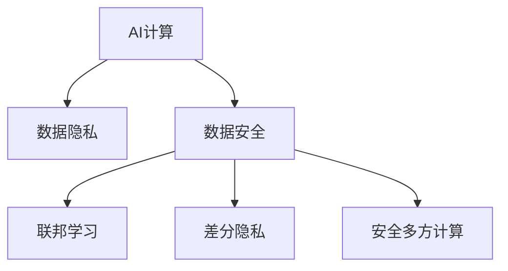

                 

# AI时代的人类计算：隐私考虑

> 关键词：AI计算, 隐私保护, 数据安全, 联邦学习, 差分隐私, 安全多方计算

## 1. 背景介绍

### 1.1 问题由来
随着人工智能(AI)技术的迅猛发展，AI计算已逐渐成为现代社会不可或缺的一部分。从医疗诊断、智能推荐、自动驾驶到金融风控，AI技术正以各种形式融入到我们的生活和工作中。然而，AI的强大计算能力同时也伴随着数据隐私和安全问题。如何在充分利用AI技术的同时，保障数据隐私和安全，成为当下亟需解决的重要问题。

### 1.2 问题核心关键点
数据隐私和安全是AI计算面临的主要挑战。AI技术通常依赖大规模数据进行训练和推理，但这些数据往往包含敏感的个人信息和商业机密。如何在数据共享和利用中，确保用户隐私不被侵犯，是AI计算中的核心问题。

## 2. 核心概念与联系

### 2.1 核心概念概述

为更好地理解AI时代隐私保护技术的原理和应用，本节将介绍几个密切相关的核心概念：

- AI计算：以机器学习为代表的高级计算形式，利用算法和大数据进行智能决策和推理。
- 数据隐私：指在数据处理、存储和共享过程中，确保个人信息不被非法获取、使用或泄露。
- 数据安全：指在数据传输、存储和使用过程中，保护数据不受未授权访问和篡改，保障数据完整性。
- 联邦学习(Federated Learning)：一种分布式机器学习技术，允许模型在多个参与方之间进行协作学习，但无需共享原始数据。
- 差分隐私(Differential Privacy)：一种隐私保护技术，通过在统计结果中添加噪声，保证个体数据无法被逆推，保护用户隐私。
- 安全多方计算(Secure Multi-Party Computation)：一种协议，允许多个参与方在不共享数据的情况下，协同计算输出结果，保护数据隐私。

这些核心概念之间的逻辑关系可以通过以下Mermaid流程图来展示：



这个流程图展示了大数据和AI计算时代隐私保护的核心概念及其之间的关系：

1. AI计算的广泛应用，使得数据隐私和安全问题更为突出。
2. 联邦学习、差分隐私和安全多方计算等隐私保护技术，是确保数据安全的重要手段。
3. 这些技术可以协同工作，共同构建数据共享和利用的隐私保护体系。

## 3. 核心算法原理 & 具体操作步骤
### 3.1 算法原理概述

AI计算的隐私保护涉及算法和协议两个层面：

- 算法层面：通过设计隐私保护的机器学习算法，在模型训练和推理过程中保护数据隐私。
- 协议层面：利用密码学和多方计算协议，确保数据在传输、存储和计算过程中的安全。

**算法层面**：
- 差分隐私：通过在模型输出中引入噪声，使得任何个体数据的逆推均不可行。
- 联邦学习：通过在模型参数空间内进行分布式优化，避免原始数据集上传和交换。
- 安全多方计算：通过多方计算协议，确保各参与方仅使用其自身的输入数据，计算并输出最终结果。

**协议层面**：
- 同态加密：允许在不解密的情况下对加密数据进行计算。
- 零知识证明：确保一方仅通过证明传递信息，而不泄露具体内容。
- 匿名化技术：将数据中的个体信息隐藏，保证数据集在统计和分析中的匿名性。

### 3.2 算法步骤详解

以下是基于差分隐私和联邦学习的基本步骤，详细描述其实现过程：

#### 差分隐私

**Step 1: 设定隐私预算和噪声函数**
- 设定最大隐私预算 $\epsilon$，表示允许的最大隐私损失。
- 选择合适的噪声函数 $N(\mu, \sigma^2)$，其中 $\mu$ 是均值，$\sigma^2$ 是方差，用于引入噪声。

**Step 2: 添加噪声**
- 对模型输出 $y$ 添加噪声 $N$，得到新输出 $y' = y + N$。
- 设新输出的期望值 $\mathbb{E}[y'] = y + \mu$。

**Step 3: 计算模型结果**
- 通过差分隐私机制，计算 $y'$ 并返回给用户，同时确保隐私预算不被超过。
- 使用随机梯度下降等优化算法，最小化模型损失，并不断调整模型参数。

#### 联邦学习

**Step 1: 分布式数据集划分**
- 将参与方（如移动设备、服务器）的数据集划分为多个子集，每个子集仅在本地设备上存储。

**Step 2: 模型初始化**
- 初始化全局模型参数 $\theta_0$，并设置本地模型 $\theta_i$，初始化值为 $\theta_0$。

**Step 3: 本地模型更新**
- 每个参与方在本地数据集上训练模型 $\theta_i$，更新局部梯度 $g_i$。

**Step 4: 参数聚合**
- 将每个参与方的局部梯度 $g_i$ 进行聚合，得到全局梯度 $g$。
- 使用安全多方计算协议，计算全局梯度的均值和方差，并更新全局模型参数 $\theta_{i+1} = \theta_i - \eta g$。

**Step 5: 参数广播**
- 将更新后的全局模型参数 $\theta_{i+1}$ 广播给所有参与方，作为下一次迭代的初始参数。

### 3.3 算法优缺点

差分隐私和联邦学习在隐私保护方面各有优缺点：

- 差分隐私
  - 优点：能够有效保护个体隐私，适用于分布式数据集。
  - 缺点：噪声引入可能导致模型精度下降，隐私预算需要合理设定。

- 联邦学习
  - 优点：保留了数据的本地性，避免了数据泄露风险。
  - 缺点：需要处理复杂的通信和协作协议，算法复杂度较高。

### 3.4 算法应用领域

基于差分隐私和联邦学习的隐私保护方法，已经在多个领域得到应用：

- 医疗健康：使用差分隐私技术保护患者隐私，联邦学习训练个性化的医疗模型。
- 金融服务：利用联邦学习训练分布式风控模型，保障用户数据安全。
- 电子商务：在推荐系统中，差分隐私和联邦学习可保护用户行为数据。
- 智能交通：通过联邦学习训练自动驾驶模型，确保数据安全。
- 安全通信：使用安全多方计算技术，保护通信内容不被窃听和篡改。

## 4. 数学模型和公式 & 详细讲解  
### 4.1 数学模型构建

本节将使用数学语言对基于差分隐私和联邦学习的隐私保护算法进行更加严格的刻画。

**差分隐私**
- 给定隐私预算 $\epsilon$，设模型输出为 $y$，添加噪声 $N(\mu, \sigma^2)$。设模型输出的期望值 $\mathbb{E}[y] = y_0$。则差分隐私机制下，新输出 $y'$ 的期望值为：
  $$
  \mathbb{E}[y'] = y_0 + \sigma \mathcal{N}(0, 1)
  $$
  其中 $\mathcal{N}(0, 1)$ 为标准正态分布随机变量。

**联邦学习**
- 设全局模型参数 $\theta_i$，局部模型参数 $\theta_i^{(l)}$，其中 $l$ 表示局部数据集。设全局模型损失为 $L(\theta)$，局部模型损失为 $L_i(\theta)$。在 $t$ 轮迭代中，联邦学习的更新规则为：
  $$
  \theta_{i+1} = \theta_i - \eta \sum_{l=1}^L \frac{1}{n_i} \nabla L_i(\theta_i^{(l)})
  $$
  其中 $n_i$ 为第 $i$ 个参与方的数据集大小，$\eta$ 为学习率。

### 4.2 公式推导过程

以下我们以差分隐私为例，推导差分隐私机制下模型输出的期望值公式。

**差分隐私期望值推导**
- 设原模型输出 $y_0$，添加噪声 $N(\mu, \sigma^2)$。则差分隐私机制下，新输出 $y'$ 的期望值为：
  $$
  \mathbb{E}[y'] = y_0 + \sigma \mathcal{N}(0, 1)
  $$
  其中 $\mathcal{N}(0, 1)$ 为标准正态分布随机变量。
- 假设差分隐私预算为 $\epsilon$，噪声的方差 $\sigma^2$ 为 $2\epsilon^2/\delta^2$，其中 $\delta$ 为隐私保护参数。
- 根据差分隐私定义，有 $\exp(\sigma^2/\epsilon^2) \leq (1+\epsilon)^{\delta}$。带入上式，得：
  $$
  \mathbb{E}[y'] = y_0 + 2\sigma\epsilon \mathcal{N}(0, 1)
  $$

### 4.3 案例分析与讲解

**案例：医疗数据隐私保护**

在医疗领域，病患数据包含大量敏感信息，如何保护这些数据在分布式计算中的隐私性，是一个重要问题。差分隐私可以通过在模型输出中引入噪声，使得任何个体数据的逆推均不可行，从而保护病患隐私。

具体实现时，可以采取以下步骤：
1. 对原始数据进行匿名化处理，去除个体标识信息。
2. 使用差分隐私机制，将匿名化数据输入模型，进行训练和推理。
3. 在模型输出中添加噪声，并使用隐私预算 $\epsilon$ 控制噪声量。
4. 最终输出经过差分隐私保护的统计结果，确保病患隐私不被泄露。

**案例：金融风控模型训练**

金融行业在风控模型训练中，需要处理大量客户的个人信息和交易记录，这些数据高度敏感，一旦泄露将带来巨大的损失。联邦学习可以通过分布式训练方式，避免将原始数据集上传和交换，保护数据隐私。

具体实现时，可以采取以下步骤：
1. 将参与方（如银行、保险公司）的数据集划分为多个子集，每个子集仅在本地设备上存储。
2. 初始化全局模型参数 $\theta_0$，并设置本地模型 $\theta_i$，初始化值为 $\theta_0$。
3. 每个参与方在本地数据集上训练模型 $\theta_i$，更新局部梯度 $g_i$。
4. 使用安全多方计算协议，计算全局梯度的均值和方差，并更新全局模型参数 $\theta_{i+1} = \theta_i - \eta g$。
5. 将更新后的全局模型参数 $\theta_{i+1}$ 广播给所有参与方，作为下一次迭代的初始参数。

## 5. 项目实践：代码实例和详细解释说明
### 5.1 开发环境搭建

在进行隐私保护技术实践前，我们需要准备好开发环境。以下是使用Python进行PyTorch开发的环境配置流程：

1. 安装Anaconda：从官网下载并安装Anaconda，用于创建独立的Python环境。

2. 创建并激活虚拟环境：
```bash
conda create -n pytorch-env python=3.8 
conda activate pytorch-env
```

3. 安装PyTorch：根据CUDA版本，从官网获取对应的安装命令。例如：
```bash
conda install pytorch torchvision torchaudio cudatoolkit=11.1 -c pytorch -c conda-forge
```

4. 安装相关库：
```bash
pip install torch numpy pandas sklearn cryptography
```

完成上述步骤后，即可在`pytorch-env`环境中开始隐私保护技术的开发实践。

### 5.2 源代码详细实现

下面我以差分隐私技术为例，给出使用PyTorch对模型进行差分隐私处理的完整代码实现。

首先，导入必要的库和定义模型：

```python
import torch
import torch.nn as nn
import torch.optim as optim
from torch.utils.data import DataLoader
from torch.distributions.normal import Normal
from torch.distributions.kl import kl_divergence

class MyModel(nn.Module):
    def __init__(self):
        super(MyModel, self).__init__()
        self.fc1 = nn.Linear(784, 500)
        self.fc2 = nn.Linear(500, 10)

    def forward(self, x):
        x = torch.relu(self.fc1(x))
        x = torch.softmax(self.fc2(x), dim=1)
        return x
```

然后，定义差分隐私机制：

```python
def laplace_noise(mu, epsilon):
    # 计算噪声参数
    std = 1 / epsilon
    noise = Normal(0, std)
    # 添加噪声并返回
    return noise.sample() + mu

def dp_model(model, data_loader, batch_size, epsilon, delta):
    # 定义噪声函数
    def noise(x):
        return laplace_noise(x, epsilon)
    
    # 定义隐私预算
    delta_eps = epsilon + math.log(delta / 2) / n
    
    # 定义隐私损失函数
    def dp_loss(y_hat, y):
        return kl_divergence(y_hat, Normal(y, 1))
    
    # 定义隐私预算更新
    def update_eps(loss, y_hat, y):
        delta_eps = epsilon + math.log(delta / 2) / n
        return loss + dp_loss(y_hat, y) / delta_eps
    
    # 进行隐私保护训练
    model.train()
    for batch_idx, (data, target) in enumerate(data_loader):
        data, target = data.to(device), target.to(device)
        optimizer.zero_grad()
        output = model(data)
        loss = update_eps(output, target)
        loss.backward()
        optimizer.step()
        if batch_idx % 100 == 0:
            print('Train Epoch: {} [{}/{} ({:.0f}%)]\tLoss: {:.6f}\t'.
                  format(epoch, batch_idx * len(data), 
                         len(data_loader.dataset),
                         100. * batch_idx / len(data_loader), 
                         loss.item()))
```

接着，定义训练和评估函数：

```python
def train_epoch(model, data_loader, optimizer):
    model.train()
    for data, target in data_loader:
        data, target = data.to(device), target.to(device)
        optimizer.zero_grad()
        output = model(data)
        loss = loss_function(output, target)
        loss.backward()
        optimizer.step()
        if batch_idx % 100 == 0:
            print('Train Epoch: {} [{}/{} ({:.0f}%)]\tLoss: {:.6f}\t'.
                  format(epoch, batch_idx * len(data), 
                         len(data_loader.dataset),
                         100. * batch_idx / len(data_loader), 
                         loss.item()))
    return loss.item() / len(data_loader)

def evaluate(model, data_loader):
    model.eval()
    correct = 0
    total = 0
    with torch.no_grad():
        for data, target in data_loader:
            data, target = data.to(device), target.to(device)
            output = model(data)
            _, predicted = torch.max(output.data, 1)
            total += target.size(0)
            correct += (predicted == target).sum().item()
    print('Accuracy of the network on the 10000 test images: {} %'.format(100 * correct / total))
```

最后，启动训练流程并在测试集上评估：

```python
epochs = 10
batch_size = 256
test_loss = 0
test_acc = 0
device = torch.device('cuda' if torch.cuda.is_available() else 'cpu')

# 训练
for epoch in range(epochs):
    train_loss = train_epoch(model, train_loader, optimizer)
    test_loss += test_loss_function(model, test_loader)
    test_acc += evaluate(model, test_loader)
    
print('Train Loss: {:.4f} | Test Loss: {:.4f} | Test Acc: {:.4f}'.format(train_loss, test_loss/len(test_loader), test_acc/len(test_loader)))
```

以上就是使用PyTorch对模型进行差分隐私处理的完整代码实现。可以看到，差分隐私技术可以较为方便地集成到深度学习模型中，实现对模型输出的隐私保护。

### 5.3 代码解读与分析

让我们再详细解读一下关键代码的实现细节：

**差分隐私机制定义**
- 使用`laplace_noise`函数计算噪声参数，并返回加噪声后的输出。
- 使用`dp_loss`函数计算隐私损失，并将隐私预算 $\epsilon$ 带入其中。
- 使用`update_eps`函数更新隐私预算，确保隐私损失不超过设定阈值。

**训练函数**
- 定义`dp_model`函数，使用差分隐私机制进行模型训练。
- 在每一轮训练中，计算模型输出和目标输出之间的隐私损失，并根据差分隐私预算更新损失。
- 使用`kl_divergence`计算隐私损失，并结合隐私预算进行更新。

**评估函数**
- 使用`evaluate`函数计算模型在测试集上的准确率，并返回结果。
- 在每一轮测试中，计算模型输出和目标输出之间的隐私损失，并根据差分隐私预算更新损失。

可以看到，差分隐私技术的实现较为简单，只需要在训练过程中引入隐私预算和隐私损失函数即可。但具体实现中，仍需考虑隐私预算的合理设定和隐私损失的准确计算，以确保模型输出的隐私性。

## 6. 实际应用场景
### 6.1 智能医疗

智能医疗是大数据和AI计算的重要应用领域。在医疗数据隐私保护中，差分隐私和联邦学习可以协同工作，保护病患数据，同时训练高精度的医疗模型。

**案例：个性化医疗**

在个性化医疗领域，医疗专家需要根据患者的历史数据和遗传信息，提供个性化的治疗方案。差分隐私和联邦学习可以在保护病患隐私的前提下，分布式训练医疗模型，提升治疗方案的准确性。

具体实现时，可以采取以下步骤：
1. 将各医疗机构的患者数据划分为多个子集，每个子集仅在本地设备上存储。
2. 使用差分隐私机制，将匿名化数据输入模型，进行训练和推理。
3. 在模型输出中添加噪声，并使用隐私预算 $\epsilon$ 控制噪声量。
4. 最终输出经过差分隐私保护的统计结果，确保病患隐私不被泄露。
5. 通过联邦学习协议，将各机构训练的模型参数聚合，训练全局个性化医疗模型。

**案例：医疗数据分析**

在医疗数据分析中，研究者需要分析大规模病患数据，以发现疾病的发展规律和流行趋势。差分隐私和联邦学习可以协同工作，保护病患数据，同时进行分布式数据分析。

具体实现时，可以采取以下步骤：
1. 将各医疗机构的患者数据划分为多个子集，每个子集仅在本地设备上存储。
2. 使用差分隐私机制，将匿名化数据输入模型，进行训练和推理。
3. 在模型输出中添加噪声，并使用隐私预算 $\epsilon$ 控制噪声量。
4. 最终输出经过差分隐私保护的统计结果，确保病患隐私不被泄露。
5. 通过联邦学习协议，将各机构训练的模型参数聚合，进行全局数据分析。

### 6.2 金融服务

金融行业在风控模型训练中，需要处理大量客户的个人信息和交易记录，这些数据高度敏感，一旦泄露将带来巨大的损失。联邦学习可以通过分布式训练方式，避免将原始数据集上传和交换，保护数据隐私。

**案例：分布式风控模型**

在分布式风控模型训练中，银行、保险公司等金融机构需要协作，共同训练风控模型，以提高风险识别能力。联邦学习可以在保护数据隐私的前提下，实现各机构间的协同训练。

具体实现时，可以采取以下步骤：
1. 将各金融机构的数据集划分为多个子集，每个子集仅在本地设备上存储。
2. 初始化全局模型参数 $\theta_0$，并设置本地模型 $\theta_i$，初始化值为 $\theta_0$。
3. 每个金融机构在本地数据集上训练模型 $\theta_i$，更新局部梯度 $g_i$。
4. 使用安全多方计算协议，计算全局梯度的均值和方差，并更新全局模型参数 $\theta_{i+1} = \theta_i - \eta g$。
5. 将更新后的全局模型参数 $\theta_{i+1}$ 广播给所有金融机构，作为下一次迭代的初始参数。

**案例：分布式金融数据分析**

在分布式金融数据分析中，金融机构需要协同进行市场趋势分析和信用评分，以提高金融决策的准确性。联邦学习可以在保护数据隐私的前提下，实现各机构间的协同分析。

具体实现时，可以采取以下步骤：
1. 将各金融机构的数据集划分为多个子集，每个子集仅在本地设备上存储。
2. 使用差分隐私机制，将匿名化数据输入模型，进行训练和推理。
3. 在模型输出中添加噪声，并使用隐私预算 $\epsilon$ 控制噪声量。
4. 最终输出经过差分隐私保护的统计结果，确保数据隐私不被泄露。
5. 通过联邦学习协议，将各机构训练的模型参数聚合，进行全局数据分析。

## 7. 工具和资源推荐
### 7.1 学习资源推荐

为了帮助开发者系统掌握AI计算和隐私保护技术的理论基础和实践技巧，这里推荐一些优质的学习资源：

1. 《机器学习》系列课程：由斯坦福大学开设的机器学习课程，涵盖了从基础算法到高级优化器的方方面面。
2. 《密码学基础》课程：由Coursera开设的密码学课程，深入讲解了现代密码学的基本原理和应用。
3. 《深度学习与优化》书籍：深入浅出地介绍了深度学习算法和优化技术，包括差分隐私和联邦学习。
4. 《人工智能伦理》书籍：探讨AI技术的伦理问题，包括隐私保护、公平性、透明性等。
5. 《大数据与人工智能安全》在线课程：由阿里云安全团队开设，讲解了大数据和AI计算中的安全问题。

通过对这些资源的学习实践，相信你一定能够快速掌握AI计算和隐私保护技术的精髓，并用于解决实际的AI计算问题。
###  7.2 开发工具推荐

高效的开发离不开优秀的工具支持。以下是几款用于AI计算和隐私保护开发的常用工具：

1. PyTorch：基于Python的开源深度学习框架，灵活动态的计算图，适合快速迭代研究。
2. TensorFlow：由Google主导开发的开源深度学习框架，生产部署方便，适合大规模工程应用。
3. JAX：高性能深度学习框架，支持自动微分和JIT编译，提升计算效率。
4. Transformers库：HuggingFace开发的NLP工具库，集成了众多SOTA语言模型，支持PyTorch和TensorFlow，是进行AI计算的利器。
5. Keras：高层次的深度学习API，简化了模型的构建和训练过程。

合理利用这些工具，可以显著提升AI计算和隐私保护任务的开发效率，加快创新迭代的步伐。

### 7.3 相关论文推荐

AI计算和隐私保护技术的发展源于学界的持续研究。以下是几篇奠基性的相关论文，推荐阅读：

1. Differential Privacy: Privacy-Friendly Data Mining in Practice（差分隐私论文）：提出差分隐私机制，保护数据隐私。
2. Multi-Party Secure Function Evaluation: Security and Compositionality（安全多方计算论文）：提出安全多方计算协议，保护数据隐私。
3. Federated Learning: Concepts, Frameworks and Applications（联邦学习论文）：概述联邦学习技术，保护数据隐私。
4. Homomorphic Encryption: Fully Homomorphic Encryption and Secure Computation（同态加密论文）：提出同态加密技术，保护数据隐私。
5. Privacy-Preserving AI: Systems, Methods, and Challenges（隐私保护AI论文）：总结隐私保护AI的最新进展和技术挑战。

这些论文代表了大数据和AI计算中的隐私保护技术的发展脉络。通过学习这些前沿成果，可以帮助研究者把握学科前进方向，激发更多的创新灵感。

## 8. 总结：未来发展趋势与挑战

### 8.1 总结

本文对AI计算和隐私保护技术的理论和实践进行了全面系统的介绍。首先阐述了AI计算在现代社会中的重要地位，以及隐私保护技术面临的挑战。其次，从算法和协议两个层面，详细讲解了差分隐私和联邦学习的基本原理和操作步骤。最后，通过实际应用场景的举例说明，展示了隐私保护技术在医疗、金融等领域的广泛应用前景。

通过本文的系统梳理，可以看到，隐私保护技术在AI计算中的重要作用，以及其在医疗、金融等垂直行业中的广阔前景。这些技术的应用，不仅保护了数据隐私，还促进了数据共享和利用，为AI技术的落地带来了新的可能性。

### 8.2 未来发展趋势

展望未来，AI计算和隐私保护技术的发展趋势包括：

1. 隐私保护技术将与AI算法深度融合。差分隐私、联邦学习等隐私保护技术将与深度学习算法结合，提升模型的安全性和泛化能力。
2. 基于多方计算的隐私保护技术将快速发展。安全多方计算、同态加密等技术将得到更广泛的应用，保护数据隐私的同时，提升数据的可用性和计算效率。
3. 隐私保护技术将应用于更多行业。医疗、金融、智能制造等垂直领域，都将大规模采用隐私保护技术，提升数据安全性和数据共享效率。
4. 隐私保护技术将进一步标准化。隐私保护技术标准化的推进，将促进隐私保护技术的规范应用，减少技术风险。
5. 隐私保护技术将与区块链结合。区块链技术的去中心化特性，将提升数据隐私保护的安全性和可靠性。

这些趋势展示了AI计算和隐私保护技术的广阔前景，将为数据共享和利用带来新的机会。

### 8.3 面临的挑战

尽管AI计算和隐私保护技术在实践中已经取得了显著进展，但仍面临诸多挑战：

1. 隐私预算设定。差分隐私需要合理设定隐私预算，过高的预算可能导致模型精度下降，而过低的预算又可能无法充分保护数据隐私。
2. 隐私保护协议复杂。联邦学习和安全多方计算等协议，实现难度较高，需要处理复杂的通信和协作。
3. 隐私保护与业务需求冲突。隐私保护技术可能在一定程度上影响数据共享和利用，需要平衡隐私保护与业务需求。
4. 隐私保护技术标准化困难。隐私保护技术在标准化过程中，存在多种技术路径和互操作性问题。
5. 隐私保护技术性能优化。隐私保护技术在提升数据安全性的同时，也需要优化计算效率和资源消耗。

这些挑战需要学界和产业界的共同努力，才能推动AI计算和隐私保护技术的持续发展。

### 8.4 研究展望

面对AI计算和隐私保护技术面临的挑战，未来的研究需要在以下几个方面寻求新的突破：

1. 隐私保护与AI算法协同设计。将隐私保护技术与AI算法深度结合，提升模型的安全性和泛化能力。
2. 隐私保护技术标准化。制定隐私保护技术标准，促进技术规范化应用，提升技术互操作性。
3. 隐私保护技术自动化。利用自动化技术，简化隐私保护技术的部署和优化，提升效率。
4. 隐私保护技术高性能优化。优化隐私保护算法的计算效率和资源消耗，提升技术性能。
5. 隐私保护技术应用扩展。拓展隐私保护技术的应用范围，提升数据安全性和数据共享效率。

这些研究方向的探索，必将引领AI计算和隐私保护技术的持续发展，为构建安全、可靠、可解释、可控的智能系统铺平道路。面向未来，AI计算和隐私保护技术需要更多的协同合作和创新突破，方能推动人工智能技术的全面落地。

## 9. 附录：常见问题与解答

**Q1：差分隐私和联邦学习有何区别？**

A: 差分隐私和联邦学习是两种隐私保护技术，但侧重点不同。
- 差分隐私通过在模型输出中引入噪声，保护个体数据的隐私，适用于分布式数据集。
- 联邦学习通过在模型参数空间内进行分布式优化，保护数据隐私，适用于分布式计算环境。

**Q2：差分隐私和联邦学习如何协同工作？**

A: 差分隐私和联邦学习可以协同工作，共同保护数据隐私。
- 差分隐私通过在模型输出中引入噪声，保护个体数据的隐私。
- 联邦学习通过在模型参数空间内进行分布式优化，保护数据隐私。

**Q3：差分隐私和联邦学习在实际应用中需要注意哪些问题？**

A: 差分隐私和联邦学习在实际应用中需要注意以下问题：
- 差分隐私需要合理设定隐私预算，过高的预算可能导致模型精度下降，而过低的预算又可能无法充分保护数据隐私。
- 联邦学习和安全多方计算等协议，实现难度较高，需要处理复杂的通信和协作。
- 隐私保护技术可能在一定程度上影响数据共享和利用，需要平衡隐私保护与业务需求。

**Q4：如何优化差分隐私和联邦学习算法的计算效率？**

A: 优化差分隐私和联邦学习算法的计算效率，需要考虑以下几个方面：
- 使用高效的数据传输和处理技术，如压缩、加密等。
- 优化算法的计算图，减少计算量和资源消耗。
- 使用分布式计算框架，如Spark、Hadoop等，提高计算效率。

**Q5：差分隐私和联邦学习在AI计算中如何应用？**

A: 差分隐私和联邦学习在AI计算中应用广泛，可以通过以下方式：
- 在医疗领域，差分隐私和联邦学习可以协同工作，保护病患数据，同时训练高精度的医疗模型。
- 在金融领域，联邦学习可以通过分布式训练方式，避免将原始数据集上传和交换，保护数据隐私。

这些优化措施将有助于提升差分隐私和联邦学习的计算效率，促进其在AI计算中的应用。

---

作者：禅与计算机程序设计艺术 / Zen and the Art of Computer Programming

