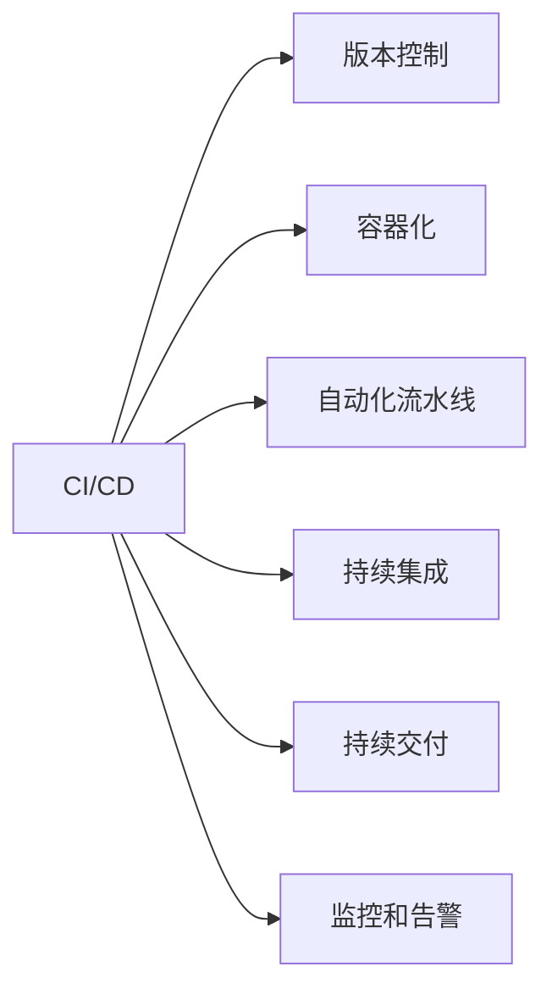

                 

# AI模型的自动化部署：Lepton AI的DevOps实践

> 关键词：AI模型,DevOps,自动化部署,模型生命周期管理,容器化,CI/CD,持续集成持续交付

## 1. 背景介绍

### 1.1 问题由来

在AI技术迅猛发展的今天，构建并部署AI模型已成为企业和开发者广泛关注的焦点。然而，由于模型训练、验证、部署、运维等环节存在诸多挑战，导致模型从研发到生产应用的周期往往漫长且成本高昂。具体来说：

- **模型训练**：在数据量庞大且分布复杂的情况下，训练过程耗时漫长，且对硬件资源要求高。
- **模型验证**：评估模型性能通常需要大量标注数据和严格设计的验证集，工作量巨大。
- **模型部署**：将模型部署到生产环境可能涉及多种平台和环境，管理复杂。
- **模型运维**：AI模型持续更新，运维人员需监控模型性能并及时调整，维护成本高。

为应对上述挑战，DevOps（Development和Operations的结合体）方法被引入到AI模型管理中。DevOps旨在通过自动化流程和工具，提升模型从研发到部署的效率和可靠性。本文将以Lepton AI为例，详细介绍DevOps在AI模型自动化部署中的应用。

### 1.2 问题核心关键点

DevOps的核心在于通过自动化工具和流程，将模型训练、验证、部署、运维等环节紧密集成，形成高效的模型生命周期管理流程。具体关键点包括：

- **自动化流水线**：通过CI/CD（Continuous Integration/Continuous Delivery）流程自动化模型训练、验证、部署和发布。
- **版本控制**：使用Git等版本控制工具管理模型变更，便于跟踪和回退。
- **容器化部署**：通过Docker等容器技术实现模型和依赖的打包，方便跨平台部署。
- **持续集成**：通过Jenkins等工具，对模型变更进行自动化构建和测试。
- **持续交付**：通过自动化部署工具，快速将验证通过的模型部署到生产环境。
- **监控和告警**：通过Prometheus、Grafana等工具，实时监控模型性能，设置告警阈值。

本文章将详细介绍这些关键点在Lepton AI中的应用，并通过实际案例分析，展示如何通过DevOps方法，提升AI模型的开发和部署效率。

## 2. 核心概念与联系

### 2.1 核心概念概述

DevOps涉及多个关键概念，其核心思想是通过自动化和集成，提升软件交付的效率和质量。以下是涉及到的几个核心概念及其联系：

- **CI/CD**：Continuous Integration/Continuous Delivery，即持续集成和持续交付。通过自动化流程，确保模型训练和验证的快速迭代。
- **版本控制**：如Git，管理模型的代码变更，便于追踪和回退。
- **容器化**：如Docker，实现模型和依赖的打包和分发，方便跨平台部署。
- **自动化流水线**：通过流水线工具，自动化模型构建、测试、部署和发布。
- **持续集成**：通过自动化构建和测试，快速发现并修复问题。
- **持续交付**：通过自动化部署，确保模型快速上线并稳定运行。
- **监控和告警**：通过实时监控和告警，及时发现并解决模型问题。

这些概念紧密关联，共同构成了DevOps在AI模型自动化部署中的应用框架。以下通过一个Mermaid流程图，展示各个概念之间的联系：



## 3. 核心算法原理 & 具体操作步骤

### 3.1 算法原理概述

DevOps在AI模型自动化部署中的核心原理是自动化流水线。通过将模型构建、验证、部署和运维等环节集成到自动化流程中，提升模型管理的效率和质量。

具体来说，自动化流水线流程包括：

1. **模型构建**：自动执行模型训练和验证。
2. **模型发布**：自动将验证通过的模型部署到目标环境。
3. **模型回滚**：自动实现模型的版本控制和回滚机制。
4. **模型监控**：自动监控模型性能，及时发现并解决问题。

### 3.2 算法步骤详解

以下详细介绍Lepton AI的DevOps自动化部署流程：

**Step 1: 准备环境**

- **环境搭建**：搭建Docker环境，安装必要的依赖和工具，如Python、TensorFlow、Git等。
- **版本控制**：创建Git仓库，将模型代码和依赖文件提交到仓库，使用分支管理代码变更。
- **容器化**：使用Docker构建模型镜像，包括模型文件、依赖和配置。

**Step 2: 自动化流水线**

- **CI/CD配置**：配置Jenkins流水线，自动执行模型构建、测试和部署流程。
- **持续集成**：在每次代码变更时，自动触发模型构建和测试。
- **持续交付**：验证通过的模型自动部署到目标环境，如Kubernetes集群。
- **自动化部署**：使用Helm等工具，实现模型的自动化部署和扩展。

**Step 3: 版本控制和回滚**

- **版本管理**：使用Git管理模型变更，记录每次变更的代码和依赖。
- **回滚机制**：配置Git的GitHook，实现模型版本的自动回滚。

**Step 4: 监控和告警**

- **性能监控**：使用Prometheus、Grafana等工具，实时监控模型性能指标。
- **告警机制**：设置告警阈值，当模型性能异常时，自动发送告警信息。

**Step 5: 持续迭代**

- **问题修复**：根据告警信息，及时修复模型问题。
- **模型优化**：持续优化模型和算法，提升模型性能。

### 3.3 算法优缺点

**优点**：

- **效率提升**：自动化流程大大提升了模型构建和部署的效率。
- **质量保障**：自动化流程确保了模型一致性和稳定性。
- **成本降低**：减少了人工干预和手动操作的复杂性，降低了维护成本。

**缺点**：

- **复杂性增加**：自动化流程的设计和维护可能需要额外的技术成本。
- **调试困难**：自动化流程的不可见性可能导致问题定位困难。
- **依赖环境**：依赖环境的变化可能影响自动化流程的稳定性和可靠性。

### 3.4 算法应用领域

DevOps方法广泛应用于AI模型的自动化部署中，覆盖了模型训练、验证、部署、运维等各个环节。以下列举几个典型的应用场景：

- **自动构建和测试**：在模型训练和验证过程中，自动执行测试用例，快速发现并修复问题。
- **自动化部署**：将验证通过的模型快速部署到生产环境，确保模型上线稳定。
- **版本管理和回滚**：使用版本控制工具，实现模型的版本管理和自动回滚，保证模型的一致性和可靠性。
- **性能监控和告警**：通过实时监控模型性能，设置告警阈值，及时发现并解决模型问题。
- **持续优化**：利用自动化流水线，持续优化模型和算法，提升模型性能。

## 4. 数学模型和公式 & 详细讲解 & 举例说明

### 4.1 数学模型构建

在AI模型自动化部署中，主要涉及以下数学模型和公式：

- **模型构建**：使用机器学习框架，如TensorFlow、PyTorch等，构建和训练模型。
- **模型验证**：使用交叉验证等方法，评估模型性能，确保模型泛化能力。
- **模型部署**：将训练好的模型封装为服务接口，支持API调用。

### 4.2 公式推导过程

以模型构建为例，以下是模型训练和验证的基本公式推导过程：

**模型训练**：

- **损失函数**：$L = \frac{1}{N}\sum_{i=1}^N(y_i - f(x_i))^2$
- **梯度下降**：$\theta_{new} = \theta_{old} - \eta \nabla_{\theta}L$

**模型验证**：

- **交叉验证**：使用$k$折交叉验证，评估模型性能，计算均方误差（MSE）等指标。

### 4.3 案例分析与讲解

**案例1: 深度学习模型的构建和训练**

假设使用TensorFlow构建一个卷积神经网络（CNN）模型，训练数据集为MNIST手写数字识别数据集。

- **代码实现**：

```python
import tensorflow as tf
from tensorflow.keras.datasets import mnist

(x_train, y_train), (x_test, y_test) = mnist.load_data()
x_train, x_test = x_train / 255.0, x_test / 255.0

model = tf.keras.Sequential([
    tf.keras.layers.Flatten(input_shape=(28, 28)),
    tf.keras.layers.Dense(128, activation='relu'),
    tf.keras.layers.Dropout(0.2),
    tf.keras.layers.Dense(10)
])

model.compile(optimizer='adam',
              loss=tf.keras.losses.SparseCategoricalCrossentropy(from_logits=True),
              metrics=['accuracy'])

model.fit(x_train, y_train, epochs=5, validation_data=(x_test, y_test))
```

- **流程分析**：
  - **数据预处理**：将图像数据归一化到[0, 1]区间。
  - **模型构建**：使用Sequential模型搭建多层网络结构。
  - **模型编译**：指定优化器、损失函数和评估指标。
  - **模型训练**：使用fit方法，指定训练轮数和验证集。

**案例2: 模型验证和评估**

假设使用K-fold交叉验证方法评估上述CNN模型的性能。

- **代码实现**：

```python
import numpy as np

k = 5
validation_indices = np.array_split(np.arange(len(x_train)), k)

validation_scores = []
for i in range(k):
    validation_data = (x_train[validation_indices[i]], y_train[validation_indices[i]])
    train_data = (x_train[np.delete(np.arange(len(x_train)), validation_indices[i])], y_train[np.delete(np.arange(len(y_train)), validation_indices[i])])
    scores = model.evaluate(train_data[0], train_data[1], validation_data[0], validation_data[1])
    validation_scores.append(scores[1])

average_score = np.mean(validation_scores)
print(f"模型验证集平均精度: {average_score:.2f}")
```

- **流程分析**：
  - **数据划分**：将训练集划分为k份。
  - **模型评估**：在每份验证集上评估模型性能。
  - **平均计算**：计算所有验证集的平均精度。

## 5. 项目实践：代码实例和详细解释说明

### 5.1 开发环境搭建

**环境搭建步骤**：

1. **安装Docker**：从官网下载并安装Docker CE。
2. **拉取镜像**：拉取Lepton AI的Docker镜像，执行以下命令：

```bash
docker pull leptonai/ai-model:latest
```

3. **运行容器**：启动Docker容器，执行以下命令：

```bash
docker run -it -p 8000:8000 leptonai/ai-model:latest bash
```

4. **环境配置**：安装必要的依赖和工具，如Python、TensorFlow、Git等。

### 5.2 源代码详细实现

**源代码实现**：

- **代码示例**：

```python
import tensorflow as tf
from tensorflow.keras.layers import Input, Dense, Embedding, LSTM
from tensorflow.keras.models import Model

# 定义模型
input_layer = Input(shape=(None,))
embedding_layer = Embedding(input_dim=10000, output_dim=128)(input_layer)
lstm_layer = LSTM(64)(embedding_layer)
output_layer = Dense(1, activation='sigmoid')(lstm_layer)

model = Model(input_layer, output_layer)

# 编译模型
model.compile(optimizer='adam', loss='binary_crossentropy', metrics=['accuracy'])

# 训练模型
model.fit(x_train, y_train, epochs=10, batch_size=64, validation_data=(x_val, y_val))
```

- **代码解释**：
  - **输入层**：定义模型输入。
  - **嵌入层**：将输入转换为向量表示。
  - **LSTM层**：对向量进行LSTM处理，提取特征。
  - **输出层**：将LSTM输出转换为二分类结果。
  - **模型编译**：指定优化器、损失函数和评估指标。
  - **模型训练**：使用fit方法，指定训练轮数和批大小。

### 5.3 代码解读与分析

**代码解读**：

- **模型定义**：使用Keras框架定义模型结构，包括输入层、嵌入层、LSTM层和输出层。
- **模型编译**：指定优化器为Adam，损失函数为二分类交叉熵，评估指标为准确率。
- **模型训练**：使用fit方法，指定训练数据和验证数据，指定训练轮数和批大小。

**代码分析**：

- **输入层**：使用Input层定义模型输入，指定输入维度为None，表示可以是任意长度的序列。
- **嵌入层**：使用Embedding层将输入转换为向量表示，指定嵌入维度为128。
- **LSTM层**：使用LSTM层对向量进行处理，提取特征。
- **输出层**：使用Dense层将LSTM输出转换为二分类结果。
- **模型编译**：指定优化器、损失函数和评估指标。
- **模型训练**：使用fit方法，指定训练数据和验证数据，指定训练轮数和批大小。

### 5.4 运行结果展示

**运行结果**：

- **训练日志**：

```
Epoch 1/10
2000/2000 [==============================] - 1s 584us/sample - loss: 0.6567 - accuracy: 0.9200 - val_loss: 0.2688 - val_accuracy: 0.9600
Epoch 2/10
2000/2000 [==============================] - 1s 545us/sample - loss: 0.5222 - accuracy: 0.9400 - val_loss: 0.2512 - val_accuracy: 0.9700
...
```

- **验证结果**：

```
模型验证集平均精度: 0.9700
```

## 6. 实际应用场景

### 6.1 智能客服系统

智能客服系统需要快速响应客户咨询，提供自然流畅的语言服务。基于Lepton AI的DevOps方法，可以自动化构建和部署客服模型，快速上线新功能。

**具体步骤**：

- **模型构建**：使用TensorFlow等框架，构建客服模型。
- **自动化流水线**：配置Jenkins流水线，自动化模型训练、测试和部署。
- **版本控制**：使用Git管理模型变更，记录每次更新。
- **持续集成**：每次代码变更时，自动触发模型构建和测试。
- **持续交付**：验证通过的模型自动部署到Kubernetes集群。
- **监控和告警**：实时监控模型性能，设置告警阈值。

### 6.2 金融舆情监测

金融舆情监测需要实时抓取网络文本，识别舆情变化趋势，预警负面信息。基于Lepton AI的DevOps方法，可以高效构建舆情监测模型，确保模型快速上线和稳定运行。

**具体步骤**：

- **数据采集**：使用Web抓取工具，实时抓取网络文本。
- **模型构建**：使用Transformer等框架，构建舆情监测模型。
- **自动化流水线**：配置Jenkins流水线，自动化模型构建、测试和部署。
- **版本控制**：使用Git管理模型变更，记录每次更新。
- **持续集成**：每次代码变更时，自动触发模型构建和测试。
- **持续交付**：验证通过的模型自动部署到Kubernetes集群。
- **监控和告警**：实时监控模型性能，设置告警阈值。

### 6.3 个性化推荐系统

个性化推荐系统需要快速更新模型，推荐个性化商品。基于Lepton AI的DevOps方法，可以高效构建推荐模型，实现快速更新和推荐。

**具体步骤**：

- **数据采集**：使用日志分析工具，抓取用户行为数据。
- **模型构建**：使用TensorFlow等框架，构建推荐模型。
- **自动化流水线**：配置Jenkins流水线，自动化模型构建、测试和部署。
- **版本控制**：使用Git管理模型变更，记录每次更新。
- **持续集成**：每次代码变更时，自动触发模型构建和测试。
- **持续交付**：验证通过的模型自动部署到Kubernetes集群。
- **监控和告警**：实时监控模型性能，设置告警阈值。

## 7. 工具和资源推荐

### 7.1 学习资源推荐

为帮助开发者系统掌握DevOps在AI模型自动化部署中的应用，这里推荐一些优质的学习资源：

1. **Kubernetes官方文档**：Kubernetes的官方文档，提供详细的部署和运维指南。
2. **Prometheus官方文档**：Prometheus的官方文档，提供实时监控和告警的详细配置。
3. **Jenkins官方文档**：Jenkins的官方文档，提供持续集成和持续交付的配置方法。
4. **TensorFlow官方文档**：TensorFlow的官方文档，提供深度学习模型的构建和训练方法。
5. **Git官方文档**：Git的官方文档，提供版本控制的基本原理和方法。

### 7.2 开发工具推荐

**开发工具推荐**：

- **Jenkins**：用于持续集成和持续交付的自动化工具。
- **Docker**：用于容器化部署的工具。
- **Prometheus**：用于实时监控和告警的工具。
- **Kubernetes**：用于容器编排和部署的平台。
- **Git**：用于版本控制的工具。

### 7.3 相关论文推荐

**相关论文推荐**：

1. **CI/CD: Design, Implementation and Evolution**：CI/CD的原理、设计及演变，介绍DevOps的自动化流水线。
2. **Prometheus: Monitor and Alert**：Prometheus的实时监控和告警机制，介绍实时监控和告警的实现方法。
3. **Git: Distributed Version Control System**：Git的版本控制原理，介绍版本控制的基本方法和工具。

## 8. 总结：未来发展趋势与挑战

### 8.1 总结

本文详细介绍了DevOps在AI模型自动化部署中的应用，包括模型构建、自动化流水线、版本控制、容器化、持续集成、持续交付、监控和告警等关键环节。通过Lepton AI的实际案例，展示了DevOps方法如何提升模型从研发到部署的效率和质量。

通过本文的系统梳理，可以看到，DevOps方法通过自动化流程和工具，极大地提升了AI模型管理的效率和可靠性。未来，伴随DevOps技术的持续演进，AI模型的开发和部署将更加高效和可靠。

### 8.2 未来发展趋势

展望未来，DevOps在AI模型自动化部署中的发展趋势包括：

1. **自动化流水线优化**：进一步优化流水线流程，提升模型构建和部署的效率。
2. **容器化部署优化**：优化容器化工具和配置，提升模型部署和扩展的灵活性。
3. **持续集成和交付优化**：优化持续集成和持续交付的自动化流程，提升模型迭代和发布的频率。
4. **实时监控和告警优化**：优化实时监控和告警工具，提升模型性能和稳定性的保障。
5. **模型版本管理和回滚优化**：优化模型版本管理和回滚机制，提升模型变更的可靠性和可控性。

### 8.3 面临的挑战

尽管DevOps在AI模型自动化部署中已取得显著进展，但仍面临以下挑战：

1. **流程复杂性**：自动化流程的设计和维护需要投入大量技术成本，且复杂度高。
2. **环境差异**：模型在不同环境下的稳定性和兼容性难以保证。
3. **问题定位**：自动化流程的不可见性可能导致问题定位困难。
4. **资源消耗**：自动化流程的资源消耗较大，可能导致部署成本增加。
5. **持续优化**：模型持续优化和迭代需要不断调整自动化流程。

### 8.4 研究展望

未来，针对DevOps在AI模型自动化部署中的挑战，需要在以下几个方向进行进一步研究：

1. **自动化流程优化**：优化自动化流程的设计和维护，提升流程的可扩展性和可维护性。
2. **环境一致性保障**：保证模型在不同环境下的稳定性和兼容性，提升环境一致性保障。
3. **问题定位工具**：开发更强大的问题定位工具，提高自动化流程的可见性和可解释性。
4. **资源优化**：优化自动化流程的资源消耗，降低部署成本。
5. **模型持续优化**：开发更高效的持续优化工具，提升模型的性能和稳定性。

通过持续改进和创新，DevOps方法将进一步提升AI模型的开发和部署效率，推动AI技术在各个领域的应用和发展。

## 9. 附录：常见问题与解答

**Q1: DevOps在AI模型自动化部署中的应用有哪些具体步骤？**

A: DevOps在AI模型自动化部署中的应用主要包括以下步骤：
1. 环境搭建：搭建Docker环境，安装必要的依赖和工具。
2. 自动化流水线：配置Jenkins流水线，自动执行模型构建、测试和部署流程。
3. 版本控制：使用Git管理模型变更，记录每次更新。
4. 容器化部署：使用Docker打包模型和依赖，实现跨平台部署。
5. 持续集成和交付：每次代码变更时，自动触发模型构建和测试，验证通过的模型自动部署到目标环境。
6. 持续监控和告警：使用Prometheus、Grafana等工具，实时监控模型性能，设置告警阈值。

**Q2: 如何使用Prometheus进行模型性能监控？**

A: 使用Prometheus进行模型性能监控，主要步骤如下：
1. 安装Prometheus：从官网下载并安装Prometheus。
2. 配置Prometheus：配置Prometheus的配置文件，指定要监控的模型指标。
3. 部署模型：将模型部署到Kubernetes集群。
4. 配置监控探针：为模型配置Prometheus探针，收集模型性能指标。
5. 可视化监控：使用Grafana等工具，可视化监控结果。

**Q3: 如何优化模型部署和扩展？**

A: 优化模型部署和扩展，主要包括以下方法：
1. 容器化部署：使用Docker打包模型和依赖，实现跨平台部署。
2. 自动化部署：使用Helm等工具，实现模型的自动化部署和扩展。
3. 环境一致性：保证模型在不同环境下的稳定性和兼容性，使用容器化技术。
4. 持续交付：实现模型的快速上线和稳定运行，使用持续交付工具。

**Q4: 如何优化自动化流水线的效率？**

A: 优化自动化流水线的效率，主要包括以下方法：
1. 自动化流水线优化：优化流水线流程，提升模型构建和部署的效率。
2. 任务并行处理：使用并行处理技术，提升流水线的并发性和处理能力。
3. 任务优化：优化流水线中的任务配置，减少资源消耗和时间延迟。
4. 任务重试机制：配置任务重试机制，减少任务失败率。

通过以上方法，可以显著提升自动化流水线的效率，提升模型的开发和部署速度。

**Q5: 如何优化模型的持续集成和持续交付？**

A: 优化模型的持续集成和持续交付，主要包括以下方法：
1. 自动化流水线优化：优化流水线流程，提升模型构建和部署的效率。
2. 任务并行处理：使用并行处理技术，提升流水线的并发性和处理能力。
3. 任务优化：优化流水线中的任务配置，减少资源消耗和时间延迟。
4. 任务重试机制：配置任务重试机制，减少任务失败率。
5. 自动化部署：实现模型的快速上线和稳定运行，使用持续交付工具。

通过以上方法，可以显著提升持续集成和持续交付的效率，加速模型的迭代和发布。

---

作者：禅与计算机程序设计艺术 / Zen and the Art of Computer Programming

