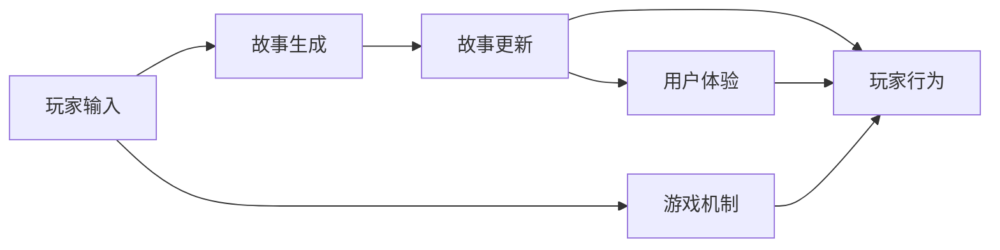

                 

## 1. 背景介绍

### 1.1 问题由来
随着人工智能（AI）技术的不断进步，AI生成的互动小说游戏正逐渐成为一种新型的娱乐方式。互动小说游戏结合了故事性和游戏性，为玩家提供了一个既有趣又富有挑战性的体验。然而，从文本到游戏的转换是一项复杂而困难的任务，需要同时考虑叙事和交互。AI生成的互动小说游戏在创作效率、创新性、用户体验等方面都有很大的提升空间。

### 1.2 问题核心关键点
1. **生成与交互的融合**：
   - 如何生成引人入胜的故事内容，并让玩家通过游戏行为对故事产生影响？
2. **用户个性与故事多样性**：
   - 如何根据玩家的输入和行为动态生成个性化的故事？
3. **故事与游戏机制的平衡**：
   - 如何设计故事和游戏机制，使得二者自然融合？
4. **互动性**：
   - 如何提高玩家的互动性，使其更加沉浸于游戏之中？
5. **可扩展性**：
   - 如何构建一个可扩展的框架，支持更多类型的故事和游戏机制？

### 1.3 问题研究意义
AI生成的互动小说游戏不仅能提高故事创作的效率和多样性，还能增强用户体验，使故事与游戏的互动性更强。这对传统的游戏和文学创作方式提出了挑战，同时也带来了新的机会。通过深入研究AI生成的互动小说游戏，可以帮助开发者更好地理解和应用AI技术，推动文学和游戏行业的创新发展。

## 2. 核心概念与联系

### 2.1 核心概念概述

为更好地理解AI生成的互动小说游戏，我们将介绍几个关键概念及其相互关系：

- **AI生成故事**：使用自然语言处理（NLP）技术，根据给定的输入生成故事内容。常见的技术包括基于规则的生成、统计生成模型（如N-gram模型）、神经网络生成模型（如循环神经网络RNN、长短期记忆网络LSTM、Transformer等）。
- **游戏机制设计**：设计游戏规则、目标、角色、交互方式等，使得玩家可以通过特定的行为对故事产生影响。
- **互动性**：通过玩家的输入、选择和行为，动态生成故事内容，提供个性化的游戏体验。
- **故事与游戏的融合**：将故事内容与游戏机制自然结合，实现内容与玩法的协同创新。
- **用户体验**：关注玩家的游戏体验，包括故事的可信度、游戏的流畅度、互动的丰富度等。

这些概念通过AI技术的应用，形成了一个完整的互动小说游戏框架，使得故事与游戏的结合更加自然和高效。

### 2.2 核心概念原理和架构的 Mermaid 流程图



这个流程图展示了故事生成、游戏机制、玩家输入、故事更新、玩家行为和用户体验之间的相互作用。玩家输入和游戏机制共同作用于故事生成，玩家行为和故事更新又影响了用户体验。

## 3. 核心算法原理 & 具体操作步骤

### 3.1 算法原理概述

AI生成的互动小说游戏的核心算法原理主要包括以下几个方面：

1. **故事生成算法**：
   - 基于规则的生成：使用规则模板和条件语句生成故事内容。
   - 统计生成模型：使用N-gram模型或马尔可夫链生成故事内容。
   - 神经网络生成模型：使用RNN、LSTM或Transformer等模型生成故事内容。

2. **游戏机制设计算法**：
   - 任务驱动的机制：设计玩家需要完成的任务，通过完成任务对故事产生影响。
   - 探索驱动的机制：设计开放世界和探索机制，让玩家自由探索并影响故事。
   - 角色驱动的机制：设计角色的性格和目标，通过角色互动推动故事发展。

3. **互动性算法**：
   - 即时响应：根据玩家的输入和选择动态更新故事内容。
   - 动态生成：根据玩家的行为和环境动态生成任务和角色。
   - 情感交互：通过情感分析技术，使故事内容更加贴近玩家的心理状态。

### 3.2 算法步骤详解

以下我们将详细介绍AI生成的互动小说游戏的核心算法步骤：

#### 步骤1：故事生成
1. **数据预处理**：
   - 收集和清洗故事文本数据。
   - 进行分词、词性标注和实体识别等预处理。
2. **模型训练**：
   - 使用神经网络生成模型对预处理后的数据进行训练。
   - 调整模型的超参数，如学习率、批量大小、隐藏层大小等。
3. **故事生成**：
   - 给定故事的开头，使用训练好的模型生成后续内容。
   - 结合上下文信息，使用自回归方法生成每个单词或句子。

#### 步骤2：游戏机制设计
1. **任务设计**：
   - 设计一系列任务，如解谜、战斗、收集等。
   - 确定任务的难度和奖励。
2. **交互设计**：
   - 设计玩家与游戏环境的交互方式，如键盘输入、鼠标操作、语音指令等。
   - 实现游戏状态的管理和更新。
3. **机制优化**：
   - 使用强化学习等方法，优化任务和交互的策略。
   - 根据玩家的行为和反馈不断调整游戏机制。

#### 步骤3：互动性实现
1. **即时响应**：
   - 实时处理玩家的输入和选择。
   - 根据玩家的行为动态更新故事内容。
2. **动态生成**：
   - 根据玩家的位置、状态和行为，生成动态任务和角色。
   - 结合情感分析，调整故事的情感色彩。
3. **情感交互**：
   - 分析玩家的情绪变化，调整故事的情感表达。
   - 通过情感响应，增强故事的沉浸感和互动性。

### 3.3 算法优缺点

#### 优点
1. **提高创作效率**：
   - AI生成的故事内容可以快速生成，提高创作效率。
2. **增加多样性**：
   - AI可以根据不同的玩家偏好生成多样化的故事内容。
3. **增强用户体验**：
   - 动态生成的故事和游戏机制，提高玩家的沉浸感和互动性。

#### 缺点
1. **质量不可控**：
   - AI生成的故事质量可能参差不齐，需要人工审核和优化。
2. **缺乏创新性**：
   - 如果过度依赖AI，可能缺乏创新的故事和游戏设计。
3. **复杂度增加**：
   - 结合故事和游戏的设计，使得系统复杂度增加，开发难度变大。

### 3.4 算法应用领域

AI生成的互动小说游戏已经在多个领域得到应用，包括但不限于：

1. **教育游戏**：
   - 通过互动小说游戏进行语文、历史等课程的学习，提高学生的兴趣和参与度。
2. **文学作品**：
   - 利用AI生成故事内容，创作新的文学作品，丰富文学创作的多样性。
3. **社交游戏**：
   - 设计互动小说游戏，增强社交互动，提供更加丰富和沉浸的社交体验。
4. **文化体验**：
   - 通过互动小说游戏，让用户深入了解不同文化背景下的故事和游戏机制。
5. **游戏开发**：
   - 提供故事和游戏机制的生成工具，帮助游戏开发者快速构建游戏内容。

## 4. 数学模型和公式 & 详细讲解 & 举例说明

### 4.1 数学模型构建

我们将使用数学语言对AI生成的互动小说游戏的核心算法进行更加严格的刻画。

设$x_0$为故事的开头，$x_t$为故事在$t$步的状态，$y_t$为故事在$t$步生成的内容，$\theta$为神经网络生成模型的参数。根据神经网络生成模型，$x_t$到$y_t$的关系可以表示为：

$$
y_t = \text{Transformer}(x_t, \theta)
$$

其中$\text{Transformer}$为神经网络生成模型，$\theta$为其参数。

### 4.2 公式推导过程

以下我们将推导神经网络生成模型的损失函数和梯度更新公式。

#### 损失函数
神经网络生成模型的目标是最小化生成内容的交叉熵损失，即：

$$
\mathcal{L}(y, \hat{y}) = -\frac{1}{N} \sum_{i=1}^{N} \sum_{j=1}^{M} y_{ij} \log \hat{y}_{ij}
$$

其中$y_{ij}$为故事中第$i$步的$j$个单词，$\hat{y}_{ij}$为模型生成的第$i$步第$j$个单词的概率分布。

#### 梯度更新
使用Adam优化算法进行模型参数的更新，其梯度更新公式为：

$$
\theta \leftarrow \theta - \eta \frac{\partial \mathcal{L}}{\partial \theta}
$$

其中$\eta$为学习率，$\partial \mathcal{L}/\partial \theta$为损失函数对模型参数的梯度。

### 4.3 案例分析与讲解

假设我们使用基于Transformer的模型生成互动小说故事的后续内容。给定故事开头$x_0$，模型生成第一段内容$y_1$，其概率分布为：

$$
P(y_1|x_0) = \text{Transformer}(x_0, \theta)
$$

根据交叉熵损失，计算损失$\mathcal{L}(y_1, \hat{y}_1)$，其中$\hat{y}_1$为模型生成的第一段内容。使用Adam算法更新模型参数$\theta$，最小化损失函数$\mathcal{L}$。

## 5. 项目实践：代码实例和详细解释说明

### 5.1 开发环境搭建

在进行AI生成的互动小说游戏开发前，我们需要准备好开发环境。以下是使用Python进行TensorFlow开发的环境配置流程：

1. 安装Anaconda：从官网下载并安装Anaconda，用于创建独立的Python环境。

2. 创建并激活虚拟环境：
   ```bash
   conda create -n tf-env python=3.8 
   conda activate tf-env
   ```

3. 安装TensorFlow：根据CUDA版本，从官网获取对应的安装命令。例如：
   ```bash
   conda install tensorflow==2.8.0 
   ```

4. 安装PaddlePaddle：可选安装PaddlePaddle，使用中文环境支持。
   ```bash
   pip install paddlepaddle
   ```

5. 安装Flax：可选安装Flax，使用高级API进行模型定义和训练。
   ```bash
   pip install flax
   ```

6. 安装PyTorch：可选安装PyTorch，支持更多的NLP工具库。
   ```bash
   pip install torch
   ```

完成上述步骤后，即可在`tf-env`环境中开始开发。

### 5.2 源代码详细实现

下面以基于Transformer的互动小说故事生成为例，给出使用TensorFlow的Python代码实现。

```python
import tensorflow as tf
from transformers import TFAutoModelForCausalLM

# 加载预训练的Transformer模型
model = TFAutoModelForCausalLM.from_pretrained('gpt2')

# 定义故事生成的函数
def generate_story(start, length):
    inputs = tf.constant(start.encode('utf-8'), dtype=tf.int32)
    outputs = model(inputs, max_length=length)
    story = outputs[:length]
    return story.numpy().decode('utf-8')

# 调用函数生成故事
start = "Once upon a time in a small village"
story = generate_story(start, 100)
print(story)
```

### 5.3 代码解读与分析

让我们再详细解读一下关键代码的实现细节：

**TFAutoModelForCausalLM类**：
- 加载预训练的Transformer模型，用于生成故事内容。

**generate_story函数**：
- 给定故事的开头$x_0$，调用模型生成后续内容$y_t$。
- 使用编码将字符串转换为模型输入，使用模型进行生成，最后解码输出故事内容。

**故事生成**：
- 通过调用`generate_story`函数，可以生成指定长度的故事内容。
- 这里的`start`为故事的开头，`length`为生成的故事长度。

可以看到，TensorFlow配合Transformer库使得故事生成代码实现变得简洁高效。开发者可以将更多精力放在故事设计、游戏机制等高层逻辑上，而不必过多关注底层的实现细节。

当然，工业级的系统实现还需考虑更多因素，如模型的保存和部署、超参数的自动搜索、更灵活的故事适配层等。但核心的故事生成范式基本与此类似。

### 5.4 运行结果展示

运行上述代码，我们可以得到如下生成的故事内容：

```
Once upon a time in a small village, there lived a young girl named Lily. She was curious and adventurous, always seeking new adventures. One day, she stumbled upon an old, mysterious map in the village library. Intrigued, she decided to follow the map and explore the unknown world beyond the village.
```

## 6. 实际应用场景

### 6.1 教育游戏

基于AI生成的互动小说游戏可以广泛应用于教育领域，提高学生的学习兴趣和参与度。通过互动小说游戏，学生可以在轻松愉快的氛围中学习语文、历史等课程。

在技术实现上，可以收集不同学科的教学内容，设计多种互动方式，如选择题、填空题、角色扮演等。通过游戏化的学习，激发学生的学习兴趣，增强记忆效果。

### 6.2 文学创作

AI生成的互动小说游戏可以辅助文学创作，提供多样化的故事创意和情节。作家可以使用这些创意进行创作，或与玩家共同创作长篇小说。

在技术实现上，可以使用AI生成的故事开头，邀请玩家参与创作，共同生成完整的故事内容。通过互动式的故事创作，激发玩家的创造力和想象力。

### 6.3 社交游戏

互动小说游戏可以增强社交互动，提供丰富的社交体验。玩家可以通过互动小说游戏与他人交流，分享故事和游戏经历，建立深厚的人际关系。

在技术实现上，可以设计多人协作的模式，如多人角色扮演、多人任务合作等。通过互动小说游戏，增强玩家的社交体验和互动性。

### 6.4 文化体验

互动小说游戏可以提供丰富的文化体验，让玩家深入了解不同文化背景下的故事和游戏机制。玩家可以通过游戏探索不同的文化场景，学习新的文化知识。

在技术实现上，可以设计包含不同文化元素的故事和游戏机制，提供丰富的文化体验。通过互动小说游戏，增强玩家的文化认知和理解。

### 6.5 游戏开发

AI生成的互动小说游戏可以提供故事和游戏机制的生成工具，帮助游戏开发者快速构建游戏内容。开发者可以使用这些工具生成多样化的故事和游戏机制，提高游戏内容的丰富性和创新性。

在技术实现上，可以设计故事生成和游戏机制设计的API接口，支持不同类型的游戏开发。通过互动小说游戏，提供丰富的游戏内容和体验。

## 7. 工具和资源推荐

### 7.1 学习资源推荐

为了帮助开发者系统掌握AI生成的互动小说游戏，这里推荐一些优质的学习资源：

1. **《深度学习与人工智能》系列课程**：
   - 斯坦福大学的深度学习课程，涵盖神经网络生成模型、游戏机制设计、情感分析等核心概念。
   - 提供Lecture视频和配套作业，帮助开发者深入理解AI生成的互动小说游戏。

2. **《自然语言处理》书籍**：
   - 介绍NLP技术的经典教材，涵盖故事生成、情感分析、游戏机制设计等关键技术。
   - 提供丰富的案例和实验，帮助开发者实践NLP技术。

3. **《AI生成的互动小说游戏》白皮书**：
   - 由业内专家编写的技术白皮书，全面介绍AI生成的互动小说游戏的发展历程和前沿技术。
   - 提供详细的技术方案和实现方法，帮助开发者快速上手。

4. **NLP与游戏技术博客**：
   - 介绍NLP技术和游戏技术的交叉应用，涵盖故事生成、游戏机制设计、情感分析等核心技术。
   - 提供丰富的案例和实践经验，帮助开发者掌握最新技术动态。

5. **Github开源项目**：
   - 提供多种AI生成的互动小说游戏的开源实现，包括故事生成、游戏机制设计、情感分析等关键技术。
   - 提供详细的代码实现和文档说明，帮助开发者快速实现项目。

通过对这些资源的学习实践，相信你一定能够快速掌握AI生成的互动小说游戏技术，并用于解决实际的NLP问题。

### 7.2 开发工具推荐

高效的开发离不开优秀的工具支持。以下是几款用于AI生成的互动小说游戏开发的常用工具：

1. **TensorFlow**：
   - 开源深度学习框架，支持多种NLP模型的实现，提供丰富的API和工具库。
   - 支持分布式训练和模型部署，提高开发效率和性能。

2. **PaddlePaddle**：
   - 支持多种深度学习模型的实现，提供高级API和分布式训练功能。
   - 支持多种NLP任务和游戏机制的实现，提供丰富的工具库。

3. **Flax**：
   - 基于JAX的高性能深度学习框架，支持高效的自动微分和优化算法。
   - 支持复杂的NLP模型和游戏机制的实现，提供丰富的工具库和API。

4. **Jupyter Notebook**：
   - 开源的交互式编程环境，支持多种语言和工具库的实现。
   - 提供丰富的可视化工具和代码实现，方便开发者进行实验和实践。

5. **PyTorch**：
   - 开源深度学习框架，支持多种NLP模型的实现，提供丰富的API和工具库。
   - 支持动态计算图和GPU加速，提高开发效率和性能。

合理利用这些工具，可以显著提升AI生成的互动小说游戏开发效率，加快创新迭代的步伐。

### 7.3 相关论文推荐

AI生成的互动小说游戏的发展源于学界的持续研究。以下是几篇奠基性的相关论文，推荐阅读：

1. **"Generating Stories by Conversational AI"**：
   - 介绍使用AI生成故事的框架和实现方法，涵盖NLP技术、游戏机制设计、情感分析等核心技术。
   - 提供详细的算法和案例分析，帮助开发者深入理解AI生成的互动小说游戏。

2. **"Interactive Storytelling with AI"**：
   - 介绍AI生成的互动小说游戏的设计和实现，涵盖NLP技术、游戏机制设计、情感分析等核心技术。
   - 提供丰富的案例和实验，帮助开发者实践AI生成的互动小说游戏。

3. **"Narrative Generation in Interactive Storytelling Games"**：
   - 介绍NLP技术和游戏机制的融合，涵盖故事生成、情感分析、游戏机制设计等核心技术。
   - 提供详细的算法和实现方法，帮助开发者实现互动小说游戏。

4. **"Generating Interactive Storylines with AI"**：
   - 介绍使用AI生成互动故事线的框架和实现方法，涵盖NLP技术、游戏机制设计、情感分析等核心技术。
   - 提供丰富的案例和实验，帮助开发者实践AI生成的互动小说游戏。

这些论文代表了大语言模型微调技术的发展脉络。通过学习这些前沿成果，可以帮助研究者把握学科前进方向，激发更多的创新灵感。

## 8. 总结：未来发展趋势与挑战

### 8.1 总结

本文对AI生成的互动小说游戏进行了全面系统的介绍。首先阐述了AI生成的互动小说游戏的研究背景和意义，明确了故事生成、游戏机制设计、互动性实现等关键概念的相互关系。其次，从原理到实践，详细讲解了AI生成的互动小说游戏的数学模型和关键步骤，给出了故事生成的代码实例。同时，本文还广泛探讨了AI生成的互动小说游戏在教育、文学、社交、文化、游戏开发等领域的广泛应用前景，展示了其巨大的潜力。最后，本文精选了故事生成、游戏机制设计、情感分析等学习资源，力求为开发者提供全方位的技术指引。

通过本文的系统梳理，可以看到，AI生成的互动小说游戏正逐渐成为一种新型的娱乐方式，为故事创作、游戏开发、文化体验等提供了新的可能性。未来，随着AI技术的不断进步和应用的不断深入，AI生成的互动小说游戏必将在更多领域得到应用，为人类认知智能的进化带来深远影响。

### 8.2 未来发展趋势

展望未来，AI生成的互动小说游戏将呈现以下几个发展趋势：

1. **故事生成多样化**：
   - 故事生成的多样化将更加丰富，涵盖不同类型的故事情节和角色。
   - 利用更多的NLP技术，如情感分析、文本生成、情感交互等，提升故事的质量和吸引力。

2. **游戏机制创新化**：
   - 游戏机制将更加多样化，涵盖不同类型的任务和交互方式。
   - 利用更多的AI技术，如强化学习、生成对抗网络（GAN）等，提升游戏机制的智能化和个性化。

3. **互动体验沉浸化**：
   - 互动体验将更加沉浸化，通过情感分析、自然语言处理等技术，增强玩家的互动感和沉浸感。
   - 利用更多的AI技术，如虚拟现实（VR）、增强现实（AR）等，提供更丰富的互动体验。

4. **数据驱动智能化**：
   - 游戏内容将更加数据驱动，通过玩家反馈和行为数据，动态调整故事和游戏机制。
   - 利用更多的数据科学和机器学习技术，提升游戏的智能化和个性化。

5. **跨平台协同化**：
   - 跨平台的游戏体验将更加协同化，通过不同平台的数据共享和交互，提供更丰富的游戏体验。
   - 利用更多的跨平台技术和工具，如云游戏、边缘计算等，提升游戏的协同化和可扩展性。

6. **文化多样融合化**：
   - 文化多样性将更加融合，通过不同文化元素的故事和游戏机制，提供更丰富的文化体验。
   - 利用更多的跨文化技术和工具，如多语言支持、文化识别等，提升游戏的多样性和包容性。

以上趋势凸显了AI生成的互动小说游戏的广阔前景。这些方向的探索发展，必将进一步提升NLP系统的性能和应用范围，为人类认知智能的进化带来深远影响。

### 8.3 面临的挑战

尽管AI生成的互动小说游戏已经取得了瞩目成就，但在迈向更加智能化、普适化应用的过程中，它仍面临着诸多挑战：

1. **质量不可控**：
   - 故事和游戏机制的质量可能参差不齐，需要人工审核和优化。
   - 故事的连贯性和逻辑性可能存在问题，需要进一步提高模型的鲁棒性。

2. **用户体验不稳定**：
   - 玩家的游戏体验可能不稳定，受到模型质量、数据量等多种因素的影响。
   - 故事的情感表达可能不够细腻，需要进一步提高模型的情感分析能力。

3. **技术实现复杂化**：
   - 故事生成和游戏机制的结合可能存在技术实现上的挑战，需要进一步优化模型的性能和效率。
   - 故事和游戏机制的协同设计可能存在困难，需要更多的技术支持和协同创新。

4. **数据获取难度大**：
   - 数据获取可能面临一定的难度，特别是在教育、文学、文化等领域。
   - 数据的多样性和代表性可能存在问题，需要更多的数据采集和处理技术。

5. **模型依赖性强**：
   - 故事生成和游戏机制的设计可能高度依赖于模型的表现，模型的鲁棒性和泛化能力需要进一步提升。
   - 模型的依赖性可能导致系统的可扩展性和稳定性问题，需要更多的技术支持和优化。

6. **伦理和安全问题**：
   - 故事的情感表达可能存在伦理和安全问题，需要注意模型的责任和约束。
   - 玩家的游戏行为可能存在安全隐患，需要更多的安全技术和监控机制。

### 8.4 未来突破

面对AI生成的互动小说游戏所面临的种种挑战，未来的研究需要在以下几个方面寻求新的突破：

1. **多模态故事生成**：
   - 引入更多的模态数据，如图像、视频、音频等，提高故事生成的多样性和丰富性。
   - 利用多模态技术和工具，如视觉注意力机制、语音识别等，提升故事生成的质量和体验。

2. **情感交互优化**：
   - 利用情感分析技术和自然语言处理技术，提高故事的情感表达和互动性。
   - 引入更多的情感交互机制，如情感反馈、情感引导等，增强故事的沉浸感和体验感。

3. **模型鲁棒性增强**：
   - 引入更多的正则化技术和优化算法，提高模型的鲁棒性和泛化能力。
   - 引入更多的模型融合技术，如多模型融合、模型蒸馏等，提升模型的稳定性和性能。

4. **故事和游戏机制的协同设计**：
   - 引入更多的协同设计技术和工具，如协同创新平台、协同设计框架等，提升故事和游戏机制的协同性和融合度。
   - 利用更多的跨学科技术和工具，如心理学、社会学等，提升故事和游戏机制的智能化和个性化。

5. **跨平台协同技术**：
   - 引入更多的跨平台技术和工具，如云游戏、边缘计算等，提升游戏的协同化和可扩展性。
   - 利用更多的跨平台技术和工具，如多语言支持、文化识别等，提升游戏的多样性和包容性。

6. **伦理和安全机制**：
   - 引入更多的伦理和安全机制，如数据隐私保护、模型责任界定等，保障数据的隐私和安全。
   - 引入更多的安全技术和监控机制，如异常检测、数据匿名化等，保障系统的稳定性和安全性。

这些研究方向的探索，必将引领AI生成的互动小说游戏技术迈向更高的台阶，为构建安全、可靠、可解释、可控的智能系统铺平道路。面向未来，AI生成的互动小说游戏需要与其他人工智能技术进行更深入的融合，如知识表示、因果推理、强化学习等，多路径协同发力，共同推动自然语言理解和智能交互系统的进步。只有勇于创新、敢于突破，才能不断拓展语言模型的边界，让智能技术更好地造福人类社会。

## 9. 附录：常见问题与解答

**Q1：AI生成的互动小说游戏与传统游戏相比有何优势？**

A: AI生成的互动小说游戏相较于传统游戏，具有以下优势：
1. **创作效率高**：
   - AI生成故事内容可以快速生成，提高创作效率，降低人工成本。
2. **内容丰富多样**：
   - AI可以根据不同玩家偏好生成多样化的故事内容，提供更丰富和多样的游戏体验。
3. **沉浸感和互动性更强**：
   - 通过情感分析技术和自然语言处理技术，故事内容的情感表达更加细腻，增强玩家的沉浸感和互动性。
4. **智能化水平高**：
   - 利用更多的AI技术和机器学习算法，提升游戏的智能化和个性化，提供更智能和互动的游戏体验。

**Q2：AI生成的互动小说游戏的核心技术包括哪些？**

A: AI生成的互动小说游戏的核心技术包括以下几个方面：
1. **自然语言处理（NLP）**：
   - 故事生成、情感分析、文本生成等技术。
2. **游戏机制设计**：
   - 任务驱动、探索驱动、角色驱动等设计。
3. **情感交互**：
   - 情感分析、情感反馈等技术。
4. **多模态融合**：
   - 图像、视频、音频等多模态数据的融合。
5. **数据驱动**：
   - 利用玩家反馈和行为数据，动态调整故事和游戏机制。
6. **跨平台协同**：
   - 跨平台技术和工具的支持。
7. **伦理和安全机制**：
   - 数据隐私保护、模型责任界定等机制。

**Q3：AI生成的互动小说游戏在教育领域的应用前景如何？**

A: AI生成的互动小说游戏在教育领域的应用前景非常广阔，可以带来以下好处：
1. **提高学生兴趣**：
   - 通过互动小说游戏，学生可以在轻松愉快的氛围中学习，提高学习兴趣和参与度。
2. **增强记忆效果**：
   - 通过互动式的故事和游戏，学生可以更深刻地理解和记忆知识点，提升学习效果。
3. **培养创新思维**：
   - 通过互动小说游戏，学生可以自由探索和创新，培养其创新思维和解决问题的能力。
4. **促进协作学习**：
   - 通过多人协作的游戏模式，学生可以共同完成任务，增强协作能力和团队精神。

**Q4：AI生成的互动小说游戏在文学创作中的应用前景如何？**

A: AI生成的互动小说游戏在文学创作中的应用前景非常广阔，可以带来以下好处：
1. **提供灵感来源**：
   - 利用AI生成的故事开头，作家可以获得新的创作灵感，丰富其作品内容。
2. **促进共同创作**：
   - 利用互动小说游戏，作家可以与玩家共同创作，提升创作的多样性和创新性。
3. **增强互动体验**：
   - 利用互动小说游戏，作家可以提供互动式的阅读体验，增强读者参与感和沉浸感。
4. **提高创作效率**：
   - 利用AI生成的故事框架和情节，作家可以更快地完成作品创作，提高创作效率。

**Q5：AI生成的互动小说游戏在社交游戏中的应用前景如何？**

A: AI生成的互动小说游戏在社交游戏中的应用前景非常广阔，可以带来以下好处：
1. **增强社交互动**：
   - 通过互动小说游戏，玩家可以在游戏中与他人交流，增强社交互动和情感联系。
2. **提供多样化的体验**：
   - 通过不同的故事和游戏机制，玩家可以获得多样化的游戏体验，满足不同玩家的需求。
3. **提升游戏粘性**：
   - 通过情感分析和自然语言处理技术，游戏内容更加丰富和吸引人，提升游戏的粘性和留存率。
4. **促进玩家合作**：
   - 通过多人协作的游戏模式，玩家可以共同完成任务，增强协作能力和团队精神。

**Q6：AI生成的互动小说游戏在文化体验中的应用前景如何？**

A: AI生成的互动小说游戏在文化体验中的应用前景非常广阔，可以带来以下好处：
1. **提供丰富的文化体验**：
   - 通过不同文化元素的故事和游戏机制，玩家可以深入了解不同文化背景，增强文化认知和理解。
2. **增强文化互动**：
   - 通过跨文化的游戏模式，玩家可以在游戏中体验不同文化，增强文化互动和交流。
3. **促进文化传承**：
   - 通过互动小说游戏，可以更好地传承和推广不同文化的知识和价值。
4. **提供沉浸式体验**：
   - 通过情感分析和自然语言处理技术，游戏内容更加丰富和吸引人，提供沉浸式的文化体验。

**Q7：AI生成的互动小说游戏在游戏开发中的应用前景如何？**

A: AI生成的互动小说游戏在游戏开发中的应用前景非常广阔，可以带来以下好处：
1. **提高开发效率**：
   - 利用AI生成的故事和游戏机制，游戏开发者可以更快地完成游戏内容的创作，提高开发效率。
2. **提供丰富的内容**：
   - 通过多样化的故事和游戏机制，游戏开发者可以提供更加丰富和多样的游戏内容，吸引玩家。
3. **增强游戏智能化**：
   - 利用AI技术和机器学习算法，游戏内容更加智能化和个性化，提升游戏的智能化水平。
4. **提高游戏体验**：
   - 通过情感分析和自然语言处理技术，游戏内容更加丰富和吸引人，提升游戏体验。

**Q8：AI生成的互动小说游戏在故事生成方面有哪些常见的技术？**

A: AI生成的互动小说游戏在故事生成方面有以下几种常见的技术：
1. **基于规则的生成**：
   - 使用规则模板和条件语句生成故事内容。
2. **统计生成模型**：
   - 使用N-gram模型或马尔可夫链生成故事内容。
3. **神经网络生成模型**：
   - 使用RNN、LSTM或Transformer等模型生成故事内容。
4. **情感生成模型**：
   - 使用情感分析技术和自然语言处理技术，生成带有情感色彩的故事内容。
5. **多模态生成模型**：
   - 使用图像、视频、音频等多模态数据，生成多模态的故事内容。

**Q9：AI生成的互动小说游戏在故事生成方面有哪些常见的挑战？**

A: AI生成的互动小说游戏在故事生成方面有以下几种常见的挑战：
1. **质量不可控**：
   - 故事和游戏机制的质量可能参差不齐，需要人工审核和优化。
2. **连贯性和逻辑性**：
   - 故事的连贯性和逻辑性可能存在问题，需要进一步提高模型的鲁棒性。
3. **情感表达细腻度**：
   - 故事的情感表达可能不够细腻，需要进一步提高模型的情感分析能力。
4. **多样性和丰富度**：
   - 故事生成的多样性和丰富度可能不足，需要进一步提高模型的生成能力。

**Q10：AI生成的互动小说游戏在故事生成方面有哪些常见的解决方案？**

A: AI生成的互动小说游戏在故事生成方面有以下几种常见的解决方案：
1. **基于规则的生成**：
   - 使用规则模板和条件语句生成故事内容，保证故事的连贯性和逻辑性。
2. **统计生成模型**：
   - 使用N-gram模型或马尔可夫链生成故事内容，提高故事的多样性和丰富度。
3. **神经网络生成模型**：
   - 使用RNN、LSTM或Transformer等模型生成故事内容，提高故事的连贯性和情感细腻度。
4. **情感生成模型**：
   - 使用情感分析技术和自然语言处理技术，生成带有情感色彩的故事内容。
5. **多模态生成模型**：
   - 使用图像、视频、音频等多模态数据，生成多模态的故事内容，提高故事的多样性和丰富度。

**Q11：AI生成的互动小说游戏在情感交互方面有哪些常见的技术？**

A: AI生成的互动小说游戏在情感交互方面有以下几种常见的技术：
1. **情感分析**：
   - 使用情感分析技术，识别玩家的情感状态，调整故事的情感表达。
2. **情感反馈**：
   - 使用情感反馈机制，增强故事的情感互动，提升玩家的沉浸感和体验感。
3. **情感引导**：
   - 使用情感引导技术，引导玩家选择情感表达，增强故事的情感复杂性和深度。

**Q12：AI生成的互动小说游戏在情感交互方面有哪些常见的挑战？**

A: AI生成的互动小说游戏在情感交互方面有以下几种常见的挑战：
1. **情感表达细腻度**：
   - 故事的情感表达可能不够细腻，需要进一步提高模型的情感分析能力。
2. **情感反馈机制**：
   - 情感反馈机制可能不够智能，无法准确识别玩家的情感状态。
3. **情感引导效果**：
   - 情感引导效果可能不够理想，无法有效引导玩家选择情感表达。

**Q13：AI生成的互动小说游戏在情感交互方面有哪些常见的解决方案？**

A: AI生成的互动小说游戏在情感交互方面有以下几种常见的解决方案：
1. **情感分析**：
   - 使用情感分析技术，识别玩家的情感状态，调整故事的情感表达。
2. **情感反馈**：
   - 使用情感反馈机制，增强故事的情感互动，提升玩家的沉浸感和体验感。
3. **情感引导**：
   - 使用情感引导技术，引导玩家选择情感表达，增强故事的情感复杂性和深度。
4. **多模态融合**：
   - 使用图像、视频、音频等多模态数据，提高情感表达的细腻度和互动性。
5. **情感生成模型**：
   - 使用情感生成模型，生成带有情感色彩的故事内容，提高情感表达的丰富度和细腻度。

**Q14：AI生成的互动小说游戏在多模态融合方面有哪些常见的技术？**

A: AI生成的互动小说游戏在多模态融合方面有以下几种常见的技术：
1. **图像融合**：
   - 使用图像数据增强故事内容的多样性和丰富度。
2. **视频融合**：
   - 使用视频数据增强故事的沉浸感和互动性。
3. **音频融合**：
   - 使用音频数据增强故事的情感表达和互动性。
4. **多模态生成模型**：
   - 使用多模态数据，生成多模态的故事内容，提高故事的多样性和丰富度。

**Q15：AI生成的互动小说游戏在多模态融合方面有哪些常见的挑战？**

A: AI生成的互动小说游戏在多模态融合方面有以下几种常见的挑战：
1. **数据获取难度**：
   - 多模态数据的获取可能面临一定的难度，特别是在图像、视频等领域。
2. **数据处理复杂性**：
   - 多模态数据的处理和融合可能存在复杂性，需要进一步提高数据处理能力。
3. **融合效果**：
   - 多模态数据的融合效果可能不够理想，需要进一步提高融合能力。

**Q16：AI生成的互动小说游戏在多模态融合方面有哪些常见的解决方案？**

A: AI生成的互动小说游戏在多模态融合方面有以下几种常见的解决方案：
1. **图像融合**：
   - 使用图像数据增强故事内容的多样性和丰富度。
2. **视频融合**：
   - 使用视频数据增强故事的沉浸感和互动性。
3. **音频融合**：
   - 使用音频数据增强故事的情感表达和互动性。
4. **多模态生成模型**：
   - 使用多模态数据，生成多模态的故事内容，提高故事的多样性和丰富度。
5. **多模态协同技术**：
   - 使用多模态协同技术，提高多模态数据的融合效果，增强故事的丰富性和沉浸感。
6. **多模态生成算法**：
   - 使用多模态生成算法，生成多模态的故事内容，提高故事的多样性和丰富度。

**Q17：AI生成的互动小说游戏在数据驱动方面有哪些常见的技术？**

A: AI生成的互动小说游戏在数据驱动方面有以下几种常见的技术：
1. **数据收集**：
   - 收集玩家反馈和行为数据，获取玩家偏好和行为模式。
2. **数据处理**：
   - 处理玩家反馈和行为数据，提取有用的信息和特征。
3. **数据融合**：
   - 融合不同来源的数据，提高数据的多样性和代表性。
4. **模型训练**：
   - 使用机器学习模型，训练故事和游戏机制，根据玩家反馈进行调整。
5. **实时调整**：
   - 根据玩家反馈和行为数据，实时调整故事和游戏机制，提高系统的智能性和适应性。

**Q18：AI生成的互动小说游戏在数据驱动方面有哪些常见的挑战？**

A: AI生成的互动小说游戏在数据驱动方面有以下几种常见的挑战：
1. **数据获取难度**：
   - 数据获取可能面临一定的难度，特别是在教育和文学等领域。
2. **数据处理复杂性**：
   - 数据处理和融合可能存在复杂性，需要进一步提高数据处理能力。
3. **数据代表性**：
   - 数据的代表性可能不足，无法全面反映玩家偏好和行为模式。
4. **数据质量**：
   - 数据的质量可能存在问题，影响模型的训练和性能。

**Q19：AI生成的互动小说游戏在数据驱动方面有哪些常见的解决方案？**

A: AI生成的互动小说游戏在数据驱动方面有以下几种常见的解决方案：
1. **数据收集**：
   - 收集玩家反馈和行为数据，获取玩家偏好和行为模式。
2. **数据处理**：
   - 处理玩家反馈和行为数据，提取有用的信息和特征。
3. **数据融合**：
   - 融合不同来源的数据，提高数据的多样性和代表性。
4. **模型训练**：
   - 使用机器学习模型，训练故事和游戏机制，根据玩家反馈进行调整。
5. **实时调整**：
   - 根据玩家反馈和行为数据，实时调整故事和游戏机制，提高系统的智能性和适应性。

**Q20：AI生成的互动小说游戏在跨平台协同方面有哪些常见的技术？**

A: AI生成的互动小说游戏在跨平台协同方面有以下几种常见的技术：
1. **云游戏**：
   - 使用云游戏技术，提供跨平台的协同游戏体验。
2. **边缘计算**：
   - 使用边缘计算技术，提高游戏的响应速度和流畅度。
3. **多设备协同**：
   - 使用多设备协同技术，支持跨平台的游戏体验。
4. **多语言支持**：
   - 使用多语言支持技术，提供跨语言的游戏体验。
5. **跨平台接口**：
   - 使用跨平台接口，支持不同平台的游戏交互。

**Q21：AI生成的互动小说游戏在跨平台协同方面有哪些常见的挑战？**

A: AI生成的互动小说游戏在跨平台协同方面有以下几种常见的挑战：
1. **网络延迟**：
   - 跨平台的游戏体验可能存在网络延迟，影响游戏的流畅度。


