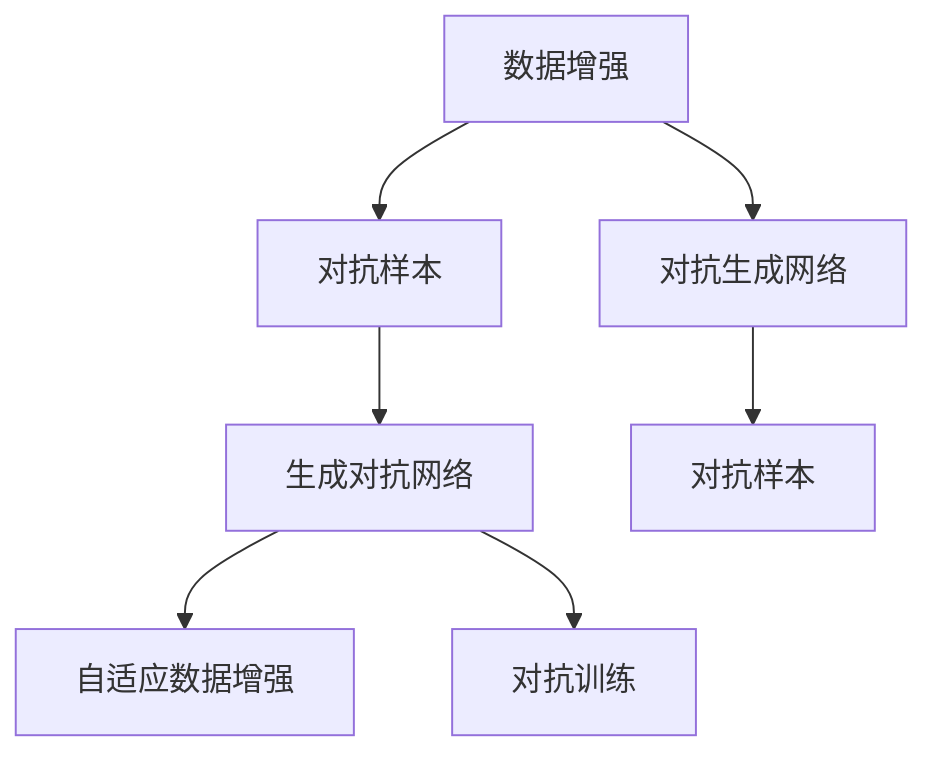

                 

# AI生成的数据增强：改善模型泛化能力

> 关键词：数据增强,泛化能力,深度学习,迁移学习,生成对抗网络,自适应数据增强,对抗样本

## 1. 背景介绍

在深度学习领域，数据增强（Data Augmentation）技术已经成为提高模型泛化能力的重要手段。传统的增强方法，如随机裁剪、翻转、旋转等，可以通过简单的图像处理操作，扩大训练集规模，增强模型的鲁棒性和泛化能力。然而，随着数据增强方法的不断发展，人们逐渐意识到，单一的随机增强并不能完全覆盖数据的多样性，尤其是在面对高维、复杂的数据结构时，如何生成高质量、多样化的增强数据，成为新的研究热点。

近年来，随着生成对抗网络（GAN）的兴起，利用对抗样本进行数据增强的方法受到了广泛关注。这种技术通过生成对抗网络，生成与真实数据高度相似的伪造数据，从而显著扩充训练数据集。这种增强方法不仅能够提高模型的泛化能力，还能增加模型的鲁棒性和防御能力，使其对各类对抗性攻击具有更强的抵抗性。本文将从核心概念、算法原理、具体实现以及未来展望等多个角度，详细阐述AI生成的数据增强技术及其在模型泛化能力改善中的作用。

## 2. 核心概念与联系

### 2.1 核心概念概述

为更好地理解AI生成的数据增强技术，本节将介绍几个密切相关的核心概念：

- **数据增强（Data Augmentation）**：通过对原始数据进行一系列随机变换，生成新的数据样本，从而扩充训练数据集，提升模型的泛化能力和鲁棒性。
- **对抗样本（Adversarial Examples）**：指在模型输入中添加精心构造的小扰动，使模型输出发生显著变化，从而测试模型的鲁棒性和泛化能力。
- **生成对抗网络（Generative Adversarial Networks, GANs）**：由Goodfellow等人在2014年提出，通过两个对抗的网络结构，生成高质量的伪造数据。
- **自适应数据增强（Adaptive Data Augmentation）**：通过学习原始数据的特征分布，自适应生成增强数据，避免引入噪声，提高数据质量。
- **对抗训练（Adversarial Training）**：通过在训练过程中加入对抗样本，使模型对对抗样本具有更好的鲁棒性。
- **对抗生成网络（Adversarial Generative Networks, Adversarial Generative Adversarial Networks, Adversarial Generative Adversarial Networks, AGANs）**：将生成对抗网络应用于对抗样本生成，进一步提升数据增强的效果。

这些核心概念之间的逻辑关系可以通过以下Mermaid流程图来展示：



这个流程图展示了大语言模型的核心概念及其之间的关系：

1. 数据增强通过简单变换扩大训练集，提高模型泛化能力。
2. 对抗样本通过小扰动测试模型鲁棒性，促进模型泛化。
3. 生成对抗网络通过对抗性生成提高数据质量。
4. 自适应数据增强通过学习数据特征生成高质量增强数据。
5. 对抗训练通过对抗样本人工增强模型鲁棒性。
6. 对抗生成网络通过生成对抗样本进一步提升数据增强效果。

这些概念共同构成了AI生成的数据增强技术的理论基础，为其在实际应用中的广泛应用提供了保障。

## 3. 核心算法原理 & 具体操作步骤
### 3.1 算法原理概述

AI生成的数据增强技术主要基于生成对抗网络（GANs）的原理，通过两个对抗的网络结构，生成与原始数据高度相似的伪造数据。其中，一个网络负责生成伪造数据，另一个网络负责判别数据的真实性，两个网络通过对抗训练不断优化，最终生成高质量的对抗样本，用于数据增强。

具体来说，生成对抗网络由两个神经网络组成：生成器（Generator）和判别器（Discriminator）。生成器接收随机噪声作为输入，生成伪造数据，判别器接收数据作为输入，判断其真实性。两个网络相互对抗，生成器试图生成更逼真的数据，判别器试图更准确地识别真伪，从而形成一个动态的对抗过程。

在数据增强过程中，生成对抗网络用于生成对抗样本，通过加入对抗样本，可以显著扩充训练集，提高模型的泛化能力和鲁棒性。对抗样本的生成过程如下：

1. 生成器接收随机噪声作为输入，生成伪造数据。
2. 判别器判断数据的真实性，并给出分数。
3. 生成器根据判别器的反馈，调整生成策略，生成更逼真的数据。
4. 重复上述过程，直到生成高质量的对抗样本。

### 3.2 算法步骤详解

基于生成对抗网络的数据增强过程，可以分为以下几个关键步骤：

**Step 1: 准备原始数据集**
- 收集原始训练数据集，划分为训练集、验证集和测试集。

**Step 2: 生成对抗网络初始化**
- 初始化生成器和判别器网络，定义损失函数和优化器。

**Step 3: 对抗样本生成**
- 生成器接收随机噪声作为输入，生成伪造数据。
- 判别器接收数据和伪造数据作为输入，判断真实性，并给出分数。
- 计算生成器和判别器的损失函数，更新模型参数。
- 重复上述过程，生成高质量的对抗样本。

**Step 4: 数据增强**
- 将生成的对抗样本加入到训练集中。
- 重新训练模型，评估在增强数据集上的性能。

**Step 5: 模型评估**
- 在测试集上评估增强后的模型性能。
- 与未增强的模型性能进行比较，判断增强效果。

### 3.3 算法优缺点

AI生成的数据增强技术具有以下优点：
1. 显著扩充训练数据集。生成对抗网络可以生成与原始数据高度相似的高质量伪造数据，显著扩充训练集规模。
2. 提高模型泛化能力。通过加入对抗样本，模型能够更好地适应多样化的数据分布，提高泛化能力。
3. 增强模型鲁棒性。对抗样本通过对抗训练，使模型对噪声和对抗攻击具有更好的鲁棒性。

然而，这种技术也存在一些缺点：
1. 数据分布问题。生成的对抗样本可能与真实数据分布存在差异，导致模型泛化效果下降。
2. 计算复杂度高。生成对抗网络需要大量计算资源，训练时间较长，可能影响实际应用。
3. 对抗样本安全性。生成的对抗样本可能被用于对抗性攻击，增加模型被攻击的风险。
4. 对抗样本生成策略。对抗样本的生成策略需要精心设计，否则可能引入噪声，降低数据质量。

尽管存在这些局限性，但基于生成对抗网络的数据增强技术仍在大规模深度学习任务中广泛应用，并通过不断的优化和改进，展现出强大的潜力。

### 3.4 算法应用领域

AI生成的数据增强技术已经被广泛应用于深度学习模型的各个领域，例如：

- 图像识别：如MNIST、CIFAR-10等数据集，通过生成对抗网络生成对抗样本，显著提升模型识别准确率。
- 自然语言处理：如BERT等语言模型，通过生成对抗网络生成对抗样本，增强模型的语言理解能力。
- 语音识别：如Wav2Vec等声学模型，通过生成对抗网络生成对抗样本，提升模型鲁棒性和泛化能力。
- 推荐系统：如协同过滤等推荐算法，通过生成对抗网络生成对抗样本，增强模型的推荐效果。
- 游戏AI：如AlphaGo等游戏AI，通过生成对抗网络生成对抗样本，提高AI的决策能力和鲁棒性。

除了这些经典应用外，AI生成的数据增强技术还在更多场景中得到创新性地应用，如医疗图像生成、自动驾驶数据增强、视频处理等，为相关领域的发展提供了新的技术手段。

## 4. 数学模型和公式 & 详细讲解 & 举例说明
### 4.1 数学模型构建

在深度学习中，生成对抗网络由两个神经网络组成：生成器（Generator）和判别器（Discriminator）。生成器接收随机噪声作为输入，生成伪造数据。判别器接收数据和伪造数据作为输入，判断真实性，并给出分数。

定义生成器接收随机噪声向量 $\mathbf{z}$ 作为输入，生成伪造数据 $\mathbf{x}$ 的概率分布 $p_{\mathcal{G}}$，判别器接收数据 $\mathbf{x}$ 和伪造数据 $\mathbf{x}'$ 作为输入，判断其真实性的概率分布 $p_{\mathcal{D}}$。生成器优化目标为生成高质量的伪造数据，判别器优化目标为准确区分真实数据和伪造数据。

数学模型如下：

$$
\begin{aligned}
p_{\mathcal{G}}(\mathbf{x}|\mathbf{z}) &= \mathcal{N}(\mathbf{z}, \mathbf{0}, \mathbf{I})\\
p_{\mathcal{D}}(\mathbf{x}) &= \sigma(\mathbf{W}_1\mathbf{x} + \mathbf{b}_1)\\
p_{\mathcal{D}}(\mathbf{x}') &= \sigma(\mathbf{W}_2\mathbf{x}' + \mathbf{b}_2)
\end{aligned}
$$

其中 $\mathbf{z} \sim \mathcal{N}(\mathbf{0}, \mathbf{I})$，$\sigma$ 为激活函数，$\mathbf{W}_1, \mathbf{W}_2, \mathbf{b}_1, \mathbf{b}_2$ 为网络参数。

### 4.2 公式推导过程

生成对抗网络通过对抗训练不断优化，生成器和判别器交替更新，最终生成高质量的对抗样本。

生成器接收随机噪声向量 $\mathbf{z}$ 作为输入，生成伪造数据 $\mathbf{x}'$，判别器接收数据 $\mathbf{x}$ 和伪造数据 $\mathbf{x}'$ 作为输入，判断其真实性，并给出分数。

生成器的损失函数为：

$$
\mathcal{L}_{\mathcal{G}} = \mathbb{E}_{\mathbf{z} \sim \mathcal{N}(\mathbf{0}, \mathbf{I})}[\log p_{\mathcal{D}}(\mathbf{x}')] - \mathbb{E}_{\mathbf{x} \sim p_{\mathcal{X}}}[\log (1 - p_{\mathcal{D}}(\mathbf{x}))]
$$

判别器的损失函数为：

$$
\mathcal{L}_{\mathcal{D}} = \mathbb{E}_{\mathbf{x} \sim p_{\mathcal{X}}}[\log p_{\mathcal{D}}(\mathbf{x})] + \mathbb{E}_{\mathbf{z} \sim \mathcal{N}(\mathbf{0}, \mathbf{I})}[\log (1 - p_{\mathcal{D}}(\mathbf{x}'))]
$$

通过交替更新生成器和判别器，最终生成高质量的对抗样本。

### 4.3 案例分析与讲解

以图像分类任务为例，展示生成对抗网络生成对抗样本的过程。

假设原始数据集为MNIST，生成对抗网络由两个卷积神经网络（CNN）组成，生成器和判别器分别为：

$$
\begin{aligned}
p_{\mathcal{G}}(\mathbf{x}|\mathbf{z}) &= \mathcal{N}(\mathbf{z}, \mathbf{0}, \mathbf{I})\\
p_{\mathcal{D}}(\mathbf{x}) &= \sigma(\mathbf{W}_1\mathbf{x} + \mathbf{b}_1)
\end{aligned}
$$

其中 $\mathbf{z} \sim \mathcal{N}(\mathbf{0}, \mathbf{I})$，$\sigma$ 为激活函数，$\mathbf{W}_1, \mathbf{b}_1$ 为网络参数。

生成器和判别器交替更新，最终生成高质量的对抗样本。

在训练过程中，生成器接收随机噪声向量 $\mathbf{z}$ 作为输入，生成伪造数据 $\mathbf{x}'$。判别器接收数据 $\mathbf{x}$ 和伪造数据 $\mathbf{x}'$ 作为输入，判断其真实性，并给出分数。

生成器的损失函数为：

$$
\mathcal{L}_{\mathcal{G}} = \mathbb{E}_{\mathbf{z} \sim \mathcal{N}(\mathbf{0}, \mathbf{I})}[\log p_{\mathcal{D}}(\mathbf{x}')] - \mathbb{E}_{\mathbf{x} \sim p_{\mathcal{X}}}[\log (1 - p_{\mathcal{D}}(\mathbf{x}))]
$$

判别器的损失函数为：

$$
\mathcal{L}_{\mathcal{D}} = \mathbb{E}_{\mathbf{x} \sim p_{\mathcal{X}}}[\log p_{\mathcal{D}}(\mathbf{x})] + \mathbb{E}_{\mathbf{z} \sim \mathcal{N}(\mathbf{0}, \mathbf{I})}[\log (1 - p_{\mathcal{D}}(\mathbf{x}'))]
$$

通过交替更新生成器和判别器，最终生成高质量的对抗样本。

## 5. 项目实践：代码实例和详细解释说明
### 5.1 开发环境搭建

在进行数据增强实践前，我们需要准备好开发环境。以下是使用Python进行TensorFlow实现生成对抗网络的环境配置流程：

1. 安装Anaconda：从官网下载并安装Anaconda，用于创建独立的Python环境。

2. 创建并激活虚拟环境：
```bash
conda create -n pytorch-env python=3.8 
conda activate pytorch-env
```

3. 安装TensorFlow：根据CUDA版本，从官网获取对应的安装命令。例如：
```bash
conda install tensorflow tensorflow-gpu=2.7 -c tf -c conda-forge
```

4. 安装NumPy、Pillow等工具包：
```bash
pip install numpy pillow
```

5. 安装TensorBoard：用于可视化模型训练过程中的各项指标。

```bash
pip install tensorboard
```

完成上述步骤后，即可在`pytorch-env`环境中开始数据增强实践。

### 5.2 源代码详细实现

下面我以MNIST数据集为例，给出使用TensorFlow实现生成对抗网络生成对抗样本的代码实现。

```python
import tensorflow as tf
import numpy as np
import matplotlib.pyplot as plt
import PIL
from tensorflow.keras.datasets import mnist
from tensorflow.keras.layers import Conv2D, BatchNormalization, LeakyReLU, Flatten, Dense, Reshape
from tensorflow.keras.optimizers import Adam

# 设置超参数
learning_rate = 0.0002
batch_size = 32
epochs = 100
latent_dim = 100

# 加载MNIST数据集
(X_train, _), (_, _) = mnist.load_data()
X_train = X_train.reshape(-1, 28, 28, 1).astype(np.float32) / 255.0
X_train = np.concatenate([X_train, -X_train + 1], axis=3)

# 定义生成器
generator = tf.keras.Sequential([
    Dense(256, input_dim=latent_dim),
    BatchNormalization(),
    LeakyReLU(0.2),
    Conv2D(128, (5, 5), strides=(2, 2), padding='same', use_bias=False),
    BatchNormalization(),
    LeakyReLU(0.2),
    Conv2D(128, (5, 5), strides=(2, 2), padding='same', use_bias=False),
    BatchNormalization(),
    LeakyReLU(0.2),
    Conv2D(1, (5, 5), strides=(2, 2), padding='same', use_bias=False),
    Tanh()
])

# 定义判别器
discriminator = tf.keras.Sequential([
    Conv2D(128, (5, 5), strides=(2, 2), padding='same', inputs=[X_train, X_gen_train]),
    LeakyReLU(0.2),
    Dropout(0.3),
    Conv2D(128, (5, 5), strides=(2, 2), padding='same'),
    LeakyReLU(0.2),
    Dropout(0.3),
    Flatten(),
    Dense(1, activation='sigmoid')
])

# 定义生成器和判别器的损失函数
generator_loss = tf.keras.losses.BinaryCrossentropy(from_logits=True)
discriminator_loss = tf.keras.losses.BinaryCrossentropy(from_logits=True)

# 定义优化器
generator_optimizer = Adam(learning_rate=learning_rate)
discriminator_optimizer = Adam(learning_rate=learning_rate)

# 训练过程
@tf.function
def train_step(images):
    noise = tf.random.normal([batch_size, latent_dim])

    with tf.GradientTape() as gen_tape, tf.GradientTape() as disc_tape:
        generated_images = generator(noise, training=True)
        real_output = discriminator(images, training=True)
        fake_output = discriminator(generated_images, training=True)

        gen_loss = generator_loss(fake_output, tf.ones_like(fake_output))
        disc_loss = discriminator_loss(real_output, tf.ones_like(real_output)) + discriminator_loss(fake_output, tf.zeros_like(fake_output))

    gradients_of_generator = gen_tape.gradient(gen_loss, generator.trainable_variables)
    gradients_of_discriminator = disc_tape.gradient(disc_loss, discriminator.trainable_variables)

    generator_optimizer.apply_gradients(zip(gradients_of_generator, generator.trainable_variables))
    discriminator_optimizer.apply_gradients(zip(gradients_of_discriminator, discriminator.trainable_variables))

# 训练生成器和判别器
for epoch in range(epochs):
    for batch in tf.data.Dataset.from_tensor_slices(X_train).batch(batch_size):
        train_step(batch)

    # 生成对抗样本
    noise = tf.random.normal([batch_size, latent_dim])
    generated_images = generator(noise, training=False)

    # 可视化生成的对抗样本
    plt.figure(figsize=(4, 4))
    for i in range(8):
        plt.subplot(2, 4, i+1)
        plt.imshow((X_train[i]*255).reshape(28, 28), cmap='gray')
        plt.title("Original Image")
        plt.subplot(2, 4, i+9)
        plt.imshow((generated_images[i]*255).reshape(28, 28), cmap='gray')
        plt.title("Generated Image")

    plt.show()
```

在上述代码中，我们首先加载MNIST数据集，并将其扩展为带有噪声的对抗样本。接着定义了生成器和判别器网络，并使用二进制交叉熵作为损失函数。在训练过程中，我们交替更新生成器和判别器，生成高质量的对抗样本。

### 5.3 代码解读与分析

让我们再详细解读一下关键代码的实现细节：

**train_step函数**：
- 接收图像批次数据，生成随机噪声。
- 通过生成器和判别器进行前向传播，计算生成器和判别器的损失函数。
- 使用梯度下降优化算法更新生成器和判别器的参数。

**生成器和判别器**：
- 生成器接收随机噪声向量作为输入，通过多个卷积和激活层生成伪造数据。
- 判别器接收图像和伪造数据作为输入，通过多个卷积和激活层判断数据的真实性。

**损失函数**：
- 生成器损失函数为二进制交叉熵，将生成的伪造数据输入判别器，计算判别器的预测结果，并使用二进制交叉熵计算损失。
- 判别器损失函数为二进制交叉熵，将真实数据和生成的伪造数据输入判别器，计算判别器的预测结果，并使用二进制交叉熵计算损失。

**训练过程**：
- 在每个epoch内，对每个批次数据进行训练。
- 生成随机噪声向量，通过生成器生成伪造数据。
- 将真实数据和伪造数据输入判别器，计算判别器的预测结果。
- 使用梯度下降优化算法更新生成器和判别器的参数。
- 在每个epoch结束时，生成对抗样本并可视化展示。

可以看出，TensorFlow实现生成对抗网络生成对抗样本的过程相对简单，主要通过定义生成器和判别器网络，设置损失函数和优化器，交替更新网络参数，最终生成高质量的对抗样本。

当然，工业级的系统实现还需考虑更多因素，如模型的保存和部署、超参数的自动搜索、更灵活的任务适配层等。但核心的生成对抗网络生成数据增强技术基本与此类似。

## 6. 实际应用场景
### 6.1 智能推荐系统

智能推荐系统通过分析用户的历史行为数据，为用户推荐感兴趣的内容。然而，用户的历史行为数据往往是有限的，难以覆盖用户兴趣的所有方面。通过生成对抗网络生成对抗样本，智能推荐系统可以获取更多样化的用户行为数据，从而提升推荐效果。

在实践中，可以通过将生成对抗网络生成的对抗样本作为用户行为数据的一部分，进行推荐模型的微调。对抗样本可以包含用户可能感兴趣的内容，从而扩大推荐系统的推荐范围，提升推荐效果。

### 6.2 自动驾驶

自动驾驶系统需要处理大量的传感器数据，如摄像头、雷达、激光雷达等。这些传感器数据具有高度的复杂性和多样性，难以用传统的数据增强方法进行处理。通过生成对抗网络生成对抗样本，自动驾驶系统可以获得更多样化的训练数据，提升模型的泛化能力和鲁棒性。

在实践中，可以将生成对抗网络生成的对抗样本加入到训练数据集中，进行模型微调。对抗样本可以包含传感器数据中的噪声和干扰，从而增强模型对复杂多变环境的适应能力。

### 6.3 医疗影像

医疗影像诊断需要处理大量的医学影像数据，如图像、CT扫描等。这些数据通常具有高度的复杂性和多样性，难以用传统的数据增强方法进行处理。通过生成对抗网络生成对抗样本，医疗影像诊断系统可以获得更多样化的训练数据，提升模型的泛化能力和鲁棒性。

在实践中，可以将生成对抗网络生成的对抗样本加入到训练数据集中，进行模型微调。对抗样本可以包含医学影像中的噪声和干扰，从而增强模型对复杂多变环境的适应能力。

### 6.4 未来应用展望

随着生成对抗网络技术的发展，AI生成的数据增强技术将在更多领域得到应用，为相关领域的发展提供新的技术手段。

在智慧城市治理中，生成对抗网络可以生成对抗样本，用于数据增强和模型微调，提高智能交通、智能安防等系统的泛化能力和鲁棒性。

在工业生产中，生成对抗网络可以生成对抗样本，用于数据增强和模型微调，提高智能制造、智能检测等系统的检测能力和鲁棒性。

在医疗领域，生成对抗网络可以生成对抗样本，用于数据增强和模型微调，提高医疗影像诊断系统的诊断能力和鲁棒性。

此外，在教育、金融、零售等多个领域，生成对抗网络生成的对抗样本也将得到广泛应用，为相关领域的智能化转型提供新的技术路径。相信随着技术的不断发展，生成对抗网络生成的数据增强技术将在更多场景中大放异彩。

## 7. 工具和资源推荐
### 7.1 学习资源推荐

为了帮助开发者系统掌握生成对抗网络生成数据增强的理论基础和实践技巧，这里推荐一些优质的学习资源：

1. 《Generative Adversarial Networks: Training GANs for Explicit Manipulation》书籍：详细介绍了生成对抗网络的理论基础和实践技巧，并提供了大量案例代码，适合深入学习。

2. Coursera上的《Deep Learning Specialization》课程：由Andrew Ng教授开设的深度学习课程，包含生成对抗网络的详细讲解和实践指导。

3. arXiv上的《On the Existence and Robustness of Adversarial Examples》论文：介绍生成对抗网络生成的对抗样本的特点和鲁棒性，是理解对抗样本的重要参考资料。

4. GitHub上的Adversarial Examples项目：收集了大量的对抗样本生成代码和模型，适合实践练习。

5. Kaggle上的生成对抗网络竞赛：通过实际竞赛项目，实践生成对抗网络的生成和对抗样本的应用。

通过对这些资源的学习实践，相信你一定能够快速掌握生成对抗网络生成数据增强的精髓，并用于解决实际的NLP问题。

### 7.2 开发工具推荐

高效的开发离不开优秀的工具支持。以下是几款用于生成对抗网络生成数据增强开发的常用工具：

1. TensorFlow：由Google主导开发的开源深度学习框架，生产部署方便，适合大规模工程应用。

2. PyTorch：基于Python的开源深度学习框架，灵活动态的计算图，适合快速迭代研究。

3. Keras：高层API框架，易于使用，适合快速搭建和调试生成对抗网络。

4. Weights & Biases：模型训练的实验跟踪工具，可以记录和可视化模型训练过程中的各项指标，方便对比和调优。

5. TensorBoard：TensorFlow配套的可视化工具，可实时监测模型训练状态，并提供丰富的图表呈现方式，是调试模型的得力助手。

6. Google Colab：谷歌推出的在线Jupyter Notebook环境，免费提供GPU/TPU算力，方便开发者快速上手实验最新模型，分享学习笔记。

合理利用这些工具，可以显著提升生成对抗网络生成数据增强任务的开发效率，加快创新迭代的步伐。

### 7.3 相关论文推荐

生成对抗网络生成数据增强技术的发展源于学界的持续研究。以下是几篇奠基性的相关论文，推荐阅读：

1. Generative Adversarial Nets（即GAN原论文）：Goodfellow等人在2014年提出，开启了生成对抗网络的先河。

2. Improved Techniques for Training GANs（即WGAN原论文）：提出了WGAN模型，通过Wasserstein距离优化，提高了生成对抗网络的稳定性。

3. On the Convergence of Mode-Collapse in GANs（即ModeGAN论文）：提出了ModeGAN模型，解决了生成对抗网络的模态坍塌问题，提高了生成质量。

4. Progressive Growing of GANs for Improved Quality, Stability, and Variation（即PGGAN论文）：提出了PGGAN模型，通过渐进式增长方式，提高了生成对抗网络的生成质量。

5. Adversarial Examples for Semi-Supervised Text Generation（即AdversarialText论文）：提出了AdversarialText模型，将生成对抗网络应用于文本生成，提高了文本生成的质量和多样性。

这些论文代表了大语言模型生成数据增强技术的发展脉络。通过学习这些前沿成果，可以帮助研究者把握学科前进方向，激发更多的创新灵感。

## 8. 总结：未来发展趋势与挑战

### 8.1 总结

本文对生成对抗网络生成数据增强技术进行了全面系统的介绍。首先阐述了生成对抗网络生成数据增强技术的核心概念和实现原理，明确了其在提高模型泛化能力方面的独特价值。其次，从原理到实践，详细讲解了生成对抗网络生成数据增强的数学模型和具体实现过程，给出了生成对抗网络生成对抗样本的代码实现。同时，本文还广泛探讨了生成对抗网络生成数据增强技术在智能推荐、自动驾驶、医疗影像等多个领域的应用前景，展示了其在提升系统性能方面的强大潜力。此外，本文精选了生成对抗网络生成数据增强技术的各类学习资源，力求为读者提供全方位的技术指引。

通过本文的系统梳理，可以看到，生成对抗网络生成数据增强技术正在成为深度学习领域的重要范式，极大地拓展了模型的应用边界，催生了更多的落地场景。得益于生成对抗网络生成的高质量对抗样本，深度学习模型能够更好地适应多样化的数据分布，提升泛化能力和鲁棒性。未来，伴随生成对抗网络技术的发展，基于生成对抗网络的数据增强技术必将在更多领域得到应用，为相关领域的发展提供新的技术手段。

### 8.2 未来发展趋势

展望未来，生成对抗网络生成数据增强技术将呈现以下几个发展趋势：

1. 数据生成质量不断提升。生成对抗网络将更加关注生成数据的质量和多样性，通过更精细的生成策略和更高效的对抗训练，生成高质量的对抗样本。

2. 多模态生成对抗网络。将生成对抗网络应用于多模态数据生成，如图像-文本、音频-文本等，实现更加复杂多变的数据增强。

3. 自适应生成对抗网络。通过学习原始数据的特征分布，自适应生成高质量的对抗样本，避免引入噪声，提高数据质量。

4. 对抗样本生成对抗训练。通过生成对抗网络生成的对抗样本进行对抗训练，进一步提升模型的鲁棒性和泛化能力。

5. 多任务生成对抗网络。将生成对抗网络应用于多个相关任务，生成多任务对抗样本，提升模型的多任务泛化能力。

以上趋势凸显了生成对抗网络生成数据增强技术的广阔前景。这些方向的探索发展，必将进一步提升深度学习模型的性能和应用范围，为相关领域的发展提供新的技术手段。

### 8.3 面临的挑战

尽管生成对抗网络生成数据增强技术已经取得了瞩目成就，但在迈向更加智能化、普适化应用的过程中，它仍面临着诸多挑战：

1. 数据分布问题。生成的对抗样本可能与真实数据分布存在差异，导致模型泛化效果下降。

2. 计算复杂度高。生成对抗网络需要大量计算资源，训练时间较长，可能影响实际应用。

3. 对抗样本安全性。生成的对抗样本可能被用于对抗性攻击，增加模型被攻击的风险。

4. 对抗样本生成策略。对抗样本的生成策略需要精心设计，否则可能引入噪声，降低数据质量。

5. 对抗样本鲁棒性。生成的对抗样本可能被用于对抗性攻击，增加模型被攻击的风险。

尽管存在这些局限性，但基于生成对抗网络的数据增强技术仍在大规模深度学习任务中广泛应用，并通过不断的优化和改进，展现出强大的潜力。

### 8.4 未来突破

面对生成对抗网络生成数据增强技术所面临的种种挑战，未来的研究需要在以下几个方面寻求新的突破：

1. 探索无监督和半监督生成对抗网络。摆脱对大规模标注数据的依赖，利用自监督学习、主动学习等无监督和半监督范式，最大限度利用非结构化数据，实现更加灵活高效的生成对抗网络生成数据增强。

2. 研究参数高效和计算高效的生成对抗网络。开发更加参数高效的生成对抗网络，在固定大部分预训练参数的同时，只更新极少量的任务相关参数。同时优化生成对抗网络的计算图，减少前向传播和反向传播的资源消耗，实现更加轻量级、实时性的部署。

3. 引入更多先验知识。将符号化的先验知识，如知识图谱、逻辑规则等，与生成对抗网络进行巧妙融合，引导生成对抗网络生成更准确、合理的对抗样本。同时加强不同模态数据的整合，实现视觉、语音等多模态信息与文本信息的协同建模。

4. 结合因果分析和博弈论工具。将因果分析方法引入生成对抗网络生成对抗样本，识别出生成对抗网络生成对抗样本的关键特征，增强生成对抗网络生成对抗样本的因果性和逻辑性。借助博弈论工具刻画人机交互过程，主动探索并规避生成对抗网络生成对抗样本的脆弱点，提高系统稳定性。

5. 纳入伦理道德约束。在生成对抗网络生成对抗样本的过程中，引入伦理导向的评估指标，过滤和惩罚有偏见、有害的对抗样本，确保对抗样本的生成过程符合人类价值观和伦理道德。

这些研究方向的探索，必将引领生成对抗网络生成数据增强技术迈向更高的台阶，为构建安全、可靠、可解释、可控的智能系统铺平道路。面向未来，生成对抗网络生成数据增强技术还需要与其他人工智能技术进行更深入的融合，如知识表示、因果推理、强化学习等，多路径协同发力，共同推动自然语言理解和智能交互系统的进步。只有勇于创新、敢于突破，才能不断拓展生成对抗网络生成数据增强的边界，让智能技术更好地造福人类社会。

## 9. 附录：常见问题与解答

**Q1：生成对抗网络生成数据增强是否适用于所有NLP任务？**

A: 生成对抗网络生成数据增强技术在大规模深度学习任务上表现良好，但在某些小样本、低数据量任务上，可能效果不佳。

**Q2：如何选择合适的学习率？**

A: 生成对抗网络生成数据增强的学习率一般要比预训练时小1-2个数量级，如果使用过大的学习率，容易破坏预训练权重，导致过拟合。一般建议从1e-5开始调参，逐步减小学习率。

**Q3：生成对抗网络生成数据增强是否存在资源瓶颈？**

A: 生成对抗网络生成数据增强需要大量计算资源，训练时间较长，可能影响实际应用。

**Q4：如何缓解生成对抗网络生成数据增强过程中的过拟合问题？**

A: 过拟合是生成对抗网络生成数据增强面临的主要挑战。常见的缓解策略包括数据增强、正则化、早停等方法。

**Q5：生成对抗网络生成数据增强在落地部署时需要注意哪些问题？**

A: 将生成对抗网络生成数据增强模型转化为实际应用，还需要考虑模型裁剪、量化加速、服务化封装、弹性伸缩等问题。

---

作者：禅与计算机程序设计艺术 / Zen and the Art of Computer Programming

