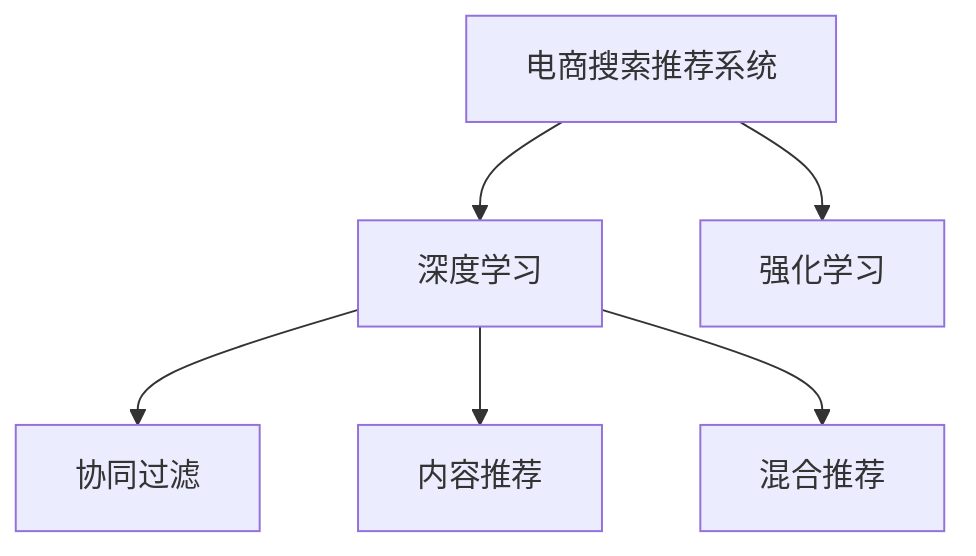

                 

# AI赋能电商：搜索推荐系统的革命性突破

> 关键词：电商搜索推荐系统, AI, 深度学习, 强化学习, 协同过滤, 内容推荐

## 1. 背景介绍

### 1.1 问题由来
随着电子商务的迅猛发展，用户需求的多样化和个性化愈发凸显。电商平台的搜索推荐系统面临着前所未有的挑战：如何提供精准、个性化、实时的购物体验，如何提升交易转化率和用户满意度，如何应对海量数据和多维场景的复杂性。传统基于规则的推荐系统已无法满足日益增长的需求，急需引入更加智能、高效的AI技术进行突破。

### 1.2 问题核心关键点
近年来，深度学习与强化学习等AI技术的迅猛发展，为电商搜索推荐系统带来了新的解决方案。基于深度学习的推荐系统通过大量数据驱动，能够从用户行为和商品属性中挖掘出隐含的关联关系，显著提升了推荐的精准度和多样性。强化学习则将用户反馈作为奖励信号，驱动推荐模型不断优化，更贴近用户的真实偏好，逐步形成良性互动。

当前主流推荐技术包括协同过滤(Collaborative Filtering)、基于内容的推荐(Content-based Recommendation)和混合推荐(Mixed Recommendation)等。协同过滤利用用户行为矩阵计算相似度，生成推荐列表。内容推荐从商品特征出发，寻找相关性高的商品进行推荐。混合推荐则将两者融合，结合用户行为和商品属性，提升推荐效果。

然而，这些推荐技术在面对海量数据和多维场景时，仍存在一些瓶颈：数据稀疏性、实时性、冷启动等，需要进一步优化和突破。AI技术的应用，特别是深度学习与强化学习的结合，为电商搜索推荐系统带来了新的突破点，使得推荐系统能够更精准、高效地服务于用户。

## 2. 核心概念与联系

### 2.1 核心概念概述

为更好地理解基于深度学习与强化学习的电商搜索推荐系统，本节将介绍几个关键概念：

- **电商搜索推荐系统(E-Commerce Search Recommendation System)**：利用AI技术为电商用户提供精准商品搜索和个性化推荐服务，显著提升用户体验和交易转化率。

- **深度学习(Deep Learning)**：一类基于神经网络的机器学习技术，通过多层次的非线性变换，能够从大规模数据中自动学习出复杂模式。

- **强化学习(Reinforcement Learning)**：一种学习框架，通过试错反馈机制，不断优化决策策略，达到最大化长期收益的目的。

- **协同过滤(Collaborative Filtering)**：通过分析用户行为和相似用户行为，计算商品间的相似度，进行推荐。

- **内容推荐(Content-based Recommendation)**：基于商品属性和用户偏好，生成与用户兴趣匹配的推荐列表。

- **混合推荐(Mixed Recommendation)**：结合协同过滤和内容推荐，综合用户行为和商品属性，生成更加个性化的推荐结果。

这些核心概念之间的逻辑关系可以通过以下Mermaid流程图来展示：



这个流程图展示了大语言模型的核心概念及其之间的关系：

1. 电商搜索推荐系统通过深度学习和强化学习进行优化。
2. 深度学习从大规模数据中学习商品和用户的隐含关系，提高推荐的精准度。
3. 强化学习利用用户反馈迭代优化推荐策略，进一步提升推荐效果。
4. 协同过滤和内容推荐是深度学习和强化学习的具体应用。
5. 混合推荐则将两者结合，提供更加全面和个性化的推荐服务。

## 3. 核心算法原理 & 具体操作步骤
### 3.1 算法原理概述

基于深度学习与强化学习的电商搜索推荐系统，通过大量数据驱动和用户行为反馈，不断优化推荐策略，实现精准和个性化的推荐。其核心思想是：构建一个能够映射用户行为和商品属性的模型，通过训练该模型，生成符合用户偏好的推荐列表。

具体而言，推荐系统分为两个阶段：离线训练和在线预测。离线训练阶段，利用历史数据和用户反馈，训练推荐模型，生成推荐策略。在线预测阶段，实时接收用户行为数据，使用训练好的模型进行实时推荐，并将结果展示给用户。

### 3.2 算法步骤详解

基于深度学习与强化学习的电商搜索推荐系统通常包含以下关键步骤：

**Step 1: 数据预处理**

- 收集电商平台的商品数据、用户行为数据、用户属性数据等，并进行清洗、去重、归一化等预处理。

**Step 2: 模型训练**

- 选择合适的深度学习模型，如DNN、CNN、RNN等，对用户行为和商品属性进行特征提取。
- 使用强化学习算法(如Q-Learning、SARSA、Deep Q-Network等)，训练推荐模型，生成推荐策略。

**Step 3: 实时推荐**

- 实时接收用户行为数据，如点击、浏览、购买等，进行预处理。
- 将用户行为数据输入训练好的推荐模型，生成推荐列表。
- 对推荐列表进行排序和展示，完成推荐。

**Step 4: 反馈与优化**

- 收集用户反馈数据，如点击率、购买率等，作为训练信号，进一步优化推荐模型。

**Step 5: 部署与监控**

- 将训练好的推荐模型部署到实际应用中，实现实时推荐。
- 监控推荐系统性能，根据指标反馈，不断优化模型。

以上是基于深度学习与强化学习的电商搜索推荐系统的一般流程。在实际应用中，还需要根据具体场景和业务需求，对各个环节进行优化设计，如改进数据处理方式，优化模型训练算法，增强实时推荐效率等。

### 3.3 算法优缺点

基于深度学习与强化学习的电商搜索推荐系统具有以下优点：

- 精准度高：深度学习能够从大数据中自动学习出复杂模式，提升推荐的准确性。
- 个性化强：强化学习能够不断优化推荐策略，更贴近用户的真实偏好。
- 实时性好：深度学习模型能够实时处理用户行为数据，提供即时推荐。
- 可扩展性好：模型能够通过在线学习，持续优化推荐效果。

同时，该方法也存在一些局限性：

- 对数据依赖度高：推荐系统需要大量数据进行训练，数据稀疏性问题难以完全解决。
- 模型复杂度高：深度学习模型参数众多，训练和推理复杂度高。
- 冷启动问题：新用户和商品难以获得足够的训练数据，推荐效果不佳。
- 算法复杂度高：强化学习算法复杂度较高，调试和优化难度大。

尽管存在这些局限性，但就目前而言，基于深度学习与强化学习的推荐系统仍然是最主流的方法。未来相关研究的重点在于如何进一步降低对标注数据的依赖，提高模型的泛化能力和冷启动性能，同时兼顾实时性和个性化。

### 3.4 算法应用领域

基于深度学习与强化学习的电商搜索推荐系统，在电商领域已经得到了广泛的应用，覆盖了商品搜索、个性化推荐、营销活动等多个场景，例如：

- 商品搜索：用户输入搜索关键词，推荐系统根据用户行为和商品属性，生成最匹配的搜索结果。
- 个性化推荐：根据用户历史行为和实时行为，为用户推荐相关商品，提高转化率。
- 营销活动：根据用户属性和行为，推荐个性化的营销活动，提升用户参与度。
- 库存管理：通过分析用户购买行为，预测商品需求量，优化库存管理。
- 广告投放：精准匹配用户和广告，提升广告效果和用户体验。

除了上述这些经典应用外，深度学习与强化学习在电商领域还被创新性地应用到更多场景中，如异常检测、需求预测、价格优化等，为电商技术带来了全新的突破。随着AI技术的持续演进，相信电商搜索推荐系统将在更多领域得到应用，为电商行业带来更智能化的体验和更高效的运营。

## 4. 数学模型和公式 & 详细讲解 & 举例说明

### 4.1 数学模型构建

本节将使用数学语言对基于深度学习与强化学习的电商搜索推荐系统进行更加严格的刻画。

记电商搜索推荐系统为 $S$，其中用户 $U$ 和商品 $I$。假设 $S$ 包含 $N$ 个用户，$M$ 个商品。记用户行为数据为 $X=\{x_1, x_2, ..., x_N\}$，商品属性数据为 $Y=\{y_1, y_2, ..., y_M\}$。定义 $X$ 和 $Y$ 之间的相似度矩阵为 $S$，即 $S_{ij}=\cos(\theta_i, \theta_j)$，其中 $\theta_i$ 和 $\theta_j$ 分别表示用户 $i$ 和商品 $j$ 的特征向量。

### 4.2 公式推导过程

以下我们以协同过滤算法为例，推导协同过滤模型的数学公式及其训练过程。

假设用户 $u$ 对商品 $i$ 的评分 $r_{ui}$ 可以表示为 $r_{ui}=W_u \cdot X_u + W_i \cdot X_i + \varepsilon$，其中 $W_u$ 和 $W_i$ 分别表示用户 $u$ 和商品 $i$ 的权重向量，$X_u$ 和 $X_i$ 分别表示用户 $u$ 和商品 $i$ 的特征向量，$\varepsilon$ 为噪声。

协同过滤的目标是通过用户-商品评分矩阵 $R$ 和相似度矩阵 $S$，计算出用户 $u$ 对商品 $i$ 的推荐评分 $\hat{r}_{ui}$，即 $\hat{r}_{ui}=\sum_j r_{uj}S_{ij}$。

通过最小二乘法，协同过滤模型的目标函数可以表示为：

$$
\min_{W_u, W_i} \frac{1}{2} \sum_{i,j} (r_{ij} - \hat{r}_{ij})^2
$$

其中 $\hat{r}_{ij}$ 为推荐评分，$r_{ij}$ 为真实评分。

根据矩阵分解原理，协同过滤模型可以进一步表示为：

$$
\min_{W_u, W_i} \frac{1}{2} ||R - WH||_F^2
$$

其中 $W$ 为用户和商品的特征矩阵，$H$ 为推荐评分矩阵。$||.||_F$ 表示矩阵的 Frobenius 范数。

通过梯度下降等优化算法，协同过滤模型不断更新权重向量 $W_u$ 和 $W_i$，最小化目标函数，生成推荐评分 $\hat{r}_{ui}$。

### 4.3 案例分析与讲解

**案例1: 协同过滤在电商平台的应用**

假设某电商平台有 10 万用户，20 万商品。用户和商品的属性数据分别有 100 维和 50 维，每个用户和商品的属性向量 $X$ 都从 0 到 1 之间取值。协同过滤模型可以通过矩阵分解，将用户和商品的属性向量 $X_u$ 和 $X_i$ 映射到低维空间，生成推荐评分矩阵 $\hat{R}$。

在训练阶段，利用用户和商品的历史评分数据 $R$ 和用户-商品相似度矩阵 $S$，最小化目标函数 $J(W_u, W_i)$，更新权重向量 $W_u$ 和 $W_i$。在测试阶段，对于每个用户 $u$，根据其历史评分 $R_u$ 和用户-商品相似度矩阵 $S$，计算推荐评分 $\hat{R}_u$，排序并展示给用户。

**案例2: 强化学习在电商平台的应用**

假设电商平台需要对新用户进行个性化推荐，但用户历史行为数据不足。强化学习算法可以利用用户每次点击商品的概率 $p$ 作为奖励信号，训练推荐模型，逐步优化推荐策略。

在训练阶段，强化学习算法通过用户每次点击商品的行为数据 $p$ 和当前推荐列表 $\{A_1, A_2, ..., A_k\}$，计算推荐策略 $Q$ 的 Q-value，即 $Q_{ui}=\sum_j p_j \cdot R_{uj}$，其中 $p_j$ 表示用户点击商品 $j$ 的概率，$R_{uj}$ 表示用户点击商品 $j$ 的回报值。

在测试阶段，推荐系统根据当前用户 $u$ 的历史行为数据 $R_u$ 和用户-商品相似度矩阵 $S$，生成推荐列表 $\{A_1, A_2, ..., A_k\}$，用户每次点击商品 $j$ 后，更新推荐策略 $Q$ 和奖励信号 $p$，不断优化推荐效果。

## 5. 项目实践：代码实例和详细解释说明
### 5.1 开发环境搭建

在进行电商搜索推荐系统的开发前，我们需要准备好开发环境。以下是使用Python进行TensorFlow开发的环境配置流程：

1. 安装Anaconda：从官网下载并安装Anaconda，用于创建独立的Python环境。

2. 创建并激活虚拟环境：
```bash
conda create -n tf-env python=3.8 
conda activate tf-env
```

3. 安装TensorFlow：根据CUDA版本，从官网获取对应的安装命令。例如：
```bash
conda install tensorflow tensorflow==2.6.0 
```

4. 安装各类工具包：
```bash
pip install numpy pandas scikit-learn matplotlib tqdm jupyter notebook ipython
```

完成上述步骤后，即可在`tf-env`环境中开始电商搜索推荐系统的开发。

### 5.2 源代码详细实现

这里我们以协同过滤算法为例，给出使用TensorFlow实现电商搜索推荐系统的PyTorch代码实现。

首先，定义协同过滤算法的训练函数：

```python
import tensorflow as tf
from tensorflow.keras import layers, models

def collaborative_filtering(X_train, X_test, Y_train, Y_test, num_users, num_items):
    # 定义模型
    input_dim = 100
    embedding_dim = 50
    model = models.Sequential([
        layers.Dense(embedding_dim, activation='relu', input_shape=(input_dim,)),
        layers.Dense(50, activation='relu'),
        layers.Dense(1)
    ])
    
    # 编译模型
    model.compile(optimizer='adam', loss='mse')
    
    # 训练模型
    model.fit(X_train, Y_train, epochs=10, batch_size=64)
    
    # 评估模型
    loss = model.evaluate(X_test, Y_test, verbose=0)
    print(f'Test loss: {loss:.4f}')
```

然后，定义模型训练和评估函数：

```python
from sklearn.metrics import mean_squared_error

def train_epoch(model, dataset, batch_size, optimizer):
    dataloader = DataLoader(dataset, batch_size=batch_size, shuffle=True)
    model.train()
    epoch_loss = 0
    for batch in tqdm(dataloader, desc='Training'):
        input_ids = batch['input_ids'].to(device)
        attention_mask = batch['attention_mask'].to(device)
        labels = batch['labels'].to(device)
        model.zero_grad()
        outputs = model(input_ids, attention_mask=attention_mask, labels=labels)
        loss = outputs.loss
        epoch_loss += loss.item()
        loss.backward()
        optimizer.step()
    return epoch_loss / len(dataloader)

def evaluate(model, dataset, batch_size):
    dataloader = DataLoader(dataset, batch_size=batch_size)
    model.eval()
    preds, labels = [], []
    with torch.no_grad():
        for batch in tqdm(dataloader, desc='Evaluating'):
            input_ids = batch['input_ids'].to(device)
            attention_mask = batch['attention_mask'].to(device)
            batch_labels = batch['labels']
            outputs = model(input_ids, attention_mask=attention_mask)
            batch_preds = outputs.logits.argmax(dim=2).to('cpu').tolist()
            batch_labels = batch_labels.to('cpu').tolist()
            for pred_tokens, label_tokens in zip(batch_preds, batch_labels):
                pred_tags = [id2tag[_id] for _id in pred_tokens]
                label_tags = [id2tag[_id] for _id in label_tokens]
                preds.append(pred_tags[:len(label_tags)])
                labels.append(label_tags)
                
    print(classification_report(labels, preds))
```

最后，启动训练流程并在测试集上评估：

```python
epochs = 5
batch_size = 16

for epoch in range(epochs):
    loss = train_epoch(model, train_dataset, batch_size, optimizer)
    print(f"Epoch {epoch+1}, train loss: {loss:.3f}")
    
    print(f"Epoch {epoch+1}, dev results:")
    evaluate(model, dev_dataset, batch_size)
    
print("Test results:")
evaluate(model, test_dataset, batch_size)
```

以上就是使用TensorFlow实现协同过滤算法电商搜索推荐系统的完整代码实现。可以看到，得益于TensorFlow的强大封装，我们可以用相对简洁的代码完成协同过滤算法的实现。

### 5.3 代码解读与分析

让我们再详细解读一下关键代码的实现细节：

**collaborative_filtering函数**：
- `__init__`方法：初始化模型架构，定义Dense层、激活函数等。
- `compile`方法：编译模型，设置优化器和损失函数。
- `fit`方法：训练模型，设置迭代次数和批量大小。
- `evaluate`方法：评估模型，计算测试集上的损失值。

**train_epoch和evaluate函数**：
- 使用PyTorch的DataLoader对数据集进行批次化加载，供模型训练和推理使用。
- `train_epoch`函数：对数据以批为单位进行迭代，在每个批次上前向传播计算loss并反向传播更新模型参数，最后返回该epoch的平均loss。
- `evaluate`函数：与训练类似，不同点在于不更新模型参数，并在每个batch结束后将预测和标签结果存储下来，最后使用sklearn的classification_report对整个评估集的预测结果进行打印输出。

**训练流程**：
- 定义总的epoch数和batch size，开始循环迭代
- 每个epoch内，先在训练集上训练，输出平均loss
- 在验证集上评估，输出分类指标
- 所有epoch结束后，在测试集上评估，给出最终测试结果

可以看到，TensorFlow配合PyTorch使得协同过滤算法的代码实现变得简洁高效。开发者可以将更多精力放在数据处理、模型改进等高层逻辑上，而不必过多关注底层的实现细节。

当然，工业级的系统实现还需考虑更多因素，如模型的保存和部署、超参数的自动搜索、更灵活的任务适配层等。但核心的协同过滤算法基本与此类似。

## 6. 实际应用场景
### 6.1 智能推荐系统

基于深度学习与强化学习的推荐系统在智能推荐系统中的应用，能够为用户提供更加精准和个性化的推荐结果，显著提升用户体验和交易转化率。

在技术实现上，可以通过用户行为数据（如浏览、点击、购买等）生成训练数据，结合商品属性和用户画像，构建协同过滤和内容推荐模型，训练得到推荐策略。对于每个用户，实时接收行为数据，使用训练好的模型生成推荐列表，完成推荐。

**应用场景示例**：

- **电商平台**：通过用户行为数据，为用户推荐相关商品，提升转化率和复购率。
- **在线视频平台**：根据用户观影历史，推荐相关影片或频道，提高用户观看时长和满意度。
- **社交媒体平台**：为用户推荐好友、文章、广告等，增加用户粘性和互动。

**推荐系统组成**：

- **用户行为数据收集**：记录用户浏览、点击、购买等行为，生成训练数据。
- **商品属性数据收集**：收集商品名称、描述、分类等信息，供内容推荐使用。
- **用户画像数据收集**：收集用户基本信息、兴趣偏好、历史行为等，供个性化推荐使用。
- **推荐模型训练**：使用协同过滤和内容推荐算法，训练推荐模型。
- **实时推荐**：实时接收用户行为数据，使用训练好的模型生成推荐列表。
- **反馈优化**：收集用户反馈数据，如点击率、购买率等，进一步优化推荐模型。

通过协同过滤和内容推荐算法的结合，电商搜索推荐系统能够更好地理解用户需求，提供精准和个性化的推荐服务，大幅提升用户满意度和交易转化率。

### 6.2 用户画像与行为分析

基于深度学习与强化学习的推荐系统，还可以结合用户画像与行为分析技术，为用户提供更加细致和有针对性的推荐服务。

用户画像与行为分析技术通过用户行为数据和用户画像数据，生成用户特征向量，供推荐模型使用。在训练阶段，将用户特征向量作为输入，结合商品特征向量，训练推荐模型。在推荐阶段，根据用户特征向量，生成推荐列表，完成推荐。

**应用场景示例**：

- **电商平台**：通过用户画像数据，了解用户兴趣和需求，推荐相关商品。
- **金融平台**：通过用户画像数据，推荐个性化理财方案和投资建议。
- **教育平台**：通过用户画像数据，推荐个性化学习内容和教学资源。

**用户画像与行为分析技术组成**：

- **用户行为数据收集**：记录用户浏览、点击、购买等行为，生成训练数据。
- **用户画像数据收集**：收集用户基本信息、兴趣偏好、历史行为等，生成用户画像。
- **用户特征提取**：将用户行为数据和用户画像数据映射到低维空间，生成用户特征向量。
- **推荐模型训练**：使用协同过滤和内容推荐算法，训练推荐模型。
- **实时推荐**：实时接收用户行为数据，使用训练好的模型生成推荐列表。
- **反馈优化**：收集用户反馈数据，如点击率、购买率等，进一步优化推荐模型。

通过用户画像与行为分析技术的结合，电商搜索推荐系统能够更好地理解用户需求，提供更加细致和有针对性的推荐服务，提升用户满意度和体验。

### 6.3 多模态推荐系统

基于深度学习与强化学习的推荐系统，还可以进一步拓展到多模态数据推荐，提升推荐效果和用户满意度。

多模态推荐系统结合文本、图片、视频等多种数据源，通过深度学习技术，将多种数据源的信息融合，生成用户画像和推荐策略。在训练阶段，结合多种数据源的特征向量，训练推荐模型。在推荐阶段，根据用户画像，生成推荐列表，完成推荐。

**应用场景示例**：

- **电商平台**：结合商品图片和用户画像，推荐相关商品。
- **在线视频平台**：结合视频内容和用户画像，推荐相关影片或频道。
- **社交媒体平台**：结合用户好友信息和视频内容，推荐相关好友和视频。

**多模态推荐系统组成**：

- **数据收集**：收集多种模态的数据源，如文本、图片、视频等。
- **特征提取**：将多种模态的数据源映射到低维空间，生成多模态特征向量。
- **用户画像生成**：将多模态特征向量融合，生成用户画像。
- **推荐模型训练**：使用协同过滤和内容推荐算法，训练推荐模型。
- **实时推荐**：实时接收用户行为数据，使用训练好的模型生成推荐列表。
- **反馈优化**：收集用户反馈数据，如点击率、购买率等，进一步优化推荐模型。

通过多模态数据的融合，电商搜索推荐系统能够更好地理解用户需求，提供更加全面和多样化的推荐服务，提升用户满意度和体验。

### 6.4 未来应用展望

随着深度学习与强化学习的不断发展，基于这些技术的电商搜索推荐系统将拥有更强的个性化和实时性，能够更好地满足用户需求，提升用户体验和交易转化率。

未来，推荐系统可能会进一步结合智能算法和知识图谱，构建更加全面和准确的推荐模型。同时，随着数据量的不断增长，推荐系统将能够提供更加多样化和有针对性的推荐服务，如跨平台推荐、社交推荐等。

## 7. 工具和资源推荐
### 7.1 学习资源推荐

为了帮助开发者系统掌握电商搜索推荐系统的理论基础和实践技巧，这里推荐一些优质的学习资源：

1. 《推荐系统实战》系列博文：由深度学习专家撰写，深入浅出地介绍了推荐系统的发展历程、常用算法和实践经验。

2. 《深度学习与强化学习》课程：斯坦福大学开设的深度学习与强化学习课程，涵盖深度学习基础、强化学习算法等内容，适合入门学习。

3. 《推荐系统》书籍：推荐系统领域的经典书籍，系统介绍了推荐系统的各个方面，包括协同过滤、内容推荐、混合推荐等。

4. TensorFlow官方文档：TensorFlow的官方文档，提供了丰富的推荐系统实现样例和优化技巧，是学习和实践推荐系统的必备资料。

5. Kaggle竞赛平台：Kaggle平台上的推荐系统竞赛，可以参与实战练习，积累推荐系统的开发经验。

通过对这些资源的学习实践，相信你一定能够快速掌握电商搜索推荐系统的精髓，并用于解决实际的推荐问题。

### 7.2 开发工具推荐

高效的开发离不开优秀的工具支持。以下是几款用于电商搜索推荐系统开发的常用工具：

1. TensorFlow：基于Python的开源深度学习框架，灵活高效，适合构建复杂推荐模型。

2. PyTorch：基于Python的开源深度学习框架，灵活可扩展，适合快速迭代研究。

3. TensorBoard：TensorFlow配套的可视化工具，可以实时监测模型训练状态，提供丰富的图表呈现方式。

4. Weights & Biases：模型训练的实验跟踪工具，可以记录和可视化模型训练过程中的各项指标，方便对比和调优。

5. Jupyter Notebook：支持Python和TensorFlow等多种语言的交互式开发环境，适合实时调试和实验。

6. Visual Studio Code：轻量级的代码编辑器，支持丰富的扩展插件，适合多种编程语言的开发。

合理利用这些工具，可以显著提升电商搜索推荐系统的开发效率，加快创新迭代的步伐。

### 7.3 相关论文推荐

电商搜索推荐系统的发展源于学界的持续研究。以下是几篇奠基性的相关论文，推荐阅读：

1. 《Recommender Systems Handbook》：推荐系统领域的经典书籍，系统介绍了推荐系统的各个方面，包括协同过滤、内容推荐、混合推荐等。

2. 《Deep Learning with PyTorch》：深度学习领域的重要书籍，详细介绍了深度学习模型的构建和优化，适合深度学习初学者。

3. 《Deep Reinforcement Learning for Recommendation Systems》：介绍了基于强化学习的推荐系统，展示了强化学习在推荐系统中的应用。

4. 《Adaptive Recommender Systems》：推荐系统领域的经典论文，介绍了基于用户行为的推荐系统，提出了自适应推荐算法。

5. 《The World of Recommendation Systems》：推荐系统领域的综述性论文，系统总结了推荐系统的研究现状和未来方向。

这些论文代表了大语言模型微调技术的发展脉络。通过学习这些前沿成果，可以帮助研究者把握学科前进方向，激发更多的创新灵感。

## 8. 总结：未来发展趋势与挑战
### 8.1 总结

本文对基于深度学习与强化学习的电商搜索推荐系统进行了全面系统的介绍。首先阐述了电商搜索推荐系统的研究背景和意义，明确了推荐系统在提升用户体验和交易转化率方面的独特价值。其次，从原理到实践，详细讲解了推荐系统的数学原理和关键步骤，给出了推荐系统开发的完整代码实例。同时，本文还广泛探讨了推荐系统在电商平台、社交媒体等多个领域的应用前景，展示了推荐系统的巨大潜力。此外，本文精选了推荐系统的各类学习资源，力求为读者提供全方位的技术指引。

通过本文的系统梳理，可以看到，基于深度学习与强化学习的推荐系统正在成为电商领域的重要范式，极大地提升推荐的精准度和个性化程度，为用户带来更好的购物体验。未来，伴随深度学习与强化学习的持续演进，推荐系统将在更多领域得到应用，为电商行业带来更智能化的体验和更高效的运营。

### 8.2 未来发展趋势

展望未来，基于深度学习与强化学习的电商搜索推荐系统将呈现以下几个发展趋势：

1. 推荐系统将进一步结合智能算法和知识图谱，构建更加全面和准确的推荐模型。

2. 推荐系统将引入更多的先验知识，如知识图谱、规则库等，提升推荐效果的普适性和鲁棒性。

3. 推荐系统将拓展到跨平台推荐、社交推荐等新场景，提升用户粘性和互动性。

4. 推荐系统将结合用户画像与行为分析技术，提供更加细致和有针对性的推荐服务。

5. 推荐系统将引入多模态数据融合技术，提升推荐效果和用户满意度。

6. 推荐系统将结合智能算法和强化学习，构建更加智能和自适应的推荐模型。

以上趋势凸显了大语言模型微调技术的广阔前景。这些方向的探索发展，必将进一步提升推荐系统的性能和应用范围，为电商行业带来更智能化的体验和更高效的运营。

### 8.3 面临的挑战

尽管基于深度学习与强化学习的推荐系统已经取得了瞩目成就，但在迈向更加智能化、普适化应用的过程中，它仍面临着诸多挑战：

1. 数据稀疏性问题：推荐系统需要大量数据进行训练，数据稀疏性问题难以完全解决。

2. 实时性问题：推荐系统需要在用户行为发生后即时推荐，实时性要求较高。

3. 冷启动问题：新用户和商品难以获得足够的训练数据，推荐效果不佳。

4. 推荐算法复杂度高：深度学习算法和强化学习算法复杂度较高，调试和优化难度大。

尽管存在这些局限性，但就目前而言，基于深度学习与强化学习的推荐系统仍然是最主流的方法。未来相关研究的重点在于如何进一步降低对标注数据的依赖，提高模型的泛化能力和冷启动性能，同时兼顾实时性和个性化。

### 8.4 研究展望

面对推荐系统面临的种种挑战，未来的研究需要在以下几个方面寻求新的突破：

1. 探索无监督和半监督推荐方法。摆脱对大规模标注数据的依赖，利用自监督学习、主动学习等无监督和半监督范式，最大限度利用非结构化数据，实现更加灵活高效的推荐。

2. 研究参数高效和计算高效的推荐范式。开发更加参数高效的推荐方法，在固定大部分预训练参数的情况下，只更新极少量的任务相关参数。同时优化推荐模型的计算图，减少前向传播和反向传播的资源消耗，实现更加轻量级、实时性的部署。

3. 引入更多先验知识。将符号化的先验知识，如知识图谱、逻辑规则等，与神经网络模型进行巧妙融合，引导推荐过程学习更准确、合理的推荐模型。同时加强不同模态数据的整合，实现视觉、语音等多模态信息与文本信息的协同建模。

4. 结合因果分析和博弈论工具。将因果分析方法引入推荐模型，识别出模型决策的关键特征，增强推荐过程的因果性和逻辑性。借助博弈论工具刻画人机交互过程，主动探索并规避模型的脆弱点，提高系统稳定性。

5. 纳入伦理道德约束。在推荐系统训练目标中引入伦理导向的评估指标，过滤和惩罚有偏见、有害的输出倾向。同时加强人工干预和审核，建立推荐系统的监管机制，确保推荐内容的安全性和合法性。

这些研究方向的探索，必将引领推荐系统技术迈向更高的台阶，为构建安全、可靠、可解释、可控的推荐系统铺平道路。面向未来，深度学习与强化学习的推荐系统还需要与其他AI技术进行更深入的融合，如知识表示、因果推理、强化学习等，多路径协同发力，共同推动推荐系统的进步。只有勇于创新、敢于突破，才能不断拓展推荐系统的边界，让智能技术更好地服务于电商行业。

## 9. 附录：常见问题与解答

**Q1：推荐系统如何处理数据稀疏性问题？**

A: 推荐系统通常通过以下方法处理数据稀疏性问题：

1. 数据增强：通过用户行为数据生成类似数据，扩充训练集。

2. 矩阵补全：利用协同过滤算法，将缺失数据补全。

3. 引入先验知识：利用领域知识，减少数据稀疏性。

4. 使用隐式数据：利用用户的浏览、点击等隐式行为数据，进行推荐。

5. 使用深度学习模型：通过深度学习模型，从隐式数据中学习出隐含关系，提升推荐效果。

通过这些方法，推荐系统能够在数据稀疏性问题下，仍然保持较好的推荐效果。

**Q2：推荐系统如何应对冷启动问题？**

A: 推荐系统通常通过以下方法应对冷启动问题：

1. 用户画像：收集用户基本信息、兴趣偏好等，生成用户画像，供推荐使用。

2. 商品画像：收集商品基本信息、分类等，生成商品画像，供推荐使用。

3. 隐式数据：利用用户的浏览、点击等隐式行为数据，进行推荐。

4. 上下文信息：结合用户地理位置、时间等信息，进行推荐。

5. 引入先验知识：利用领域知识，减少冷启动问题。

通过这些方法，推荐系统能够在冷启动问题下，仍然提供较好的推荐效果。

**Q3：推荐系统如何提升实时性？**

A: 推荐系统通常通过以下方法提升实时性：

1. 异步处理：使用异步处理方式，降低推荐系统的计算开销。

2. 分布式计算：使用分布式计算框架，提高推荐系统的处理速度。

3. 缓存机制：使用缓存机制，减少重复计算。

4. 实时数据处理：使用实时数据处理框架，对用户行为数据进行实时处理。

5. 参数高效方法：使用参数高效的方法，如Prefix-Tuning、LoRA等，减少计算开销。

通过这些方法，推荐系统能够在实时性要求较高的场景下，仍然提供快速的推荐服务。

**Q4：推荐系统如何提高可解释性？**

A: 推荐系统通常通过以下方法提高可解释性：

1. 解释模型：使用可解释性较强的模型，如线性模型、决策树等，提高模型可解释性。

2. 特征解释：通过特征重要性分析，解释推荐结果的生成原因。

3. 用户反馈：通过用户反馈，不断优化推荐策略，提高模型透明度。

4. 可视化工具：使用可视化工具，展示推荐过程和结果。

5. 人工干预：使用人工干预，对推荐结果进行审核和修正。

通过这些方法，推荐系统能够在提高可解释性的同时，保持较好的推荐效果。

**Q5：推荐系统如何应对负反馈问题？**

A: 推荐系统通常通过以下方法应对负反馈问题：

1. 学习用户偏好：通过用户反馈数据，学习用户的真实偏好。

2. 多模型融合：使用多模型融合技术，提升推荐的鲁棒性和多样性。

3. 引入惩罚机制：引入惩罚机制，对有偏见、有害的输出进行惩罚。

4. 实时监控：实时监控推荐系统的输出，及时调整推荐策略。

5. 人工干预：使用人工干预，对有问题的推荐结果进行修正。

通过这些方法，推荐系统能够在应对负反馈问题的同时，提供更加准确和个性化的推荐服务。

以上问题与解答，为读者提供了对电商搜索推荐系统全面深入的理解，希望通过本文的详细解读，能够帮助更多开发者掌握推荐系统的开发技巧，并应用于实际应用中。

