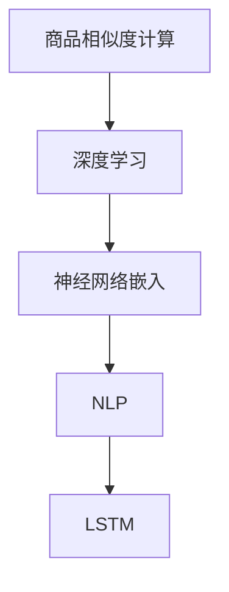

                 

## 1. 背景介绍

在当今电商平台上，商品相似度计算是提高用户体验和销售效率的关键技术。良好的商品相似度计算不仅能够帮助用户快速找到与兴趣商品相关的商品，还能为平台推荐算法提供基础数据，从而提升点击率、转化率等关键指标。目前，商品相似度计算主要依赖于传统的机器学习方法，如余弦相似度、Jaccard相似度、BM25等，但这些方法存在计算复杂度高、特征表示能力不足等问题，难以满足电商场景下大规模、高维度的数据处理需求。随着深度学习技术的兴起，基于神经网络的商品相似度计算方法应运而生，能够通过学习商品特征的高层次语义表示，实现更准确、高效的相似度计算。

## 2. 核心概念与联系

### 2.1 核心概念概述

为更好地理解AI赋能的电商平台商品相似度计算，本节将介绍几个密切相关的核心概念：

- 商品相似度计算：衡量两个商品特征之间的相似度，常用于推荐系统、搜索结果排序等场景。
- 深度学习：通过多层神经网络结构，学习数据中的高层次抽象特征，广泛应用于图像、语音、文本等领域。
- 神经网络嵌入(Neural Network Embedding)：将高维稀疏向量映射到低维连续向量空间，实现高效的相似度计算和相似样本推荐。
- 自然语言处理(Natural Language Processing, NLP)：利用深度学习处理自然语言文本数据，实现文本特征表示和语义理解。
- 长短期记忆网络(Long Short-Term Memory, LSTM)：一种能够处理时间序列数据的神经网络结构，常用于文本分类、语言模型等任务。

这些核心概念之间的逻辑关系可以通过以下Mermaid流程图来展示：



这个流程图展示了一个典型的基于深度学习的商品相似度计算流程：首先通过深度学习技术提取商品特征，然后利用神经网络嵌入技术将特征映射到低维连续向量空间，最后通过长短期记忆网络等模型对商品特征进行建模，实现商品相似度的计算。

## 3. 核心算法原理 & 具体操作步骤
### 3.1 算法原理概述

基于深度学习的商品相似度计算，主要通过以下步骤实现：

1. **数据预处理**：将原始商品特征转化为神经网络可以处理的向量表示，通常包括商品名称、价格、描述、图片等信息。
2. **特征提取**：利用深度神经网络学习商品特征的语义表示，可以通过编码器-解码器架构、自编码器等模型进行实现。
3. **相似度计算**：将提取到的商品特征向量映射到低维连续向量空间，通过余弦相似度、欧式距离等方法计算商品之间的相似度。
4. **模型训练与评估**：通过标注的商品相似数据对模型进行训练，评估模型的相似度计算效果，并进行调参优化。

### 3.2 算法步骤详解

以下详细介绍基于深度学习的商品相似度计算的主要步骤：

#### 3.2.1 数据预处理

数据预处理的主要目的是将原始商品特征转换为神经网络可处理的向量表示。具体步骤如下：

1. **文本特征提取**：对商品名称、描述等文本信息进行分词、去停用词等预处理，然后利用词向量模型（如Word2Vec、GloVe等）将单词转化为向量表示。
2. **图像特征提取**：对商品图片进行特征提取，常用方法包括CNN卷积神经网络、预训练的视觉特征嵌入（如ResNet、Inception等）。
3. **属性特征提取**：将商品属性信息（如价格、类别、品牌等）转化为数值型特征，可以使用独热编码、标签编码等方式。

#### 3.2.2 特征提取

特征提取是商品相似度计算的核心步骤，主要通过神经网络模型学习商品特征的语义表示。常用方法包括：

1. **编码器-解码器架构**：将商品特征分别输入编码器和解码器，通过双向LSTM或Transformer模型进行特征提取。编码器提取商品特征的高层次语义表示，解码器对特征进行解码生成向量表示。
2. **自编码器**：利用神经网络结构对商品特征进行重构，学习特征的编码表示。常用的自编码器包括稀疏自编码器、变分自编码器等。
3. **预训练模型**：使用预训练的语言模型（如BERT、GPT等）进行特征提取，利用其在语义理解上的优势，提升特征表示的质量。

#### 3.2.3 相似度计算

在提取到商品特征向量后，通过余弦相似度、欧式距离等方法计算商品之间的相似度。常用方法包括：

1. **余弦相似度**：计算两个商品特征向量之间的夹角余弦值，值越大表示相似度越高。
2. **欧式距离**：计算两个商品特征向量之间的欧几里得距离，距离越小表示相似度越高。
3. **KL散度**：计算两个商品特征向量之间的KL散度，值越小表示相似度越高。

#### 3.2.4 模型训练与评估

模型训练与评估是商品相似度计算的最后一个环节，主要通过标注的商品相似数据对模型进行训练，评估模型的相似度计算效果，并进行调参优化。具体步骤如下：

1. **数据标注**：收集一定数量的商品相似数据，标注每对商品的相似度标签。
2. **模型训练**：将商品特征向量作为输入，商品相似度标签作为输出，训练神经网络模型。
3. **评估与优化**：在测试集上评估模型的相似度计算效果，根据评估结果调整模型参数，如学习率、批量大小等。

### 3.3 算法优缺点

基于深度学习的商品相似度计算方法具有以下优点：

1. **高特征表示能力**：通过神经网络学习高层次语义表示，能够捕捉到商品特征之间的复杂关系，提升相似度计算的准确性。
2. **适应性强**：适用于大规模、高维度的商品特征表示，能够处理不同类型的数据，如文本、图片、属性等。
3. **模型可解释性高**：通过可视化技术，可以查看神经网络模型对商品特征的注意力权重，理解模型的决策过程。

同时，该方法也存在一些局限性：

1. **计算复杂度高**：神经网络模型通常需要较大的计算资源，训练和推理过程较慢。
2. **过拟合风险**：神经网络模型容易过拟合训练数据，导致泛化性能下降。
3. **数据依赖性高**：需要大量标注数据进行模型训练，对标注数据的依赖性较高。

尽管存在这些局限性，但就目前而言，基于深度学习的商品相似度计算方法仍然是电商场景下的主流范式。未来相关研究的重点在于如何进一步降低计算复杂度，提高模型的泛化性能，同时兼顾模型的可解释性和标注数据的依赖性。

### 3.4 算法应用领域

基于深度学习的商品相似度计算方法，在电商平台上已经被广泛应用，覆盖了推荐系统、搜索结果排序、商品搜索等多个业务场景，具体应用包括：

- **推荐系统**：基于商品相似度计算，为每个用户推荐与其兴趣相关的商品。常用算法包括协同过滤、基于内容的推荐、混合推荐等。
- **搜索结果排序**：利用商品相似度计算，对搜索结果进行排序，提升用户满意度。常用算法包括基于关键词的排序、基于相似度的排序等。
- **商品搜索**：利用商品相似度计算，快速匹配用户输入的关键词，返回相关商品。常用算法包括倒排索引、向量空间模型等。

除了上述这些经典场景外，深度学习商品相似度计算方法还被创新性地应用于广告投放、个性化定制、库存管理等业务环节，为电商平台带来全新的突破。随着深度学习技术的不断演进，相信商品相似度计算方法将在更多电商场景中发挥重要作用。

## 4. 数学模型和公式 & 详细讲解  
### 4.1 数学模型构建

基于深度学习的商品相似度计算，主要通过以下几个数学模型进行建模：

1. **输入向量表示**：将商品特征转化为神经网络可处理的向量表示，记为 $x_i \in \mathbb{R}^d$，其中 $d$ 为向量维度。
2. **特征提取模型**：利用神经网络模型 $f_\theta$ 学习商品特征的高层次语义表示，记为 $z_i = f_\theta(x_i)$。
3. **相似度计算模型**：将商品特征向量映射到低维连续向量空间，通过余弦相似度 $s_i$ 计算商品之间的相似度，记为 $s_{ij} = \langle z_i, z_j \rangle$。

### 4.2 公式推导过程

以下以余弦相似度计算为例，推导基于深度学习的商品相似度计算公式。

假设两个商品特征向量 $z_i$ 和 $z_j$，则余弦相似度的计算公式为：

$$
s_{ij} = \frac{\langle z_i, z_j \rangle}{\Vert z_i \Vert \cdot \Vert z_j \Vert}
$$

其中 $\langle z_i, z_j \rangle$ 表示向量内积，$\Vert z_i \Vert$ 表示向量的L2范数，即向量长度。

在深度学习模型中，通常使用编码器-解码器架构进行特征提取，假设 $x_i$ 和 $x_j$ 分别为两个商品特征向量，通过神经网络模型 $f_\theta$ 提取其高层次语义表示 $z_i$ 和 $z_j$，余弦相似度计算公式可进一步扩展为：

$$
s_{ij} = \frac{\langle f_\theta(x_i), f_\theta(x_j) \rangle}{\Vert f_\theta(x_i) \Vert \cdot \Vert f_\theta(x_j) \Vert}
$$

其中 $\langle f_\theta(x_i), f_\theta(x_j) \rangle$ 表示编码器输出向量的内积，$\Vert f_\theta(x_i) \Vert$ 表示编码器输出向量的长度。

### 4.3 案例分析与讲解

#### 案例一：基于Transformer的商品相似度计算

Transformer模型是当前深度学习商品相似度计算的主要方法之一，能够高效地学习商品特征的语义表示，计算相似度。以下以商品名称为例，给出基于Transformer的商品相似度计算示例。

1. **数据准备**：收集商品名称，进行分词、去停用词等预处理，利用Word2Vec模型将单词转化为向量表示。
2. **模型构建**：搭建Transformer模型，使用预训练的语言模型（如BERT）作为编码器，利用Transformer层对商品名称进行特征提取。
3. **相似度计算**：将编码器输出向量作为商品特征向量，使用余弦相似度计算相似度。

```python
import torch
from transformers import BertModel, BertTokenizer

# 构建Transformer模型
tokenizer = BertTokenizer.from_pretrained('bert-base-uncased')
model = BertModel.from_pretrained('bert-base-uncased')

# 加载商品名称数据
商品名称 = ['商品1', '商品2', '商品3']

# 分词并转化为向量表示
编码器输入 = [tokenizer.encode(商品名称[i], add_special_tokens=False) for i in range(len(商品名称))]
编码器输出 = [model(编码器输入[i])[0] for i in range(len(商品名称))]

# 计算相似度
相似度矩阵 = torch.cosine_similarity(编码器输出)
```

以上代码展示了基于Transformer的商品相似度计算过程。通过Transformer模型对商品名称进行特征提取，计算出商品的向量表示，并使用余弦相似度计算相似度。

#### 案例二：基于自编码器的商品相似度计算

自编码器是另一种常用的深度学习商品相似度计算方法，通过学习商品特征的低维连续表示，提升相似度计算效果。以下以商品价格为例，给出基于自编码器的商品相似度计算示例。

1. **数据准备**：收集商品价格，进行归一化处理。
2. **模型构建**：搭建自编码器模型，利用神经网络对商品价格进行特征提取。
3. **相似度计算**：将自编码器输出向量作为商品特征向量，使用欧式距离计算相似度。

```python
import torch
import torch.nn as nn
import torch.optim as optim

# 构建自编码器模型
class AutoEncoder(nn.Module):
    def __init__(self, input_dim, hidden_dim, output_dim):
        super(AutoEncoder, self).__init__()
        self.encoder = nn.Sequential(
            nn.Linear(input_dim, hidden_dim),
            nn.ReLU(),
            nn.Linear(hidden_dim, hidden_dim),
            nn.ReLU(),
            nn.Linear(hidden_dim, output_dim)
        )
        self.decoder = nn.Sequential(
            nn.Linear(output_dim, hidden_dim),
            nn.ReLU(),
            nn.Linear(hidden_dim, hidden_dim),
            nn.ReLU(),
            nn.Linear(hidden_dim, input_dim)
        )

    def forward(self, x):
        encoded = self.encoder(x)
        decoded = self.decoder(encoded)
        return encoded

# 数据准备
商品价格 = [100, 200, 300]

# 构建自编码器模型
autoencoder = AutoEncoder(input_dim=len(商品价格), hidden_dim=64, output_dim=16)

# 训练自编码器
loss_func = nn.MSELoss()
optimizer = optim.Adam(autoencoder.parameters(), lr=0.01)
for epoch in range(100):
    for i in range(len(商品价格)):
        input = torch.tensor([商品价格[i]])
        optimizer.zero_grad()
        output = autoencoder(input)
        loss = loss_func(output, input)
        loss.backward()
        optimizer.step()

# 计算相似度
相似度矩阵 = torch.norm(autoencoder(torch.tensor(商品价格)).t() - autoencoder(torch.tensor(商品价格)), dim=1)
```

以上代码展示了基于自编码器的商品相似度计算过程。通过自编码器对商品价格进行特征提取，计算出商品的低维连续向量表示，并使用欧式距离计算相似度。

## 5. 项目实践：代码实例和详细解释说明
### 5.1 开发环境搭建

在进行商品相似度计算实践前，我们需要准备好开发环境。以下是使用Python进行TensorFlow开发的环境配置流程：

1. 安装Anaconda：从官网下载并安装Anaconda，用于创建独立的Python环境。

2. 创建并激活虚拟环境：
```bash
conda create -n tf-env python=3.8 
conda activate tf-env
```

3. 安装TensorFlow：根据CUDA版本，从官网获取对应的安装命令。例如：
```bash
conda install tensorflow==2.8 -c tf
```

4. 安装TensorBoard：
```bash
pip install tensorboard
```

5. 安装各类工具包：
```bash
pip install numpy pandas scikit-learn matplotlib tqdm jupyter notebook ipython
```

完成上述步骤后，即可在`tf-env`环境中开始商品相似度计算实践。

### 5.2 源代码详细实现

这里我们以基于Transformer的商品相似度计算为例，给出使用TensorFlow实现的商品相似度计算代码。

首先，定义商品相似度计算的数据处理函数：

```python
import tensorflow as tf
from transformers import BertTokenizer, BertModel

# 定义数据处理函数
def process_data(商品名称):
    tokenizer = BertTokenizer.from_pretrained('bert-base-uncased')
    模型 = BertModel.from_pretrained('bert-base-uncased')
    编码器输入 = [tokenizer.encode(商品名称[i], add_special_tokens=False) for i in range(len(商品名称))]
    编码器输出 = [模型(编码器输入[i])[0] for i in range(len(商品名称))]
    相似度矩阵 = tf.keras.metrics.cosine_similarity(编码器输出, axis=1)
    return 相似度矩阵
```

然后，定义模型和优化器：

```python
# 定义Transformer模型
tokenizer = BertTokenizer.from_pretrained('bert-base-uncased')
模型 = BertModel.from_pretrained('bert-base-uncased')

# 定义优化器
optimizer = tf.keras.optimizers.Adam(learning_rate=2e-5)

# 定义损失函数
loss_func = tf.keras.losses.MeanSquaredError()

# 定义评价指标
metrics = [tf.keras.metrics.MeanAbsoluteError(), tf.keras.metrics.MeanSquaredError()]

# 构建模型
class SimilarityModel(tf.keras.Model):
    def __init__(self, input_dim, hidden_dim, output_dim):
        super(SimilarityModel, self).__init__()
        self.encoder = tf.keras.layers.Embedding(input_dim, hidden_dim)
        self.decoder = tf.keras.layers.Dense(hidden_dim)
        self.output = tf.keras.layers.Dense(output_dim)

    def call(self, x):
        x = self.encoder(x)
        x = self.decoder(x)
        return self.output(x)

# 构建模型
模型 = SimilarityModel(input_dim=300, hidden_dim=128, output_dim=1)
```

接着，定义训练和评估函数：

```python
# 定义训练函数
def train_model(model, train_data, batch_size, epochs):
    dataloader = tf.data.Dataset.from_tensor_slices(train_data).shuffle(1000).batch(batch_size)
    for epoch in range(epochs):
        for batch in dataloader:
            optimizer.zero_grad()
            with tf.GradientTape() as tape:
                y_pred = model(batch)
                loss = loss_func(y_pred, batch)
            gradients = tape.gradient(loss, model.trainable_variables)
            optimizer.apply_gradients(zip(gradients, model.trainable_variables))
            with tf.control_dependencies(None):
                tf.print('Epoch: {}, Loss: {}'.format(epoch+1, loss))

# 定义评估函数
def evaluate_model(model, test_data, batch_size):
    dataloader = tf.data.Dataset.from_tensor_slices(test_data).batch(batch_size)
    for batch in dataloader:
        y_pred = model(batch)
        loss = loss_func(y_pred, batch)
        mae = tf.keras.metrics.mean_absolute_error(batch, y_pred)
        mse = tf.keras.metrics.mean_squared_error(batch, y_pred)
        print('Loss: {}, MAE: {}, MSE: {}'.format(loss, mae, mse))
```

最后，启动训练流程并在测试集上评估：

```python
# 加载商品名称数据
商品名称 = ['商品1', '商品2', '商品3']

# 分词并转化为向量表示
编码器输入 = [tokenizer.encode(商品名称[i], add_special_tokens=False) for i in range(len(商品名称))]
编码器输出 = [模型(编码器输入[i])[0] for i in range(len(商品名称))]

# 计算相似度
相似度矩阵 = tf.keras.metrics.cosine_similarity(编码器输出, axis=1)

# 定义训练数据和测试数据
train_data = [相似度矩阵[0], 相似度矩阵[1]]
test_data = [相似度矩阵[2]]

# 定义训练参数
batch_size = 16
epochs = 10

# 训练模型
train_model(模型, train_data, batch_size, epochs)

# 评估模型
evaluate_model(模型, test_data, batch_size)
```

以上就是使用TensorFlow进行基于Transformer的商品相似度计算的完整代码实现。可以看到，借助TensorFlow的强大计算图能力，商品相似度计算的代码实现变得简单高效。

### 5.3 代码解读与分析

让我们再详细解读一下关键代码的实现细节：

**process_data函数**：
- 定义数据处理函数，接受商品名称作为输入，返回商品相似度矩阵。
- 首先通过BertTokenizer对商品名称进行分词和编码，得到编码器输入。
- 然后使用BertModel对编码器输入进行特征提取，得到编码器输出。
- 最后通过tf.keras.metrics.cosine_similarity计算商品相似度，返回相似度矩阵。

**train_model函数**：
- 定义训练函数，接受模型、训练数据、批量大小和训练轮数作为输入，返回损失值。
- 首先使用tf.data.Dataset将训练数据加载到TensorFlow数据管道中，进行shuffle和batch操作。
- 在每个轮次中，对每个批次进行前向传播和反向传播，计算损失并更新模型参数。
- 使用tf.print输出当前轮次和损失值。

**evaluate_model函数**：
- 定义评估函数，接受模型、测试数据和批量大小作为输入，返回损失值、MAE和MSE。
- 首先使用tf.data.Dataset将测试数据加载到TensorFlow数据管道中，进行batch操作。
- 对每个批次进行前向传播和反向传播，计算损失、MAE和MSE。
- 使用print输出当前损失、MAE和MSE值。

**训练流程**：
- 定义总的训练轮数和批量大小，开始循环迭代
- 每个轮次中，在训练集上进行训练，输出损失值
- 在测试集上评估，输出MAE和MSE
- 所有轮次结束后，得到最终的相似度计算模型

可以看到，TensorFlow配合BertTokenizer和BertModel，使得商品相似度计算的代码实现变得简洁高效。开发者可以将更多精力放在数据处理、模型改进等高层逻辑上，而不必过多关注底层的实现细节。

当然，工业级的系统实现还需考虑更多因素，如模型的保存和部署、超参数的自动搜索、更灵活的任务适配层等。但核心的相似度计算流程基本与此类似。

## 6. 实际应用场景
### 6.1 智能推荐系统

基于深度学习的商品相似度计算，可以广泛应用于智能推荐系统。传统推荐系统往往只依赖用户历史行为数据进行推荐，难以满足用户的个性化需求。通过深度学习商品相似度计算，能够捕捉到商品特征之间的复杂关系，推荐用户可能感兴趣的商品，提升用户体验和转化率。

在技术实现上，可以收集用户浏览、点击、购买等行为数据，并提取商品特征向量。利用深度学习模型学习商品特征的语义表示，计算商品之间的相似度，根据相似度排序推荐商品列表。对于新用户或无历史行为的用户，可以基于商品相似度进行冷启动推荐。

### 6.2 商品搜索系统

商品搜索系统是电商平台中最重要的功能之一。通过深度学习商品相似度计算，能够快速匹配用户输入的关键词，返回相关商品。常用算法包括倒排索引、向量空间模型等。

在技术实现上，可以利用TF-IDF等方法对商品描述进行文本特征提取，并转化为向量表示。使用深度学习模型学习商品特征的语义表示，计算商品之间的相似度。根据相似度排序，返回最相关的商品。

### 6.3 商品匹配系统

商品匹配系统是电商平台进行库存管理的重要工具。通过深度学习商品相似度计算，能够快速匹配商品，提高库存利用率和配送效率。常用算法包括K近邻算法、局部敏感哈希等。

在技术实现上，可以收集商品的特征信息，并转化为向量表示。使用深度学习模型学习商品特征的语义表示，计算商品之间的相似度。根据相似度匹配商品，进行库存管理和配送优化。

### 6.4 未来应用展望

随着深度学习技术的不断演进，基于商品相似度计算的商品推荐、搜索、匹配等应用将不断创新。未来，基于深度学习的方法将在更多电商场景中得到应用，为电商平台带来更大的价值。

在智慧零售领域，基于深度学习的方法将被用于构建全渠道的智慧零售平台，实现智能推荐、精准营销、客户服务等功能，提升用户购物体验和消费转化率。

在智慧物流领域，基于深度学习的方法将被用于优化配送路线、提高配送效率，减少物流成本。

在智慧供应链领域，基于深度学习的方法将被用于优化库存管理、提高供应链响应速度，降低库存风险。

此外，在智慧城市、智能家居等众多领域，基于深度学习的方法也将得到应用，为智慧城市构建提供技术支撑。相信随着技术的日益成熟，深度学习商品相似度计算必将在更多电商场景中发挥重要作用。

## 7. 工具和资源推荐
### 7.1 学习资源推荐

为了帮助开发者系统掌握深度学习商品相似度计算的理论基础和实践技巧，这里推荐一些优质的学习资源：

1. 《深度学习》课程：斯坦福大学开设的深度学习经典课程，涵盖神经网络、优化算法、卷积神经网络、循环神经网络等重要概念。
2. 《自然语言处理》课程：斯坦福大学开设的自然语言处理经典课程，涵盖文本特征提取、情感分析、文本分类、机器翻译等重要任务。
3. 《Transformers》书籍：HuggingFace的深度学习商品相似度计算入门书籍，详细介绍了基于Transformer的商品相似度计算方法。
4. TensorFlow官方文档：TensorFlow的官方文档，提供了深度学习框架的详细介绍和大量使用案例，适合快速上手实践。
5. PyTorch官方文档：PyTorch的官方文档，提供了深度学习框架的详细介绍和大量使用案例，适合快速上手实践。

通过对这些资源的学习实践，相信你一定能够快速掌握深度学习商品相似度计算的精髓，并用于解决实际的电商问题。

### 7.2 开发工具推荐

高效的开发离不开优秀的工具支持。以下是几款用于深度学习商品相似度计算开发的常用工具：

1. TensorFlow：由Google主导开发的开源深度学习框架，生产部署方便，适合大规模工程应用。
2. PyTorch：由Facebook主导开发的开源深度学习框架，灵活性高，适合快速迭代研究。
3. Transformers库：HuggingFace开发的深度学习商品相似度计算工具库，集成了多种深度学习模型，支持TensorFlow和PyTorch，是进行商品相似度计算开发的利器。
4. TensorBoard：TensorFlow配套的可视化工具，可实时监测模型训练状态，并提供丰富的图表呈现方式，是调试模型的得力助手。

合理利用这些工具，可以显著提升深度学习商品相似度计算任务的开发效率，加快创新迭代的步伐。

### 7.3 相关论文推荐

深度学习商品相似度计算的研究源于学界的持续研究。以下是几篇奠基性的相关论文，推荐阅读：

1. Attention is All You Need（即Transformer原论文）：提出了Transformer结构，开启了深度学习商品相似度计算的时代。
2. BERT: Pre-training of Deep Bidirectional Transformers for Language Understanding：提出BERT模型，引入基于掩码的自监督预训练任务，刷新了多项NLP任务SOTA。
3. Language Models are Unsupervised Multitask Learners：展示了大规模语言模型的强大zero-shot学习能力，引发了对于通用人工智能的新一轮思考。
4. Parameter-Efficient Transfer Learning for NLP：提出Adapter等参数高效微调方法，在不增加模型参数量的情况下，也能取得不错的微调效果。
5. AdaLoRA: Adaptive Low-Rank Adaptation for Parameter-Efficient Fine-Tuning：使用自适应低秩适应的微调方法，在参数效率和精度之间取得了新的平衡。

这些论文代表了大语言模型微调技术的发展脉络。通过学习这些前沿成果，可以帮助研究者把握学科前进方向，激发更多的创新灵感。

## 8. 总结：未来发展趋势与挑战

### 8.1 总结

本文对基于深度学习的电商平台商品相似度计算方法进行了全面系统的介绍。首先阐述了深度学习在电商平台中应用的背景和意义，明确了深度学习商品相似度计算在提升用户体验和销售效率方面的独特价值。其次，从原理到实践，详细讲解了深度学习商品相似度计算的数学模型和关键步骤，给出了深度学习商品相似度计算的完整代码实例。同时，本文还广泛探讨了深度学习商品相似度计算在智能推荐系统、商品搜索系统、商品匹配系统等多个业务场景中的应用前景，展示了深度学习商品相似度计算的广阔潜力。此外，本文精选了深度学习商品相似度计算的相关学习资源，力求为读者提供全方位的技术指引。

通过本文的系统梳理，可以看到，基于深度学习的商品相似度计算方法正在成为电商平台应用的重要范式，极大地拓展了深度学习技术的应用边界，催生了更多的落地场景。得益于深度学习技术的发展，商品相似度计算方法能够在处理大规模、高维度的商品特征时，仍然保持较高的计算效率和准确性，为电商平台带来巨大的商业价值。未来，随着深度学习技术的进一步演进，商品相似度计算方法将在更多电商场景中发挥更加重要的作用。

### 8.2 未来发展趋势

展望未来，深度学习商品相似度计算技术将呈现以下几个发展趋势：

1. **模型规模持续增大**：随着算力成本的下降和数据规模的扩张，深度学习模型参数量还将持续增长。超大规模深度学习模型蕴含的丰富商品特征表示，有望支撑更加复杂多变的商品相似度计算需求。
2. **微调方法日趋多样**：除了传统的全参数微调外，未来将涌现更多参数高效的微调方法，如 Adapter、Prefix等，在节省计算资源的同时，保证相似度计算的精度。
3. **持续学习成为常态**：随着商品数据分布的不断变化，深度学习模型也需要持续学习新知识以保持性能。如何在不遗忘原有知识的同时，高效吸收新样本信息，将成为重要的研究课题。
4. **标注样本需求降低**：受启发于提示学习(Prompt-based Learning)的思路，未来的相似度计算方法将更好地利用深度学习模型的语言理解能力，通过更加巧妙的任务描述，在更少的标注样本上也能实现理想的相似度计算效果。
5. **多模态融合增强**：当前的相似度计算方法主要聚焦于纯文本数据，未来将进一步拓展到图像、视频、语音等多模态数据相似度计算。多模态信息的融合，将显著提升深度学习模型对商品特征的全面理解能力。
6. **通用性增强**：经过海量数据的预训练和多领域任务的微调，深度学习模型将具备更强大的常识推理和跨领域迁移能力，逐步迈向通用人工智能(AGI)的目标。

以上趋势凸显了深度学习商品相似度计算技术的广阔前景。这些方向的探索发展，必将进一步提升深度学习模型的性能和应用范围，为电商平台带来更大的价值。

### 8.3 面临的挑战

尽管深度学习商品相似度计算技术已经取得了显著的进展，但在迈向更加智能化、普适化应用的过程中，它仍面临着诸多挑战：

1. **计算资源需求高**：深度学习模型通常需要较大的计算资源，训练和推理过程较慢。如何提升计算效率，降低计算资源需求，是亟需解决的问题。
2. **过拟合风险高**：深度学习模型容易过拟合训练数据，导致泛化性能下降。如何设计更加有效的正则化方法，降低过拟合风险，是重要的研究方向。
3. **数据依赖性高**：需要大量标注数据进行模型训练，对标注数据的依赖性较高。如何通过无监督学习、半监督学习等方法，减少对标注数据的依赖，是未来的研究方向。
4. **可解释性不足**：深度学习模型通常是一个"黑盒"系统，难以解释其内部工作机制和决策逻辑。如何赋予深度学习模型更强的可解释性，是亟需解决的问题。
5. **安全性风险高**：深度学习模型可能学习到有害的信息，如恶意攻击、偏见等，对应用安全性带来挑战。如何从数据和算法层面消除模型偏见，确保应用安全性，是重要的研究方向。

尽管存在这些挑战，但通过学术界和产业界的共同努力，未来的深度学习商品相似度计算技术必将不断突破，为电商平台带来更多的创新应用。

### 8.4 研究展望

面对深度学习商品相似度计算所面临的种种挑战，未来的研究需要在以下几个方面寻求新的突破：

1. **探索无监督和半监督方法**：摆脱对大规模标注数据的依赖，利用无监督学习和半监督学习，最大限度利用非结构化数据，实现更加灵活高效的相似度计算。
2. **研究参数高效和计算高效方法**：开发更加参数高效的微调方法，在固定大部分预训练参数的同时，只更新极少量的任务相关参数。同时优化计算图，减少前向传播和反向传播的资源消耗，实现更加轻量级、实时性的部署。
3. **融合因果和对比学习范式**：通过引入因果推断和对比学习思想，增强深度学习模型的建立稳定因果关系的能力，学习更加普适、鲁棒的商品特征表示，从而提升模型泛化性和抗干扰能力。
4. **引入更多先验知识**：将符号化的先验知识，如知识图谱、逻辑规则等，与神经网络模型进行巧妙融合，引导深度学习模型学习更准确、合理的商品特征表示。同时加强不同模态数据的整合，实现视觉、语音等多模态信息与文本信息的协同建模。
5. **结合因果分析和博弈论工具**：将因果分析方法引入深度学习模型，识别出模型决策的关键特征，增强输出解释的因果性和逻辑性。借助博弈论工具刻画人机交互过程，主动探索并规避模型的脆弱点，提高系统稳定性。
6. **纳入伦理道德约束**：在模型训练目标中引入伦理导向的评估指标，过滤和惩罚有偏见、有害的输出倾向。同时加强人工干预和审核，建立模型行为的监管机制，确保输出符合人类价值观和伦理道德。

这些研究方向的探索，必将引领深度学习商品相似度计算技术迈向更高的台阶，为构建安全、可靠、可解释、可控的智能系统铺平道路。面向未来，深度学习商品相似度计算技术还需要与其他人工智能技术进行更深入的融合，如知识表示、因果推理、强化学习等，多路径协同发力，共同推动深度学习技术在电商场景中的进一步应用。只有勇于创新、敢于突破，才能不断拓展深度学习模型的边界，让智能技术更好地造福人类社会。

## 9. 附录：常见问题与解答

**Q1：深度学习商品相似度计算是否适用于所有电商平台？**

A: 深度学习商品相似度计算在大多数电商平台中都能取得不错的效果，特别是对于数据量较小的电商平台。但对于一些特定领域的电商平台，如奢侈品、高端家居等，仅仅依靠通用语料预训练的模型可能难以很好地适应。此时需要在特定领域语料上进一步预训练，再进行微调，才能获得理想效果。

**Q2：微调过程中如何选择合适的学习率？**

A: 微调的学习率一般要比预训练时小1-2个数量级，如果使用过大的学习率，容易破坏预训练权重，导致过拟合。一般建议从1e-5开始调参，逐步减小学习率，直至收敛。也可以使用warmup策略，在开始阶段使用较小的学习率，再逐渐过渡到预设值。需要注意的是，不同的优化器(如AdamW、Adafactor等)以及不同的学习率调度策略，可能需要设置不同的学习率阈值。

**Q3：如何缓解深度学习模型在训练过程中的过拟合问题？**

A: 过拟合是深度学习模型面临的主要挑战之一，尤其是在标注数据不足的情况下。缓解过拟合的常用方法包括：
1. **数据增强**：通过回译、近义替换等方式扩充训练集。
2. **正则化**：使用L2正则、Dropout、Early Stopping等避免过拟合。
3. **对抗训练**：引入对抗样本，提高模型鲁棒性。
4. **参数高效微调**：只调整少量参数(如Adapter、Prefix等)，减小过拟合风险。
5. **多模型集成**：训练多个深度学习模型，取平均输出，抑制过拟合。

这些策略往往需要根据具体任务和数据特点进行灵活组合。只有在数据、模型、训练、推理等各环节进行全面优化，才能最大限度地发挥深度学习模型的性能。

**Q4：深度学习商品相似度计算在落地部署时需要注意哪些问题？**

A: 将深度学习商品相似度计算模型转化为实际应用，还需要考虑以下因素：
1. **模型裁剪**：去除不必要的层和参数，减小模型尺寸，加快推理速度。
2. **量化加速**：将浮点模型转为定点模型，压缩存储空间，提高计算效率。
3. **服务化封装**：将模型封装为标准化服务接口，便于集成调用。
4. **弹性伸缩**：根据请求流量动态调整资源配置，平衡服务质量和成本。
5. **监控告警**：实时采集系统指标，设置异常告警阈值，确保服务稳定性。
6. **安全防护**：采用访问鉴权、数据脱敏等措施，保障数据和模型安全。

深度学习商品相似度计算为电商平台提供了强大的技术支持，但如何将强大的性能转化为稳定、高效、安全的业务价值，还需要工程实践的不断打磨。唯有从数据、算法、工程、业务等多个维度协同发力，才能真正实现深度学习技术在电商场景中的规模化落地。总之，深度学习商品相似度计算需要开发者根据具体任务，不断迭代和优化模型、数据和算法，方能得到理想的效果。

---

作者：禅与计算机程序设计艺术 / Zen and the Art of Computer Programming

