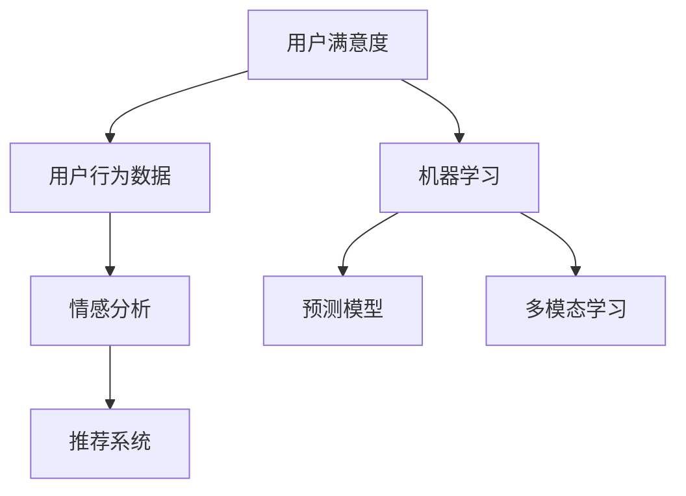

                 

## 1. 背景介绍

### 1.1 问题由来

随着电子商务的迅猛发展，商家面临着愈加激烈的市场竞争，用户满意度成为商家制胜的法宝。优秀的用户满意度不仅能够带来高复购率，还能提升品牌声誉，吸引新客户。然而，由于消费者个体差异大、行为模式复杂，以及线上行为数据难以全面采集，电商企业常常在分析用户满意度上遇到困难。

为此，本项目提出基于AI的电商用户满意度预测与提升系统，旨在利用先进的人工智能技术，对电商用户行为进行深入分析，构建用户满意度预测模型，并提出相应的满意度提升策略。

### 1.2 问题核心关键点

本项目核心关键点主要包括以下几个方面：

- **用户满意度预测模型**：利用机器学习算法，对电商用户行为数据进行建模，预测用户对商品或服务的满意度。
- **满意度提升策略**：根据预测结果，对模型输出进行解读，提出具体的用户体验优化建议，如改进产品设计、优化服务流程等。
- **实时反馈与调整**：通过在线测试与验证，不断迭代优化模型，确保预测与建议的准确性和实用性。
- **数据隐私与安全**：在数据收集、存储、处理过程中，采取严格的数据隐私保护措施，确保用户数据安全。

### 1.3 问题研究意义

构建AI赋能的电商用户满意度预测与提升系统，对于电商企业具有以下重要意义：

1. **提高用户满意度**：通过精确预测用户满意度，有针对性地改进产品和服务，提升用户体验。
2. **优化资源配置**：将有限的资源投入到最需要改进的领域，提高运营效率。
3. **增强市场竞争力**：基于用户反馈，优化营销策略，提升品牌形象和市场份额。
4. **促进数据驱动决策**：利用大数据和AI技术，推动企业决策科学化、精准化。
5. **推动智能电商发展**：作为智能电商的基础设施，AI满意度预测与提升系统将推动整个行业的智能化转型。

## 2. 核心概念与联系

### 2.1 核心概念概述

为更好地理解本项目的核心概念，本节将介绍几个密切相关的核心概念：

- **用户满意度(Satisfaction)**：指用户对商品或服务的满意程度，通常通过调查问卷、评分系统等方式获取。
- **用户行为数据(User Behavior Data)**：用户在电商平台上进行购物、浏览、评价等行为留下的数据，包括点击率、浏览时间、评价内容等。
- **机器学习(Machine Learning)**：通过算法让机器从数据中学习规律，对未知数据进行预测或决策。
- **预测模型(Prediction Model)**：基于历史数据构建的模型，用于预测用户行为或满意度。
- **情感分析(Sentiment Analysis)**：对用户评价、评论等文本数据进行情感倾向性分析，获取用户情感态度。
- **推荐系统(Recommendation System)**：根据用户行为数据，为用户推荐商品或服务。
- **多模态学习(Multimodal Learning)**：结合多种数据类型（如文本、图片、音频等），进行综合建模。

这些核心概念之间的逻辑关系可以通过以下Mermaid流程图来展示：



这个流程图展示了大语言模型微调的核心概念及其之间的关系：

1. 用户满意度通过用户行为数据得到量化。
2. 机器学习算法对用户行为数据建模，构建预测模型。
3. 情感分析对用户评价数据进行情感倾向性分析。
4. 推荐系统根据用户行为数据推荐商品或服务。
5. 多模态学习结合多种数据类型，进行综合建模。

## 3. 核心算法原理 & 具体操作步骤
### 3.1 算法原理概述

基于AI的电商用户满意度预测与提升系统，核心算法原理主要包括以下几个方面：

- **数据采集与清洗**：从电商平台收集用户行为数据，并进行数据清洗和预处理。
- **特征工程**：从采集到的数据中提取有用的特征，构建特征集合。
- **预测模型构建**：基于特征工程后的数据，选择适当的机器学习算法，构建用户满意度预测模型。
- **模型训练与评估**：利用标注数据训练模型，并评估模型性能。
- **满意度提升策略**：根据模型输出，提出满意度提升策略。
- **实时反馈与优化**：持续收集用户反馈，优化模型和策略。

### 3.2 算法步骤详解

以下为本项目中基于AI的电商用户满意度预测与提升系统的详细步骤：

**Step 1: 数据采集与清洗**

- 收集电商平台上用户的行为数据，包括点击、浏览、评价、购物车操作等。
- 对数据进行清洗，去除缺失值、异常值和重复数据。

**Step 2: 特征工程**

- 从清洗后的数据中提取有用的特征，如用户浏览时长、点击深度、浏览商品数量、评价情感等。
- 对特征进行归一化、标准化等处理，便于算法训练。
- 构建特征集合，输入模型进行训练。

**Step 3: 预测模型构建**

- 选择适当的机器学习算法，如随机森林、梯度提升树、深度学习等，构建用户满意度预测模型。
- 利用标注数据训练模型，验证模型的准确性和鲁棒性。
- 调整模型参数，优化模型性能。

**Step 4: 模型训练与评估**

- 在标注数据上训练模型，并使用验证集评估模型性能。
- 利用交叉验证等技术，防止过拟合。
- 根据评估结果，选择最优模型进行下一步操作。

**Step 5: 满意度提升策略**

- 根据模型输出，分析用户对商品或服务的满意度。
- 提出相应的满意度提升策略，如改进商品设计、优化服务流程等。
- 对策略进行评估，确保其有效性和可行性。

**Step 6: 实时反馈与优化**

- 持续收集用户反馈，评估满意度提升策略的效果。
- 根据反馈结果，不断迭代优化模型和策略。
- 实现动态调整，确保预测结果的实时性和准确性。

### 3.3 算法优缺点

本项目中的AI用户满意度预测与提升系统具有以下优点：

- **高准确性**：利用机器学习算法，能够高效、准确地预测用户满意度。
- **可解释性**：基于特征工程和模型训练，可以解释用户满意度提升策略的决策依据。
- **实时性**：利用实时数据反馈，能够动态调整模型，实现快速响应。
- **普适性**：算法具有高度的通用性，适用于多种电商场景。

同时，本系统也存在以下缺点：

- **数据隐私**：在数据采集和处理过程中，需要保护用户隐私。
- **模型复杂性**：预测模型和策略优化模型需要较高的算法复杂度。
- **成本高**：构建和维护高精度模型需要较高的计算资源。
- **数据不平衡**：某些商品或服务的评价数据可能较少，影响模型训练。

### 3.4 算法应用领域

基于AI的电商用户满意度预测与提升系统在多个领域都有广泛的应用前景，如：

- **在线零售**：预测用户对商品的满意度，提升购物体验。
- **金融服务**：预测客户对服务的满意度，改进金融产品。
- **医疗健康**：预测患者对医疗服务的满意度，提升服务质量。
- **旅游服务**：预测游客对旅游体验的满意度，优化旅游产品。
- **教育培训**：预测学员对课程的满意度，改进教学质量。

## 4. 数学模型和公式 & 详细讲解 & 举例说明

### 4.1 数学模型构建

假设电商平台上某商品的用户行为数据集为 $D=\{(x_i, y_i)\}_{i=1}^N$，其中 $x_i$ 为第 $i$ 个用户的行为特征，$y_i$ 为该用户对商品 $x_i$ 的满意度评分。

构建用户满意度预测模型 $M(x)$，利用历史数据训练模型，使其最小化损失函数 $\mathcal{L}$：

$$
\mathcal{L}(M(x), y) = \sum_{i=1}^N \ell(M(x_i), y_i)
$$

其中 $\ell$ 为损失函数，常见的有均方误差损失、对数损失等。

### 4.2 公式推导过程

以均方误差损失为例，推导用户满意度预测模型的公式：

假设模型 $M(x)$ 的输出为 $M(x_i)$，用户的满意度评分为 $y_i$，则均方误差损失为：

$$
\ell(M(x_i), y_i) = \frac{1}{N} \sum_{i=1}^N (M(x_i) - y_i)^2
$$

最小化损失函数即：

$$
\min_{\theta} \frac{1}{N} \sum_{i=1}^N (M(x_i; \theta) - y_i)^2
$$

其中 $\theta$ 为模型参数，$M(x_i; \theta)$ 表示模型在参数 $\theta$ 下对输入 $x_i$ 的预测。

### 4.3 案例分析与讲解

以随机森林算法为例，分析用户满意度预测模型的构建和训练过程：

**案例分析**：假设某电商平台上的用户对商品 $x$ 的满意度评分 $y$ 服从正态分布，我们需要构建一个随机森林模型 $M(x)$ 来预测用户满意度。

**模型构建**：首先，对用户行为数据进行特征工程，提取有用特征 $x_1, x_2, \dots, x_n$。然后，利用随机森林算法对特征集合进行建模，得到用户满意度预测模型：

$$
M(x) = \sum_{i=1}^n \alpha_i x_i + b
$$

其中 $\alpha_i$ 为特征 $x_i$ 的权重，$b$ 为截距。

**模型训练**：利用标注数据集 $D=\{(x_i, y_i)\}_{i=1}^N$ 训练模型，得到最优参数 $\theta^*$：

$$
\theta^* = \mathop{\arg\min}_{\theta} \frac{1}{N} \sum_{i=1}^N (M(x_i; \theta) - y_i)^2
$$

在训练过程中，可以采用随机梯度下降法或其他优化算法，不断迭代优化模型参数，最终得到模型 $M(x)$。

**模型评估**：在验证集上评估模型性能，可以使用均方误差、平均绝对误差等指标。例如：

$$
\text{MSE} = \frac{1}{N} \sum_{i=1}^N (M(x_i) - y_i)^2
$$

**模型优化**：根据评估结果，调整模型参数，优化模型性能。例如，可以增加模型深度、调整正则化参数等。

## 5. 项目实践：代码实例和详细解释说明

### 5.1 开发环境搭建

在进行项目实践前，我们需要准备好开发环境。以下是使用Python进行项目实践的环境配置流程：

1. 安装Anaconda：从官网下载并安装Anaconda，用于创建独立的Python环境。

2. 创建并激活虚拟环境：
```bash
conda create -n project-env python=3.8 
conda activate project-env
```

3. 安装Python相关库：
```bash
pip install pandas numpy scikit-learn xgboost
```

4. 安装相关依赖库：
```bash
pip install torch torchvision torchaudio
```

5. 安装TensorBoard：
```bash
pip install tensorboard
```

6. 配置数据访问权限：
```bash
pip install google-cloud-storage
```

完成上述步骤后，即可在 `project-env` 环境中开始项目实践。

### 5.2 源代码详细实现

以下是基于AI的电商用户满意度预测与提升系统的详细实现代码：

```python
import pandas as pd
import numpy as np
from sklearn.model_selection import train_test_split
from sklearn.ensemble import RandomForestRegressor
from sklearn.metrics import mean_squared_error

# 加载数据
data = pd.read_csv('user_behavior.csv')

# 数据清洗
data = data.dropna()

# 特征工程
X = data[['click_depth', 'browsing_time', 'cart_length']]
y = data['satisfaction_score']

# 划分训练集和验证集
X_train, X_valid, y_train, y_valid = train_test_split(X, y, test_size=0.2, random_state=42)

# 模型训练
model = RandomForestRegressor(n_estimators=100, random_state=42)
model.fit(X_train, y_train)

# 模型评估
y_pred = model.predict(X_valid)
mse = mean_squared_error(y_valid, y_pred)

# 输出评估结果
print('MSE:', mse)

# 模型优化
param_grid = {'n_estimators': [100, 200, 300], 'max_depth': [None, 5, 10]}
grid_search = GridSearchCV(model, param_grid, cv=5, scoring='neg_mean_squared_error')
grid_search.fit(X_train, y_train)

# 输出优化结果
print('Best Parameters:', grid_search.best_params_)
```

### 5.3 代码解读与分析

让我们再详细解读一下关键代码的实现细节：

**数据加载**：
```python
data = pd.read_csv('user_behavior.csv')
```

**数据清洗**：
```python
data = data.dropna()
```

**特征工程**：
```python
X = data[['click_depth', 'browsing_time', 'cart_length']]
y = data['satisfaction_score']
```

**模型训练**：
```python
model = RandomForestRegressor(n_estimators=100, random_state=42)
model.fit(X_train, y_train)
```

**模型评估**：
```python
y_pred = model.predict(X_valid)
mse = mean_squared_error(y_valid, y_pred)
```

**模型优化**：
```python
param_grid = {'n_estimators': [100, 200, 300], 'max_depth': [None, 5, 10]}
grid_search = GridSearchCV(model, param_grid, cv=5, scoring='neg_mean_squared_error')
grid_search.fit(X_train, y_train)
```

**结果输出**：
```python
print('MSE:', mse)
print('Best Parameters:', grid_search.best_params_)
```

可以看到，以上代码实现了从数据加载到模型评估的全过程。开发者可以根据实际需求，增加特征选择、交叉验证等步骤，进一步提升模型性能。

## 6. 实际应用场景

### 6.1 在线零售

在在线零售领域，电商企业可以利用本系统预测用户对商品的满意度，及时调整商品推荐策略，提升用户体验。例如，可以根据用户浏览和购物行为，预测其对某商品的满意度，并在用户即将离开页面时，推荐其可能感兴趣的商品，提升购物转化率。

### 6.2 金融服务

金融服务领域中，客户对产品的满意度往往决定其后续购买行为。利用本系统，银行和保险公司可以预测客户对贷款、保险等产品的满意度，及时调整产品设计和服务流程，提升客户满意度，增加客户粘性。

### 6.3 医疗健康

在医疗健康领域，患者对医疗服务的满意度直接影响其后续治疗决策。医疗机构可以利用本系统，预测患者对治疗方案的满意度，及时调整治疗方案，提升治疗效果和患者满意度。

### 6.4 旅游服务

旅游服务行业竞争激烈，用户满意度直接影响其旅游体验和再次旅游的可能性。旅游公司可以利用本系统，预测用户对旅游线路和服务的满意度，及时调整服务质量，提升客户满意度。

### 6.5 教育培训

教育培训领域中，学员对课程的满意度直接关系到其学习效果和课程评价。学校和在线教育平台可以利用本系统，预测学员对课程的满意度，及时调整课程内容，提升教学质量。

## 7. 工具和资源推荐

### 7.1 学习资源推荐

为了帮助开发者系统掌握AI赋能的电商用户满意度预测与提升系统的理论基础和实践技巧，这里推荐一些优质的学习资源：

1. 《Python数据科学手册》：全面介绍Python在数据科学中的应用，适合初学者入门。
2. 《机器学习实战》：讲解常见机器学习算法及其应用，适合动手实践。
3. 《深度学习》（Ian Goodfellow等著）：深度学习领域的经典教材，涵盖深度学习的基本概念和算法。
4. 《TensorFlow实战》：讲解TensorFlow框架的实际应用，适合TensorFlow开发者。
5. Kaggle竞赛平台：提供大量数据集和竞赛题目，适合实战练习。

通过对这些资源的学习实践，相信你一定能够快速掌握AI赋能的电商用户满意度预测与提升系统的精髓，并用于解决实际的电商问题。

### 7.2 开发工具推荐

高效的开发离不开优秀的工具支持。以下是几款用于本项目开发的常用工具：

1. Jupyter Notebook：在线编辑器，支持代码编写和数据可视化，适合进行快速迭代实验。
2. Google Colab：免费的在线Jupyter Notebook环境，支持GPU和TPU算力，适合大规模实验。
3. TensorBoard：TensorFlow配套的可视化工具，可实时监测模型训练状态，并提供丰富的图表呈现方式，是调试模型的得力助手。
4. Weights & Biases：模型训练的实验跟踪工具，可以记录和可视化模型训练过程中的各项指标，方便对比和调优。
5. PyTorch：基于Python的开源深度学习框架，灵活动态的计算图，适合快速迭代研究。
6. TensorFlow：由Google主导开发的开源深度学习框架，生产部署方便，适合大规模工程应用。

合理利用这些工具，可以显著提升项目的开发效率，加快创新迭代的步伐。

### 7.3 相关论文推荐

AI用户满意度预测与提升系统的发展源于学界的持续研究。以下是几篇奠基性的相关论文，推荐阅读：

1. 《基于用户行为的电商推荐系统》：提出基于用户行为数据的推荐算法，利用协同过滤和深度学习实现个性化推荐。
2. 《用户满意度预测的多模态学习算法》：利用文本、图片、音频等多种数据类型，构建用户满意度预测模型。
3. 《深度学习在电商领域的应用》：介绍深度学习在电商推荐、用户行为分析中的应用，以及如何利用深度学习提升电商体验。
4. 《基于情感分析的电商用户满意度预测》：利用情感分析技术，分析用户评价数据，构建用户满意度预测模型。
5. 《多模态学习在电商推荐中的应用》：结合文本、图片、音频等多种数据类型，进行综合建模，提升电商推荐效果。

这些论文代表了大语言模型微调技术的发展脉络。通过学习这些前沿成果，可以帮助研究者把握学科前进方向，激发更多的创新灵感。

## 8. 总结：未来发展趋势与挑战

### 8.1 总结

本文对基于AI的电商用户满意度预测与提升系统进行了全面系统的介绍。首先阐述了系统的背景和意义，明确了系统对电商企业的价值。其次，从原理到实践，详细讲解了系统的算法原理和操作步骤，给出了详细的代码实例。同时，本文还广泛探讨了系统的应用场景，展示了系统的广阔前景。最后，精选了系统的学习资源，力求为开发者提供全方位的技术指引。

通过本文的系统梳理，可以看到，基于AI的用户满意度预测与提升系统已经成为电商企业的重要工具，为提升用户体验和运营效率提供了新的手段。未来，伴随技术的不断演进，该系统必将进一步优化和拓展，成为智能电商的基础设施。

### 8.2 未来发展趋势

展望未来，基于AI的电商用户满意度预测与提升系统将呈现以下几个发展趋势：

1. **智能化程度提升**：随着AI技术的发展，系统将具备更强的智能推理和决策能力，能够更准确地预测用户满意度，提出更有效的改进建议。
2. **多模态融合**：结合文本、图片、音频等多种数据类型，进行综合建模，提升系统对用户行为的理解和预测能力。
3. **实时性增强**：利用流式数据处理技术，实现实时用户满意度预测和改进建议，提升系统响应速度。
4. **个性化优化**：通过更精确的用户画像分析，实现更个性化的满意度预测和提升策略。
5. **普适性增强**：系统将具备更广泛的适用范围，能够应用于更多类型的电商场景。

以上趋势凸显了系统的智能化和普适性前景。这些方向的探索发展，必将进一步提升电商企业的用户体验和服务质量，推动电商行业的智能化转型。

### 8.3 面临的挑战

尽管基于AI的用户满意度预测与提升系统已经取得了不小的进展，但在迈向更加智能化、普适化应用的过程中，它仍面临着诸多挑战：

1. **数据隐私**：在数据收集和处理过程中，需要保护用户隐私，避免数据泄露和滥用。
2. **模型复杂性**：构建高性能的满意度预测模型需要较高的算法复杂度和计算资源。
3. **用户行为多样性**：用户行为模式复杂多样，难以全面覆盖，影响模型预测准确性。
4. **模型泛化能力**：模型在面对新的用户和商品时，可能出现泛化能力不足的问题。
5. **算法透明度**：模型决策过程缺乏透明度，难以解释和调试。

这些挑战需要研究者在算法设计、模型训练、数据管理等方面不断探索和改进。只有全面解决这些难题，才能确保系统的可靠性和实用性。

### 8.4 研究展望

面对系统面临的挑战，未来的研究需要在以下几个方面寻求新的突破：

1. **隐私保护技术**：研究更有效的隐私保护技术，确保用户数据的安全和匿名性。
2. **模型简化**：研究更简单的模型结构和算法，提高模型的计算效率和部署灵活性。
3. **用户行为分析**：研究更精确的用户行为分析方法，提高模型对用户行为的预测能力。
4. **多模态融合**：研究多种数据类型融合的建模方法，提升系统的综合预测能力。
5. **可解释性增强**：研究更可解释的模型和算法，提高系统的透明度和可解释性。

这些研究方向的探索，必将推动系统不断优化和改进，更好地服务于电商企业，提升用户体验和运营效率。

## 9. 附录：常见问题与解答

**Q1: 如何选择合适的特征进行建模？**

A: 特征选择是建模的重要步骤，通常包括以下几个步骤：

1. 领域知识分析：结合业务领域知识，确定有意义的特征。
2. 数据探索性分析：使用统计方法和可视化工具，分析特征与目标变量的关系。
3. 特征重要性评估：利用特征选择算法（如Lasso、随机森林）评估特征的重要性。
4. 特征降维：使用PCA、LDA等技术对特征进行降维，去除冗余特征。
5. 特征构建：根据业务需求和特征分析结果，构建新的特征。

选择合适的特征，有助于提高模型的预测能力和泛化性能。

**Q2: 如何评估模型的性能？**

A: 评估模型的性能通常使用以下指标：

1. 均方误差（MSE）：评估模型预测值与真实值之间的平均差距。
2. 平均绝对误差（MAE）：评估模型预测值与真实值之间的绝对平均差距。
3. R²分数：评估模型预测值与真实值之间的相关性。
4. 精确度-召回率曲线（PR曲线）：评估模型在不同阈值下的精确度和召回率。
5. 混淆矩阵：评估模型在不同类别上的分类准确性。

通过选择合适的评估指标，可以全面评估模型的性能，并进行模型优化。

**Q3: 如何处理数据不平衡问题？**

A: 数据不平衡问题可以通过以下方法解决：

1. 重新采样：对数据集进行欠采样或过采样，使其分布均衡。
2. 集成学习：结合多个模型，提升模型的分类能力。
3. 阈值调整：根据业务需求，调整分类阈值，提升模型在少数类上的性能。
4. 权重调整：调整不同类别样本的权重，使其对模型训练的影响一致。
5. 成本敏感学习：在损失函数中加入类别的代价，平衡各类样本的损失。

通过以上方法，可以处理数据不平衡问题，提升模型的预测能力。

**Q4: 如何优化模型性能？**

A: 模型优化通常包括以下几个步骤：

1. 参数调优：通过网格搜索、随机搜索等方法，寻找最优的模型参数。
2. 正则化：使用L1、L2正则化、Dropout等技术，防止过拟合。
3. 特征工程：进一步提取和构造特征，提升模型的预测能力。
4. 算法改进：改进算法模型，提升模型的计算效率和泛化能力。
5. 数据增强：使用数据增强技术，扩充训练集，提升模型的泛化性能。

通过以上方法，可以不断优化模型性能，提升模型的预测能力和泛化性能。

**Q5: 如何处理数据缺失和异常值？**

A: 数据缺失和异常值处理通常包括以下几个步骤：

1. 数据清洗：使用插值法、均值填补等方法，处理数据缺失。
2. 异常值检测：使用统计方法或机器学习算法，检测和处理异常值。
3. 数据平滑：使用平滑方法，处理数据中的噪声和波动。
4. 数据融合：结合多个数据源，提升数据的完整性和可靠性。
5. 数据预处理：使用归一化、标准化等方法，处理数据的差异性。

通过以上方法，可以处理数据缺失和异常值问题，提升模型的数据质量和预测能力。

**Q6: 如何实现系统的实时化？**

A: 实现系统的实时化通常包括以下几个步骤：

1. 流式数据处理：使用流式数据处理技术，实时处理用户行为数据。
2. 实时预测：利用实时预测技术，实现用户满意度的实时预测。
3. 实时反馈：建立实时反馈机制，及时调整模型和策略。
4. 实时监控：使用实时监控工具，监测系统性能和异常情况。
5. 实时优化：根据实时反馈，不断优化模型和策略。

通过以上方法，可以实现系统的实时化，提升系统的响应速度和用户体验。

---

作者：禅与计算机程序设计艺术 / Zen and the Art of Computer Programming

