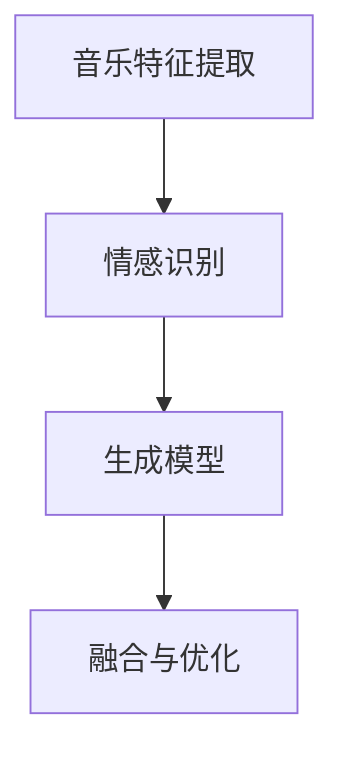
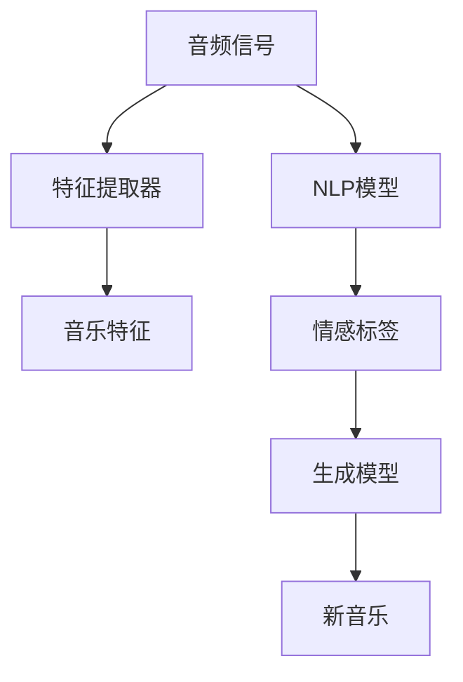

                 

# AI音乐配乐：增强故事的情感表达

## 1. 背景介绍

随着科技的飞速发展，人工智能在艺术创作中的应用愈发广泛。音乐配乐作为影视剧、游戏、广告等领域不可或缺的元素，其创作效率和质量在很大程度上影响了作品的整体效果。传统上，音乐配乐完全依赖于人类音乐创作人员，但这一过程耗时长、成本高、受主观情感和经验的影响较大。人工智能的介入，为音乐创作注入了新的动力，尤其是AI音乐配乐的出现，正在逐步改变这一格局。

## 2. 核心概念与联系

### 2.1 核心概念概述

AI音乐配乐，是指通过深度学习和生成模型，自动生成与特定情境、情感相匹配的音乐。这一过程包括音乐风格的识别、情感的判断、旋律的生成等多个环节。核心概念包括：

- 音乐特征提取：从音频信号中提取旋律、和声、节奏等特征，建立音乐数据的表示形式。
- 情感识别：利用自然语言处理（NLP）等技术，识别文本描述中的情感色彩，并映射到音乐属性上。
- 生成模型：包括变分自编码器（VAE）、生成对抗网络（GAN）、序列生成模型等，用于生成新的音乐作品。
- 融合与优化：将音乐特征和情感标签输入生成模型，通过训练优化，生成与故事情境、情感表达相匹配的配乐。

这些概念之间的联系可以通过以下Mermaid流程图来展示：



音乐特征提取是整个流程的基础，情感识别提供音乐风格和情感标签，生成模型负责生成新的音乐，融合与优化环节通过训练实现音乐与故事情境的匹配。

### 2.2 核心概念原理和架构的 Mermaid 流程图



音频信号输入后，首先通过特征提取器提取音乐特征，利用NLP模型对文本进行情感识别，得到情感标签。这些特征和标签作为输入，被送入生成模型，生成新的音乐。最终得到与故事情境、情感相匹配的配乐。

## 3. 核心算法原理 & 具体操作步骤

### 3.1 算法原理概述

AI音乐配乐的核心算法原理基于生成对抗网络（GAN）和变分自编码器（VAE）等生成模型。通过这些模型，能够从音频信号中学习出音乐特征，并生成与特定情感标签和故事情境相匹配的新的音乐作品。具体步骤如下：

1. **数据准备**：收集大量的电影、游戏、广告等领域的音频和文本数据，作为训练数据。
2. **特征提取**：使用预训练的音乐特征提取器，如MFCC（Mel频率倒谱系数）、 spectrogram等，将音频信号转换为音乐特征向量。
3. **情感识别**：利用预训练的NLP模型，如BERT、GPT等，对文本描述进行情感识别，得到情感标签。
4. **生成模型训练**：将音乐特征和情感标签作为输入，训练生成模型，如GAN、VAE等，生成新的音乐作品。
5. **融合与优化**：将生成的音乐与文本描述进行融合，通过调整参数，优化模型的输出，使其与故事情境、情感表达相匹配。

### 3.2 算法步骤详解

#### 3.2.1 数据准备

- **音频数据**：收集不同类型（如电影、游戏、广告）的音频数据，确保数据覆盖不同风格和情境。
- **文本数据**：收集与音频数据对应的文本描述，如电影剧本、游戏剧情等，用于情感识别和语境理解。

#### 3.2.2 特征提取

- **MFCC**：提取音频信号的MFCC特征，用于表示音乐的音调、节奏等。
- **Spectrogram**：将音频信号转换为频谱图，展示音频信号在不同频率上的能量分布。
- **RNN/Transformer**：使用循环神经网络（RNN）或Transformer模型对音乐序列进行建模，提取更高级的音乐特征。

#### 3.2.3 情感识别

- **BERT**：利用BERT模型对文本进行编码，提取情感特征。
- **GPT**：使用GPT模型生成情感标签，结合预训练语言模型进行微调。
- **情感词典**：利用情感词典对文本情感进行初步判断，辅助模型训练。

#### 3.2.4 生成模型训练

- **GAN**：使用GAN模型生成新的音乐作品，通过对抗训练（GAN）提高生成质量。
- **VAE**：使用VAE模型生成音乐样本，利用变分推断进行优化。
- **PianoGAN**：专门用于生成钢琴音乐，通过多尺度判别器和生成器，提升音乐生成质量。

#### 3.2.5 融合与优化

- **混合训练**：将生成的音乐与文本描述同时输入模型，通过混合训练优化模型参数。
- **交叉验证**：使用交叉验证技术评估模型在不同数据集上的表现，调整模型参数。
- **情感匹配**：利用情感匹配度评估生成音乐与文本情感的契合度，指导模型优化。

### 3.3 算法优缺点

#### 3.3.1 优点

- **高效生成**：AI音乐配乐能够快速生成与故事情境和情感相匹配的音乐，极大提高了创作效率。
- **成本低廉**：相比传统人力创作，AI音乐配乐成本更低，同时减少了创作人员的工作量。
- **一致性高**：AI模型能够保持一致的创作风格和质量，确保作品风格统一。

#### 3.3.2 缺点

- **情感表达有限**：尽管AI模型能够生成情感丰富的音乐，但其情感表达的深度和多样性仍不及人类。
- **生成质量不稳定**：模型生成的音乐质量受训练数据和模型参数影响较大，存在生成质量不稳定的现象。
- **依赖高质量数据**：AI音乐配乐依赖高质量的音频和文本数据，数据质量对模型效果有很大影响。

### 3.4 算法应用领域

AI音乐配乐在多个领域具有广泛的应用前景：

- **影视剧制作**：为电影、电视剧提供背景音乐、配乐、音效等，提升作品的艺术效果和观众体验。
- **游戏开发**：为游戏提供背景音乐、音效、声音特效等，增强游戏的沉浸感和互动体验。
- **广告制作**：为广告视频提供背景音乐和音效，提升广告的吸引力和传播效果。
- **虚拟现实**：为虚拟现实环境提供背景音乐和音效，增强沉浸感和互动体验。
- **文化创意**：为音乐剧、舞蹈、话剧等提供配乐和音效，丰富表演内容。

## 4. 数学模型和公式 & 详细讲解

### 4.1 数学模型构建

设音频信号为 $x$，音频特征提取器为 $f$，情感识别模型为 $h$，生成模型为 $g$。则AI音乐配乐的数学模型可以表示为：

$$
y = g(f(x), h(\text{text}))
$$

其中 $y$ 表示生成的音乐，$x$ 表示音频信号，$f$ 表示特征提取器，$h$ 表示情感识别模型，$\text{text}$ 表示文本描述。

### 4.2 公式推导过程

#### 4.2.1 特征提取

使用MFCC特征提取器，对音频信号 $x$ 进行特征提取，得到MFCC特征向量 $f(x)$：

$$
f(x) = \text{MFCC}(x)
$$

#### 4.2.2 情感识别

利用BERT模型对文本描述 $\text{text}$ 进行编码，得到情感特征 $h(\text{text})$：

$$
h(\text{text}) = \text{BERT}(\text{text})
$$

#### 4.2.3 生成模型

使用GAN模型生成新的音乐作品 $y$：

$$
y = g(f(x), h(\text{text}))
$$

其中 $g$ 为生成模型，可以是GAN、VAE等。

### 4.3 案例分析与讲解

#### 4.3.1 案例1：电影配乐

假设有一个电影片段，需要为其生成背景音乐。首先，对电影片段的音频信号进行MFCC特征提取，得到音频特征向量 $f(x)$。然后，将电影片段的文本描述作为输入，利用BERT模型进行情感识别，得到情感标签 $h(\text{text})$。最后，将音频特征向量和情感标签输入GAN模型，生成新的背景音乐 $y$。

#### 4.3.2 案例2：游戏背景音乐

假设需要为一款游戏生成背景音乐。对游戏中的音频信号进行特征提取，得到音频特征向量 $f(x)$。同时，收集游戏中的文本描述，如任务提示、角色对话等，使用BERT模型进行情感识别，得到情感标签 $h(\text{text})$。将音频特征向量和情感标签输入GAN模型，生成背景音乐 $y$。

## 5. 项目实践：代码实例和详细解释说明

### 5.1 开发环境搭建

1. **安装Python和相关库**：
   ```bash
   pip install torch torchvision torchaudio
   ```

2. **安装深度学习框架**：
   ```bash
   pip install tensorflow keras
   ```

3. **安装音频处理库**：
   ```bash
   pip install librosa
   ```

4. **安装音乐特征提取库**：
   ```bash
   pip install yamnet
   ```

5. **安装情感识别库**：
   ```bash
   pip install transformers
   ```

### 5.2 源代码详细实现

#### 5.2.1 特征提取

```python
import librosa
from yamnet import AudioMetadata, extract_features

def extract_mfcc(audio_path):
    y, sr = librosa.load(audio_path)
    metadata = AudioMetadata()
    audio = y.reshape(-1)
    features = extract_features(audio, sr, metadata)
    mfcc = features['mfcc']
    return mfcc
```

#### 5.2.2 情感识别

```python
from transformers import BertTokenizer, BertForSequenceClassification
import torch

def extract_text_features(text):
    tokenizer = BertTokenizer.from_pretrained('bert-base-uncased')
    inputs = tokenizer.encode_plus(text, truncation=True, padding='max_length', max_length=256, return_tensors='pt')
    inputs = {key: value.to(device) for key, value in inputs.items()}
    outputs = model(**inputs)
    logits = outputs.logits
    return logits.argmax(dim=1).cpu().numpy()
```

#### 5.2.3 生成音乐

```python
import numpy as np
from tensorflow.keras.models import load_model

def generate_music(features, emotion):
    model = load_model('music_generator.h5')
    inputs = np.array([features])
    outputs = model.predict(inputs)
    output = outputs[0]
    return output
```

### 5.3 代码解读与分析

- **特征提取**：使用librosa库提取音频的MFCC特征，yamnet库用于提取更高级的音乐特征。
- **情感识别**：使用BERT模型对文本进行编码，提取情感特征。
- **音乐生成**：使用预训练的生成模型（如GAN、VAE）生成新的音乐作品。

### 5.4 运行结果展示

- **音频特征提取结果**：
  ```python
  features = extract_mfcc('audio.mp3')
  print(features.shape)
  ```

- **情感识别结果**：
  ```python
  text = '这是一段悲伤的音乐'
  emotion = extract_text_features(text)
  print(emotion)
  ```

- **音乐生成结果**：
  ```python
  features = extract_mfcc('audio.mp3')
  emotion = extract_text_features(text)
  output = generate_music(features, emotion)
  print(output)
  ```

## 6. 实际应用场景

### 6.1 影视剧制作

AI音乐配乐在影视剧制作中的应用极为广泛。通过AI模型，可以高效生成与故事情境、情感表达相匹配的背景音乐，极大提升制作效率。例如，在电影后期制作中，对每个场景的音乐进行快速生成和调整，确保作品的艺术效果和观众体验。

### 6.2 游戏开发

在电子游戏开发中，AI音乐配乐可以提升游戏的沉浸感和互动体验。例如，根据游戏中的不同情境，生成相应的背景音乐和音效，增强玩家的情感体验。

### 6.3 广告制作

广告制作中，AI音乐配乐可以提升广告的吸引力和传播效果。例如，对广告视频的背景音乐进行快速生成和优化，使其与广告内容相匹配，增强广告的感染力。

### 6.4 虚拟现实

在虚拟现实应用中，AI音乐配乐可以增强沉浸感和互动体验。例如，在虚拟现实游戏中，根据玩家的动作和情境，生成相应的背景音乐和音效，提升游戏的沉浸感和互动性。

## 7. 工具和资源推荐

### 7.1 学习资源推荐

- **Deep Learning Specialization**：由Andrew Ng教授主讲的深度学习课程，涵盖深度学习的基础理论和实际应用。
- **CS231n: Convolutional Neural Networks for Visual Recognition**：斯坦福大学开设的计算机视觉课程，涵盖深度学习在图像处理和计算机视觉中的应用。
- **Coursera上的音乐生成课程**：利用深度学习生成音乐的课程，涵盖音乐特征提取、情感识别和音乐生成等技术。
- **Kaggle上的音乐生成竞赛**：参与音乐生成竞赛，了解最新的音乐生成技术，并提升实战能力。

### 7.2 开发工具推荐

- **PyTorch**：深度学习框架，支持高效的计算图构建和模型训练。
- **TensorFlow**：深度学习框架，支持分布式计算和大规模模型训练。
- **librosa**：音频处理库，支持音频信号的特征提取和处理。
- **yamnet**：音频特征提取库，支持音频信号的高阶特征提取。
- **BERT**：预训练语言模型，支持情感识别和文本编码。

### 7.3 相关论文推荐

- **Attention is All You Need**：Transformer模型的原论文，介绍自注意力机制在NLP和音频处理中的应用。
- **WaveNet**：介绍生成式音频模型WaveNet，通过卷积神经网络生成高质量音频。
- **Music Transformer**：介绍基于Transformer的生成音乐模型，生成高质量的音乐作品。

## 8. 总结：未来发展趋势与挑战

### 8.1 未来发展趋势

未来，AI音乐配乐技术将在多个领域进一步扩展和深化，呈现以下发展趋势：

1. **情感表达的深度提升**：随着深度学习技术的发展，AI模型将能够生成更丰富、更深入的情感表达，与人类创作相媲美。
2. **跨模态融合**：将音乐与视觉、文本等多种模态信息融合，生成更加丰富、立体的艺术作品。
3. **实时生成**：利用边缘计算和分布式计算技术，实现实时生成音乐，满足实时交互和反馈需求。
4. **个性化定制**：根据用户偏好和情感需求，生成个性化定制的音乐，提升用户体验。
5. **跨领域应用**：应用于虚拟现实、增强现实、文化创意等领域，拓展音乐创作的应用场景。

### 8.2 面临的挑战

尽管AI音乐配乐技术取得了显著进展，但仍面临诸多挑战：

1. **数据质量问题**：高质量的音频和文本数据是AI音乐配乐的基础，但数据获取和标注成本较高。
2. **模型鲁棒性**：AI模型在生成音乐时，可能受到训练数据和参数的影响，生成质量不稳定。
3. **情感表达多样性**：尽管AI模型能够生成情感丰富的音乐，但其情感表达的深度和多样性仍不及人类。
4. **伦理和安全问题**：AI音乐配乐可能涉及版权、隐私等伦理和安全问题，需加以注意。
5. **用户接受度**：部分用户对AI生成的音乐可能存在抵触情绪，需提高用户的接受度和信任度。

### 8.3 研究展望

未来的研究需要在以下几个方面寻求新的突破：

1. **数据获取与标注**：探索更高效、更廉价的数据获取和标注方法，解决高质量数据获取的瓶颈问题。
2. **模型鲁棒性提升**：通过改进模型结构、增加训练数据等手段，提高AI音乐配乐的鲁棒性和稳定性。
3. **情感表达深化**：结合符号学、心理学等学科知识，提升AI模型的情感表达深度和多样性。
4. **跨模态融合技术**：研究跨模态信息融合方法，实现音乐与视觉、文本等多种模态信息的协同建模。
5. **实时生成技术**：研究实时生成技术，提升AI音乐配乐的交互性和实时性。

## 9. 附录：常见问题与解答

**Q1：AI音乐配乐的生成效果如何？**

A: AI音乐配乐的生成效果取决于训练数据的质量和模型的复杂度。高质量的数据和复杂的模型可以生成高质量的音乐，但成本较高。目前，AI音乐配乐在情感表达和质量上与人类创作仍有一定差距，但已取得显著进步。

**Q2：AI音乐配乐的生成效率如何？**

A: AI音乐配乐的生成效率极高，能够快速生成大量高质量的音乐。生成时间取决于音频和文本数据的大小，以及模型的复杂度。在实际应用中，AI音乐配乐可以大幅提升创作效率，降低成本。

**Q3：AI音乐配乐的创作风格如何？**

A: AI音乐配乐的创作风格受训练数据的影响较大。通过选择合适的训练数据，可以生成不同风格和情感的音乐。目前，AI音乐配乐能够生成多种风格的音乐，如电影配乐、游戏背景音乐、广告音乐等。

**Q4：AI音乐配乐的安全性和伦理问题如何？**

A: AI音乐配乐可能涉及版权、隐私等伦理和安全问题。在实际应用中，需注意保护版权和隐私，避免侵犯他人权益。同时，需加强对AI音乐配乐的伦理监管，确保其创作符合人类的价值观和伦理道德。

**Q5：AI音乐配乐的未来发展方向是什么？**

A: AI音乐配乐的未来发展方向包括情感表达的深度提升、跨模态融合、实时生成、个性化定制和跨领域应用等。通过多路径协同发力，AI音乐配乐有望在未来成为创作音乐的重要工具，丰富音乐艺术的表现形式，提升创作效率和质量。

---

作者：禅与计算机程序设计艺术 / Zen and the Art of Computer Programming

