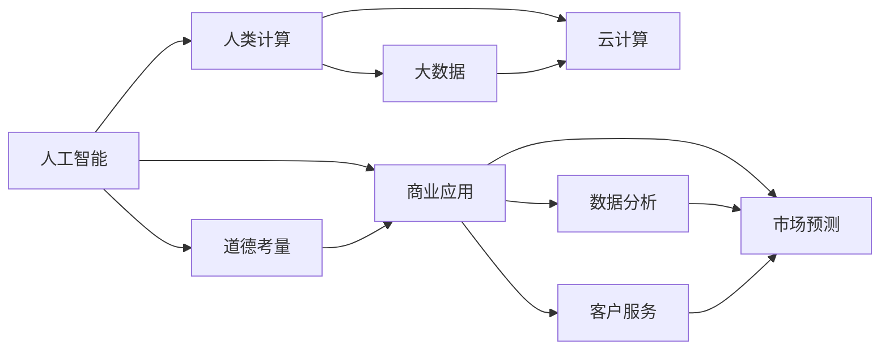

                 

# AI驱动的创新：人类计算在商业中的道德考虑因素与应用前景展望

> 关键词：AI驱动创新,人类计算,商业应用,道德考量,技术伦理,大数据,云计算,隐私保护,责任归属

## 1. 背景介绍

随着人工智能(AI)技术的迅猛发展，以AI为驱动的商业创新成为了现代企业数字化转型的重要方向。人类计算作为AI应用的基础，不仅在提高效率、降低成本等方面发挥了巨大作用，更在数据驱动的商业决策、个性化推荐、智能客服等领域带来了深刻变革。然而，伴随AI应用的广泛渗透，诸多伦理道德问题也逐渐凸显，引发了全社会的广泛关注。

本文章将从背景、核心概念、算法原理、项目实践、应用场景等多个维度，全面解析AI驱动的创新在商业中的道德考量，并展望未来AI技术的潜力和前景。

## 2. 核心概念与联系

### 2.1 核心概念概述

为更好地理解AI驱动的商业创新及其伦理考量，本节将介绍几个核心概念：

- **人工智能**：利用计算机模拟人类智能行为的技术体系，包括机器学习、深度学习、自然语言处理、计算机视觉等多个领域。

- **人类计算**：指通过AI技术对海量数据进行高效处理、分析、提取信息的过程，其本质是对人的计算能力的延伸和增强。

- **商业应用**：指企业将AI技术应用于生产、管理、营销、服务等各个环节，以实现业务流程优化、客户体验提升、市场竞争力增强等目标。

- **道德考量**：指在AI应用过程中，如何平衡技术进步与伦理道德的关系，确保技术的发展能够促进人类社会的福祉。

- **技术伦理**：研究AI技术的开发和应用中应遵循的伦理原则，如隐私保护、公平性、透明性等。

- **大数据**：指收集、存储、分析和应用海量数据的技术体系，是AI计算的基础。

- **云计算**：通过网络提供高性能计算资源的计算模式，支持海量数据存储和处理，是AI计算的重要基础设施。

这些核心概念之间密切联系，共同构成了AI驱动的商业创新的伦理框架。

### 2.2 核心概念原理和架构的 Mermaid 流程图



这个流程图展示了AI驱动的商业创新中各概念间的逻辑关系：

1. 人工智能提供基础技术支持。
2. 人类计算依托大数据和云计算资源，实现高效的数据处理和分析。
3. 商业应用结合AI技术和数据分析成果，优化业务流程、提升用户体验。
4. 道德考量贯穿整个技术应用过程，确保AI技术的负责任使用。

## 3. 核心算法原理 & 具体操作步骤

### 3.1 算法原理概述

基于AI驱动的商业创新，核心算法原理主要围绕数据驱动的机器学习模型构建和应用。其中，人类计算的核心在于通过算法对大数据进行分析，挖掘出有价值的信息和知识，以支持商业决策和应用场景。

算法原理通常包括以下几个步骤：

1. **数据准备**：收集和整理与业务需求相关的数据，包括结构化数据和非结构化数据。
2. **数据预处理**：对原始数据进行清洗、标准化、归一化等处理，以便于模型训练和应用。
3. **模型训练**：使用机器学习算法，如监督学习、无监督学习、强化学习等，在处理后的数据上训练出适合业务需求的模型。
4. **模型应用**：将训练好的模型部署到实际业务场景中，进行预测、分类、聚类、推荐等应用。
5. **结果评估**：对模型应用效果进行评估，如精度、召回率、F1值等，优化模型性能。

### 3.2 算法步骤详解

以推荐系统为例，展示AI驱动的商业创新的算法步骤：

**Step 1: 数据收集与预处理**
- 收集用户行为数据，如浏览、点击、评分、购买等行为。
- 整理用户个人信息，如年龄、性别、地域等特征。
- 将原始数据进行去重、填充、标准化等处理，以消除噪声和异常值。

**Step 2: 特征工程**
- 设计特征指标，如用户历史行为、浏览时长、点击次数等。
- 提取文本特征，如商品描述、用户评论等。
- 构建用户画像，描述用户兴趣和行为模式。

**Step 3: 模型训练**
- 选择适合的推荐算法，如协同过滤、矩阵分解、深度学习等。
- 使用用户行为数据和特征进行模型训练，优化模型参数。
- 使用交叉验证技术，防止模型过拟合。

**Step 4: 模型应用与优化**
- 将训练好的推荐模型部署到实际系统，实时推荐商品或服务。
- 根据用户反馈，不断调整推荐算法和模型参数，提升推荐效果。
- 引入个性化推荐机制，根据用户偏好提供定制化推荐。

**Step 5: 结果评估与监控**
- 对推荐系统性能进行评估，如点击率、转化率、用户满意度等。
- 实时监控系统运行状态，如响应时间、负载均衡等。
- 对异常行为进行预警和处理，保障系统稳定运行。

### 3.3 算法优缺点

AI驱动的商业创新算法具有以下优点：

1. **高效性**：利用AI技术可以快速处理海量数据，提升业务决策和应用响应速度。
2. **准确性**：通过机器学习算法可以挖掘出复杂的模式和关系，提升数据分析和应用精度。
3. **自动化**：算法自动化处理流程，减少人工干预，降低出错风险。
4. **灵活性**：可根据业务需求，灵活调整算法和模型，实现个性化服务。

同时，这些算法也存在一定的局限性：

1. **依赖高质量数据**：模型训练效果依赖于数据的质量和数量，数据偏见可能导致模型输出不公平。
2. **算法透明性不足**：许多AI算法如深度学习模型的决策过程难以解释，难以满足特定领域的需求。
3. **隐私风险**：处理大量敏感数据时，存在隐私泄露和数据滥用的风险。
4. **计算资源需求高**：高维度数据和复杂模型需要高性能计算资源，成本较高。
5. **模型泛化性有限**：模型在新领域和新数据上的泛化能力有限，难以应对复杂的现实问题。

### 3.4 算法应用领域

基于AI驱动的商业创新的算法，已广泛应用于多个领域，包括但不限于：

- **金融风控**：利用机器学习算法分析金融数据，识别风险点，进行信用评估和欺诈检测。
- **医疗健康**：通过大数据和AI技术进行疾病预测、药物研发、个性化治疗等。
- **零售电商**：利用推荐系统和个性化服务提升用户体验，实现精准营销和库存优化。
- **智能制造**：使用AI算法进行生产计划优化、质量控制、设备维护等。
- **智慧城市**：通过AI技术实现交通管理、环境监测、安全防范等。

这些应用场景展示了AI驱动的商业创新的广泛潜力，为各行各业带来了深远的变革。

## 4. 数学模型和公式 & 详细讲解

### 4.1 数学模型构建

在AI驱动的商业创新中，常用的数学模型包括线性回归、逻辑回归、支持向量机、决策树、随机森林、深度学习等。

以推荐系统为例，常见的模型包括协同过滤、矩阵分解、神经网络推荐等。

### 4.2 公式推导过程

以协同过滤算法为例，展示其公式推导过程：

设用户$u$和物品$i$的评分矩阵为$R$，则协同过滤算法的目标是最小化预测评分与实际评分的差距，即：

$$
\min_{\theta} \sum_{(u,i) \in R} || R_u - \hat{R}_u ||^2
$$

其中，$R_u$为用户$u$对物品$i$的实际评分，$\hat{R}_u$为用户$u$对物品$i$的预测评分，$\theta$为模型参数。

为了得到预测评分，协同过滤算法通常使用邻域用户和物品的评分信息，构建相似度矩阵$S$，并进行矩阵分解：

$$
\hat{R}_u = \sum_{j \in N(u)} S_{uj} \hat{R}_j
$$

其中，$N(u)$为用户$u$的邻域用户集合，$S_{uj}$为用户$u$和用户$j$之间的相似度。

### 4.3 案例分析与讲解

**案例：智能客服系统**

智能客服系统通过自然语言处理技术，利用机器学习算法对用户咨询进行分析和理解，从而提供个性化的服务。例如，使用基于文本分类和情感分析的算法，可以自动识别用户咨询主题和情感倾向，并根据历史数据和知识库提供相应的回答和建议。

## 5. 项目实践：代码实例和详细解释说明

### 5.1 开发环境搭建

在实践中，通常需要搭建以下开发环境：

- **Python环境**：安装Python及其相关库，如TensorFlow、PyTorch、Scikit-Learn等。
- **大数据平台**：如Hadoop、Spark等，用于数据存储和处理。
- **云计算平台**：如AWS、Google Cloud、阿里云等，用于高性能计算和存储。
- **数据工具**：如Pandas、NumPy、Scrapy等，用于数据收集、清洗和预处理。
- **模型训练工具**：如Keras、TensorFlow等，用于模型训练和优化。
- **API开发工具**：如Flask、Django等，用于系统集成和部署。

### 5.2 源代码详细实现

以推荐系统为例，展示PyTorch实现过程：

```python
import torch
import torch.nn as nn
import torch.optim as optim
from torch.utils.data import DataLoader
from torchvision import datasets, transforms

# 定义模型
class RecommendationModel(nn.Module):
    def __init__(self, num_users, num_items, embedding_dim):
        super(RecommendationModel, self).__init__()
        self.user_embedding = nn.Embedding(num_users, embedding_dim)
        self.item_embedding = nn.Embedding(num_items, embedding_dim)
        self.linear = nn.Linear(embedding_dim * 2, 1)
        
    def forward(self, user_ids, item_ids):
        user_embeddings = self.user_embedding(user_ids)
        item_embeddings = self.item_embedding(item_ids)
        features = torch.cat([user_embeddings, item_embeddings], dim=1)
        scores = self.linear(features)
        return scores

# 定义损失函数
criterion = nn.MSELoss()

# 定义优化器
optimizer = optim.Adam(model.parameters(), lr=0.01)

# 训练过程
def train(model, data_loader, criterion, optimizer, num_epochs):
    model.train()
    for epoch in range(num_epochs):
        running_loss = 0.0
        for inputs, labels in data_loader:
            optimizer.zero_grad()
            outputs = model(inputs[0], inputs[1])
            loss = criterion(outputs, labels)
            loss.backward()
            optimizer.step()
            running_loss += loss.item()
        print('Epoch [%d/%d], Loss: %.4f' % (epoch+1, num_epochs, running_loss/len(data_loader)))

# 使用数据加载器
transform = transforms.Compose([transforms.ToTensor()])
train_data = datasets.MNIST('./data/', train=True, download=True, transform=transform)
test_data = datasets.MNIST('./data/', train=False, transform=transform)
train_loader = DataLoader(train_data, batch_size=32, shuffle=True)
test_loader = DataLoader(test_data, batch_size=32, shuffle=False)

# 训练模型
model = RecommendationModel(num_users=1000, num_items=1000, embedding_dim=64)
train(model, train_loader, criterion, optimizer, num_epochs=10)
```

### 5.3 代码解读与分析

以上代码展示了推荐系统的基本框架，包含模型定义、损失函数、优化器、数据加载和训练过程。

- 模型定义：通过PyTorch定义了一个简单的推荐模型，包含用户嵌入、物品嵌入和线性层。
- 损失函数：使用均方误差损失函数来衡量模型预测和真实标签的差距。
- 优化器：使用Adam优化器进行模型参数的更新。
- 数据加载：使用PyTorch的数据加载器，将MNIST数据集加载到模型中进行训练。
- 训练过程：通过循环迭代训练，不断更新模型参数，最小化损失函数。

### 5.4 运行结果展示

训练完成后，可以验证模型效果。例如，使用测试数据集进行测试，输出模型的预测评分与真实评分的对比结果。

## 6. 实际应用场景

### 6.1 金融风控

金融风控是AI驱动的商业创新在金融领域的重要应用。通过大数据和机器学习算法，金融机构可以实时分析客户行为，识别潜在风险，进行信用评估和欺诈检测。例如，利用协同过滤算法，可以分析客户的历史交易数据，预测其未来行为，并根据风险评分进行借贷审批。

### 6.2 医疗健康

医疗健康领域通过AI技术，可以实现疾病预测、个性化治疗、医学影像分析等。例如，使用深度学习算法对医学影像进行自动标注和分析，辅助医生进行诊断和治疗决策。利用自然语言处理技术，可以分析医学文献和病历，提取有价值的信息，指导临床研究和医疗实践。

### 6.3 零售电商

零售电商领域利用AI技术进行商品推荐、库存管理、客户服务优化等。例如，使用协同过滤和深度学习算法，根据用户的历史行为和偏好，推荐相关商品，提升用户满意度和销售额。利用图像识别和自然语言处理技术，可以自动化处理订单和客服咨询，提升运营效率。

### 6.4 智能制造

智能制造领域通过AI技术进行生产计划优化、质量控制、设备维护等。例如，使用机器学习算法分析生产数据，预测设备故障和生产瓶颈，优化生产计划。利用计算机视觉技术，进行产品检测和质量评估，提升产品质量。

### 6.5 智慧城市

智慧城市领域通过AI技术实现交通管理、环境监测、安全防范等。例如，使用图像识别和深度学习算法，实时分析交通数据，优化交通流量，减少拥堵。利用自然语言处理技术，分析城市舆情，辅助决策和应急响应。

## 7. 工具和资源推荐

### 7.1 学习资源推荐

为了帮助开发者掌握AI驱动的商业创新的相关技术和伦理道德知识，以下是一些推荐的学习资源：

1. **《人工智能伦理导论》**：介绍AI技术在伦理道德方面的应用和挑战，提供深入的理论分析。
2. **《AI驱动的商业创新》课程**：由知名AI专家讲授，涵盖AI技术和商业应用等多个方面。
3. **Kaggle竞赛平台**：提供大量数据分析和机器学习竞赛，实践AI技术的应用。
4. **Coursera在线课程**：提供丰富的AI和机器学习课程，涵盖理论、算法和应用等多个方面。
5. **IEEE Journals**：发表大量AI技术相关论文，了解最新研究进展。

### 7.2 开发工具推荐

以下是一些常用的开发工具，有助于AI驱动的商业创新项目的实现：

1. **TensorFlow**：由Google开发的深度学习框架，支持大规模分布式计算。
2. **PyTorch**：Facebook开源的深度学习框架，支持动态计算图，灵活性高。
3. **Keras**：基于TensorFlow和Theano的高层API，简化模型构建和训练过程。
4. **Jupyter Notebook**：交互式编程环境，支持多种语言和库的开发和调试。
5. **AWS SageMaker**：亚马逊云平台的AI开发工具，提供模型训练、部署和管理功能。

### 7.3 相关论文推荐

以下是一些代表性的AI驱动商业创新的相关论文，值得深入阅读：

1. **《深度学习在金融风险管理中的应用》**：介绍深度学习技术在金融风险管理中的实践和挑战。
2. **《人工智能在医疗健康中的应用》**：探讨AI技术在医疗健康领域的多样化应用。
3. **《零售电商中的AI驱动创新》**：分析AI技术在零售电商领域的广泛应用和创新实践。
4. **《智能制造中的AI技术应用》**：研究AI技术在智能制造中的具体应用和效果。
5. **《智慧城市中的AI驱动创新》**：展示AI技术在智慧城市建设中的创新实践和挑战。

## 8. 总结：未来发展趋势与挑战

### 8.1 研究成果总结

通过本文章的系统梳理，可以得出以下研究成果：

1. AI驱动的商业创新基于数据驱动的机器学习算法，能够实现高效、准确的数据分析和应用。
2. 人类计算作为AI计算的基础，扩展了人类处理数据的能力，推动了商业决策和应用的发展。
3. AI技术在金融风控、医疗健康、零售电商、智能制造、智慧城市等多个领域取得了显著成效。
4. 尽管取得了诸多成就，AI驱动的商业创新在伦理道德方面仍面临诸多挑战，如隐私保护、公平性、透明性等。

### 8.2 未来发展趋势

展望未来，AI驱动的商业创新将呈现以下趋势：

1. **技术进步**：AI技术将不断进步，推动商业创新向更高层次发展。如深度学习、强化学习、知识图谱等新兴技术的应用。
2. **应用普及**：AI技术将在更多领域得到应用，提升各行各业的效率和竞争力。如智慧农业、智慧教育、智慧交通等。
3. **伦理治理**：AI技术的伦理治理将不断加强，确保技术应用的安全和公正。如制定AI伦理标准、建立监管机制等。
4. **跨学科融合**：AI技术与各学科的融合将更加深入，形成跨学科的创新突破。如AI在生命科学、材料科学、社会科学等领域的融合。
5. **自动化和智能化**：AI技术的自动化和智能化水平将不断提高，推动更多传统业务向智能化转型。如自动化生产线、智能客服等。

### 8.3 面临的挑战

尽管AI驱动的商业创新前景广阔，但仍面临以下挑战：

1. **伦理道德困境**：AI技术的应用可能引发隐私保护、公平性、透明性等伦理道德问题，需要制定合理的规范和标准。
2. **技术难题**：高维度数据和大规模模型的训练和优化需要高性能计算资源，存在技术难题。
3. **业务适配**：AI技术需要与各行业的业务需求相结合，才能发挥最大效用，存在业务适配难题。
4. **人才短缺**：AI技术需要大量高素质的技术人才，存在人才短缺问题。
5. **数据质量**：AI技术的应用依赖高质量的数据，存在数据质量不均、数据偏见等问题。

### 8.4 研究展望

未来的研究需要在以下方面进行深入探讨：

1. **伦理治理**：加强AI技术的伦理治理，制定合理的规范和标准，确保技术应用的公平和安全。
2. **技术创新**：推动AI技术的创新和进步，解决技术难题，提高AI应用的性能和效率。
3. **跨学科融合**：加强AI技术与各学科的融合，形成跨学科的创新突破，提升AI应用的广泛性。
4. **业务适配**：深入研究各行业的业务需求，实现AI技术与业务的深度结合，提升AI应用的效果。
5. **人才培养**：加强AI技术人才的培养和培训，满足AI技术应用的需求。
6. **数据治理**：加强数据质量管理和数据治理，确保AI技术应用的可靠性和有效性。

总之，AI驱动的商业创新将为各行各业带来深远的变革，但也需要在伦理道德、技术创新、业务适配等方面不断探索和突破，才能充分发挥其潜力，推动社会的可持续发展。

## 9. 附录：常见问题与解答

**Q1: AI驱动的商业创新中，如何平衡技术进步与伦理道德？**

A: 在AI驱动的商业创新中，平衡技术进步与伦理道德需要从多个方面入手：

1. **制定伦理标准**：制定AI技术的伦理标准和规范，确保技术应用的公平、透明和安全。如制定数据隐私保护政策、公平性评估标准等。
2. **伦理审查机制**：建立伦理审查机制，对AI应用进行监督和评估，确保技术应用符合伦理道德要求。如设立伦理委员会、进行伦理审查等。
3. **公众参与**：鼓励公众参与AI应用的讨论和决策，听取各方意见，确保技术应用的社会接受度。如开展公众听证、进行社会调查等。
4. **技术透明性**：提高AI技术的透明性，确保技术应用的可解释性和可监督性。如采用可解释的模型、公开算法细节等。
5. **数据治理**：加强数据质量管理和数据治理，确保数据应用的可靠性和有效性。如采用去标识化技术、数据清洗等。

通过以上措施，可以在AI驱动的商业创新中实现技术进步与伦理道德的平衡，推动技术应用的负责任和公正。

**Q2: 如何确保AI驱动的商业创新应用的安全性和可靠性？**

A: 确保AI驱动的商业创新应用的安全性和可靠性，需要从以下几个方面入手：

1. **数据安全**：保护数据的隐私和安全，防止数据泄露和滥用。如采用数据加密、访问控制等技术。
2. **模型透明性**：提高AI模型的透明性和可解释性，确保模型的决策过程和输出结果可信。如采用可解释的模型、公开算法细节等。
3. **模型验证**：对AI模型进行严格的验证和测试，确保模型的稳定性和可靠性。如使用交叉验证、A/B测试等技术。
4. **异常检测**：实时监测AI系统的运行状态，及时发现和处理异常行为。如设置异常告警、进行实时监控等。
5. **安全防护**：采取安全防护措施，防止AI系统遭受恶意攻击和滥用。如访问鉴权、身份验证等技术。

通过以上措施，可以在AI驱动的商业创新中实现应用的安全性和可靠性，保障业务的安全运行和用户的利益。

**Q3: 如何在AI驱动的商业创新中实现个性化服务？**

A: 在AI驱动的商业创新中实现个性化服务，需要从以下几个方面入手：

1. **用户画像**：构建用户画像，描述用户的行为、兴趣和偏好。如通过用户的历史行为、浏览记录、购买记录等数据进行建模。
2. **个性化推荐**：根据用户画像，利用机器学习算法进行个性化推荐。如使用协同过滤、深度学习等算法，推荐相关商品、服务或内容。
3. **动态调整**：实时监测用户的行为和反馈，动态调整推荐策略。如根据用户的即时行为，调整推荐算法和模型参数。
4. **多样性保障**：在推荐过程中，确保推荐结果的多样性和公平性，防止推荐结果的单一性和偏见。如采用多样性排序算法，平衡推荐结果的差异性。
5. **用户互动**：通过用户互动，获取用户的反馈和评价，优化推荐系统。如利用用户点击、评价等行为数据，调整推荐算法和模型参数。

通过以上措施，可以在AI驱动的商业创新中实现个性化服务，提升用户体验和满意度。

**Q4: AI驱动的商业创新如何确保商业应用的成功？**

A: 确保AI驱动的商业创新应用的成功，需要从以下几个方面入手：

1. **需求分析**：深入分析业务需求，明确AI技术的应用场景和目标。如通过用户调研、市场分析等手段，了解用户需求和市场趋势。
2. **技术适配**：选择适合的AI技术和算法，确保技术应用与业务需求匹配。如根据业务需求，选择适合的机器学习算法、模型架构等。
3. **数据治理**：加强数据质量管理和数据治理，确保数据应用的可靠性和有效性。如采用数据清洗、去标识化等技术。
4. **模型验证**：对AI模型进行严格的验证和测试，确保模型的稳定性和可靠性。如使用交叉验证、A/B测试等技术。
5. **业务适配**：将AI技术与业务流程进行深度融合，确保技术应用的实用性和可操作性。如将AI算法与业务流程进行集成，实现业务流程的自动化和智能化。
6. **反馈机制**：建立反馈机制，及时获取用户和业务的反馈，持续优化AI应用。如通过用户调研、业务反馈等方式，收集用户意见和业务需求。
7. **持续迭代**：根据业务需求和技术进展，持续优化AI应用。如通过技术更新、业务需求变化等，不断优化AI模型和算法。

通过以上措施，可以在AI驱动的商业创新中实现应用的成功，推动业务数字化转型和升级。

**Q5: 如何在AI驱动的商业创新中实现跨领域融合？**

A: 在AI驱动的商业创新中实现跨领域融合，需要从以下几个方面入手：

1. **多模态融合**：将不同模态的数据进行融合，提升AI应用的广泛性和深度。如将文本、图像、视频等不同模态的数据进行融合，形成多模态模型。
2. **跨学科协作**：加强AI技术与各学科的融合，形成跨学科的创新突破。如与生命科学、材料科学、社会科学等领域的专家进行合作，推动跨学科创新。
3. **知识图谱**：构建知识图谱，整合外部专家知识，提升AI应用的准确性和可靠性。如将知识图谱与AI模型进行融合，提升模型的推理能力和决策水平。
4. **技术平台**：建立统一的技术平台，支持跨领域的应用和协作。如构建统一的数据接口、API接口等，支持跨领域的数据共享和应用。
5. **协同创新**：建立跨领域的协同创新机制，促进技术应用的推广和应用。如通过联合研发、合作项目等方式，推动跨领域的创新和应用。

通过以上措施，可以在AI驱动的商业创新中实现跨领域融合，推动技术应用的创新和推广。

**Q6: 如何在AI驱动的商业创新中实现社会价值的最大化？**

A: 在AI驱动的商业创新中实现社会价值的最大化，需要从以下几个方面入手：

1. **社会责任**：加强AI技术的社会责任，确保技术应用的公正和透明。如制定社会责任标准、建立伦理审查机制等。
2. **公益应用**：推动AI技术在公益领域的应用，提升社会的福祉。如利用AI技术进行环境保护、灾害预警、健康监测等。
3. **数据共享**：推动数据共享，促进数据的开放和利用。如建立开放数据平台、推动数据共享协议等。
4. **教育普及**：推动AI技术的教育和普及，提升公众对AI技术的认知和理解。如开展AI技术培训、普及教育等。
5. **公平公正**：确保AI技术的公平公正，防止技术应用的偏见和歧视。如制定公平性评估标准、建立公平性审查机制等。

通过以上措施，可以在AI驱动的商业创新中实现社会价值的最大化，推动社会的可持续发展。

---

作者：禅与计算机程序设计艺术 / Zen and the Art of Computer Programming

