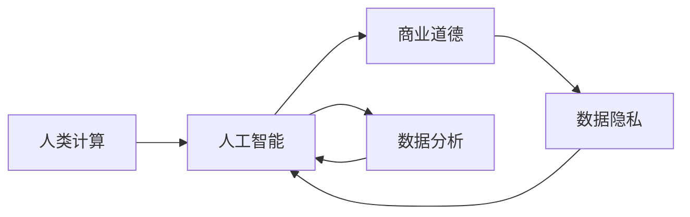

                 

# AI驱动的创新：人类计算在商业中的道德考虑因素与应用前景趋势

> 关键词：人工智能, 商业道德, 人类计算, 数据分析, 数据隐私, 算法透明性, 商业伦理

## 1. 背景介绍

在数字化浪潮的推动下，人工智能(AI)技术正逐渐渗透到商业活动的各个层面。从销售推荐、客户服务到供应链优化、财务分析，AI的智能计算在提升企业运营效率和盈利能力的同时，也带来了前所未有的道德挑战。本文旨在探讨AI在商业应用中的道德考量，以及其在未来发展中的前景和趋势。

## 2. 核心概念与联系

### 2.1 核心概念概述

为便于理解，我们先简要介绍几个核心概念：

- **人工智能(AI)**：通过算法、模型和数据训练得到的智能系统，具备感知、推理、学习和决策能力。
- **人类计算(Human-in-the-loop)**：在AI系统中融入人类专家知识，通过人机协同完成复杂任务。
- **商业道德**：企业在利用AI技术时，遵循的伦理规范和道德准则，包括数据隐私、算法透明性、责任归属等。
- **数据分析**：从原始数据中提取出有用信息的过程，是AI系统应用的基础。
- **数据隐私**：保护个人和商业数据不被滥用的原则。

以上概念在商业应用中相辅相成，共同构成了AI驱动的创新生态。

### 2.2 核心概念原理和架构的 Mermaid 流程图



从图中可以看出，AI系统通过数据分析生成智能计算结果，并在人机协同下执行复杂任务。同时，商业道德和数据隐私是确保AI系统可靠性和公正性的重要前提。

## 3. 核心算法原理 & 具体操作步骤

### 3.1 算法原理概述

基于机器学习的AI算法通常包括以下步骤：

1. **数据收集**：从各种渠道获取数据，包括用户行为、交易记录、社交媒体等。
2. **数据预处理**：清洗、归一化、特征提取等。
3. **模型训练**：使用历史数据训练AI模型，得到预测模型。
4. **模型评估**：在验证集上评估模型性能，调整参数。
5. **模型部署**：将模型集成到业务系统中，进行实时或批量预测。

### 3.2 算法步骤详解

- **步骤1：数据收集与清洗**
  - **数据来源**：主要来源包括企业内部数据（如CRM、ERP系统）、公开数据集、网络爬取等。
  - **数据清洗**：处理缺失值、异常值，转换数据格式，提升数据质量。

- **步骤2：数据特征工程**
  - **特征提取**：提取对预测任务有帮助的特征，如时间戳、地理位置、购买频率等。
  - **特征选择**：从众多特征中筛选出最有代表性的特征，减少过拟合风险。

- **步骤3：模型选择与训练**
  - **模型选择**：根据任务类型选择合适的模型（如回归模型、分类模型、聚类模型等）。
  - **模型训练**：使用历史数据训练模型，通过交叉验证等技术调整模型超参数。

- **步骤4：模型评估与优化**
  - **模型评估**：在验证集上评估模型性能，使用指标如准确率、召回率、F1-score等。
  - **模型优化**：根据评估结果调整模型结构、参数，提升模型泛化能力。

- **步骤5：模型部署与监控**
  - **模型部署**：将训练好的模型集成到业务系统中，进行实时或批量预测。
  - **模型监控**：持续监控模型性能，根据业务变化调整模型策略。

### 3.3 算法优缺点

**优点**：

- **高效性**：利用AI技术，显著提升数据处理和分析速度。
- **决策质量**：通过机器学习，降低人为因素对决策的影响，提高决策质量。
- **可扩展性**：AI模型具有高可扩展性，适用于大规模数据处理和复杂业务场景。

**缺点**：

- **数据依赖**：模型依赖高质量数据，数据偏差可能导致模型偏见。
- **算法透明性**：黑盒算法难以解释，难以理解模型决策过程。
- **隐私风险**：数据收集和存储过程中，存在隐私泄露的风险。

### 3.4 算法应用领域

AI在商业应用领域广泛，主要涵盖以下几个方面：

- **客户服务**：通过智能客服、推荐系统提升客户体验。
- **市场营销**：使用数据挖掘和机器学习优化广告投放策略。
- **供应链管理**：利用预测模型优化库存管理、物流调度。
- **金融分析**：运用AI技术进行风险评估、信用评分、交易预测。
- **人力资源**：通过智能招聘、绩效分析提升人力资源管理。

## 4. 数学模型和公式 & 详细讲解 & 举例说明

### 4.1 数学模型构建

以回归模型为例，其数学模型可表示为：

$$
y = w_0 + w_1x_1 + w_2x_2 + \cdots + w_nx_n + \epsilon
$$

其中，$y$为预测值，$x_1, x_2, \cdots, x_n$为特征，$w_0, w_1, w_2, \cdots, w_n$为模型参数，$\epsilon$为误差项。

### 4.2 公式推导过程

回归模型的最小二乘法损失函数为：

$$
L(w) = \frac{1}{2N} \sum_{i=1}^N (y_i - \hat{y}_i)^2
$$

其中，$N$为样本数，$\hat{y}_i = w_0 + w_1x_{1,i} + w_2x_{2,i} + \cdots + w_nx_{n,i}$。

求解该损失函数的最小值，通过梯度下降等方法得到最优参数$w$。

### 4.3 案例分析与讲解

以房价预测为例，假设有历史交易数据，每个样本包含房屋面积、房间数、地理位置等特征，目标为预测房屋价格。

首先，进行数据收集与预处理，清洗缺失值，转换数据格式，提取特征。然后，构建回归模型，选择多项式回归或决策树回归等模型，使用历史数据训练模型。最后，在验证集上评估模型性能，调整模型参数，部署到生产环境进行实时预测。

## 5. 项目实践：代码实例和详细解释说明

### 5.1 开发环境搭建

- **环境准备**：搭建Python开发环境，安装必要的库（如NumPy、Pandas、Scikit-Learn等）。
- **数据准备**：准备数据集，并进行预处理。
- **模型训练**：选择合适的模型，使用交叉验证等技术训练模型。
- **模型评估**：在验证集上评估模型性能，调整参数。
- **模型部署**：将模型集成到业务系统中，进行实时预测。

### 5.2 源代码详细实现

以线性回归模型为例，其代码实现如下：

```python
import numpy as np
from sklearn.linear_model import LinearRegression
from sklearn.model_selection import train_test_split
from sklearn.metrics import mean_squared_error

# 准备数据
X = np.array([[1, 2, 3], [4, 5, 6], [7, 8, 9]])
y = np.array([2, 4, 6])

# 划分训练集和验证集
X_train, X_valid, y_train, y_valid = train_test_split(X, y, test_size=0.3)

# 训练模型
model = LinearRegression()
model.fit(X_train, y_train)

# 预测并评估模型
y_pred = model.predict(X_valid)
mse = mean_squared_error(y_valid, y_pred)
print("MSE:", mse)
```

### 5.3 代码解读与分析

以上代码实现了线性回归模型的训练和评估过程，主要步骤如下：

- 准备数据：创建训练样本集X和目标变量y。
- 数据划分：使用train_test_split函数划分训练集和验证集。
- 模型训练：使用LinearRegression类实例化模型，并使用训练集进行拟合。
- 模型预测：使用训练好的模型对验证集进行预测。
- 模型评估：计算预测值与真实值之间的均方误差。

## 6. 实际应用场景

### 6.1 客户服务

AI驱动的智能客服系统能够实时回答用户问题，提升客户满意度。通过语音识别和自然语言处理技术，系统能够理解用户输入，并提供精准的回复。智能客服还具备数据分析功能，能够统计常见问题和处理方式，不断优化知识库。

### 6.2 市场营销

AI技术在市场营销中可用于精准广告投放和客户细分。通过分析用户行为数据，构建用户画像，系统能够预测用户可能感兴趣的广告，提高投放效果。同时，AI还能分析客户反馈，优化产品推荐策略。

### 6.3 供应链管理

AI技术在供应链管理中可优化库存管理和物流调度。通过预测模型分析历史数据，系统能够预测未来需求，优化库存水平。智能物流系统能够实时监控货物状态，优化运输路线，提升物流效率。

### 6.4 金融分析

AI在金融分析中可用于信用评分、风险评估和交易预测。通过分析历史交易数据，构建信用评分模型，系统能够评估客户的信用风险。AI还可以预测股票价格和市场趋势，帮助投资者决策。

### 6.5 未来应用展望

未来，AI将在商业应用中发挥更大作用，带来以下趋势：

- **自动化**：自动化处理业务流程，提升效率和准确性。
- **个性化**：通过AI技术提供个性化服务和产品，满足用户需求。
- **数据驱动**：利用大数据分析驱动商业决策，提高决策质量。
- **协同工作**：人机协同完成复杂任务，提升系统性能和可靠性。

## 7. 工具和资源推荐

### 7.1 学习资源推荐

- **在线课程**：如Coursera的机器学习课程、Udacity的深度学习课程。
- **书籍**：如《机器学习实战》、《Python数据科学手册》等。
- **官方文档**：如Scikit-Learn、TensorFlow等官方文档。

### 7.2 开发工具推荐

- **编程语言**：Python、R等数据科学常用的编程语言。
- **数据分析工具**：Pandas、NumPy等。
- **机器学习框架**：Scikit-Learn、TensorFlow等。
- **可视化工具**：Matplotlib、Seaborn等。

### 7.3 相关论文推荐

- **机器学习**：如Jordan A. Pearl的《机器学习与人工智能：系统方法》。
- **数据隐私**：如Edward W. Felten的《数据隐私保护技术》。
- **商业伦理**：如Jill J. Fisch的《商业伦理与可持续性》。

## 8. 总结：未来发展趋势与挑战

### 8.1 研究成果总结

本文从人工智能在商业应用中的道德考量和未来发展趋势两个方面，系统介绍了AI技术的实际应用。AI技术在提升商业效率和盈利能力的同时，也带来了数据隐私、算法透明性等道德挑战。通过合理使用AI技术，可以在商业中实现人机协同，提升决策质量和效率。

### 8.2 未来发展趋势

未来，AI技术将在商业应用中发挥更大作用，带来以下趋势：

- **自动化**：自动化处理业务流程，提升效率和准确性。
- **个性化**：通过AI技术提供个性化服务和产品，满足用户需求。
- **数据驱动**：利用大数据分析驱动商业决策，提高决策质量。
- **协同工作**：人机协同完成复杂任务，提升系统性能和可靠性。

### 8.3 面临的挑战

尽管AI技术在商业应用中取得了巨大成功，但也面临着以下挑战：

- **数据依赖**：模型依赖高质量数据，数据偏差可能导致模型偏见。
- **算法透明性**：黑盒算法难以解释，难以理解模型决策过程。
- **隐私风险**：数据收集和存储过程中，存在隐私泄露的风险。

### 8.4 研究展望

未来，需要从以下方面进一步探索AI技术在商业中的应用：

- **数据治理**：建立数据治理机制，保护数据隐私，减少数据偏差。
- **算法透明性**：提高算法的透明性，增强用户对AI系统的信任。
- **协同创新**：促进跨领域、跨行业的协同创新，推动AI技术的广泛应用。

## 9. 附录：常见问题与解答

**Q1: 什么是人类计算？**

A: 人类计算是指在AI系统中融入人类专家知识，通过人机协同完成复杂任务。这种方式能够充分利用人类专家的智慧，避免AI系统的偏见和局限。

**Q2: 数据隐私如何保护？**

A: 数据隐私保护可以从以下几个方面入手：
1. 数据匿名化：去除或伪装个人敏感信息。
2. 数据加密：对数据进行加密处理，防止非法访问。
3. 访问控制：设置严格的访问权限，确保数据仅对授权人员可见。
4. 数据共享协议：明确数据共享的目的和范围，保护数据权益。

**Q3: 如何提高算法的透明性？**

A: 提高算法透明性可以从以下几个方面入手：
1. 模型解释：使用可解释模型，如线性模型、决策树模型。
2. 可视化工具：使用可视化工具展示模型决策过程。
3. 文档记录：详细记录模型设计、训练和评估过程，增强可追溯性。
4. 用户反馈：通过用户反馈不断优化模型，增强透明度。

**Q4: 未来AI技术在商业应用中面临的主要挑战是什么？**

A: 未来AI技术在商业应用中面临的主要挑战包括：
1. 数据依赖：模型依赖高质量数据，数据偏差可能导致模型偏见。
2. 算法透明性：黑盒算法难以解释，难以理解模型决策过程。
3. 隐私风险：数据收集和存储过程中，存在隐私泄露的风险。

---

作者：禅与计算机程序设计艺术 / Zen and the Art of Computer Programming

