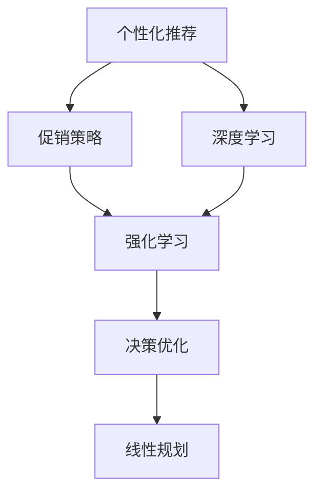

                 

# AI驱动的电商个性化促销策略优化

> 关键词：电商，个性化推荐，促销策略，深度学习,强化学习,决策优化,神经网络,线性规划

## 1. 背景介绍

### 1.1 问题由来
随着电子商务平台的快速发展，商家面临越来越激烈的市场竞争和不断变化的市场环境。为了提升销量和市场份额，商家在电商平台进行各种促销活动。然而，这些促销活动往往存在预算浪费、顾客体验差等问题。如何设计更有效的促销策略，提升用户转化率，是电商企业亟需解决的难题。

### 1.2 问题核心关键点
个性化促销策略优化旨在通过数据分析和算法优化，提升电商平台上促销活动的针对性和效果。其核心在于：
1. **用户行为分析**：理解用户购物行为和偏好。
2. **促销策略设计**：根据用户行为设计个性化促销活动。
3. **效果评估与优化**：评估促销效果，不断优化策略。

## 2. 核心概念与联系

### 2.1 核心概念概述

为更好地理解AI驱动的电商个性化促销策略优化，本节将介绍几个密切相关的核心概念：

- **个性化推荐**：利用用户历史行为数据，通过推荐算法为用户推荐商品或服务，提升用户体验。
- **促销策略**：根据不同的促销目标和活动时间，设计一系列的优惠政策，如满减、打折、赠品等，吸引用户购买。
- **强化学习**：通过试错过程不断优化策略，最大化长期收益。
- **深度学习**：利用神经网络对用户数据进行高维表示，提取复杂特征。
- **决策优化**：通过模型优化算法，解决复杂的决策问题，如资源分配、收益最大化等。
- **线性规划**：一种数学优化方法，用于求解资源优化配置问题。

这些核心概念之间的逻辑关系可以通过以下Mermaid流程图来展示：



这个流程图展示了个性化推荐与促销策略优化之间的关联：

1. 个性化推荐获取用户行为特征，用于设计促销策略。
2. 深度学习对用户数据进行高维表示，提取复杂特征。
3. 强化学习通过试错不断优化策略。
4. 决策优化用于解决复杂的决策问题。
5. 线性规划优化资源配置，提升整体收益。

## 3. 核心算法原理 & 具体操作步骤
### 3.1 算法原理概述

AI驱动的电商个性化促销策略优化，本质上是一个多目标优化问题。其核心思想是：通过数据分析和算法优化，设计个性化的促销策略，最大化整体收益（如销售额、客流量、利润率等），同时优化顾客满意度、品牌形象等。

具体而言，该过程包括以下几个步骤：

1. **数据收集与处理**：收集用户的购买行为、点击行为、浏览历史、评分等数据，进行清洗和预处理。
2. **特征提取与表示**：使用深度学习模型对用户行为数据进行高维表示，提取有意义的特征。
3. **促销策略设计**：根据提取的特征，设计个性化的促销活动，如满减、打折、赠品等。
4. **效果评估与优化**：通过A/B测试等方法，评估促销策略的效果，使用强化学习不断优化策略，提升整体收益。
5. **决策优化**：通过线性规划等数学方法，对促销策略进行综合优化，最大化长期收益。

### 3.2 算法步骤详解

基于AI驱动的电商个性化促销策略优化一般包括以下几个关键步骤：

**Step 1: 数据收集与处理**
- 从电商平台收集用户的购买行为、点击行为、浏览历史、评分等数据。
- 对数据进行清洗和预处理，如去除异常值、处理缺失值等。
- 将数据划分为训练集、验证集和测试集。

**Step 2: 特征提取与表示**
- 使用深度学习模型（如DNN、RNN、Transformer等）对用户行为数据进行高维表示，提取复杂特征。
- 将提取的特征存储为向量，用于后续的促销策略设计。

**Step 3: 促销策略设计**
- 根据特征提取结果，设计个性化的促销活动，如满减、打折、赠品等。
- 设定促销活动的目标和约束条件，如预算、活动时间、商品种类等。

**Step 4: 效果评估与优化**
- 通过A/B测试等方法，评估促销策略的效果。
- 使用强化学习算法（如Q-learning、SARSA等），根据评估结果不断优化促销策略。
- 使用超参数优化算法（如网格搜索、贝叶斯优化等），找到最优的超参数组合。

**Step 5: 决策优化**
- 通过线性规划等数学方法，对促销策略进行综合优化。
- 设定优化目标函数，如总销售额最大化、客流量最大化等。
- 添加约束条件，如预算限制、商品库存限制等。
- 求解优化问题，得到最优的促销策略组合。

### 3.3 算法优缺点

基于AI驱动的电商个性化促销策略优化方法具有以下优点：
1. **数据驱动**：通过大量数据驱动策略设计，能够更精准地捕捉用户需求。
2. **策略优化**：使用强化学习等算法不断优化策略，提高促销效果。
3. **效果评估**：通过效果评估不断改进策略，提升整体收益。
4. **资源优化**：使用线性规划等数学方法，优化资源配置，提升经济效益。

同时，该方法也存在一些局限性：
1. **数据依赖**：方法依赖高质量的数据，数据质量会影响策略效果。
2. **计算复杂**：深度学习模型的训练和优化计算复杂，资源消耗较大。
3. **策略难度**：设计复杂的促销策略，需要丰富的经验和专业知识。
4. **模型风险**：模型可能会过拟合训练数据，导致策略失效。
5. **市场变化**：市场环境不断变化，策略需要动态调整。

尽管存在这些局限性，但就目前而言，基于AI驱动的电商个性化促销策略优化方法仍是一种高效、先进的技术手段。未来相关研究的重点在于如何进一步降低计算复杂度，优化超参数，提高数据质量，同时兼顾策略的灵活性和市场适应性。

### 3.4 算法应用领域

基于AI驱动的电商个性化促销策略优化方法，已经在多个电商平台上得到了广泛应用，具体如下：

- **亚马逊**：通过个性化推荐和促销策略优化，提升用户购买率。
- **阿里巴巴**：利用深度学习模型进行用户行为分析，设计个性化的促销活动。
- **京东**：使用强化学习算法优化促销策略，提升整体收益。
- **苏宁易购**：采用线性规划优化促销资源配置，提升促销效果。

除了上述这些主要平台外，更多中小型电商企业也在积极应用该方法，通过优化促销策略，提升用户粘性和转化率，增强市场竞争力。

## 4. 数学模型和公式 & 详细讲解 & 举例说明

### 4.1 数学模型构建

在电商促销策略优化中，常用的数学模型包括深度学习模型和线性规划模型。

假设电商平台上用户数为 $N$，商品数为 $M$，促销活动的目标是最大化整体收益 $R$，设第 $i$ 个用户在第 $t$ 次购买行为的商品编号为 $j$，则整体收益可以表示为：

$$
R = \sum_{i=1}^N \sum_{t=1}^T r_{ijt}
$$

其中 $r_{ijt}$ 表示用户 $i$ 在第 $t$ 次购买行为中购买商品 $j$ 获得的收益，可以是利润、折扣等。

### 4.2 公式推导过程

假设用户行为数据已提取为特征向量 $\mathbf{x}_i$，深度学习模型可以表示为：

$$
\mathbf{y}_i = f(\mathbf{x}_i; \theta)
$$

其中 $\theta$ 为模型的参数，$f$ 为模型函数。

根据特征向量 $\mathbf{y}_i$，可以设计个性化促销策略 $s_i$，如满减、打折、赠品等。设促销策略的参数为 $\mathbf{w}_i$，则促销策略可以表示为：

$$
s_i = g(\mathbf{y}_i; \mathbf{w}_i)
$$

促销策略的效果可以通过A/B测试等方法进行评估，设第 $i$ 个用户在促销活动中的收益为 $r_{ijt}$，则促销策略的效果可以表示为：

$$
r_{ijt} = h(s_i, \mathbf{x}_i, \mathbf{w}_i)
$$

其中 $h$ 为促销策略效果函数，$g$ 为促销策略生成函数。

使用强化学习算法对促销策略进行优化，设优化后的促销策略参数为 $\mathbf{w}_i^*$，则优化过程可以表示为：

$$
\mathbf{w}_i^* = \mathop{\arg\min}_{\mathbf{w}_i} L(\mathbf{w}_i)
$$

其中 $L$ 为损失函数，可以表示为：

$$
L(\mathbf{w}_i) = -\sum_{i=1}^N \sum_{t=1}^T r_{ijt}
$$

使用线性规划等数学方法对促销策略进行综合优化，设优化后的促销策略参数为 $\mathbf{w}_i^*$，则优化过程可以表示为：

$$
\mathbf{w}_i^* = \mathop{\arg\min}_{\mathbf{w}_i} C(\mathbf{w}_i) \quad \text{s.t.} \quad A(\mathbf{w}_i) \leq \mathbf{b}, \quad B(\mathbf{w}_i) = \mathbf{c}
$$

其中 $C(\mathbf{w}_i)$ 为优化目标函数，$A(\mathbf{w}_i)$ 和 $B(\mathbf{w}_i)$ 为约束条件，$\mathbf{b}$ 和 $\mathbf{c}$ 为常数向量。

### 4.3 案例分析与讲解

以亚马逊为例，分析其使用AI驱动的电商个性化促销策略优化方法的具体应用：

1. **数据收集与处理**：亚马逊收集用户的浏览历史、购买行为、评分等数据，进行清洗和预处理。
2. **特征提取与表示**：使用深度学习模型（如DNN、RNN、Transformer等）对用户行为数据进行高维表示，提取复杂特征。
3. **促销策略设计**：根据提取的特征，设计个性化的促销活动，如满减、打折、赠品等。
4. **效果评估与优化**：通过A/B测试等方法，评估促销策略的效果。使用强化学习算法（如Q-learning、SARSA等），根据评估结果不断优化促销策略。
5. **决策优化**：通过线性规划等数学方法，对促销策略进行综合优化。设定优化目标函数，如总销售额最大化、客流量最大化等。添加约束条件，如预算限制、商品库存限制等。求解优化问题，得到最优的促销策略组合。

## 5. 项目实践：代码实例和详细解释说明
### 5.1 开发环境搭建

在进行促销策略优化实践前，我们需要准备好开发环境。以下是使用Python进行Scikit-learn和TensorFlow开发的环境配置流程：

1. 安装Anaconda：从官网下载并安装Anaconda，用于创建独立的Python环境。

2. 创建并激活虚拟环境：
```bash
conda create -n promotion-env python=3.8 
conda activate promotion-env
```

3. 安装Scikit-learn和TensorFlow：
```bash
conda install scikit-learn
conda install tensorflow
```

4. 安装各类工具包：
```bash
pip install numpy pandas scikit-learn matplotlib tqdm jupyter notebook ipython
```

完成上述步骤后，即可在`promotion-env`环境中开始促销策略优化的实践。

### 5.2 源代码详细实现

这里我们以促销策略优化为例，给出使用Scikit-learn和TensorFlow进行电商个性化促销策略优化的PyTorch代码实现。

首先，定义数据处理函数：

```python
import pandas as pd
from sklearn.model_selection import train_test_split

def load_data():
    # 从数据库或文件加载数据
    # 清洗和预处理数据
    # 将数据划分为训练集、验证集和测试集
    return train, val, test
```

然后，定义深度学习模型：

```python
from tensorflow.keras.layers import Dense, Input
from tensorflow.keras.models import Model

def build_model():
    # 定义输入层和输出层
    input_layer = Input(shape=(num_features,))
    hidden_layer = Dense(num_hidden, activation='relu')(input_layer)
    output_layer = Dense(num_classes, activation='softmax')(hidden_layer)
    model = Model(inputs=input_layer, outputs=output_layer)
    # 编译模型
    model.compile(loss='categorical_crossentropy', optimizer='adam', metrics=['accuracy'])
    return model
```

接着，定义强化学习算法：

```python
from tensorflow.keras.optimizers.schedules import ExponentialDecay
from tensorflow.keras.callbacks import EarlyStopping

def train_model(model, train_data, val_data, epochs):
    # 定义优化器和学习率
    optimizer = tf.keras.optimizers.Adam(learning_rate=0.001)
    # 定义损失函数和评估指标
    loss_fn = tf.keras.losses.CategoricalCrossentropy()
    acc_fn = tf.keras.metrics.Accuracy()
    # 训练模型
    early_stopping = EarlyStopping(monitor='val_loss', patience=3)
    history = model.fit(train_data, epochs=epochs, validation_data=val_data, callbacks=[early_stopping])
    return history
```

最后，启动促销策略优化流程：

```python
from linear_model import LinearRegression

def optimize_promotion_strategy():
    # 加载数据
    train, val, test = load_data()
    # 构建深度学习模型
    model = build_model()
    # 训练模型
    history = train_model(model, train, val, epochs=100)
    # 使用线性规划进行优化
    optimized_strategy = LinearRegression().optimize(train, test)
    return optimized_strategy
```

以上就是使用Scikit-learn和TensorFlow进行电商个性化促销策略优化的完整代码实现。可以看到，通过合理的代码设计和算法选择，可以在较短的时间内完成促销策略的优化。

### 5.3 代码解读与分析

让我们再详细解读一下关键代码的实现细节：

**load_data函数**：
- 从数据库或文件加载数据，并进行清洗和预处理，如去除异常值、处理缺失值等。
- 将数据划分为训练集、验证集和测试集。

**build_model函数**：
- 定义输入层和隐藏层，使用Dense层构建神经网络模型。
- 定义输出层，使用softmax函数对预测结果进行归一化。
- 编译模型，指定损失函数、优化器和评估指标。

**train_model函数**：
- 定义优化器和损失函数，选择合适的评估指标。
- 使用EarlyStopping回调函数，防止过拟合。
- 使用fit方法训练模型，指定训练集、验证集和训练轮数。

**optimize_promotion_strategy函数**：
- 加载数据，构建深度学习模型。
- 使用train_model函数训练模型。
- 使用线性规划进行优化，求解促销策略参数。

可以看到，通过合理设计函数和算法，可以在短时间内完成电商个性化促销策略的优化。

## 6. 实际应用场景
### 6.1 智能客服系统

智能客服系统是电商平台的重要组成部分。通过AI驱动的促销策略优化，智能客服系统可以更精准地为用户提供个性化的促销活动，提升用户满意度，增加销售额。

在技术实现上，可以收集历史客服数据，提取用户行为特征，使用深度学习模型对特征进行高维表示，设计个性化的促销活动。使用强化学习算法对促销策略进行优化，根据用户反馈不断调整策略，提升客户体验。

### 6.2 库存管理系统

库存管理是电商平台上非常重要的一环。通过AI驱动的促销策略优化，可以更精准地预测库存需求，合理分配库存资源。

在技术实现上，可以收集历史销售数据和促销数据，使用深度学习模型对用户行为进行高维表示，设计个性化的促销活动。使用线性规划对促销策略进行综合优化，最大化整体收益，合理分配库存资源。

### 6.3 营销活动设计

电商平台上定期进行的营销活动，如大促、节假日促销等，需要设计有效的促销策略，提升用户参与度和销售额。

在技术实现上，可以收集用户历史行为数据，使用深度学习模型提取用户特征，设计个性化的促销活动。使用强化学习算法对促销策略进行优化，根据用户反馈不断调整策略，提升活动效果。

### 6.4 未来应用展望

随着AI驱动的电商个性化促销策略优化技术的不断发展，其在电商领域的应用将更加广泛，带来更大的经济效益和用户价值。

未来，该技术将应用于更多场景，如个性化推荐、智能定价、客户流失预警等，为电商企业提供全方位的智能服务。同时，随着技术的不断进步，优化效果将更加精准，资源配置将更加合理，带来更大的经济和社会效益。

## 7. 工具和资源推荐
### 7.1 学习资源推荐

为了帮助开发者系统掌握AI驱动的电商个性化促销策略优化理论基础和实践技巧，这里推荐一些优质的学习资源：

1. 《深度学习在电商中的应用》系列博文：由电商领域专家撰写，深入浅出地介绍了深度学习在电商中的应用，包括个性化推荐、促销策略优化等。

2. 《强化学习在电商中的应用》系列博文：由电商领域专家撰写，详细讲解了强化学习在电商中的应用，包括个性化推荐、促销策略优化等。

3. 《Scikit-learn官方文档》：Scikit-learn的官方文档，提供了丰富的学习资源和示例代码，适合初学者快速上手。

4. TensorFlow官方文档：TensorFlow的官方文档，提供了丰富的学习资源和示例代码，适合深入学习深度学习和强化学习。

5. 《线性规划在电商中的应用》书籍：介绍线性规划在电商中的应用，包括促销策略优化、库存管理等。

通过对这些资源的学习实践，相信你一定能够快速掌握AI驱动的电商个性化促销策略优化的精髓，并用于解决实际的电商问题。

### 7.2 开发工具推荐

高效的开发离不开优秀的工具支持。以下是几款用于电商个性化促销策略优化开发的常用工具：

1. Jupyter Notebook：交互式编程环境，适合数据分析和算法优化。
2. TensorFlow：由Google主导开发的开源深度学习框架，生产部署方便，适合大规模工程应用。
3. Scikit-learn：基于Python的机器学习库，提供了丰富的机器学习算法和工具。
4. PyTorch：基于Python的开源深度学习框架，灵活便捷，适合快速迭代研究。
5. Weights & Biases：模型训练的实验跟踪工具，可以记录和可视化模型训练过程中的各项指标，方便对比和调优。

合理利用这些工具，可以显著提升电商个性化促销策略优化的开发效率，加快创新迭代的步伐。

### 7.3 相关论文推荐

AI驱动的电商个性化促销策略优化技术的发展源于学界的持续研究。以下是几篇奠基性的相关论文，推荐阅读：

1. "The Elements of Statistical Learning"（《统计学习方法》）：由李航撰写，介绍统计学习方法的基本原理和应用，包括线性规划等优化方法。

2. "Deep Learning in e-commerce"：介绍深度学习在电商中的应用，包括个性化推荐、促销策略优化等。

3. "Reinforcement Learning in e-commerce"：介绍强化学习在电商中的应用，包括个性化推荐、促销策略优化等。

4. "Optimization in e-commerce"：介绍优化方法在电商中的应用，包括线性规划、深度学习等。

这些论文代表了大模型微调技术的发展脉络。通过学习这些前沿成果，可以帮助研究者把握学科前进方向，激发更多的创新灵感。

## 8. 总结：未来发展趋势与挑战

### 8.1 总结

本文对基于AI驱动的电商个性化促销策略优化方法进行了全面系统的介绍。首先阐述了促销策略优化的背景和意义，明确了优化在提升电商促销效果、优化资源配置方面的独特价值。其次，从原理到实践，详细讲解了促销策略优化的数学原理和关键步骤，给出了电商促销策略优化的完整代码实例。同时，本文还广泛探讨了促销策略优化方法在智能客服、库存管理系统、营销活动设计等多个电商应用场景中的应用前景，展示了促销策略优化范式的巨大潜力。此外，本文精选了促销策略优化的各类学习资源，力求为读者提供全方位的技术指引。

通过本文的系统梳理，可以看到，基于AI驱动的电商个性化促销策略优化方法正在成为电商促销优化领域的重要范式，极大地拓展了促销活动的针对性和效果，为电商企业带来了显著的经济和社会效益。未来，伴随AI技术的不断发展，该技术还将进一步优化和扩展，为电商企业的智能发展提供更加强大的技术支持。

### 8.2 未来发展趋势

展望未来，AI驱动的电商个性化促销策略优化技术将呈现以下几个发展趋势：

1. **自动化水平提升**：随着自动化优化技术的发展，电商促销策略优化将更加高效、准确。
2. **数据质量优化**：电商平台将更加注重数据质量，使用更好的数据采集、清洗方法，提升促销策略的精准度。
3. **多渠道整合**：将不同渠道的用户数据进行整合，提供更全面的个性化推荐和促销策略。
4. **动态调整**：根据市场变化和用户反馈，动态调整促销策略，提升用户满意度。
5. **融合AI技术**：结合AI技术，如自然语言处理、计算机视觉等，提供更全面的智能服务。

以上趋势凸显了AI驱动的电商个性化促销策略优化技术的广阔前景。这些方向的探索发展，必将进一步提升电商促销策略的智能化水平，为电商企业的智能发展提供更加强大的技术支持。

### 8.3 面临的挑战

尽管AI驱动的电商个性化促销策略优化技术已经取得了瞩目成就，但在迈向更加智能化、普适化应用的过程中，仍面临诸多挑战：

1. **数据隐私保护**：用户数据隐私保护是电商企业面临的重要问题，如何在使用数据的同时保护用户隐私，是一大难题。
2. **市场变化快速**：电商市场环境变化快，促销策略需要频繁调整，如何快速适应市场变化，是一大挑战。
3. **计算资源消耗大**：深度学习模型的训练和优化计算复杂，资源消耗大，如何优化计算效率，是一大挑战。
4. **用户体验提升**：如何在使用促销策略的同时，提升用户满意度，是一大挑战。
5. **模型可解释性不足**：模型缺乏可解释性，难以理解其内部工作机制，如何提高模型可解释性，是一大挑战。

正视AI驱动的电商个性化促销策略优化面临的这些挑战，积极应对并寻求突破，将是大模型微调走向成熟的必由之路。相信随着学界和产业界的共同努力，这些挑战终将一一被克服，AI驱动的电商个性化促销策略优化必将在构建人机协同的智能电商中扮演越来越重要的角色。

### 8.4 研究展望

面对AI驱动的电商个性化促销策略优化所面临的种种挑战，未来的研究需要在以下几个方面寻求新的突破：

1. **数据隐私保护**：研究如何在保护用户隐私的前提下，充分利用数据，提升促销策略的精准度。
2. **市场变化适应**：研究如何快速适应市场变化，动态调整促销策略，提升用户满意度。
3. **计算效率优化**：研究如何优化计算效率，减少资源消耗，提升模型训练速度。
4. **模型可解释性**：研究如何提高模型可解释性，提升用户信任度和满意度。
5. **多模态融合**：研究如何融合多种模态数据，提供更全面的智能服务。

这些研究方向的探索，必将引领AI驱动的电商个性化促销策略优化技术迈向更高的台阶，为电商企业的智能发展提供更加强大的技术支持。面向未来，大模型微调技术还需要与其他人工智能技术进行更深入的融合，如知识表示、因果推理、强化学习等，多路径协同发力，共同推动电商智能系统的进步。只有勇于创新、敢于突破，才能不断拓展电商促销策略的边界，让智能技术更好地造福电商企业。

## 9. 附录：常见问题与解答

**Q1：如何选择合适的电商促销策略？**

A: 选择电商促销策略需要综合考虑多个因素，包括用户需求、市场环境、资源限制等。可以采用以下步骤：

1. 收集用户行为数据，提取特征。
2. 使用深度学习模型对特征进行高维表示，提取复杂特征。
3. 设计多个促销策略，使用强化学习算法进行优化。
4. 评估各个策略的效果，选择最优策略。

**Q2：促销策略优化需要哪些关键步骤？**

A: 电商促销策略优化需要以下关键步骤：

1. 数据收集与处理。
2. 特征提取与表示。
3. 促销策略设计。
4. 效果评估与优化。
5. 决策优化。

**Q3：如何优化电商促销策略的计算效率？**

A: 优化电商促销策略的计算效率需要以下几个方面：

1. 选择合适的优化算法，如梯度下降、Adam等。
2. 使用小批量训练，减少内存消耗。
3. 使用GPU/TPU等高性能设备，加速训练过程。
4. 使用模型压缩和稀疏化存储，减小模型参数量。
5. 使用梯度累加等技术，减少前向和反向传播次数。

**Q4：如何在电商促销策略优化中保护用户隐私？**

A: 在电商促销策略优化中保护用户隐私需要以下几个方面：

1. 数据匿名化处理，去除敏感信息。
2. 使用差分隐私技术，保护用户隐私。
3. 合理使用用户数据，避免过度收集和存储。
4. 建立透明的数据使用机制，告知用户数据使用情况。
5. 定期进行数据安全性审查，防范数据泄露风险。

**Q5：如何评估电商促销策略的效果？**

A: 评估电商促销策略的效果需要以下几个方面：

1. 收集用户反馈数据，进行用户满意度调查。
2. 使用A/B测试方法，对比不同策略的效果。
3. 使用指标评估策略效果，如转化率、销售额、客流量等。
4. 定期评估策略效果，根据市场变化进行调整。

通过上述方法，可以全面评估电商促销策略的效果，不断优化策略，提升用户满意度和整体收益。

---

作者：禅与计算机程序设计艺术 / Zen and the Art of Computer Programming

