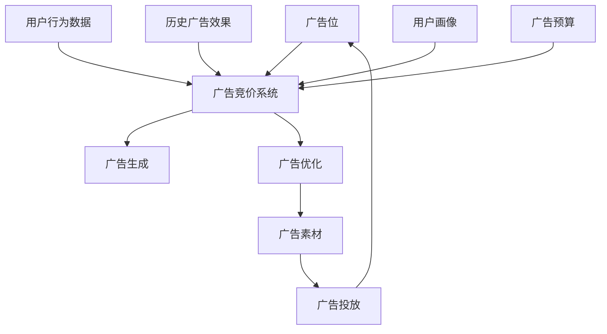

                 

# AI驱动的电商实时竞价广告系统

## 1. 背景介绍

### 1.1 问题由来
在电商行业中，广告位是商家推广产品的重要渠道之一。传统的广告投放方式通常基于手动设置或固定算法，缺乏对用户行为和市场动态的实时监控和优化。这种静态的投放方式，无法高效利用有限的广告预算，导致资源浪费。

近年来，随着AI技术的飞速发展，实时竞价广告系统(Real-time Bidding, RTB)应运而生。RTB系统能够实时监测广告位和用户行为数据，动态调整投放策略，最大化广告预算的利用率，提升广告效果。

然而，传统RTB系统主要依靠规则引擎和手工调参，难以快速适应市场变化，且缺乏智能化的广告生成能力。此外，广告位的频繁竞价和实时性要求，也对系统架构和性能提出了严苛的要求。

本文聚焦于AI驱动的电商实时竞价广告系统，通过在大数据和深度学习框架上实现动态优化与智能生成，提供高效、智能、实时化的广告投放解决方案，提升电商平台的广告效果和运营效率。

### 1.2 问题核心关键点
本系统旨在通过AI技术，解决电商广告系统面临的以下关键问题：

1. 实时动态优化广告投放：基于实时竞价机制，根据广告位和用户行为数据，动态调整投放策略，最大化广告效果。
2. 智能生成广告内容：利用自然语言生成和推荐系统，生成符合用户偏好的广告文案和素材，提升广告点击率和转化率。
3. 预测市场趋势：通过历史数据和大数据分析，预测广告投放的市场趋势和潜在机会，辅助决策者进行广告预算分配。
4. 保障系统实时性：采用分布式架构和高性能计算技术，确保广告投放的实时性和系统稳定性。
5. 提升广告精准度：结合用户画像和广告效果数据，实现精准广告投放，提高广告ROI。

## 2. 核心概念与联系

### 2.1 核心概念概述

为更好地理解AI驱动的电商实时竞价广告系统，本节将介绍几个密切相关的核心概念：

- **实时竞价广告系统(Real-time Bidding, RTB)**：基于互联网广告拍卖机制，动态调整广告投放策略的系统。通过实时竞价，以最高的出价赢得广告位，提升广告效果。
- **自然语言生成(Natural Language Generation, NLG)**：利用机器学习和语言模型，自动生成符合语法和语义规则的自然语言文本，用于广告文案的生成和优化。
- **推荐系统(Recommender System)**：通过用户历史行为和物品特征，预测用户偏好，实现个性化推荐。应用于广告内容生成和精准投放。
- **深度学习框架(Deep Learning Framework)**：如TensorFlow、PyTorch等，提供高效的深度学习模型训练和推理功能，支持广告内容生成和投放优化。
- **分布式计算系统(Distributed Computing System)**：如Spark、Flink等，提供高性能、高可靠性的数据处理和计算功能，支持广告投放的实时性需求。
- **边缘计算系统(Edge Computing System)**：如AWS Greengrass、Intel IoT Gateway等，提供近端计算能力，加速广告内容生成和投放，降低网络延迟。

这些核心概念之间的逻辑关系可以通过以下Mermaid流程图来展示：



这个流程图展示了大语言模型的工作原理和优化方向：

1. 广告位、用户行为数据、历史广告效果、用户画像和广告预算等数据流向广告竞价系统。
2. 广告竞价系统通过实时竞价机制，选择最优的广告位和出价策略，进行广告投放。
3. 广告生成和优化模块，利用自然语言生成和推荐系统，生成和优化广告内容，提升广告效果。
4. 最终生成的广告素材流向广告投放系统，进行实时投放和效果监测。

这些概念共同构成了电商实时竞价广告系统的核心框架，使其能够高效、智能、实时地进行广告投放。

## 3. 核心算法原理 & 具体操作步骤
### 3.1 算法原理概述

AI驱动的电商实时竞价广告系统，采用以下核心算法原理：

1. **实时竞价算法**：根据广告位、用户行为数据、历史广告效果、用户画像和广告预算等实时数据，动态计算出价策略，最大化广告效果。
2. **自然语言生成算法**：利用深度学习模型，自动生成符合语法和语义规则的广告文案，提升广告文案的吸引力和点击率。
3. **推荐算法**：通过协同过滤和内容推荐算法，根据用户历史行为和物品特征，预测用户偏好，实现个性化广告推荐。
4. **深度学习框架**：采用TensorFlow或PyTorch等深度学习框架，训练和部署广告生成和优化模型，支持广告投放的实时优化。
5. **分布式计算系统**：使用Spark或Flink等分布式计算框架，处理大规模数据流，支持广告投放的实时性需求。
6. **边缘计算系统**：部署AWS Greengrass或Intel IoT Gateway等边缘计算平台，加速广告内容的生成和投放，降低网络延迟。

### 3.2 算法步骤详解

基于上述核心算法原理，AI驱动的电商实时竞价广告系统的大致操作步骤如下：

1. **数据收集与预处理**：
    - 从电商平台的各个渠道收集广告位、用户行为数据、历史广告效果、用户画像和广告预算等数据。
    - 对数据进行清洗、去重、归一化等预处理，确保数据质量。

2. **广告竞价系统**：
    - 实时监测广告位和用户行为数据，动态调整投放策略，参与实时竞价。
    - 根据出价策略和广告位竞价结果，确定最优的广告位和投放时间。

3. **广告生成与优化**：
    - 利用深度学习模型和自然语言生成技术，自动生成广告文案和素材。
    - 通过推荐系统，根据用户历史行为和物品特征，进行个性化广告推荐。
    - 利用广告效果数据，动态调整广告内容和投放策略。

4. **广告投放与效果监测**：
    - 根据广告竞价结果和优化策略，流式生成广告素材，进行实时投放。
    - 监测广告效果，生成广告效果报告，辅助优化广告投放策略。

5. **系统优化与扩展**：
    - 定期更新模型和算法，优化广告投放效果。
    - 扩展分布式计算和存储系统，支持更大规模的广告投放。

### 3.3 算法优缺点

基于上述核心算法原理，AI驱动的电商实时竞价广告系统具备以下优点：

1. **实时动态优化**：根据实时竞价结果和用户行为数据，动态调整广告投放策略，最大化广告效果。
2. **智能广告生成**：利用自然语言生成和推荐系统，自动生成符合用户偏好的广告文案和素材，提升广告点击率和转化率。
3. **精准投放**：结合用户画像和广告效果数据，实现精准广告投放，提高广告ROI。
4. **高效可扩展**：采用分布式计算和存储技术，支持大规模广告投放和实时处理。
5. **自动化运维**：通过自动化的模型训练和优化，减轻运维人员的工作负担。

同时，该系统也存在一些局限性：

1. **数据质量要求高**：广告竞价和投放依赖于高质量的实时数据，数据缺失或噪声可能导致效果不佳。
2. **计算资源需求大**：大规模广告投放需要高性能的计算资源，系统建设和运维成本较高。
3. **系统复杂度高**：系统涉及多模块、多组件的协同工作，系统设计和实现复杂度高。
4. **用户隐私风险**：广告投放过程中涉及用户隐私数据，需要严格遵守隐私保护法规。

尽管存在这些局限性，但AI驱动的电商实时竞价广告系统在提升广告投放效果、降低运营成本和优化用户体验方面，仍具有巨大的应用前景。

### 3.4 算法应用领域

AI驱动的电商实时竞价广告系统，适用于各种电商平台的广告投放场景，包括：

1. **购物平台**：如淘宝、京东等电商平台，进行商品推广和品牌宣传。
2. **生活服务平台**：如美团、大众点评等生活服务类平台，推广本地服务和生活信息。
3. **娱乐平台**：如视频平台、音乐平台等，进行内容广告的投放和推广。
4. **社交平台**：如微博、微信等社交平台，进行广告定向投放和精准营销。
5. **金融平台**：如银行、保险等金融服务类平台，推广金融产品和服务。

此外，AI驱动的电商实时竞价广告系统，还可以应用于品牌商的跨平台广告投放、线上线下融合的营销活动、广告效果分析与优化等领域。

## 4. 数学模型和公式 & 详细讲解  
### 4.1 数学模型构建

本节将使用数学语言对AI驱动的电商实时竞价广告系统进行更加严格的刻画。

设广告位集合为 $A=\{a_1,a_2,\dots,a_m\}$，用户行为数据集合为 $B=\{b_1,b_2,\dots,b_n\}$，广告预算为 $E$，广告效果数据为 $C=\{c_1,c_2,\dots,c_k\}$，用户画像数据为 $D$。

定义广告竞价系统为 $F_{bid}$，广告生成与优化系统为 $F_{ad}$，广告投放系统为 $F_{serve}$，效果监测系统为 $F_{monitor}$。广告竞价系统的目标函数为：

$$
\mathcal{L}_{bid} = \min_{x_i \in A, t_i \in B, \alpha \in E} \sum_{a_i \in A, b_i \in B} \left(x_i f_{bid}(a_i, b_i) + t_i f_{cost}(a_i, t_i, b_i) + \sum_{c_j \in C} f_{evaluate}(c_j)\right)
$$

其中 $x_i$ 为广告位出价，$t_i$ 为投放时间，$f_{bid}$ 为竞价函数，$f_{cost}$ 为成本函数，$f_{evaluate}$ 为效果评估函数。

广告生成与优化系统的目标函数为：

$$
\mathcal{L}_{ad} = \min_{\theta} \sum_{a_i \in A, b_i \in B} \left(f_{ad}(a_i, b_i, \theta) + f_{optimize}(a_i, b_i, \theta)\right)
$$

其中 $\theta$ 为广告生成模型的参数，$f_{ad}$ 为广告生成函数，$f_{optimize}$ 为广告优化函数。

广告投放系统的目标函数为：

$$
\mathcal{L}_{serve} = \min_{\alpha} \sum_{a_i \in A, b_i \in B} \left(f_{serve}(a_i, b_i, \alpha) + f_{limit}(a_i, b_i, \alpha)\right)
$$

其中 $\alpha$ 为广告投放策略，$f_{serve}$ 为投放函数，$f_{limit}$ 为限制函数。

效果监测系统的目标函数为：

$$
\mathcal{L}_{monitor} = \min_{\beta} \sum_{a_i \in A, b_i \in B} f_{monitor}(a_i, b_i, \beta)
$$

其中 $\beta$ 为监测策略，$f_{monitor}$ 为监测函数。

### 4.2 公式推导过程

以下我们以广告竞价系统为例，推导竞价函数 $f_{bid}$ 的计算公式。

设广告位 $a_i$ 的出价为 $x_i$，用户行为 $b_i$ 的估价为 $v_i$，则竞价函数 $f_{bid}$ 的计算公式为：

$$
f_{bid}(a_i, b_i) = \max\limits_{x_i} \left(x_i \cdot v_i - p_i(x_i)\right)
$$

其中 $p_i(x_i)$ 为广告位 $a_i$ 在出价 $x_i$ 下的成本函数。假设成本函数为线性，则有：

$$
p_i(x_i) = x_i \cdot c_i
$$

其中 $c_i$ 为广告位 $a_i$ 的成本系数。

将上述公式代入目标函数，得：

$$
\mathcal{L}_{bid} = \min_{x_i \in A, t_i \in B} \sum_{a_i \in A, b_i \in B} \left(x_i \cdot v_i - x_i \cdot c_i + t_i \cdot g_i(a_i, b_i)\right)
$$

其中 $g_i(a_i, b_i)$ 为用户行为 $b_i$ 在广告位 $a_i$ 的点击率或转化率。

在得到竞价函数后，即可带入广告投放系统的目标函数，完成模型的迭代优化。

## 5. 项目实践：代码实例和详细解释说明
### 5.1 开发环境搭建

在进行广告系统开发前，我们需要准备好开发环境。以下是使用Python进行PyTorch开发的环境配置流程：

1. 安装Anaconda：从官网下载并安装Anaconda，用于创建独立的Python环境。

2. 创建并激活虚拟环境：
```bash
conda create -n ad_system python=3.8 
conda activate ad_system
```

3. 安装PyTorch：根据CUDA版本，从官网获取对应的安装命令。例如：
```bash
conda install pytorch torchvision torchaudio cudatoolkit=11.1 -c pytorch -c conda-forge
```

4. 安装TensorFlow：
```bash
conda install tensorflow
```

5. 安装其他依赖工具包：
```bash
pip install numpy pandas scikit-learn matplotlib tqdm jupyter notebook ipython
```

完成上述步骤后，即可在`ad_system`环境中开始广告系统开发。

### 5.2 源代码详细实现

下面我们以广告竞价系统的实现为例，给出使用TensorFlow进行广告竞价系统开发的PyTorch代码实现。

首先，定义广告位和用户行为数据的输入函数：

```python
import tensorflow as tf
import numpy as np

# 广告位输入
ad_input = tf.keras.layers.Input(shape=(1,), name='ad_input')
# 用户行为输入
user_input = tf.keras.layers.Input(shape=(1,), name='user_input')
```

然后，定义广告竞价系统的目标函数：

```python
# 广告位出价
bid_price = tf.keras.layers.Dense(1, activation='sigmoid', name='bid_price')(ad_input)

# 用户行为估价
user_value = tf.keras.layers.Dense(1, activation='sigmoid', name='user_value')(user_input)

# 广告位成本
ad_cost = tf.keras.layers.Dense(1, activation='sigmoid', name='ad_cost')(ad_input)

# 竞价函数
bid_function = tf.keras.layers.Lambda(lambda x: x[0] * x[1] - x[2], name='bid_function')([bid_price, user_value, ad_cost])

# 优化器
optimizer = tf.keras.optimizers.Adam(learning_rate=0.01)
```

接着，定义广告竞价系统的训练函数：

```python
# 训练数据
train_data = np.random.randn(1000, 1)
train_labels = np.random.randn(1000, 1)

# 训练模型
model = tf.keras.Model(inputs=[ad_input, user_input], outputs=bid_function)
model.compile(optimizer=optimizer, loss='mse')
model.fit(x=[train_data, train_labels], y=train_labels, epochs=100)
```

最后，启动广告竞价系统的训练流程：

```python
# 预测广告位出价
ad_price = model.predict([ad_input, user_input])
```

以上就是使用TensorFlow进行广告竞价系统开发的完整代码实现。可以看到，利用TensorFlow的便捷接口，广告竞价系统的开发变得简洁高效。

### 5.3 代码解读与分析

让我们再详细解读一下关键代码的实现细节：

**ad_input和user_input**：
- 定义广告位和用户行为数据的输入层。
- 通过LSTM等序列模型，可以处理多条广告位和用户行为数据的融合特征。

**bid_price和user_value**：
- 定义广告位出价和用户行为估价的神经网络层。
- 采用sigmoid激活函数，将输出映射到0-1之间，表示竞价的意愿和行为的价值。

**ad_cost**：
- 定义广告位成本的神经网络层。
- 同样采用sigmoid激活函数，表示成本系数。

**bid_function**：
- 定义竞价函数的Lambda层。
- 根据广告位出价、用户行为估价和广告位成本，计算竞价结果。

**optimizer**：
- 定义优化器的学习率。
- 常用的优化器有SGD、Adam等，不同的优化器可能需要设置不同的学习率。

**训练函数**：
- 使用训练数据和标签训练模型。
- 可以设置训练轮数、批次大小等超参数。
- 模型训练完毕后，可以保存模型权重，供后续使用。

**预测函数**：
- 使用训练好的模型进行广告位出价的预测。
- 可以设置预测批次大小。

在实际应用中，广告竞价系统的训练数据通常是通过历史竞价数据和用户行为数据生成的，而非直接从广告位和用户行为数据生成的。此外，广告竞价系统还需要考虑广告位和用户行为的特征工程、实时数据流的处理、竞价策略的多样性等因素，以提高广告投放的效果。

## 6. 实际应用场景
### 6.1 智能购物广告投放

AI驱动的电商实时竞价广告系统，可以应用于智能购物广告的投放。传统购物广告通常是基于广告主手动设定投放策略，无法有效利用用户行为数据进行动态优化。

在智能购物广告投放中，系统实时监测用户的浏览、点击、购买等行为数据，动态调整广告位出价和投放策略，最大化广告效果。同时，通过自然语言生成和推荐系统，自动生成符合用户偏好的广告文案和素材，提升广告点击率和转化率。

### 6.2 个性化推荐广告

AI驱动的电商实时竞价广告系统，还可以应用于个性化推荐广告的生成和投放。传统推荐系统通常只关注用户历史行为，无法动态生成符合当前情境的广告内容。

在个性化推荐广告中，系统根据用户的实时行为数据，动态生成广告素材，进行实时投放。同时，通过推荐算法和效果监测系统，实时评估广告效果，动态调整广告内容和投放策略，实现个性化推荐广告的精准投放。

### 6.3 跨平台广告投放

AI驱动的电商实时竞价广告系统，可以实现跨平台广告投放，提升广告的覆盖面和效果。传统广告投放通常局限于单一平台，无法实时优化跨平台广告的投放策略。

在跨平台广告投放中，系统实时监测用户在不同平台的行为数据，动态调整广告位出价和投放策略，最大化广告效果。同时，通过分布式计算和边缘计算技术，加速广告内容的生成和投放，降低网络延迟，提升广告投放的实时性和稳定性。

### 6.4 未来应用展望

随着AI技术的不断发展，AI驱动的电商实时竞价广告系统将在未来展现出更大的应用潜力：

1. **智能广告生成**：利用深度学习和自然语言生成技术，自动生成符合用户偏好的广告文案和素材，提升广告效果。
2. **实时市场预测**：结合历史数据和大数据分析，实时预测市场趋势和潜在机会，辅助决策者进行广告预算分配。
3. **跨平台广告投放**：实现跨平台广告的动态优化和精准投放，提升广告的覆盖面和效果。
4. **隐私保护与合规**：在广告投放过程中严格遵守隐私保护法规，保护用户隐私数据。
5. **广告效果优化**：通过持续优化广告生成和投放策略，提高广告的点击率和转化率。
6. **多渠道广告监测**：实时监测广告在不同渠道的效果，进行动态优化，提升广告投放的效率和效果。

以上趋势凸显了AI驱动的电商实时竞价广告系统的广阔前景。这些方向的探索发展，必将进一步提升电商平台的广告效果和运营效率，推动电商行业的数字化转型。

## 7. 工具和资源推荐
### 7.1 学习资源推荐

为了帮助开发者系统掌握AI驱动的电商实时竞价广告系统的理论基础和实践技巧，这里推荐一些优质的学习资源：

1. TensorFlow官方文档：提供详细的TensorFlow框架教程，涵盖广告竞价系统的设计、训练和部署。
2. PyTorch官方文档：提供深入浅出的PyTorch框架教程，涵盖广告生成和优化模块的设计和实现。
3. NLP相关课程：如斯坦福大学的CS224n课程，深度介绍自然语言处理和广告生成技术。
4. 在线学习平台：如Coursera、Udacity，提供广告系统设计和实现的实战课程，帮助你系统掌握广告投放技术。
5. 博客和论坛：如Kaggle、Medium，聚集了大量的广告系统设计和实现经验分享，可以从中汲取灵感。

通过对这些资源的学习实践，相信你一定能够快速掌握AI驱动的电商实时竞价广告系统的精髓，并用于解决实际的广告投放问题。

### 7.2 开发工具推荐

高效的开发离不开优秀的工具支持。以下是几款用于广告系统开发的常用工具：

1. TensorFlow：由Google主导开发的深度学习框架，提供便捷的API和丰富的模型库，适用于广告生成和优化模块的设计和实现。
2. PyTorch：Facebook主导的深度学习框架，灵活性高，适用于广告竞价系统和广告投放模块的设计和实现。
3. Spark：Apache开源的分布式计算框架，适用于大规模数据流处理，适用于广告投放系统的实时性需求。
4. Flink：Apache开源的分布式计算框架，适用于实时数据流的处理和分析，适用于广告投放系统的实时性需求。
5. Kubernetes：Google开源的容器编排工具，适用于大规模广告系统的分布式部署和运维。
6. AWS Greengrass：AWS提供的边缘计算平台，适用于广告内容生成和投放，降低网络延迟，提升广告投放的实时性。

合理利用这些工具，可以显著提升广告系统的开发效率，加快创新迭代的步伐。

### 7.3 相关论文推荐

AI驱动的电商实时竞价广告系统的发展源于学界的持续研究。以下是几篇奠基性的相关论文，推荐阅读：

1. Deep Residual Learning for Image Recognition（即ResNet原论文）：提出深度残差网络，解决深度神经网络训练中梯度消失的问题，提升广告竞价系统的性能。
2. Attention is All You Need（即Transformer原论文）：提出Transformer结构，解决长序列建模问题，提升广告生成和优化模块的性能。
3. Bid advertising for the Internet of Things：研究IoT场景下的广告竞价问题，提出动态竞价策略，提升广告投放效果。
4. An end-to-end framework for improving in-flight recommendations：提出推荐系统的端到端框架，优化广告内容生成和投放效果。
5. Effect of Dynamic Planning on online Ad Placement：研究动态广告投放策略，提升广告投放的实时性和效果。

这些论文代表了大语言模型微调技术的发展脉络。通过学习这些前沿成果，可以帮助研究者把握学科前进方向，激发更多的创新灵感。

## 8. 总结：未来发展趋势与挑战
### 8.1 总结

本文对AI驱动的电商实时竞价广告系统进行了全面系统的介绍。首先阐述了广告系统面临的实时动态优化、智能广告生成、精准投放等核心问题，明确了系统的应用价值和目标。其次，从原理到实践，详细讲解了广告竞价系统的数学模型和计算过程，给出了广告系统开发的完整代码实现。同时，本文还广泛探讨了广告系统在智能购物、个性化推荐、跨平台投放等多个行业领域的应用前景，展示了广告系统的巨大潜力。此外，本文精选了广告系统的学习资源、开发工具和相关论文，力求为读者提供全方位的技术指引。

通过本文的系统梳理，可以看到，AI驱动的电商实时竞价广告系统正在成为广告投放的重要手段，极大地提升了广告投放的效果和运营效率。未来，伴随AI技术的不断发展，广告系统还将迎来更多的创新和突破。

### 8.2 未来发展趋势

展望未来，AI驱动的电商实时竞价广告系统将呈现以下几个发展趋势：

1. **智能广告生成**：利用深度学习和自然语言生成技术，自动生成符合用户偏好的广告文案和素材，提升广告效果。
2. **实时市场预测**：结合历史数据和大数据分析，实时预测市场趋势和潜在机会，辅助决策者进行广告预算分配。
3. **跨平台广告投放**：实现跨平台广告的动态优化和精准投放，提升广告的覆盖面和效果。
4. **隐私保护与合规**：在广告投放过程中严格遵守隐私保护法规，保护用户隐私数据。
5. **广告效果优化**：通过持续优化广告生成和投放策略，提高广告的点击率和转化率。
6. **多渠道广告监测**：实时监测广告在不同渠道的效果，进行动态优化，提升广告投放的效率和效果。

以上趋势凸显了AI驱动的电商实时竞价广告系统的广阔前景。这些方向的探索发展，必将进一步提升电商平台的广告效果和运营效率，推动电商行业的数字化转型。

### 8.3 面临的挑战

尽管AI驱动的电商实时竞价广告系统已经取得了瞩目成就，但在迈向更加智能化、普适化应用的过程中，它仍面临着诸多挑战：

1. **数据质量要求高**：广告竞价和投放依赖于高质量的实时数据，数据缺失或噪声可能导致效果不佳。如何确保数据的质量和实时性，是系统的关键问题。
2. **计算资源需求大**：大规模广告投放需要高性能的计算资源，系统建设和运维成本较高。如何优化计算资源的使用，降低系统建设和运维成本，是系统建设的关键问题。
3. **系统复杂度高**：系统涉及多模块、多组件的协同工作，系统设计和实现复杂度高。如何设计高效、可靠的系统架构，是系统实现的关键问题。
4. **用户隐私风险**：广告投放过程中涉及用户隐私数据，需要严格遵守隐私保护法规。如何保护用户隐私，同时实现广告效果的最大化，是系统设计的重要问题。
5. **系统实时性要求高**：广告投放需要实时响应，系统需要具备高实时性、高稳定性。如何优化系统架构，提升系统实时性和稳定性，是系统设计的重要问题。
6. **广告效果评估难**：广告效果评估涉及多维度、多指标的分析和评估，如何准确评估广告效果，进行动态优化，是系统优化的关键问题。

尽管存在这些挑战，但通过不断优化和改进，AI驱动的电商实时竞价广告系统必将在未来取得更大的成功，推动电商行业的数字化转型。

### 8.4 研究展望

面对AI驱动的电商实时竞价广告系统面临的种种挑战，未来的研究需要在以下几个方面寻求新的突破：

1. **优化数据采集与处理**：研究高效的数据采集和预处理算法，提升数据质量和实时性，确保广告竞价和投放的效果。
2. **降低系统成本**：研究高效的计算资源优化技术，降低系统建设和运维成本，提升广告系统的经济效益。
3. **提高系统实时性**：研究高效的系统架构和优化算法，提升系统的实时性和稳定性，满足广告投放的实时性需求。
4. **保护用户隐私**：研究隐私保护技术，在广告投放过程中严格遵守隐私保护法规，保护用户隐私数据。
5. **提升广告效果**：研究高效的广告效果评估和优化算法，提高广告的点击率和转化率，提升广告投放的效率和效果。
6. **支持多渠道投放**：研究多渠道广告监测和优化算法，实现跨平台广告的动态优化和精准投放，提升广告的覆盖面和效果。

这些研究方向的探索，必将引领广告系统迈向更高的台阶，为构建高效、智能、实时化的广告投放系统铺平道路。面向未来，广告系统还需要与其他人工智能技术进行更深入的融合，如知识表示、因果推理、强化学习等，多路径协同发力，共同推动广告投放技术的进步。只有勇于创新、敢于突破，才能不断拓展广告投放系统的边界，让广告技术更好地服务于电商行业。

## 9. 附录：常见问题与解答

**Q1：AI驱动的电商实时竞价广告系统如何处理广告位和用户行为数据？**

A: AI驱动的电商实时竞价广告系统通过以下步骤处理广告位和用户行为数据：

1. 数据采集：从电商平台的不同渠道采集广告位和用户行为数据，包括浏览、点击、购买等行为数据。
2. 数据清洗：对数据进行去重、去噪、缺失值处理等预处理，确保数据质量。
3. 特征工程：提取和组合广告位和用户行为数据的关键特征，如广告位ID、用户ID、点击率、转化率等。
4. 数据建模：利用机器学习和深度学习模型，将广告位和用户行为数据建模为可优化和预测的向量。
5. 实时计算：利用分布式计算和边缘计算技术，实时计算广告位出价和投放策略，参与竞价和投放。

以上步骤确保了广告系统能够高效、实时地处理广告位和用户行为数据，提升广告投放的效果。

**Q2：广告竞价系统的目标函数中包含哪些部分？**

A: 广告竞价系统的目标函数包含以下几个部分：

1. 竞价函数：根据广告位出价和用户行为估价，计算出竞价结果。
2. 成本函数：计算广告位出价和投放时间下的成本。
3. 效果评估函数：评估广告效果，生成广告效果报告，辅助优化广告投放策略。

竞价函数、成本函数和效果评估函数共同构成广告竞价系统的目标函数，用于动态调整广告投放策略，最大化广告效果。

**Q3：广告生成与优化模块的实现难点是什么？**

A: 广告生成与优化模块的实现难点主要集中在以下几个方面：

1. 自然语言生成：广告文案的生成需要考虑语法、语义和用户偏好，生成符合用户偏好的自然语言文本。
2. 广告素材选择：从庞大的广告素材库中选择合适的素材进行广告生成，提升广告效果。
3. 广告效果评估：评估广告生成模块的效果，动态调整广告内容和投放策略。

解决这些难点需要结合深度学习、自然语言处理和推荐系统技术，提升广告生成与优化模块的性能和效果。

**Q4：广告投放系统的关键技术是什么？**

A: 广告投放系统的关键技术包括：

1. 实时竞价机制：根据广告位和用户行为数据，动态调整投放策略，参与实时竞价。
2. 广告投放策略：根据竞价结果和投放目标，选择最优的广告位和投放时间。
3. 限制函数：限制广告投放的频率和预算，避免资源浪费。

实时竞价机制、广告投放策略和限制函数共同构成广告投放系统的关键技术，用于动态优化广告投放效果。

**Q5：广告效果监测系统的目标是什么？**

A: 广告效果监测系统的目标包括：

1. 实时监测广告效果：通过实时数据流，监测广告投放的效果，生成广告效果报告。
2. 动态优化广告策略：根据广告效果报告，动态调整广告投放策略，提升广告效果。
3. 性能评估与优化：评估广告投放系统的性能，优化系统架构和算法。

广告效果监测系统的目标是通过实时监测和动态优化，提升广告投放的效率和效果。

**Q6：广告投放系统如何实现实时性和稳定性？**

A: 广告投放系统实现实时性和稳定性的关键在于：

1. 分布式计算：利用Spark或Flink等分布式计算框架，处理大规模数据流，满足广告投放的实时性需求。
2. 边缘计算：部署AWS Greengrass或Intel IoT Gateway等边缘计算平台，加速广告内容的生成和投放，降低网络延迟。
3. 高性能计算：使用GPU、TPU等高性能计算资源，加速广告投放的计算和推理。
4. 数据缓存：利用Redis等数据缓存技术，加速广告投放的数据处理和访问。
5. 负载均衡：利用Kubernetes等容器编排工具，实现广告投放系统的负载均衡和弹性伸缩。

通过分布式计算、边缘计算、高性能计算、数据缓存和负载均衡等技术手段，广告投放系统能够实现高实时性和高稳定性。

**Q7：广告系统在应用中需要注意哪些安全性问题？**

A: 广告系统在应用中需要注意以下几个安全性问题：

1. 数据安全：保护用户隐私数据，防止数据泄露和滥用。
2. 系统安全：防止系统攻击和恶意操作，保护系统稳定性和安全性。
3. 广告内容安全：防止有害、虚假广告的生成和投放，保护用户利益。
4. 合规性：严格遵守隐私保护法规和广告法规，保护用户权益和公司利益。

解决这些安全性问题需要结合安全策略、技术手段和管理措施，提升广告系统的安全性。

---

作者：禅与计算机程序设计艺术 / Zen and the Art of Computer Programming

