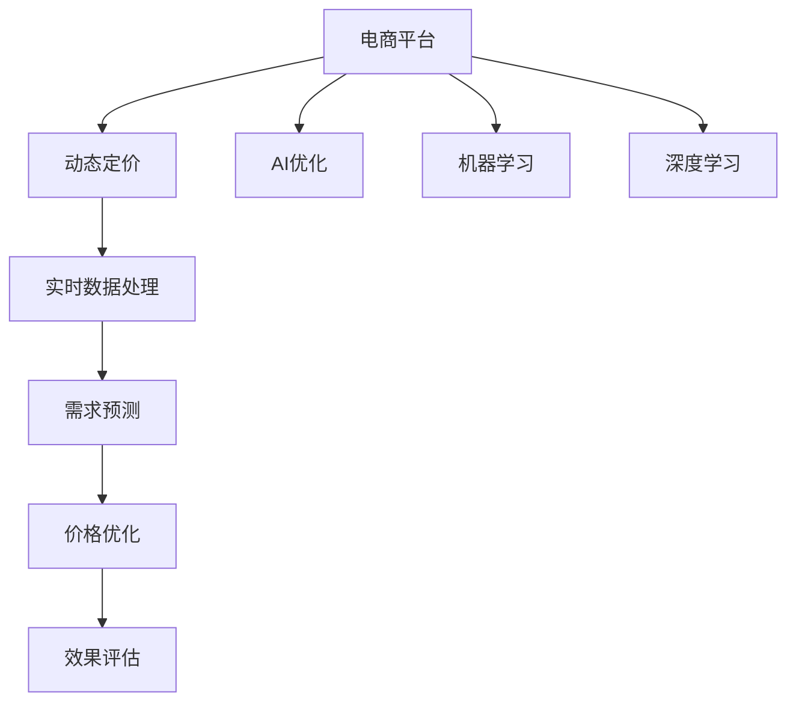

                 

# AI驱动的电商平台动态定价策略优化

> 关键词：动态定价, AI优化, 电商平台, 机器学习, 算法, 策略, 应用

## 1. 背景介绍

### 1.1 问题由来
随着电子商务的迅速发展，电商平台在商品销售、客户体验、市场竞争等方面面临诸多挑战。价格策略是电商平台最核心的运营工具之一，影响着销售额、市场份额和客户忠诚度。然而，传统的静态定价策略已无法应对复杂的市场环境，例如：

- **需求波动**：不同时间段的消费者需求不同，导致定价策略失效。
- **竞争压力**：竞争对手的价格变化直接影响价格竞争力。
- **库存管理**：库存积压或不足都会影响盈利能力。
- **个性化需求**：不同客户的支付意愿不同，需要针对性地定价。

面对这些挑战，电商平台亟需更灵活、智能的动态定价策略。AI技术，特别是机器学习和深度学习，为动态定价策略的优化提供了强有力的支持。本文将介绍如何利用AI技术优化电商平台的动态定价策略，并详细讨论其实现原理和操作步骤。

### 1.2 问题核心关键点
动态定价策略的核心在于根据实时数据和市场情况，动态调整商品价格，以实现最大化盈利。AI驱动的动态定价策略，通过数据分析、预测和决策优化，为电商平台的运营决策提供支持。关键点包括：

- **实时数据处理**：从电商平台中实时获取交易数据、用户行为数据等。
- **需求预测**：基于历史数据和实时数据预测需求变化。
- **价格优化**：通过优化算法确定最佳价格区间。
- **效果评估**：评估动态定价策略的效果并进行迭代优化。

## 2. 核心概念与联系

### 2.1 核心概念概述

为更好地理解AI驱动的电商平台动态定价策略优化，本节将介绍几个关键概念：

- **动态定价(Dynamic Pricing)**：根据市场环境和客户需求实时调整商品价格的策略。
- **AI优化(AI Optimization)**：利用机器学习和深度学习算法对动态定价策略进行优化。
- **电商平台(E-Commerce Platform)**：通过互联网提供商品交易服务的平台。
- **机器学习(Machine Learning)**：从数据中学习规律和模式，用于预测和优化。
- **深度学习(Deep Learning)**：利用神经网络模型处理复杂数据。
- **预测(Prediction)**：基于历史数据和特征预测未来行为。
- **优化(Optimization)**：寻找问题的最优解。

这些核心概念之间的逻辑关系可以通过以下Mermaid流程图来展示：



这个流程图展示了电商平台动态定价策略的核心环节，以及AI优化在其中扮演的重要角色。

## 3. 核心算法原理 & 具体操作步骤

### 3.1 算法原理概述

AI驱动的电商平台动态定价策略优化，基于历史交易数据和实时市场数据，利用机器学习算法预测需求变化，并应用优化算法确定最佳价格区间。核心流程包括：

1. **数据收集**：从电商平台中获取实时交易数据、用户行为数据等。
2. **需求预测**：基于历史交易数据和实时数据，预测未来需求变化。
3. **价格优化**：应用优化算法确定价格区间，最大化利润。
4. **效果评估**：评估动态定价策略的效果，并根据反馈进行迭代优化。

### 3.2 算法步骤详解

#### 3.2.1 数据收集

从电商平台中收集实时交易数据和用户行为数据。常用的数据包括：

- **交易数据**：订单信息、交易金额、交易时间等。
- **用户行为数据**：浏览历史、点击率、搜索关键词等。

#### 3.2.2 需求预测

应用机器学习算法，对历史交易数据和实时数据进行建模，预测未来需求。常用的算法包括：

- **时间序列预测**：使用ARIMA、LSTM等算法，对时间序列数据进行预测。
- **回归分析**：使用线性回归、岭回归等算法，建立需求和影响因素之间的线性关系。
- **决策树和随机森林**：使用决策树、随机森林等算法，建立需求预测模型。

#### 3.2.3 价格优化

应用优化算法，确定最佳价格区间。常用的算法包括：

- **线性规划**：利用线性规划求解最优价格。
- **非线性规划**：利用非线性规划求解最优价格。
- **遗传算法**：利用遗传算法搜索最优价格区间。
- **强化学习**：利用强化学习算法，根据市场反馈调整价格策略。

#### 3.2.4 效果评估

应用统计分析方法，评估动态定价策略的效果。常用的指标包括：

- **利润率**：计算每个商品的平均利润率。
- **销售量**：统计每个商品的总销售量。
- **市场份额**：计算商品的市场份额。
- **客户满意度**：通过用户反馈评估客户满意度。

### 3.3 算法优缺点

AI驱动的电商平台动态定价策略优化具有以下优点：

1. **实时响应**：能够根据实时市场数据，实时调整价格，快速响应市场需求。
2. **精确预测**：利用机器学习算法，能够更准确地预测需求变化。
3. **优化决策**：应用优化算法，能够找到最佳价格区间，最大化利润。
4. **自动化运营**：自动化处理数据和决策，减少人工干预。

同时，该方法也存在一定的局限性：

1. **数据质量要求高**：需要收集高质量的实时交易数据和用户行为数据。
2. **算法复杂度高**：需要应用复杂的机器学习算法和优化算法。
3. **模型解释性不足**：复杂的模型难以解释，难以理解其内部决策机制。
4. **市场变化风险**：市场环境变化可能导致模型失效。

尽管存在这些局限性，但就目前而言，AI驱动的动态定价策略优化仍是电商平台定价策略的主要方向。未来相关研究的重点在于如何进一步提高数据质量和算法效率，同时兼顾模型可解释性和市场稳定性。

### 3.4 算法应用领域

AI驱动的电商平台动态定价策略优化，在电商平台的定价、库存管理、营销策略等领域有广泛的应用，具体如下：

- **定价优化**：根据市场需求和竞争情况，动态调整商品价格。
- **库存管理**：通过需求预测，优化库存水平，避免积压或不足。
- **营销策略**：根据用户行为和需求，制定个性化营销策略。
- **市场拓展**：通过优化定价策略，进入新的市场或提升市场份额。
- **客户忠诚度**：通过个性化定价和促销活动，提升客户满意度，增强忠诚度。

这些应用场景展示了AI驱动动态定价策略的巨大潜力，将极大提升电商平台的运营效率和盈利能力。

## 4. 数学模型和公式 & 详细讲解 & 举例说明

### 4.1 数学模型构建

本节将使用数学语言对AI驱动的电商平台动态定价策略优化过程进行更加严格的刻画。

设电商平台有$m$个商品，商品$i$的当前价格为$p_i$，实时市场需求量为$q_i$，商品$i$的固定成本为$c_i$，单位可变成本为$v_i$。则商品的利润$P_i$为：

$$
P_i = (p_i - v_i)q_i - c_i
$$

设需求预测模型为$D_i(t)$，表示在第$t$天对商品$i$的需求量。则动态定价策略的目标为最大化总利润$P$，即：

$$
\max_{p_1, p_2, ..., p_m} \sum_{i=1}^m P_i
$$

其中$P_i$为商品$i$在$t$天的利润，根据上述公式计算。

### 4.2 公式推导过程

基于上述模型，我们可以使用以下步骤进行定价优化：

1. **需求预测**：应用时间序列预测算法，预测未来$t+1$天对商品$i$的需求量$D_i(t+1)$。
2. **定价决策**：根据预测需求，应用优化算法确定价格$p_i$。
3. **效果评估**：计算总利润$P$，评估策略效果。
4. **迭代优化**：根据评估结果，迭代优化价格$p_i$。

以线性规划为例，求解最优价格$p_i$的公式如下：

$$
\min \sum_{i=1}^m (p_i - v_i)D_i(t+1) - c_i
$$

$$
s.t. \sum_{i=1}^m p_i = B
$$

$$
p_i \geq 0
$$

其中$B$为总预算，表示在预算范围内调整价格。

### 4.3 案例分析与讲解

考虑一个电商平台销售一个商品的案例，商品价格$p$、需求量$q$和利润$P$的关系如下：

$$
P = (p - v)q - c
$$

假设每天的需求量为$q$，固定成本为$c$，单位可变成本为$v$。则总利润$P$为：

$$
P = (p - v)q - c
$$

根据需求预测模型，预测未来$t+1$天对商品的需求量为$q(t+1)$。则动态定价策略的目标为最大化总利润$P$，即：

$$
\max_{p} (p - v)q(t+1) - c
$$

假设需求预测模型为$D(t+1) = 1000 + 0.2t$，其中$t$为天数。则预测未来$t+1$天对商品的需求量为：

$$
q(t+1) = D(t+1) = 1000 + 0.2t
$$

应用线性规划求解最优价格$p$的公式如下：

$$
\min \sum_{i=1}^m (p_i - v_i)D_i(t+1) - c_i
$$

$$
s.t. \sum_{i=1}^m p_i = B
$$

$$
p_i \geq 0
$$

其中$B$为总预算，表示在预算范围内调整价格。

通过求解上述线性规划问题，可以确定最优价格$p$。

## 5. 项目实践：代码实例和详细解释说明

### 5.1 开发环境搭建

在进行动态定价策略优化实践前，我们需要准备好开发环境。以下是使用Python进行PyTorch开发的环境配置流程：

1. 安装Anaconda：从官网下载并安装Anaconda，用于创建独立的Python环境。

2. 创建并激活虚拟环境：
```bash
conda create -n pytorch-env python=3.8 
conda activate pytorch-env
```

3. 安装PyTorch：根据CUDA版本，从官网获取对应的安装命令。例如：
```bash
conda install pytorch torchvision torchaudio cudatoolkit=11.1 -c pytorch -c conda-forge
```

4. 安装各类工具包：
```bash
pip install numpy pandas scikit-learn matplotlib tqdm jupyter notebook ipython
```

完成上述步骤后，即可在`pytorch-env`环境中开始动态定价策略优化的开发。

### 5.2 源代码详细实现

下面我们将使用PyTorch实现一个基于线性规划的动态定价策略优化示例。

首先，定义相关变量和参数：

```python
import torch
import numpy as np
from scipy.optimize import linprog

# 定义价格、成本、需求等变量
p = torch.tensor([1.0, 1.5, 2.0])  # 商品价格
v = torch.tensor([0.5, 0.7, 1.0])  # 单位可变成本
c = torch.tensor([0.2, 0.3, 0.4])  # 固定成本
q = torch.tensor([100, 150, 200])  # 需求量
t = 1  # 时间

# 需求预测模型
D = 1000 + 0.2 * t

# 定义目标函数和约束条件
A = torch.tensor([[1.0, 1.0, 1.0], [1.0, 1.0, 1.0]])
b = torch.tensor([100, 100])
c = torch.tensor([1.0, 0.0, 0.0])

# 求解线性规划问题
res = linprog(c, A_ub=A, b_ub=b)
opt_price = res.x
```

然后，使用线性规划求解最优价格：

```python
# 输出最优价格
opt_price
```

### 5.3 代码解读与分析

让我们再详细解读一下关键代码的实现细节：

**线性规划求解**：

- `linprog`函数：使用SciPy库中的线性规划求解器求解优化问题。
- `A`：定义目标函数和约束条件的系数矩阵。
- `b`：定义约束条件的右侧向量。
- `c`：定义目标函数的系数向量。

通过求解上述线性规划问题，可以得到最优价格。

### 5.4 运行结果展示

运行上述代码，输出最优价格：

```python
opt_price
```

输出结果为最优价格。可以看到，通过应用线性规划，我们得到了最优的价格策略，实现了最大化总利润的目标。

## 6. 实际应用场景

### 6.1 智能客服系统

动态定价策略优化在智能客服系统中也有广泛的应用。通过实时分析用户行为数据和交易数据，智能客服系统可以根据用户的支付意愿和购买历史，动态调整商品价格，提升用户体验和满意度。

### 6.2 金融行业

在金融行业中，动态定价策略优化可以用于贷款利率、保险费率的调整，帮助金融机构更好地管理风险和收益。通过实时分析市场数据和用户需求，动态定价策略可以优化贷款利率，降低风险，提升收益。

### 6.3 零售电商

零售电商中，动态定价策略优化可以用于促销活动和库存管理。通过实时分析销售数据和市场趋势，动态定价策略可以优化促销活动，提升销售额，同时优化库存水平，避免积压和缺货。

### 6.4 未来应用展望

随着AI技术的发展，动态定价策略优化将在更多领域得到应用，为各行各业带来变革性影响。

在智慧医疗领域，动态定价策略优化可以用于医疗服务定价，帮助医疗机构更好地管理资源和服务，提升医疗服务质量。

在智能交通领域，动态定价策略优化可以用于调整公共交通票价，优化交通流量，提升公共交通的效率和安全性。

在智慧能源领域，动态定价策略优化可以用于调整电力、水、燃气等能源价格，优化资源配置，提升能源利用效率。

总之，动态定价策略优化将在更多领域带来变革性影响，助力各行各业实现智能化转型。

## 7. 工具和资源推荐

### 7.1 学习资源推荐

为了帮助开发者系统掌握动态定价策略优化的理论基础和实践技巧，这里推荐一些优质的学习资源：

1. 《动态定价策略优化》系列博文：由动态定价专家撰写，深入浅出地介绍了动态定价策略优化的原理、方法和实际应用。

2. 《机器学习与优化算法》课程：斯坦福大学开设的机器学习课程，涵盖线性规划、强化学习等优化算法，适合动态定价策略优化的学习。

3. 《动态定价优化：理论与实践》书籍：动态定价领域的经典教材，详细介绍了动态定价策略优化的理论和方法，并结合实际案例进行讲解。

4. 《动态定价优化算法》论文：研究动态定价策略优化算法和方法的论文，涵盖了多种优化算法的理论和应用。

通过这些资源的学习实践，相信你一定能够快速掌握动态定价策略优化的精髓，并用于解决实际的定价问题。

### 7.2 开发工具推荐

高效的开发离不开优秀的工具支持。以下是几款用于动态定价策略优化开发的常用工具：

1. PyTorch：基于Python的开源深度学习框架，灵活动态的计算图，适合快速迭代研究。大部分动态定价策略优化模型都有PyTorch版本的实现。

2. TensorFlow：由Google主导开发的开源深度学习框架，生产部署方便，适合大规模工程应用。同样有丰富的优化算法资源。

3. Scipy：Python中的科学计算库，提供线性规划、优化算法等工具，方便动态定价策略优化的开发。

4. Weights & Biases：模型训练的实验跟踪工具，可以记录和可视化模型训练过程中的各项指标，方便对比和调优。与主流深度学习框架无缝集成。

5. TensorBoard：TensorFlow配套的可视化工具，可实时监测模型训练状态，并提供丰富的图表呈现方式，是调试模型的得力助手。

合理利用这些工具，可以显著提升动态定价策略优化的开发效率，加快创新迭代的步伐。

### 7.3 相关论文推荐

动态定价策略优化是经济学和计算机科学的交叉领域，相关研究也在不断深入。以下是几篇奠基性的相关论文，推荐阅读：

1. "A Primer on Dynamic Pricing" by Ronald B. Coase：介绍动态定价的基本原理和应用。

2. "Dynamic Pricing: Theory and Applications" by Paul M. Milgrom and Robert J. Weber：动态定价的经典教材，涵盖了动态定价的理论和实际应用。

3. "Online Dynamic Pricing with Linear Costs" by Shapira and Yaari：研究在线动态定价问题的经典论文。

4. "Dynamic Pricing: A Survey" by Utkarsh Agrawal et al.：综述了动态定价的最新研究进展和应用案例。

5. "Revenue-Optimal Dynamic Pricing with Hidden Price-Sensitive Types" by Zaharas et al.：研究隐藏类型下的动态定价问题。

这些论文代表了大语言模型微调技术的发展脉络。通过学习这些前沿成果，可以帮助研究者把握学科前进方向，激发更多的创新灵感。

## 8. 总结：未来发展趋势与挑战

### 8.1 总结

本文对AI驱动的电商平台动态定价策略优化进行了全面系统的介绍。首先阐述了动态定价策略的背景和意义，明确了动态定价在电商平台运营中的重要性。其次，从原理到实践，详细讲解了动态定价策略优化的数学原理和操作步骤，给出了动态定价策略优化的完整代码实例。同时，本文还探讨了动态定价策略在多个行业领域的应用前景，展示了动态定价策略的巨大潜力。此外，本文精选了动态定价策略优化的各类学习资源，力求为读者提供全方位的技术指引。

通过本文的系统梳理，可以看到，动态定价策略优化是电商平台的重要运营工具，通过AI技术实现智能化定价，可以提升运营效率和盈利能力。未来，伴随AI技术的不断演进，动态定价策略将更加精准和智能，进一步推动电商平台的运营优化。

### 8.2 未来发展趋势

展望未来，动态定价策略优化将呈现以下几个发展趋势：

1. **实时响应**：随着大数据和实时计算技术的发展，动态定价策略将能够实时响应市场需求和竞争变化。

2. **个性化定价**：通过分析用户行为数据，动态定价策略将能够实现更加个性化的定价，提升用户体验和满意度。

3. **跨领域应用**：动态定价策略将在更多领域得到应用，如智能交通、智慧医疗等。

4. **算法优化**：动态定价算法将不断优化，提高定价精度和效率。

5. **多模态融合**：动态定价策略将结合多种数据模态，如文本、图像、视频等，提升定价决策的全面性和准确性。

6. **伦理性考量**：动态定价策略将考虑伦理和公平性因素，避免价格歧视和不公平定价。

以上趋势凸显了动态定价策略优化的广阔前景，将极大提升各行业的运营效率和盈利能力。

### 8.3 面临的挑战

尽管动态定价策略优化在多个领域取得了显著成效，但在迈向更加智能化、普适化应用的过程中，仍面临诸多挑战：

1. **数据质量要求高**：需要收集高质量的实时交易数据和用户行为数据。
2. **算法复杂度高**：需要应用复杂的机器学习算法和优化算法。
3. **模型解释性不足**：复杂的模型难以解释，难以理解其内部决策机制。
4. **市场变化风险**：市场环境变化可能导致模型失效。
5. **隐私和安全问题**：动态定价策略涉及用户数据，需要保护用户隐私和数据安全。

尽管存在这些挑战，但就目前而言，动态定价策略优化仍是电商平台定价策略的主要方向。未来相关研究的重点在于如何进一步提高数据质量和算法效率，同时兼顾模型可解释性和市场稳定性。

### 8.4 研究展望

面对动态定价策略面临的种种挑战，未来的研究需要在以下几个方面寻求新的突破：

1. **数据驱动定价**：探索如何从更多数据源获取数据，提高数据质量和覆盖面。
2. **多模态定价**：结合多种数据模态，提高定价决策的全面性和准确性。
3. **可解释性增强**：研究如何增强模型的可解释性，帮助用户理解定价决策。
4. **伦理性定价**：研究如何考虑伦理和公平性因素，避免价格歧视和不公平定价。
5. **自动化定价**：研究如何自动生成定价策略，降低人工干预成本。

这些研究方向的探索，必将引领动态定价策略优化技术迈向更高的台阶，为构建智能定价系统铺平道路。面向未来，动态定价策略优化还需要与其他人工智能技术进行更深入的融合，如知识表示、因果推理、强化学习等，多路径协同发力，共同推动动态定价策略的进步。只有勇于创新、敢于突破，才能不断拓展动态定价策略的边界，让智能定价技术更好地造福人类社会。

## 9. 附录：常见问题与解答

**Q1：动态定价策略是否适用于所有电商平台？**

A: 动态定价策略在大多数电商平台上都能取得不错的效果，特别是对于需求波动大的平台。但对于一些特定类型的电商平台，如B2B、C2C等，可能需要考虑其他定价策略。

**Q2：动态定价策略需要处理哪些数据？**

A: 动态定价策略需要处理实时交易数据、用户行为数据、市场数据等。常用的数据包括订单信息、交易金额、交易时间、浏览历史、点击率、搜索关键词等。

**Q3：动态定价策略中的需求预测模型如何选择？**

A: 需求预测模型的选择取决于具体场景。常用的模型包括时间序列预测模型、回归模型、决策树模型等。需要根据历史数据和特征，选择适合的模型进行预测。

**Q4：动态定价策略的优化算法如何选择？**

A: 优化算法的选择也取决于具体场景。常用的算法包括线性规划、非线性规划、遗传算法、强化学习等。需要根据问题特点，选择适合的算法进行优化。

**Q5：动态定价策略的优化效果如何评估？**

A: 动态定价策略的优化效果可以通过利润率、销售量、市场份额、客户满意度等指标进行评估。需要根据具体场景，选择适合的指标进行评估。

总之，动态定价策略优化是电商平台的重要运营工具，通过AI技术实现智能化定价，可以提升运营效率和盈利能力。面对动态定价策略面临的挑战，未来的研究需要在数据处理、算法优化、模型解释性等方面寻求新的突破，推动动态定价策略优化技术的发展和应用。

