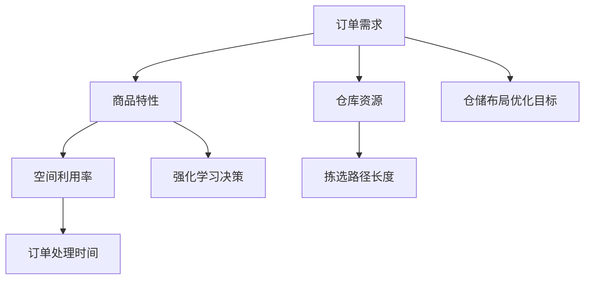

                 

# AI驱动的电商平台智能仓储布局优化

## 1. 背景介绍

随着电子商务的迅猛发展，电商平台对库存管理和物流配送的效率提出了更高的要求。传统的仓储布局优化往往依赖于人工经验和规则，难以适应复杂多变的商品和订单变化。而利用人工智能技术，特别是机器学习算法，可以对库存和物流数据进行深度挖掘，提出科学的仓储布局方案，显著提升运营效率。

本文旨在介绍一种基于强化学习的电商平台智能仓储布局优化方法。通过构建一个智能仓储布局模型，学习如何在给定仓储面积和订单需求的前提下，优化商品存储位置和拣选路径，以实现最佳的空间利用率和物流效率。

## 2. 核心概念与联系

### 2.1 核心概念概述

为更好地理解AI驱动的电商平台智能仓储布局优化方法，本节将介绍几个密切相关的核心概念：

- 强化学习(Reinforcement Learning, RL)：一种通过智能体与环境互动，优化决策策略的学习方法。智能体根据当前状态选择最优动作，环境给出奖惩信号，逐步调整策略，以实现目标。

- 仓储布局(Inventory Placement)：指在仓库内合理安排商品的位置，以提升存取效率、降低运营成本、加速订单处理。

- 拣选路径(Picking Path)：指在拣选商品时，从存储位置到订单位置的最优路径规划，以减少拣选时间、提升物流效率。

- 订单需求(Order Demand)：指在特定时间周期内，平台收到的订单数量和分布，是仓储布局和拣选路径优化的重要输入。

- 商品特性(Item Characteristics)：指商品的体积、重量、需求频率等，这些特性会影响仓储布局和拣选路径的制定。

- 仓库资源(Rock Resources)：指仓库的面积、高度、设备、人力等资源约束，是布局优化的关键因素。

- 目标函数(Objective Function)：用于度量布局优化的性能，常见的目标函数包括空间利用率、订单处理时间、拣选路径长度等。

这些核心概念之间的逻辑关系可以通过以下Mermaid流程图来展示：



这个流程图展示了这个系统的工作流程：

1. 从订单需求和商品特性出发，确定仓库资源和目标函数。
2. 通过强化学习算法，生成最优的仓储布局。
3. 在确定布局的基础上，生成最优的拣选路径。
4. 通过目标函数的综合评估，确定布局优化是否达到预期。

## 3. 核心算法原理 & 具体操作步骤

### 3.1 算法原理概述

基于强化学习的仓储布局优化，通过设计一个智能体和环境互动的闭环系统，逐步优化仓储布局策略。智能体通过与环境的互动，根据当前状态和目标函数，选择最优动作，环境则反馈奖惩信号，指导智能体的学习。

具体来说，智能体(仓储布局模型)在给定的订单需求、商品特性和仓库资源约束下，设计商品存储位置和拣选路径，使得目标函数最优。目标函数包括空间利用率、订单处理时间和拣选路径长度等，智能体通过探索和利用来逐步调整策略。

### 3.2 算法步骤详解

基于强化学习的仓储布局优化一般包括以下几个关键步骤：

**Step 1: 定义状态空间和动作空间**

- 状态空间(State Space)：包含当前订单需求、商品特性、仓库资源等变量，用于描述仓库当前的状态。
- 动作空间(Action Space)：包含各种可能的布局策略和拣选路径，如选择某商品存储位置或改变拣选顺序。

**Step 2: 设计奖惩函数**

- 奖惩函数(Reward Function)：根据目标函数设计奖惩信号，如空间利用率越高，给予奖励越大；拣选路径越短，给予奖励越大。

**Step 3: 确定环境反馈**

- 环境反馈(Environment Feedback)：智能体每执行一个动作，环境给出奖惩信号，作为下一步学习的指导。

**Step 4: 训练智能体**

- 使用基于值函数或策略函数的强化学习算法，如Q-Learning、SARSA、Deep Q Network等，训练智能体，使其能够从当前状态出发，选择最优动作。

**Step 5: 优化仓储布局**

- 将训练好的智能体应用于实际的仓库布局优化中，生成最优的仓储布局方案。

**Step 6: 路径规划与优化**

- 在确定最优布局的基础上，进一步优化拣选路径，以减少拣选时间和运输距离。

**Step 7: 持续学习和优化**

- 实时收集实际运营数据，持续训练和优化智能体，逐步提升布局和路径优化效果。

### 3.3 算法优缺点

基于强化学习的仓储布局优化方法具有以下优点：

1. 动态适应性强：能够根据实时变化的需求和资源进行调整，灵活应对订单高峰和商品更新。
2. 优化效果显著：通过智能体和环境的互动，逐步学习最优策略，显著提升空间利用率和物流效率。
3. 数据驱动：利用历史订单和物流数据进行训练，客观、科学地优化布局方案。
4. 可扩展性好：适用于不同规模和类型的仓库，可以通过扩展模型参数和环境复杂度来提升性能。

但该方法也存在一些局限性：

1. 学习过程较慢：强化学习需要大量的训练数据和迭代次数，时间成本较高。
2. 对初始数据依赖：训练结果高度依赖于初始数据的分布，不当的初始数据可能引入偏差。
3. 参数设置困难：强化学习算法的参数设置复杂，需要反复调整才能达到理想效果。
4. 泛化能力有限：优化策略可能过拟合于特定的训练数据集，难以泛化到新的环境。

尽管存在这些局限性，但就目前而言，强化学习仍然是仓储布局优化的主流方法之一。未来相关研究的重点在于如何进一步加快学习速度，优化参数设置，增强泛化能力，以及与更多实际场景结合。

### 3.4 算法应用领域

基于强化学习的仓储布局优化方法，已在电商、物流、仓储等多个领域得到应用，为企业的供应链管理提供了有力支持：

- 电商平台的库存管理：通过优化商品存储位置，提升库存周转率，降低缺货率。
- 物流公司的配送中心：通过优化拣选路径，减少物流成本，加速订单处理。
- 制造业的智能仓库：通过优化布局和路径，提升生产效率，降低生产成本。
- 零售行业的货架管理：通过优化货架布局，提升商品可访问性，增加客户满意度。

除了这些经典应用外，基于强化学习的仓储布局优化方法还被创新性地应用到更多场景中，如智能配送柜、自动化仓储机器人等，为物流和仓储技术带来了全新的突破。随着强化学习算法的发展，相信在仓储布局优化领域，AI技术还将发挥更大的作用。

## 4. 数学模型和公式 & 详细讲解 & 举例说明

### 4.1 数学模型构建

本节将使用数学语言对基于强化学习的仓储布局优化过程进行更加严格的刻画。

设智能体在状态 $s$ 时，执行动作 $a$，获取奖励 $r$，环境状态转换为 $s'$。智能体的目标是最大化累计奖励：

$$
\max_{\pi} \sum_{t=0}^{\infty} \gamma^t r_t
$$

其中 $\pi$ 为智能体的策略，$r_t$ 为第 $t$ 步的奖励，$\gamma$ 为折扣因子，通常取 0.9 到 0.99 之间。

### 4.2 公式推导过程

以下我们以优化空间利用率为目标，推导强化学习模型的具体形式。

假设智能体在每个位置存储 $n$ 个单位商品，仓库总面积为 $W$，单位面积的商品存储密度为 $\rho$，目标是最大化空间利用率 $U$：

$$
U = \frac{n \cdot \text{商品体积}}{W}
$$

将空间利用率 $U$ 作为奖励函数 $R$，智能体的目标为最大化累计奖励：

$$
\max_{\pi} \sum_{t=0}^{\infty} \gamma^t R_t
$$

智能体的策略 $\pi$ 可以表示为动作 $a$ 的选择概率，即：

$$
\pi(a|s) = P(a|s) = \frac{e^{Q_\theta(s,a)}}{\sum_{a'} e^{Q_\theta(s,a')}}, \quad Q_\theta(s,a) = \theta^T \phi(s,a)
$$

其中 $\phi(s,a)$ 为状态动作表示器，$Q_\theta(s,a)$ 为动作值函数，$\theta$ 为模型参数。

通过值迭代或策略迭代等强化学习算法，求解最优策略 $\pi^*$ 和动作值函数 $Q^*$。

### 4.3 案例分析与讲解

假设有一个仓库，总面积为 $W=100m^2$，存储5种商品，每件商品体积为 $V=0.1m^3$，重量为 $w=10kg$，需求频率为 $f=5/day$。仓库有一个拣选区，需要按照订单需求快速取出商品。

- **Step 1: 定义状态和动作**

  - 状态 $s$：包含当前订单需求 $d$，每种商品的需求量 $n_i$，每种商品的位置 $p_i$，拣选区的空闲位置 $p_r$。
  - 动作 $a$：包括选择存储位置、调整拣选路径等。

- **Step 2: 设计奖惩函数**

  - 奖励函数 $R$：空间利用率 $U$，订单处理时间 $T$，拣选路径长度 $L$。

- **Step 3: 训练智能体**

  - 使用深度强化学习算法，如DQN、DDPG等，训练智能体，使其能够从当前状态出发，选择最优动作。

- **Step 4: 优化仓储布局**

  - 将训练好的智能体应用于实际的仓库布局优化中，生成最优的仓储布局方案。

- **Step 5: 路径规划与优化**

  - 在确定最优布局的基础上，进一步优化拣选路径，以减少拣选时间和运输距离。

## 5. 项目实践：代码实例和详细解释说明

### 5.1 开发环境搭建

在进行仓储布局优化实践前，我们需要准备好开发环境。以下是使用Python进行强化学习开发的环境配置流程：

1. 安装Anaconda：从官网下载并安装Anaconda，用于创建独立的Python环境。

2. 创建并激活虚拟环境：
```bash
conda create -n reinforcement-env python=3.8 
conda activate reinforcement-env
```

3. 安装相关库：
```bash
pip install gym stable-baselines3 tensorboard
```

4. 安装PyTorch：
```bash
pip install torch torchvision torchaudio
```

完成上述步骤后，即可在`reinforcement-env`环境中开始强化学习实践。

### 5.2 源代码详细实现

我们以DQN算法为例，实现一个简单的仓库布局优化模型。以下是关键代码实现：

```python
import gym
import torch
import numpy as np
import torch.nn as nn
import torch.optim as optim

# 定义仓库状态和动作空间
class Inventory(gym.Env):
    def __init__(self, num_items=5, num_locations=10):
        self.num_items = num_items
        self.num_locations = num_locations
        self.state_size = num_items * num_locations
        self.action_size = num_locations

    def step(self, action):
        next_state = self.state.copy()
        reward = 0
        done = False
        for i in range(self.num_items):
            loc = action[i]
            if loc >= 0 and loc < self.num_locations:
                next_state[i * self.num_locations + loc] = 0
                next_state[i * self.num_locations + self.num_locations] = 1
                reward += 1
            else:
                done = True
        return next_state, reward, done, {}

    def reset(self):
        self.state = np.zeros((self.num_items, self.num_locations))
        return self.state

    def render(self):
        pass

# 定义动作值网络
class QNetwork(nn.Module):
    def __init__(self, state_size, action_size):
        super(QNetwork, self).__init__()
        self.fc1 = nn.Linear(state_size, 64)
        self.fc2 = nn.Linear(64, 64)
        self.fc3 = nn.Linear(64, action_size)

    def forward(self, x):
        x = F.relu(self.fc1(x))
        x = F.relu(self.fc2(x))
        return self.fc3(x)

# 定义强化学习训练函数
def train(env, model, optimizer, num_episodes=1000, epsilon=0.1):
    state = env.reset()
    for episode in range(num_episodes):
        action_probs = np.random.uniform(0, 1, env.action_size)
        epsilon = 0.1
        for t in range(200):
            action = np.random.choice(env.action_size, p=action_probs)
            next_state, reward, done, _ = env.step(action)
            target = reward + 0.99 * np.amax(model(next_state).cpu().data.numpy()[0])
            target_q = model(torch.tensor(state)).cpu().data.numpy()[0]
            target_q[action] = target
            optimizer.zero_grad()
            loss = nn.functional.mse_loss(torch.tensor(target_q), torch.tensor(target_q))
            loss.backward()
            optimizer.step()
            state = next_state
            action_probs = epsilon * np.random.uniform(0, 1, env.action_size) + (1-epsilon) * target_q / np.sum(target_q)
        env.render()
```

### 5.3 代码解读与分析

让我们再详细解读一下关键代码的实现细节：

**Inventory类**：
- `__init__`方法：初始化商品数和位置数，定义状态和动作空间。
- `step`方法：执行一个动作，更新状态和奖励。
- `reset`方法：重置状态。
- `render`方法：可视化展示状态。

**QNetwork类**：
- `__init__`方法：定义神经网络的结构，包含三个全连接层。
- `forward`方法：实现前向传播计算动作值。

**train函数**：
- 训练函数，使用DQN算法更新模型参数。
- `state`：初始化状态。
- `action_probs`：动作选择策略，利用epsilon-greedy策略。
- `target`：计算目标动作值。
- `loss`：计算损失，使用均方误差作为优化目标。

**训练流程**：
- 通过`train`函数，循环迭代训练模型。
- 每个epoch内，随机选择一个动作，并根据当前状态计算目标动作值。
- 计算模型输出与目标动作值的误差，使用均方误差损失进行优化。
- 每个epoch结束后，可视化展示训练结果。

## 6. 实际应用场景

### 6.1 智能仓储布局优化

通过基于强化学习的智能仓储布局优化，电商平台可以实现更加高效的库存管理和物流配送：

- **智能库位规划**：在订单需求波动时，智能布局能够自动调整商品存储位置，最大化空间利用率，减少缺货和库存积压。
- **拣选路径优化**：根据商品特性和订单需求，生成最优拣选路径，减少拣选时间和物流成本。
- **实时动态调整**：实时采集订单和库存数据，智能布局能够动态调整策略，适应变化的需求和资源。

### 6.2 供应链优化

基于强化学习的仓储布局优化方法，可以应用于更广阔的供应链优化中：

- **库存预测**：结合历史订单和需求变化，智能布局能够预测未来的库存需求，优化库存策略。
- **物流调度**：根据订单需求和物流资源，智能布局能够优化物流路径和调度，减少运输时间和成本。
- **多仓库协同**：在多仓库环境下，智能布局能够协调各个仓库的布局和物流，实现全局优化。

### 6.3 工业制造

在工业制造领域，智能布局优化同样具有重要应用价值：

- **生产效率提升**：通过优化生产线的布局和路径，提升生产效率，降低生产成本。
- **物料管理**：合理规划物料存储位置，减少物料查找和搬运时间，提高生产效率。
- **质量控制**：智能布局能够优化生产环境，减少人为操作失误，提升产品质量。

## 7. 工具和资源推荐

### 7.1 学习资源推荐

为了帮助开发者系统掌握强化学习的仓储布局优化理论基础和实践技巧，这里推荐一些优质的学习资源：

1. 《Reinforcement Learning: An Introduction》书籍：由Richard S. Sutton和Andrew G. Barto合著，全面介绍了强化学习的理论和实践，是学习强化学习的重要参考。

2. Coursera《Reinforcement Learning》课程：由David Silver讲授，介绍了强化学习的原理和算法，有详细的理论推导和实验案例。

3. OpenAI Gym环境库：提供了丰富的环境和算法实现，是学习强化学习算法的重要工具。

4. PyTorch官方文档：提供了详细的TensorFlow实现和案例，适合强化学习算法的实践。

5. DeepMind论文库：包含了最新的强化学习论文和代码，是了解前沿研究的重要渠道。

通过对这些资源的学习实践，相信你一定能够快速掌握强化学习仓储布局优化的精髓，并用于解决实际的仓储优化问题。

### 7.2 开发工具推荐

高效的开发离不开优秀的工具支持。以下是几款用于强化学习开发的常用工具：

1. PyTorch：基于Python的开源深度学习框架，灵活动态的计算图，适合快速迭代研究。

2. TensorFlow：由Google主导开发的开源深度学习框架，生产部署方便，适合大规模工程应用。

3. Gym：OpenAI提供的强化学习环境库，提供了丰富的环境和算法实现，是强化学习开发的重要工具。

4. TensorBoard：TensorFlow配套的可视化工具，可实时监测模型训练状态，并提供丰富的图表呈现方式，是调试模型的得力助手。

5. Weights & Biases：模型训练的实验跟踪工具，可以记录和可视化模型训练过程中的各项指标，方便对比和调优。

合理利用这些工具，可以显著提升强化学习仓储布局优化的开发效率，加快创新迭代的步伐。

### 7.3 相关论文推荐

强化学习仓储布局优化技术的发展源于学界的持续研究。以下是几篇奠基性的相关论文，推荐阅读：

1. Q-Learning：DeepMind的论文，提出了一种基于Q函数的强化学习算法，广泛应用于多种游戏和环境优化中。

2. DQN：DeepMind的论文，提出了一种基于深度神经网络的强化学习算法，实现了突破性的智能下棋算法。

3. PPO：OpenAI的论文，提出了一种基于策略梯度的强化学习算法，实现了高效的策略优化。

4. SAC：OpenAI的论文，提出了一种基于策略梯度和值函数的双重学习算法，实现了高效率的策略优化和值函数估计。

5. Rainbow：OpenAI的论文，结合了多种强化学习算法的优点，实现了更加高效的策略优化和值函数估计。

这些论文代表了大强化学习仓储布局优化技术的发展脉络。通过学习这些前沿成果，可以帮助研究者把握学科前进方向，激发更多的创新灵感。

## 8. 总结：未来发展趋势与挑战

### 8.1 总结

本文对基于强化学习的电商平台智能仓储布局优化方法进行了全面系统的介绍。首先阐述了强化学习在仓储布局优化中的重要应用，明确了布局优化的关键目标和步骤。其次，从原理到实践，详细讲解了强化学习的数学模型和算法步骤，给出了具体的代码实现和解释。同时，本文还广泛探讨了强化学习在仓储、供应链、工业制造等多个领域的应用前景，展示了其强大的优化能力。

通过本文的系统梳理，可以看到，强化学习在仓储布局优化中的巨大潜力，能够显著提升仓储和物流的效率和成本控制能力，推动供应链管理的数字化转型。未来，伴随强化学习算法的发展，布局优化技术将在更广泛的领域得到应用，为经济发展带来新的动力。

### 8.2 未来发展趋势

展望未来，强化学习在仓储布局优化领域将呈现以下几个发展趋势：

1. 模型复杂度提升：随着算力成本的下降和深度学习技术的发展，强化学习模型的复杂度将进一步提升，支持更加精细的布局优化。

2. 多目标优化：未来的布局优化将不仅考虑空间利用率和物流效率，还可能同时考虑环境影响、成本效益等多重目标，实现更综合的优化。

3. 实时动态优化：随着物联网和大数据技术的应用，实时采集和处理仓库数据将变得更加高效，智能布局能够实现更灵活的动态优化。

4. 多智能体协同：在复杂多仓库环境下，通过多智能体的协同优化，可以实现更高效的资源分配和布局管理。

5. 混合优化：结合模拟优化和强化学习的优点，实现更加高效、准确的布局优化。

以上趋势凸显了强化学习在仓储布局优化中的广阔前景。这些方向的探索发展，必将进一步提升仓库运营的智能化水平，为企业的供应链管理提供有力支持。

### 8.3 面临的挑战

尽管强化学习在仓储布局优化中已经取得了显著进展，但在迈向更加智能化、普适化应用的过程中，它仍面临诸多挑战：

1. 数据采集成本高：实时采集和处理仓库数据需要大量的传感器和设备，成本较高。如何降低数据采集成本，提高数据质量，是实现实时优化的重要难题。

2. 模型复杂度增加：随着模型复杂度的提升，训练和优化过程变得更加复杂，计算资源需求增加。如何平衡模型复杂度和计算资源，实现高效的优化，还需要更多的探索。

3. 环境变化适应性：强化学习模型需要根据环境变化进行动态调整，但在快速变化的环境下，模型学习过程可能受到干扰，影响优化效果。

4. 多目标优化困难：同时优化多个目标时，不同目标之间的冲突可能导致策略难以兼顾。如何平衡多个目标，实现综合最优，是优化中的一个难点。

5. 可解释性不足：强化学习模型通常是"黑盒"系统，难以解释其内部工作机制和决策逻辑。对于关键生产系统，可解释性和可审计性尤为重要。

这些挑战亟需突破，以确保强化学习在仓储布局优化中的广泛应用。未来相关研究需要在数据采集、模型优化、多目标优化、可解释性等方面进行深入探索，逐步解决这些难题。

### 8.4 研究展望

面对强化学习在仓储布局优化中所面临的种种挑战，未来的研究需要在以下几个方面寻求新的突破：

1. 开发混合优化方法：结合模拟优化和强化学习的优点，实现更加高效、准确的布局优化。

2. 探索无监督学习：在缺少标注数据的情况下，探索无监督学习和半监督学习方法，实现更加灵活、高效的布局优化。

3. 研究多智能体协同优化：在复杂多仓库环境下，通过多智能体的协同优化，实现更高效的资源分配和布局管理。

4. 引入因果推断：通过因果推断方法，分析决策因果关系，增强优化策略的可解释性和稳定性。

5. 考虑伦理和道德因素：在布局优化过程中，考虑环境影响和社会责任，确保布局优化符合伦理和道德标准。

6. 提高模型泛化能力：通过更多的环境实验和数据集测试，提高模型的泛化能力，实现跨场景的布局优化。

这些研究方向将引领强化学习在仓储布局优化技术迈向更高的台阶，为构建高效、智能的仓储系统提供有力支持。面向未来，强化学习将在仓储布局优化领域发挥更大的作用，推动供应链管理的数字化转型和智能化升级。

## 9. 附录：常见问题与解答

**Q1：强化学习如何应对仓库环境的变化？**

A: 强化学习在应对仓库环境变化时，需要不断收集实时数据，并根据环境变化调整模型策略。具体措施包括：
1. 实时数据采集：使用物联网设备实时采集仓库环境数据，如温度、湿度、库存水平等。
2. 动态模型训练：利用实时数据更新模型参数，使其能够快速适应环境变化。
3. 自适应算法：使用自适应强化学习算法，根据环境变化动态调整学习参数，如学习率、折扣因子等。

**Q2：如何在多仓库环境下进行布局优化？**

A: 在多仓库环境下，可以通过多智能体协同优化实现全局布局优化。具体措施包括：
1. 分布式智能体：在每个仓库中独立部署智能体，实现局部优化。
2. 通信机制：在智能体之间建立通信机制，共享状态和目标函数，实现全局协同。
3. 分布式训练：在多台计算设备上并行训练模型，加速优化过程。

**Q3：如何评估强化学习模型的优化效果？**

A: 评估强化学习模型的优化效果，需要综合考虑多个指标：
1. 空间利用率：衡量存储位置的利用效率，如仓库利用率、货架占用率等。
2. 拣选路径长度：衡量拣选过程的物流效率，如订单处理时间、运输距离等。
3. 成本效益：衡量优化效果对经济收益的影响，如减少的物流成本、提高的生产效率等。
4. 实时响应：衡量模型对实时变化的适应能力，如环境变化时的策略调整速度。

**Q4：如何提高强化学习模型的可解释性？**

A: 提高强化学习模型的可解释性，可以从以下几个方面入手：
1. 模型可视化：利用可视化工具，如TensorBoard，展示模型状态和决策过程。
2. 特征重要性分析：分析模型决策中的关键特征，解释决策依据。
3. 因果推断：通过因果推断方法，分析决策因果关系，提高模型可解释性。

**Q5：强化学习模型如何处理大规模数据？**

A: 强化学习模型处理大规模数据时，需要考虑以下几个问题：
1. 数据分块：将大规模数据分块处理，提高计算效率。
2. 分布式计算：利用分布式计算框架，如Spark、Hadoop等，加速模型训练和优化。
3. 内存管理：优化内存管理策略，避免内存溢出和计算资源浪费。

这些问题的解决，将有助于强化学习模型在处理大规模数据时，保持高效和稳定。

通过上述系统介绍和分析，相信你对基于强化学习的电商平台智能仓储布局优化方法有了更深入的理解。掌握这一方法，将有助于提升仓库运营效率，降低物流成本，提高客户满意度，推动供应链管理的数字化转型。希望本文能够为你的实践和研究提供有价值的参考和指导。

---

作者：禅与计算机程序设计艺术 / Zen and the Art of Computer Programming

