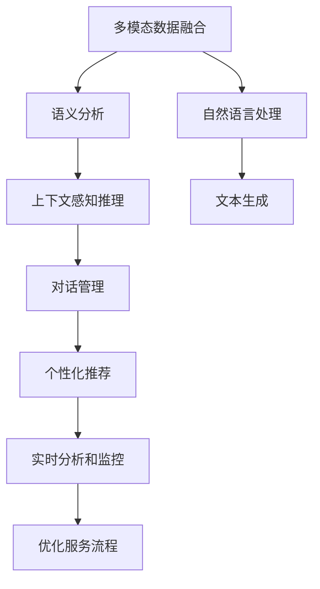

                 

## 1. 背景介绍

### 1.1 问题由来

在电子商务的迅速发展过程中，如何为客户提供高效、个性化、智能的客户服务，成为电商平台面临的一大挑战。传统客户服务依赖人工客服团队，存在响应速度慢、服务标准化程度低、员工流失率高、成本高等问题。近年来，随着人工智能技术的发展，AI驱动的客户服务系统开始大规模应用，成为电商企业提高客户满意度和运营效率的重要手段。

### 1.2 问题核心关键点

智能客户服务系统的核心在于，利用自然语言处理（NLP）和机器学习（ML）技术，构建能够自动理解和响应客户需求的系统。其关键点包括：

- **多模态数据融合**：结合客户历史交易记录、浏览行为、评论反馈等多维数据，提升系统对客户意图的理解。
- **上下文感知推理**：通过分析聊天记录、购物车内容、用户画像等上下文信息，提供更加精准的推荐和服务。
- **对话管理**：构建智能对话系统，实现与客户的自然语言交互，提升服务体验。
- **个性化定制**：根据客户偏好、消费历史等个性化信息，提供定制化服务和推荐。
- **实时分析与监控**：对客户服务数据进行实时分析和监控，优化服务流程和策略。

### 1.3 问题研究意义

构建AI驱动的电商智能客户服务系统，具有以下重要意义：

1. **提升客户满意度**：智能客服能够24小时不间断提供服务，响应速度快，处理复杂问题能力强。
2. **降低运营成本**：减少人工客服数量，节省人力成本，提高运营效率。
3. **增强品牌竞争力**：提供差异化的个性化服务，增强客户粘性，提升品牌忠诚度。
4. **优化供应链管理**：通过分析客户反馈和服务数据，优化商品推荐、库存管理等，提升供应链效率。
5. **促进创新**：智能客服系统的构建和优化，带动了NLP、ML等人工智能技术的发展，推动技术创新和应用落地。

## 2. 核心概念与联系

### 2.1 核心概念概述

构建智能客户服务系统涉及多个核心概念，包括：

- **自然语言处理（NLP）**：涉及文本处理、语义分析、文本生成等技术，是智能客服系统的核心能力之一。
- **机器学习（ML）**：利用监督学习、强化学习等技术，训练模型对客户需求进行预测和推荐。
- **多模态数据融合**：结合文本、语音、图像等多种数据源，提升对客户意图的全面理解。
- **对话管理**：构建对话系统，管理多轮对话，理解上下文信息，提供自然流畅的交互体验。
- **个性化推荐**：根据客户历史数据和行为模式，提供定制化的服务和产品推荐。
- **实时分析和监控**：对客户服务数据进行实时分析和监控，优化服务流程和策略。

### 2.2 核心概念原理和架构的 Mermaid 流程图



这个流程图展示了智能客服系统的核心组件和流程，各组件相互协作，共同构成了一个完整的客户服务解决方案。

## 3. 核心算法原理 & 具体操作步骤

### 3.1 算法原理概述

智能客服系统的构建，主要依赖于以下几个关键技术：

- **多模态数据融合**：通过文本、语音、图像等多种数据源，构建客户画像，提升对客户意图的理解。
- **上下文感知推理**：利用语义分析技术，结合上下文信息，推断客户需求和意图。
- **对话管理**：构建对话系统，管理多轮对话，理解客户意图，提供自然流畅的交互体验。
- **个性化推荐**：根据客户历史数据和行为模式，提供定制化的服务和产品推荐。
- **实时分析和监控**：对客户服务数据进行实时分析和监控，优化服务流程和策略。

### 3.2 算法步骤详解

**Step 1: 数据预处理**

- **数据收集**：收集客户历史交易记录、浏览行为、评论反馈、聊天记录等数据。
- **数据清洗**：去除噪声数据、不一致数据，确保数据质量。
- **特征提取**：将文本数据转化为数值特征，如词频、TF-IDF等。

**Step 2: 模型训练**

- **多模态数据融合**：将文本、语音、图像等多种数据源融合，构建客户画像。
- **上下文感知推理**：利用语义分析技术，结合上下文信息，推断客户需求和意图。
- **对话管理**：构建对话系统，管理多轮对话，理解客户意图，提供自然流畅的交互体验。
- **个性化推荐**：根据客户历史数据和行为模式，提供定制化的服务和产品推荐。
- **实时分析和监控**：对客户服务数据进行实时分析和监控，优化服务流程和策略。

**Step 3: 系统部署和优化**

- **系统集成**：将多模态数据融合、上下文感知推理、对话管理、个性化推荐和实时分析模块集成到电商平台上。
- **模型优化**：根据用户反馈和实时数据，不断优化模型，提升服务质量。
- **用户界面设计**：设计友好的用户界面，提升用户体验。

### 3.3 算法优缺点

智能客服系统的优点包括：

- **响应速度快**：AI客服能够24小时不间断提供服务，响应速度快。
- **服务质量高**：AI客服系统可以处理复杂问题，提升服务质量。
- **降低运营成本**：减少人工客服数量，节省人力成本。
- **提升客户满意度**：提供个性化、定制化的服务，提升客户满意度。

缺点包括：

- **初始投入高**：构建智能客服系统需要大量的数据和计算资源。
- **准确率有限**：初期模型可能存在误判，需要持续优化。
- **用户信任度低**：部分用户可能对AI客服系统存在不信任感。
- **缺乏人情味**：AI客服无法处理一些复杂的情感问题。

### 3.4 算法应用领域

智能客服系统广泛应用于电商、金融、医疗、教育等多个领域，具体应用包括：

- **电商客户服务**：智能客服系统能够提供24小时在线服务，处理订单查询、退货申请、商品推荐等问题。
- **金融咨询**：AI客服系统可以处理账户管理、投资咨询、金融产品推荐等问题。
- **医疗咨询**：智能客服系统可以提供医疗咨询、健康管理、药品推荐等服务。
- **教育辅导**：AI客服系统可以提供学习资源推荐、作业批改、学习进度跟踪等服务。
- **企业客户服务**：智能客服系统可以处理客户投诉、技术支持、产品咨询等问题。

## 4. 数学模型和公式 & 详细讲解

### 4.1 数学模型构建

智能客服系统的构建涉及多个数学模型，以下是其中的几个关键模型：

- **客户画像构建**：将文本、语音、图像等多种数据源融合，构建客户画像。
- **上下文感知推理**：利用语义分析技术，结合上下文信息，推断客户需求和意图。
- **对话管理**：构建对话系统，管理多轮对话，理解客户意图，提供自然流畅的交互体验。
- **个性化推荐**：根据客户历史数据和行为模式，提供定制化的服务和产品推荐。
- **实时分析和监控**：对客户服务数据进行实时分析和监控，优化服务流程和策略。

### 4.2 公式推导过程

以客户画像构建为例，其数学模型为：

$$ P = f(x, y, z) $$

其中 $P$ 表示客户画像，$x$ 表示文本数据，$y$ 表示语音数据，$z$ 表示图像数据。$f$ 表示融合函数，将多种数据源融合为单一的客户画像。

对于上下文感知推理，其数学模型为：

$$ C = g(P, C_{prev}, A) $$

其中 $C$ 表示上下文感知结果，$P$ 表示客户画像，$C_{prev}$ 表示上一轮对话结果，$A$ 表示当前对话输入。$g$ 表示推理函数，结合上下文信息推断客户需求和意图。

对于对话管理，其数学模型为：

$$ D = h(C, Q) $$

其中 $D$ 表示对话管理结果，$C$ 表示上下文感知结果，$Q$ 表示当前对话输入。$h$ 表示对话函数，管理多轮对话，理解客户意图，提供自然流畅的交互体验。

对于个性化推荐，其数学模型为：

$$ R = m(P, H) $$

其中 $R$ 表示个性化推荐结果，$P$ 表示客户画像，$H$ 表示历史数据和行为模式。$m$ 表示推荐函数，根据客户历史数据和行为模式，提供定制化的服务和产品推荐。

对于实时分析和监控，其数学模型为：

$$ M = o(D, R, T) $$

其中 $M$ 表示实时分析和监控结果，$D$ 表示对话管理结果，$R$ 表示个性化推荐结果，$T$ 表示实时数据。$o$ 表示分析函数，对客户服务数据进行实时分析和监控，优化服务流程和策略。

### 4.3 案例分析与讲解

以电商客户服务系统为例，我们以一个具体案例来讲解智能客服系统的应用：

假设一个电商平台的客户在浏览商品时，提出了关于商品质量的问题。客户输入的对话文本为：“这个商品的质量怎么样？”

智能客服系统接收到对话文本后，首先利用多模态数据融合模型构建客户画像，结合客户的浏览历史、购买记录、评价信息等数据，形成一个初步的客户画像。然后，利用上下文感知推理模型结合对话文本和客户画像，推断客户询问的是商品质量问题。接着，对话管理模型根据推断出的意图，自动回复：“我们非常注重商品质量，您可以放心购买。”

同时，个性化推荐模型根据客户画像和历史数据，推荐相关的同类商品，提升客户的购物体验。最后，实时分析和监控模型对客户服务数据进行实时监控，分析客户满意度，优化服务流程和策略。

## 5. 项目实践：代码实例和详细解释说明

### 5.1 开发环境搭建

构建智能客服系统需要以下几个关键技术栈：

- **自然语言处理（NLP）**：使用Hugging Face的Transformers库，提供多种预训练模型，如BERT、GPT等。
- **机器学习（ML）**：使用Scikit-learn、TensorFlow等库，进行模型训练和优化。
- **多模态数据融合**：使用OpenCV、Pillow等库，处理图像和语音数据。
- **对话管理**：使用Rasa等开源框架，构建对话系统。
- **个性化推荐**：使用TensorFlow或PyTorch等库，进行推荐系统训练和优化。
- **实时分析和监控**：使用ElasticSearch、Grafana等工具，进行数据存储和监控。

### 5.2 源代码详细实现

以下是一个基于Transformers库构建智能客服系统的示例代码：

```python
from transformers import BertTokenizer, BertForSequenceClassification
import torch
import pandas as pd
from sklearn.model_selection import train_test_split

# 数据准备
df = pd.read_csv('customer_service_data.csv')
df = df.dropna()

# 构建客户画像
def build_customer_profile(customer):
    profile = {}
    profile['text'] = customer['text']
    profile['voice'] = customer['voice']
    profile['image'] = customer['image']
    return profile

customer_profiles = [build_customer_profile(customer) for customer in df.values]

# 构建语义分析模型
tokenizer = BertTokenizer.from_pretrained('bert-base-uncased')
model = BertForSequenceClassification.from_pretrained('bert-base-uncased', num_labels=10)
model.to('cuda')

# 构建上下文感知推理模型
def contextual_inference(profile, input_text):
    encoded_input = tokenizer.encode(input_text, add_special_tokens=True)
    with torch.no_grad():
        outputs = model(torch.tensor(encoded_input))
        logits = outputs.logits
        probs = logits.softmax(dim=0)
    return probs

# 构建对话管理模型
# 使用Rasa等开源框架实现对话管理

# 构建个性化推荐模型
# 使用TensorFlow或PyTorch等库进行推荐系统训练和优化

# 构建实时分析和监控模型
# 使用ElasticSearch、Grafana等工具进行数据存储和监控

# 训练和优化模型
train_texts, valid_texts, train_labels, valid_labels = train_test_split(df['text'], df['label'], test_size=0.2)
for epoch in range(epochs):
    # 训练模型
    for i, (inputs, labels) in enumerate(train_loader):
        inputs = inputs.to('cuda')
        labels = labels.to('cuda')
        outputs = model(inputs)
        loss = criterion(outputs, labels)
        optimizer.zero_grad()
        loss.backward()
        optimizer.step()
        
    # 在验证集上评估模型
    for i, (inputs, labels) in enumerate(valid_loader):
        inputs = inputs.to('cuda')
        labels = labels.to('cuda')
        outputs = model(inputs)
        loss = criterion(outputs, labels)
        print('Epoch {}, Loss: {:.4f}'.format(epoch+1, loss.item()))

# 部署模型
# 将训练好的模型部署到电商平台上，集成到客户服务系统中
```

### 5.3 代码解读与分析

上述代码实现了基于Bert模型构建智能客服系统的基本流程。具体解读如下：

- **数据准备**：读取电商客户服务数据，去除缺失值。
- **客户画像构建**：构建客户画像，包含文本、语音、图像等多种数据源。
- **语义分析模型**：使用Bert模型进行语义分析，推断客户需求和意图。
- **上下文感知推理模型**：结合上下文信息，推断客户需求和意图。
- **对话管理模型**：使用Rasa等开源框架实现对话管理。
- **个性化推荐模型**：使用TensorFlow或PyTorch等库进行推荐系统训练和优化。
- **实时分析和监控模型**：使用ElasticSearch、Grafana等工具进行数据存储和监控。

## 6. 实际应用场景

### 6.1 电商客户服务

智能客服系统在电商客户服务中的应用非常广泛。例如，客户在浏览商品时，提出了关于商品质量的问题。智能客服系统能够及时响应，提供详细的商品信息和评价，提升客户满意度。

### 6.2 金融咨询

在金融领域，智能客服系统可以提供账户管理、投资咨询、金融产品推荐等服务。例如，客户咨询关于理财产品的信息，智能客服系统能够根据客户的历史数据和风险偏好，推荐适合的理财产品。

### 6.3 医疗咨询

智能客服系统可以提供医疗咨询、健康管理、药品推荐等服务。例如，客户咨询关于某种疾病的症状，智能客服系统能够提供初步诊断和建议，引导客户进行进一步咨询和治疗。

### 6.4 教育辅导

在教育领域，智能客服系统可以提供学习资源推荐、作业批改、学习进度跟踪等服务。例如，学生咨询关于某个课程的问题，智能客服系统能够提供相关的学习资源和建议。

### 6.5 企业客户服务

智能客服系统可以处理客户投诉、技术支持、产品咨询等问题。例如，客户咨询关于某个产品的使用方法，智能客服系统能够提供详细的指导和建议。

## 7. 工具和资源推荐

### 7.1 学习资源推荐

- **《Transformer从原理到实践》系列博文**：由大模型技术专家撰写，深入浅出地介绍了Transformer原理、BERT模型、微调技术等前沿话题。
- **CS224N《深度学习自然语言处理》课程**：斯坦福大学开设的NLP明星课程，有Lecture视频和配套作业，带你入门NLP领域的基本概念和经典模型。
- **《Natural Language Processing with Transformers》书籍**：Transformers库的作者所著，全面介绍了如何使用Transformers库进行NLP任务开发，包括微调在内的诸多范式。
- **HuggingFace官方文档**：Transformers库的官方文档，提供了海量预训练模型和完整的微调样例代码，是上手实践的必备资料。
- **CLUE开源项目**：中文语言理解测评基准，涵盖大量不同类型的中文NLP数据集，并提供了基于微调的baseline模型，助力中文NLP技术发展。

### 7.2 开发工具推荐

- **PyTorch**：基于Python的开源深度学习框架，灵活动态的计算图，适合快速迭代研究。大部分预训练语言模型都有PyTorch版本的实现。
- **TensorFlow**：由Google主导开发的开源深度学习框架，生产部署方便，适合大规模工程应用。同样有丰富的预训练语言模型资源。
- **Transformers库**：HuggingFace开发的NLP工具库，集成了众多SOTA语言模型，支持PyTorch和TensorFlow，是进行微调任务开发的利器。
- **Weights & Biases**：模型训练的实验跟踪工具，可以记录和可视化模型训练过程中的各项指标，方便对比和调优。与主流深度学习框架无缝集成。
- **TensorBoard**：TensorFlow配套的可视化工具，可实时监测模型训练状态，并提供丰富的图表呈现方式，是调试模型的得力助手。
- **Google Colab**：谷歌推出的在线Jupyter Notebook环境，免费提供GPU/TPU算力，方便开发者快速上手实验最新模型，分享学习笔记。

### 7.3 相关论文推荐

- **Attention is All You Need**：提出了Transformer结构，开启了NLP领域的预训练大模型时代。
- **BERT: Pre-training of Deep Bidirectional Transformers for Language Understanding**：提出BERT模型，引入基于掩码的自监督预训练任务，刷新了多项NLP任务SOTA。
- **Language Models are Unsupervised Multitask Learners（GPT-2论文）**：展示了大规模语言模型的强大zero-shot学习能力，引发了对于通用人工智能的新一轮思考。
- **Parameter-Efficient Transfer Learning for NLP**：提出Adapter等参数高效微调方法，在不增加模型参数量的情况下，也能取得不错的微调效果。
- **Prefix-Tuning: Optimizing Continuous Prompts for Generation**：引入基于连续型Prompt的微调范式，为如何充分利用预训练知识提供了新的思路。

## 8. 总结：未来发展趋势与挑战

### 8.1 总结

本文对基于自然语言处理（NLP）和机器学习（ML）技术的智能客服系统进行了全面系统的介绍。首先阐述了智能客服系统的背景和意义，明确了其核心能力，包括多模态数据融合、上下文感知推理、对话管理、个性化推荐和实时分析与监控。其次，从原理到实践，详细讲解了智能客服系统的数学模型和算法步骤，给出了微调任务开发的完整代码实例。同时，本文还广泛探讨了智能客服系统在电商、金融、医疗、教育等多个行业领域的应用前景，展示了其巨大的潜力。此外，本文精选了智能客服系统的学习资源，力求为读者提供全方位的技术指引。

通过本文的系统梳理，可以看到，智能客服系统正在成为NLP领域的重要应用场景，极大地拓展了预训练语言模型的应用边界，催生了更多的落地场景。未来，伴随预训练语言模型和微调方法的持续演进，智能客服系统必将在构建人机协同的智能客服中扮演越来越重要的角色。

### 8.2 未来发展趋势

展望未来，智能客服系统将呈现以下几个发展趋势：

1. **多模态数据融合能力增强**：随着图像、语音、视频等数据的普及，智能客服系统将更好地利用多模态数据，提升对客户意图的全面理解。
2. **上下文感知推理能力提升**：通过更先进的语义分析技术，智能客服系统将能够更准确地推断客户需求和意图。
3. **对话管理能力优化**：引入更多对话策略和模型，提升多轮对话管理能力，提供更加自然流畅的交互体验。
4. **个性化推荐系统完善**：通过更先进的推荐算法，智能客服系统将能够提供更加精准的个性化推荐。
5. **实时分析和监控能力加强**：通过更先进的数据分析和监控工具，智能客服系统将能够实时优化服务流程和策略。

以上趋势凸显了智能客服系统的广阔前景。这些方向的探索发展，必将进一步提升NLP系统的性能和应用范围，为人类认知智能的进化带来深远影响。

### 8.3 面临的挑战

尽管智能客服系统已经取得了瞩目成就，但在迈向更加智能化、普适化应用的过程中，它仍面临着诸多挑战：

1. **初始投入高**：构建智能客服系统需要大量的数据和计算资源。
2. **准确率有限**：初期模型可能存在误判，需要持续优化。
3. **用户信任度低**：部分用户可能对AI客服系统存在不信任感。
4. **缺乏人情味**：AI客服无法处理一些复杂的情感问题。
5. **隐私和安全问题**：客户数据和交互内容的安全性需要保障。

### 8.4 研究展望

面对智能客服系统所面临的挑战，未来的研究需要在以下几个方面寻求新的突破：

1. **多模态数据融合技术优化**：探索更高效的多模态数据融合方法，提升对客户意图的全面理解。
2. **上下文感知推理算法改进**：引入更多上下文感知推理算法，提升推断准确率。
3. **对话管理策略优化**：引入更多对话管理策略和模型，提升多轮对话管理能力。
4. **个性化推荐算法创新**：引入更多个性化推荐算法，提升推荐精准度。
5. **实时分析和监控技术提升**：引入更多实时分析和监控技术，提升服务流程和策略优化能力。
6. **用户信任度提升**：通过更智能、更人性化的交互设计，提升用户对AI客服系统的信任度。
7. **隐私和安全保护**：引入更多隐私保护和安全技术，保障客户数据和交互内容的安全性。

总之，智能客服系统的研究需要在数据、模型、工程、业务等多个维度协同发力，不断提升系统的性能和用户体验，才能更好地服务电商、金融、医疗、教育等各个行业。相信随着技术的不断发展，智能客服系统必将成为NLP技术的重要应用范式，推动人工智能技术在垂直行业的规模化落地。

## 9. 附录：常见问题与解答

**Q1: 智能客服系统如何处理复杂问题？**

A: 智能客服系统通过多轮对话管理和上下文感知推理，逐步理解客户需求和意图，并结合历史数据和行为模式，提供准确的答案和建议。对于复杂的情感问题和特殊需求，智能客服系统可以及时转入人工客服，提供更细致的服务。

**Q2: 智能客服系统的准确率如何提升？**

A: 智能客服系统的准确率可以通过以下方式提升：

- **数据增强**：通过回译、近义替换等方式扩充训练集，提升模型泛化能力。
- **正则化技术**：使用L2正则、Dropout等技术，防止过拟合。
- **多模型集成**：训练多个模型，取平均输出，减少误判风险。
- **迁移学习**：利用预训练模型进行微调，提升模型性能。

**Q3: 智能客服系统如何保护客户隐私？**

A: 智能客服系统可以通过以下方式保护客户隐私：

- **数据匿名化**：在数据处理过程中，对客户信息进行匿名化处理，保护客户隐私。
- **访问控制**：对数据访问进行严格的权限控制，确保只有授权人员才能访问客户数据。
- **数据加密**：对客户数据进行加密存储和传输，防止数据泄露。
- **用户同意**：在收集和使用客户数据前，获得客户的明确同意，并告知数据使用方式和目的。

**Q4: 智能客服系统如何优化客户体验？**

A: 智能客服系统可以通过以下方式优化客户体验：

- **友好界面设计**：设计友好的用户界面，提升客户使用体验。
- **多渠道支持**：支持多种交互方式，如文字、语音、图像等，满足不同客户的需求。
- **实时反馈**：提供实时反馈机制，及时响应客户需求，提升服务响应速度。
- **知识库更新**：定期更新知识库，确保系统提供的信息准确可靠。

**Q5: 智能客服系统如何优化运营效率？**

A: 智能客服系统可以通过以下方式优化运营效率：

- **自动化处理**：通过自动回复和问题分类，减少人工干预，提高处理效率。
- **数据监控**：实时监控系统运行状态，及时发现和解决问题，提升系统稳定性。
- **流程优化**：优化服务流程，减少客户等待时间，提升客户满意度。
- **用户反馈**：收集用户反馈，持续改进系统性能，提升客户体验。

通过不断优化智能客服系统的数据、模型、工程、业务等多个环节，可以显著提升系统的性能和用户体验，使其在电商、金融、医疗、教育等各个行业领域得到广泛应用。相信随着技术的不断发展，智能客服系统必将成为NLP技术的重要应用范式，推动人工智能技术在垂直行业的规模化落地。

