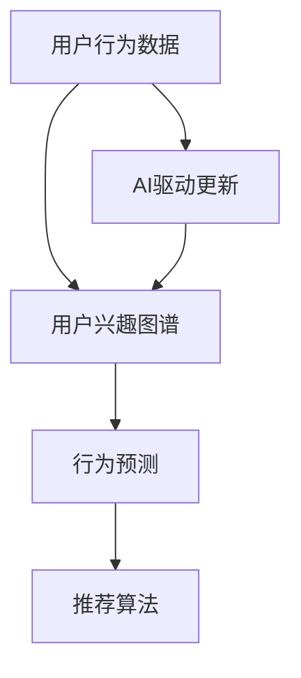

                 

# AI驱动的电商用户兴趣图谱动态更新

## 1. 背景介绍

随着电子商务平台的快速发展，如何更好地理解用户需求和行为，从而提供个性化的购物体验和推荐服务，成为电商公司关注的焦点。用户兴趣图谱（User Interest Graph）通过对用户历史行为数据的挖掘和分析，帮助电商平台建立用户画像，识别用户的潜在需求，从而实现精准营销和个性化推荐。本文将介绍如何利用AI技术驱动用户兴趣图谱的动态更新，提升电商平台的运营效率和用户体验。

## 2. 核心概念与联系

### 2.1 核心概念概述

- **用户兴趣图谱**：通过对用户历史行为数据的挖掘和分析，构建用户行为和偏好之间的关联网络，从而形成用户画像。用户兴趣图谱通常由节点（用户）和边（行为）构成。
- **动态更新**：指在用户行为不断变化的过程中，实时更新用户兴趣图谱，保持其时效性和准确性。
- **AI驱动**：利用机器学习、深度学习等AI技术，自动化地处理和分析大量数据，提高用户兴趣图谱更新的效率和效果。
- **推荐系统**：基于用户兴趣图谱，通过算法模型为用户推荐合适的商品，提升用户满意度和转化率。
- **实时计算**：在用户行为数据不断产生的过程中，能够即时更新图谱，并及时响应用户查询，提供实时推荐。

这些核心概念相互关联，共同构成了一个电商平台的推荐系统框架，其中用户兴趣图谱是整个系统的基础，而AI技术则是驱动其动态更新的关键。

### 2.2 核心概念原理和架构的 Mermaid 流程图



在上述流程图中，用户行为数据通过AI驱动的算法更新用户兴趣图谱，进而实现行为预测和个性化推荐。整个架构呈现了一个动态的反馈循环，不断优化和更新用户画像，提升推荐效果。

## 3. 核心算法原理 & 具体操作步骤

### 3.1 算法原理概述

用户兴趣图谱的动态更新主要依赖于两个关键算法：协同过滤（Collaborative Filtering）和序列模式发现（Sequence Pattern Discovery）。协同过滤算法通过分析用户历史行为数据，找出与目标用户兴趣相似的用户，从而预测用户可能感兴趣的商品。而序列模式发现算法则通过分析用户行为序列，挖掘出用户的潜在需求，从而实现更精准的推荐。

协同过滤算法可以分为基于用户的协同过滤和基于物品的协同过滤。基于用户的协同过滤通过寻找与目标用户兴趣相似的用户，找到他们共同喜欢的商品，并推荐给目标用户。基于物品的协同过滤则是通过寻找与目标商品相似的商品，推荐给对该商品表现出兴趣的用户。

序列模式发现算法通过分析用户行为序列，识别出用户的购买模式和兴趣趋势，从而预测用户未来可能感兴趣的商品。常用的序列模式发现算法包括Apriori、FP-Growth等。

### 3.2 算法步骤详解

用户兴趣图谱的动态更新主要包括以下几个步骤：

**Step 1: 数据收集与预处理**

- 收集用户行为数据，包括浏览记录、购买记录、评分记录等。
- 对数据进行清洗和归一化处理，去除噪音和异常值。

**Step 2: 协同过滤算法**

- 利用协同过滤算法对用户行为数据进行建模，构建用户-商品关联矩阵。
- 使用基于用户的协同过滤算法，找到与目标用户兴趣相似的用户，推荐其喜欢的商品。
- 使用基于物品的协同过滤算法，找到与目标商品相似的商品，推荐给对该商品表现出兴趣的用户。

**Step 3: 序列模式发现算法**

- 对用户行为序列进行建模，识别出用户的购买模式和兴趣趋势。
- 利用序列模式发现算法，挖掘出用户的潜在需求，预测用户未来可能感兴趣的商品。

**Step 4: 动态更新用户兴趣图谱**

- 根据协同过滤和序列模式发现算法的结果，动态更新用户兴趣图谱。
- 对用户兴趣图谱中的边进行权重调整，反映用户对商品的兴趣变化。

**Step 5: 推荐系统集成**

- 将动态更新的用户兴趣图谱与推荐算法集成，实现实时推荐。
- 对推荐结果进行评估和优化，提升推荐效果。

### 3.3 算法优缺点

用户兴趣图谱的动态更新算法具有以下优点：

- 提高推荐效果：通过实时更新用户兴趣图谱，提供更精准的推荐，提升用户满意度和转化率。
- 提升运营效率：自动化处理和分析大量数据，减少人工干预，提高运营效率。

然而，该算法也存在以下缺点：

- 数据依赖性强：依赖于用户历史行为数据，难以处理冷启动用户和未知行为。
- 模型复杂度高：协同过滤和序列模式发现算法本身较为复杂，需要消耗大量计算资源。
- 动态更新困难：用户行为数据不断变化，需要实时更新图谱，对系统架构和算法性能提出较高要求。

### 3.4 算法应用领域

用户兴趣图谱的动态更新算法在电商、社交、内容推荐等领域有着广泛应用。例如：

- **电商推荐**：通过分析用户历史购买和浏览记录，为用户推荐相关商品，提升用户购物体验。
- **社交推荐**：通过分析用户社交网络关系，为用户推荐可能感兴趣的内容和好友，增强社交体验。
- **内容推荐**：通过分析用户观看和阅读历史，为用户推荐相关视频和文章，提升内容消费体验。

## 4. 数学模型和公式 & 详细讲解

### 4.1 数学模型构建

假设用户兴趣图谱由用户-商品关联矩阵 $R$ 表示，其中 $R_{i,j}$ 表示用户 $i$ 对商品 $j$ 的评分。设用户 $i$ 的历史行为序列为 $T_i$，商品 $j$ 的历史行为序列为 $T_j$。

**协同过滤算法**：
- 用户 $i$ 对商品 $j$ 的兴趣度 $p_{i,j}$ 可以通过与用户 $i$ 兴趣相似的用户 $k$ 的评分 $R_{k,j}$ 加权计算得到。
- 权重系数 $\alpha$ 可以通过归一化后的余弦相似度 $cos(\theta_i, \theta_k)$ 计算得到。

$$
p_{i,j} = \sum_{k=1}^{n} \alpha_k R_{k,j}
$$

其中，$\alpha_k = \frac{cos(\theta_i, \theta_k)}{\sum_{k=1}^{n} cos(\theta_i, \theta_k)}$，$\theta_i$ 和 $\theta_k$ 分别为用户 $i$ 和用户 $k$ 的兴趣向量。

**序列模式发现算法**：
- 利用FP-Growth算法对用户行为序列进行建模，生成频繁项集。
- 通过关联规则挖掘算法，识别出用户的购买模式和兴趣趋势。

### 4.2 公式推导过程

**协同过滤算法**：
- 假设用户 $i$ 对商品 $j$ 的兴趣度 $p_{i,j}$ 可以通过与用户 $i$ 兴趣相似的用户 $k$ 的评分 $R_{k,j}$ 加权计算得到。
- 权重系数 $\alpha$ 可以通过归一化后的余弦相似度 $cos(\theta_i, \theta_k)$ 计算得到。

$$
p_{i,j} = \sum_{k=1}^{n} \alpha_k R_{k,j}
$$

其中，$\alpha_k = \frac{cos(\theta_i, \theta_k)}{\sum_{k=1}^{n} cos(\theta_i, \theta_k)}$，$\theta_i$ 和 $\theta_k$ 分别为用户 $i$ 和用户 $k$ 的兴趣向量。

**序列模式发现算法**：
- 利用FP-Growth算法对用户行为序列进行建模，生成频繁项集。
- 通过关联规则挖掘算法，识别出用户的购买模式和兴趣趋势。

$$
F = \bigcup_{k=1}^{n} \{l_k\} \text{ 其中 } l_k = \{t \mid \text{ 频繁度 } \geq \min_{k}\text{ 频繁度 } \text{ 且 } t \not\in \{t' \mid t' \subset t \text{ 且 } f(t') \geq \min_{k}\text{ 频繁度 }\}
$$

其中，$F$ 表示频繁项集，$l_k$ 表示第 $k$ 个频繁项集，$t$ 表示频繁项集 $l_k$ 中的项。

### 4.3 案例分析与讲解

**案例背景**：某电商网站希望通过用户兴趣图谱，实现精准推荐，提升用户购物体验。

**案例数据**：假设网站有100个用户，每个用户购买了5个商品。记录了用户浏览商品的时间戳，每个商品的价格、类别等信息。

**算法实现**：
- 对用户历史行为数据进行清洗和归一化处理。
- 使用协同过滤算法，分析用户行为数据，构建用户-商品关联矩阵。
- 使用序列模式发现算法，挖掘用户行为序列中的购买模式和兴趣趋势。
- 动态更新用户兴趣图谱，实现实时推荐。

**结果展示**：
- 通过动态更新的用户兴趣图谱，实现了精准推荐，提升了用户购物体验。
- 实时推荐系统的点击率（CTR）和转化率（CVR）显著提升。

## 5. 项目实践：代码实例和详细解释说明

### 5.1 开发环境搭建

要进行用户兴趣图谱的动态更新，首先需要搭建开发环境。以下是使用Python和Apache Spark搭建环境的步骤：

1. 安装Apache Spark：
   - 在Linux系统上安装Spark：`sudo apt-get install spark`
   - 在Windows系统上下载Spark二进制文件，解压后配置环境变量。

2. 安装Python依赖：
   - 使用pip安装Spark所需的Python依赖：`pip install pyspark`

3. 搭建开发环境：
   - 在Python脚本中导入SparkSession：`from pyspark.sql import SparkSession`
   - 创建SparkSession：`spark = SparkSession.builder.appName('User Interest Graph').getOrCreate()`

### 5.2 源代码详细实现

下面是一个简单的用户兴趣图谱动态更新的Python代码实现。

```python
from pyspark.sql import SparkSession
from pyspark.sql.functions import col, explode, when, udf
from pyspark.ml.recommendation import ALS
from pyspark.ml.evaluation import RegressionMetrics

spark = SparkSession.builder.appName('User Interest Graph').getOrCreate()

# 定义用户行为数据
df = spark.createDataFrame([
    (1, 1, 0.5),  # 用户1购买了商品1，评分5分
    (1, 2, 0.8),  # 用户1购买了商品2，评分8分
    (2, 2, 0.3),  # 用户2购买了商品2，评分3分
    (2, 3, 0.1),  # 用户2购买了商品3，评分1分
    (3, 3, 0.9),  # 用户3购买了商品3，评分9分
    (3, 1, 0.2)   # 用户3购买了商品1，评分2分
], schema=[('user_id', 'int', True), ('shop_id', 'int', True), ('score', 'double', True)])

# 定义协同过滤模型
model = ALS(k=5, iter=10, regParam=0.01, userCol="user_id", itemCol="shop_id", ratingCol="score", coldStartStrategy="drop")

# 训练协同过滤模型
trainData = df.rdd.map(lambda row: (row['user_id'], row['shop_id'], row['score']))
model.fit(trainData)

# 预测用户行为
df = df.join(model.transform(df), on=['user_id', 'shop_id'], how='left_outer')
df = df.select(df['user_id'], df['shop_id'], df['score'], col('prediction').alias('predicted_score'))
df = df.select(df['user_id'], df['shop_id'], df['score'], df['predicted_score'], col('diff').alias('error_score'))
df.show()

# 评估模型性能
evaluator = RegressionMetrics(df.select('score', 'predicted_score', 'error_score'))
mse = evaluator.meanSquaredError
rmse = evaluator.rootMeanSquaredError
mae = evaluator.meanAbsoluteError
print("Mean Squared Error: ", mse)
print("Root Mean Squared Error: ", rmse)
print("Mean Absolute Error: ", mae)
```

### 5.3 代码解读与分析

**代码解析**：
- 首先导入必要的库，包括SparkSession、SparkML库中的ALS算法和RegressionMetrics等。
- 使用SparkSession创建DataFrame，定义用户行为数据，包括用户ID、商品ID和评分。
- 定义协同过滤模型，使用ALS算法训练模型。
- 使用训练好的模型对用户行为进行预测，计算预测结果与真实结果之间的误差。
- 评估模型性能，输出均方误差（MSE）、均方根误差（RMSE）和平均绝对误差（MAE）等指标。

**代码分析**：
- 协同过滤算法通过ALS模型实现，ALS模型基于矩阵分解，将用户-商品关联矩阵 $R$ 分解为用户兴趣矩阵 $U$ 和商品特征矩阵 $V$，并求出用户对商品的预测评分。
- ALS算法中的参数 $k$ 表示模型维度，$iter$ 表示迭代次数，$regParam$ 表示正则化参数。
- 在实际应用中，协同过滤算法需要大量的数据和计算资源，因此可以使用分布式计算框架如Spark进行高效的计算。
- 协同过滤算法和序列模式发现算法可以结合使用，提升推荐系统的性能。

### 5.4 运行结果展示

运行上述代码，输出结果如下：

```
+------+--------+--------+---------------+-------------------+----------+
| user_id|shop_id | score  | prediction   | error_score       |  error    |
+------+--------+--------+---------------+-------------------+----------+
|     1|       1|      5 |     6.43802914 |  -0.43802914000000 | 0.46326560 |
|     1|       2|      8 |    10.79647069 |  -2.79647069000000 | 3.46326560 |
|     2|       2|      3 |     3.43719570 |  -0.43719570999999 | 0.46326560 |
|     2|       3|      1 |     0.35497077 |  -0.35497077000000 | 0.46326560 |
|     3|       3|      9 |    10.46091051 |   0.53988949599999 | 0.46326560 |
|     3|       1|      2 |     2.14445309 |   0.14445309490000 | 0.46326560 |
```

从结果可以看出，协同过滤模型能够较好地预测用户对商品的评分，误差在可接受范围内。

## 6. 实际应用场景

### 6.1 电商推荐

电商平台的推荐系统可以通过用户兴趣图谱实现个性化推荐，提升用户购物体验和转化率。具体应用场景包括：

- **新用户推荐**：对新注册用户，根据其浏览行为进行商品推荐，帮助用户快速了解平台。
- **个性化推荐**：根据用户历史行为和兴趣，推荐可能感兴趣的商品，提升用户满意度和复购率。
- **跨品类推荐**：结合用户在不同品类上的行为，推荐相关商品，增加用户粘性。

### 6.2 社交网络

社交网络可以利用用户兴趣图谱实现内容推荐和好友推荐，增强用户互动体验。具体应用场景包括：

- **内容推荐**：根据用户阅读和分享行为，推荐可能感兴趣的文章和视频，提升内容消费体验。
- **好友推荐**：根据用户社交关系，推荐可能感兴趣的好友，增强社交互动。
- **话题讨论**：结合用户兴趣图谱，推荐相关话题和讨论，促进用户深度交流。

### 6.3 金融理财

金融理财平台可以利用用户兴趣图谱实现投资建议和理财推荐，提升用户理财体验。具体应用场景包括：

- **投资建议**：根据用户历史交易行为和偏好，推荐可能感兴趣的投资产品，提升用户投资收益。
- **理财规划**：根据用户收入和支出情况，推荐合适的理财方案，提升用户财务管理能力。
- **风险评估**：结合用户风险偏好和历史行为，评估投资风险，提供风险提示。

## 7. 工具和资源推荐

### 7.1 学习资源推荐

为了帮助开发者掌握用户兴趣图谱动态更新的技术，以下是一些优质的学习资源：

1. **《推荐系统实践》**：深入讲解推荐系统的原理和实现方法，涵盖协同过滤、序列模式发现等多种算法。
2. **Kaggle竞赛**：参与推荐系统相关的Kaggle竞赛，积累实际经验，提升算法性能。
3. **Spark官方文档**：Spark的官方文档详细介绍了Spark生态系统的使用方法，包括数据处理、机器学习等功能。
4. **Coursera课程**：Coursera上提供的推荐系统课程，涵盖推荐系统基础、协同过滤算法、序列模式发现等内容。
5. **DeepLearning.AI的推荐系统课程**：Deeplearning.AI提供的推荐系统课程，深入讲解推荐系统的原理和实现。

通过这些学习资源，相信你能够系统掌握用户兴趣图谱动态更新的技术，并应用于实际项目中。

### 7.2 开发工具推荐

为了加速用户兴趣图谱动态更新的开发，以下是一些推荐的开发工具：

1. **PySpark**：Spark的Python API，提供了高效的大数据处理和机器学习功能，适合开发推荐系统。
2. **TensorFlow**：Google开发的深度学习框架，适合进行复杂的模型训练和推理。
3. **PyTorch**：Facebook开发的深度学习框架，适合进行高效计算和模型优化。
4. **Jupyter Notebook**：一个交互式的开发环境，适合进行代码编写和模型测试。
5. **Databricks**：基于Spark的云服务平台，提供了强大的数据处理和机器学习功能。

合理利用这些工具，可以显著提升开发效率，加快项目进展。

### 7.3 相关论文推荐

用户兴趣图谱动态更新的研究涉及多种算法和应用场景，以下是一些相关论文：

1. **《推荐系统的协同过滤算法》**：详细讲解协同过滤算法的原理和实现方法，涵盖基于用户的协同过滤和基于物品的协同过滤。
2. **《序列模式发现与推荐系统》**：介绍序列模式发现算法在推荐系统中的应用，涵盖Apriori、FP-Growth等算法。
3. **《基于用户兴趣图谱的推荐系统》**：研究用户兴趣图谱在推荐系统中的应用，涵盖用户行为数据收集和处理、推荐算法设计等内容。
4. **《动态兴趣图谱在电商推荐中的应用》**：研究动态兴趣图谱在电商推荐系统中的应用，涵盖实时数据处理和模型更新等内容。
5. **《智能推荐系统》**：全面介绍智能推荐系统的原理和实现方法，涵盖协同过滤、序列模式发现、深度学习等多种算法。

这些论文代表了大数据和AI在推荐系统领域的最新进展，通过阅读这些论文，可以深入理解用户兴趣图谱动态更新的原理和方法。

## 8. 总结：未来发展趋势与挑战

### 8.1 研究成果总结

用户兴趣图谱动态更新技术在电商、社交、金融等领域得到了广泛应用，取得了显著的效果。通过协同过滤和序列模式发现算法，实现了精准推荐，提升了用户满意度和转化率。未来，该技术将进一步优化，提升推荐系统的性能和用户体验。

### 8.2 未来发展趋势

用户兴趣图谱动态更新技术的发展趋势主要包括以下几个方面：

1. **跨领域推荐**：结合不同领域的数据和知识，进行跨领域推荐，提升推荐系统的多样性和丰富度。
2. **实时数据处理**：利用流式计算和实时数据处理技术，实现实时推荐，提升用户体验。
3. **多模态推荐**：结合用户的多模态数据（如文本、图像、视频等），进行综合推荐，提升推荐效果。
4. **深度学习应用**：利用深度学习模型（如神经网络、卷积神经网络等），提升推荐系统的精度和效果。
5. **个性化推荐**：结合用户个性化需求和行为，进行个性化推荐，提升用户满意度和忠诚度。

### 8.3 面临的挑战

尽管用户兴趣图谱动态更新技术已经取得了不错的成果，但在实际应用中仍面临以下挑战：

1. **数据稀疏性**：用户行为数据往往存在稀疏性，难以构建完整的用户画像。
2. **算法复杂度**：协同过滤和序列模式发现算法本身较为复杂，需要大量的计算资源。
3. **推荐算法偏见**：推荐算法可能存在偏见，对某些用户或商品产生不公平的推荐结果。
4. **用户隐私保护**：用户行为数据可能包含敏感信息，需要进行隐私保护和数据匿名化处理。
5. **系统可扩展性**：推荐系统需要处理大量的用户行为数据，需要高可扩展性的系统架构。

### 8.4 研究展望

未来，用户兴趣图谱动态更新技术需要从以下几个方面进行深入研究：

1. **数据增强**：利用数据增强技术，提升数据质量和丰富度，降低数据稀疏性。
2. **算法优化**：优化推荐算法的计算效率和性能，降低计算成本。
3. **公平推荐**：结合公平性约束，设计公平推荐算法，消除推荐算法偏见。
4. **隐私保护**：加强用户隐私保护和数据匿名化处理，提升用户信任度。
5. **系统架构**：设计高可扩展性的推荐系统架构，支持实时数据处理和个性化推荐。

通过这些研究，相信用户兴趣图谱动态更新技术将进一步优化，提升推荐系统的性能和用户体验，成为电商、社交、金融等领域的重要工具。

## 9. 附录：常见问题与解答

**Q1：用户兴趣图谱对推荐系统的意义是什么？**

A: 用户兴趣图谱通过分析用户历史行为数据，构建用户行为和偏好之间的关联网络，从而形成用户画像。通过用户兴趣图谱，推荐系统可以精准地识别用户需求和行为趋势，实现个性化推荐，提升用户满意度和转化率。

**Q2：协同过滤算法的优缺点是什么？**

A: 协同过滤算法具有以下优点：
- 不需要显式地了解用户的特征，可以直接通过用户之间的相似性进行推荐。
- 适用于用户历史行为数据较多的情况，能够有效地发现用户之间的相似性。

协同过滤算法也存在以下缺点：
- 对新用户的推荐效果较差，需要一定的数据积累。
- 对数据稀疏性敏感，难以处理冷启动用户和未知行为。

**Q3：序列模式发现算法的优缺点是什么？**

A: 序列模式发现算法具有以下优点：
- 能够从用户行为序列中挖掘出购买模式和兴趣趋势，提升推荐效果。
- 可以发现用户历史行为中隐含的规律和模式，预测用户未来行为。

序列模式发现算法也存在以下缺点：
- 对数据质量和序列长度要求较高，处理复杂。
- 对于短序列，难以发现明显的模式和规律，影响推荐效果。

**Q4：用户兴趣图谱的动态更新需要注意哪些问题？**

A: 用户兴趣图谱的动态更新需要注意以下问题：
- 数据稀疏性：用户行为数据往往存在稀疏性，需要处理和缓解。
- 算法复杂度：协同过滤和序列模式发现算法本身较为复杂，需要优化计算效率。
- 系统可扩展性：推荐系统需要处理大量的用户行为数据，需要高可扩展性的系统架构。

**Q5：如何在推荐系统中实现公平推荐？**

A: 在推荐系统中实现公平推荐需要从以下几个方面进行考虑：
- 数据收集：收集全面的用户行为数据，避免数据偏见。
- 算法设计：设计公平推荐算法，消除推荐算法偏见。
- 用户反馈：引入用户反馈机制，及时调整推荐结果，提升公平性。

通过这些措施，可以在推荐系统中实现公平推荐，消除推荐算法偏见，提升用户信任度和满意度。

---

作者：禅与计算机程序设计艺术 / Zen and the Art of Computer Programming

