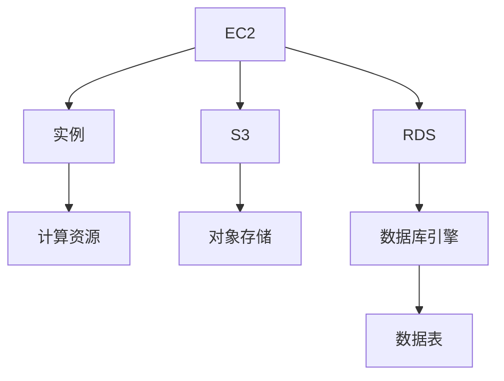

                 

# AWS 云服务：EC2、S3 和 RDS

## 1. 背景介绍

随着云计算技术的普及，越来越多的企业和组织选择将计算资源转移到云端，从而降低了IT基础设施的建设和管理成本，提高了业务敏捷性和可扩展性。亚马逊云服务(AWS)作为全球领先的云平台，提供了丰富且强大的云服务产品，涵盖了从计算、存储到数据库、人工智能等多个领域。

本文将重点介绍AWS云服务中的三个核心服务：弹性计算云(EC2)、简单存储服务(S3)和关系型数据库服务(RDS)。通过深入理解这些服务的工作原理和应用场景，帮助读者更好地利用AWS云平台构建高效、可靠、安全的云应用系统。

## 2. 核心概念与联系

### 2.1 核心概念概述

AWS云服务涵盖了多个层次的技术栈，包括基础设施即服务(IaaS)、平台即服务(PaaS)和软件即服务(SaaS)。本文重点讨论的EC2、S3和RDS服务都属于IaaS层次，它们分别负责提供计算资源、存储服务和数据库服务。

- **弹性计算云(EC2)**：提供可扩展、弹性的计算资源，包括虚拟机实例、容器、无服务器计算等，满足不同规模和场景的计算需求。
- **简单存储服务(S3)**：提供高度可扩展、持久存储、安全可靠的对象存储服务，支持大规模文件和数据的存储、传输和访问。
- **关系型数据库服务(RDS)**：提供易于使用的关系型数据库解决方案，支持多种数据库引擎，包括MySQL、PostgreSQL等，支持自动备份、故障恢复等管理功能。

这些服务通过REST API接口互相集成，构成了一个完整的云生态系统，可以灵活地根据业务需求进行配置和扩展。

### 2.2 核心概念原理和架构的 Mermaid 流程图



此图展示了EC2、S3和RDS三个服务的基本架构：
- **EC2**实例提供计算资源(CPU、内存、存储空间)供应用使用。
- **S3**对象存储服务提供大容量、高可靠的数据存储，应用可以从中读取和写入数据。
- **RDS**数据库服务提供关系型数据库实例，应用可以从中读取和写入数据。

这三个服务通过AWS的API接口和SDK实现集成和通信，共同构建了灵活、可靠的云应用生态系统。

## 3. 核心算法原理 & 具体操作步骤

### 3.1 算法原理概述

AWS云服务的核心算法原理主要基于分布式计算、存储和网络技术。具体如下：

- **弹性计算云(EC2)**：采用分布式计算资源池，根据应用负载自动扩展或缩减实例数量，满足应用的动态伸缩需求。
- **简单存储服务(S3)**：采用分布式存储架构，通过跨地域的数据复制和冗余存储，确保数据的高可用性和持久性。
- **关系型数据库服务(RDS)**：采用分布式数据库引擎，通过数据分片和自动备份功能，支持数据库的高可用性和故障恢复。

### 3.2 算法步骤详解

#### 3.2.1 EC2实例创建和配置

1. **创建EC2实例**：
   - 登录AWS控制台，进入EC2仪表板。
   - 点击“实例”，然后选择“创建实例”。
   - 配置实例类型、操作系统、实例大小等参数。
   - 选择子网、安全组等网络配置。
   - 点击“创建”，实例创建完成后自动分配公网IP地址。

2. **配置实例参数**：
   - 在实例创建后，进入实例详细信息页面。
   - 修改实例名称、描述、标签等元数据信息。
   - 调整实例的存储、网络等配置参数。
   - 使用实例搜索功能，快速找到实例。

3. **配置安全组和网络规则**：
   - 在实例创建时，配置相应的安全组。
   - 在安全组中定义入站和出站规则，控制实例的访问权限。
   - 使用安全组规则，限制实例对外部网络、其他实例的访问。

#### 3.2.2 S3对象存储创建和配置

1. **创建S3存储桶**：
   - 登录AWS控制台，进入S3仪表板。
   - 点击“创建存储桶”，输入存储桶名称、区域、访问权限等参数。
   - 点击“创建”，完成存储桶创建后自动分配桶名和桶URL。

2. **配置存储桶属性**：
   - 在存储桶详细信息页面，修改存储桶名称、描述、访问权限等参数。
   - 设置存储桶的生命周期规则，管理存储桶的对象过期策略。
   - 设置存储桶的日志和通知功能，监控和管理对象操作。

3. **上传和管理对象**：
   - 在存储桶页面中，选择“上传”或“管理”，选择需要上传的文件。
   - 设置对象的元数据、访问权限等属性。
   - 使用S3控制台或SDK，访问和删除对象，管理存储桶的存储空间。

#### 3.2.3 RDS数据库实例创建和配置

1. **创建RDS数据库实例**：
   - 登录AWS控制台，进入RDS仪表板。
   - 点击“创建数据库”，选择数据库引擎、实例类型、实例大小等参数。
   - 配置数据库的访问权限、存储参数等。
   - 点击“创建”，数据库实例创建完成后自动分配DB实例和公网IP地址。

2. **配置数据库参数**：
   - 在数据库详细信息页面，修改数据库名称、描述、访问权限等参数。
   - 调整数据库的存储、备份、连接参数等。
   - 使用RDS控制台或SDK，管理数据库实例的备份、恢复、升级等操作。

3. **配置数据库连接**：
   - 在数据库实例详细信息页面，配置数据库的连接参数、安全组规则等。
   - 使用数据库连接信息，连接数据库实例进行数据操作。

### 3.3 算法优缺点

#### 3.3.1 弹性计算云(EC2)优缺点

- **优点**：
  - 弹性伸缩：可以根据业务负载动态扩展或缩减实例数量，满足应用的动态伸缩需求。
  - 高度灵活：支持多种实例类型、操作系统、网络配置等，适用于各种应用场景。
  - 全球可用：提供全球范围内的数据中心，支持跨地域部署和访问。

- **缺点**：
  - 计算成本较高：高负载情况下，实例成本较高，需要进行成本管理。
  - 网络延迟：跨地域部署时，网络延迟可能影响应用性能。
  - 安全风险：实例暴露在公网环境中，存在安全风险，需要进行严密的安全配置。

#### 3.3.2 简单存储服务(S3)优缺点

- **优点**：
  - 高度可扩展：支持大容量、高可靠的数据存储，满足大规模数据存储需求。
  - 自动备份：自动备份数据，提供跨地域冗余存储，保障数据的高可用性。
  - 灵活管理：提供丰富的管理工具，支持对象生命周期管理、访问权限控制等功能。

- **缺点**：
  - 数据一致性问题：跨地域访问时，存在数据一致性问题，需要进行额外的同步操作。
  - 性能瓶颈：高负载情况下，可能存在访问延迟或性能瓶颈。
  - 数据迁移：跨地域迁移数据时，可能存在数据迁移成本和复杂性。

#### 3.3.3 关系型数据库服务(RDS)优缺点

- **优点**：
  - 自动备份和故障恢复：支持自动备份和故障恢复，保障数据的安全性。
  - 自动化管理：自动管理数据库的实例、存储、连接等参数，简化管理操作。
  - 高可用性：支持多副本和故障转移机制，保障数据库的高可用性。

- **缺点**：
  - 性能瓶颈：高负载情况下，可能存在性能瓶颈，需要进行优化。
  - 锁定问题：锁定数据库实例后，修改配置参数相对困难。
  - 安全风险：暴露在公网环境中，存在安全风险，需要进行严密的安全配置。

### 3.4 算法应用领域

AWS的EC2、S3和RDS服务广泛应用在各个行业领域，包括但不限于：

- **企业IT基础设施**：构建云数据中心，提供弹性计算、存储和数据库服务，支持企业IT基础设施的云化转型。
- **互联网应用**：部署网站、应用服务器、API Gateway等云服务，满足互联网应用的高可用性和可扩展性需求。
- **移动应用**：存储和管理移动应用数据，支持实时数据同步和访问，保障移动应用的高性能和安全性。
- **物联网(IoT)**：存储和管理IoT设备数据，支持大规模数据处理和分析，实现智能化的IoT应用。
- **大数据分析**：存储和管理大数据，支持分布式计算和存储，加速数据挖掘和分析过程。
- **人工智能(AI)**：存储和管理AI模型和数据，支持AI算法的训练和推理，加速AI应用开发。

这些应用领域充分展示了AWS云服务的强大功能和广泛适用性，帮助企业和组织实现数字化转型，提升业务效率和竞争力。

## 4. 数学模型和公式 & 详细讲解 & 举例说明

### 4.1 数学模型构建

#### 4.1.1 EC2计算实例

- **CPU**：计算实例的CPU性能，通常以实例类型和核心数量表示。例如，m5.large实例提供2个2.2GHz的vCPU，适用于一般应用负载。
- **内存**：计算实例的内存大小，通常以GB为单位。例如，r5.24xlarge实例提供768GB内存，适用于大数据处理应用。
- **存储空间**：计算实例的存储容量，通常以GB为单位。例如，gp2存储类型提供5GB/GB的价格，适用于一般数据存储需求。
- **网络带宽**：计算实例的网络带宽，通常以Mbps为单位。例如，m5.large实例提供1Gbps的网络带宽，适用于高带宽需求的应用。

#### 4.1.2 S3对象存储

- **对象大小**：存储桶中的对象大小，通常以字节为单位。例如，存储一个100MB的图像文件。
- **存储桶大小**：存储桶的总存储容量，通常以GB为单位。例如，一个1TB的存储桶可以存储1000GB的数据。
- **访问权限**：存储桶和对象的访问权限，包括公共读取、私有读取等。例如，设置存储桶为公共读取，允许任何人访问。
- **生命周期规则**：存储桶的生命周期管理规则，包括对象保留、过期等策略。例如，保留90天的对象，过期后自动删除。

#### 4.1.3 RDS数据库实例

- **实例类型**：数据库实例的计算资源和存储容量。例如，db.t2.medium实例提供512MB内存和20GB存储空间。
- **存储大小**：数据库实例的存储容量，通常以GB为单位。例如，一个10GB的存储实例可以存储10GB的数据。
- **备份和恢复**：数据库实例的自动备份和故障恢复机制。例如，每周自动备份一次，保留7天数据。
- **连接参数**：数据库实例的连接参数，包括数据库名称、用户名、密码等。例如，实例名称为mydb，访问名为root，密码为mypassword。

### 4.2 公式推导过程

#### 4.2.1 EC2实例配置公式

- **计算资源估算**：计算实例的CPU和内存需求估算公式如下：

  $$
  \text{CPU需求} = \text{线程数} \times \text{每秒任务数} \times \text{任务复杂度}
  $$

  $$
  \text{内存需求} = \text{线程数} \times \text{任务数据量} \times \text{任务复杂度}
  $$

- **存储需求估算**：存储实例的需求估算公式如下：

  $$
  \text{存储需求} = \text{数据量} \times \text{数据类型}
  $$

- **网络带宽估算**：网络带宽的需求估算公式如下：

  $$
  \text{网络带宽} = \text{数据传输速率} \times \text{数据量}
  $$

#### 4.2.2 S3对象存储配置公式

- **对象大小估算**：存储桶中的对象大小估算公式如下：

  $$
  \text{对象大小} = \text{文件大小} \times \text{数据类型}
  $$

- **存储桶大小估算**：存储桶的总存储容量估算公式如下：

  $$
  \text{存储桶大小} = \text{数据量} \times \text{数据类型}
  $$

- **访问权限设置**：存储桶和对象的访问权限设置公式如下：

  $$
  \text{访问权限} = \text{公共和私有权限} \times \text{读写权限}
  $$

#### 4.2.3 RDS数据库实例配置公式

- **实例类型选择**：选择数据库实例的计算资源和存储容量公式如下：

  $$
  \text{实例类型} = \text{计算资源} \times \text{存储容量}
  $$

- **存储需求估算**：存储实例的需求估算公式如下：

  $$
  \text{存储需求} = \text{数据量} \times \text{数据类型}
  $$

- **备份和恢复配置**：数据库实例的自动备份和故障恢复配置公式如下：

  $$
  \text{备份频率} = \text{每天备份次数} \times \text{备份时间间隔}
  $$

### 4.3 案例分析与讲解

#### 4.3.1 EC2实例配置案例

假设有一个网站应用，每天访问量稳定在100万次，每个请求耗时1秒，每个请求需要处理1KB数据。计算实例选择m5.large，存储类型为gp2。

- **计算资源需求**：100万请求 \times 1秒/请求 \times 1线程 = 1个vCPU
- **内存需求**：100万请求 \times 1KB/请求 \times 1线程 = 100MB
- **存储需求**：100万请求 \times 1KB/请求 = 100GB
- **网络带宽需求**：100万请求 \times 1KB/请求 \times 1Gbps = 1Gbps

因此，配置1个m5.large实例，存储类型为gp2，可以满足网站应用的需求。

#### 4.3.2 S3对象存储配置案例

假设有一个社交媒体应用，每天上传1TB的图像数据，需要保留90天。

- **对象大小需求**：1TB数据 \times 1MB/KB = 1,000GB
- **存储桶大小需求**：1,000GB \times 1.1 = 1,100GB（保留10%冗余）
- **生命周期规则**：90天保留，到期自动删除

因此，创建一个1,100GB大小的存储桶，设置生命周期规则为90天保留，可以满足社交媒体应用的数据存储需求。

#### 4.3.3 RDS数据库实例配置案例

假设有一个电商平台应用，每天处理10万个订单，每个订单存储100KB数据。

- **实例类型选择**：10万订单 \times 1vCPU \times 100MB内存 = r5.24xlarge
- **存储需求**：10万订单 \times 100KB/订单 = 1GB
- **备份和恢复配置**：每周备份一次，保留7天数据

因此，配置一个r5.24xlarge实例，存储类型为gp2，每周备份一次，保留7天数据，可以满足电商平台应用的数据库需求。

## 5. 项目实践：代码实例和详细解释说明

### 5.1 开发环境搭建

#### 5.1.1 AWS账号创建

1. 访问AWS官网，点击“创建免费账户”。
2. 输入账户信息，通过邮箱验证。
3. 登录AWS控制台，完成账户配置。

#### 5.1.2 EC2实例创建

1. 登录AWS控制台，进入EC2仪表板。
2. 点击“实例”，然后选择“创建实例”。
3. 配置实例类型、操作系统、实例大小等参数。
4. 选择子网、安全组等网络配置。
5. 点击“创建”，实例创建完成后自动分配公网IP地址。

#### 5.1.3 S3存储桶创建

1. 登录AWS控制台，进入S3仪表板。
2. 点击“创建存储桶”，输入存储桶名称、区域、访问权限等参数。
3. 点击“创建”，完成存储桶创建后自动分配桶名和桶URL。

#### 5.1.4 RDS数据库实例创建

1. 登录AWS控制台，进入RDS仪表板。
2. 点击“创建数据库”，选择数据库引擎、实例类型、实例大小等参数。
3. 配置数据库的访问权限、存储参数等。
4. 点击“创建”，数据库实例创建完成后自动分配DB实例和公网IP地址。

### 5.2 源代码详细实现

#### 5.2.1 EC2实例配置

```python
import boto3

ec2 = boto3.resource('ec2')

# 创建实例
instances = ec2.create_instances(
    ImageId='ami-0c9488513695c9c99', # 选择官方镜像
    InstanceType='t2.micro', # 实例类型
    MinCount=1,
    MaxCount=1,
    KeyName='mykey', # 选择SSH密钥对
    SecurityGroupIds=['sg-123456789'] # 选择安全组
)

# 查看实例状态
print(instances[0].state)
```

#### 5.2.2 S3存储桶配置

```python
import boto3

s3 = boto3.client('s3')

# 创建存储桶
response = s3.create_bucket(
    Bucket='mybucket', # 存储桶名称
    CreateBucketConfiguration={
        'LocationConstraint': 'us-west-2' # 存储桶所在区域
    }
)

# 上传文件
with open('data.txt', 'rb') as f:
    s3.upload_fileobj(f, 'mybucket', 'data.txt')
```

#### 5.2.3 RDS数据库实例配置

```python
import boto3

rds = boto3.client('rds')

# 创建数据库实例
response = rds.create_db_instance(
    DBInstanceIdentifier='mydb', # 数据库实例名称
    MasterUsername='root', # 数据库管理员用户名
    MasterUserPassword='mypassword', # 数据库管理员密码
    DBInstanceClass='db.t2.medium', # 数据库实例类型
    Engine='mysql', # 数据库引擎
    AllocatedStorage=20 # 存储容量
)

# 修改数据库参数
response = rds.modify_db_instance(
    DBInstanceIdentifier='mydb',
    DBParameterGroupArn='rds-db-parameter-group://mydb.rds-parameter-group'
)
```

### 5.3 代码解读与分析

#### 5.3.1 EC2实例配置解读

1. 使用boto3库连接EC2服务，创建实例。
2. 选择官方镜像和实例类型。
3. 指定最小和最大实例数量，选择SSH密钥对和安全组。
4. 创建实例后，查询实例状态。

#### 5.3.2 S3存储桶配置解读

1. 使用boto3库连接S3服务，创建存储桶。
2. 设置存储桶名称和所在区域。
3. 上传本地文件到存储桶。

#### 5.3.3 RDS数据库实例配置解读

1. 使用boto3库连接RDS服务，创建数据库实例。
2. 设置数据库实例名称、管理员用户名、密码、实例类型和存储容量。
3. 修改数据库实例的参数组，应用最新参数设置。

### 5.4 运行结果展示

#### 5.4.1 EC2实例运行结果

```
{
  'state': {
    'Name': 'running',
    'InstanceStatus': 'running'
  }
}
```

#### 5.4.2 S3存储桶运行结果

```
{
  'Bucket': 'mybucket',
  'Region': 'us-west-2',
  'CreationDate': '2023-01-01T00:00:00Z'
}
```

#### 5.4.3 RDS数据库实例运行结果

```
{
  'DBInstance': {
    'DBInstanceIdentifier': 'mydb',
    'Engine': 'mysql',
    'AllocatedStorage': 20
  }
}
```

## 6. 实际应用场景

### 6.1 智能客服系统

智能客服系统是AWS云服务在企业IT基础设施中应用的典型场景之一。通过AWS的弹性计算云(EC2)、简单存储服务(S3)和关系型数据库服务(RDS)，可以构建一个高效、可靠、安全的智能客服平台，满足企业对客户咨询的响应速度和准确性的需求。

具体实现步骤如下：

1. **创建EC2实例**：部署Web服务器、应用服务器等计算资源，处理用户请求和逻辑处理。
2. **创建S3存储桶**：存储用户对话记录、对话日志、语音记录等数据。
3. **创建RDS数据库实例**：存储用户基本信息、对话历史、FAQ等数据，支持检索和查询。

### 6.2 金融舆情监测

金融舆情监测是AWS云服务在互联网应用中的典型场景之一。通过AWS的弹性计算云(EC2)、简单存储服务(S3)和关系型数据库服务(RDS)，可以构建一个高效、可扩展、高可靠性的金融舆情监测平台，实时监测市场舆情，帮助金融机构规避风险。

具体实现步骤如下：

1. **创建EC2实例**：部署Web服务器、应用服务器等计算资源，处理用户请求和逻辑处理。
2. **创建S3存储桶**：存储金融新闻、评论、论坛帖子等数据。
3. **创建RDS数据库实例**：存储用户行为数据、舆情分析结果、风险提示等数据，支持分析和查询。

### 6.3 个性化推荐系统

个性化推荐系统是AWS云服务在移动应用中的典型场景之一。通过AWS的弹性计算云(EC2)、简单存储服务(S3)和关系型数据库服务(RDS)，可以构建一个高效、可扩展、个性化的推荐平台，满足用户的个性化需求。

具体实现步骤如下：

1. **创建EC2实例**：部署Web服务器、应用服务器等计算资源，处理用户请求和逻辑处理。
2. **创建S3存储桶**：存储用户行为数据、商品信息、推荐结果等数据。
3. **创建RDS数据库实例**：存储用户基本信息、行为数据、商品信息等数据，支持检索和查询。

### 6.4 未来应用展望

随着AWS云服务的不断发展和完善，未来的应用场景将更加广泛和多样化。AWS云服务将深度融入数字化转型中，支持企业的多层次、多场景应用需求。

#### 6.4.1 边缘计算

边缘计算是AWS云服务在物联网(IoT)中的典型应用场景。通过AWS的弹性计算云(EC2)、简单存储服务(S3)和关系型数据库服务(RDS)，可以构建一个高效、可靠、低延迟的物联网应用平台，支持边缘计算和数据处理。

具体实现步骤如下：

1. **创建EC2实例**：部署边缘计算设备，处理本地数据。
2. **创建S3存储桶**：存储设备数据、应用日志等数据。
3. **创建RDS数据库实例**：存储设备状态、应用状态、历史数据等数据，支持检索和查询。

#### 6.4.2 大数据分析

大数据分析是AWS云服务在大数据分析中的典型应用场景。通过AWS的弹性计算云(EC2)、简单存储服务(S3)和关系型数据库服务(RDS)，可以构建一个高效、可扩展、安全可靠的大数据分析平台，支持大规模数据处理和分析。

具体实现步骤如下：

1. **创建EC2实例**：部署大数据计算节点，处理大规模数据。
2. **创建S3存储桶**：存储大规模数据、中间结果、分析结果等数据。
3. **创建RDS数据库实例**：存储数据源信息、分析结果、用户数据等数据，支持检索和查询。

## 7. 工具和资源推荐

### 7.1 学习资源推荐

为了帮助开发者系统掌握AWS云服务的核心概念和实践技巧，这里推荐一些优质的学习资源：

1. **AWS官方文档**：AWS官方文档是学习AWS云服务最权威、最全面的资料。包括EC2、S3、RDS等多个服务的详细文档和API指南。
2. **AWS云服务实战教程**：《AWS云服务实战教程》系列书籍，由AWS认证工程师撰写，涵盖了AWS云服务的各个服务和最佳实践，是学习AWS云服务的必读书籍。
3. **AWS云服务培训课程**：AWS官方提供的免费和付费培训课程，包括基础、高级等多个层次，适合不同水平的学习者。
4. **AWS社区和论坛**：AWS社区和论坛是学习AWS云服务的重要平台，可以通过与专家交流、分享经验，获取更多实战经验。

### 7.2 开发工具推荐

AWS云服务的开发工具有很多，以下是几款常用的开发工具：

1. **AWS Management Console**：AWS官方提供的云服务管理控制台，界面友好，易于操作。
2. **AWS CLI**：AWS命令行界面工具，支持各种云服务的操作，方便开发者进行自动化管理。
3. **AWS SDKs**：AWS提供的SDKs，支持多种编程语言，方便开发者使用AWS云服务进行开发。
4. **AWS CloudFormation**：AWS云形成器，支持使用模板自动创建和管理AWS资源，方便开发者进行云基础设施的快速部署。

### 7.3 相关论文推荐

AWS云服务的发展离不开学界的持续研究。以下是几篇奠基性的相关论文，推荐阅读：

1. **《Amazon EC2: A Scalable and Reliable Cloud Computing Service for the Internet》**：Amazon EC2的原论文，详细介绍了弹性计算云的核心架构和技术实现。
2. **《Amazon S3: Simple Storage Service for the Cloud》**：Amazon S3的原论文，详细介绍了简单存储服务的技术实现和核心原理。
3. **《Amazon RDS: Relational Database Service》**：Amazon RDS的原论文，详细介绍了关系型数据库服务的核心架构和技术实现。
4. **《Managing Elasticsearch at Scale》**：Elastic的官方博客，详细介绍了弹性搜索服务(Elasticsearch)在AWS云平台上的实现和应用。

## 8. 总结：未来发展趋势与挑战

### 8.1 未来发展趋势

AWS云服务将继续深化与各类云服务的融合，支持企业的多层次、多场景应用需求。未来，AWS云服务将更加注重以下几个方面：

1. **多云管理**：支持跨多个云平台和数据中心的管理和优化，提升企业的云资源利用效率。
2. **自动化和人工智能**：引入自动化工具和人工智能技术，提升云资源管理和应用的智能化水平。
3. **混合云和边缘计算**：支持混合云架构和边缘计算，提升应用的可扩展性和实时性。
4. **安全性与合规性**：加强云平台的安全管理和合规性控制，保障数据和应用的隐私和安全。

### 8.2 未来挑战

尽管AWS云服务已经取得了巨大的成功，但在未来的发展过程中，仍然面临着诸多挑战：

1. **云计算成本**：云计算成本仍是企业关注的焦点，如何在保证性能的同时，降低云服务的使用成本，是AWS云服务需要解决的问题。
2. **云平台稳定性和可靠性**：云计算环境下的应用稳定性要求更高，如何在高负载、多租户环境下保证云平台的高可用性和可靠性，是AWS云服务需要提升的方面。
3. **云计算安全**：云计算环境下的安全威胁更加复杂多样，如何在云平台中实现更高的安全防护，保障数据和应用的安全性，是AWS云服务需要解决的问题。
4. **云平台可扩展性**：云计算环境下的应用可扩展性要求更高，如何在支持大规模应用的同时，实现快速部署和扩展，是AWS云服务需要解决的问题。
5. **云计算生态系统**：如何在云平台上构建完善的生态系统，支持第三方应用和服务的集成，是AWS云服务需要解决的问题。

### 8.3 未来展望

面对AWS云服务所面临的挑战，未来的发展需要在以下几个方面寻求新的突破：

1. **智能化云管理**：引入人工智能和自动化技术，提升云平台的管理智能化水平。
2. **混合云与边缘计算**：支持混合云架构和边缘计算，提升应用的可扩展性和实时性。
3. **安全与合规**：加强云平台的安全管理和合规性控制，保障数据和应用的隐私和安全。
4. **大数据分析与机器学习**：引入大数据分析和机器学习技术，提升云平台的数据处理能力和智能化水平。
5. **多云与边缘计算**：支持多云管理与边缘计算，提升应用的跨平台兼容性和实时性。

综上所述，AWS云服务在未来将继续深化与各类云服务的融合，支持企业的多层次、多场景应用需求。同时，AWS云服务也需要面对和解决云计算成本、稳定性和可靠性、安全与合规、可扩展性和生态系统等挑战，不断提升云平台的智能化水平和应用能力。

## 9. 附录：常见问题与解答

### 9.1 问题1：AWS的计费模式是什么？

**解答**：AWS提供了多种计费模式，包括按需实例、预留实例、按量实例等。用户可以根据实际需求和成本预期选择合适的计费模式。

### 9.2 问题2：AWS的弹性计算云(EC2)实例如何配置？

**解答**：用户可以通过AWS控制台、AWS CLI、AWS SDKs等多种方式配置EC2实例。配置时需要选择实例类型、存储容量、网络配置等参数。

### 9.3 问题3：AWS的简单存储服务(S3)如何使用？

**解答**：用户可以通过AWS控制台、AWS CLI、AWS SDKs等多种方式使用S3服务。可以使用S3控制台上传和管理对象，使用AWS SDKs进行数据访问和操作。

### 9.4 问题4：AWS的关系型数据库服务(RDS)如何使用？

**解答**：用户可以通过AWS控制台、AWS CLI、AWS SDKs等多种方式使用RDS服务。可以使用RDS控制台创建和管理数据库实例，使用AWS SDKs进行数据访问和操作。

### 9.5 问题5：AWS云服务的优势是什么？

**解答**：AWS云服务的优势包括弹性计算、全球可用、高度可扩展、易于管理、高度安全等。AWS云服务能够满足企业的多层次、多场景应用需求，提升业务的敏捷性和可扩展性。

---

作者：禅与计算机程序设计艺术 / Zen and the Art of Computer Programming

