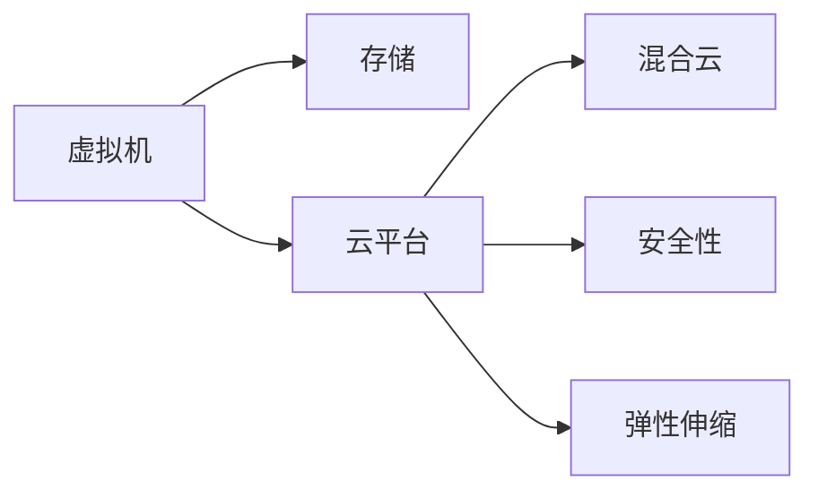

                 

# Azure 云平台：虚拟机和存储

> 关键词：Azure, 虚拟机, 存储, 云平台, 混合云, 安全性, 弹性伸缩

## 1. 背景介绍

### 1.1 问题由来

随着云计算技术的迅猛发展，企业对于云平台的需求日益增长。云平台为企业提供了高效、弹性、灵活的计算和存储资源，帮助企业降低IT运营成本，加速业务创新。Azure作为全球领先的企业级云平台，凭借其强大的基础设施和丰富的服务生态，逐渐成为企业上云的首选。

Azure 云平台的核心价值在于其高度灵活的资源调度、强大的安全性保障、丰富的云服务生态以及丰富的混合云集成方案。虚拟化和存储是Azure云平台中最为基础和核心的组成部分。通过深入理解Azure虚拟机和存储的原理和应用，可以帮助企业更好地部署和管理云资源，优化云架构，提高业务运行效率。

### 1.2 问题核心关键点

Azure虚拟机和存储系统是Azure云平台的重要组件，具有以下核心功能：

- **虚拟机**：提供计算资源，支持弹性伸缩、自动扩展、安全管理等特性。
- **存储**：提供持久化数据存储，支持文件存储、块存储、对象存储等多种形式。

这些组件相互协作，构成Azure云平台的计算和存储基础设施。理解虚拟机和存储系统的设计和应用，对构建和部署Azure云解决方案至关重要。

## 2. 核心概念与联系

### 2.1 核心概念概述

为了更好地理解Azure虚拟机和存储系统，本节将介绍几个关键概念及其联系：

- **虚拟机(Virtual Machine, VM)**：一种虚拟的计算环境，通过模拟物理硬件资源，提供独立的计算和存储资源，支持应用软件的部署和运行。
- **存储**：在虚拟机中存储数据，提供持久性和数据保护能力，支持多种存储类型和协议。
- **云平台**：提供完整的计算、存储、网络等基础设施服务，支持企业级应用部署和管理。
- **混合云**：将本地数据中心与公共云平台相结合，实现跨云资源的优化利用。
- **安全性**：通过身份和访问管理、数据加密、威胁防护等手段，确保云平台的安全性。
- **弹性伸缩**：根据业务负载的变化，动态调整计算和存储资源，支持应用的自动扩展。

这些核心概念通过以下Mermaid流程图来展示其联系：



这个流程图展示了虚拟机和存储系统在云平台中的应用，以及与其他云平台特性和功能的关系。

## 3. 核心算法原理 & 具体操作步骤

### 3.1 算法原理概述

Azure虚拟机和存储系统的设计基于微服务架构，通过多租户模型和弹性伸缩技术，确保了云平台的高可用性、高扩展性和高安全性。其核心原理包括：

- **虚拟化技术**：通过虚拟化软件模拟硬件资源，提供独立的操作系统和应用运行环境。
- **分布式存储**：通过冗余存储和数据复制，确保数据的持久性和高可用性。
- **弹性伸缩**：根据负载变化动态调整资源，支持应用的自动扩展。
- **微服务架构**：通过松耦合、服务网格等技术，实现应用的分布式部署和管理。

### 3.2 算法步骤详解

Azure虚拟机和存储系统的主要操作流程包括以下几个关键步骤：

1. **虚拟机创建和配置**：
   - 在Azure门户或命令行界面选择虚拟机类型和大小。
   - 配置网络、安全性、磁盘等参数。
   - 选择合适的存储类型和性能策略。

2. **虚拟机部署**：
   - 上传或从镜像创建虚拟机镜像。
   - 选择资源组和位置，进行虚拟机的部署。
   - 配置远程连接和自动化脚本。

3. **数据存储配置**：
   - 创建和管理文件共享、块存储和对象存储。
   - 配置RAID级别、存储冗余和数据加密。
   - 设置访问权限和共享策略。

4. **虚拟机扩缩容**：
   - 根据负载需求调整虚拟机规模和资源配置。
   - 配置自动扩展规则和负载均衡策略。
   - 监控资源使用情况，优化资源分配。

5. **数据备份与恢复**：
   - 定期备份虚拟机和存储数据。
   - 配置灾难恢复方案和数据冗余策略。
   - 使用快照和备份恢复数据。

### 3.3 算法优缺点

Azure虚拟机和存储系统具有以下优点：

- **高可用性和持久性**：通过冗余和数据复制，确保数据的持久性和高可用性。
- **高扩展性和弹性伸缩**：支持动态调整资源，快速应对负载变化。
- **丰富多样的存储选择**：支持文件、块、对象等多种存储类型，满足不同应用需求。
- **强大的安全性保障**：支持身份和访问管理、数据加密、威胁防护等安全机制。

然而，这些系统也存在一些局限性：

- **成本较高**：对于大规模数据存储和复杂应用，初始投资成本和运营成本较高。
- **依赖Azure生态**：只能在Azure云平台中部署和运行，难以迁移至其他云平台。
- **管理复杂**：管理和配置过程相对复杂，需要专业的技术支持。

### 3.4 算法应用领域

Azure虚拟机和存储系统在多个领域得到了广泛应用：

- **企业级应用部署**：支持企业级应用如ERP、CRM、HR等系统的部署和管理。
- **大数据分析**：提供海量数据的存储和处理能力，支持大规模数据挖掘和分析。
- **云计算生态集成**：与Azure的其他云服务如AI、IoT、DevOps等紧密集成，实现应用的协同优化。
- **混合云应用**：支持本地数据中心和公共云平台之间的数据交换和应用集成，实现混合云架构。

## 4. 数学模型和公式 & 详细讲解 & 举例说明

### 4.1 数学模型构建

Azure虚拟机和存储系统的数学模型主要涉及以下几个方面：

- **虚拟机计算模型**：定义虚拟机的计算性能和资源需求。
- **存储容量模型**：计算存储容量的需求和冗余度。
- **数据传输模型**：计算网络带宽和延迟，优化数据传输效率。

### 4.2 公式推导过程

以下是一些关键公式的推导过程：

- **虚拟机计算性能**：
  - 设虚拟机CPU数量为n，主频为f，执行任务T所需时间为t，则计算性能为：
  $$
  \text{性能} = n \times f \times \frac{1}{t}
  $$

- **存储容量需求**：
  - 设存储容量为C，冗余度为r，则实际可用容量为：
  $$
  \text{可用容量} = C \times \frac{1}{r}
  $$

- **数据传输速率**：
  - 设网络带宽为b，数据块大小为S，传输距离为d，则传输速率r为：
  $$
  r = \frac{S}{b \times d}
  $$

### 4.3 案例分析与讲解

假设某企业部署了一台Azure虚拟机，配置如下：

- CPU数量：4个
- 主频：2GHz
- 存储容量：1TB
- 冗余度：3

计算该虚拟机的性能和可用容量：

- 性能：$4 \times 2 \times \frac{1}{t}$
- 可用容量：$1 \times \frac{1}{3} = 0.33\text{TB}$

假设该虚拟机需要处理一个需要1小时计算的任务，则其性能为：

$$
\text{性能} = 4 \times 2 \times \frac{1}{1} = 8\text{（GB/s）}
$$

## 5. 项目实践：代码实例和详细解释说明

### 5.1 开发环境搭建

在Azure虚拟机和存储系统的开发过程中，需要使用Azure门户、命令行界面、Azure CLI等工具。以下是搭建开发环境的详细流程：

1. 访问Azure门户，创建Azure账户。
2. 安装Azure CLI并配置登录信息。
3. 配置虚拟网络和安全组，创建虚拟机资源。
4. 配置文件共享、块存储和对象存储。
5. 编写和部署自动化脚本，实现资源管理。

### 5.2 源代码详细实现

以下是一个使用Python语言和Azure SDK实现Azure虚拟机和存储系统管理的代码示例：

```python
from azure.identity import DefaultAzureCredential
from azure.mgmt.compute import ComputeManagementClient
from azure.mgmt.storage import StorageManagementClient

credential = DefaultAzureCredential()

compute_client = ComputeManagementClient(credential, subscription_id)
storage_client = StorageManagementClient(credential, subscription_id)

# 创建虚拟机
vm_resource = {
    'location': 'eastus',
    'sku': {
        'name': 'Standard_DS2_v2',
        'capacity': '1',
    },
    'hardware_profile': {
        'vm_size': 'Standard_DS2_v2',
    },
    'storage_profile': {
        'image_reference': {
            'publisher': 'MicrosoftWindowsServer',
            'sku': 'WindowsServer',
            'version': 'latest',
        },
        "os_profile': {
            'computer_name': 'myvm',
            'admin_username': 'myadmin',
            'admin_password': 'mypassword',
        },
        'network_profile': {
            'network_security_group': 'myvmsg',
        },
    },
    'os_profile': {
        'windows_config': {
            'enable自动化修复': True,
        },
    },
}

compute_client.virtual_machines.create_or_update(resource_group_name='myresourcegroup', name='myvm', body=vm_resource)

# 创建存储账户
storage_account_resource = {
    'location': 'eastus',
    'skind': 'StorageV2',
    'kind': 'Storage',
    'encryption': {
        'services': [
            'BLOB',
            'FILE',
            'QUEUE',
            'TABLE',
        ],
        'key_source': 'Microsoft.Storage',
        'keys': {
            'keys': [
                {
                    'name': 'myaccesskey',
                    'value': 'myaccesskey',
                },
            ],
        },
    },
}

storage_client.storage_accounts.create_or_update(resource_group_name='myresourcegroup', account_name='mystorage', location='eastus', body=storage_account_resource)

# 配置文件共享
fileshare_resource = {
    'name': 'myfileshare',
    'properties': {
        'access_type': 'SMB',
        'account_name': 'mystorage',
    },
}

fileshare_client = storage_client.file_shares

fileshare_client.create_or_update(resource_group_name='myresourcegroup', account_name='mystorage', file_share_name='myfileshare', body=fileshare_resource)

# 配置块存储
disk_resource = {
    'location': 'eastus',
    'properties': {
        'create_option': 'empty',
        'disk_size_gb': 1024,
        'kind': 'StandardSSD_LRS',
    },
    'sku': {
        'name': 'Standard_LRS',
    },
}

disk_client = storage_client.disks

disk_client.create_or_update(resource_group_name='myresourcegroup', disk_name='mydisk', create_option='empty', account_name='mystorage', body=disk_resource)

# 配置对象存储
container_resource = {
    'name': 'mycontainer',
    'properties': {
        'access_type': 'Blob',
    },
}

container_client = storage_client.blob_containers

container_client.create_or_update(resource_group_name='myresourcegroup', account_name='mystorage', container_name='mycontainer', body=container_resource)
```

### 5.3 代码解读与分析

上述代码示例展示了如何在Python中使用Azure SDK创建虚拟机、存储账户、文件共享、块存储和对象存储。这些操作涉及到Azure CLI的各个部分，包括计算资源管理、存储资源管理、网络资源管理和安全性管理。

## 6. 实际应用场景

### 6.1 企业级应用部署

企业级应用如ERP、CRM、HR等系统的部署和管理，是Azure云平台的重要应用场景。通过Azure虚拟机和存储系统，企业可以灵活地部署和管理各种应用，满足不同业务需求。

例如，某大型企业需要在Azure上部署一个ERP系统。企业可以在Azure门户中创建虚拟机资源，选择合适的计算和存储配置，通过自动化脚本和模板部署ERP应用。同时，企业可以通过Azure的混合云功能，将本地数据中心的应用和数据迁移到Azure云平台，实现跨云资源的协同优化。

### 6.2 大数据分析

大数据分析需要大量的数据存储和处理能力。通过Azure虚拟机和存储系统，企业可以构建大规模数据仓库和分析平台，支持海量数据的存储、处理和分析。

例如，某电子商务平台需要分析用户行为数据，以优化商品推荐和广告投放。该平台可以在Azure上部署大规模虚拟机集群，配置高效存储系统，通过分布式计算框架如Hadoop、Spark等，处理和分析海量数据，提取有价值的用户行为信息。同时，企业可以通过Azure的云服务生态，集成AI、机器学习等技术，提升数据分析和应用的智能化水平。

### 6.3 云计算生态集成

Azure虚拟机和存储系统可以与其他云服务紧密集成，实现应用的协同优化。通过Azure云平台，企业可以无缝集成AI、IoT、DevOps等云服务，构建完整的应用生态。

例如，某制造企业需要实时监控生产设备状态，以优化生产流程。该企业可以在Azure上部署物联网设备，通过IaaS层存储和计算资源，支持设备数据的实时采集和处理。同时，企业可以通过Azure的AI服务，构建设备状态预测和分析模型，优化生产调度。

### 6.4 混合云应用

混合云架构是一种常见的云部署方式，可以将本地数据中心和公共云平台相结合，实现跨云资源的优化利用。通过Azure虚拟机和存储系统，企业可以构建混合云解决方案，实现本地和云资源的无缝集成和优化。

例如，某银行需要在本地数据中心和Azure云平台中部署应用。银行可以在本地构建核心业务系统，通过Azure云平台部署分支机构应用，实现应用的集中管理和优化。同时，银行可以通过Azure的混合云功能，实现数据的跨云备份和灾难恢复，确保业务的高可用性和数据安全。

## 7. 工具和资源推荐

### 7.1 学习资源推荐

为了帮助开发者系统掌握Azure虚拟机和存储系统的开发和应用，这里推荐一些优质的学习资源：

1. **Azure官方文档**：提供完整的Azure虚拟机和存储系统的API和操作指南，是学习和使用Azure的重要参考资料。
2. **Azure云架构认证课程**：由Azure官方提供的认证课程，涵盖Azure虚拟机和存储系统的设计与实现，适合有志于成为Azure架构师的开发者。
3. **Azure DevOps指南**：介绍Azure DevOps的集成和自动化功能，帮助开发者构建高效的应用部署和持续集成/持续部署(CI/CD)流程。
4. **Azure混合云架构设计指南**：提供混合云架构的设计原则和最佳实践，帮助企业构建跨云的数据和应用集成方案。
5. **Azure安全最佳实践**：介绍Azure平台的安全性和合规性要求，帮助开发者构建安全的云应用。

### 7.2 开发工具推荐

在Azure虚拟机和存储系统的开发过程中，需要使用多种工具和平台。以下是几款推荐的开发工具：

1. **Azure门户**：Azure云平台的管理和监控界面，提供可视化的云资源管理和监控功能。
2. **Azure CLI**：Azure云平台的命令行界面，支持Python、PowerShell等多种编程语言。
3. **Visual Studio Code**：轻量级的开发工具，支持Azure插件，便于集成Azure资源管理和开发。
4. **Azure DevOps**：提供CI/CD集成和自动化功能，支持Azure资源的部署和管理。
5. **Azure Monitor**：Azure平台的监控和日志管理工具，支持性能监控和故障诊断。

### 7.3 相关论文推荐

Azure虚拟机和存储系统的设计和应用涉及到多个领域的研究。以下是几篇奠基性的相关论文，推荐阅读：

1. **《Azure: A Cloud Computing Service for the 21st Century》**：介绍Azure云平台的设计理念和架构，是Azure技术栈的重要参考资料。
2. **《Microsoft Azure: Introduction to Cloud Computing》**：由微软官方编写的Azure云平台入门教程，涵盖Azure虚拟机和存储系统的基本原理和应用。
3. **《Azure Virtual Machine Deployment Best Practices》**：提供Azure虚拟机的部署和管理最佳实践，帮助开发者优化虚拟机资源配置。
4. **《Azure Storage: Best Practices and Considerations》**：介绍Azure存储的最佳实践和注意事项，帮助开发者构建高效、安全的存储系统。
5. **《Azure Hybrid Cloud Design Patterns》**：提供混合云架构的设计模式和最佳实践，帮助企业构建跨云的业务解决方案。

## 8. 总结：未来发展趋势与挑战

### 8.1 总结

本文对Azure虚拟机和存储系统的设计原理和操作步骤进行了详细讲解，并通过代码实例和案例分析，展示了Azure云平台在虚拟机和存储系统中的应用。通过本文的系统梳理，可以看出Azure虚拟机和存储系统具有高可用性、高扩展性和高安全性，适用于企业级应用、大数据分析、云计算生态集成和混合云架构等众多场景。

### 8.2 未来发展趋势

展望未来，Azure虚拟机和存储系统的设计和应用将呈现以下几个发展趋势：

1. **边缘计算支持**：随着物联网设备的普及，Azure虚拟机和存储系统将支持边缘计算，实现云边协同，提高应用的响应速度和资源利用率。
2. **人工智能集成**：Azure虚拟机和存储系统将进一步集成AI和机器学习技术，支持智能化数据处理和应用优化。
3. **混合云优化**：Azure云平台将提供更加灵活和高效的混合云解决方案，支持本地数据中心和公共云平台的无缝集成和优化。
4. **安全性提升**：Azure虚拟机和存储系统将引入更多的安全技术和机制，确保云平台的安全性和合规性。

### 8.3 面临的挑战

尽管Azure虚拟机和存储系统已经取得了显著成果，但在迈向更加智能化、普适化应用的过程中，仍面临诸多挑战：

1. **成本控制**：随着云资源需求的增加，成本控制成为企业关注的重要问题。如何在提高性能和灵活性的同时，降低云运营成本，是未来的研究方向。
2. **管理和维护**：Azure虚拟机和存储系统的管理和维护相对复杂，需要专业的技术支持。如何在自动化和简化管理的同时，提高系统的可靠性和稳定性，是未来的挑战。
3. **安全性和合规性**：随着数据和应用的复杂性增加，Azure云平台的安全性和合规性要求也随之提高。如何在保障安全和合规的同时，满足不同行业的具体需求，是未来的重要课题。
4. **跨云互通性**：跨云资源互通性是混合云架构的重要要求，但不同云平台之间的互操作性仍然存在挑战。如何构建开放、标准的云平台接口，实现跨云无缝集成，是未来的方向。

### 8.4 研究展望

为了应对这些挑战，未来的研究需要在以下几个方面进行深入探索：

1. **混合云架构优化**：研究和构建更加灵活、高效的混合云解决方案，实现本地和云平台的无缝集成和优化。
2. **人工智能与云计算融合**：探索人工智能技术在云计算中的应用，提升云计算的智能化水平，实现智能化数据处理和应用优化。
3. **安全性和合规性增强**：研究增强Azure云平台的安全性和合规性，确保云平台的高可靠性和合规性。
4. **边缘计算支持**：研究和实现边缘计算技术，提高云边协同和应用响应速度，支持物联网设备的应用。

## 9. 附录：常见问题与解答

**Q1：如何在Azure上部署虚拟机？**

A: 在Azure门户中，选择虚拟机类型和大小，配置网络、安全性、磁盘等参数，选择资源组和位置，进行虚拟机的部署。配置远程连接和自动化脚本，启动虚拟机。

**Q2：Azure虚拟机支持哪些操作系统？**

A: Azure虚拟机支持多种操作系统，包括Windows Server、Linux、Solaris等。具体支持的操作系统版本取决于虚拟机类型和大小。

**Q3：Azure存储支持哪些存储类型？**

A: Azure存储支持多种存储类型，包括文件存储、块存储、对象存储等。不同存储类型适用于不同的应用场景。

**Q4：如何备份和恢复虚拟机和存储数据？**

A: 可以使用Azure备份服务定期备份虚拟机和存储数据，设置灾难恢复方案和数据冗余策略，使用快照和备份恢复数据。

**Q5：Azure虚拟机和存储系统如何实现高可用性和高扩展性？**

A: Azure虚拟机和存储系统通过冗余存储和数据复制、自动扩展规则和负载均衡策略，实现高可用性和高扩展性。

---

作者：禅与计算机程序设计艺术 / Zen and the Art of Computer Programming

