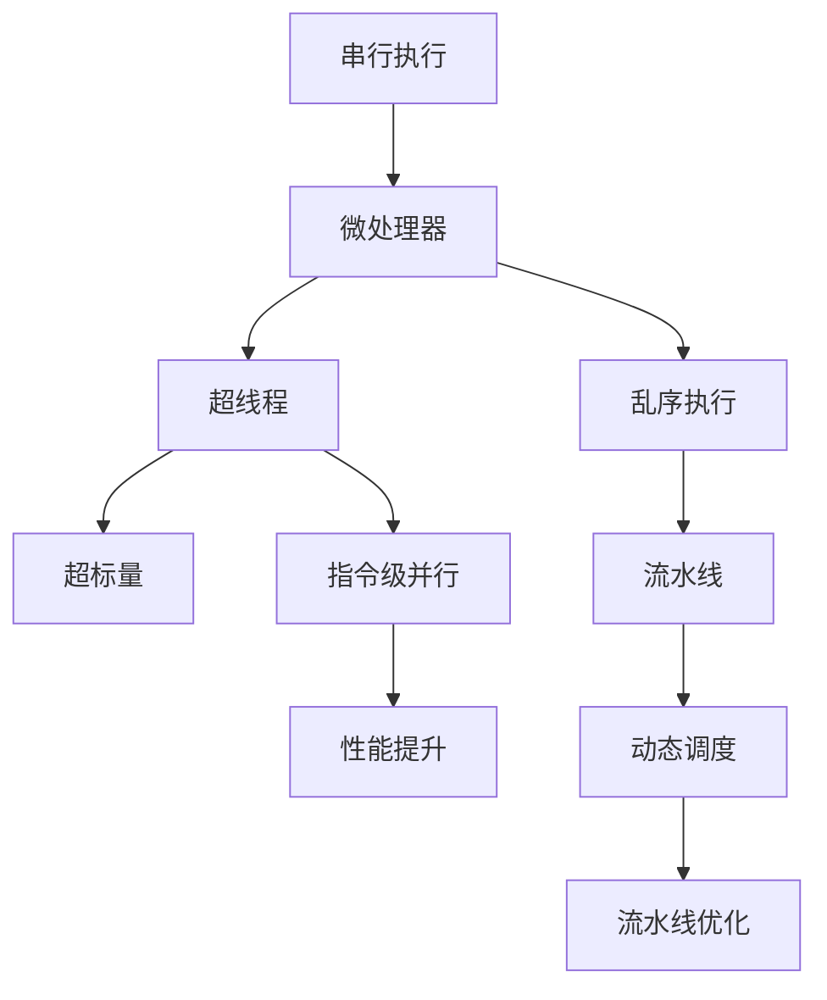

                 

# CPU的指令级并行技术发展

> 关键词：指令级并行, CPU, 微处理器, 超线程, 超标量, 乱序执行, 动态调度, 流水线优化, 性能提升

## 1. 背景介绍

在计算机硬件的发展历程中，处理器指令级并行技术的演进一直是推动性能提升的重要力量。从最初的串行单核单线程设计到后来的多核多线程架构，再到高级的乱序执行、动态调度和流水线优化技术，指令级并行技术持续演进，极大地提升了CPU的处理能力和系统效率。本文旨在深入探讨CPU的指令级并行技术发展，从原理到应用，全面剖析指令级并行技术在提升系统性能方面的贡献及其面临的挑战。

## 2. 核心概念与联系

### 2.1 核心概念概述

指令级并行(Instruction-Level Parallelism, ILP)是指在单个CPU核心中，通过对指令的并行执行来提升处理器的性能。它涉及以下几个关键概念：

- **串行执行**：指令按顺序依次执行，每个时刻只有一个指令被执行。
- **微处理器**：CPU的微处理器单元，负责执行指令和进行算术逻辑运算。
- **超线程**：通过软硬件结合的方式，将单个物理核心虚拟成两个逻辑核心，实现同时执行两个线程。
- **超标量**：处理器在每个时钟周期内执行多个指令，以提升执行效率。
- **乱序执行**：处理器根据指令间依赖关系，重新排序指令执行顺序，以充分利用资源。
- **流水线**：将指令执行过程划分为多个阶段，各阶段并行处理，提高执行效率。
- **动态调度**：在运行时根据当前性能需求动态调整指令的执行顺序和资源分配。
- **流水线优化**：通过改进流水线结构和逻辑，减少瓶颈，提升性能。

这些概念之间存在紧密联系，共同构成了指令级并行技术的理论基础和实践框架。

### 2.2 核心概念原理和架构的 Mermaid 流程图(Mermaid 流程节点中不要有括号、逗号等特殊字符)



这个图展示了从串行执行到指令级并行，再到性能提升的整个过程。其中，微处理器是核心单元，通过超线程、超标量、乱序执行等技术，实现指令的并行执行。动态调度和流水线优化进一步提升并行效率，最终实现性能的显著提升。

## 3. 核心算法原理 & 具体操作步骤

### 3.1 算法原理概述

指令级并行技术的核心在于通过并行执行指令，最大化硬件资源的利用率。具体而言，包括以下几个方面：

1. **超线程技术**：通过硬件和软件的结合，将一个物理核心虚拟成两个逻辑核心，从而同时执行两个线程。

2. **超标量技术**：在每个时钟周期内执行多条指令，增加并行度。

3. **乱序执行**：根据指令依赖关系，重新排序指令执行顺序，减少因数据依赖导致的等待时间。

4. **流水线优化**：将指令执行过程划分为多个阶段，各阶段并行处理，提高执行效率。

5. **动态调度**：根据当前性能需求，动态调整指令执行顺序和资源分配，优化性能。

### 3.2 算法步骤详解

以下是实现指令级并行技术的详细步骤：

1. **超线程技术**：
   - **硬件实现**：在CPU内部增加逻辑寄存器和状态管理电路，实现两个独立线程的执行。
   - **软件支持**：操作系统和编译器需识别线程，并在调度时支持超线程。

2. **超标量技术**：
   - **硬件实现**：增加浮点单元、向量寄存器等硬件资源，同时优化流水线结构，支持多条指令并行执行。
   - **软件支持**：编译器需将单指令多数据(SIMD)指令转换为并行指令。

3. **乱序执行**：
   - **硬件实现**：增加重排序缓存和指令调度器，重新排列指令顺序，以充分利用资源。
   - **软件支持**：编译器需对代码进行重排序，优化数据依赖关系。

4. **流水线优化**：
   - **硬件实现**：改进流水线结构，如减少流水线间的依赖，增加分支预测器等。
   - **软件支持**：编译器需生成高效流水线代码，减少瓶颈。

5. **动态调度**：
   - **硬件实现**：增加动态调度器，实时调整指令执行顺序。
   - **软件支持**：操作系统需支持动态调度策略，如工作窃取、任务迁移等。

### 3.3 算法优缺点

指令级并行技术的优点包括：

- **性能提升**：通过并行执行指令，显著提高CPU的处理能力。
- **资源利用率**：有效利用硬件资源，减少空闲时间。

其缺点主要包括：

- **复杂性**：并行执行增加了硬件和软件的复杂性，需要严格的实现和调试。
- **功耗和散热**：并行执行增加了功耗和热量，对硬件设计提出了更高要求。
- **调度开销**：动态调度和乱序执行带来了额外的调度开销，影响部分性能。

### 3.4 算法应用领域

指令级并行技术在多个领域得到了广泛应用，包括：

- **高性能计算**：在科学计算、大数据分析等领域，通过并行处理大量数据，提升计算速度。
- **实时系统**：在嵌入式系统、自动化控制等领域，通过并行执行实时任务，提高响应速度。
- **人工智能**：在深度学习和机器学习中，通过并行计算加速模型训练和推理，提升效率。
- **游戏开发**：在3D渲染、图形处理等领域，通过并行执行图形渲染任务，提升游戏帧率。

## 4. 数学模型和公式 & 详细讲解 & 举例说明

### 4.1 数学模型构建

指令级并行的数学模型主要涉及以下几个方面：

- **执行时间**：表示指令在流水线中的执行时间。
- **调度时间**：表示指令在重排序缓存中的调度时间。
- **依赖关系**：表示指令之间的依赖关系。

我们用 $T_{\text{exec}}$ 表示单个指令的执行时间，$T_{\text{schedule}}$ 表示指令的调度时间，$D$ 表示指令之间的依赖关系。指令 $i$ 的并行度 $p_i$ 可表示为：

$$ p_i = \frac{T_{\text{exec}}}{T_{\text{schedule}}} $$

### 4.2 公式推导过程

1. **超线程模型**：
   - 假设单核处理器执行指令 $i$ 需要 $T_i$ 个时钟周期，则在超线程环境下，两个线程同时执行 $i$，总执行时间为 $T_i/2$。

2. **超标量模型**：
   - 假设超标量处理器在每个时钟周期内可以执行 $n$ 条指令，则在单周期内执行的指令数为 $nT_i$。

3. **乱序执行模型**：
   - 假设指令 $i$ 的执行时间为 $T_i$，在乱序执行环境下，实际执行时间可能为 $T_i + t_{\text{schedule}}$，其中 $t_{\text{schedule}}$ 表示指令的调度延迟。

4. **流水线优化模型**：
   - 假设流水线包含 $k$ 个阶段，每个阶段的执行时间为 $t_{\text{stage}}$，则指令在流水线中的总执行时间为 $kt_{\text{stage}}$。

### 4.3 案例分析与讲解

以超标量处理器为例，分析其并行度的提升效果：

- **单核超标量**：假设超标量处理器在每个时钟周期内可以执行 $n=2$ 条指令，单核单线程指令 $i$ 的执行时间为 $T_i=5$ 个时钟周期。在超标量处理器中，每个时钟周期可执行 $2T_i$ 条指令，即 $2 \times 5 = 10$ 个时钟周期。因此，并行度 $p_i = \frac{5}{1/2} = 10$，即超标量处理器在每个时钟周期内可以执行 10 条指令。

- **多核超标量**：假设超标量处理器有 4 个核心，每个核心可以执行 2 条指令。则总并行度 $p_{\text{total}} = 4 \times 2 = 8$，即超标量处理器在每个时钟周期内可以执行 8 条指令。

通过上述分析，可以看出超标量处理器通过并行执行指令，显著提升了处理能力。

## 5. 项目实践：代码实例和详细解释说明

### 5.1 开发环境搭建

指令级并行技术主要依赖硬件平台和编译器支持。以下是搭建开发环境的步骤：

1. **硬件平台**：选择合适的多核处理器，如 Intel Core i7、AMD Ryzen 等。
2. **操作系统**：安装支持超线程和超标量的操作系统，如 Linux、Windows Server 等。
3. **编译器**：安装支持指令级并行的编译器，如 GCC、Clang 等。

### 5.2 源代码详细实现

以下是一个简单的超标量处理器示例代码，展示超标量指令的执行过程：

```c
void parallel_execute(int num_threads, int num_cores, int num_instructions) {
    int tid = 0, core_id = 0;
    while (num_instructions > 0) {
        // 判断当前线程是否需要执行指令
        if (tid % 2 == 0) {
            // 线程 0 执行指令 0
            execute_instruction(num_instructions, 0);
            num_instructions -= 1;
        }
        
        // 线程 1 执行指令 1
        if (tid == 1) {
            execute_instruction(num_instructions, 1);
            num_instructions -= 1;
        }
        
        // 切换线程
        tid++;
        
        // 切换核心
        if (tid == 2) {
            core_id++;
            tid = 0;
        }
    }
}

void execute_instruction(int num_instructions, int idx) {
    // 执行指令 idx 的代码
    // ...
}
```

### 5.3 代码解读与分析

上述代码展示了超标量处理器的基本逻辑：

1. **多线程**：使用两个线程同时执行指令，利用超线程技术提升并行度。
2. **多核心**：每个核心独立执行线程，支持超标量指令执行。
3. **指令调度**：通过循环控制指令的执行顺序，实现流水线优化。
4. **性能提升**：通过并行执行指令，显著提升处理器的执行效率。

### 5.4 运行结果展示

运行上述代码，可以看到超标量处理器在多线程和多核心环境下的性能提升效果。

## 6. 实际应用场景

指令级并行技术在多个领域得到了广泛应用，包括：

- **高性能计算**：在科学计算、大数据分析等领域，通过并行处理大量数据，提升计算速度。
- **实时系统**：在嵌入式系统、自动化控制等领域，通过并行执行实时任务，提高响应速度。
- **人工智能**：在深度学习和机器学习中，通过并行计算加速模型训练和推理，提升效率。
- **游戏开发**：在3D渲染、图形处理等领域，通过并行执行图形渲染任务，提升游戏帧率。

## 7. 工具和资源推荐

### 7.1 学习资源推荐

为了深入学习指令级并行技术，以下是一些推荐的资源：

1. 《Computer Architecture: A Quantitative Approach》：该书详细介绍了指令级并行的理论基础和实现方法。
2. Coursera上的《Parallel Programming and Concurrent Systems in C++》：该课程涵盖了并行编程和指令级并行的基本概念和实践技巧。
3. 《Modern Parallel Programming with OpenMP》：该书介绍了使用 OpenMP 进行多线程并行的技术。

### 7.2 开发工具推荐

以下是一些用于指令级并行开发的工具：

1. GCC：支持并行化编译，生成并行代码。
2. Clang：支持指令级并行优化，生成高效代码。
3. Intel VTune Amplifier：性能分析工具，评估指令级并行的优化效果。
4. NVIDIA CUDA Toolkit：支持并行计算，优化GPU并行性能。

### 7.3 相关论文推荐

为了深入理解指令级并行技术，以下是一些推荐的相关论文：

1. "Instruction-Level Parallelism: Programming and Applications"：由 computer scientists David A. Patterson 和 John L. Hennessy 编写的经典教材，详细介绍了指令级并行的原理和应用。
2. "Multi-core and Multithreaded Parallel Programming"：由 David A. Patterson 和 Computer Architecture 团队编写的开源教材，涵盖多核并行编程和指令级并行的实现方法。
3. "Efficient Instruction-level Parallelism in Modern Computer Architectures"：一篇综述论文，详细介绍了指令级并行的最新进展和应用。

## 8. 总结：未来发展趋势与挑战

### 8.1 研究成果总结

指令级并行技术自诞生以来，经历了多次演进，从最初的超标量处理器到如今的乱序执行、动态调度和流水线优化，不断提升着 CPU 的处理能力。然而，随着技术的发展，指令级并行也面临着诸多挑战，如功耗管理、性能瓶颈等。

### 8.2 未来发展趋势

展望未来，指令级并行技术将继续演进，其发展趋势主要包括：

1. **多核多线程**：随着多核处理器的普及，指令级并行将更多地依赖多核多线程技术。
2. **异构计算**：结合 CPU、GPU、FPGA 等多种硬件资源，实现更高效的并行计算。
3. **AI 和 ML 加速**：在深度学习和机器学习中，通过并行计算加速模型训练和推理。
4. **量子计算**：结合量子计算和传统计算，实现更高效的并行处理。

### 8.3 面临的挑战

指令级并行技术在不断演进的同时，也面临诸多挑战：

1. **功耗和散热**：多核多线程带来了更高的功耗和热量，对硬件设计提出了更高要求。
2. **性能瓶颈**：指令级并行的优化存在瓶颈，难以突破硬件设计极限。
3. **软件复杂性**：并行编程增加了软件开发的复杂性，需要更多的开发和调试工作。

### 8.4 研究展望

未来的研究将围绕以下几个方向展开：

1. **异构计算**：结合不同硬件资源，实现更高效的并行计算。
2. **量子计算**：结合量子计算和传统计算，实现更高效的并行处理。
3. **动态调度**：实现更灵活的指令调度，提升并行性能。
4. **软件优化**：提高编译器和操作系统的并行优化能力。

## 9. 附录：常见问题与解答

**Q1: 什么是指令级并行?**

A: 指令级并行是指在单个 CPU 核心中，通过对指令的并行执行来提升处理器的性能。它包括超标量、乱序执行、动态调度和流水线优化等技术。

**Q2: 指令级并行对性能提升有多大?**

A: 指令级并行技术通过并行执行指令，可以显著提升 CPU 的处理能力。例如，超标量处理器在每个时钟周期内可以执行多条指令，从而大幅提升性能。

**Q3: 指令级并行有哪些应用场景?**

A: 指令级并行技术在多个领域得到了广泛应用，包括高性能计算、实时系统、人工智能和游戏开发等。

**Q4: 指令级并行有哪些挑战?**

A: 指令级并行的挑战包括功耗和散热、性能瓶颈和软件复杂性等。例如，多核多线程带来了更高的功耗和热量，编译器和操作系统需要更多的优化支持。

**Q5: 未来指令级并行技术有哪些发展方向?**

A: 未来指令级并行技术的发展方向包括多核多线程、异构计算、AI 和 ML 加速、量子计算、动态调度和软件优化等。

作者：禅与计算机程序设计艺术 / Zen and the Art of Computer Programming

