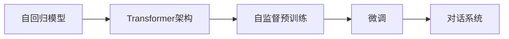

                 

# ChatGPT背后的技术：从GPT到对话系统

## 1. 背景介绍

### 1.1 问题由来
随着人工智能技术的迅猛发展，自然语言处理（Natural Language Processing, NLP）成为了一个热门的研究方向。其中，ChatGPT作为一个具有里程碑意义的对话模型，吸引了广泛关注。但许多人对ChatGPT背后的技术和原理仍存有疑惑。本文将从基础技术框架GPT开始，详细解析从GPT到ChatGPT的演进过程，帮助读者深入理解其技术细节和应用场景。

### 1.2 问题核心关键点
ChatGPT作为GPT家族的一个变种，其核心技术涵盖了自回归模型、Transformer架构、自监督预训练、微调技术等多个领域。本文将详细介绍这些核心概念，并展示其在对话系统中的应用，从技术层面上阐明ChatGPT如何实现其强大的对话能力。

### 1.3 问题研究意义
通过对ChatGPT背后技术的深入探讨，读者不仅能掌握其核心原理和实现细节，还能了解NLP技术的发展方向，为未来的AI应用开发和创新提供指导。此外，本文还将讨论ChatGPT在实际应用中的优势和挑战，为相关领域的研究者提供宝贵的实践经验。

## 2. 核心概念与联系

### 2.1 核心概念概述
在讨论ChatGPT背后的技术前，需要先明确几个关键概念：

- **自回归模型（Autoregressive Model）**：这类模型通过递归的方式，根据之前的信息生成下一个词或符号。GPT系列模型就采用了自回归模型，如GPT-2、GPT-3等。
- **Transformer架构**：Transformer是一种基于自注意力机制的神经网络架构，最初用于机器翻译，被证明在处理序列数据上具有出色的性能。GPT系列模型采用了Transformer架构，以增强其语言生成能力。
- **自监督预训练（Self-Supervised Pre-training）**：自监督预训练是指在无标签数据上进行学习，通过构建自监督任务来提高模型的泛化能力。GPT系列模型即通过自监督预训练学习了大量的语言知识。
- **微调（Fine-Tuning）**：微调是指在大规模预训练模型上，通过有监督数据进一步调整模型，使其适应该任务的具体需求。ChatGPT正是在此基础上，通过下游任务的数据对模型进行微调，从而提升其对话性能。

### 2.2 核心概念原理和架构的 Mermaid 流程图



这个流程图简要展示了从GPT到ChatGPT的技术路径：自回归模型与Transformer架构结合，通过自监督预训练获取语言知识，再通过微调优化，最终应用于对话系统。

## 3. 核心算法原理 & 具体操作步骤

### 3.1 算法原理概述
ChatGPT背后的核心算法原理主要包括自回归模型、Transformer架构、自监督预训练和微调技术。下面将逐一介绍这些关键技术及其在对话系统中的具体应用。

#### 3.1.1 自回归模型
自回归模型是指通过之前的输入生成下一个输出。在语言生成任务中，即通过前一个词预测下一个词。自回归模型通常以序列形式输入输出，具有较好的顺序性。

#### 3.1.2 Transformer架构
Transformer架构是由Google于2017年提出的，用于机器翻译任务。它采用自注意力机制，通过计算输入序列中所有位置的相对重要性，来实现序列间的信息传递。Transformer的结构由多头自注意力层、前馈神经网络和残差连接构成。

#### 3.1.3 自监督预训练
自监督预训练是指在没有标签的数据上，通过设计预训练任务来提升模型的泛化能力。常见的自监督预训练任务包括掩码语言模型（Masked Language Model, MLM）和下一句预测（Next Sentence Prediction, NSP）。以MLM为例，其任务是预测被掩码的词。

#### 3.1.4 微调
微调是指在大规模预训练模型上，通过有监督数据进一步调整模型，使其适应该任务的具体需求。微调可以显著提升模型在特定任务上的性能，特别是在下游任务数据量较小的情况下。

### 3.2 算法步骤详解
接下来，我们将详细介绍ChatGPT的微调步骤，这些步骤可以简单概括为四个部分：预训练、微调、推理和优化。

#### 3.2.1 预训练
预训练是指使用大规模无标签数据对模型进行训练，使其掌握语言的基本规则和知识。以GPT-3为例，其在训练集上进行了自监督预训练，学习到丰富的语言知识。

#### 3.2.2 微调
微调是指在预训练模型的基础上，使用下游任务的标注数据进一步训练模型。通常情况下，微调步骤会包括设置超参数、选择优化器、定义损失函数等。以ChatGPT为例，其微调步骤包括选择适当的损失函数（如交叉熵损失）、设置学习率、选择优化器（如AdamW）等。

#### 3.2.3 推理
推理是指将微调后的模型应用于实际任务中，生成自然语言文本。推理过程通常包括前向传播、解码等步骤。以ChatGPT为例，其推理过程可以包括输入处理、模型前向传播、解码输出等步骤。

#### 3.2.4 优化
优化是指通过调整模型参数，提高其在下游任务上的表现。优化步骤通常包括模型参数的更新、超参数的调整等。以ChatGPT为例，其优化过程可以包括超参数的调优、模型的迭代训练等步骤。

### 3.3 算法优缺点
#### 3.3.1 优点
1. **强大的语言生成能力**：ChatGPT基于Transformer架构，能够处理长文本，生成流畅自然的语言。
2. **广泛的应用领域**：ChatGPT可以应用于聊天机器人、客服系统、翻译等众多领域，具有广泛的应用前景。
3. **可扩展性**：ChatGPT可以根据具体任务需求进行微调，提升模型在特定任务上的性能。

#### 3.3.2 缺点
1. **数据依赖性强**：ChatGPT的性能很大程度上取决于训练数据的数量和质量，标注数据的获取和处理成本较高。
2. **过拟合风险**：微调过程中，模型容易过拟合训练数据，导致泛化能力下降。
3. **模型复杂度高**：ChatGPT作为大模型，参数量巨大，对计算资源要求较高。

### 3.4 算法应用领域
ChatGPT主要应用于以下几个领域：

- **聊天机器人**：ChatGPT能够自动生成对话内容，适用于客服、娱乐等场景。
- **机器翻译**：ChatGPT可以翻译多种语言，提升翻译质量和效率。
- **文本摘要**：ChatGPT能够自动生成文本摘要，适用于新闻、文章等长文本的压缩。
- **智能推荐**：ChatGPT可以根据用户偏好推荐内容，适用于电商、新闻等场景。

## 4. 数学模型和公式 & 详细讲解 & 举例说明

### 4.1 数学模型构建
在聊天机器人任务中，ChatGPT的数学模型可以简单表示为：

$$
P(\text{output} | \text{input}) = \prod_{t=1}^T P(\text{output}_t | \text{input}, \text{output}_{t-1})
$$

其中，$P(\text{output} | \text{input})$表示在输入$\text{input}$的情况下生成输出$\text{output}$的概率。

### 4.2 公式推导过程
对于自回归模型，其概率计算可以表示为：

$$
P(\text{output} | \text{input}) = \prod_{t=1}^T P(\text{output}_t | \text{input}, \text{output}_{t-1})
$$

其中，$P(\text{output}_t | \text{input}, \text{output}_{t-1})$表示在输入$\text{input}$和前一个输出$\text{output}_{t-1}$的情况下，生成当前输出$\text{output}_t$的概率。

以ChatGPT为例，其计算过程可以简化为：

$$
P(\text{output}_t | \text{input}, \text{output}_{t-1}) = \text{softmax}(\text{MLP}(\text{self-attention}(\text{hidden}_{t-1})))
$$

其中，$\text{MLP}$表示多层感知器，$\text{self-attention}$表示自注意力机制，$\text{hidden}_{t-1}$表示前一个隐状态。

### 4.3 案例分析与讲解
以聊天机器人为例，假设输入为“你好，我正在找一家中餐馆”，ChatGPT生成的响应可能为“请问您在哪个城市？”。其推理过程可以表示为：

1. 输入“你好，我正在找一家中餐馆”
2. 通过自回归模型预测下一个词“请”
3. 输入“请问”，通过自回归模型预测下一个词“问”
4. 输出“请问您在哪个城市？”

## 5. 项目实践：代码实例和详细解释说明

### 5.1 开发环境搭建
要搭建ChatGPT的开发环境，需要以下步骤：

1. **安装Python**：推荐使用Anaconda，通过conda安装。
2. **安装PyTorch**：通过conda或pip安装。
3. **安装Transformer库**：通过pip安装。
4. **准备数据集**：如选择Dialogue dataset，进行数据预处理。
5. **搭建模型架构**：实现自回归模型和Transformer架构。
6. **训练和微调**：使用预处理好的数据集，进行模型训练和微调。
7. **推理测试**：对微调后的模型进行推理测试，确保其对话性能。

### 5.2 源代码详细实现
下面是一个简单的聊天机器人代码实现示例：

```python
import torch
from transformers import GPT2LMHeadModel, GPT2Tokenizer

# 初始化模型和tokenizer
model = GPT2LMHeadModel.from_pretrained('gpt2')
tokenizer = GPT2Tokenizer.from_pretrained('gpt2')

# 定义模型输出函数
def generate_response(input_text):
    tokens = tokenizer.encode(input_text, return_tensors='pt')
    outputs = model.generate(tokens)
    response = tokenizer.decode(outputs[0])
    return response

# 生成对话
input_text = "你好，我正在找一家中餐馆"
response = generate_response(input_text)
print(response)
```

### 5.3 代码解读与分析
上述代码实现了一个简单的基于GPT-2的聊天机器人。其核心步骤包括：

1. **初始化模型和tokenizer**：通过from_pretrained方法，从预训练模型中加载GPT-2模型和tokenizer。
2. **定义生成函数**：将输入文本通过tokenizer编码，然后通过模型生成响应。
3. **生成对话**：输入初始对话内容，通过generate_response函数生成响应，并进行解码。

### 5.4 运行结果展示
代码执行后，可以输出模型生成的对话内容，例如：

```
请问您在哪个城市？
```

## 6. 实际应用场景

### 6.1 智能客服系统
智能客服系统是ChatGPT的重要应用场景之一。ChatGPT能够自动回答客户的咨询，提升客服效率，减轻人工压力。智能客服系统通常会使用ChatGPT进行初始对话，再根据客户的反馈进行进一步处理。

### 6.2 金融理财顾问
金融理财顾问也是ChatGPT的一个重要应用场景。通过与用户的对话，ChatGPT能够提供个性化的理财建议，帮助用户管理资产。金融理财顾问系统通常会集成多个ChatGPT模型，以覆盖不同领域的理财问题。

### 6.3 教育辅导系统
教育辅导系统是ChatGPT在教育领域的典型应用。ChatGPT能够提供个性化辅导，帮助学生解决学习中的问题。教育辅导系统通常会集成多个ChatGPT模型，覆盖不同学科的知识领域。

### 6.4 未来应用展望
随着ChatGPT技术的不断进步，其应用领域将不断拓展。未来，ChatGPT可能会在医疗咨询、心理咨询、法律咨询等领域得到广泛应用。此外，ChatGPT在多语言翻译、文化差异处理等方面也有广阔的应用前景。

## 7. 工具和资源推荐

### 7.1 学习资源推荐
1. **《深度学习》（Ian Goodfellow等）**：深入讲解深度学习的基础理论和算法，推荐给初入此领域的学习者。
2. **《Natural Language Processing with PyTorch》（Eli Stevens等）**：讲解PyTorch在NLP中的应用，适合有一定深度学习基础的读者。
3. **《Transformers》（Ashish Vaswani等）**：详细讲解Transformer架构，适合对Transformer感兴趣的读者。

### 7.2 开发工具推荐
1. **PyTorch**：Python语言的高性能深度学习框架，支持GPU加速。
2. **TensorFlow**：Google开发的深度学习框架，支持GPU和TPU加速。
3. **Hugging Face Transformers库**：提供多种预训练模型和工具，适合NLP任务的开发。
4. **Jupyter Notebook**：Python代码的交互式开发环境，方便实验调试。
5. **TensorBoard**：TensorFlow的可视化工具，用于监控训练过程。

### 7.3 相关论文推荐
1. **《Attention is All You Need》（Ashish Vaswani等）**：Transformer架构的原始论文，介绍自注意力机制的实现。
2. **《Language Models are Unsupervised Multitask Learners》（Alexander M. Rush等）**：介绍自监督预训练的原理和效果。
3. **《The Curious Case of Neural Chatbots》（Johan Schuster等）**：讲解聊天机器人模型的构建和优化。

## 8. 总结：未来发展趋势与挑战

### 8.1 研究成果总结
ChatGPT作为GPT家族的一个变种，其核心技术包括自回归模型、Transformer架构、自监督预训练和微调技术。这些技术共同作用，使得ChatGPT能够高效生成自然语言，并应用于聊天机器人、机器翻译、文本摘要等多个领域。

### 8.2 未来发展趋势
未来，ChatGPT可能会在以下几个方面取得突破：

1. **多模态融合**：ChatGPT将逐渐支持多种模态数据，如图像、视频、音频等，提升其在多模态场景下的表现。
2. **上下文理解**：ChatGPT将逐步具备更强的上下文理解能力，能够在更复杂的对话场景中保持连贯性。
3. **跨领域应用**：ChatGPT将在更多领域得到应用，如医疗、法律、金融等，为这些领域的决策和沟通提供支持。
4. **知识图谱集成**：ChatGPT将集成知识图谱，提升其在专业领域的知识和推理能力。

### 8.3 面临的挑战
尽管ChatGPT取得了显著进展，但在实际应用中仍面临诸多挑战：

1. **数据依赖性强**：ChatGPT的性能很大程度上取决于标注数据的质量和数量。
2. **泛化能力有限**：ChatGPT在特定领域的表现可能优于通用领域，需要更多的领域数据进行微调。
3. **过拟合风险**：ChatGPT在微调过程中容易过拟合，需要更多技术手段进行控制。
4. **推理效率低**：大模型推理过程计算量大，需要优化以提升推理效率。

### 8.4 研究展望
未来的研究将主要集中在以下几个方面：

1. **优化微调算法**：进一步提高微调效率和效果，减少对标注数据的依赖。
2. **增强泛化能力**：提升ChatGPT在不同领域、不同数据分布下的表现。
3. **优化推理效率**：通过模型压缩、推理加速等手段，提高ChatGPT的推理效率。
4. **提高模型鲁棒性**：增强ChatGPT对噪声和异常数据的鲁棒性，提升其在实际应用中的稳定性。

## 9. 附录：常见问题与解答

**Q1: ChatGPT如何实现多轮对话？**
A: ChatGPT通过上下文记忆机制实现多轮对话。在每轮对话中，模型会保存上一步的输入和输出，并作为当前对话的上下文信息。这样，ChatGPT能够根据上下文信息，生成更加连贯的对话内容。

**Q2: 如何防止ChatGPT生成有害内容？**
A: 防止ChatGPT生成有害内容的方法主要包括：
1. **数据过滤**：在训练数据中过滤掉有害内容，避免模型学习到这些内容。
2. **模型约束**：通过设定模型行为准则，如避免生成偏见性言论，限制有害内容的输出。
3. **人工干预**：在生成过程中，结合人工干预，及时发现并纠正有害内容。

**Q3: 如何提高ChatGPT在多语言场景下的表现？**
A: 提高ChatGPT在多语言场景下的表现，主要通过以下方法：
1. **多语言预训练**：在多种语言的数据上进行预训练，提高模型的多语言能力。
2. **多语言微调**：在特定语言的数据上进行微调，提升模型在该语言下的表现。
3. **语言转换**：通过机器翻译技术，将不同语言的数据转换为统一的语言格式，方便模型处理。

**Q4: ChatGPT的训练过程需要多长时间？**
A: ChatGPT的训练过程需要较长的计算时间和计算资源。通常情况下，训练一个大规模模型可能需要数天或数周的时间。具体的训练时间取决于模型规模和硬件配置。

**Q5: ChatGPT的推理速度如何？**
A: ChatGPT的推理速度取决于硬件配置和模型规模。在GPU和TPU等高性能计算设备上，推理速度可以较快。但在CPU等普通计算设备上，推理速度相对较慢。

---

作者：禅与计算机程序设计艺术 / Zen and the Art of Computer Programming

