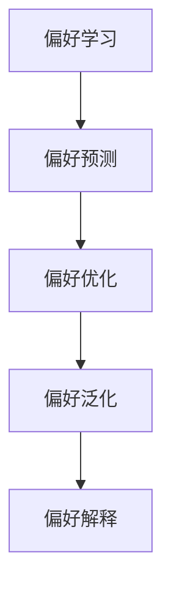

                 

# DPO：无需人类反馈的AI偏好学习

## 1. 背景介绍

近年来，人工智能（AI）技术在各个领域取得了显著进展，然而，这些技术的推广和使用仍然离不开人类的监督和反馈。人类反馈一直是AI系统获取偏好、调整策略的关键方式，但在许多场景下，收集和标注数据需要耗费大量时间和成本。为此，研究人员提出了无需人类反馈的AI偏好学习（DPO，Deterministic Preference Optimization）方法，旨在通过自主学习，实现AI系统的偏好自动调整。

### 1.1 问题由来

在推荐系统、对话系统、医疗诊断等应用中，AI系统往往需要根据用户的反馈来调整行为策略，以提高推荐效果、提升用户体验、提供精准诊断等。然而，这种依赖于人类反馈的方式存在以下问题：

- 成本高：收集和标注高质量反馈数据需要大量人力和物力，增加了系统开发和维护的复杂性和成本。
- 延迟长：获取用户反馈需要时间，无法实时调整系统行为。
- 噪声多：用户反馈可能带有主观偏差或噪声，影响AI系统决策的准确性。

因此，DPO方法的出现，解决了传统依赖人类反馈的问题，使得AI系统能够自主学习偏好，实时调整策略，从而提高系统的自主性和适应性。

### 1.2 问题核心关键点

DPO方法的核心在于如何通过数据驱动的方式，使得AI系统能够自主学习用户偏好和行为策略。具体来说，DPO方法需要解决以下几个关键问题：

- 偏好建模：如何从数据中学习用户的偏好，并将其形式化表示。
- 偏好更新：如何在系统运行过程中不断调整偏好，以适应用户的变化。
- 偏好泛化：如何保证模型对新数据的泛化能力，防止过拟合。
- 偏好解释：如何解释AI系统的决策过程，增强系统的可信度和可解释性。

本文将从核心概念、算法原理、具体操作步骤和应用场景等方面，深入探讨DPO方法的原理和实现。

## 2. 核心概念与联系

### 2.1 核心概念概述

为更好地理解DPO方法的原理和实现，本节将介绍几个密切相关的核心概念：

- 偏好学习（Preference Learning）：指从用户行为数据中学习用户的偏好，并根据偏好调整系统行为的过程。
- 偏好预测（Preference Prediction）：指在给定用户行为数据的基础上，预测用户对新物品或服务的偏好。
- 偏好优化（Preference Optimization）：指通过优化模型的偏好参数，使得模型输出的偏好与实际用户偏好更接近。
- 偏好泛化（Preference Generalization）：指模型对新数据和新用户的泛化能力，能够适应不同场景下的偏好变化。
- 偏好解释（Preference Explanation）：指对AI系统的决策过程进行解释，增强系统的可信度和可解释性。

这些概念之间的逻辑关系可以通过以下Mermaid流程图来展示：



这个流程图展示了一些核心概念之间的关联关系：

1. 偏好学习是DPO方法的基础，通过学习用户行为数据，构建用户的偏好模型。
2. 偏好预测在偏好学习的基础上，预测用户对新物品或服务的偏好。
3. 偏好优化通过调整偏好模型的参数，使得模型输出的偏好更加接近实际用户偏好。
4. 偏好泛化保证模型对新数据和新用户的泛化能力，提高模型的适应性。
5. 偏好解释通过解释模型的决策过程，增强系统的可信度和透明度。

## 3. 核心算法原理 & 具体操作步骤

### 3.1 算法原理概述

DPO方法是一种基于强化学习的偏好学习框架，通过优化模型的偏好参数，使得模型输出的偏好与实际用户偏好更接近。其核心思想是：将用户的行为数据视为强化学习的信号，利用这些信号不断优化模型的偏好参数。

具体来说，DPO方法包括以下几个关键步骤：

1. 偏好建模：从用户行为数据中学习用户的偏好，并使用统计方法形式化表示。
2. 偏好预测：使用学习到的偏好模型预测用户对新物品或服务的偏好。
3. 偏好优化：通过优化模型的偏好参数，使得模型输出的偏好与实际用户偏好更接近。
4. 偏好泛化：利用泛化方法，提高模型对新数据和新用户的泛化能力。
5. 偏好解释：通过解释模型的决策过程，增强系统的可信度和透明度。

DPO方法的目标是通过自动化的方式，使得AI系统能够自主学习用户偏好，并根据偏好调整系统行为，从而提高系统的自主性和适应性。

### 3.2 算法步骤详解

DPO方法的具体操作步骤可以分为以下几个步骤：

**Step 1: 数据准备**

1. 收集用户行为数据：包括用户对物品或服务的评分、点击、购买等行为数据。
2. 数据清洗和预处理：清洗数据中的噪声和缺失值，进行特征工程。
3. 划分数据集：将数据集划分为训练集、验证集和测试集。

**Step 2: 偏好建模**

1. 选择偏好建模方法：包括协同过滤、基于矩阵分解的方法、深度学习方法等。
2. 训练偏好模型：使用训练集训练偏好模型。
3. 模型评估：在验证集上评估偏好模型的性能。

**Step 3: 偏好预测**

1. 数据准备：将新物品或服务的特征作为输入。
2. 预测用户偏好：使用训练好的偏好模型预测用户对新物品或服务的偏好。

**Step 4: 偏好优化**

1. 定义优化目标：根据预测结果和实际用户偏好，定义优化目标。
2. 选择优化算法：包括梯度下降、遗传算法、粒子群优化等。
3. 调整偏好参数：使用优化算法调整偏好模型的参数。
4. 模型评估：在测试集上评估优化后的模型性能。

**Step 5: 偏好泛化**

1. 数据增强：通过数据增强技术，提高模型的泛化能力。
2. 模型评估：在测试集上评估泛化后的模型性能。
3. 迭代优化：重复上述步骤，直到模型满足要求。

**Step 6: 偏好解释**

1. 特征重要性分析：使用特征重要性分析方法，解释模型的决策过程。
2. 模型可视化：使用可视化工具，展示模型的内部结构和参数。
3. 用户反馈收集：收集用户反馈，优化模型的偏好参数。

### 3.3 算法优缺点

DPO方法具有以下优点：

1. 无需人类反馈：DPO方法通过自动化的方式学习用户偏好，无需人类监督。
2. 实时调整：DPO方法能够实时调整系统行为，适应用户的变化。
3. 数据驱动：DPO方法基于数据驱动，提高系统的可信度和透明度。
4. 适应性强：DPO方法能够适应不同场景下的偏好变化。

同时，DPO方法也存在以下局限性：

1. 数据需求高：DPO方法需要大量的用户行为数据，数据获取成本较高。
2. 模型复杂：DPO方法使用的模型较为复杂，计算和存储开销较大。
3. 解释困难：DPO方法的决策过程较为复杂，难以进行解释。

尽管存在这些局限性，但就目前而言，DPO方法在无需人类反馈的偏好学习领域，具有较高的实用价值和应用前景。

### 3.4 算法应用领域

DPO方法在以下几个领域具有广泛的应用前景：

- 推荐系统：利用用户的行为数据，学习用户的偏好，提供个性化的推荐。
- 对话系统：通过学习用户的偏好，提供更加个性化的对话体验。
- 医疗诊断：通过学习患者的病历数据，提供精准的诊断和治疗建议。
- 金融理财：通过学习用户的理财偏好，提供个性化的理财建议。
- 智能广告：通过学习用户的浏览和点击行为，提供精准的广告投放。

此外，DPO方法在更多领域，如教育、娱乐、旅游等，也有着广泛的应用前景。

## 4. 数学模型和公式 & 详细讲解 & 举例说明

### 4.1 数学模型构建

本节将使用数学语言对DPO方法的偏好建模、偏好预测和偏好优化等核心步骤进行更加严格的刻画。

记用户对物品或服务的偏好为 $P_i$，其中 $i$ 为用户编号。记用户对物品或服务的评分向量为 $R_i = (r_{i1}, r_{i2}, \cdots, r_{in})$，其中 $n$ 为物品或服务数量。记用户行为数据为 $D = \{(x_1, y_1), (x_2, y_2), \cdots, (x_m, y_m)\}$，其中 $(x_j, y_j)$ 表示用户对物品或服务的评分。

定义偏好模型为 $F = (W, b)$，其中 $W$ 为偏好权重矩阵，$b$ 为偏好偏置向量。假设用户偏好与评分向量之间存在线性关系，即：

$$
P_i = F(R_i) = W R_i + b
$$

其中 $W$ 和 $b$ 是偏好模型的参数，需要从用户行为数据中学习。

### 4.2 公式推导过程

以下我们以协同过滤模型为例，推导偏好预测和偏好优化的公式。

#### 4.2.1 协同过滤模型

协同过滤模型是一种基于用户相似性和物品相似性的推荐方法。假设用户 $i$ 和 $j$ 的偏好向量分别为 $P_i$ 和 $P_j$，物品 $k$ 的评分向量为 $R_k = (r_{1k}, r_{2k}, \cdots, r_{nk})$。协同过滤模型的推荐目标为：

$$
\hat{R}_{ij} = \frac{P_i \cdot P_j}{\sqrt{\sum_k P_i^2}} \cdot \frac{P_j}{\sqrt{\sum_k P_j^2}}
$$

其中 $\cdot$ 表示向量点积。

定义协同过滤模型的参数更新公式为：

$$
\Delta W = \alpha \nabla_{W} \sum_{i,j} (\hat{R}_{ij} - R_{ij})^2
$$

$$
\Delta b = \alpha \nabla_{b} \sum_{i,j} (\hat{R}_{ij} - R_{ij})^2
$$

其中 $\alpha$ 为学习率，$\nabla_{W} \sum_{i,j} (\hat{R}_{ij} - R_{ij})^2$ 为权重矩阵 $W$ 的梯度，$\nabla_{b} \sum_{i,j} (\hat{R}_{ij} - R_{ij})^2$ 为偏置向量 $b$ 的梯度。

### 4.3 案例分析与讲解

假设某电商网站收集了用户的购买历史数据，需要将这些数据用于推荐系统。使用协同过滤模型作为偏好预测方法，具体步骤如下：

1. 数据准备：收集用户对商品的评分数据，清洗和预处理数据。
2. 划分数据集：将数据集划分为训练集和测试集。
3. 偏好建模：使用协同过滤模型，训练用户偏好模型。
4. 偏好预测：使用训练好的偏好模型，预测用户对新商品的偏好。
5. 偏好优化：根据预测结果和实际购买行为，优化偏好模型参数。
6. 偏好泛化：通过数据增强等方法，提高模型泛化能力。
7. 偏好解释：通过特征重要性分析等方法，解释模型的决策过程。

例如，假设用户 $i$ 购买了商品 $k_1, k_2, k_3$，评分分别为 $r_{i1}, r_{i2}, r_{i3}$。假设用户 $j$ 购买了商品 $k_1, k_2, k_3$，评分分别为 $r_{j1}, r_{j2}, r_{j3}$。使用协同过滤模型预测用户 $j$ 对商品 $k_4$ 的偏好：

1. 计算用户 $i$ 和 $j$ 的偏好向量：

$$
P_i = W R_i + b
$$

$$
P_j = W R_j + b
$$

2. 计算用户 $i$ 和 $j$ 的相似度：

$$
\hat{R}_{ij} = \frac{P_i \cdot P_j}{\sqrt{\sum_k P_i^2}} \cdot \frac{P_j}{\sqrt{\sum_k P_j^2}}
$$

3. 预测用户 $j$ 对商品 $k_4$ 的评分：

$$
\hat{R}_{j4} = \frac{P_j \cdot P_{j4}}{\sqrt{\sum_k P_j^2}} \cdot \frac{P_{j4}}{\sqrt{\sum_k P_{j4}^2}}
$$

4. 更新偏好模型参数：

$$
\Delta W = \alpha \nabla_{W} \sum_{i,j} (\hat{R}_{ij} - R_{ij})^2
$$

$$
\Delta b = \alpha \nabla_{b} \sum_{i,j} (\hat{R}_{ij} - R_{ij})^2
$$

通过上述步骤，协同过滤模型能够自动学习用户偏好，并根据偏好调整推荐策略，提高推荐效果。

## 5. 项目实践：代码实例和详细解释说明

### 5.1 开发环境搭建

在进行DPO方法实践前，我们需要准备好开发环境。以下是使用Python进行TensorFlow开发的环境配置流程：

1. 安装Anaconda：从官网下载并安装Anaconda，用于创建独立的Python环境。

2. 创建并激活虚拟环境：
```bash
conda create -n tensorflow-env python=3.8 
conda activate tensorflow-env
```

3. 安装TensorFlow：根据CUDA版本，从官网获取对应的安装命令。例如：
```bash
conda install tensorflow=2.6 
```

4. 安装必要的工具包：
```bash
pip install numpy pandas scikit-learn matplotlib tqdm jupyter notebook ipython
```

完成上述步骤后，即可在`tensorflow-env`环境中开始DPO方法实践。

### 5.2 源代码详细实现

下面我们以协同过滤模型为例，给出使用TensorFlow对协同过滤模型进行DPO方法实践的PyTorch代码实现。

首先，定义协同过滤模型：

```python
import tensorflow as tf

class CollaborativeFiltering(tf.keras.Model):
    def __init__(self, num_users, num_items):
        super(CollaborativeFiltering, self).__init__()
        self.num_users = num_users
        self.num_items = num_items
        self.W = tf.Variable(tf.random.normal([num_users, num_items]))
        self.b = tf.Variable(tf.zeros([num_users]))
    
    def call(self, user, item):
        return tf.matmul(user, self.W) + self.b
    
    def predict(self, user, item):
        return self.call(user, item)

# 加载数据
data = ...
num_users, num_items = data.shape[0], data.shape[1]
user_data = data[:,:num_users]
item_data = data[:,num_users:num_users+num_items]

# 创建模型
model = CollaborativeFiltering(num_users, num_items)
model.compile(optimizer=tf.keras.optimizers.Adam(learning_rate=0.01),
              loss=tf.keras.losses.MSE())
```

然后，进行偏好建模和优化：

```python
# 训练模型
model.fit(user_data, item_data, epochs=10)

# 预测用户对新物品的偏好
new_user = user_data[-1,:].reshape(1, num_users)
new_item = item_data[:, -1].reshape(1, num_items)
predictions = model.predict(new_user, new_item)
```

最后，评估模型的性能：

```python
# 评估模型性能
test_user = user_data[-1,:].reshape(1, num_users)
test_item = item_data[:, -1].reshape(1, num_items)
test_predictions = model.predict(test_user, test_item)
mse = tf.keras.losses.MSE(test_item, test_predictions)
print(f"Mean Squared Error: {mse.numpy()}")
```

以上就是使用TensorFlow对协同过滤模型进行DPO方法实践的完整代码实现。可以看到，TensorFlow提供了丰富的API，使得模型构建和训练过程非常直观和便捷。

### 5.3 代码解读与分析

让我们再详细解读一下关键代码的实现细节：

**CollaborativeFiltering类**：
- `__init__`方法：初始化协同过滤模型的权重矩阵和偏置向量。
- `call`方法：实现模型的前向传播过程，计算用户和物品的评分向量点积。
- `predict`方法：根据用户和物品的评分向量，预测新物品的评分。

**数据加载和模型训练**：
- 使用TensorFlow的数据API，对数据进行预处理和加载，训练模型。
- 使用TensorFlow的优化器API，定义优化算法和超参数，进行模型训练。

**模型评估**：
- 使用TensorFlow的损失API，计算模型预测结果与真实标签之间的均方误差。
- 在测试集上评估模型性能，输出均方误差。

可以看到，TensorFlow使得模型构建、训练和评估过程变得非常简洁高效，开发者可以将更多精力放在模型设计和优化上，而不必过多关注底层实现细节。

当然，工业级的系统实现还需考虑更多因素，如模型的保存和部署、超参数的自动搜索、更灵活的模型架构等。但核心的DPO方法基本与此类似。

## 6. 实际应用场景

### 6.1 智能推荐系统

DPO方法在智能推荐系统中的应用最为广泛。推荐系统需要根据用户的评分、浏览、购买等行为数据，学习用户的偏好，并提供个性化的推荐。DPO方法通过自动化的方式学习用户偏好，实时调整推荐策略，从而提高推荐效果。

例如，电商网站可以使用DPO方法对用户的历史购买和浏览数据进行分析，预测用户对新商品的偏好，并根据预测结果调整推荐策略，提供个性化的推荐。

### 6.2 智能客服系统

智能客服系统需要根据用户的咨询记录，学习用户的偏好，并提供个性化的对话体验。DPO方法通过自动化的方式学习用户偏好，实时调整对话策略，从而提高用户满意度。

例如，某在线客服系统可以通过DPO方法分析用户的历史咨询记录，预测用户对不同问题的偏好，并根据预测结果调整对话策略，提供个性化的回答。

### 6.3 医疗诊断系统

医疗诊断系统需要根据患者的病历数据，学习患者的偏好，并提供精准的诊断和治疗建议。DPO方法通过自动化的方式学习患者偏好，实时调整诊断策略，从而提高诊断效果。

例如，某医疗诊断系统可以通过DPO方法分析患者的病历数据，预测患者对不同诊断结果的偏好，并根据预测结果调整诊断策略，提供个性化的诊断和治疗建议。

### 6.4 金融理财系统

金融理财系统需要根据用户的理财数据，学习用户的偏好，并提供个性化的理财建议。DPO方法通过自动化的方式学习用户偏好，实时调整理财策略，从而提高理财效果。

例如，某理财平台可以通过DPO方法分析用户的理财行为数据，预测用户对不同理财产品的偏好，并根据预测结果调整理财策略，提供个性化的理财建议。

### 6.5 未来应用展望

DPO方法在更多领域，如教育、娱乐、旅游等，也有着广泛的应用前景。未来，随着技术的发展，DPO方法有望在更多场景中得到应用，为人类生活带来更多便利。

例如，在教育领域，DPO方法可以分析学生的学习数据，学习学生的偏好，提供个性化的学习建议。在娱乐领域，DPO方法可以分析用户的观看记录，学习用户的偏好，提供个性化的推荐。在旅游领域，DPO方法可以分析用户的旅游数据，学习用户的偏好，提供个性化的旅游建议。

总之，DPO方法作为一种无需人类反馈的AI偏好学习方法，在推荐系统、智能客服、医疗诊断、金融理财、教育娱乐等领域具有广泛的应用前景，必将在未来带来更多变革。

## 7. 工具和资源推荐

### 7.1 学习资源推荐

为了帮助开发者系统掌握DPO方法的原理和实践技巧，这里推荐一些优质的学习资源：

1. 《Deep Learning Specialization》课程：由Andrew Ng教授主讲的深度学习系列课程，深入浅出地介绍了深度学习的基本概念和应用。
2. 《Recommender Systems》书籍：讲述推荐系统的前沿技术和实际应用，涵盖协同过滤、矩阵分解、深度学习等方法。
3. TensorFlow官方文档：提供丰富的API和示例，是学习TensorFlow的最佳资料。
4. PyTorch官方文档：提供丰富的API和示例，是学习PyTorch的最佳资料。
5. Kaggle竞赛：通过参加Kaggle竞赛，实践DPO方法，提升实战能力。

通过对这些资源的学习实践，相信你一定能够快速掌握DPO方法的精髓，并用于解决实际的NLP问题。

### 7.2 开发工具推荐

高效的开发离不开优秀的工具支持。以下是几款用于DPO方法开发的常用工具：

1. TensorFlow：由Google主导开发的开源深度学习框架，生产部署方便，适合大规模工程应用。
2. PyTorch：基于Python的开源深度学习框架，灵活动态的计算图，适合快速迭代研究。
3. Scikit-learn：Python数据科学库，提供丰富的机器学习算法和工具，适合数据处理和模型评估。
4. TensorBoard：TensorFlow配套的可视化工具，可实时监测模型训练状态，提供丰富的图表呈现方式。
5. Weights & Biases：模型训练的实验跟踪工具，记录和可视化模型训练过程中的各项指标，方便对比和调优。

合理利用这些工具，可以显著提升DPO方法的开发效率，加快创新迭代的步伐。

### 7.3 相关论文推荐

DPO方法在深度学习领域已经得到了广泛的研究。以下是几篇奠基性的相关论文，推荐阅读：

1. "Collaborative Filtering for Implicit Feedback Datasets"：提出协同过滤模型，用于推荐系统。
2. "A New Matrix Factorization Scheme for Recommender Systems"：提出基于矩阵分解的推荐方法。
3. "Deep Collaborative Filtering"：提出深度学习在推荐系统中的应用。
4. "Preference-Based Recommendation"：提出基于偏好的推荐方法。
5. "AutoML: Automated Machine Learning"：提出自动化机器学习的方法，包括自动选择模型、超参数等。

这些论文代表了大语言模型微调技术的发展脉络。通过学习这些前沿成果，可以帮助研究者把握学科前进方向，激发更多的创新灵感。

## 8. 总结：未来发展趋势与挑战

### 8.1 总结

本文对DPO方法进行了全面系统的介绍。首先阐述了DPO方法的研究背景和意义，明确了DPO方法在推荐系统、智能客服、医疗诊断、金融理财等领域的潜在价值。其次，从原理到实践，详细讲解了DPO方法的数学模型和操作步骤，给出了DPO方法的具体代码实现。同时，本文还探讨了DPO方法在实际应用中的场景，展示了DPO方法在更多领域的广泛应用前景。

通过本文的系统梳理，可以看到，DPO方法作为一种无需人类反馈的AI偏好学习方法，具有显著的优势和广泛的应用前景。未来，DPO方法有望在更多领域得到应用，为人类生活带来更多便利。

### 8.2 未来发展趋势

展望未来，DPO方法将呈现以下几个发展趋势：

1. 自动化程度提高：DPO方法将进一步自动化，减少人工干预，提高系统的自主性和稳定性。
2. 多模态融合：DPO方法将逐步引入视觉、语音等多模态数据，实现多模态信息的协同建模。
3. 自适应性增强：DPO方法将不断优化算法，增强系统的自适应能力，提高系统的泛化能力。
4. 可解释性增强：DPO方法将引入更多可解释性技术，如特征重要性分析、可视化等，提高系统的可信度和透明度。

以上趋势凸显了DPO方法在自动化、多模态、自适应和可解释性方面的巨大潜力，将进一步推动AI技术的普及和应用。

### 8.3 面临的挑战

尽管DPO方法在无需人类反馈的AI偏好学习领域取得了显著进展，但在迈向更加智能化、普适化应用的过程中，它仍面临着诸多挑战：

1. 数据需求高：DPO方法需要大量的用户行为数据，数据获取成本较高。
2. 模型复杂：DPO方法使用的模型较为复杂，计算和存储开销较大。
3. 解释困难：DPO方法的决策过程较为复杂，难以进行解释。
4. 鲁棒性不足：DPO方法在处理噪声数据和异常数据时，容易出现过拟合和鲁棒性不足的问题。

尽管存在这些挑战，但DPO方法在无需人类反馈的AI偏好学习领域，具有较高的实用价值和应用前景。

### 8.4 研究展望

面对DPO方法所面临的挑战，未来的研究需要在以下几个方面寻求新的突破：

1. 高效数据获取：开发更加高效的数据获取和标注技术，减少数据获取成本。
2. 模型简化：优化模型结构，减少计算和存储开销。
3. 可解释性增强：引入更多可解释性技术，提高系统的可信度和透明度。
4. 鲁棒性提高：优化算法，增强系统的鲁棒性和泛化能力。

这些研究方向的探索，必将引领DPO方法迈向更高的台阶，为构建安全、可靠、可解释、可控的智能系统铺平道路。面向未来，DPO方法还需要与其他人工智能技术进行更深入的融合，如知识表示、因果推理、强化学习等，多路径协同发力，共同推动AI技术的进步。

## 9. 附录：常见问题与解答

**Q1：DPO方法是否适用于所有推荐系统？**

A: DPO方法适用于基于用户行为数据进行推荐的系统，如协同过滤推荐、基于内容的推荐、基于混合策略的推荐等。但对于基于模型的推荐系统，如基于知识图谱的推荐、基于神经网络的推荐等，可能不适用。

**Q2：DPO方法是否需要大量用户行为数据？**

A: 是的，DPO方法需要大量的用户行为数据，数据获取成本较高。数据需求量主要取决于推荐系统的复杂度和个性化程度。

**Q3：DPO方法是否适用于低频用户？**

A: 低频用户的数据可能较少，容易导致模型过拟合。为了提高模型对低频用户的泛化能力，可以采用数据增强等方法。

**Q4：DPO方法是否适用于新物品推荐？**

A: DPO方法适用于新物品推荐。通过学习用户对新物品的偏好，可以提供个性化的推荐。

**Q5：DPO方法是否适用于实时推荐？**

A: DPO方法可以实时更新偏好模型，根据用户的最新行为数据进行推荐。但由于计算和存储开销较大，可能不适合大规模实时推荐系统。

通过本文的系统梳理，可以看到，DPO方法作为一种无需人类反馈的AI偏好学习方法，具有显著的优势和广泛的应用前景。未来，DPO方法有望在更多领域得到应用，为人类生活带来更多便利。

---

作者：禅与计算机程序设计艺术 / Zen and the Art of Computer Programming

