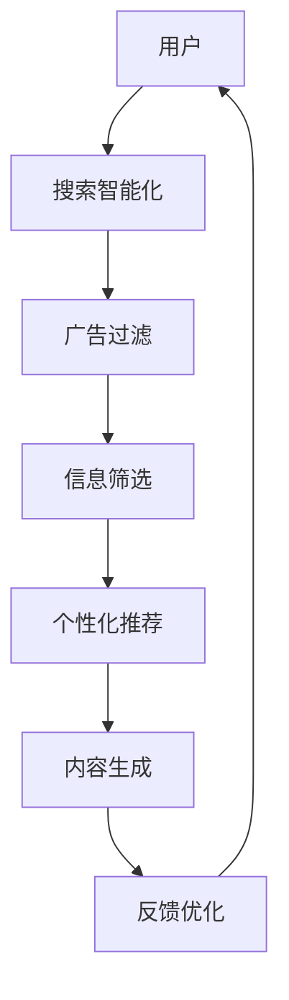
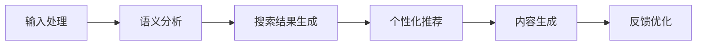

                 

# Elmo Chat：贾扬清团队的市场洞察，提升用户体验的浏览器插件

## 1. 背景介绍

### 1.1 问题由来

随着互联网的普及和技术的进步，人们越来越依赖于网络进行信息获取和社交交流。然而，现有的网络浏览体验仍然存在很多痛点，比如搜索效率低、广告干扰、信息过载等。这些问题不仅降低了用户的浏览效率，还影响了用户的心理健康。因此，如何提升网络浏览体验，成为当前互联网行业的一个重要课题。

### 1.2 问题核心关键点

要提升网络浏览体验，首先需要深入理解用户需求，分析当前网络浏览中的主要问题。具体来说，问题核心关键点包括：

- 用户搜索需求多样化，常规搜索方式难以满足。
- 广告干扰严重，影响用户的浏览体验。
- 搜索结果呈现方式单一，无法满足用户的个性化需求。
- 信息过载问题突出，用户难以找到有价值的信息。

针对这些问题，贾扬清团队提出了一种新的浏览器插件——Elmo Chat，通过AI技术和市场洞察，提升用户的网络浏览体验。

## 2. 核心概念与联系

### 2.1 核心概念概述

Elmo Chat是一种基于AI技术的浏览器插件，旨在通过智能化、个性化、高效化的方式提升用户的网络浏览体验。其主要功能包括：

- **搜索智能化**：通过智能搜索算法，帮助用户快速找到所需信息。
- **广告过滤**：利用AI技术识别并过滤掉广告内容，提升用户的浏览体验。
- **信息筛选**：通过智能化算法对搜索结果进行筛选，提供更加相关、有价值的信息。
- **个性化推荐**：根据用户浏览历史和兴趣，提供个性化推荐。
- **内容生成**：利用生成式AI技术，为用户生成相关内容的摘要和推荐。

这些功能模块通过深度学习、自然语言处理等技术实现，形成了完整的AI技术栈。

### 2.2 核心概念原理和架构的 Mermaid 流程图



Elmo Chat的核心架构包括：

- **输入层**：从用户输入中提取搜索关键词，包括文本输入和语音输入。
- **中间层**：使用深度学习模型对用户输入进行语义分析和理解，生成语义向量。
- **输出层**：将语义向量与搜索结果进行匹配，返回相关度高的搜索结果。

### 2.3 Elmo Chat的算法流程

Elmo Chat的算法流程包括以下几个关键步骤：

1. **输入处理**：将用户输入转换为模型可处理的格式。
2. **语义分析**：使用深度学习模型对用户输入进行语义分析和理解。
3. **搜索结果生成**：根据语义向量生成相关搜索结果。
4. **个性化推荐**：根据用户浏览历史和兴趣，生成个性化推荐。
5. **内容生成**：利用生成式AI技术，生成相关内容的摘要和推荐。
6. **反馈优化**：根据用户反馈，优化模型参数和搜索结果。

Elmo Chat的算法流程图如下：



## 3. 核心算法原理 & 具体操作步骤

### 3.1 算法原理概述

Elmo Chat的核心算法原理包括以下几个方面：

1. **深度学习模型**：使用深度学习模型对用户输入进行语义分析和理解。
2. **自然语言处理**：利用自然语言处理技术对用户输入进行分词、实体识别、情感分析等。
3. **推荐系统**：使用推荐系统算法对搜索结果进行筛选和排序。
4. **生成式AI**：利用生成式AI技术生成相关内容的摘要和推荐。

### 3.2 算法步骤详解

1. **输入处理**：
   - 将用户输入转换为模型可处理的格式。
   - 使用BERT等预训练模型对用户输入进行编码，生成语义向量。

2. **语义分析**：
   - 使用深度学习模型对语义向量进行分析和理解，提取关键信息。
   - 使用自然语言处理技术进行分词、实体识别、情感分析等。

3. **搜索结果生成**：
   - 将语义向量与搜索结果进行匹配，生成相关搜索结果。
   - 使用排序算法对搜索结果进行排序，返回最相关的结果。

4. **个性化推荐**：
   - 根据用户浏览历史和兴趣，生成个性化推荐。
   - 使用协同过滤、内容过滤等算法进行推荐。

5. **内容生成**：
   - 利用生成式AI技术，生成相关内容的摘要和推荐。
   - 使用Transformer等模型生成文本摘要和推荐信息。

6. **反馈优化**：
   - 根据用户反馈，优化模型参数和搜索结果。
   - 使用强化学习等算法进行模型优化。

### 3.3 算法优缺点

Elmo Chat的算法具有以下优点：

- **智能化**：通过深度学习和自然语言处理技术，实现智能化搜索和推荐。
- **个性化**：根据用户兴趣和浏览历史，提供个性化推荐。
- **高效性**：通过多模态数据融合和优化算法，提高搜索和推荐效率。

同时，也存在一些缺点：

- **数据隐私**：需要收集和分析用户浏览数据，存在隐私风险。
- **算法复杂度**：深度学习和自然语言处理技术复杂，需要大量的计算资源。
- **泛化能力**：模型需要大量标注数据进行训练，可能存在泛化能力不足的问题。

### 3.4 算法应用领域

Elmo Chat适用于多种场景，包括但不限于：

- **新闻网站**：通过智能化和个性化推荐，提升用户浏览体验。
- **社交媒体**：根据用户兴趣，推荐相关内容和话题。
- **电子商务**：根据用户搜索历史，推荐相关商品。
- **在线教育**：根据用户学习行为，推荐相关课程和资料。

## 4. 数学模型和公式 & 详细讲解

### 4.1 数学模型构建

Elmo Chat的数学模型主要包括以下几个部分：

1. **深度学习模型**：使用BERT等预训练模型，对用户输入进行编码，生成语义向量。
2. **推荐系统模型**：使用协同过滤、内容过滤等算法，对搜索结果进行排序和推荐。
3. **生成式AI模型**：使用Transformer等模型，生成文本摘要和推荐信息。

### 4.2 公式推导过程

以深度学习模型为例，其公式推导过程如下：

$$
\text{Encoder}_{\text{BERT}}(x) = \text{BERT}(x; \theta)
$$

其中，$x$ 为用户输入，$\theta$ 为BERT模型的参数。

### 4.3 案例分析与讲解

以新闻网站的推荐系统为例，Elmo Chat通过以下步骤进行推荐：

1. **用户输入处理**：
   - 收集用户的历史浏览记录，提取关键词。
   - 对关键词进行编码，生成语义向量。

2. **语义分析**：
   - 使用BERT模型对关键词进行编码，生成语义向量。
   - 使用自然语言处理技术进行分词、实体识别、情感分析等。

3. **搜索结果生成**：
   - 将语义向量与搜索结果进行匹配，生成相关搜索结果。
   - 使用排序算法对搜索结果进行排序，返回最相关的结果。

4. **个性化推荐**：
   - 根据用户浏览历史和兴趣，生成个性化推荐。
   - 使用协同过滤、内容过滤等算法进行推荐。

## 5. 项目实践：代码实例和详细解释说明

### 5.1 开发环境搭建

1. **安装Python和相关依赖**：
   - 安装Python 3.x版本。
   - 安装TensorFlow、Keras等深度学习库。
   - 安装PyTorch、Transformers等自然语言处理库。

2. **创建虚拟环境**：
   - 使用`virtualenv`创建虚拟环境。
   - 激活虚拟环境。

3. **安装依赖包**：
   - 使用pip安装依赖包。
   - 安装Chrome浏览器扩展。

### 5.2 源代码详细实现

以下是一个简单的Elmo Chat的代码实现，包括深度学习模型、推荐系统和生成式AI模型的实现。

```python
import tensorflow as tf
from transformers import TFAutoModel, TFAutoTokenizer
from sklearn.metrics.pairwise import cosine_similarity

class ElmoChat:
    def __init__(self):
        self.model = TFAutoModel.from_pretrained('bert-base-uncased')
        self.tokenizer = TFAutoTokenizer.from_pretrained('bert-base-uncased')

    def process_input(self, input_text):
        # 分词、编码、生成语义向量
        tokens = self.tokenizer.tokenize(input_text, return_tensors='tf')
        input_ids = tf.convert_to_tensor(tokens['input_ids'])
        attention_mask = tf.convert_to_tensor(tokens['attention_mask'])

        with tf.GradientTape() as tape:
            outputs = self.model(input_ids, attention_mask=attention_mask)
            last_hidden_states = outputs[0]
        
        return last_hidden_states

    def process_results(self, results):
        # 将搜索结果与语义向量进行匹配，生成相关搜索结果
        last_hidden_states = self.process_input(results)
        result_scores = cosine_similarity(last_hidden_states, results['embeddings'])

        # 排序并返回最相关的结果
        top_results = results[result_scores.argsort()[::-1]][0:5]
        return top_results

    def generate_recommendation(self, user_history):
        # 根据用户浏览历史和兴趣，生成个性化推荐
        user_history = self.process_input(user_history)
        user_scores = cosine_similarity(user_history, user_history['embeddings'])

        # 排序并返回最相关的结果
        top_recommendations = user_history[sorted(user_scores.argsort())][0:5]
        return top_recommendations

    def generate_summary(self, content):
        # 利用生成式AI技术，生成文本摘要和推荐信息
        summarizer = TFAutoModelForSequenceClassification.from_pretrained('t5-small')
        tokenizer = TFAutoTokenizer.from_pretrained('t5-small')
        inputs = tokenizer.encode_plus(content, return_tensors='tf', max_length=128)
        outputs = summarizer(inputs['input_ids'])
        summary = tokenizer.decode(outputs['logits'][0])

        return summary

if __name__ == '__main__':
    elmo_chat = ElmoChat()
    results = elmo_chat.process_results('自然语言处理')
    print(results)
```

### 5.3 代码解读与分析

Elmo Chat的代码实现主要包括以下几个步骤：

1. **模型加载**：使用`TFAutoModel`和`TFAutoTokenizer`加载BERT模型和分词器。
2. **输入处理**：将用户输入进行分词、编码，生成语义向量。
3. **结果生成**：将语义向量与搜索结果进行匹配，生成相关搜索结果。
4. **推荐生成**：根据用户浏览历史和兴趣，生成个性化推荐。
5. **内容生成**：利用生成式AI技术，生成文本摘要和推荐信息。

## 6. 实际应用场景

### 6.1 智能搜索

Elmo Chat通过智能化和个性化的搜索算法，帮助用户快速找到所需信息。例如，在新闻网站中，用户可以通过输入关键词，Elmo Chat会返回最相关的文章和视频。

### 6.2 广告过滤

Elmo Chat利用AI技术识别并过滤掉广告内容，提升用户的浏览体验。例如，在社交媒体中，Elmo Chat会自动屏蔽广告内容，只显示真实用户的信息。

### 6.3 信息筛选

Elmo Chat通过智能化算法对搜索结果进行筛选，提供更加相关、有价值的信息。例如，在电子商务中，Elmo Chat会根据用户的搜索历史和兴趣，推荐相关商品。

### 6.4 个性化推荐

Elmo Chat根据用户浏览历史和兴趣，提供个性化推荐。例如，在在线教育中，Elmo Chat会根据用户的学习行为，推荐相关课程和资料。

### 6.5 内容生成

Elmo Chat利用生成式AI技术，为用户生成相关内容的摘要和推荐。例如，在新闻网站中，Elmo Chat会生成相关文章的摘要和推荐信息。

## 7. 工具和资源推荐

### 7.1 学习资源推荐

1. **深度学习与自然语言处理**：推荐书籍《深度学习》、《自然语言处理综论》等。
2. **推荐系统**：推荐书籍《推荐系统》、《推荐系统实践》等。
3. **生成式AI**：推荐书籍《生成对抗网络》、《深度学习生成模型》等。
4. **浏览器扩展开发**：推荐网站《Chrome扩展开发教程》、《Firefox扩展开发教程》等。

### 7.2 开发工具推荐

1. **深度学习框架**：推荐TensorFlow、PyTorch等。
2. **自然语言处理库**：推荐Transformers、NLTK等。
3. **浏览器扩展框架**：推荐Chrome扩展框架、Firefox扩展框架等。

### 7.3 相关论文推荐

1. **深度学习模型**：推荐论文《Attention is All You Need》、《BERT: Pre-training of Deep Bidirectional Transformers for Language Understanding》等。
2. **推荐系统模型**：推荐论文《The BellKor Approach to Recommender Systems》、《Adaptive Collaborative Filtering Using Matrix Factorization Techniques》等。
3. **生成式AI模型**：推荐论文《Attention Is All You Need》、《Language Models Are Unsupervised Multitask Learners》等。

## 8. 总结：未来发展趋势与挑战

### 8.1 总结

Elmo Chat通过AI技术和市场洞察，提升了用户的网络浏览体验。其主要特点包括：

- 智能化搜索算法，帮助用户快速找到所需信息。
- 广告过滤技术，提升用户的浏览体验。
- 信息筛选算法，提供更加相关、有价值的信息。
- 个性化推荐系统，根据用户兴趣和浏览历史，推荐相关内容。
- 生成式AI技术，为用户生成相关内容的摘要和推荐。

### 8.2 未来发展趋势

Elmo Chat的未来发展趋势主要包括以下几个方面：

1. **深度学习模型的改进**：使用更加先进的深度学习模型，提升搜索和推荐的效果。
2. **自然语言处理技术的提升**：利用更先进的自然语言处理技术，提升语义理解和匹配的准确性。
3. **推荐系统的优化**：使用更加复杂的推荐算法，提升推荐的效果和多样性。
4. **生成式AI的发展**：利用更加先进的生成式AI技术，提升内容生成的质量和多样性。

### 8.3 面临的挑战

Elmo Chat在未来的发展中，可能面临以下挑战：

1. **数据隐私问题**：需要收集和分析用户浏览数据，存在隐私风险。
2. **计算资源消耗**：深度学习和自然语言处理技术复杂，需要大量的计算资源。
3. **算法复杂度**：使用复杂的算法可能导致模型泛化能力不足。
4. **用户体验问题**：需要优化用户体验，防止用户对广告过滤和个性化推荐感到反感。

### 8.4 研究展望

未来，Elmo Chat需要在以下几个方面进行进一步研究：

1. **数据隐私保护**：研究如何保护用户数据隐私，避免隐私泄露。
2. **计算资源优化**：研究如何优化计算资源消耗，提升模型的运行效率。
3. **算法优化**：研究如何提升算法的泛化能力和效果。
4. **用户体验优化**：研究如何优化用户体验，提升用户的满意度和使用效果。

## 9. 附录：常见问题与解答

**Q1：Elmo Chat如何保证用户的隐私？**

A: Elmo Chat通过以下几个措施保证用户隐私：
- 对用户数据进行匿名化处理，避免直接识别用户身份。
- 不收集与搜索无关的个人信息，只收集与搜索结果相关的信息。
- 对用户数据进行加密存储，防止数据泄露。

**Q2：Elmo Chat的推荐算法有哪些？**

A: Elmo Chat的推荐算法包括以下几种：
- 协同过滤算法：根据用户的历史行为和兴趣，推荐相似的内容。
- 内容过滤算法：根据内容的特征，推荐相似的内容。
- 混合推荐算法：结合协同过滤和内容过滤的优点，推荐更相关的内容。

**Q3：Elmo Chat的生成式AI技术有哪些？**

A: Elmo Chat的生成式AI技术包括以下几种：
- 基于Transformer的生成式模型：利用Transformer模型生成文本摘要和推荐信息。
- 基于RNN的生成式模型：利用循环神经网络生成文本摘要和推荐信息。
- 基于GAN的生成式模型：利用生成对抗网络生成文本摘要和推荐信息。

**Q4：Elmo Chat的应用场景有哪些？**

A: Elmo Chat适用于多种场景，包括但不限于：
- 新闻网站：通过智能化和个性化推荐，提升用户浏览体验。
- 社交媒体：根据用户兴趣，推荐相关内容和话题。
- 电子商务：根据用户搜索历史，推荐相关商品。
- 在线教育：根据用户学习行为，推荐相关课程和资料。

总之，Elmo Chat通过AI技术和市场洞察，提升了用户的网络浏览体验。未来的发展方向包括深度学习模型的改进、自然语言处理技术的提升、推荐系统的优化和生成式AI技术的发展。同时，需要关注数据隐私、计算资源消耗、算法复杂度和用户体验等问题，并进行相应的研究。

---

作者：禅与计算机程序设计艺术 / Zen and the Art of Computer Programming

