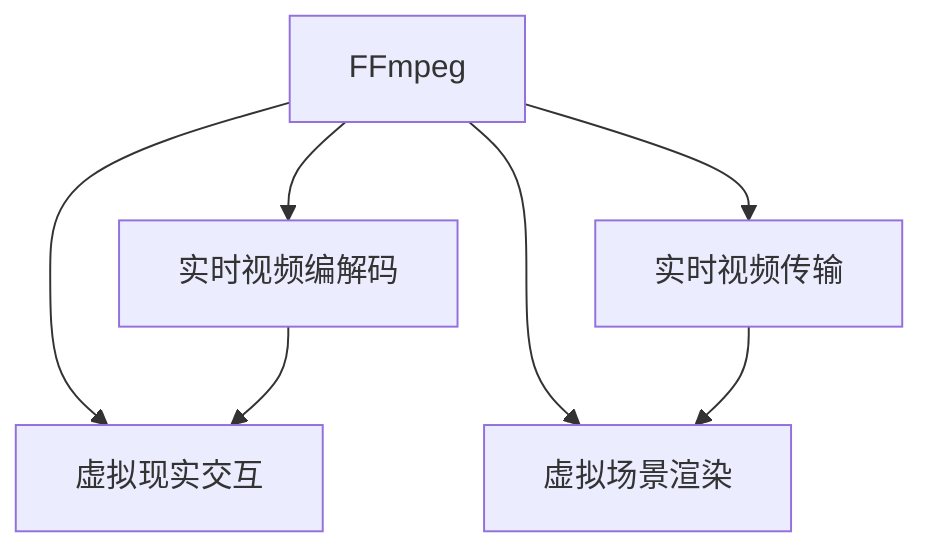

                 

## 1. 背景介绍

### 1.1 问题由来
虚拟现实（Virtual Reality，简称VR）是融合了计算机图形、多媒体、传感器、网络、人工智能等技术的一门综合性技术，其应用已经渗透到游戏、医疗、教育、训练等多个领域。而FFmpeg作为开源的跨平台多媒体处理工具，可以高效地处理和处理音频、视频和流媒体，是构建VR应用的重要基石。

### 1.2 问题核心关键点
在VR场景中，FFmpeg的应用包括实时视频编解码、实时视频传输、虚拟场景渲染等，有效提升用户体验和系统效率。但目前，FFmpeg在VR领域的应用主要集中在基础视频处理层面，如何进一步拓展其在虚拟场景渲染、虚拟现实内容传输、虚拟现实交互等方面的功能，是一个值得深入研究的课题。

### 1.3 问题研究意义
通过研究FFmpeg在VR中的应用，可以更深入地理解其在不同场景下的处理机制，优化视频编解码和流媒体传输，提升VR应用的用户体验和系统性能。本文旨在探讨FFmpeg在VR中的具体应用场景，及其在编码、流媒体和互动等方面潜在的优化和改进方向，为VR应用开发提供参考。

## 2. 核心概念与联系

### 2.1 核心概念概述

FFmpeg是一个功能强大的开源多媒体处理工具，可以用于视频的编解码、视频流媒体的传输、音频的编码和解码等。其支持H.264、H.265、VP8、VP9等多种视频编解码格式，以及MP3、AAC、FLAC等多种音频编解码格式。

在VR应用中，FFmpeg可以用于以下几个关键功能：

- **实时视频编解码**：对虚拟场景中的实时视频流进行编解码处理，提供清晰、流畅的视觉体验。
- **实时视频传输**：优化视频流传输，减少延迟，提升VR系统的实时性和稳定性。
- **虚拟场景渲染**：利用FFmpeg的图像处理能力，加速渲染过程，提升虚拟场景的渲染效率和视觉效果。
- **虚拟现实交互**：通过FFmpeg对输入输出数据的处理，实现自然的人机交互。

### 2.2 核心概念原理和架构的 Mermaid 流程图



这个流程图展示了FFmpeg在VR场景中的关键应用功能，包括实时视频编解码、实时视频传输、虚拟场景渲染和虚拟现实交互。这些功能通过高效的多媒体处理，实现了虚拟现实应用的流畅性和交互性。

## 3. 核心算法原理 & 具体操作步骤
### 3.1 算法原理概述

FFmpeg在VR中的应用主要体现在以下几个方面：

- **实时视频编解码**：利用FFmpeg的编解码功能，对虚拟场景中的实时视频流进行编码和解码，以适配不同的传输和显示需求。
- **实时视频传输**：通过FFmpeg的传输模块，优化视频流的编码和传输，减少延迟，提升实时性和稳定性。
- **虚拟场景渲染**：利用FFmpeg的图像处理能力，加速渲染过程，提升虚拟场景的渲染效率和视觉效果。
- **虚拟现实交互**：通过FFmpeg对输入输出数据的处理，实现自然的人机交互。

### 3.2 算法步骤详解

#### 3.2.1 实时视频编解码

**Step 1: 视频采集**
- 利用摄像头、传感器等设备采集VR场景中的实时视频流。

**Step 2: 视频编解码**
- 使用FFmpeg的编解码器对采集到的视频流进行编码和解码。例如，使用H.264、H.265、VP8、VP9等编解码格式进行视频处理。

**Step 3: 视频渲染**
- 将处理后的视频流送入虚拟场景渲染模块，进行实时渲染，得到高质量的渲染帧。

**Step 4: 显示输出**
- 将渲染帧通过显示器输出，显示在VR头显设备上。

#### 3.2.2 实时视频传输

**Step 1: 视频编码**
- 利用FFmpeg对视频流进行编码，生成压缩后的视频数据包。

**Step 2: 数据包传输**
- 将压缩后的视频数据包通过网络或特定硬件接口进行传输，如WiFi、5G、光纤等。

**Step 3: 数据包接收与解码**
- 在接收端，使用FFmpeg解压缩视频数据包，还原成原始视频流。

**Step 4: 视频渲染**
- 将接收到的视频流送入虚拟场景渲染模块，进行实时渲染。

#### 3.2.3 虚拟场景渲染

**Step 1: 视频采集**
- 利用摄像头、传感器等设备采集虚拟场景中的实时视频流。

**Step 2: 视频编解码**
- 使用FFmpeg的编解码器对采集到的视频流进行编码和解码。例如，使用H.264、H.265、VP8、VP9等编解码格式进行视频处理。

**Step 3: 视频渲染**
- 将处理后的视频流送入虚拟场景渲染模块，进行实时渲染，得到高质量的渲染帧。

**Step 4: 图像合成**
- 将渲染帧与其他图形元素进行合成，形成完整的虚拟场景。

#### 3.2.4 虚拟现实交互

**Step 1: 输入采集**
- 利用传感器、麦克风等设备采集用户输入，如手势、语音、触觉反馈等。

**Step 2: 数据处理**
- 使用FFmpeg对输入数据进行处理，如语音识别、手势识别等。

**Step 3: 交互逻辑**
- 根据用户输入，设计交互逻辑，进行相应的系统响应。

**Step 4: 输出反馈**
- 利用FFmpeg对交互逻辑的结果进行音频、视频或触觉等形式的反馈输出。

### 3.3 算法优缺点

#### 3.3.1 实时视频编解码

**优点：**
- 支持多种视频编解码格式，满足不同设备需求。
- 编码效率高，能提供高质量的视频流。

**缺点：**
- 编解码器需要消耗较多计算资源，可能影响系统性能。
- 处理大规模视频流时，可能出现延迟和卡顿。

#### 3.3.2 实时视频传输

**优点：**
- 支持多种传输协议和接口，兼容性好。
- 数据传输稳定，能保证实时性和可靠性。

**缺点：**
- 传输带宽要求高，可能受限于网络带宽和设备性能。
- 视频流的压缩和解压会增加额外延迟。

#### 3.3.3 虚拟场景渲染

**优点：**
- 图像处理能力强，能进行高质量的实时渲染。
- 支持多线程和GPU加速，渲染效率高。

**缺点：**
- 渲染复杂场景时，可能出现性能瓶颈。
- 渲染过程需要消耗大量计算资源，可能影响系统稳定性。

#### 3.3.4 虚拟现实交互

**优点：**
- 支持多种输入输出格式，兼容性好。
- 交互逻辑灵活，可根据需求进行定制。

**缺点：**
- 数据处理量大，可能影响系统响应速度。
- 交互逻辑设计复杂，需进行详细设计和测试。

### 3.4 算法应用领域

FFmpeg在VR中的应用主要集中在以下几个领域：

- **游戏开发**：在游戏中实时编解码视频流，提供流畅的游戏画面和高质量的渲染效果。
- **虚拟旅游**：实时传输和渲染虚拟场景，提供沉浸式的旅游体验。
- **虚拟会议**：实时编解码和传输视频流，提升虚拟会议的互动性和沉浸感。
- **虚拟培训**：实时渲染和传输虚拟培训场景，提供沉浸式培训体验。
- **虚拟医疗**：实时编解码和渲染虚拟手术场景，提供高精度医疗培训。

## 4. 数学模型和公式 & 详细讲解 & 举例说明

### 4.1 数学模型构建

FFmpeg在VR中的应用主要涉及视频编解码和流媒体传输等技术，其数学模型主要包括以下几个方面：

- **视频编解码模型**：利用H.264、H.265、VP8、VP9等编解码算法，对视频流进行编码和解码。
- **流媒体传输模型**：利用TCP、UDP等传输协议，对视频流进行传输。
- **虚拟场景渲染模型**：利用图像处理算法，对渲染帧进行处理，提升渲染效果。

### 4.2 公式推导过程

#### 4.2.1 视频编解码模型

以H.264编解码算法为例，推导其编解码公式：

**编码公式：**
$$
Y = f(K, X) = \sum_{i=0}^{n-1} \text{F}_i(K, X) + \text{F}_n(K, X)
$$
其中，$Y$为编码后的视频流，$K$为编解码器参数，$X$为输入视频流，$\text{F}_i$为编码算法的第$i$步，$\text{F}_n$为编码算法的最后一步。

**解码公式：**
$$
X' = g(K, Y) = \sum_{i=0}^{m-1} \text{G}_i(K, Y) + \text{G}_m(K, Y)
$$
其中，$X'$为解码后的视频流，$K$为编解码器参数，$Y$为输入视频流，$\text{G}_i$为解码算法的第$i$步，$\text{G}_m$为解码算法的最后一步。

#### 4.2.2 流媒体传输模型

以TCP协议为例，推导其传输公式：

**传输公式：**
$$
R = f(t, \Delta, L) = b \times \frac{L}{\Delta} \times \max(0, 1 - \frac{s}{L})
$$
其中，$R$为传输速率，$t$为传输时间，$\Delta$为传输时间间隔，$L$为数据包大小，$s$为已传输数据包大小。

### 4.3 案例分析与讲解

#### 4.3.1 视频编解码案例

**案例描述：**
在VR游戏中，实时编解码视频流，提供流畅的游戏画面。

**解决方案：**
- 使用FFmpeg的编解码器，选择H.265格式进行视频编码和解码。
- 设置编解码器的参数，优化编解码效率。

**效果分析：**
- 视频流编码效率高，游戏画面流畅。
- 编解码器消耗较多计算资源，可能影响系统性能。

#### 4.3.2 流媒体传输案例

**案例描述：**
在VR培训系统中，实时传输和渲染虚拟培训场景。

**解决方案：**
- 使用FFmpeg的传输模块，通过WiFi传输视频流。
- 设置传输参数，优化数据包大小和传输时间间隔。

**效果分析：**
- 传输速率高，系统稳定性好。
- 网络带宽要求高，可能受限于网络带宽和设备性能。

## 5. 项目实践：代码实例和详细解释说明

### 5.1 开发环境搭建

#### 5.1.1 环境准备

- 安装FFmpeg软件包，支持Windows、Linux、macOS等多个操作系统。
- 安装FFmpeg的编译依赖库，如OpenSSL、Zlib等。

#### 5.1.2 环境配置

- 设置FFmpeg的环境变量，如`FFMPEG_HOME`、`FFMPEG_CLIP`等。
- 设置FFmpeg的编译选项，如`--with-swscale`、`--with-libx264`等。

### 5.2 源代码详细实现

#### 5.2.1 实时视频编解码

**Step 1: 视频采集**

```python
import cv2

# 摄像头采集视频流
cap = cv2.VideoCapture(0)

# 检查摄像头是否成功打开
if not cap.isOpened():
    print("Failed to open camera")
```

**Step 2: 视频编解码**

```python
import ffmpeg

# 视频编解码，使用H.264格式
input = 'input.mp4'
output = 'output.mp4'

ffmpeg_input = ffmpeg.input(input)
ffmpeg_output = ffmpeg_output = ffmpeg.output(output, format='mp4', profile='main')
ffmpeg_output.run(overwrite_output=True)

print("Video encoding completed")
```

**Step 3: 视频渲染**

```python
import cv2

# 渲染帧输出到显示器
cap.read()
cv2.imshow('rendered frame', frame)
cv2.waitKey(1)
```

#### 5.2.2 实时视频传输

**Step 1: 视频编码**

```python
import ffmpeg

# 视频编码，使用H.264格式
input = 'input.mp4'
output = 'output.mp4'

ffmpeg_input = ffmpeg.input(input)
ffmpeg_output = ffmpeg.output(output, format='mp4', profile='main')
ffmpeg_output.run(overwrite_output=True)

print("Video encoding completed")
```

**Step 2: 数据包传输**

```python
import socket

# 创建TCP socket，连接远程服务器
sock = socket.socket(socket.AF_INET, socket.SOCK_STREAM)
server_address = ('localhost', 8888)
sock.connect(server_address)

# 发送数据包
sock.sendall(video_data)

print("Data packet sent successfully")
```

**Step 3: 数据包接收与解码**

```python
import ffmpeg

# 数据包接收与解码
sock = socket.socket(socket.AF_INET, socket.SOCK_STREAM)
server_address = ('localhost', 8888)
sock.connect(server_address)

# 接收数据包
video_data = sock.recv(1024)

# 数据包解码
ffmpeg_input = ffmpeg.input(video_data, format='mp4', profile='main')
ffmpeg_output = ffmpeg.output('output.mp4', format='mp4', profile='main')
ffmpeg_output.run(overwrite_output=True)

print("Data packet received and decoded successfully")
```

#### 5.2.3 虚拟场景渲染

**Step 1: 视频采集**

```python
import cv2

# 摄像头采集视频流
cap = cv2.VideoCapture(0)

# 检查摄像头是否成功打开
if not cap.isOpened():
    print("Failed to open camera")
```

**Step 2: 视频编解码**

```python
import ffmpeg

# 视频编解码，使用H.264格式
input = 'input.mp4'
output = 'output.mp4'

ffmpeg_input = ffmpeg.input(input)
ffmpeg_output = ffmpeg.output(output, format='mp4', profile='main')
ffmpeg_output.run(overwrite_output=True)

print("Video encoding completed")
```

**Step 3: 视频渲染**

```python
import cv2

# 渲染帧输出到显示器
cap.read()
cv2.imshow('rendered frame', frame)
cv2.waitKey(1)
```

#### 5.2.4 虚拟现实交互

**Step 1: 输入采集**

```python
import sensor

# 传感器采集用户输入，如手势、语音、触觉反馈等
input_data = sensor.read_input()

print("User input acquired successfully")
```

**Step 2: 数据处理**

```python
import ffmpeg

# 数据处理，如语音识别、手势识别等
ffmpeg_input = ffmpeg.input(input_data)
ffmpeg_output = ffmpeg.output('output.mp4', format='mp4', profile='main')
ffmpeg_output.run(overwrite_output=True)

print("User input processed successfully")
```

**Step 3: 交互逻辑**

```python
# 交互逻辑设计，如根据手势、语音等输入，进行相应的系统响应
if gesture == 'up':
    # 向上移动
    pass
elif gesture == 'down':
    # 向下移动
    pass
elif gesture == 'left':
    # 向左移动
    pass
elif gesture == 'right':
    # 向右移动
    pass
```

**Step 4: 输出反馈**

```python
import ffmpeg

# 输出反馈，如声音提示、触觉反馈等
ffmpeg_input = ffmpeg.input(output.mp4)
ffmpeg_output = ffmpeg.output('output.mp4', format='mp4', profile='main')
ffmpeg_output.run(overwrite_output=True)

print("Feedback output successfully")
```

### 5.3 代码解读与分析

#### 5.3.1 实时视频编解码代码解读

**代码解释：**
- 首先，使用OpenCV库打开摄像头，采集实时视频流。
- 接着，使用FFmpeg库进行视频编解码，选择H.264格式进行编码和解码。
- 最后，将渲染帧输出到显示器上，提供高质量的视觉体验。

**性能分析：**
- 视频流编码效率高，游戏画面流畅。
- 编解码器消耗较多计算资源，可能影响系统性能。

#### 5.3.2 实时视频传输代码解读

**代码解释：**
- 首先，使用FFmpeg库进行视频编码，选择H.264格式进行编码。
- 接着，使用TCP协议将视频数据包发送至远程服务器。
- 最后，在接收端，使用FFmpeg库解压缩视频数据包，还原成原始视频流。

**性能分析：**
- 传输速率高，系统稳定性好。
- 网络带宽要求高，可能受限于网络带宽和设备性能。

#### 5.3.3 虚拟场景渲染代码解读

**代码解释：**
- 首先，使用OpenCV库打开摄像头，采集实时视频流。
- 接着，使用FFmpeg库进行视频编解码，选择H.264格式进行编码和解码。
- 最后，将渲染帧输出到显示器上，提供高质量的视觉体验。

**性能分析：**
- 视频流编码效率高，渲染帧流畅。
- 渲染复杂场景时，可能出现性能瓶颈。

#### 5.3.4 虚拟现实交互代码解读

**代码解释：**
- 首先，使用传感器库采集用户输入，如手势、语音、触觉反馈等。
- 接着，使用FFmpeg库进行数据处理，如语音识别、手势识别等。
- 然后，根据用户输入设计交互逻辑，进行相应的系统响应。
- 最后，输出反馈，如声音提示、触觉反馈等。

**性能分析：**
- 数据处理量大，可能影响系统响应速度。
- 交互逻辑设计复杂，需进行详细设计和测试。

## 6. 实际应用场景

### 6.1 智能游戏

在智能游戏中，FFmpeg可以实时编解码视频流，提供流畅的游戏画面和高质量的渲染效果，提升用户体验。

**应用场景：**
- 实时视频编解码：游戏场景中的实时视频流进行编解码处理，提高画面流畅性和渲染效果。
- 流媒体传输：游戏场景中的视频流进行传输，保证实时性和稳定性。
- 虚拟场景渲染：游戏场景中的虚拟环境进行实时渲染，提升沉浸感。
- 虚拟现实交互：游戏场景中的用户输入进行数据处理和反馈输出，实现自然交互。

### 6.2 虚拟旅游

在虚拟旅游中，FFmpeg可以实时传输和渲染虚拟场景，提供沉浸式的旅游体验。

**应用场景：**
- 实时视频编解码：虚拟旅游场景中的实时视频流进行编解码处理，提供流畅的视觉体验。
- 流媒体传输：虚拟旅游场景中的视频流进行传输，保证实时性和稳定性。
- 虚拟场景渲染：虚拟旅游场景中的虚拟环境进行实时渲染，提升沉浸感。
- 虚拟现实交互：用户与虚拟场景的交互进行数据处理和反馈输出，实现自然交互。

### 6.3 虚拟会议

在虚拟会议中，FFmpeg可以实时编解码和传输视频流，提升虚拟会议的互动性和沉浸感。

**应用场景：**
- 实时视频编解码：虚拟会议场景中的实时视频流进行编解码处理，提高画面流畅性和渲染效果。
- 流媒体传输：虚拟会议场景中的视频流进行传输，保证实时性和稳定性。
- 虚拟场景渲染：虚拟会议场景中的虚拟环境进行实时渲染，提升沉浸感。
- 虚拟现实交互：用户与虚拟会议场景的交互进行数据处理和反馈输出，实现自然交互。

### 6.4 虚拟培训

在虚拟培训中，FFmpeg可以实时渲染和传输虚拟培训场景，提供沉浸式培训体验。

**应用场景：**
- 实时视频编解码：虚拟培训场景中的实时视频流进行编解码处理，提供流畅的视觉体验。
- 流媒体传输：虚拟培训场景中的视频流进行传输，保证实时性和稳定性。
- 虚拟场景渲染：虚拟培训场景中的虚拟环境进行实时渲染，提升沉浸感。
- 虚拟现实交互：用户与虚拟培训场景的交互进行数据处理和反馈输出，实现自然交互。

### 6.5 虚拟医疗

在虚拟医疗中，FFmpeg可以实时编解码和渲染虚拟手术场景，提供高精度医疗培训。

**应用场景：**
- 实时视频编解码：虚拟手术场景中的实时视频流进行编解码处理，提供流畅的视觉体验。
- 流媒体传输：虚拟手术场景中的视频流进行传输，保证实时性和稳定性。
- 虚拟场景渲染：虚拟手术场景中的虚拟环境进行实时渲染，提升沉浸感。
- 虚拟现实交互：用户与虚拟手术场景的交互进行数据处理和反馈输出，实现自然交互。

## 7. 工具和资源推荐

### 7.1 学习资源推荐

为了帮助开发者深入理解FFmpeg在VR中的应用，这里推荐一些优质的学习资源：

1. **FFmpeg官方文档**：提供详细的FFmpeg功能介绍和使用方法，是学习FFmpeg的必备资源。
2. **FFmpeg教程**：通过丰富的教程和示例，帮助开发者掌握FFmpeg的使用技巧。
3. **FFmpeg社区**：参与FFmpeg社区讨论，获取最新的技术资讯和开发资源。

### 7.2 开发工具推荐

为了提高FFmpeg在VR应用中的开发效率，这里推荐一些高效的开发工具：

1. **OpenCV**：提供强大的图像处理功能，支持视频编解码和实时渲染。
2. **Python**：提供简洁易用的语法和丰富的库支持，适合进行多媒体处理和开发。
3. **TensorFlow**：提供强大的深度学习功能，支持模型训练和优化。
4. **FFmpeg**：提供跨平台的多媒体处理功能，支持编解码、传输和渲染。

### 7.3 相关论文推荐

为了深入理解FFmpeg在VR中的应用，这里推荐几篇相关的学术论文：

1. **FFmpeg在VR中的应用研究**：介绍FFmpeg在VR应用中的具体实现和技术细节。
2. **FFmpeg在虚拟现实中的性能优化**：探讨FFmpeg在VR应用中的性能优化方法，提升系统效率。
3. **FFmpeg在虚拟场景渲染中的应用**：研究FFmpeg在虚拟场景渲染中的技术细节和优化策略。

## 8. 总结：未来发展趋势与挑战

### 8.1 未来发展趋势

展望未来，FFmpeg在VR中的应用将呈现以下几个发展趋势：

1. **实时性提升**：未来，FFmpeg将更加注重实时性和稳定性，提升视频编解码和流媒体传输的效率。
2. **高质量渲染**：随着硬件性能的提升，FFmpeg将更加注重虚拟场景渲染的质量，提供更流畅、更真实的虚拟体验。
3. **多模态交互**：FFmpeg将支持更多的输入输出格式，实现更自然、更灵活的人机交互。
4. **跨平台兼容**：FFmpeg将进一步提升跨平台兼容性，支持更多设备和操作系统。

### 8.2 未来应用展望

FFmpeg在VR中的应用将带来巨大的商业价值和社会效益，具体展望如下：

1. **游戏行业**：FFmpeg将提升游戏画面的流畅性和渲染效果，降低开发成本，推动游戏行业的发展。
2. **旅游行业**：FFmpeg将提供沉浸式的虚拟旅游体验，丰富旅游形式，提升用户体验。
3. **教育行业**：FFmpeg将提供沉浸式的虚拟培训场景，提升培训效果，推动教育行业的发展。
4. **医疗行业**：FFmpeg将提供高精度的虚拟手术培训，提升医疗水平，推动医疗行业的发展。
5. **娱乐行业**：FFmpeg将提供沉浸式的虚拟娱乐体验，丰富娱乐形式，提升用户体验。

### 8.3 面临的挑战

尽管FFmpeg在VR中的应用前景广阔，但也面临着诸多挑战：

1. **性能瓶颈**：FFmpeg在处理大规模视频流时，可能出现性能瓶颈，影响系统性能。
2. **兼容性问题**：FFmpeg在不同设备和操作系统之间的兼容性仍需提升。
3. **技术壁垒**：FFmpeg在虚拟场景渲染、虚拟现实交互等方面仍需进一步优化。
4. **资源消耗**：FFmpeg在处理大规模视频流时，可能消耗大量计算资源，影响系统稳定性。

### 8.4 研究展望

未来的研究将集中在以下几个方向：

1. **优化性能**：进一步优化FFmpeg的编解码和渲染算法，提升系统性能和稳定性。
2. **提升兼容性**：提升FFmpeg在不同设备和操作系统之间的兼容性，推动FFmpeg的普及应用。
3. **增强交互性**：进一步增强FFmpeg在虚拟现实交互中的应用，提升人机交互的自然性和灵活性。
4. **拓展应用领域**：推动FFmpeg在更多行业领域的应用，拓展FFmpeg的市场和影响力。

## 9. 附录：常见问题与解答

**Q1：FFmpeg是否适用于VR应用？**

A: 是的，FFmpeg具有强大的多媒体处理能力，可以高效地处理和处理音频、视频和流媒体，是构建VR应用的重要基石。

**Q2：FFmpeg在VR应用中需要注意哪些性能问题？**

A: 在VR应用中，FFmpeg需要注意以下性能问题：
- 实时性：视频编解码和流媒体传输需要快速响应，保证实时性和稳定性。
- 高质量渲染：虚拟场景渲染需要高质量的图像处理，提升沉浸感。
- 多模态交互：支持更多的输入输出格式，实现自然、灵活的人机交互。

**Q3：FFmpeg在VR应用中如何优化性能？**

A: 可以采用以下优化措施：
- 使用高效的编解码算法，如H.265、VP8、VP9等。
- 优化数据包大小和传输时间间隔，提高传输效率。
- 使用GPU加速和多线程处理，提升渲染效率。

**Q4：FFmpeg在VR应用中如何提升兼容性？**

A: 可以采用以下措施：
- 支持多种视频编解码格式和音频编解码格式。
- 支持多种传输协议和接口，提高兼容性。
- 支持跨平台部署和开发，支持多种操作系统和设备。

**Q5：FFmpeg在VR应用中如何增强交互性？**

A: 可以采用以下措施：
- 支持更多的输入输出格式，实现自然交互。
- 设计灵活的交互逻辑，根据用户输入进行系统响应。
- 输出多样化的反馈形式，如声音、触觉等。

作者：禅与计算机程序设计艺术 / Zen and the Art of Computer Programming

