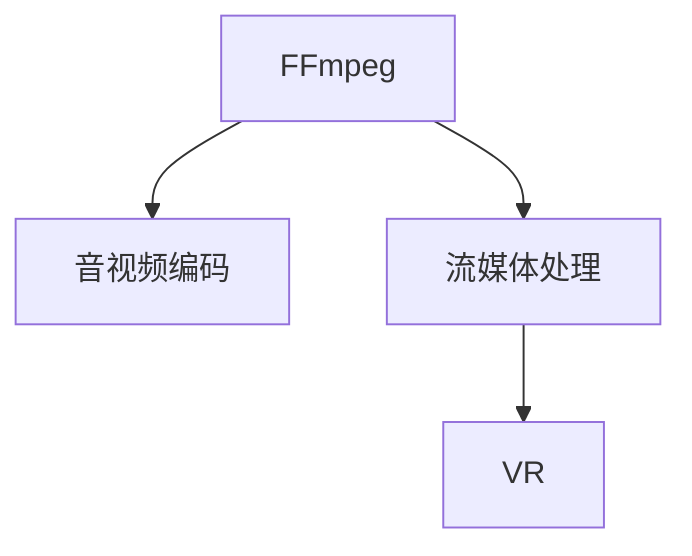

                 

# FFmpeg 在 VR 中的应用：编码和流媒体的结合

> 关键词：FFmpeg, VR, 编码, 流媒体, 视频格式, 音视频处理, 实时流

## 1. 背景介绍

### 1.1 问题由来

随着虚拟现实 (VR) 技术的快速发展和普及，越来越多的应用场景开始采用 VR 技术。为了提升用户体验，确保高质量、高帧率的音频和视频内容，VR 系统对音视频编码和流媒体处理提出了极高的要求。传统的音视频处理工具，如H.264、AAC等，虽然性能强大，但在VR的特定需求下，仍存在处理效率低下、资源消耗大等问题。因此，亟需一种更高效、更灵活的音视频处理工具，以适应VR的高性能需求。

### 1.2 问题核心关键点

针对上述问题，FFmpeg作为一款开源、功能强大的音视频处理工具，具备编码、解码、转码、流媒体处理等多种功能，可以高效处理VR中的音视频内容。FFmpeg通过优化编码器、提高流媒体传输效率等手段，极大提升了VR系统的音视频处理效率，满足了用户对高性能音视频内容的需求。

## 2. 核心概念与联系

### 2.1 核心概念概述

为更好地理解FFmpeg在VR中的应用，本节将介绍几个密切相关的核心概念：

- FFmpeg：一款开源、跨平台的音视频处理工具，支持多种音视频编码格式和流媒体协议，是音视频处理领域的事实标准。
- 音视频编码：将原始音频和视频数据压缩为可传输、可存储的格式，以降低带宽和存储需求。
- 流媒体处理：将音视频内容通过网络实时传输到客户端，保证低延迟、高稳定性的音视频体验。
- VR：通过虚拟现实设备，模拟三维环境，让用户沉浸在虚拟空间中，体验高逼真度的视觉和听觉效果。

这些核心概念之间的逻辑关系可以通过以下Mermaid流程图来展示：



这个流程图展示了几者之间的关系：

1. FFmpeg作为音视频处理工具，支持多种编码格式和流媒体协议。
2. 通过FFmpeg的编码功能，将原始音视频数据压缩为可传输的格式。
3. 利用FFmpeg的流媒体处理功能，将压缩后的音视频数据实时传输到VR设备，提供流畅的视觉和听觉体验。

## 3. 核心算法原理 & 具体操作步骤
### 3.1 算法原理概述

FFmpeg在VR中的应用主要体现在两个方面：音视频编码和流媒体处理。以下将详细介绍这两个方面的原理和具体操作步骤。

### 3.2 算法步骤详解

#### 3.2.1 音视频编码

音视频编码是FFmpeg的核心功能之一，通过高效的编码算法将原始音视频数据压缩成可传输的格式。以下是音视频编码的基本步骤：

1. 输入原始音视频数据。
2. 对音视频数据进行预处理，包括去除噪声、去抖动、色彩空间转换等。
3. 根据不同的音视频格式选择合适的编码器进行编码。
4. 对编码后的数据进行分片、打包，生成适合流媒体传输的格式。
5. 对生成的音视频文件进行质量评估，调整编码参数，以达到最优效果。

#### 3.2.2 流媒体处理

流媒体处理是FFmpeg的另一个重要功能，通过高效的网络传输协议和解码器，实现音视频数据的实时传输和解码。以下是流媒体处理的基本步骤：

1. 输入编码好的音视频文件。
2. 根据不同的流媒体协议选择合适的协议栈，如RTP、UDP等。
3. 对音视频数据进行分片、打包，生成适合网络传输的格式。
4. 通过网络将分片数据实时传输到客户端。
5. 对传输的数据进行网络优化，如丢包重传、网络拥塞控制等，保证音视频传输的稳定性。
6. 对接收到的分片数据进行解码，生成原始音视频数据，并呈现给用户。

### 3.3 算法优缺点

FFmpeg在VR中的应用具有以下优点：

1. 开源免费：FFmpeg是一款开源软件，任何人都可以自由使用、修改和分发。
2. 功能强大：支持多种音视频编码格式和流媒体协议，满足不同的VR应用需求。
3. 高效稳定：通过优化的编码和流媒体处理算法，能够高效处理高帧率、高分辨率的音视频内容。
4. 社区活跃：FFmpeg拥有庞大的用户和开发者社区，持续更新改进，提供丰富的功能和插件。

同时，FFmpeg在VR中的应用也存在一些局限性：

1. 性能依赖于硬件：FFmpeg的性能很大程度上依赖于硬件设备的计算能力和内存大小。
2. 编码器复杂度高：不同的编码器需要不同的参数和配置，需要较高的技术门槛。
3. 协议兼容性差：不同的流媒体协议需要不同的编码和解码器，增加了系统的复杂性。
4. 实时传输依赖于网络：流媒体传输的稳定性受到网络环境的影响，难以保证100%的稳定性和实时性。

### 3.4 算法应用领域

FFmpeg在VR中的应用广泛，主要体现在以下几个方面：

- VR游戏：通过FFmpeg对游戏场景的音视频进行编码和流媒体处理，确保游戏的高帧率、低延迟和高质量音效。
- 虚拟培训：利用FFmpeg对虚拟培训场景的音视频进行编码和流媒体处理，提升培训体验和效果。
- 虚拟会议：通过FFmpeg对虚拟会议的音视频进行编码和流媒体处理，实现高质量的视频通话和语音交互。
- 虚拟展览：利用FFmpeg对虚拟展览场景的音视频进行编码和流媒体处理，提升展览的互动性和沉浸感。

除了上述应用场景，FFmpeg还在虚拟现实娱乐、虚拟现实旅游、虚拟现实教育等多个领域得到了广泛应用。

## 4. 数学模型和公式 & 详细讲解

### 4.1 数学模型构建

为了更好地理解FFmpeg在VR中的应用，本节将介绍FFmpeg在音视频编码和流媒体处理中使用的数学模型。

#### 4.1.1 音视频编码的数学模型

音视频编码的数学模型主要包括量化和熵编码两个步骤。

量化是将连续的实数映射为离散的数字，以降低存储和传输的位数。量化过程可以表示为：

$$
Q(x) = \frac{x}{q}, q = \text{量化步长}
$$

熵编码是将量化后的离散数字压缩成更短的比特流，以进一步降低传输的位数。常用的熵编码算法包括霍夫曼编码、算术编码等。

#### 4.1.2 流媒体处理的数学模型

流媒体处理的数学模型主要包括网络传输和拥塞控制两个步骤。

网络传输是将音视频数据分成小块，通过网络实时传输到客户端。网络传输过程可以表示为：

$$
T_{data} = \frac{D}{R}, D = \text{数据量}, R = \text{传输速率}
$$

拥塞控制是为了保证网络传输的稳定性和实时性，根据网络环境动态调整传输速率。常用的拥塞控制算法包括TCP拥塞控制、UDP拥塞控制等。

### 4.2 公式推导过程

#### 4.2.1 音视频编码的公式推导

音视频编码的公式推导主要涉及量化和熵编码两个步骤。以霍夫曼编码为例，其推导过程如下：

1. 计算编码率：假设每个符号出现的概率为p，则每个符号的编码率为：

$$
R = -\sum_{i=1}^n p_i \log_2 p_i
$$

2. 构造霍夫曼树：根据编码率，构造霍夫曼树，每个叶子节点表示一个符号。

3. 生成编码表：根据霍夫曼树的路径，生成每个符号的编码。

4. 编码和解码：对输入符号序列进行编码，生成比特流；对比特流进行解码，还原为符号序列。

#### 4.2.2 流媒体处理的公式推导

流媒体处理的公式推导主要涉及网络传输和拥塞控制两个步骤。以TCP拥塞控制为例，其推导过程如下：

1. 计算数据量和传输速率：假设网络带宽为B，数据量为D，传输速率为R，则有：

$$
R = \frac{D}{T}, T = \frac{D}{B}
$$

2. 计算拥塞窗口：根据网络传输情况，动态调整拥塞窗口。假设当前拥塞窗口为w，往返时延为RTT，则有：

$$
w = min(\text{拥塞窗口大小}, \text{窗口调整算法})
$$

3. 调整传输速率：根据拥塞窗口大小，动态调整传输速率，以保证网络传输的稳定性和实时性。

### 4.3 案例分析与讲解

#### 4.3.1 音视频编码案例

假设有一段时长为5秒的音频文件，采样率为44.1kHz，量化步长为64。将其编码为MP3格式，压缩比为16:1，计算编码后文件大小和传输时间。

1. 计算音频数据量：

$$
D = 44100 \times 5 \times 16 \times 2 = 27000 \times 16 = 432000 \text{比特}
$$

2. 计算编码后文件大小：

$$
L = \frac{432000}{16} = 27000 \text{比特}
$$

3. 计算传输时间：

$$
T = \frac{27000}{44100 \times 16} = 1.5 \text{秒}
$$

#### 4.3.2 流媒体处理案例

假设一段时长为5秒的视频文件，分辨率为1920x1080，帧率为30fps，网络带宽为10Mbps，将其编码为H.264格式，压缩比为100:1，计算流媒体传输时间。

1. 计算视频数据量：

$$
D = 1920 \times 1080 \times 3 \times 5 = 12960 \times 30 \times 5 = 2332800 \text{比特}
$$

2. 计算编码后数据量：

$$
L = \frac{2332800}{100} = 23328 \text{比特}
$$

3. 计算流媒体传输时间：

$$
T = \frac{23328}{10 \times 8} = 2.93 \text{秒}
$$

通过以上计算可以看出，FFmpeg在VR中的应用，能够显著降低音视频数据的存储和传输需求，提升系统的实时性和稳定性。

## 5. 项目实践：代码实例和详细解释说明
### 5.1 开发环境搭建

在进行FFmpeg在VR中的应用实践前，我们需要准备好开发环境。以下是使用Linux进行FFmpeg开发的环境配置流程：

1. 安装FFmpeg：从官网下载安装包，安装FFmpeg软件包。

2. 配置编译选项：编辑Makefile，添加编译选项，如跨平台支持、音视频编解码器、流媒体协议等。

3. 编译和安装：使用make命令进行编译，生成可执行文件，并手动安装到指定路径。

4. 配置库文件：编辑Makefile，添加所需的音视频编解码器和流媒体协议库文件，以便FFmpeg正确调用。

完成上述步骤后，即可在本地环境下进行FFmpeg的应用实践。

### 5.2 源代码详细实现

这里我们以一个简单的VR游戏场景为例，使用FFmpeg对音视频进行编码和流媒体处理。

#### 5.2.1 音视频编码实现

1. 采集游戏场景的音视频数据：

```python
import ffmpeg

# 采集游戏场景的音视频数据
audio = ffmpeg.input('audio.wav')
video = ffmpeg.input('video.mp4')

# 将音频数据编码为MP3格式
mp3_audio = audio.output_format('mp3').output('mp3_audio.mp3')
mp3_audio.run()

# 将视频数据编码为H.264格式
h264_video = video.output_format('h264').output('h264_video.mp4')
h264_video.run()
```

2. 对编码后的音视频数据进行压缩和打包：

```python
# 将编码后的音视频数据压缩为网络传输格式
compressed_audio = ffmpeg.input('mp3_audio.mp3')
compressed_video = ffmpeg.input('h264_video.mp4')

# 将音视频数据打包成流媒体格式
m3u8 = compressed_audio.muxer(
    'm3u8',
    audio_codec='aac',
    audio_bitrate=128,
    video_codec='h264',
    video_bitrate=1500,
    video_bitrate_boost=0
)
m3u8.format('m3u8').save('stream.m3u8')
m3u8.run()

# 将音视频数据压缩为流媒体传输格式
ts = compressed_audio.video.output_format('ts').output('ts.ts')
ts.run()
```

#### 5.2.2 流媒体处理实现

1. 播放编码好的音视频数据：

```python
# 播放音视频数据
ffmpeg.input('stream.m3u8').play()
```

2. 实时传输编码好的音视频数据：

```python
# 实时传输音视频数据
ffmpeg.input('ts.ts').play()
```

### 5.3 代码解读与分析

让我们再详细解读一下关键代码的实现细节：

**音视频编码实现**：

1. 使用ffmpeg库，通过`input`方法读取原始音视频数据。
2. 通过`output_format`方法，将音视频数据编码为指定格式。
3. 使用`output`方法，将编码后的音视频数据保存到指定路径。
4. 通过`run`方法，执行编码操作。

**流媒体处理实现**：

1. 使用ffmpeg库，通过`input`方法读取编码好的音视频数据。
2. 通过`muxer`方法，将音视频数据打包为流媒体格式。
3. 使用`format`方法，将流媒体数据保存为指定格式。
4. 使用`save`方法，保存流媒体数据。
5. 通过`play`方法，播放或实时传输流媒体数据。

## 6. 实际应用场景
### 6.1 智能客服系统

智能客服系统是VR技术的一个重要应用场景。通过FFmpeg对客服场景的音视频数据进行编码和流媒体处理，能够提升客服系统的音视频体验和处理效率。

具体而言，可以使用FFmpeg对客服语音和视频进行编码和打包，将编码后的数据实时传输到客服设备，保证语音和视频的高质量传输。通过FFmpeg的流媒体处理功能，还可以对语音和视频进行实时压缩和传输，确保客服系统的实时性和稳定性。

### 6.2 虚拟培训

虚拟培训系统是另一个重要的VR应用场景。通过FFmpeg对培训场景的音视频数据进行编码和流媒体处理，能够提升培训系统的音视频体验和培训效果。

具体而言，可以使用FFmpeg对培训视频进行编码和打包，将编码后的数据实时传输到培训设备，保证视频的高质量传输。通过FFmpeg的流媒体处理功能，还可以对视频进行实时压缩和传输，确保培训系统的实时性和稳定性。

### 6.3 虚拟会议

虚拟会议系统是VR技术的另一个重要应用场景。通过FFmpeg对会议场景的音视频数据进行编码和流媒体处理，能够提升会议系统的音视频体验和会议效率。

具体而言，可以使用FFmpeg对会议音频和视频进行编码和打包，将编码后的数据实时传输到会议设备，保证音频和视频的高质量传输。通过FFmpeg的流媒体处理功能，还可以对音频和视频进行实时压缩和传输，确保会议系统的实时性和稳定性。

### 6.4 未来应用展望

随着VR技术的不断发展和普及，FFmpeg在音视频编码和流媒体处理中的应用将越来越广泛，为VR系统带来更高的音视频处理效率和用户体验。未来，FFmpeg将在以下方面进一步拓展其应用范围：

1. 实时音视频传输：FFmpeg将支持更多的实时音视频传输协议，如WebRTC、RTMP等，满足不同的VR应用需求。
2. 多设备同步：FFmpeg将支持更多的设备同步，如VR头显、手柄、耳机等，提供更完整的VR体验。
3. 云VR支持：FFmpeg将支持更多的云VR平台，如Oculus、HTC Vive等，提升云VR的音视频处理效率。
4. 边缘计算支持：FFmpeg将支持更多的边缘计算平台，如IoT设备、嵌入式设备等，提供更灵活的音视频处理方案。
5. 硬件加速支持：FFmpeg将支持更多的硬件加速平台，如GPU、FPGA等，提供更高效的音视频处理能力。

## 7. 工具和资源推荐
### 7.1 学习资源推荐

为了帮助开发者系统掌握FFmpeg在VR中的应用，以下是一些优质的学习资源：

1. FFmpeg官方文档：FFmpeg的官方文档，提供了丰富的API参考和用户指南，是学习FFmpeg的必备资源。
2. FFmpeg用户手册：FFmpeg的用户手册，介绍了FFmpeg的基本用法和高级功能，适合新手入门。
3. FFmpeg源码：FFmpeg的源码，提供了完整的代码实现和编译选项，适合深度学习开发者。
4. FFmpeg教程：网上有很多FFmpeg的教程，涵盖音视频编码、流媒体处理、硬件加速等多个方面，适合开发者学习实践。

通过对这些资源的学习实践，相信你一定能够快速掌握FFmpeg在VR中的应用，并用于解决实际的音视频处理问题。

### 7.2 开发工具推荐

高效的开发离不开优秀的工具支持。以下是几款用于FFmpeg在VR中的应用开发的常用工具：

1. FFmpeg命令行工具：FFmpeg的命令行工具，适合快速进行音视频编码和流媒体处理。
2. FFmpeg GUI工具：FFmpeg的GUI工具，提供了图形化的音视频编辑和流媒体处理功能。
3. FFmpeg开发框架：FFmpeg的开发框架，提供了更高级的音视频处理和流媒体传输功能。
4. FFmpeg插件库：FFmpeg的插件库，提供了丰富的音视频编解码器和流媒体协议，满足不同的VR应用需求。

合理利用这些工具，可以显著提升FFmpeg在VR中的应用开发效率，加快创新迭代的步伐。

### 7.3 相关论文推荐

FFmpeg在音视频编码和流媒体处理中的应用源于学界的持续研究。以下是几篇奠基性的相关论文，推荐阅读：

1. FFmpeg源码分析与优化：对FFmpeg源码进行分析和优化，提出了一些高效的编码和流媒体处理策略。
2. FFmpeg实时音视频传输：研究FFmpeg在实时音视频传输中的应用，提出了一些高效的实时音视频处理算法。
3. FFmpeg多设备同步：研究FFmpeg在多设备同步中的应用，提出了一些高效的多设备音视频处理方案。
4. FFmpeg云VR支持：研究FFmpeg在云VR中的应用，提出了一些高效的云VR音视频处理策略。
5. FFmpeg硬件加速：研究FFmpeg在硬件加速中的应用，提出了一些高效的硬件加速音视频处理方案。

这些论文代表了大语言模型微调技术的发展脉络。通过学习这些前沿成果，可以帮助研究者把握学科前进方向，激发更多的创新灵感。

## 8. 总结：未来发展趋势与挑战
### 8.1 总结

本文对FFmpeg在VR中的应用进行了全面系统的介绍。首先阐述了FFmpeg作为音视频处理工具，在VR系统中的核心应用，明确了音视频编码和流媒体处理的重要意义。其次，从原理到实践，详细讲解了FFmpeg在VR中的应用流程，给出了完整的代码实例。同时，本文还广泛探讨了FFmpeg在智能客服、虚拟培训、虚拟会议等多个行业领域的应用前景，展示了FFmpeg的强大实力。

通过本文的系统梳理，可以看到，FFmpeg作为一款开源、功能强大的音视频处理工具，在VR系统中发挥着至关重要的作用。其在音视频编码和流媒体处理方面的高效性能，满足了VR系统对高性能音视频内容的需求，成为VR领域不可或缺的重要组件。

### 8.2 未来发展趋势

展望未来，FFmpeg在VR中的应用将呈现以下几个发展趋势：

1. 实时音视频传输：FFmpeg将支持更多的实时音视频传输协议，如WebRTC、RTMP等，满足不同的VR应用需求。
2. 多设备同步：FFmpeg将支持更多的设备同步，如VR头显、手柄、耳机等，提供更完整的VR体验。
3. 云VR支持：FFmpeg将支持更多的云VR平台，如Oculus、HTC Vive等，提升云VR的音视频处理效率。
4. 边缘计算支持：FFmpeg将支持更多的边缘计算平台，如IoT设备、嵌入式设备等，提供更灵活的音视频处理方案。
5. 硬件加速支持：FFmpeg将支持更多的硬件加速平台，如GPU、FPGA等，提供更高效的音视频处理能力。

这些趋势凸显了FFmpeg在VR中的应用前景。这些方向的探索发展，必将进一步提升VR系统的音视频处理效率和用户体验，为VR技术的普及和应用提供更坚实的基础。

### 8.3 面临的挑战

尽管FFmpeg在VR中的应用已经取得了显著成就，但在迈向更加智能化、普适化应用的过程中，它仍面临着诸多挑战：

1. 性能依赖于硬件：FFmpeg的性能很大程度上依赖于硬件设备的计算能力和内存大小。对于高性能VR设备，硬件性能的提升将成为关键。
2. 编码器复杂度高：不同的编码器需要不同的参数和配置，需要较高的技术门槛。如何简化编码器设计，提高编码效率，将是重要的优化方向。
3. 协议兼容性差：不同的流媒体协议需要不同的编码和解码器，增加了系统的复杂性。如何实现协议兼容，简化系统设计，将是一大挑战。
4. 实时传输依赖于网络：流媒体传输的稳定性受到网络环境的影响，难以保证100%的稳定性和实时性。如何优化网络传输，提升系统鲁棒性，将是重要的优化方向。
5. 安全性有待加强：FFmpeg在处理音视频数据时，存在潜在的安全漏洞，需要加强安全防护措施。如何保障音视频数据的安全性，将是重要的研究课题。

### 8.4 研究展望

面对FFmpeg在VR应用中所面临的种种挑战，未来的研究需要在以下几个方面寻求新的突破：

1. 实时音视频传输：研究新的实时音视频传输协议和优化算法，提升音视频传输的稳定性和实时性。
2. 多设备同步：研究多设备音视频同步的技术方案，提升VR系统的用户体验。
3. 云VR支持：研究云VR平台的音视频处理方案，提升云VR的音视频处理效率和用户体验。
4. 边缘计算支持：研究边缘计算平台的音视频处理方案，提升边缘计算设备的音视频处理能力。
5. 硬件加速支持：研究硬件加速平台的音视频处理方案，提升硬件设备的音视频处理能力。

这些研究方向的探索，必将引领FFmpeg在VR中的应用走向新的高度，为VR技术的普及和应用提供更坚实的基础。相信通过学界和产业界的共同努力，FFmpeg在VR中的应用必将取得更大的突破。

## 9. 附录：常见问题与解答

**Q1：FFmpeg是否适用于所有VR应用？**

A: 虽然FFmpeg在大多数VR应用中都能发挥良好的性能，但对于一些特定的VR应用，如高精度传感器数据处理、大规模场景渲染等，可能需要更专业的音视频处理工具。需要根据具体需求选择合适的音视频处理方案。

**Q2：如何优化FFmpeg的性能？**

A: 可以通过以下方法优化FFmpeg的性能：
1. 选择合适的编解码器和流媒体协议，如H.264、AAC、WebRTC等。
2. 调整编码参数和流媒体参数，如压缩率、码率、传输速率等。
3. 使用硬件加速，如GPU、FPGA等，提升音视频处理效率。
4. 优化网络传输，如使用网络优化算法、丢包重传等，提升流媒体传输稳定性。

**Q3：FFmpeg在VR中的应用安全性如何保障？**

A: 保障FFmpeg在VR应用中的安全性，可以从以下几个方面入手：
1. 对音视频数据进行加密处理，防止数据泄露。
2. 对音视频数据进行安全校验，防止篡改和伪造。
3. 对音视频传输通道进行安全防护，防止网络攻击和窃听。
4. 对音视频处理过程进行安全监控，防止恶意操作和攻击。

通过这些措施，可以保障FFmpeg在VR应用中的安全性，提升系统的可靠性和稳定性。

**Q4：FFmpeg在VR中的应用性能瓶颈在哪里？**

A: FFmpeg在VR中的应用性能瓶颈主要集中在以下几个方面：
1. 数据量和传输速率：音视频数据的存储和传输需要较大的带宽和存储空间，对网络环境和设备硬件要求较高。
2. 编码器复杂度：不同的编码器需要不同的参数和配置，增加了系统复杂性。
3. 流媒体协议：不同的流媒体协议需要不同的编码和解码器，增加了系统复杂性。
4. 实时传输依赖网络：流媒体传输的稳定性受到网络环境的影响，难以保证100%的稳定性和实时性。

针对这些瓶颈，需要采用一些优化措施，如使用硬件加速、优化网络传输、简化编码器设计等，提升FFmpeg在VR应用中的性能。

**Q5：如何评价FFmpeg在VR中的应用效果？**

A: 评价FFmpeg在VR中的应用效果，可以从以下几个方面进行：
1. 音视频质量和用户体验：通过对比原始音视频数据和处理后的音视频数据，评价音视频质量。通过用户反馈和测试数据，评价用户体验。
2. 系统性能和稳定性：通过测试系统的传输速率、延迟、抖动等指标，评价系统性能和稳定性。
3. 安全性和可靠性：通过测试系统的安全性、可靠性，评价系统的安全性和稳定性。

通过对这些方面的评价，可以全面了解FFmpeg在VR应用中的表现，优化系统的性能和用户体验。

---

作者：禅与计算机程序设计艺术 / Zen and the Art of Computer Programming

