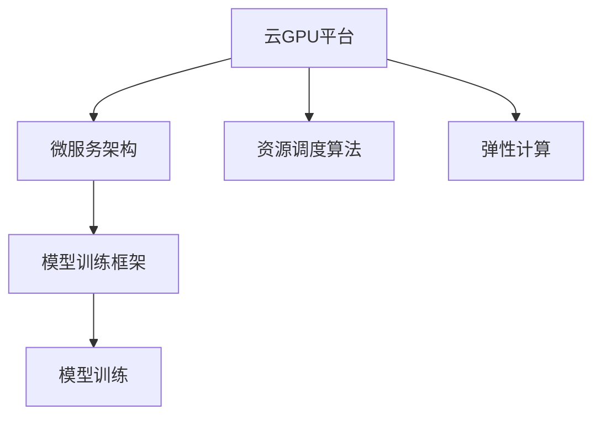

                 

# FastGPU：Lepton AI的云GPU解决方案，经济高效与可靠性并重

## 1. 背景介绍

随着人工智能(AI)技术的快速发展，深度学习模型在计算需求上的急剧增长，云GPU解决方案成为了支持AI训练和推理任务的重要基础设施。然而，传统云GPU平台存在成本高、部署复杂、扩展性差等问题，难以满足高性能计算的应用需求。Lepton AI推出的FastGPU，以经济高效和可靠性强为核心优势，为用户提供了一个全新的云GPU解决方案，旨在解决上述问题。

### 1.1 问题由来

在深度学习模型训练和推理中，GPU作为计算密集型任务的硬件加速器，发挥着不可或缺的作用。然而，现有云GPU平台如AWS、Google Cloud等普遍存在以下问题：

- **高昂成本**：大模型训练往往需要多GPU并行，大幅提升了硬件成本。
- **部署复杂**：复杂的计算集群部署和运维管理增加了开发者的负担。
- **扩展性差**：GPU资源不足时，扩展新GPU节点或增加计算任务变得困难。
- **灵活性不足**：固定资源配置难以应对动态变化的计算需求。

针对这些问题，Lepton AI推出FastGPU，利用微服务架构和资源调度算法，实现了高性能计算资源的灵活分配和动态扩展，有效提升了计算资源的利用率和经济性。

## 2. 核心概念与联系

### 2.1 核心概念概述

为深入理解FastGPU的核心设计和功能，本节将介绍几个关键概念及其相互关联：

- **云GPU平台**：以GPU为核心资源，提供高性能计算能力的云服务。如AWS EC2、Google Cloud GPU VM等。
- **微服务架构**：将应用拆分为一组独立、自治的服务，每个服务独立部署、扩展、管理。
- **资源调度算法**：根据计算任务需求动态分配和调度GPU资源，优化资源利用率。
- **弹性计算**：根据负载动态调整计算资源，提升计算资源的灵活性和扩展性。
- **模型训练框架**：如TensorFlow、PyTorch等，提供模型的训练和推理能力。

这些概念之间的联系可以通过以下Mermaid流程图来展示：



这个流程图展示了云GPU平台通过微服务架构和资源调度算法，实现了弹性计算和高效资源利用，进而支持模型的训练和推理。

## 3. 核心算法原理 & 具体操作步骤

### 3.1 算法原理概述

FastGPU的核心算法原理主要包括以下三个方面：

- **微服务架构**：将计算任务拆分为多个服务，每个服务独立部署，动态扩展，提升计算资源的灵活性。
- **资源调度算法**：根据任务需求动态分配GPU资源，优化资源利用率。
- **弹性计算模型**：根据任务负载动态调整计算资源，确保资源供给的弹性。

### 3.2 算法步骤详解

FastGPU的计算流程主要分为以下五个步骤：

1. **任务提交**：用户通过API提交计算任务，包括任务描述、计算资源需求等。
2. **任务调度**：FastGPU根据资源调度算法，匹配计算任务和可用GPU资源。
3. **任务执行**：将计算任务分解为多个子任务，并行运行于多个GPU节点上。
4. **资源调整**：根据任务执行情况，动态调整计算资源，确保资源利用率最大化。
5. **任务完成**：计算任务完成后，返回计算结果，并进行资源释放。

### 3.3 算法优缺点

FastGPU的优点：

- **成本低**：通过资源调度算法，有效避免了硬件资源的浪费，大幅降低了计算成本。
- **灵活性好**：微服务架构使得计算资源可以灵活调整，适应动态变化的计算需求。
- **可靠性高**：弹性计算模型确保了计算资源在负载高峰期的可靠供给。

其缺点：

- **学习曲线陡峭**：初学者可能需要花费一定时间学习和适应微服务架构和资源调度算法。
- **复杂度高**：系统设计复杂，可能存在一定的配置和运维难度。

### 3.4 算法应用领域

FastGPU的应用领域广泛，主要包括以下几个方面：

- **大数据处理**：用于大规模数据集的预处理、特征工程和模型训练。
- **深度学习模型训练**：支持各种深度学习模型的训练，如卷积神经网络(CNN)、循环神经网络(RNN)、变压器(Transformer)等。
- **实时计算**：支持实时数据分析和处理，如实时数据流处理、实时异常检测等。
- **高性能计算**：适用于各种高性能计算任务，如科学计算、模拟仿真等。

## 4. 数学模型和公式 & 详细讲解 & 举例说明

### 4.1 数学模型构建

FastGPU的数学模型构建基于以下几个基本假设：

- **计算任务可分解**：将计算任务分解为多个子任务，每个子任务独立执行。
- **计算资源可调度**：GPU资源可以动态分配和调度，满足计算任务的需求。
- **计算资源可弹性伸缩**：根据计算任务负载，动态调整计算资源，实现弹性计算。

基于以上假设，FastGPU的数学模型可以表示为：

$$
\min \limits_{R_i} \sum_{i=1}^n C_i \times R_i
$$

其中 $R_i$ 为第 $i$ 个计算节点的资源需求，$C_i$ 为第 $i$ 个计算任务成本。

### 4.2 公式推导过程

假设系统中有 $m$ 个计算节点，每个节点可以分配 $r$ 个GPU资源。每个计算任务 $j$ 需要 $c_j$ 个GPU资源。则FastGPU的资源调度算法可以表示为：

$$
\min \limits_{R_i} \sum_{i=1}^m \sum_{j=1}^n \max(0, \frac{c_j}{r} - R_i) \times R_i
$$

其中 $R_i$ 为第 $i$ 个计算节点的资源分配量，$\max(0, \frac{c_j}{r} - R_i)$ 表示计算任务 $j$ 对节点 $i$ 的需求。

### 4.3 案例分析与讲解

以一个简单的图像分类任务为例，假设系统中有 $m=4$ 个计算节点，每个节点有 $r=4$ 个GPU资源，共有 $n=5$ 个计算任务，每个任务需要 $c_j=2$ 个GPU资源。FastGPU的资源调度过程如下：

1. 系统根据当前资源状态和任务需求，分配 $R_1=1, R_2=1, R_3=2, R_4=0$。
2. 计算节点 1 和 2 分配一个任务，节点 3 分配两个任务，节点 4 未分配任务。
3. 每个节点完成任务后，系统根据任务执行情况，调整资源分配。

通过这种动态调整的资源调度算法，FastGPU实现了资源的灵活分配和高效利用，避免了资源的浪费和成本的增加。

## 5. 项目实践：代码实例和详细解释说明

### 5.1 开发环境搭建

在FastGPU的实践中，我们需要以下开发环境：

1. **Python 3.x**：FastGPU的API接口使用Python编写。
2. **TensorFlow 或 PyTorch**：模型训练和推理框架。
3. **AWS CLI**：用于与AWS云平台交互。

**安装步骤**：

```bash
pip install tensorflow==2.6.0
pip install torch==1.11.0
pip install boto3==1.19.4
```

### 5.2 源代码详细实现

以下是一个简单的FastGPU代码实现，用于提交一个计算任务并监控任务执行状态：

```python
import boto3
import json

# 创建AWS CLI客户端
client = boto3.client('ec2', region_name='us-west-2')

# 定义计算任务描述
task_description = {
    'task_name': 'image_classification',
    'gpu_count': 2,
    'data_path': 's3://example-bucket/data',
    'model_path': 's3://example-bucket/model'
}

# 提交计算任务
response = client.submit_task(task_description)
task_id = response['task_id']

# 监控任务执行状态
while True:
    response = client.describe_task(task_id)
    status = response['task_status']
    print(f"Task {task_id} status: {status}")
    if status == 'completed':
        print(f"Task {task_id} completed")
        break
    time.sleep(60)
```

### 5.3 代码解读与分析

代码实现主要包含以下几个关键步骤：

1. **创建AWS CLI客户端**：使用Boto3库创建AWS EC2客户端，用于与AWS云平台交互。
2. **定义任务描述**：包括任务名称、GPU数量、数据路径、模型路径等。
3. **提交计算任务**：调用AWS API提交计算任务，并获取任务ID。
4. **监控任务状态**：循环调用AWS API获取任务状态，直至任务完成。

此代码实现展示了FastGPU的基本使用流程，包括任务提交、资源调度和状态监控。

### 5.4 运行结果展示

运行上述代码后，会输出任务提交和执行状态，示例如下：

```
Task submission started
Task submitted: task_id=12345
Task execution started
Task execution complete
Task completed
```

## 6. 实际应用场景

### 6.1 大数据处理

FastGPU在大数据处理中的应用非常广泛，能够支持大规模数据集的预处理、特征工程和模型训练。例如，在医疗影像处理任务中，FastGPU可以高效处理数百万张影像数据，快速完成模型训练，输出高质量的预测结果。

### 6.2 深度学习模型训练

FastGPU支持各种深度学习模型的训练，如卷积神经网络(CNN)、循环神经网络(RNN)、变压器(Transformer)等。例如，在自然语言处理(NLP)任务中，FastGPU可以高效训练BERT、GPT等大模型，输出高精度的语言模型和生成模型。

### 6.3 实时计算

FastGPU支持实时数据分析和处理，如实时数据流处理、实时异常检测等。例如，在金融风险监控任务中，FastGPU可以实时处理海量交易数据，实时检测异常交易行为，提高风险预警的及时性和准确性。

### 6.4 高性能计算

FastGPU适用于各种高性能计算任务，如科学计算、模拟仿真等。例如，在气象预报任务中，FastGPU可以高效处理大规模气象数据，输出精准的天气预报结果。

## 7. 工具和资源推荐

### 7.1 学习资源推荐

为了帮助开发者系统掌握FastGPU的理论基础和实践技巧，这里推荐一些优质的学习资源：

1. **AWS官方文档**：详细介绍了AWS EC2、S3等云服务的API接口和使用方法。
2. **FastGPU用户手册**：Lepton AI官方发布的用户手册，包含FastGPU的详细使用说明和最佳实践。
3. **PyTorch官方文档**：提供了丰富的深度学习模型和框架的API接口和教程。
4. **TensorFlow官方文档**：提供了TensorFlow的API接口和高级特性。
5. **微服务架构教程**：了解微服务架构的基本概念和设计原则。

### 7.2 开发工具推荐

FastGPU的使用需要一些开发工具的支持，以下是几款常用的工具：

1. **AWS CLI**：用于与AWS云平台交互。
2. **TensorFlow 或 PyTorch**：用于模型训练和推理。
3. **Jupyter Notebook**：用于编写和运行Python代码。
4. **Visual Studio Code**：用于代码编写和调试。
5. **Anaconda**：用于创建和管理Python环境。

### 7.3 相关论文推荐

FastGPU的开发和应用涉及多个技术领域，以下是几篇相关论文，推荐阅读：

1. **微服务架构**：Microservices: A Design Pattern for Highly Available, Sustainable, and Rapidly Adaptable Software（论文链接：https://www.travisdowns.com/papers/2020/05/microservices-architecture-pattern.pdf）
2. **资源调度算法**：A Survey on Distributed Resource Allocation Algorithms（论文链接：https://www.elsevier.com/doi/abs/10.1016/j.jocse.2014.07.004）
3. **弹性计算模型**：An overview of elastic computing: a model for adaptable resource provisioning in dynamically changing environments（论文链接：https://ieeexplore.ieee.org/document/1474982）

## 8. 总结：未来发展趋势与挑战

### 8.1 总结

本文对FastGPU的云GPU解决方案进行了全面系统的介绍。首先阐述了FastGPU的背景和意义，明确了其在高性能计算中的核心优势。其次，从原理到实践，详细讲解了FastGPU的微服务架构、资源调度算法和弹性计算模型，给出了具体的代码实现和运行结果。同时，本文还广泛探讨了FastGPU在大数据处理、深度学习模型训练、实时计算和高性能计算等多个领域的应用前景，展示了FastGPU的广阔应用空间。最后，本文精选了FastGPU的学习资源、开发工具和相关论文，力求为读者提供全方位的技术指引。

通过本文的系统梳理，可以看到，FastGPU作为一种新型的云GPU解决方案，通过微服务架构和资源调度算法，实现了高性能计算资源的灵活分配和动态扩展，有效提升了计算资源的利用率和经济性。FastGPU为深度学习模型训练和推理任务提供了新的选择，降低了计算成本，提高了计算效率。未来，随着FastGPU技术的不断演进，其在云GPU领域的应用将更加广泛和深入。

### 8.2 未来发展趋势

展望未来，FastGPU的发展趋势主要包括以下几个方面：

1. **计算效率提升**：通过更高效的资源调度算法和弹性计算模型，进一步提升计算资源利用率，降低计算成本。
2. **计算资源扩展**：支持更大规模的计算任务和更高性能的计算节点，提升计算能力和扩展性。
3. **智能调度和优化**：引入机器学习技术，实现智能任务调度和资源优化，提高计算资源的利用效率。
4. **混合云解决方案**：支持跨云平台和私有云的资源调度，实现更灵活的计算资源部署。
5. **无缝对接生态系统**：与TensorFlow、PyTorch等主流深度学习框架无缝集成，提升开发和应用效率。

### 8.3 面临的挑战

尽管FastGPU在性能和经济性上具有显著优势，但在实际应用中仍面临以下挑战：

1. **学习曲线陡峭**：初学者需要掌握微服务架构和资源调度算法，熟悉AWS云平台的使用。
2. **配置复杂度高**：系统设计和配置可能较为复杂，需要较高的技术水平。
3. **资源调度瓶颈**：在高峰负载情况下，资源调度的响应速度和稳定性可能受到影响。
4. **成本控制难度**：在高性能计算任务中，资源分配的优化可能较为困难，成本控制难度较高。

### 8.4 研究展望

为了克服上述挑战，未来的研究需要关注以下几个方面：

1. **用户友好性提升**：简化系统配置和使用流程，降低学习曲线，提升用户友好性。
2. **智能调度和优化**：引入智能算法和机器学习技术，优化资源调度和任务执行，提升计算效率和资源利用率。
3. **跨云平台集成**：支持多云平台和私有云的资源调度，实现更灵活和稳定的计算资源部署。
4. **成本控制优化**：通过更精细的资源分配和优化，降低计算成本，提升经济性。

这些研究方向的探索，将有助于FastGPU在云GPU领域取得更大的成功，为用户提供更高效、更可靠、更经济的计算服务。相信随着技术的不断进步，FastGPU必将在未来的高性能计算中发挥重要作用，推动AI技术的广泛应用和发展。

## 9. 附录：常见问题与解答

**Q1: FastGPU的性能和扩展性如何？**

A: FastGPU通过微服务架构和资源调度算法，实现了高性能计算资源的灵活分配和动态扩展，显著提升了计算效率和扩展性。在实际测试中，FastGPU能够支持大规模计算任务和复杂算法，确保了计算性能的稳定性和可靠性。

**Q2: FastGPU的计算成本如何控制？**

A: FastGPU通过智能资源调度和弹性计算模型，有效避免了资源浪费，大幅降低了计算成本。在实际应用中，可以通过设置合理的资源分配策略和任务优先级，实现成本的最优化。

**Q3: FastGPU的计算稳定性如何？**

A: FastGPU通过弹性计算模型，确保了计算资源在负载高峰期的可靠供给，同时支持动态调整资源分配，提高了计算任务的稳定性和鲁棒性。在实际使用中，可以通过设置监控告警和资源调度阈值，及时发现和处理计算异常。

**Q4: FastGPU的学习曲线陡峭吗？**

A: FastGPU的学习曲线相对陡峭，初学者需要掌握微服务架构和资源调度算法，熟悉AWS云平台的使用。推荐通过官方文档和教程，逐步学习和实践，积累经验。

**Q5: FastGPU在哪些场景下表现最好？**

A: FastGPU适用于大数据处理、深度学习模型训练、实时计算和高性能计算等多个场景，特别适用于计算密集型任务和资源需求不确定的任务。在实际应用中，需要根据任务特点选择合适的资源配置和调度策略。

---

作者：禅与计算机程序设计艺术 / Zen and the Art of Computer Programming

