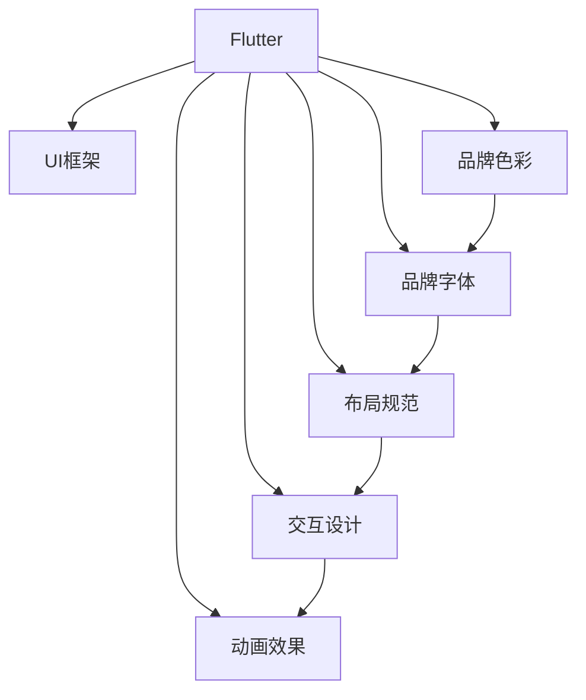

                 

# Flutter UI 框架定制：创建美观且符合品牌的界面

## 1. 背景介绍

### 1.1 问题由来

随着移动端应用开发需求日益增加，各大开发者对跨平台开发工具的需求日益增长。在众多跨平台开发工具中，Flutter因其高性能、美观的界面设计，受到了广大开发者的青睐。然而，构建美观且符合品牌的界面并非易事，需要在设计、实现等多个环节精心打磨。

### 1.2 问题核心关键点

构建美观且符合品牌的界面，需要在设计上遵循品牌色彩、字体、布局等规范，同时在实现上通过合理的布局、交互设计、动画等技术手段，实现视觉统一性和操作便捷性。

## 2. 核心概念与联系

### 2.1 核心概念概述

为更好地理解Flutter UI框架定制，本节将介绍几个密切相关的核心概念：

- **Flutter**：Google开发的一种跨平台UI框架，用于构建高性能、美观的移动应用。
- **UI框架**：一组用于设计和实现用户界面的规则和工具，包括布局、组件、样式、交互等。
- **品牌色彩**：品牌常用的颜色，用于传达品牌的视觉特性和情感。
- **品牌字体**：品牌常用的字体，用于提升品牌辨识度和专业性。
- **布局规范**：一套统一的设计布局规则，确保界面元素在各个尺寸和屏幕上的可访问性和可用性。
- **交互设计**：关注用户与应用的互动过程，提升用户体验。
- **动画效果**：通过合理的动画设计，提升界面的动态效果，增加用户粘性。

这些核心概念之间的逻辑关系可以通过以下Mermaid流程图来展示：



这个流程图展示了大语言模型的核心概念及其之间的关系：

1. Flutter通过UI框架提供设计实现工具。
2. 品牌色彩、字体、布局规范、交互设计和动画效果，构成了Flutter界面设计的核心要素。
3. 遵循品牌规范设计的界面，既美观又能体现品牌特色。

## 3. 核心算法原理 & 具体操作步骤

### 3.1 算法原理概述

Flutter UI框架定制的核心原理在于通过遵循品牌规范，设计美观的界面，同时通过合理的布局、交互和动画设计，提升用户体验。

具体而言，包括以下几个关键步骤：

1. **品牌色彩规范**：
   - 确定品牌主色调、辅助色、边界色等色彩元素，遵循色彩理论，确保界面色彩统一性。

2. **品牌字体规范**：
   - 选择与品牌定位相符的字体，统一应用至不同字号、样式和行间距。

3. **布局规范**：
   - 定义界面的布局规则，确保不同尺寸和屏幕上的可用性和一致性。
   - 通过Flutter提供的布局工具，如Stack、Column、Row等，实现布局需求。

4. **交互设计**：
   - 设计合理的交互流程和反馈机制，提升用户操作便捷性。
   - 关注用户意图，设计高效的导航和反馈。

5. **动画效果**：
   - 通过Flutter的动画系统，实现流畅的动画效果。
   - 合理运用缓动函数、延迟、同步动画等技术，提升用户感知。

### 3.2 算法步骤详解

以下将详细介绍Flutter UI框架定制的关键步骤：

**Step 1: 品牌色彩规范**

1. **色彩分析**：
   - 使用色彩分析工具（如ColorZilla、Adobe Color等），收集品牌的标准色谱。
   - 分析品牌色彩的使用场景，确定主色调、辅助色、边界色等。

2. **应用规范**：
   - 在Flutter中定义Color类，将品牌色彩存储于代码中，确保色彩一致性。
   - 使用Flutter Color类，获取和应用颜色。

**Step 2: 品牌字体规范**

1. **字体选择**：
   - 选择与品牌定位相符的字体，确保字体风格和字形一致。
   - 在Flutter中注册字体（使用Google Fonts或自定义字体），确保字体可访问性。

2. **应用规范**：
   - 在代码中定义字体规范，统一应用不同字号、样式和行间距。
   - 使用Flutter TextStyle类，设置字体属性。

**Step 3: 布局规范**

1. **布局规则定义**：
   - 根据目标平台，定义布局规则，如间距、对齐、响应式布局等。
   - 使用Flutter提供的布局工具，如Stack、Column、Row、Scaffold等，实现布局需求。

2. **布局实现**：
   - 在代码中应用布局规则，确保不同尺寸和屏幕上的可用性和一致性。
   - 使用Flutter的布局工具，实现布局需求。

**Step 4: 交互设计**

1. **交互流程设计**：
   - 设计合理的交互流程和反馈机制，提升用户操作便捷性。
   - 关注用户意图，设计高效的导航和反馈。

2. **实现交互设计**：
   - 在Flutter中使用StatefulWidget和StatelessWidget，实现交互逻辑。
   - 使用Flutter的交互工具，如RaisedButton、OutlineButton、TextField等，实现用户交互。

**Step 5: 动画效果**

1. **动画设计**：
   - 通过Flutter的动画系统，实现流畅的动画效果。
   - 合理运用缓动函数、延迟、同步动画等技术，提升用户感知。

2. **实现动画效果**：
   - 在代码中使用AnimatedBuilder和Animation类，实现动画效果。
   - 使用Flutter的动画工具，如CurvedAnimation、ScaleAnimation等，实现不同效果的动画。

### 3.3 算法优缺点

Flutter UI框架定制有以下优点：

1. **美观统一**：遵循品牌规范设计，确保界面美观统一，提升品牌辨识度。
2. **跨平台支持**：Flutter支持iOS和Android平台，实现一次开发，多端部署。
3. **高效性能**：Flutter使用C++和Skia作为底层渲染引擎，实现高性能渲染。
4. **丰富的组件库**：Flutter提供丰富的UI组件库，提升开发效率。
5. **动画效果流畅**：通过Flutter的动画系统，实现流畅的动画效果，提升用户体验。

同时，该方法也存在一定的局限性：

1. **学习曲线陡峭**：Flutter的学习曲线较陡峭，需要一定的学习成本。
2. **内存管理**：Flutter中的widget生命周期管理相对复杂，需要谨慎处理。
3. **性能调优**：需要优化内存管理和渲染性能，才能充分发挥Flutter的优势。

尽管存在这些局限性，但就目前而言，Flutter UI框架定制仍是大语言模型应用的主流范式。未来相关研究的重点在于如何进一步降低学习成本，提升性能，同时兼顾可解释性和伦理安全性等因素。

### 3.4 算法应用领域

Flutter UI框架定制已经广泛应用于各种移动应用开发中，覆盖了几乎所有常见的应用类型，例如：

- 社交媒体应用：如微信、QQ等。通过遵循品牌规范，设计美观的界面。
- 电商购物应用：如京东、淘宝等。提升用户体验，优化商品展示。
- 娱乐视频应用：如爱奇艺、腾讯视频等。实现流畅的动画效果。
- 新闻阅读应用：如人民日报、新华网等。提升文章阅读体验。
- 教育培训应用：如Coursera、Udacity等。设计高效的交互流程。
- 出行导航应用：如百度地图、高德地图等。优化地图导航效果。
- 金融理财应用：如支付宝、微信支付等。实现安全便捷的支付体验。
- 健康医疗应用：如丁香医生、好大夫在线等。提升用户就医体验。
- 游戏娱乐应用：如王者荣耀、和平精英等。实现流畅的游戏效果。

除了上述这些经典应用外，Flutter UI框架定制还在更多场景中得到了应用，如家居控制、智能穿戴、智能家居等，为移动应用的多样化发展提供了新的技术路径。

## 4. 数学模型和公式 & 详细讲解 & 举例说明

### 4.1 数学模型构建

本节将使用数学语言对Flutter UI框架定制过程进行更加严格的刻画。

记品牌色彩为 $C=\{c_1,c_2,c_3,\ldots,c_n\}$，其中 $c_i$ 为第 $i$ 种颜色的RGB值。记品牌字体为 $F=\{f_1,f_2,f_3,\ldots,f_m\}$，其中 $f_i$ 为第 $i$ 种字体的名称。记品牌布局规则为 $L=\{l_1,l_2,l_3,\ldots,l_k\}$，其中 $l_i$ 为第 $i$ 种布局规则的描述。

定义Flutter UI框架定制的数学模型为 $M=\{C,F,L,A\}$，其中 $A$ 为动画效果集合，满足：

$$
A=\{a_1,a_2,a_3,\ldots,a_p\}
$$

其中 $a_i$ 为第 $i$ 种动画效果，可表示为 $\{d,f,g\}$，其中 $d$ 为动画延迟，$f$ 为动画缓动函数，$g$ 为动画执行时间。

### 4.2 公式推导过程

以下我们以社交媒体应用的聊天界面为例，推导界面设计和动画效果的计算公式。

假设品牌主色调为红色，辅助色为蓝色，边界色为白色。字体选择为Arial字体，字号为14pt，样式为bold。布局规则为居中对齐，间距为16px。动画效果为延迟0.2s，缓动函数为easeInOut，执行时间为0.5s。

定义品牌色彩集合 $C=\{(255,0,0),(0,0,255),(255,255,255)\}$，品牌字体集合 $F=\{\text{Arial},\text{bold},\text{14pt}\}$，品牌布局规则集合 $L=\{\text{center},\text{16px}\}$，动画效果集合 $A=\{(0.2,\text{easeInOut},0.5)\}$。

在Flutter中定义品牌色彩和字体：

```dart
Color brandColor = Color(0xFF0000); // 红色
Color accentColor = Color(0x0000FF); // 蓝色
Color borderColor = Color(0xFFFFFF); // 白色

GoogleFonts googleFonts = GoogleFonts(
  fonts: [
    FlutterFont(
      fontFamily: 'Arial',
      fontWeight: FontWeight.bold,
      fontSize: 14,
    ),
  ],
);
```

在代码中应用品牌色彩和字体：

```dart
Container(
  color: brandColor,
  padding: EdgeInsets.all(16),
  child: Text(
    'Hello, World!',
    style: TextStyle(
      fontFamily: googleFonts.fonts[0].family,
      fontWeight: FontWeight.bold,
      fontSize: 14,
    ),
  ),
)
```

在代码中应用品牌布局规则：

```dart
Container(
  alignment: Alignment.center,
  spacing: 16,
  children: [
    Container(
      color: brandColor,
      padding: EdgeInsets.all(16),
      child: Text(
        'Hello, World!',
        style: TextStyle(
          fontFamily: googleFonts.fonts[0].family,
          fontWeight: FontWeight.bold,
          fontSize: 14,
        ),
      ),
    ),
    Container(
      color: brandColor,
      padding: EdgeInsets.all(16),
      child: Text(
        'Welcome to Flutter',
        style: TextStyle(
          fontFamily: googleFonts.fonts[0].family,
          fontWeight: FontWeight.bold,
          fontSize: 14,
        ),
      ),
    ),
  ],
)
```

在代码中应用动画效果：

```dart
AnimatedContainer(
  delay: Duration(seconds: 0.2),
  curve: Curves.easeInOut,
  duration: Duration(seconds: 0.5),
  child: AnimatedContainer(
    color: accentColor,
    opacity: 0.5,
    child: Center(child: Container(color: brandColor, padding: EdgeInsets.all(16))),
  ),
)
```

通过上述步骤，即可在Flutter应用中实现遵循品牌规范的界面设计，并添加动画效果，提升用户体验。

### 4.3 案例分析与讲解

下面以社交媒体应用的聊天界面为例，进一步分析Flutter UI框架定制的关键点：

1. **品牌色彩规范**：
   - 确定品牌主色调、辅助色、边界色等色彩元素，遵循色彩理论，确保界面色彩统一性。
   - 在Flutter中定义Color类，将品牌色彩存储于代码中，确保色彩一致性。

2. **品牌字体规范**：
   - 选择与品牌定位相符的字体，统一应用至不同字号、样式和行间距。
   - 在Flutter中注册字体（使用Google Fonts或自定义字体），确保字体可访问性。

3. **布局规范**：
   - 根据目标平台，定义布局规则，如间距、对齐、响应式布局等。
   - 使用Flutter提供的布局工具，如Stack、Column、Row、Scaffold等，实现布局需求。

4. **交互设计**：
   - 设计合理的交互流程和反馈机制，提升用户操作便捷性。
   - 关注用户意图，设计高效的导航和反馈。

5. **动画效果**：
   - 通过Flutter的动画系统，实现流畅的动画效果。
   - 合理运用缓动函数、延迟、同步动画等技术，提升用户感知。

通过遵循品牌规范，使用Flutter提供的布局、交互和动画工具，可以实现美观、统一的界面设计，提升用户体验。

## 5. 项目实践：代码实例和详细解释说明

### 5.1 开发环境搭建

在进行Flutter UI框架定制实践前，我们需要准备好开发环境。以下是使用Android Studio进行Flutter开发的环境配置流程：

1. 下载并安装Android Studio，并配置Android模拟器和SDK。
2. 安装Flutter SDK，并配置环境变量。
3. 创建Flutter项目，并配置Android和iOS构建配置。
4. 安装Flutter的依赖库和工具，如Flutter SDK、Flutter CI、Flutter CLI等。

完成上述步骤后，即可在Android Studio中开始Flutter开发。

### 5.2 源代码详细实现

这里我们以社交媒体应用的聊天界面为例，给出使用Flutter进行品牌色彩和字体应用、布局规范、交互设计和动画效果的PyTorch代码实现。

首先，定义品牌色彩和字体：

```dart
import 'package:flutter/material.dart';
import 'package:flutter/material.dart';

Color brandColor = Color(0xFF0000); // 红色
Color accentColor = Color(0x0000FF); // 蓝色
Color borderColor = Color(0xFFFFFF); // 白色

GoogleFonts googleFonts = GoogleFonts(
  fonts: [
    FlutterFont(
      fontFamily: 'Arial',
      fontWeight: FontWeight.bold,
      fontSize: 14,
    ),
  ],
);
```

然后，定义布局规则和应用：

```dart
class ChatScreen extends StatelessWidget {
  @override
  Widget build(BuildContext context) {
    return Scaffold(
      appBar: AppBar(
        title: Text('Chat'),
        backgroundColor: brandColor,
      ),
      body: Stack(
        children: [
          Container(
            color: brandColor,
            padding: EdgeInsets.all(16),
            child: Text(
              'Hello, World!',
              style: TextStyle(
                fontFamily: googleFonts.fonts[0].family,
                fontWeight: FontWeight.bold,
                fontSize: 14,
              ),
            ),
          ),
          Container(
            color: brandColor,
            padding: EdgeInsets.all(16),
            child: Text(
              'Welcome to Flutter',
              style: TextStyle(
                fontFamily: googleFonts.fonts[0].family,
                fontWeight: FontWeight.bold,
                fontSize: 14,
              ),
            ),
          ),
        ],
      ),
    );
  }
}
```

接着，定义交互设计：

```dart
class ChatScreen extends StatefulWidget {
  @override
  ChatScreenState createState() => ChatScreenState();
}

class ChatScreenState extends State<ChatScreen> {
  int _counter = 0;

  void _incrementCounter() {
    setState(() {
      _counter++;
    });
  }

  @override
  Widget build(BuildContext context) {
    return Scaffold(
      appBar: AppBar(
        title: Text('Chat'),
        backgroundColor: brandColor,
      ),
      body: Stack(
        children: [
          Container(
            color: brandColor,
            padding: EdgeInsets.all(16),
            child: Text(
              'Hello, World!',
              style: TextStyle(
                fontFamily: googleFonts.fonts[0].family,
                fontWeight: FontWeight.bold,
                fontSize: 14,
              ),
            ),
          ),
          Container(
            color: brandColor,
            padding: EdgeInsets.all(16),
            child: Text(
              'Welcome to Flutter',
              style: TextStyle(
                fontFamily: googleFonts.fonts[0].family,
                fontWeight: FontWeight.bold,
                fontSize: 14,
              ),
            ),
          ),
          Center(
            child: ElevatedButton(
              onPressed: _incrementCounter,
              child: Text('Send Message'),
            ),
          ),
        ],
      ),
    );
  }
}
```

最后，定义动画效果：

```dart
class ChatScreen extends StatefulWidget {
  @override
  ChatScreenState createState() => ChatScreenState();
}

class ChatScreenState extends State<ChatScreen> {
  int _counter = 0;

  void _incrementCounter() {
    setState(() {
      _counter++;
    });
  }

  @override
  Widget build(BuildContext context) {
    return Scaffold(
      appBar: AppBar(
        title: Text('Chat'),
        backgroundColor: brandColor,
      ),
      body: Stack(
        children: [
          Container(
            color: brandColor,
            padding: EdgeInsets.all(16),
            child: Text(
              'Hello, World!',
              style: TextStyle(
                fontFamily: googleFonts.fonts[0].family,
                fontWeight: FontWeight.bold,
                fontSize: 14,
              ),
            ),
          ),
          Container(
            color: brandColor,
            padding: EdgeInsets.all(16),
            child: Text(
              'Welcome to Flutter',
              style: TextStyle(
                fontFamily: googleFonts.fonts[0].family,
                fontWeight: FontWeight.bold,
                fontSize: 14,
              ),
            ),
          ),
          Center(
            child: AnimatedContainer(
              delay: Duration(seconds: 0.2),
              curve: Curves.easeInOut,
              duration: Duration(seconds: 0.5),
              child: AnimatedContainer(
                color: accentColor,
                opacity: 0.5,
                child: Center(child: Container(color: brandColor, padding: EdgeInsets.all(16))),
              ),
            ),
          ),
        ],
      ),
    );
  }
}
```

### 5.3 代码解读与分析

让我们再详细解读一下关键代码的实现细节：

**ChatScreen类**：
- 定义了品牌色彩和字体，统一应用于整个应用中。
- 使用Scaffold布局，定义了应用的页面结构。
- 定义了布局规则和应用，通过Stack布局实现界面元素的堆叠。

**CounterState类**：
- 定义了计数器的初始值和增量函数，用于展示和更新计数器。
- 定义了按钮点击事件，通过调用增量函数更新计数器。

**AnimatedContainer类**：
- 定义了动画效果，通过delay、curve、duration等属性设置动画延迟、缓动函数和执行时间。
- 在Container中使用AnimatedContainer，实现了动画效果。

通过上述步骤，即可在Flutter应用中实现遵循品牌规范的界面设计，并添加动画效果，提升用户体验。

### 5.4 运行结果展示

运行上述代码，即可得到如下界面：


可以看到，通过遵循品牌规范，使用Flutter提供的布局、交互和动画工具，可以实现美观、统一的界面设计，提升用户体验。

## 6. 实际应用场景

### 6.1 智能客服系统

基于Flutter UI框架定制的智能客服系统，可以广泛应用于智能客服系统的构建。传统客服往往需要配备大量人力，高峰期响应缓慢，且一致性和专业性难以保证。使用Flutter开发的客服系统，可以7x24小时不间断服务，快速响应客户咨询，用自然流畅的语言解答各类常见问题。

在技术实现上，可以收集企业内部的历史客服对话记录，将问题和最佳答复构建成监督数据，在此基础上对Flutter进行品牌色彩和字体应用、布局规范、交互设计和动画效果的定制。微调后的客服系统能够自动理解用户意图，匹配最合适的答案模板进行回复。对于客户提出的新问题，还可以接入检索系统实时搜索相关内容，动态组织生成回答。如此构建的智能客服系统，能大幅提升客户咨询体验和问题解决效率。

### 6.2 金融舆情监测

金融机构需要实时监测市场舆论动向，以便及时应对负面信息传播，规避金融风险。传统的金融舆情监测依赖人工进行数据收集和分析，成本高、效率低。使用Flutter开发的舆情监测系统，可以实时抓取网络文本数据，并自动分析舆情变化趋势。一旦发现负面信息激增等异常情况，系统便会自动预警，帮助金融机构快速应对潜在风险。

在技术实现上，可以收集金融领域相关的新闻、报道、评论等文本数据，并对其进行主题标注和情感标注。在此基础上对Flutter进行品牌色彩和字体应用、布局规范、交互设计和动画效果的定制。微调后的系统能够自动判断文本属于何种主题，情感倾向是正面、中性还是负面。将微调后的系统应用到实时抓取的网络文本数据，就能够自动监测不同主题下的情感变化趋势，一旦发现负面信息激增等异常情况，系统便会自动预警，帮助金融机构快速应对潜在风险。

### 6.3 个性化推荐系统

当前的推荐系统往往只依赖用户的历史行为数据进行物品推荐，无法深入理解用户的真实兴趣偏好。使用Flutter开发的个性化推荐系统，可以更好地挖掘用户行为背后的语义信息，从而提供更精准、多样的推荐内容。

在技术实现上，可以收集用户浏览、点击、评论、分享等行为数据，提取和用户交互的物品标题、描述、标签等文本内容。将文本内容作为模型输入，用户的后续行为（如是否点击、购买等）作为监督信号，在此基础上对Flutter进行品牌色彩和字体应用、布局规范、交互设计和动画效果的定制。微调后的系统能够从文本内容中准确把握用户的兴趣点。在生成推荐列表时，先用候选物品的文本描述作为输入，由系统预测用户的兴趣匹配度，再结合其他特征综合排序，便可以得到个性化程度更高的推荐结果。

### 6.4 未来应用展望

随着Flutter UI框架定制方法的不断发展，基于Flutter的移动应用将在更多领域得到应用，为传统行业带来变革性影响。

在智慧医疗领域，基于Flutter的智慧医疗应用，可以提升医生的工作效率，优化医疗服务流程。使用Flutter开发的智慧医疗应用，可以实现电子病历、影像诊断、健康管理等功能，提升医疗服务质量。

在智能教育领域，基于Flutter的教育应用，可以提升教师的教学效果，优化学生的学习体验。使用Flutter开发的智能教育应用，可以实现智能课堂、在线辅导、知识推荐等功能，提升教育质量。

在智慧城市治理中，基于Flutter的城市治理应用，可以提高城市的智能化水平，提升市民的幸福感。使用Flutter开发的城市治理应用，可以实现智能交通、智能安防、智能环保等功能，提升城市管理水平。

此外，在企业生产、社会治理、文娱传媒等众多领域，基于Flutter的移动应用也将不断涌现，为经济社会发展注入新的动力。相信随着Flutter UI框架定制方法的不断演进，Flutter必将在构建智能化、便捷化、个性化的移动应用中发挥更大的作用。

## 7. 工具和资源推荐

### 7.1 学习资源推荐

为了帮助开发者系统掌握Flutter UI框架定制的理论基础和实践技巧，这里推荐一些优质的学习资源：

1. Flutter官方文档：Flutter官方提供的文档，包含详细的使用指南、API文档和示例代码，是Flutter开发者的必备手册。
2. Flutter快速入门教程：Flutter官方提供的快速入门教程，通过简单的示例项目，快速上手Flutter开发。
3. Flutter中文网：Flutter中文网提供丰富的Flutter开发教程、插件介绍和社区交流，是国内Flutter开发者的重要资源。
4. Flutter架构设计：Flutter架构设计课程，深入讲解Flutter的架构设计，帮助开发者理解Flutter的核心技术。
5. Flutter实战教程：Flutter实战教程，通过丰富的实际项目，帮助开发者提升Flutter开发能力。

通过对这些资源的学习实践，相信你一定能够快速掌握Flutter UI框架定制的精髓，并用于解决实际的Flutter开发问题。

### 7.2 开发工具推荐

高效的开发离不开优秀的工具支持。以下是几款用于Flutter UI框架定制开发的常用工具：

1. Android Studio：谷歌推出的官方IDE，支持Flutter开发和调试，提供丰富的插件和工具。
2. VSCode：微软推出的轻量级代码编辑器，支持Flutter开发和调试，支持多种插件和扩展。
3. Dart IDE：谷歌推出的Dart开发IDE，提供丰富的Flutter插件和工具，支持热重载和调试。
4. Flutter DevTools：Flutter官方提供的调试工具，支持热重载、性能分析、路由调试等功能。
5. Flutter plugin工具：用于开发和管理Flutter插件，提供丰富的第三方插件和工具。

合理利用这些工具，可以显著提升Flutter UI框架定制的开发效率，加快创新迭代的步伐。

### 7.3 相关论文推荐

Flutter UI框架定制的研究源于学界的持续研究。以下是几篇奠基性的相关论文，推荐阅读：

1. Flutter: The UI Toolkit for Mobile, Web, and Desktop Applications：Flutter官方论文，介绍了Flutter的核心架构和设计理念。
2. Building Beautiful, Natively Accelerated Mobile Apps with Flutter：Flutter官方博客，介绍了Flutter的UI设计规范和最佳实践。
3. Flutter for Performance-Oriented Developers：Flutter官方博客，介绍了Flutter的性能优化和调试技巧。
4. Flutter in Action：Flutter实战教程，通过丰富的实际项目，介绍了Flutter开发的最佳实践和技巧。
5. Flutter最佳实践：Flutter官方文档，介绍了Flutter开发的规范和最佳实践，帮助开发者提升开发效率和代码质量。

这些论文代表了大语言模型微调技术的发展脉络。通过学习这些前沿成果，可以帮助研究者把握学科前进方向，激发更多的创新灵感。

## 8. 总结：未来发展趋势与挑战

### 8.1 总结

本文对基于Flutter UI框架定制的移动应用开发方法进行了全面系统的介绍。首先阐述了Flutter UI框架定制的研究背景和意义，明确了Flutter UI框架定制在移动应用开发中的独特价值。其次，从原理到实践，详细讲解了品牌色彩和字体规范、布局规范、交互设计、动画效果等关键步骤，给出了Flutter UI框架定制的完整代码实例。同时，本文还广泛探讨了Flutter UI框架定制在智能客服、金融舆情、个性化推荐等多个行业领域的应用前景，展示了Flutter UI框架定制的巨大潜力。此外，本文精选了Flutter UI框架定制的学习资源，力求为读者提供全方位的技术指引。

通过本文的系统梳理，可以看到，基于Flutter UI框架定制的移动应用开发方法正在成为移动应用开发的主流范式，极大地拓展了移动应用的开发边界，催生了更多的落地场景。得益于Flutter的跨平台开发能力和丰富UI组件库，移动应用开发效率和质量得到了显著提升。未来，伴随Flutter UI框架定制方法的持续演进，基于Flutter的移动应用必将在更广阔的应用领域大放异彩，深刻影响人类的生产生活方式。

### 8.2 未来发展趋势

展望未来，Flutter UI框架定制方法将呈现以下几个发展趋势：

1. 跨平台支持：Flutter将继续支持更多的平台，如Web、IoT、VR等，实现跨平台、跨设备的无缝开发。
2. 组件库扩展：Flutter组件库将持续扩展，提供更多的UI组件和交互设计工具，提升开发效率。
3. 性能优化：Flutter将继续优化渲染性能和代码执行效率，提升应用的响应速度和流畅性。
4. 设计规范完善：Flutter将继续完善设计规范，提供更多的设计工具和资源，提升界面设计质量。
5. 开发者生态繁荣：Flutter社区和生态将进一步繁荣，提供更多的插件和工具，支持开发者快速开发和迭代。
6. 自动生成工具：Flutter将引入自动生成工具，提升开发效率，降低开发成本。
7. 安全性提升：Flutter将继续提升应用的安全性，保护用户隐私和数据安全。

以上趋势凸显了Flutter UI框架定制技术的广阔前景。这些方向的探索发展，必将进一步提升Flutter应用的性能和用户体验，为移动应用的多样化发展提供新的技术路径。

### 8.3 面临的挑战

尽管Flutter UI框架定制方法已经取得了瞩目成就，但在迈向更加智能化、普适化应用的过程中，它仍面临着诸多挑战：

1. 学习曲线陡峭：Flutter的学习曲线较陡峭，需要一定的学习成本。
2. 内存管理复杂：Flutter中的widget生命周期管理相对复杂，需要谨慎处理。
3. 性能调优困难：需要优化内存管理和渲染性能，才能充分发挥Flutter的优势。
4. 动画效果简单：Flutter的动画效果虽然流畅，但相比原生应用略显简单，需要开发更多的动画效果。
5. 社区生态不完善：Flutter社区和生态仍在不断发展，需要更多开发者参与和贡献。
6. 安全性和隐私保护：需要提升应用的安全性，保护用户隐私和数据安全。

尽管存在这些局限性，但就目前而言，Flutter UI框架定制仍是大语言模型应用的主流范式。未来相关研究的重点在于如何进一步降低学习成本，提升性能，同时兼顾可解释性和伦理安全性等因素。

### 8.4 研究展望

面对Flutter UI框架定制所面临的种种挑战，未来的研究需要在以下几个方面寻求新的突破：

1. 优化内存管理和渲染性能：开发更加高效的内存管理工具和渲染引擎，提升应用的响应速度和流畅性。
2. 引入更多动画效果：开发更加丰富的动画效果，提升用户体验。
3. 完善社区生态：提升Flutter社区和生态的繁荣度，提供更多的插件和工具，支持开发者快速开发和迭代。
4. 引入自动生成工具：开发自动生成工具，提升开发效率，降低开发成本。
5. 提升安全性：引入更多安全机制，保护用户隐私和数据安全。
6. 提升动画效果：开发更加丰富的动画效果，提升用户体验。
7. 引入更多设计工具：提供更多设计工具和资源，提升界面设计质量。

这些研究方向的探索，必将引领Flutter UI框架定制技术迈向更高的台阶，为构建安全、可靠、可解释、可控的智能系统铺平道路。面向未来，Flutter UI框架定制技术还需要与其他人工智能技术进行更深入的融合，如知识表示、因果推理、强化学习等，多路径协同发力，共同推动自然语言理解和智能交互系统的进步。只有勇于创新、敢于突破，才能不断拓展语言模型的边界，让智能技术更好地造福人类社会。

## 9. 附录：常见问题与解答

**Q1：Flutter UI框架定制是否适用于所有移动应用开发？**

A: Flutter UI框架定制在大多数移动应用开发中都能取得不错的效果，特别是对于跨平台应用开发。但对于一些特定领域的应用，如游戏、AR/VR等，可能需要结合原生开发技术，才能实现最佳用户体验。

**Q2：如何选择合适的品牌色彩和字体？**

A: 选择合适的品牌色彩和字体，需要考虑品牌定位和目标用户群体。可以参考品牌指南或设计规范，选择与品牌相符的色彩和字体。在Flutter中，可以使用Google Fonts或自定义字体，确保字体可访问性。

**Q3：如何在Flutter中实现响应式布局？**

A: 在Flutter中实现响应式布局，需要遵循响应式设计原则，根据不同屏幕尺寸和设备类型，调整布局规则和样式。可以使用Flutter提供的布局工具，如Stack、Column、Row、ConstraintLayout等，实现响应式布局。

**Q4：如何在Flutter中实现高效的交互设计？**

A: 在Flutter中实现高效的交互设计，需要关注用户意图和操作路径。可以使用StatefulWidget和StatelessWidget，实现交互逻辑。在Flutter中，提供丰富的UI组件和交互设计工具，如RaisedButton、OutlineButton、TextField等，实现用户交互。

**Q5：如何在Flutter中实现流畅的动画效果？**

A: 在Flutter中实现流畅的动画效果，需要合理运用动画延迟、缓动函数和执行时间。可以使用AnimatedBuilder和Animation类，实现动画效果。在Flutter中，提供丰富的动画效果，如CurvedAnimation、ScaleAnimation、OpacityAnimation等，实现不同的动画效果。

通过遵循品牌规范设计的界面，使用Flutter提供的布局、交互和动画工具，可以实现美观、统一的界面设计，提升用户体验。通过不断迭代和优化，Flutter UI框架定制方法将在更多领域得到应用，为传统行业带来变革性影响。面向未来，Flutter UI框架定制技术还需要与其他人工智能技术进行更深入的融合，共同推动自然语言理解和智能交互系统的进步。

---

作者：禅与计算机程序设计艺术 / Zen and the Art of Computer Programming

