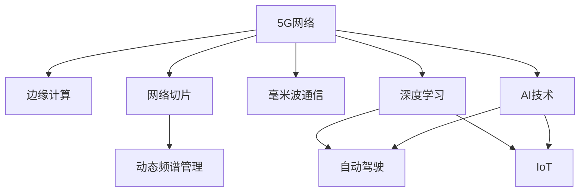

                 

# 5G+AI：智能通信网络的未来

> 关键词：5G, AI, 智能通信网络, 边缘计算, 网络切片, 动态频谱管理, 毫米波通信, 深度学习, 自动驾驶, IoT, 人工智能与通信的融合

## 1. 背景介绍

### 1.1 问题由来
近年来，信息通信技术（ICT）的迅猛发展，尤其是5G网络的全面商用，使得网络环境变得更加复杂多变。如何利用先进的AI技术，在5G网络架构中引入智能化元素，提升网络性能和用户体验，是当前通信领域面临的重要课题。

5G网络通过更高的频段、更大的带宽、更低的时延、更大的连接数等特性，为新一代智能化应用提供了基础。但是，随着各类智能应用场景的不断涌现，传统的静态、固定的网络架构已经难以满足日益复杂和动态变化的需求。因此，引入AI技术，实现网络的自适应和智能化，成为了5G网络发展的关键方向。

### 1.2 问题核心关键点
5G与AI技术的结合，涉及到网络架构、应用场景、计算资源等多个层面，核心关键点如下：

- **网络架构智能化**：通过AI算法实现网络的自组织、自管理和自优化。
- **边缘计算**：将计算资源下沉到网络边缘，减少网络时延，提升服务质量。
- **网络切片**：基于AI技术实现灵活的网络资源分配，支持不同业务需求。
- **动态频谱管理**：利用AI算法优化频谱资源，提升频谱效率。
- **毫米波通信**：利用AI算法解决毫米波信号衰减和干扰问题，提升通信质量。
- **深度学习算法**：通过深度学习优化网络参数，实现更精确的预测和控制。
- **自动驾驶**：利用AI技术优化车辆调度，提升道路利用率，减少交通拥堵。
- **IoT（物联网）**：AI技术与物联网结合，实现智能化设备管理和服务。

### 1.3 问题研究意义
5G与AI技术的结合，对推动通信技术的演进具有重要意义：

1. **提升网络性能**：通过AI技术实现网络自动化优化，提高网络效率和稳定性。
2. **降低运营成本**：AI技术可以自动化运维，减少人工干预，降低运营成本。
3. **拓展应用场景**：AI技术引入使得5G网络可以支持更多智能应用，如自动驾驶、智能家居等。
4. **提升用户体验**：通过AI技术优化网络服务质量，提供更个性化、智能化的用户服务。
5. **推动产业升级**：5G与AI技术的融合，为通信、交通、医疗等多个行业带来变革性影响。

## 2. 核心概念与联系

### 2.1 核心概念概述

为了更好地理解5G+AI的智能通信网络，本节将介绍几个关键概念：

- **5G网络**：新一代移动通信技术，提供更高的带宽、更低的时延和更大的连接数，支持更广泛的智能化应用。
- **AI技术**：通过机器学习、深度学习等算法，实现自动化、智能化处理，提升数据利用效率和决策能力。
- **边缘计算**：将计算资源部署在网络边缘，以减少数据传输延迟和带宽占用，提升服务质量。
- **网络切片**：根据不同业务需求，将网络资源划分为多个虚拟网络，提供差异化服务。
- **动态频谱管理**：利用AI算法优化频谱资源分配，提高频谱利用效率。
- **毫米波通信**：利用毫米波频段的高频特性，提供更高容量和更低时延的通信服务。
- **深度学习算法**：通过多层神经网络模型，实现复杂模式识别和决策。

这些概念之间的逻辑关系可以通过以下Mermaid流程图来展示：



这个流程图展示了大规模5G网络中引入AI技术的各个关键环节，以及它们之间的联系和互动。

## 3. 核心算法原理 & 具体操作步骤
### 3.1 算法原理概述

5G与AI技术的结合，本质上是将AI技术嵌入到5G网络中，实现网络的智能化和自适应。核心算法原理包括以下几个方面：

- **自组织网络（SDN/NFV）**：通过软件定义网络（SDN）和网络功能虚拟化（NFV）技术，将传统硬件网络转换为可编程软件网络，实现网络的灵活管理和优化。
- **机器学习算法**：利用机器学习算法进行网络数据预测、优化和决策，提升网络性能和用户满意度。
- **强化学习**：通过强化学习算法实现网络参数的自适应调整，优化网络资源分配和调度。
- **深度学习**：通过深度神经网络模型进行复杂信号处理和模式识别，提升网络智能化水平。

### 3.2 算法步骤详解

5G+AI的智能通信网络构建，主要包括以下关键步骤：

**Step 1: 网络架构设计与优化**

- 设计基于SDN/NFV的5G网络架构，引入AI算法实现自组织管理。
- 优化网络参数和资源配置，确保网络的高效运行和灵活管理。
- 引入深度学习算法，进行网络流量预测和负载均衡。

**Step 2: 边缘计算部署**

- 在网络边缘部署计算资源，减少数据传输延迟，提升服务质量。
- 利用AI算法进行边缘计算任务调度和资源分配，优化网络性能。

**Step 3: 网络切片实现**

- 根据不同业务需求，划分虚拟网络切片，实现差异化服务。
- 利用AI算法进行网络切片资源分配和调度，优化切片性能。

**Step 4: 动态频谱管理**

- 利用AI算法进行频谱资源的优化分配，提升频谱利用效率。
- 引入深度学习算法进行频谱监测和动态调整，确保频谱资源的有效利用。

**Step 5: 毫米波通信优化**

- 利用AI算法优化毫米波信号的传输和接收，解决衰减和干扰问题。
- 引入深度学习算法进行毫米波通信链路优化，提升通信质量。

### 3.3 算法优缺点

5G+AI技术的结合，具有以下优点：

- **提升网络性能**：通过AI算法实现网络自动化优化，提升网络效率和稳定性。
- **降低运营成本**：AI技术可以自动化运维，减少人工干预，降低运营成本。
- **拓展应用场景**：AI技术引入使得5G网络可以支持更多智能应用，如自动驾驶、智能家居等。
- **提升用户体验**：通过AI技术优化网络服务质量，提供更个性化、智能化的用户服务。

同时，该方法也存在一定的局限性：

- **技术复杂度**：引入AI技术增加了网络架构和运维的复杂性。
- **数据需求高**：AI算法的训练和优化需要大量数据支持。
- **计算资源需求大**：AI算法需要强大的计算资源支持，可能对边缘计算提出更高要求。
- **安全问题**：AI算法可能引入新的安全风险，需要加强安全防护措施。

### 3.4 算法应用领域

5G+AI技术的应用领域非常广泛，涵盖了多个行业和场景，例如：

- **自动驾驶**：利用AI技术优化车辆调度，提升道路利用率，减少交通拥堵。
- **智慧城市**：通过AI技术优化城市交通、环境监测、公共安全等，提升城市管理水平。
- **智能家居**：利用AI技术优化家庭设备管理和服务，提供更智能化的家居体验。
- **智能医疗**：利用AI技术优化医疗资源分配和诊断治疗，提升医疗服务质量。
- **智能制造**：利用AI技术优化生产流程和设备管理，提升制造效率和质量。
- **智能交通**：利用AI技术优化交通信号、车辆调度、出行服务等，提升交通系统效率。
- **智能物流**：利用AI技术优化物流路径和仓库管理，提升物流效率和服务水平。

这些应用场景展示了5G+AI技术的强大潜力和广泛应用前景。随着技术的不断成熟，未来AI与通信的结合将更加紧密，推动更多领域的数字化转型升级。

## 4. 数学模型和公式 & 详细讲解 & 举例说明

### 4.1 数学模型构建

为了更好地理解5G+AI技术的数学模型，本节将详细构建和推导相关的数学模型。

假设有一个基于5G网络的智能通信系统，其核心任务是对网络资源进行动态优化。系统由一个中央控制器（Controller）和多个边缘计算节点（Edge Node）组成。中央控制器负责全局网络资源的分配和调度，边缘计算节点负责本地计算和数据处理。

### 4.2 公式推导过程

假设系统中有 $N$ 个用户，每个用户需要 $R_i$ 的资源（如带宽、时延等）。系统总资源为 $C$，每个计算节点的计算能力为 $P_i$。

令 $R_{i,j}$ 表示第 $i$ 个用户在第 $j$ 个计算节点的资源需求，$P_{i,j}$ 表示第 $i$ 个用户在第 $j$ 个计算节点的计算能力。系统总资源 $C$ 可以表示为：

$$
C = \sum_{i=1}^N \sum_{j=1}^M R_{i,j}
$$

每个用户 $i$ 的资源分配需要满足以下条件：

1. 资源分配不能超过计算节点 $j$ 的计算能力 $P_{i,j}$：
   $$
   R_{i,j} \leq P_{i,j}
   $$

2. 所有用户的资源需求之和不能超过系统总资源 $C$：
   $$
   \sum_{i=1}^N R_{i,j} \leq C
   $$

系统需要优化每个用户的资源分配，以最大化系统总体效用。假设用户 $i$ 的效用函数为 $U_i$，则系统总效用 $U$ 可以表示为：

$$
U = \sum_{i=1}^N U_i(R_{i,1}, R_{i,2}, ..., R_{i,M})
$$

为了求解最优的资源分配，可以使用以下整数线性规划问题：

$$
\max_{R_{i,j}} U \\
\text{s.t.} \\
\sum_{i=1}^N R_{i,j} \leq C \\
R_{i,j} \leq P_{i,j}, \quad i=1,...,N; j=1,...,M \\
R_{i,j} \geq 0, \quad i=1,...,N; j=1,...,M
$$

### 4.3 案例分析与讲解

假设有一个智能交通系统，需要实时调整交通信号灯的绿灯时间，以最大化道路通行量和减少交通拥堵。系统中有多个交通信号灯和多个路口，每个路口需要调整的绿灯时间为 $R_{i,j}$，每个交通信号灯的计算能力为 $P_{i,j}$。系统总计算能力为 $C$。

假设每个路口的通行量 $U_i$ 与其绿灯时间 $R_{i,j}$ 成正比，即：

$$
U_i(R_{i,j}) = k_i R_{i,j}
$$

其中 $k_i$ 为比例系数。

根据上述模型，求解最大化系统总通行量 $U$ 的优化问题：

$$
\max_{R_{i,j}} U = \sum_{i=1}^N k_i R_{i,j} \\
\text{s.t.} \\
\sum_{i=1}^N R_{i,j} \leq C \\
R_{i,j} \leq P_{i,j}, \quad i=1,...,N; j=1,...,M \\
R_{i,j} \geq 0, \quad i=1,...,N; j=1,...,M
$$

利用线性规划算法，可以求解出最优的绿灯时间分配，从而实现交通信号灯的最优调整。

## 5. 项目实践：代码实例和详细解释说明

### 5.1 开发环境搭建

在进行5G+AI项目实践前，需要先搭建好开发环境。以下是使用Python进行TensorFlow开发的示例：

1. 安装Anaconda：从官网下载并安装Anaconda，用于创建独立的Python环境。

2. 创建并激活虚拟环境：
```bash
conda create -n tf-env python=3.8 
conda activate tf-env
```

3. 安装TensorFlow：
```bash
conda install tensorflow
```

4. 安装PyTorch：
```bash
pip install torch
```

5. 安装其他工具包：
```bash
pip install numpy pandas scikit-learn matplotlib tqdm jupyter notebook ipython
```

完成上述步骤后，即可在`tf-env`环境中开始开发实践。

### 5.2 源代码详细实现

下面我们以智能交通信号控制为例，给出使用TensorFlow进行深度学习模型训练的PyTorch代码实现。

首先，准备交通信号控制问题的数据集：

```python
import numpy as np
import pandas as pd
from sklearn.model_selection import train_test_split

# 准备交通数据
data = pd.read_csv('traffic_data.csv')
features = data[['green_time', 'flow']]
labels = data['通行量']
features, labels = train_test_split(features, labels, test_size=0.2, random_state=42)

# 标准化特征
mean = features.mean()
std = features.std()
features = (features - mean) / std

# 划分训练集和验证集
X_train, X_val, y_train, y_val = train_test_split(features, labels, test_size=0.2, random_state=42)
```

然后，定义深度学习模型：

```python
import tensorflow as tf
from tensorflow.keras import layers

# 定义模型
model = tf.keras.Sequential([
    layers.Dense(32, activation='relu', input_shape=(2,)),
    layers.Dense(32, activation='relu'),
    layers.Dense(1, activation='sigmoid')
])

# 编译模型
model.compile(optimizer=tf.keras.optimizers.Adam(learning_rate=0.001),
              loss='binary_crossentropy',
              metrics=['accuracy'])
```

接着，定义训练和评估函数：

```python
def train_epoch(model, train_features, train_labels):
    model.fit(train_features, train_labels, epochs=10, batch_size=32, validation_data=(X_val, y_val))

def evaluate(model, test_features, test_labels):
    loss, accuracy = model.evaluate(test_features, test_labels)
    print(f'Test loss: {loss:.3f}, Test accuracy: {accuracy:.3f}')
```

最后，启动训练流程并在测试集上评估：

```python
# 训练模型
train_epoch(model, X_train, y_train)

# 在测试集上评估
evaluate(model, X_val, y_val)
```

以上就是使用TensorFlow进行交通信号控制模型训练的完整代码实现。可以看到，利用TensorFlow的深度学习框架，可以快速搭建并训练一个交通信号控制模型，并通过简单的API实现模型的评估。

### 5.3 代码解读与分析

让我们再详细解读一下关键代码的实现细节：

**数据准备**

- `train_test_split`：将数据集划分为训练集和验证集。
- `mean`和`std`：计算特征数据的均值和标准差，进行归一化处理。

**模型定义**

- `Sequential`：定义一个序列模型，支持按照顺序堆叠多个层。
- `Dense`：定义全连接层，包括输入层、隐藏层和输出层。
- `relu`和`sigmoid`：激活函数，分别用于非线性变换和二分类输出。

**模型编译**

- `optimizer`：设置优化器，这里使用Adam优化器。
- `loss`和`metrics`：定义损失函数和评估指标，这里使用二分类交叉熵损失和准确率。

**训练与评估**

- `fit`：训练模型，设置训练轮数和批次大小。
- `evaluate`：评估模型，输出损失和准确率。

可以看到，利用TensorFlow框架，开发者可以非常方便地实现深度学习模型的训练和评估，而无需过多关注底层的实现细节。

## 6. 实际应用场景

### 6.1 智能交通系统

智能交通系统是5G+AI技术的一个重要应用场景。通过AI技术对交通信号灯进行动态调整，可以显著提升道路通行量，减少交通拥堵。

在实践中，可以采集道路的交通流量数据，利用深度学习算法进行交通流量预测和优化。模型训练完成后，将实时监测交通流量，自动调整信号灯的绿灯时间，实现智能交通信号控制。

### 6.2 智能电网

智能电网是另一个5G+AI技术的重要应用场景。通过AI技术对电网资源进行动态优化，可以提高电网的稳定性和效率。

在实践中，可以采集电网的运行数据，利用深度学习算法进行电网负荷预测和优化。模型训练完成后，将实时监测电网负荷，自动调整电网资源配置，实现智能电网管理。

### 6.3 智慧医疗

智慧医疗是5G+AI技术的另一个重要应用场景。通过AI技术对医疗资源进行优化分配，可以提高医疗服务的效率和质量。

在实践中，可以采集医院的运行数据，利用深度学习算法进行医疗资源预测和优化。模型训练完成后，将实时监测医疗资源使用情况，自动调整资源配置，实现智慧医疗管理。

### 6.4 未来应用展望

随着5G+AI技术的不断发展，未来AI与通信的结合将更加紧密，将在更多领域得到应用，为社会带来深刻变革：

- **自动驾驶**：通过AI技术优化车辆调度，提升道路利用率，减少交通拥堵。
- **智能家居**：利用AI技术优化家庭设备管理和服务，提供更智能化的家居体验。
- **智能制造**：利用AI技术优化生产流程和设备管理，提升制造效率和质量。
- **智能交通**：利用AI技术优化交通信号、车辆调度、出行服务等，提升交通系统效率。
- **智能物流**：利用AI技术优化物流路径和仓库管理，提升物流效率和服务水平。

此外，5G+AI技术还将推动更多领域的数字化转型升级，为经济社会发展注入新的动力。未来，随着5G网络的全面普及和AI技术的不断进步，5G+AI技术的融合将更加深入，推动人类社会迈向更加智能化、高效化的未来。

## 7. 工具和资源推荐

### 7.1 学习资源推荐

为了帮助开发者系统掌握5G+AI技术的理论基础和实践技巧，这里推荐一些优质的学习资源：

1. 《5G移动通信原理与应用》系列书籍：全面介绍5G网络的原理、技术和应用。
2. 《深度学习入门：基于Python的理论与实现》：详细讲解深度学习理论及Python实现方法。
3. 《TensorFlow官方文档》：TensorFlow的官方文档，提供了丰富的教程和样例代码。
4. 《PyTorch官方文档》：PyTorch的官方文档，提供了丰富的教程和样例代码。
5. 《自动驾驶技术》：全面介绍自动驾驶技术的原理、技术和应用。

通过对这些资源的学习实践，相信你一定能够快速掌握5G+AI技术的精髓，并用于解决实际的通信问题。

### 7.2 开发工具推荐

高效的开发离不开优秀的工具支持。以下是几款用于5G+AI开发的常用工具：

1. PyTorch：基于Python的开源深度学习框架，灵活动态的计算图，适合快速迭代研究。大部分深度学习模型都有PyTorch版本的实现。
2. TensorFlow：由Google主导开发的开源深度学习框架，生产部署方便，适合大规模工程应用。
3. TensorFlow Lite：TensorFlow的轻量级部署版本，适用于移动端和嵌入式设备。
4. Weights & Biases：模型训练的实验跟踪工具，可以记录和可视化模型训练过程中的各项指标，方便对比和调优。
5. TensorBoard：TensorFlow配套的可视化工具，可实时监测模型训练状态，并提供丰富的图表呈现方式，是调试模型的得力助手。
6. Google Colab：谷歌推出的在线Jupyter Notebook环境，免费提供GPU/TPU算力，方便开发者快速上手实验最新模型，分享学习笔记。

合理利用这些工具，可以显著提升5G+AI任务的开发效率，加快创新迭代的步伐。

### 7.3 相关论文推荐

5G+AI技术的发展源于学界的持续研究。以下是几篇奠基性的相关论文，推荐阅读：

1. 《5G: The Road to Mobile Broadband》：5G网络的原理、技术与应用概述。
2. 《Deep Learning for Self-Driving Cars》：利用深度学习技术实现自动驾驶的研究。
3. 《5G Enabling Internet of Things with Artificial Intelligence》：5G网络与AI技术的融合应用。
4. 《Edge Computing: A Survey》：边缘计算的原理、技术与应用概述。
5. 《A Survey of Energy-Efficient Resource Allocation in 5G Networks》：5G网络资源优化分配的研究综述。
6. 《A Survey of Dynamic Spectrum Management》：动态频谱管理的研究综述。

这些论文代表了大规模5G+AI技术的发展脉络。通过学习这些前沿成果，可以帮助研究者把握学科前进方向，激发更多的创新灵感。

## 8. 总结：未来发展趋势与挑战

### 8.1 总结

本文对5G+AI智能通信网络的构建进行了全面系统的介绍。首先阐述了5G网络与AI技术的结合背景和意义，明确了5G+AI技术在网络性能提升、运营成本降低、应用场景拓展等方面的独特价值。其次，从原理到实践，详细讲解了5G+AI网络架构设计、边缘计算部署、网络切片实现、动态频谱管理、毫米波通信优化等关键步骤，给出了5G+AI项目开发的完整代码实例。同时，本文还广泛探讨了5G+AI技术在智能交通、智能电网、智慧医疗等多个行业领域的应用前景，展示了5G+AI技术的强大潜力和广泛应用前景。最后，本文精选了5G+AI技术的各类学习资源，力求为读者提供全方位的技术指引。

通过本文的系统梳理，可以看到，5G+AI技术正在成为通信网络演进的重要方向，极大地提升了通信系统的智能化水平，拓展了5G网络的业务应用场景，为经济社会发展注入新的动力。未来，随着5G网络与AI技术的进一步融合，5G+AI技术必将带来更加深刻的变革，推动通信行业迈向更加智能化、高效化的未来。

### 8.2 未来发展趋势

展望未来，5G+AI技术的发展将呈现以下几个趋势：

1. **网络架构更加智能化**：通过引入AI算法，实现网络的自组织、自管理和自优化，提高网络的灵活性和稳定性。
2. **边缘计算全面普及**：边缘计算技术将进一步普及，提升计算资源下沉到网络边缘，减少数据传输延迟，提升服务质量。
3. **网络切片更加灵活**：基于AI技术实现更加灵活的网络切片资源分配，支持不同业务需求。
4. **动态频谱管理更加高效**：利用AI算法进行频谱资源优化分配，提高频谱利用效率。
5. **毫米波通信更加可靠**：通过AI算法解决毫米波信号衰减和干扰问题，提升通信质量。
6. **深度学习算法更加普及**：深度学习算法将进一步普及，用于网络预测、优化和决策，提升网络智能化水平。
7. **自动驾驶更加智能**：利用AI技术优化车辆调度，提升道路利用率，减少交通拥堵。
8. **智能家居更加智能**：利用AI技术优化家庭设备管理和服务，提供更智能化的家居体验。
9. **智能制造更加高效**：利用AI技术优化生产流程和设备管理，提升制造效率和质量。
10. **智能交通更加高效**：利用AI技术优化交通信号、车辆调度、出行服务等，提升交通系统效率。
11. **智能物流更加高效**：利用AI技术优化物流路径和仓库管理，提升物流效率和服务水平。

以上趋势凸显了5G+AI技术的广阔前景。这些方向的探索发展，必将进一步提升通信网络的性能和用户体验，推动更多领域的数字化转型升级。

### 8.3 面临的挑战

尽管5G+AI技术已经取得了瞩目成就，但在迈向更加智能化、普适化应用的过程中，它仍面临着诸多挑战：

1. **技术复杂度**：引入AI技术增加了网络架构和运维的复杂性。
2. **数据需求高**：AI算法的训练和优化需要大量数据支持。
3. **计算资源需求大**：AI算法需要强大的计算资源支持，可能对边缘计算提出更高要求。
4. **安全问题**：AI算法可能引入新的安全风险，需要加强安全防护措施。
5. **资源优化难度大**：5G网络资源优化涉及多维度的参数调整，需要高效的算法支持。
6. **成本问题**：引入AI技术需要投入大量资金进行设备升级和算法优化。
7. **标准化问题**：5G+AI技术需要统一的标准和规范，以实现互操作性。

这些挑战需要学术界和产业界共同努力，通过技术创新和标准制定，逐步克服。

### 8.4 研究展望

面对5G+AI技术面临的诸多挑战，未来的研究需要在以下几个方面寻求新的突破：

1. **网络架构优化**：研究高效的网络架构设计，实现网络的自组织、自管理和自优化。
2. **边缘计算优化**：研究边缘计算资源分配和调度算法，提升计算资源利用效率。
3. **网络切片优化**：研究灵活的网络切片资源分配策略，满足不同业务需求。
4. **动态频谱管理优化**：研究高效的频谱资源优化算法，提高频谱利用效率。
5. **毫米波通信优化**：研究毫米波信号传输和接收优化算法，提升通信质量。
6. **深度学习算法优化**：研究高效的深度学习算法，提升网络的智能化水平。
7. **自动驾驶算法优化**：研究自动驾驶算法优化方法，提升车辆调度效率和安全性。
8. **智能家居算法优化**：研究智能家居设备管理和服务算法，提升用户体验。
9. **智能制造算法优化**：研究智能制造流程和设备管理算法，提升制造效率和质量。
10. **智能交通算法优化**：研究智能交通信号、车辆调度和出行服务算法，提升交通系统效率。
11. **智能物流算法优化**：研究智能物流路径和仓库管理算法，提升物流效率和服务水平。

这些研究方向将引领5G+AI技术的未来发展，推动通信网络向更加智能化、高效化的方向演进。面向未来，5G+AI技术的融合将更加深入，推动通信行业迈向更加智能化、高效化的未来。

## 9. 附录：常见问题与解答

**Q1：5G+AI技术在实际应用中面临哪些挑战？**

A: 5G+AI技术在实际应用中面临的挑战主要包括：

1. **技术复杂度**：引入AI技术增加了网络架构和运维的复杂性，需要更多的专业知识和技术支持。
2. **数据需求高**：AI算法的训练和优化需要大量数据支持，数据的采集、清洗和标注成本较高。
3. **计算资源需求大**：AI算法需要强大的计算资源支持，可能对边缘计算提出更高要求，需要更多的硬件设备和算力支持。
4. **安全问题**：AI算法可能引入新的安全风险，如数据泄露、隐私侵犯等问题，需要加强安全防护措施。
5. **资源优化难度大**：5G网络资源优化涉及多维度的参数调整，需要高效的算法支持。
6. **成本问题**：引入AI技术需要投入大量资金进行设备升级和算法优化，初期成本较高。
7. **标准化问题**：5G+AI技术需要统一的标准和规范，以实现互操作性，标准化的推进需要时间和行业共识。

这些挑战需要学术界和产业界共同努力，通过技术创新和标准制定，逐步克服。

**Q2：如何进行5G+AI技术的项目实践？**

A: 进行5G+AI技术的项目实践，主要需要以下步骤：

1. **数据准备**：收集并处理项目所需的数据，包括用户数据、网络数据、环境数据等。
2. **模型设计**：选择合适的深度学习模型，设计合理的模型架构和参数。
3. **模型训练**：利用GPU或TPU等高性能计算资源，进行模型的训练和优化。
4. **模型评估**：使用测试数据集评估模型的性能，确保模型的准确性和鲁棒性。
5. **模型部署**：将训练好的模型部署到5G网络中，进行实际应用测试。
6. **持续优化**：根据实际应用反馈，不断优化模型和算法，提升性能和用户体验。

在项目实践中，需要充分考虑数据质量、计算资源、模型性能等因素，确保项目的顺利进行和成功落地。

**Q3：5G+AI技术有哪些典型的应用场景？**

A: 5G+AI技术的典型应用场景包括：

1. **自动驾驶**：通过AI技术优化车辆调度，提升道路利用率，减少交通拥堵。
2. **智能电网**：通过AI技术优化电网资源配置，提高电网的稳定性和效率。
3. **智慧医疗**：通过AI技术优化医疗资源分配和诊断治疗，提升医疗服务质量。
4. **智能家居**：通过AI技术优化家庭设备管理和服务，提供更智能化的家居体验。
5. **智能制造**：通过AI技术优化生产流程和设备管理，提升制造效率和质量。
6. **智能交通**：通过AI技术优化交通信号、车辆调度、出行服务等，提升交通系统效率。
7. **智能物流**：通过AI技术优化物流路径和仓库管理，提升物流效率和服务水平。

这些应用场景展示了5G+AI技术的强大潜力和广泛应用前景。

---

作者：禅与计算机程序设计艺术 / Zen and the Art of Computer Programming

