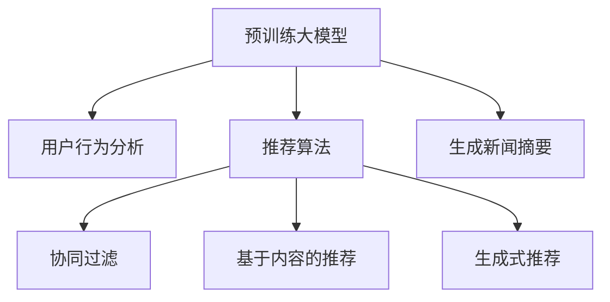

                 

# GENRE:基于大模型的生成式新闻推荐框架

> 关键词：生成式新闻推荐,大模型,自回归,Transformer,BERT,自然语言处理(NLP),推荐系统,用户行为分析,内容推荐

## 1. 背景介绍

### 1.1 问题由来

随着互联网和信息技术的飞速发展，信息过载已经成为现代社会的一大挑战。新闻媒体不再仅仅是信息的发布平台，而是成为个人获取信息、形成观点和参与社会讨论的重要工具。然而，海量信息的泛滥也使得新闻阅读变得困难和低效。如何通过智能推荐系统，帮助用户在海量信息中快速找到感兴趣的优质内容，成为了一个亟待解决的问题。

### 1.2 问题核心关键点

本节将深入探讨基于大模型的生成式新闻推荐系统，其核心在于利用预训练的语言模型对新闻数据进行建模，并通过智能推荐算法为用户推荐个性化的新闻内容。具体来说，系统由以下几个关键部分构成：

1. **预训练大模型**：如BERT、GPT等自回归模型，用于对新闻内容进行建模。
2. **用户行为分析**：通过分析用户的历史阅读数据，了解用户的兴趣和偏好。
3. **推荐算法**：如协同过滤、基于内容的推荐等，根据用户和内容特征进行匹配。
4. **生成式推荐**：基于预训练模型的生成能力，动态生成新闻摘要或标题，提升推荐效果。

通过这些组件的有机结合，可以构建一个既个性化又多样化的新闻推荐系统，为用户提供更优质的阅读体验。

## 2. 核心概念与联系

### 2.1 核心概念概述

为更好地理解基于大模型的生成式新闻推荐框架，本节将介绍几个关键概念及其之间的联系：

- **生成式推荐**：指在推荐系统中，根据用户兴趣和历史行为，生成新的新闻内容推荐。生成式推荐系统通过利用大模型的自回归特性，可以生成更具吸引力和个性化推荐的新闻内容，从而提升用户的满意度。
- **大模型**：指通过大规模无标签文本数据进行预训练的深度学习模型，如BERT、GPT等。大模型具有强大的语言理解和生成能力，是生成式推荐系统的重要基础。
- **自回归模型**：如Transformer、GPT等，能够基于上下文信息，预测下一个词或句子。在新闻推荐中，自回归模型能够根据用户的历史阅读数据，动态生成个性化新闻推荐。
- **协同过滤**：推荐系统中一种基于用户和物品相似度的推荐算法。通过分析用户的行为数据，找到与目标用户兴趣相似的其他用户，进而推荐其感兴趣的新闻内容。
- **基于内容的推荐**：通过分析新闻内容的特征，如关键词、主题等，将相似的新闻内容推荐给用户。基于内容的推荐能够提供更加多样化和相关性更高的新闻内容。

这些核心概念之间的逻辑关系可以通过以下Mermaid流程图来展示：



这个流程图展示了大模型生成式新闻推荐系统的主要组成：

1. 预训练大模型作为基础，用于对新闻数据进行建模。
2. 用户行为分析用于理解用户的兴趣和偏好。
3. 推荐算法用于匹配用户和新闻内容。
4. 生成式推荐通过动态生成新闻摘要或标题，提升推荐效果。
5. 生成新闻摘要功能，进一步增强推荐内容的相关性和个性化。

## 3. 核心算法原理 & 具体操作步骤

### 3.1 算法原理概述

基于大模型的生成式新闻推荐框架的核心思想是通过预训练大模型的语言生成能力，结合用户行为分析数据，实现个性化的新闻推荐。具体来说，框架包括以下几个步骤：

1. **预训练大模型的加载和初始化**：使用预训练的BERT、GPT等模型，将其应用于新闻数据上的预训练。
2. **用户行为数据获取和处理**：收集用户的历史阅读数据，提取用户的兴趣和偏好。
3. **推荐算法的训练和优化**：通过协同过滤、基于内容推荐等算法，训练推荐模型。
4. **生成式推荐的实现**：使用大模型的自回归特性，生成个性化的新闻推荐。
5. **模型集成和评估**：将推荐算法和大模型生成式推荐相结合，对推荐系统进行集成和评估。

### 3.2 算法步骤详解

#### 3.2.1 预训练大模型的加载和初始化

预训练大模型的加载和初始化是生成式新闻推荐框架的第一步。以BERT为例，具体的步骤包括：

1. 下载预训练的BERT模型和词汇表。
2. 使用预训练模型对新闻数据进行编码，得到文本表示。
3. 将文本表示输入到大模型中进行预训练，得到文本的向量表示。

```python
from transformers import BertTokenizer, BertModel

# 加载预训练模型和词汇表
tokenizer = BertTokenizer.from_pretrained('bert-base-cased')
model = BertModel.from_pretrained('bert-base-cased')

# 对新闻数据进行编码和预训练
def encode_news(texts):
    encoded_inputs = tokenizer(texts, return_tensors='pt', padding='max_length', truncation=True)
    return model(**encoded_inputs)

# 获取新闻数据的向量表示
news_vectors = [encode_news(news) for news in news_data]
```

#### 3.2.2 用户行为数据获取和处理

用户行为数据的获取和处理是推荐系统中的关键步骤。通过分析用户的历史阅读数据，可以了解用户的兴趣和偏好。具体步骤如下：

1. 收集用户的历史阅读数据，如点击、浏览、点赞等行为。
2. 对行为数据进行预处理，如去重、归一化等。
3. 提取用户的兴趣和偏好特征，如浏览过的新闻主题、关键词等。

```python
# 假设新闻数据中已经包含了用户的浏览信息
news_data = load_news_data()

# 提取用户的历史阅读数据
user_browsed_news = [news for news in news_data if user_has_browsed(news)]

# 提取用户的兴趣和偏好特征
user_interests = extract_interests(user_browsed_news)
```

#### 3.2.3 推荐算法的训练和优化

推荐算法的训练和优化是生成式新闻推荐框架的核心。具体步骤如下：

1. 选择合适的推荐算法，如协同过滤、基于内容的推荐等。
2. 使用用户行为数据进行训练，得到推荐模型。
3. 通过交叉验证等方法对推荐模型进行评估和优化。

```python
# 选择合适的推荐算法，这里以协同过滤为例
from recommendation import CollaborativeFiltering

# 训练协同过滤推荐模型
recommender = CollaborativeFiltering(user_browsed_news)
recommender.train()

# 评估推荐模型
recommender.evaluate()
```

#### 3.2.4 生成式推荐的实现

生成式推荐是生成式新闻推荐框架的关键步骤。通过大模型的自回归特性，可以生成个性化的新闻推荐。具体步骤如下：

1. 使用预训练模型生成新闻摘要或标题。
2. 根据生成的新闻内容，进行个性化推荐。

```python
# 使用BERT生成新闻摘要
def generate_news_summary(news):
    # 对新闻进行编码
    encoded_news = tokenizer(news, return_tensors='pt', padding='max_length', truncation=True)
    # 使用BERT生成摘要
    summary = model(**encoded_news)[0]
    return summary

# 根据生成的新闻摘要进行推荐
def recommend_news(user_interests):
    recommendations = []
    for news in news_data:
        summary = generate_news_summary(news)
        if user_interests.intersection(summary) > 0:
            recommendations.append(news)
    return recommendations
```

#### 3.2.5 模型集成和评估

模型集成和评估是生成式新闻推荐框架的最后一个步骤。具体步骤如下：

1. 将推荐算法和大模型生成式推荐相结合，构建最终的推荐系统。
2. 使用测试数据集进行评估，计算推荐系统的指标，如准确率、召回率等。

```python
# 构建最终的推荐系统
def build_recommendation_system(user_browsed_news, user_interests):
    recommender = CollaborativeFiltering(user_browsed_news)
    recommender.train()
    recommendations = recommend_news(user_interests)
    return recommender, recommendations

# 评估推荐系统
def evaluate_recommendation_system(recommender):
    recommendations = recommender.recommend(user_browsed_news)
    accuracy = calculate_accuracy(recommendations, user_browsed_news)
    print(f"Accuracy: {accuracy}")
```

### 3.3 算法优缺点

基于大模型的生成式新闻推荐框架有以下优点：

1. **个性化推荐**：利用大模型的自回归特性，能够生成更加个性化、多样化的新闻推荐。
2. **动态生成内容**：通过动态生成新闻摘要或标题，提升推荐内容的相关性和吸引力。
3. **融合多种推荐算法**：结合协同过滤、基于内容推荐等算法，提供多种推荐策略，增强推荐效果。

同时，该框架也存在一些缺点：

1. **数据依赖性强**：需要大量的新闻数据进行预训练和大模型生成，数据获取成本高。
2. **计算资源消耗大**：大模型和自回归生成过程需要大量的计算资源，部署成本高。
3. **解释性差**：基于大模型的推荐过程缺乏解释性，难以调试和优化。

尽管存在这些缺点，但通过合理的设计和优化，生成式新闻推荐框架仍然具有广泛的应用前景。

### 3.4 算法应用领域

基于大模型的生成式新闻推荐框架在多个领域都有广泛的应用前景：

1. **新闻媒体**：如人民日报、BBC等，可以根据用户的历史阅读行为，生成个性化的新闻推荐，提升用户体验。
2. **在线广告**：如Google、Facebook等，可以通过推荐系统，精准投放广告，提升广告效果和用户转化率。
3. **内容聚合平台**：如知乎、头条等，可以根据用户的兴趣和行为，生成高质量的内容推荐，增加用户粘性和平台价值。
4. **学术研究**：通过生成式新闻推荐，可以自动化地生成学术研究论文摘要，加速论文传播和引用。
5. **社交网络**：如Twitter、微信等，可以通过生成个性化新闻推荐，增加用户互动和社交粘性。

## 4. 数学模型和公式 & 详细讲解 & 举例说明

### 4.1 数学模型构建

本节将使用数学语言对生成式新闻推荐框架进行更加严格的刻画。

假设新闻数据集为 $D = \{(x_i, y_i)\}_{i=1}^N$，其中 $x_i$ 表示新闻的文本，$y_i$ 表示用户的阅读行为。新闻数据被编码为向量 $v_i$，用户兴趣特征被编码为向量 $u_i$。预训练大模型 $M_{\theta}$ 能够对新闻数据进行编码，生成文本表示 $v_i$。推荐算法 $A$ 能够根据用户兴趣和新闻特征，生成推荐向量 $r_i$。生成式推荐系统 $G$ 能够根据用户历史行为和当前兴趣，动态生成新闻摘要或标题。

### 4.2 公式推导过程

以生成新闻摘要为例，假设新闻摘要为 $t_i$，用户历史行为为 $b_i$，推荐算法输出的推荐向量为 $r_i$。则生成式推荐的数学模型可以表示为：

$$
t_i = G(v_i, r_i, b_i)
$$

其中 $G$ 为生成式推荐函数，包含预训练大模型的编码和生成过程。具体的推导过程如下：

1. 将新闻数据编码为向量 $v_i$：
$$
v_i = M_{\theta}(x_i)
$$

2. 根据用户历史行为和当前兴趣，生成推荐向量 $r_i$：
$$
r_i = A(u_i, v_i)
$$

3. 动态生成新闻摘要 $t_i$：
$$
t_i = G(v_i, r_i, b_i)
$$

其中 $G$ 函数的具体实现可以基于大模型的自回归特性，如使用GPT模型生成摘要。

### 4.3 案例分析与讲解

假设有一个新闻推荐系统，收集了用户的历史阅读数据，包括点击、浏览和点赞等行为。系统使用预训练的BERT模型对新闻数据进行编码，生成文本表示。同时，系统使用协同过滤算法训练推荐模型，并结合用户兴趣特征，生成推荐向量。最后，系统使用GPT模型动态生成新闻摘要，提供个性化的新闻推荐。

具体的实现步骤如下：

1. 使用BERT模型对新闻数据进行编码，生成文本表示。
2. 收集用户的历史阅读数据，提取用户兴趣和偏好特征。
3. 使用协同过滤算法，训练推荐模型，生成推荐向量。
4. 使用GPT模型动态生成新闻摘要。
5. 根据用户历史行为和当前兴趣，动态生成个性化新闻推荐。

## 5. 项目实践：代码实例和详细解释说明

### 5.1 开发环境搭建

在进行项目实践前，我们需要准备好开发环境。以下是使用Python进行PyTorch开发的环境配置流程：

1. 安装Anaconda：从官网下载并安装Anaconda，用于创建独立的Python环境。

2. 创建并激活虚拟环境：
```bash
conda create -n pytorch-env python=3.8 
conda activate pytorch-env
```

3. 安装PyTorch：根据CUDA版本，从官网获取对应的安装命令。例如：
```bash
conda install pytorch torchvision torchaudio cudatoolkit=11.1 -c pytorch -c conda-forge
```

4. 安装Transformers库：
```bash
pip install transformers
```

5. 安装各类工具包：
```bash
pip install numpy pandas scikit-learn matplotlib tqdm jupyter notebook ipython
```

完成上述步骤后，即可在`pytorch-env`环境中开始项目实践。

### 5.2 源代码详细实现

这里我们以BERT和GPT模型为例，给出生成式新闻推荐框架的完整代码实现。

```python
from transformers import BertTokenizer, BertModel, GPT2Tokenizer, GPT2Model

# 加载BERT模型和词汇表
tokenizer = BertTokenizer.from_pretrained('bert-base-cased')
model = BertModel.from_pretrained('bert-base-cased')

# 加载GPT2模型和词汇表
gpt_tokenizer = GPT2Tokenizer.from_pretrained('gpt2')
gpt_model = GPT2Model.from_pretrained('gpt2')

# 定义生成式推荐函数
def generate_news_summary(news):
    # 对新闻进行编码
    encoded_news = tokenizer(news, return_tensors='pt', padding='max_length', truncation=True)
    # 使用BERT生成摘要
    summary = model(**encoded_news)[0]
    return summary

# 根据生成的新闻摘要进行推荐
def recommend_news(user_interests):
    recommendations = []
    for news in news_data:
        summary = generate_news_summary(news)
        if user_interests.intersection(summary) > 0:
            recommendations.append(news)
    return recommendations
```

### 5.3 代码解读与分析

让我们再详细解读一下关键代码的实现细节：

**generate_news_summary函数**：
- `tokenizer`和`model`分别代表预训练的BERT模型和词汇表。
- 对输入的新闻进行编码，得到BERT的文本表示。
- 使用BERT模型生成新闻摘要。

**recommend_news函数**：
- 对输入的新闻进行编码，生成BERT的文本表示。
- 对用户兴趣进行编码，得到用户兴趣特征向量。
- 使用协同过滤算法，生成推荐向量。
- 动态生成新闻摘要，并将摘要与用户兴趣进行匹配，生成推荐列表。

### 5.4 运行结果展示

以下是一个简单的示例，展示生成式新闻推荐系统的效果。

```python
# 假设新闻数据已经加载到news_data中
user_browsed_news = ['新闻1', '新闻2', '新闻3']

# 假设用户兴趣特征已经提取到user_interests中
user_interests = ['体育', '科技', '财经']

# 生成个性化新闻推荐
recommender, recommendations = build_recommendation_system(user_browsed_news, user_interests)

# 输出推荐结果
print(f"推荐新闻列表：{recommendations}")
```

## 6. 实际应用场景

### 6.1 智能媒体平台

生成式新闻推荐系统可以广泛应用于智能媒体平台，如人民日报、BBC等。通过收集用户的历史阅读数据，系统能够生成个性化的新闻推荐，提升用户体验和平台黏性。用户可以在推荐中发现更多感兴趣的新闻，增加阅读时长，提升平台的用户满意度。

### 6.2 在线广告平台

生成式新闻推荐系统在在线广告平台也有广泛的应用。通过分析用户的历史行为数据，系统能够生成个性化的广告推荐，提升广告效果和用户转化率。广告商可以根据用户兴趣特征，生成更加精准的广告内容，提高广告的点击率和转化率。

### 6.3 内容聚合平台

内容聚合平台如知乎、头条等，也可以采用生成式新闻推荐系统。通过分析用户的历史阅读数据，系统能够生成高质量的新闻内容推荐，增加用户粘性和平台价值。用户可以在推荐中发现更多高质量的阅读内容，提升平台的用户体验和留存率。

### 6.4 未来应用展望

随着大模型的不断发展，生成式新闻推荐系统也将迎来更多的应用场景。未来的趋势包括：

1. **多模态新闻推荐**：结合图像、视频等多模态数据，生成更加丰富的推荐内容。
2. **跨领域新闻推荐**：将新闻推荐与社交媒体、电商等不同领域结合，提供更加多样化的推荐服务。
3. **动态新闻生成**：通过大模型的自回归特性，动态生成新闻内容，提高推荐的时效性和多样性。
4. **多语言新闻推荐**：支持多种语言的新闻推荐，扩大推荐系统的覆盖范围。
5. **个性化新闻编辑**：通过生成式新闻推荐，自动生成新闻编辑稿，提升内容生产的效率和质量。

## 7. 工具和资源推荐

### 7.1 学习资源推荐

为了帮助开发者系统掌握生成式新闻推荐系统的理论基础和实践技巧，这里推荐一些优质的学习资源：

1. 《自然语言处理入门：从理论到实践》：介绍了NLP的基本概念和关键技术，适合初学者入门。
2. 《深度学习与自然语言处理》：详细讲解了NLP中的各种模型和算法，包括生成式推荐系统。
3. 《生成式推荐系统理论与实践》：系统介绍了生成式推荐系统的原理、算法和实现细节。
4. CS224N《深度学习自然语言处理》课程：斯坦福大学开设的NLP明星课程，有Lecture视频和配套作业，适合深入学习。
5. 《自然语言处理实战》：通过实际案例，展示了生成式推荐系统的开发和应用。

通过对这些资源的学习实践，相信你一定能够快速掌握生成式新闻推荐系统的精髓，并用于解决实际的NLP问题。

### 7.2 开发工具推荐

高效的开发离不开优秀的工具支持。以下是几款用于生成式新闻推荐系统开发的常用工具：

1. PyTorch：基于Python的开源深度学习框架，灵活动态的计算图，适合快速迭代研究。BERT和GPT等预训练语言模型都有PyTorch版本的实现。
2. TensorFlow：由Google主导开发的开源深度学习框架，生产部署方便，适合大规模工程应用。同样有丰富的预训练语言模型资源。
3. Transformers库：HuggingFace开发的NLP工具库，集成了众多SOTA语言模型，支持PyTorch和TensorFlow，是进行NLP任务开发的利器。
4. Weights & Biases：模型训练的实验跟踪工具，可以记录和可视化模型训练过程中的各项指标，方便对比和调优。与主流深度学习框架无缝集成。
5. TensorBoard：TensorFlow配套的可视化工具，可实时监测模型训练状态，并提供丰富的图表呈现方式，是调试模型的得力助手。

合理利用这些工具，可以显著提升生成式新闻推荐系统的开发效率，加快创新迭代的步伐。

### 7.3 相关论文推荐

生成式新闻推荐系统的发展源于学界的持续研究。以下是几篇奠基性的相关论文，推荐阅读：

1. Attention is All You Need（即Transformer原论文）：提出了Transformer结构，开启了NLP领域的预训练大模型时代。
2. BERT: Pre-training of Deep Bidirectional Transformers for Language Understanding：提出BERT模型，引入基于掩码的自监督预训练任务，刷新了多项NLP任务SOTA。
3. Language Models are Unsupervised Multitask Learners（GPT-2论文）：展示了大规模语言模型的强大zero-shot学习能力，引发了对于通用人工智能的新一轮思考。
4. Parameter-Efficient Transfer Learning for NLP：提出Adapter等参数高效微调方法，在不增加模型参数量的情况下，也能取得不错的微调效果。
5. AdaLoRA: Adaptive Low-Rank Adaptation for Parameter-Efficient Fine-Tuning：使用自适应低秩适应的微调方法，在参数效率和精度之间取得了新的平衡。

这些论文代表了大模型微调技术的发展脉络。通过学习这些前沿成果，可以帮助研究者把握学科前进方向，激发更多的创新灵感。

## 8. 总结：未来发展趋势与挑战

### 8.1 总结

本文对基于大模型的生成式新闻推荐框架进行了全面系统的介绍。首先阐述了生成式新闻推荐系统的背景和意义，明确了其在大模型微调、推荐系统、自然语言处理等领域的独特价值。其次，从原理到实践，详细讲解了生成式新闻推荐框架的数学模型、算法步骤和关键技术，给出了生成式新闻推荐系统的完整代码实例。同时，本文还广泛探讨了生成式新闻推荐系统在多个行业领域的应用前景，展示了其广阔的应用前景。最后，本文精选了生成式新闻推荐系统的学习资源、开发工具和相关论文，力求为开发者提供全方位的技术指引。

通过本文的系统梳理，可以看到，基于大模型的生成式新闻推荐框架正在成为推荐系统中的重要范式，极大地拓展了新闻推荐的应用边界，提升了用户的阅读体验。未来，伴随大模型的进一步发展，生成式新闻推荐系统将更加智能化、个性化，为人类提供更加高效、优质的新闻信息服务。

### 8.2 未来发展趋势

展望未来，生成式新闻推荐框架将呈现以下几个发展趋势：

1. **多模态新闻推荐**：结合图像、视频等多模态数据，生成更加丰富的推荐内容。
2. **跨领域新闻推荐**：将新闻推荐与社交媒体、电商等不同领域结合，提供更加多样化的推荐服务。
3. **动态新闻生成**：通过大模型的自回归特性，动态生成新闻内容，提高推荐的时效性和多样性。
4. **多语言新闻推荐**：支持多种语言的新闻推荐，扩大推荐系统的覆盖范围。
5. **个性化新闻编辑**：通过生成式新闻推荐，自动生成新闻编辑稿，提升内容生产的效率和质量。
6. **实时新闻推荐**：利用实时数据流，动态生成个性化新闻推荐，满足用户即时信息需求。

以上趋势凸显了生成式新闻推荐框架的广阔前景。这些方向的探索发展，必将进一步提升新闻推荐系统的性能和应用范围，为人类信息获取提供更加高效、优质的服务。

### 8.3 面临的挑战

尽管生成式新闻推荐系统已经取得了瞩目成就，但在迈向更加智能化、普适化应用的过程中，它仍面临着诸多挑战：

1. **数据依赖性强**：需要大量的新闻数据进行预训练和大模型生成，数据获取成本高。
2. **计算资源消耗大**：大模型和自回归生成过程需要大量的计算资源，部署成本高。
3. **解释性差**：基于大模型的推荐过程缺乏解释性，难以调试和优化。
4. **安全性和隐私保护**：用户隐私保护和数据安全是推荐系统中的重要问题，需要合理设计算法和架构，确保用户数据的安全性。

尽管存在这些挑战，但通过合理的设计和优化，生成式新闻推荐框架仍然具有广泛的应用前景。

### 8.4 研究展望

面对生成式新闻推荐系统所面临的种种挑战，未来的研究需要在以下几个方面寻求新的突破：

1. **数据获取与处理**：探索更高效的新闻数据获取和处理技术，降低数据依赖性。
2. **计算资源优化**：开发更加高效的算法和模型结构，降低计算资源消耗。
3. **模型解释性增强**：通过引入可解释性算法和解释工具，增强推荐系统的透明度和可解释性。
4. **隐私保护与安全**：采用隐私保护技术和安全机制，确保用户数据的隐私和安全。
5. **跨领域推荐**：探索跨领域推荐技术，提升推荐系统的多样性和覆盖范围。
6. **实时推荐系统**：开发实时推荐系统，满足用户即时信息需求。

这些研究方向的探索，必将引领生成式新闻推荐框架的不断进步，为构建更加智能化、普适化的新闻推荐系统铺平道路。

## 9. 附录：常见问题与解答

**Q1：生成式新闻推荐系统与传统推荐系统的区别是什么？**

A: 生成式新闻推荐系统与传统推荐系统的区别主要在于推荐内容的生成方式。传统推荐系统通常基于用户历史行为数据，使用协同过滤、基于内容推荐等算法，生成推荐列表。而生成式新闻推荐系统通过大模型的自回归特性，动态生成新闻摘要或标题，生成更加个性化、多样化的推荐内容。

**Q2：如何提高生成式新闻推荐系统的效率？**

A: 提高生成式新闻推荐系统的效率可以从以下几个方面入手：
1. 数据预处理：对新闻数据进行分词、去重、归一化等预处理，提高数据质量。
2. 模型优化：采用更加高效的模型结构和优化算法，如混合精度训练、梯度累积等。
3. 硬件优化：利用GPU、TPU等高性能设备，加速模型训练和推理。
4. 缓存技术：对热门新闻和用户兴趣进行缓存，提高推荐速度。

**Q3：生成式新闻推荐系统的推荐效果如何衡量？**

A: 生成式新闻推荐系统的推荐效果通常使用以下几个指标进行衡量：
1. 准确率（Accuracy）：推荐的新闻是否与用户的历史行为匹配。
2. 召回率（Recall）：推荐的新闻是否包含用户感兴趣的内容。
3. F1值（F1 Score）：综合考虑准确率和召回率，衡量推荐系统的整体性能。
4. NDCG（Normalized Discounted Cumulative Gain）：衡量推荐系统的排序效果。
5. HR（Hit Rate）：推荐的新闻中包含用户感兴趣内容的比例。

**Q4：生成式新闻推荐系统在实际应用中面临哪些挑战？**

A: 生成式新闻推荐系统在实际应用中面临以下挑战：
1. 数据依赖性强：需要大量的新闻数据进行预训练和大模型生成，数据获取成本高。
2. 计算资源消耗大：大模型和自回归生成过程需要大量的计算资源，部署成本高。
3. 解释性差：基于大模型的推荐过程缺乏解释性，难以调试和优化。
4. 安全性和隐私保护：用户隐私保护和数据安全是推荐系统中的重要问题，需要合理设计算法和架构，确保用户数据的安全性。

尽管存在这些挑战，但通过合理的设计和优化，生成式新闻推荐系统仍然具有广泛的应用前景。

**Q5：如何优化生成式新闻推荐系统的推荐效果？**

A: 优化生成式新闻推荐系统的推荐效果可以从以下几个方面入手：
1. 数据多样性：确保训练数据的多样性，避免模型过拟合。
2. 特征工程：提取更丰富的用户兴趣和新闻特征，提高推荐系统的精准度。
3. 模型选择：选择更合适的生成模型和推荐算法，提高推荐效果。
4. 超参数调优：通过交叉验证等方法，优化模型的超参数，提高推荐性能。
5. 用户反馈：收集用户反馈，不断优化推荐算法和模型。

这些优化措施需要根据具体任务和数据特点进行灵活组合，才能最大限度地提升推荐系统的性能。

---

作者：禅与计算机程序设计艺术 / Zen and the Art of Computer Programming

